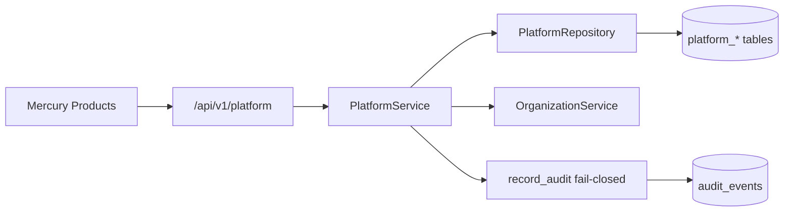
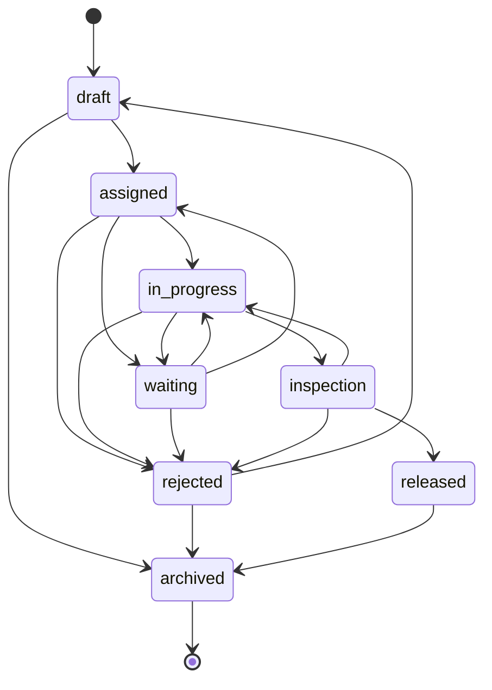

# Platform Overview — Program A Foundation

Mercury’s shared **Enterprise Platform Foundation** (`backend/app/platform/`) is the reusable substrate for every Mercury product (MRO, CAMO, Airline, OEM, Marketplace, Authority, Careers, Academy, AI, Mobile, Executive, Connect, Digital Twin).

Domain modules must **not** re-implement identity, RBAC engines, audit, notifications, workflow, file metadata, search indexing, or configuration.

## Modules

| Module | Responsibility | Primary tables |
|--------|----------------|----------------|
| Identity | API keys, PATs, MFA enrollment (SSO-ready) | `platform_api_keys`, `platform_pats`, `platform_mfa_enrollments` |
| Organization extensions | Business units, cost centers, facilities (hangar/shop/station) | `platform_business_units`, `platform_cost_centers`, `platform_facilities` |
| RBAC extensions | Role templates, custom roles, temporary access, permission audit | `platform_role_templates`, `platform_custom_roles`, `platform_temporary_access`, `platform_permission_audits` |
| Workflow engine | Generic, data-driven states/transitions (designer-ready) | `platform_workflow_definitions`, `platform_workflow_instances`, `platform_workflow_transition_logs` |
| Notifications | Event-driven multi-channel queue | `platform_notifications` |
| Audit | Fail-closed via central `record_audit` (never bypassed) | `audit_events` (+ permission ledger) |
| Files | Versioned metadata, hash, virus-scan status | `platform_file_objects` |
| Search | Org-scoped global document index | `platform_search_documents` |
| Configuration | Settings, feature flags, licensing/regional | `platform_settings`, `platform_feature_flags`, `platform_org_feature_flags` |
| API platform | REST under `/api/v1/platform`, OpenAPI via FastAPI | — |

## Service diagram

## Workflow states (default definition `enterprise.default`)

Definitions store `states_json` / `transitions_json` so a future workflow designer UI can edit without engine changes. Domain modules bind via `(entity_type, entity_id)`.

## Permission matrix (session roles)

| Permission | Administrator | Operator | Reviewer | Viewer |
|------------|---------------|----------|----------|--------|
| `platform.read` | ✓ | ✓ | ✓ | ✓ |
| `platform.manage` | ✓ | ✓ | — | — |

Fine-grained aviation personas remain documented in [RBAC.md](RBAC.md). Custom roles and temporary access are stored in platform tables and audited; runtime persona overlay enforcement remains a near-term roadmap item.

## Enterprise NFRs

- Multi-tenant org isolation on every query
- Soft delete on facilities / roles / files
- Fail-closed audit on mutations
- API-first `/api/v1/platform/*`
- Alembic `20260813_0012`
- Horizontal scale ready (stateless API; shared session store still deferred)
- Background worker / event-bus hooks: notification `pending` queue + feature flags

## Related

- [ARCHITECTURE.md](../ARCHITECTURE.md)
- ADR: Platform Foundation as shared AEOS substrate
- Migration: `backend/alembic/versions/20260813_0012_platform_foundation.py`
