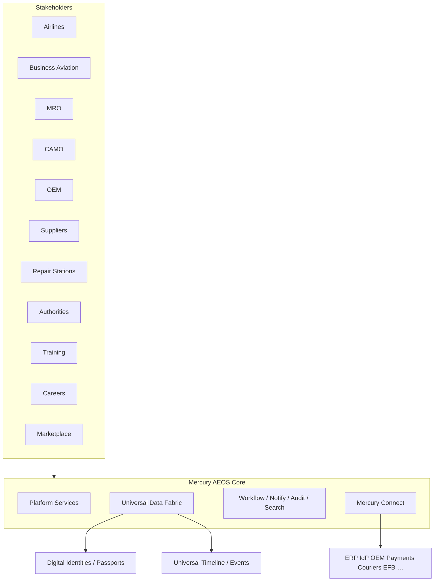

# Mercury Aviation Digital Ecosystem (Program 12)

Mercury is an **Aviation Enterprise Operating System (AEOS)**. Stakeholders operate on one secure platform with **strict tenant isolation** and **organization data ownership**.

## Architecture summary

| Layer | Package / API | Role |
|-------|---------------|------|
| Ecosystem maps | `backend/app/ecosystem/` `/api/v1/ecosystem` | Stakeholder ecosystems + capabilities + enrollments |
| Mercury Connect | `backend/app/connect/` `/api/v1/connect` | Integration connector catalog + org bindings |
| Digital identities | Program 11 `fabric` passports | Permanent DID per object |
| Universal timeline | `fabric_events` | Immutable enterprise timeline |
| Platform | Program A `platform` | Identity, RBAC, workflow, notify, files, search, config |

## Domain summary

| Ecosystem | Capability highlights | Readiness |
|-----------|----------------------|-----------|
| Airline | Fleet, Mx, Engineering, Planning, Stores, Quality… | Mix ready/partial/planned |
| Business Aviation | Operators, Charter, Corporate FD, Fractional, VIP | ready→planned |
| MRO | Production shops, NDT, Calibration, Tech Records… | mostly ready/partial |
| CAMO | AMP, AD/SB/EO, Forecast, Pubs, Configuration | mostly ready |
| OEM | Portal, Models, AMM/IPC/…, SB, Warranty, Manuals | ready→planned |
| Supplier | Parts, Rotables, Tools, Cal, Pubs | mostly ready |
| Repair Station | AMO, Ratings, Quotes, Tracking, Certificates | ready→planned |
| Authority | TC/FAA/EASA/CAA/ICAO + future oversight | architecture only — **no regulatory claims** |
| Training / Careers / Marketplace | Courses, profiles, listings, contracts | ready→planned |

## Relationship model

- **Org ↔ Ecosystem** via `ecosystem_enrollments` (`isolation_mode=strict_tenant`, `data_ownership=organization`)
- **Ecosystem ↔ Capability** via `ecosystem_capabilities` with `domain_refs` and `fabric_entity_types`
- **Capability ↔ Fabric passport types** for Digital Thread joins
- **Org ↔ Connectors** via `connect_bindings` (secrets only as `config_ref` vault pointers)

## Universal Digital Identities & Timeline

Reuse Program 11:

- Identities = Digital Passports (`did:mercury:…`) for aircraft, engine, APU, component, person, org, tool, WO, job card, finding, listing, …
- Timeline = `fabric_events` (installed → inspected → released → …) — append-oriented, audited

## Enterprise requirements mapping

| Requirement | Implementation |
|-------------|----------------|
| Multi-tenancy | Org isolation on enrollments/bindings + fabric |
| RBAC | `ecosystem.*` `connect.*` + platform RBAC |
| Audit | AuditEngine on enroll/bind |
| Digital signatures | Existing maintenance/personnel signature services |
| Versioning | Fabric passport history + publication revisions |
| API first | `/api/v1/ecosystem`, `/api/v1/connect` |
| Workflow / Notify / Search / Thread / Fabric / AI / Marketplace / Authority readiness | Prior programs + this catalog |

## Migration

Alembic **`20260814_0015`** — ecosystem_* + connect_* tables.

## Related

- [PRODUCT_PORTFOLIO.md](PRODUCT_PORTFOLIO.md)
- [MERCURY_CONNECT.md](MERCURY_CONNECT.md)
- [ECOSYSTEM_SEQUENCE.md](ECOSYSTEM_SEQUENCE.md)
- [ECOSYSTEM_PRODUCTION_READINESS.md](ECOSYSTEM_PRODUCTION_READINESS.md)
- ADR-0012
