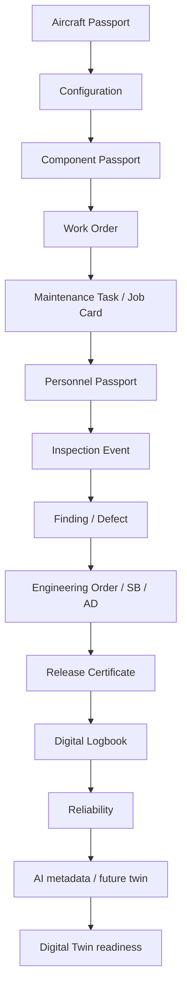

# Digital Thread

The Digital Thread is the traversable chain of Digital Passports and fabric relationships that answers cross-domain aviation questions without leaving Mercury.

## Canonical spine

## Runtime

- **Nodes:** `fabric_passports`
- **Edges:** `fabric_relationships` (`installed_on`, `performed_on`, `assigned_to`, `finding_of`, `references`, …)
- **Timeline:** `fabric_events` (`installed`, `released`, `signed`, `approved`, …)
- **API:** `GET /api/v1/fabric/passports/{id}/thread?max_depth=4`

## Rules

1. Domain modules remain source of truth for business fields.
2. Thread edges are passport-to-passport (never raw cross-table FKs alone).
3. Cross-organization links set `cross_organization=true` and are audited.
4. AI / Digital Twin consume passport + event metadata — they do not invent joins.
