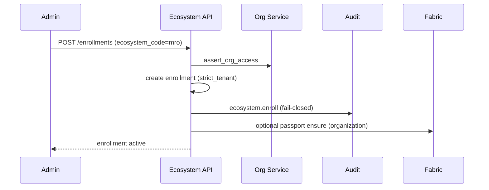

# Ecosystem sequence — tenant joins AEOS stakeholder role

```mermaid
sequenceDiagram
  participant Admin
  participant Ecosystem API
  participant Org Service
  participant Audit
  participant Fabric
  Admin->>Ecosystem API: POST /enrollments (ecosystem_code=mro)
  Ecosystem API->>Org Service: assert_org_access
  Ecosystem API->>Ecosystem API: create enrollment (strict_tenant)
  Ecosystem API->>Audit: ecosystem.enroll (fail-closed)
  Ecosystem API->>Fabric: optional passport ensure (organization)
  Ecosystem API-->>Admin: enrollment active
```

Capability enablement selects which domain packages and fabric entity types the tenant may activate without crossing tenant boundaries.
