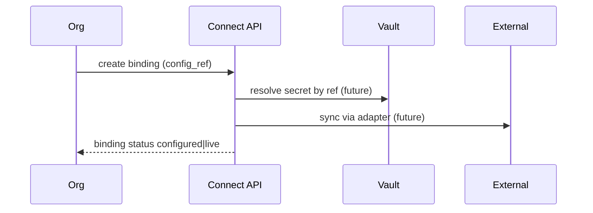

# Mercury Connect

Universal integration platform for AEOS.

## Connector categories

ERP · Accounting · Identity (OIDC/Azure AD/Okta/LDAP) · OEM systems · Payment · Courier · Email · SMS · Object storage · Weather · Flight Operations · EFB

## Design rules

1. Connectors are **catalogued** in `connect_connectors` (readiness contracts).
2. Org bindings store **metadata + vault refs only** — never raw secrets in DB.
3. Runtime providers (mock flight/weather today) remain under `backend/app/connectors/`; Connect is the enterprise registry above them.
4. Future live adapters plug into Event Framework + Audit Engine.

## API

- `GET /api/v1/connect/connectors`
- `GET /api/v1/connect/overview`
- `POST /api/v1/connect/bindings`
- `GET /api/v1/connect/bindings`

## Data flow

