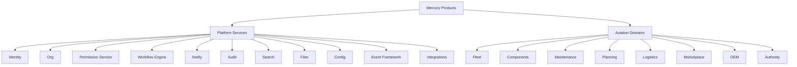

# Production Readiness Report — AEOS Architecture Standardization

**Date:** 2026-08-14  
**Scope:** Complete architecture review + additive platform/domain standardization  
**Commit:** not created (per instruction)

## 1. Architecture review (verdict)

Mercury is correctly evolving from MRO point software into an **Aviation Enterprise Operating System** on a FastAPI + vanilla JS modular monolith. Program A platform services, org isolation, and logistics integration are real foundations. The primary risks were **duplicated event buses**, **hardcoded job-card transitions**, **missing readiness domains** for Marketplace/OEM/Authority, and **incomplete shared primitives** (ActorContext, permission overlays, audit facade).

**Verdict:** Production-ready as an AEOS *foundation* for continued product expansion. Not certified aviation/regulatory software. Not multi-worker HA without shared sessions.

## 2. Technical debt discovered

| ID | Debt | Severity | Disposition |
|----|------|----------|-------------|
| TD-1 | Dual event buses (`core.event_bus` vs `events.bus`) | High | Unified via Event Framework; `events/` is shim |
| TD-2 | Job-card transitions hardcoded in work_orders | High | Runtime resolve via WorkflowBridge + seeded definition |
| TD-3 | ActorContext duplicated (platform/logistics) | Medium | Canonical in `shared/` |
| TD-4 | Temporary access not merged into request auth | Medium | PermissionService added; routers still mostly session-role |
| TD-5 | Domain status machines (logistics PO, etc.) still local | Medium | Bridge pattern ready; incremental migration |
| TD-6 | File platform is metadata-only (no blob store) | Medium | Deferred intentionally |
| TD-7 | MFA/SSO/SCIM/LDAP readiness only | Medium | Integration Framework contracts seeded |
| TD-8 | Physical folder tree ≠ logical AEOS tree | Low | Documented mapping; no big-bang move |
| TD-9 | AI advisory packages separate from search metadata | Low | `ai_metadata_json` added; no LLM |

## 3. Refactoring completed

- `backend/app/shared/` — ActorContext, pagination helpers
- `platform/audit_engine.py`, `permission_service.py`, `event_framework.py`, `integration_framework.py`, `workflow_bridge.py`
- Event bus shim: `events/bus.py` → Event Framework
- Job card `/transition` uses workflow engine definitions
- Domains: `marketplace/`, `oem/`, `authority/` with seed + APIs
- Search documents: `ai_metadata_json` for AI readiness
- Permissions: `marketplace.*`, `oem.read`, `authority.read`
- Alembic `20260814_0013`
- Docs under `docs/architecture/` + ADR-0010

## 4. Diagrams

See [PLATFORM_OVERVIEW.md](../PLATFORM_OVERVIEW.md) and canvas `aeos-architecture-review`.

## 5. Documentation updates

- `docs/architecture/DOMAIN_MODEL.md`
- `docs/architecture/STRUCTURE.md`
- `docs/architecture/PRODUCTION_READINESS.md` (this file)
- ADR-0010 AEOS structure standardization
- README / ARCHITECTURE / ROADMAP / CHANGELOG updates

## 6. Test summary

**434 passed** (full `backend/` suite after AEOS standardization), including `test_aeos_architecture.py`, platform, logistics, planning, and work-order suites.

## 7. Future recommendations

1. Merge PermissionService into all domain routers (temp access / custom roles live)
2. Migrate logistics PO/MR status machines onto WorkflowBridge
3. Dual-write remaining cert-gated job-card paths onto workflow instances
4. Object store + virus-scan workers for File Service
5. Redis session store + Redis/NATS for Event Framework
6. OIDC/Azure AD/Okta adapters behind Integration Framework
7. SCIM provisioning for enterprise IdP sync
8. Physical package aliases only after import graph is frozen
9. Executive/Analytics product APIs on reporting spine
10. Never claim Authority regulatory approval in product copy

## Compatibility

Backward compatible: existing `/api/v1/*` domain routes preserved. Additive routes only for marketplace/oem/authority/platform integrations.
