# Changelog — Mercury Enterprise Blueprint

| Field | Value |
|-------|-------|
| Document | Blueprint change history |
| Scope | `mercury-enterprise-blueprint/` — Mercury Technologies founding blueprint |
| Format | Adapted from Keep a Changelog; grouped as Added, Changed, Aligned, Clarified, Security, Governance |
| Versioning | Blueprint baselines are dated and named. Blueprint versions are independent of runtime package versions. |
| Related | [ROADMAP.md](ROADMAP.md) · [VISION.md](VISION.md) · [CONTRIBUTING.md](CONTRIBUTING.md) |

---

## Purpose

This changelog records **how the founding blueprint of Mercury Technologies came to say what it says**. It has two jobs:

1. Preserve the decision trail behind the blueprint, so future contributors inherit reasoning rather than only conclusions.
2. Record **alignment events** — points at which the blueprint was reconciled against delivered runtime capability, specifically Mercury Enterprise Sprints 5 through 9 and Program B enterprise logistics.

An entry is required for any change beyond a typographical correction. Entries never assert runtime capability that does not exist; where an entry documents intent, it says so.

Runtime application changes are recorded in the runtime repository's own changelog. This file records the blueprint.

---

## [Baseline 1.1.0] — Architectural Constitution Expansion

### Added
- Product Vision, Product Line Strategy, and **sixteen** product definition sheets under `docs/05_Product/products/`
- Industries overview covering airlines, BA, cargo, military (future), helicopters, UAV, eVTOL, manufacturers, MRO, CAMO, FBO, leasing, authorities, training
- Platform set (`docs/10_Platform/`): DDD, Digital Airworthiness Passport, Marketplace, Zero Trust, Plugin, Aircraft Lifecycle, AI Platform
- Standards: Naming, Release, Deployment, Quality, Test, PRD, Database, Multi-Tenant, Marketplace, Supplier Verification, Authority Integration, Certification Workflow, Electronic Logbook, Maintenance Task, Technical Library, OEM Integration
- 10-Year Future Vision; Operations index; README constitution checklist (40 topics)

### Clarified
- Repository framed as the company **architectural constitution** (not application code)
- Product status honesty: Delivered / Partial / Planned preserved across all new product sheets

---

## [Baseline 1.0.0] — Founding Blueprint

The establishment of the Mercury Technologies blueprint as the Single Source of Truth for the Aviation Enterprise Operating System (AEOS).

### Added — Repository foundation

- **`README.md`** — repository entry point defining Mercury as an Aviation Enterprise Operating System rather than a maintenance, repair and overhaul (MRO) product; stakeholder ecosystem table covering aircraft manufacturers (OEM), airlines, business, cargo and helicopter operators, MRO organizations, continuing airworthiness management organizations (CAMO), component and engine shops, warehouses and suppliers, leasing companies, airport and flight operations, engineering, quality assurance and reliability, finance, human resources and executives, and aviation authorities; declaration of military aviation as a **future** domain; repository map; role-based reading paths; governance and relationship to runtime code.
- **`VISION.md`** — founding statement of record: the fragmentation problem Mercury exists to solve, the vision statement, the definition of AEOS as a platform substrate beneath aviation domain workloads, the eleven non-negotiable core principles, the Digital Thread illustration, value commitments by stakeholder, vision-to-runtime traceability, success measures, five vision horizons, and explicit statements of what Mercury is not.
- **`ROADMAP.md`** — capability sequencing: roadmap principles, delivered runtime foundation mapped sprint by sprint, near-term assurance horizon, mid-term ecosystem horizon, long-term intelligence and regulated-extension horizon, the future multi-service platform shape marked as future rather than current, explicit non-goals, and roadmap governance.
- **`CONTRIBUTING.md`** — contribution and governance guide: ground rules, repository structure and accountable reviewers, the controlled terminology table, document and diagram standards, the Architecture Decision Record (ADR) requirement and template, the contribution workflow, the self-review checklist, the relationship between blueprint changes and runtime code obligations, sensitive-content handling, and planned tooling.
- **`CODE_OF_CONDUCT.md`** — professional and community standards for a safety-adjacent engineering organization, including expected behaviour, unacceptable behaviour, safety-and-integrity specific obligations, scope, reporting, enforcement ladder, and appeal.
- **`SECURITY.md`** — security posture: vulnerability reporting and coordinated disclosure, high-level threat model, multi-tenant organization isolation model, audit posture, secrets management, data protection, dependency and supply-chain practice, explicit statement of what is **not** claimed, and the security roadmap.
- **`CHANGELOG.md`** — this document.

### Added — Executive documentation set

- **`docs/01_Executive/Vision.md`** — the extended executive vision narrative: industry context, the cost of fragmentation, the AEOS thesis, the meaning of One Digital Thread and One Digital Aircraft Passport, the stakeholder ecosystem in depth, principle rationale, the ecosystem and thread diagrams, vision horizons, and measurement.
- **`docs/01_Executive/Mission.md`** — the mission statement, mission pillars, operating commitments, how the mission is executed across the aircraft lifecycle, mission-critical constraints, mission metrics, and what the mission excludes.
- **`docs/01_Executive/Founders_Letter.md`** — the founding letter: why Mercury was started, the observed failure conditions in aviation records, the commitments the founders make to customers, engineers, authorities, and partners, the principles the founders will not trade away, and the standard the company holds itself to.
- **`docs/01_Executive/Company_Strategy.md`** — company strategy: strategic thesis, market structure and segments, positioning, wedge and expansion motion, product strategy, go-to-market, partnership and ecosystem strategy, competitive posture, moat, commercial model, operating model, risk register with mitigations, and strategic horizons.

### Added — Architecture documentation set

- **`docs/02_Architecture/Enterprise_Architecture.md`** — the enterprise view: binding design principles, a TOGAF-flavoured method applied practically rather than ceremonially, the AEOS capability map, the value streams that cross capabilities, business, information, application and technology architecture summaries, cross-cutting concerns, non-functional requirements separating current baseline from aspirational enterprise target, architecture governance, and horizons.
- **`docs/02_Architecture/Domain_Architecture.md`** — the domain view: the domain map, the ubiquitous language table as normative vocabulary, the bounded contexts for organization, fleet and aircraft, configuration and components, publications, personnel and certification, maintenance execution, planning and continuing airworthiness, logistics and stores, and quality and audit — with artificial intelligence and digital twin recorded as future-facing and finance as a capability view — context relationships and integration patterns, cross-domain workflows, and the extraction order that would apply if services ever become necessary.
- **`docs/02_Architecture/System_Context.md`** — the C4 Level 1 system context and container views: actors across operator, maintainer, continuing airworthiness, stores, quality and oversight roles, external systems, trust zones and boundary controls, the data that crosses each boundary, and the single-instance constraint stated as a constraint rather than a preference.
- **`docs/02_Architecture/Technical_Architecture.md`** — the technical view: the layered architecture and the prohibitions that keep each layer honest, the uniform module package pattern, the two independent tenancy and authorization gates plus the third gate that applies to signing, the three defining data flows (job card certification into the technical logbook, the logistics stock movement ledger, and planning through work package generation to material reservation), persistence, consistency and concurrency, the frontend architecture, and an explicitly honest assessment of modular monolith today versus services tomorrow.

### Added — Business domain documentation set

- **`docs/03_Business/OEM.md`**, **`Airline.md`**, **`MRO.md`**, **`CAMO.md`**, **`Authority.md`**, **`Leasing.md`** — one document per stakeholder domain, each following a common shape: purpose, business capabilities, major entities, relationships to other domains, the APIs that serve the domain, the security and isolation posture, the end-to-end workflows the domain performs, and its future roadmap. Authority access is documented as read-scoped, audit-logged, and advisory in posture; approval of records remains the operator's responsibility toward its authority.

### Added — Data documentation set

- **`docs/04_Data/Data_Model.md`** — the conceptual and logical model, cross-cutting conventions, referential integrity posture, immutability and evidence integrity, soft delete and lifecycle, derived and materialized data, and indexing and query patterns.
- **`docs/04_Data/Master_Data.md`** — the ownership and stewardship model, reference catalogues, the distinction between part master and component catalogue, vendor, personnel and organization master data, data quality, and onboarding, migration and deduplication.
- **`docs/04_Data/Digital_Thread.md`** — the authoritative specification of the Digital Thread: the node catalogue, the thread event model, the full edge catalogue, the traversals the thread is built to answer, the **Digital Aircraft Passport** as a projection over the thread, and thread integrity.
- **`docs/04_Data/Knowledge_Graph.md`** — the graph as an overlay over relational truth, why a graph database is not adopted today, the schema-ready structures that exist, the projection model, and provenance and confidence.

### Added — Product documentation set

- **`docs/05_Product/Product_Family.md`** — the module map, dependency order, and each module's standing, distinguishing interface standing from API standing.
- **`docs/05_Product/Editions.md`** — the edition model, the capability matrix, how editions are actually enforced, what is never gated by edition — isolation, audit, and certification integrity are never commercial features — and movement between editions.
- **`docs/05_Product/Pricing_Strategy.md`** — the commercial thesis, pricing principles, value metrics, packaging model, illustrative packaging structures, quoting discipline, and ecosystem participant pricing.

### Added — Security documentation set

- **`docs/06_Security/Identity.md`** — the identity model, authentication, tenancy enforcement, session context and switching, and the separation between platform identity and certification identity that must not collapse.
- **`docs/06_Security/RBAC.md`** — the authorization model, session roles, the permission catalogue, the aviation personas and their current standing as a documented mapping rather than enforced principals, segregation of duties, and the relationship between organization isolation and authorization.
- **`docs/06_Security/Audit.md`** — the audit record, the canonical action catalogue, the fail-closed policy for safety-significant transitions, evidence immutability, querying the trail, and the relationship between audit and the Digital Thread.
- **`docs/06_Security/Digital_Signatures.md`** — what a signature record is, the certification chain, double inspection, ACA certification and aircraft release, publication revision binding, and a section stating plainly what the current scheme is **not**: a hash-based integrity and attribution mechanism, not certificate-backed cryptographic non-repudiation.

### Added — AI documentation set

- **`docs/07_AI/AI_Strategy.md`** — the advisory-only principle, current state with capability standing labelled honestly, the governance gate every AI capability must pass, the capability roadmap, the interaction between AI and the security model, and an explicit statement of what Mercury does not claim about AI.
- **`docs/07_AI/Knowledge_Graph.md`** — the node and edge model, reasoning patterns, projection architecture, and how isolation and permissions apply in a graph context.
- **`docs/07_AI/Digital_Twin.md`** — what a Mercury twin is, what it is not, configuration visualization, utilization and life consumption, and the relationship between the twin, the Digital Aircraft Passport, and the graph.
- Recorded across all three: **AI advises; qualified persons decide, sign, and release.** No AI capability approves, certifies, or releases airworthiness-significant work, and acceptance of any AI-assisted output by an authority remains the operator's responsibility.

### Added — Standards documentation set

- **`docs/08_Standards/API_Standards.md`** — resource and action naming, versioning and compatibility rules, the absence of delete endpoints and why status transition is the correct retirement model, representation conventions, pagination and filtering, the error contract, authentication and authorization mechanics, idempotency posture, and the API-layer security debt stated openly.
- **`docs/08_Standards/UI_Standards.md`** — the vanilla JavaScript constraint as a founding architectural decision rather than a temporary state, the API module as the only door to the backend, screen structure, accessibility requirements, and the rule that hiding a control is a courtesy and never a control.

### Added — Regulatory documentation set

- **`docs/09_Regulations/FAA.md`**, **`Transport_Canada.md`**, **`EASA.md`** — conceptual mappings of Mercury capability to United States, Canadian, and European regulatory concepts. These are **mappings of concept to capability, not statements of approval**. Mercury holds no aviation certification or authority approval, and no such approval is implied; demonstrating compliance to an authority is the operator's responsibility.

### Aligned — Runtime Sprints 5 through 9

The blueprint was reconciled against delivered runtime capability so that intent and implementation describe the same platform. Each alignment below reflects capability **already represented in the runtime platform**.

| Runtime increment | Blueprint alignment recorded |
|-------------------|------------------------------|
| **Sprint 5 — Enterprise organizations & multi-tenancy** | Organization is established as the isolation boundary and the primary domain noun throughout the blueprint. The company / organization / site / department / team hierarchy, organization users and memberships, membership-aware session context, organization-scoped role resolution, and membership-filtered organization and site access are documented as the tenancy foundation on which every later domain depends. Terminology fixed: **organization** for the isolation boundary, **site** for a physical location. |
| **Sprint 6 — Aircraft registry & fleet management** | The aircraft record is established as the anchor of the Digital Aircraft Passport. Manufacturers, aircraft models, aircraft statuses, fleet operators, fleets, aircraft and registrations are documented as master data under organization isolation with audit on mutation. |
| **Sprint 7 — Aircraft components & configuration management** | Configuration truth is established as computed, not asserted. ATA chapters, the component catalog, serialized components, immutable installation history, install / remove / transfer flows, Time Since New, Time Since Overhaul, Cycles Since New and Cycles Since Overhaul tracking, and optional life limits are documented as the configuration and life spine of the Digital Thread. |
| **Sprint 7b — Technical library, personnel & maintenance certification** | Authorization of work by **immutable publication revision** is established as a blueprint invariant. Typed publications across maintenance, flight, engineering and operations disciplines with revision history; aircraft families; alternate parts and interchangeability; personnel qualifications and airworthiness certification authority (ACA) authorizations; the maintenance task engine across scheduled, unscheduled, corrective, preventive, inspection, check, troubleshooting, replacement, deferred, Minimum Equipment List and Configuration Deviation List, Service Bulletin and Engineering Order task types; critical-task policies; immutable digital signatures; the certification chain; and the technical logbook are documented as the evidence layer. AI-readiness is recorded as indexing, embedding and cross-reference structures **without** claiming AI compute. |
| **Sprint 8 — Work orders, job cards & maintenance execution** | Execution is established as the enforcement point for segregation of duties. Work packages, work orders, job cards and attachments under organization isolation; validated job-card status transitions; the certification bridge from job card into the technical logbook and aircraft and component history without a duplicate engine; assign, transition, complete-work, inspect with approve, reject, rework and independent paths, and ACA release; role dashboards for manager, planner, supervisor, technician, quality assurance and ACA; and the offline synchronization queue are documented. Hardening outcomes recorded as blueprint invariants: certification-gated statuses cannot be reached by bare transition; the person who performs work cannot be the person who inspects it; release requires an immutable publication revision and an ATA reference; the logbook snapshots revision number, revision date and certification requirements; double release and mutation of a released card are refused; audit on complete, inspect and release is **fail-closed**; logbook amendment is append-only; unsigned signature methods are rejected until real providers exist. |
| **Sprint 9 — Maintenance planning & aircraft maintenance program** | Planning is established as the demand source for both hangar execution and logistics. Maintenance programs with immutable revisions; maintenance planning document (MPD) tasks with multi-unit intervals; maintenance checks from preflight through D check, structural and engine checks and custom checks with due computation; Airworthiness Directives, Service Bulletins and Engineering Orders with an approval workflow; Minimum Equipment List and Configuration Deviation List items; deferred defects with expiry and alerting; aircraft utilization counters and status traffic lights; hangar, parts, tool and workforce plan lines; the forecast engine over 30, 90, 180 and 365 day windows; the urgency-sorted due list; the planner dashboard; and automatic work package, work order and job card generation into execution are documented. |

### Aligned — Program B enterprise logistics

- Logistics is documented as an **integral AEOS domain**, not a bolt-on: warehouse hierarchy; part master; stock ledger with first-in-first-out and first-expired-first-out issue policies; rotable management; tool crib with calibration control; material requests; the procurement chain from purchase requisition through request for quotation, purchase order, receiving, inspection, putaway and invoice; vendor management; shipments; and barcode and radio-frequency identification scan interfaces.
- The **planning-to-logistics bridge** is recorded as a founding design property: material and tool demand is derived from the same work-package generation and forecast produced by Sprint 9, and surfaced through the shortages view. Logistics does not maintain a separate, divergent demand model.
- Logistics is bound into the Digital Thread: a part issued to a job card resolves to its part master record, its receiving inspection, its vendor and its purchase order, and — where serialized — to its component life history.

```mermaid
graph LR
  S5["Sprint_5<br/>Organizations_Multi_Tenancy"] --> S6["Sprint_6<br/>Aircraft_Registry_Fleets"]
  S6 --> S7["Sprint_7<br/>Components_Configuration_Life"]
  S7 --> S7b["Sprint_7b<br/>Library_Personnel_Certification"]
  S7b --> S8["Sprint_8<br/>Work_Packages_Job_Cards_ACA"]
  S8 --> S9["Sprint_9<br/>Programs_MPD_AD_SB_EO_MEL_Forecast"]
  S9 --> PB["Program_B<br/>Warehouse_Inventory_Procurement_Tools"]
  S9 -->|generates work packages| S8
  PB -->|material and tool demand| S9
  PB -->|parts issued to job cards| S8
```

Sprint 9 planning generates execution work and simultaneously drives Program B demand; Program B returns availability and shortage signals to planning and issues material into execution. All three feed the Digital Thread.

### Clarified — Runtime versus intent

- Introduced a consistent, repository-wide separation between **delivered runtime capability** and **blueprint intent**. Any forward-looking statement is labelled as planned and is traceable to a horizon in [ROADMAP.md](ROADMAP.md).
- Recorded the current runtime shape explicitly: a single FastAPI application with a vanilla JavaScript frontend behind an NGINX edge, PostgreSQL as the system of record, Alembic-managed schema, repository / service / thin-router layering, and central role-based access control (RBAC) and audit.
- Recorded the future multi-service shape — dedicated API gateway service, extracted domain services, object storage, message broker, knowledge graph store, mobile and scanning clients — as **future intent that does not describe the current runtime**.
- Documented the following as planned rather than current: external identity federation with single sign-on and multi-factor authentication, public-key-infrastructure and smart-card signature providers, shared session store, object-storage-backed attachments, knowledge graph and predictive artificial intelligence compute, and military domain support.

### Security

- Established coordinated private disclosure as the required path for vulnerability reports, with acknowledgement, triage, remediation and disclosure expectations, in [SECURITY.md](SECURITY.md).
- Documented the high-level threat model: cross-organization data disclosure, privilege escalation, evidence tampering, signature repudiation, audit suppression, supply-chain compromise, and availability loss during a maintenance input.
- Documented multi-tenant isolation as a first-class data and authorization property, with organization scoping applied at entity introduction rather than retrofitted.
- Documented the audit posture, including the fail-closed requirement for safety-significant transitions and the append-only nature of technical logbook amendment.
- Documented secrets management expectations, including the requirement for explicitly configured production secrets with no insecure defaults, and rotation on any exposure.
- Recorded an explicit **no-false-claims** statement: Mercury publishes no compliance certification, attestation, or audit badge it has not independently obtained, and claims no certified aviation, defence, surveillance, emergency-response or safety-of-life operational approval.

### Governance

- Established the ADR requirement for changes to principles, domain boundaries, tenancy, security baselines, technology choices, and cross-domain persisted entities, with ADRs held under [docs/08_Standards/ADR/](docs/08_Standards/ADR/).
- Established accountable reviewer ownership by documentation area.
- Established the controlled terminology table as normative: Digital Thread, Digital Aircraft Passport, AEOS, organization, site, work package, work order, job card, ACA, CAMO, MRO, double inspection, publication revision, and the life-counter abbreviations.
- Established the rule that where blueprint and runtime diverge, an ADR is raised and the blueprint corrected — a second source of truth is never created.
- Established that the blueprint contains no placeholders: no `TODO`, no `TBD`, no "coming soon" content is merged.

---

## Upcoming blueprint work

Recorded here so the changelog reflects intended direction without implying delivery. Sequencing is governed by [ROADMAP.md](ROADMAP.md).

| Planned blueprint addition | Area |
|----------------------------|------|
| Supplier and logistics stakeholder domain document, completing the business set | `docs/03_Business/Suppliers_Logistics.md` |
| Coding standards — Python, SQLAlchemy, Pydantic, layering and test conventions | `docs/08_Standards/Coding_Standards.md` |
| The initial Architecture Decision Record set and its register, capturing the founding decisions that the blueprint currently states as settled | `docs/08_Standards/ADR/` |
| International Civil Aviation Organization alignment reference, completing the regulatory set | `docs/09_Regulations/ICAO.md` |
| Continuous-integration link checking, Mermaid validation and terminology linting | Repository tooling |
| Document review cadence with recorded review dates | Repository governance |

**Known link-integrity gap.** Delivered documents already cite the outstanding documents above as companions, because they are the correct authoritative locations for that material. Until they are written, those citations do not resolve. This is recorded here rather than resolved by removing the citations, because the reference target is right and the document is simply outstanding. Automated link checking is the mechanism that will prevent this class of gap from recurring; see [CONTRIBUTING.md](CONTRIBUTING.md) section 5.3 and section 10.

---

## Entry conventions

| Group | Use for |
|-------|---------|
| **Added** | New documents or new substantive sections |
| **Changed** | Material revision of existing guidance |
| **Aligned** | Reconciliation of the blueprint with delivered runtime capability |
| **Clarified** | Sharpened wording, corrected scope, or resolved ambiguity without changing intent |
| **Security** | Anything touching the security posture, threat model, isolation, audit, secrets, or claims |
| **Governance** | Ownership, review, ADR, terminology, or process changes |
| **Deprecated / Removed** | Guidance withdrawn, always with the superseding reference |

Every entry states the affected document path. Entries that stem from an ADR cite the ADR identifier. Contribution mechanics are in [CONTRIBUTING.md](CONTRIBUTING.md).

---

*Mercury Technologies — One Digital Thread. One Digital Aircraft Passport. One Aviation Enterprise Operating System.*
