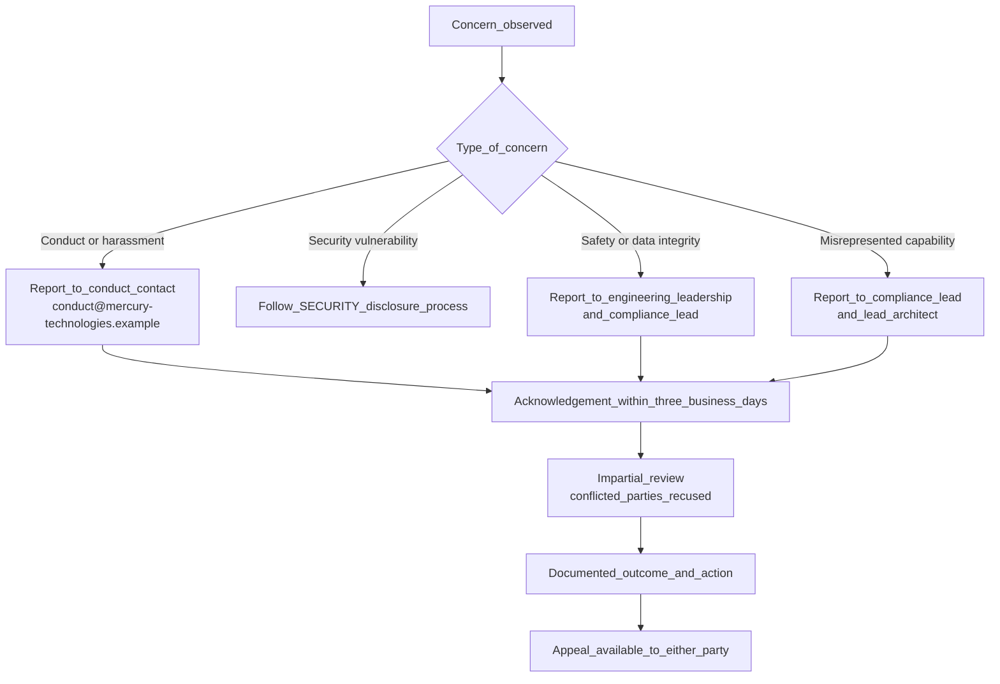

# Code of Conduct — Mercury Technologies

| Field | Value |
|-------|-------|
| Document | Code of Conduct |
| Applies to | Everyone participating in Mercury Technologies engineering, documentation, and community spaces |
| Audience | Employees, contractors, contributors, partners, customer representatives, reviewers |
| Status | Living baseline |
| Related | [CONTRIBUTING.md](CONTRIBUTING.md) · [SECURITY.md](SECURITY.md) · [docs/01_Executive/Mission.md](docs/01_Executive/Mission.md) |

---

## 1. Purpose and objectives

Mercury Technologies builds an Aviation Enterprise Operating System (AEOS) that records airworthiness evidence. The quality of that record depends on people telling the truth, raising concerns early, and reviewing each other's work rigorously without hostility.

This Code of Conduct therefore has two inseparable objectives:

1. **A respectful, harassment-free environment** in which every participant can contribute regardless of background or identity.
2. **A safety-and-integrity culture** in which raising a concern is always welcome, silence is never rewarded, and no social pressure ever discourages someone from reporting a defect, a risk, or a false claim.

In a safety-adjacent domain these two objectives reinforce each other. People who feel disrespected stop speaking up, and in aviation, a person who stops speaking up is a hazard. Professional courtesy is not a nicety here; it is a control.

---

## 2. Our commitment

We commit to making participation in Mercury Technologies' projects and community a harassment-free experience for everyone, regardless of age, body size, visible or invisible disability, ethnicity, sex characteristics, gender identity and expression, level of experience, education, socio-economic status, nationality, personal appearance, race, caste, colour, religion, or sexual identity and orientation.

We commit to acting and interacting in ways that contribute to an open, welcoming, diverse, inclusive, and healthy community — and to a technical record that is accurate.

---

## 3. Expected behaviour

| Expectation | In practice |
|-------------|-------------|
| **Be respectful and professional** | Address the work, not the person. Assume competence and good faith until evidence says otherwise. |
| **Be precise** | In a domain where terminology carries regulatory weight, say exactly what you mean. Use the controlled terminology in [CONTRIBUTING.md](CONTRIBUTING.md). |
| **Be honest about state** | Distinguish what is implemented from what is intended. Never let a stakeholder believe a capability exists when it does not. |
| **Give reviewable feedback** | State the requirement not met and, where you can, the correction. "This is wrong" is not a review; "this asserts runtime persona RBAC enforcement, which is on the near-term horizon, not delivered" is. |
| **Receive feedback gracefully** | A technical objection to your work is a contribution to it. Acknowledge, correct, and move on. |
| **Escalate concerns early** | Raise doubt while it is cheap. A question asked before a merge costs minutes; the same question after a customer relies on the answer costs far more. |
| **Respect confidentiality** | Customer data, tail numbers, findings, occurrence reports, contracts and security details are handled only within their authorized scope. |
| **Credit contribution** | Attribute ideas, reviews, and prior work accurately. |
| **Prefer clarity over cleverness** | Both in code and in documents. Someone will read this at 03:00 during a maintenance input. |

---

## 4. Unacceptable behaviour

The following are not tolerated in any Mercury space:

- Harassment, intimidation, stalking, or sustained disruption of discussion.
- Sexualized language or imagery, and unwelcome sexual attention or advances.
- Insults, demeaning comments, or personal, political, or identity-based attacks.
- Discrimination or exclusionary jokes and language, including "just joking" framings.
- Publishing others' private information — physical or electronic address, personal details — without explicit permission.
- Deliberate misgendering or use of names a person has asked not to be used.
- Retaliation against anyone who reports a concern, a defect, a vulnerability, or a misrepresentation.
- Any conduct a reasonable professional would consider inappropriate in a workplace that produces airworthiness records.

---

## 5. Safety, integrity, and honesty obligations

These obligations are specific to Mercury's domain and are enforced with the same seriousness as the behavioural standards above.

| Obligation | Meaning |
|------------|---------|
| **Never misrepresent capability** | Do not state or imply that Mercury implements a control, a certification, a regulatory approval, or a feature that it does not. See the explicit non-claims in [SECURITY.md](SECURITY.md). |
| **Never suppress a concern** | Do not discourage, delay, or dismiss a raised safety, security, data-integrity, or compliance concern. Route it; do not bury it. |
| **Never weaken evidence integrity** | Do not propose or implement changes that break audit completeness, signature immutability, the append-only nature of technical logbook amendment, or the separation between the person who performs work and the person who inspects it. |
| **Never bypass isolation** | Do not weaken organization isolation, or build a path that reads across organizations without explicit, scoped, audited authorization. |
| **Never fabricate content** | No placeholder text presented as substance, no invented benchmark, no unverified regulatory claim, no fabricated customer reference. |
| **Never handle a vulnerability publicly** | Suspected vulnerabilities follow the private disclosure process in [SECURITY.md](SECURITY.md). |
| **Speak up about your own errors** | Self-reporting a mistake is treated as professional strength. Concealment is treated as misconduct. |

A person who raises a concern in good faith is protected by this Code even if the concern turns out to be unfounded. A person who suppresses or retaliates against such a concern is in violation of it.

---

## 6. Scope

This Code applies within all Mercury project spaces and whenever an individual represents Mercury in public. That includes, without limitation:

- Blueprint and runtime repositories: issues, pull requests, reviews, commit messages, discussions.
- Documentation, design records, and Architecture Decision Records.
- Internal chat, email, calls, and meetings.
- Customer, partner, vendor, and authority interactions.
- Conferences, user groups, webinars, publications, and social media where Mercury is represented.

It applies to employees, contractors, interns, contributors, reviewers, maintainers, and partner personnel participating in Mercury spaces.

---

## 7. Reporting a concern

**How to report a conduct concern:** contact the designated conduct contact for the project. The current contact address is published in the repository's organizational metadata and maintained by Mercury Technologies leadership; where a project-level address is configured it is `conduct@mercury-technologies.example`. If your concern involves the conduct contact, report to any member of Mercury Technologies leadership other than that person.

**What to include:** what happened, when and where, who was involved, any witnesses, links or artefacts, and what outcome you are seeking. Partial reports are accepted — do not withhold a report because you lack detail.

**Confidentiality:** reports are handled with the narrowest disclosure necessary to investigate and act. The reporter's identity is not disclosed to the reported person without the reporter's consent, except where disclosure is legally required.

**No retaliation:** retaliation against a reporter, a witness, or an investigator is itself a violation and is treated at the highest severity.

**Security vulnerabilities are not conduct reports.** They follow [SECURITY.md](SECURITY.md) and must not be filed in public issues.

---

## 8. Enforcement

Community leaders are responsible for clarifying and enforcing these standards. They will take fair, proportionate corrective action in response to any behaviour they deem inappropriate, threatening, offensive, or harmful, and will communicate reasons for moderation decisions where appropriate.

Leaders have the right and responsibility to remove, edit, or reject comments, commits, code, documentation edits, issues, and other contributions that are not aligned with this Code.

### 8.1 Enforcement ladder

| Level | Trigger | Consequence |
|-------|---------|-------------|
| **1 — Correction** | A single instance of unprofessional or imprecise conduct; a minor first-time lapse | Private, written clarification of the violation and why it was inappropriate. A public apology may be requested. |
| **2 — Warning** | A violation through a single incident or a pattern of behaviour | Written warning with defined consequences for continuation, and a period of no interaction with the affected parties, including in project spaces and externally. Breaching these terms escalates. |
| **3 — Temporary ban** | A serious violation, including sustained inappropriate behaviour | Temporary ban from all interaction and public communication in Mercury spaces for a specified period. No interaction with affected parties during that period. Breaching escalates to level 4. |
| **4 — Permanent ban** | A pattern of serious violation, sustained harassment, aggression toward or disparagement of classes of individuals, or a deliberate integrity violation | Permanent ban from all public interaction in Mercury spaces. |

Deliberate falsification of records, deliberate misrepresentation of Mercury's certification or compliance status, deliberate suppression of a safety or security concern, and retaliation against a reporter may result in a level 3 or level 4 outcome on a first occurrence, and — for employees and contractors — in employment or contractual action independent of this Code.

### 8.2 Process guarantees

- Acknowledgement of a report within three business days.
- Review by individuals with no conflict of interest; anyone involved in the incident recuses themselves.
- The reported person is given the substance of the concern and an opportunity to respond, consistent with reporter confidentiality.
- The outcome, rationale, and any conditions are documented.
- Both reporter and reported person may request review of the outcome by a leader not involved in the original decision. Appeals are decided on the record and any new information.

---

## 9. Responsibilities of leaders and reviewers

| Role | Responsibility |
|------|----------------|
| **Engineering leadership** | Model the standards; ensure concerns are routed and closed; ensure no schedule pressure discourages a report. |
| **Lead architect** | Ensure technical disagreement stays technical; hold the line on honesty of capability claims. |
| **Security lead** | Own the disclosure process in [SECURITY.md](SECURITY.md) and its confidentiality. |
| **Compliance lead** | Own claim accuracy and regulatory representation; investigate misrepresentation reports. |
| **Reviewers** | Apply consistent standards to every contributor; give specific, actionable feedback; never use review as a channel for hostility. |
| **Every participant** | Read this Code, follow it, and raise concerns when it is not being followed. |

---

## 10. Future roadmap for this Code

| Planned improvement | Purpose |
|---------------------|---------|
| Published, named conduct contacts with a documented rotation | Remove ambiguity about where to report |
| Annual acknowledgement by all participants | Ensure the Code is read, not merely present |
| Anonymous reporting channel | Lower the cost of reporting for those who fear exposure |
| Anonymized annual transparency summary of report volumes and outcome categories | Demonstrate that enforcement is real without identifying individuals |
| Reviewer conduct guidance embedded in the pull-request template | Reinforce standards at the moment of review |

Sequencing is tracked in [ROADMAP.md](ROADMAP.md).

---

## 11. Attribution and related documents

This Code of Conduct is adapted from the Contributor Covenant, version 2.1, and extended with the safety, integrity, and honesty obligations that Mercury's aviation domain requires. Enforcement guidelines are inspired by Mozilla's code of conduct enforcement ladder.

| Topic | Document |
|-------|----------|
| Contribution mechanics and review standards | [CONTRIBUTING.md](CONTRIBUTING.md) |
| Security disclosure and non-claims | [SECURITY.md](SECURITY.md) |
| Mission and operating commitments | [docs/01_Executive/Mission.md](docs/01_Executive/Mission.md) |
| Founding vision and principles | [VISION.md](VISION.md) |
| Founders' commitments | [docs/01_Executive/Founders_Letter.md](docs/01_Executive/Founders_Letter.md) |

---

*Mercury Technologies — One Digital Thread. One Digital Aircraft Passport. One Aviation Enterprise Operating System.*
