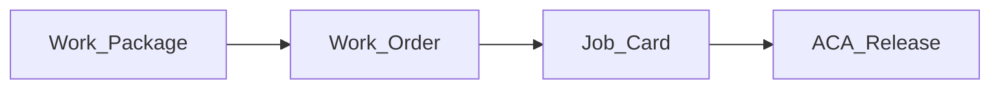
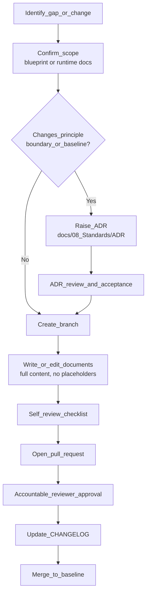

# Contributing to the Mercury Enterprise Blueprint

| Field | Value |
|-------|-------|
| Document | Contribution and governance guide |
| Applies to | `mercury-enterprise-blueprint/` — the Mercury Technologies founding blueprint |
| Audience | Architects, domain specialists, engineers, product, compliance, technical writers |
| Status | Living baseline |
| Related | [README.md](README.md) · [VISION.md](VISION.md) · [ROADMAP.md](ROADMAP.md) · [CODE_OF_CONDUCT.md](CODE_OF_CONDUCT.md) · [SECURITY.md](SECURITY.md) |

---

## 1. Purpose and objectives

The blueprint is the **Single Source of Truth** for Mercury Technologies' intent: why the Aviation Enterprise Operating System (AEOS) exists, how it is structured, which domains it serves, and what constraints bind it. Runtime code implements approved slices of this blueprint.

This guide exists to ensure that:

1. **One truth is maintained.** A second, contradictory description of Mercury is never created — not in a slide, not in a runtime document, not in a branch.
2. **Terminology stays stable.** Domain language is a safety and compliance asset, not a stylistic preference.
3. **Architectural decisions are recorded, not rediscovered.** Anything that changes a boundary, principle, or contract leaves an Architecture Decision Record behind it.
4. **Claims stay honest.** Delivered capability and planned capability are never blurred.
5. **Changes are reviewable.** Small, scoped, cross-linked contributions over large unreviewable rewrites.

---

## 2. Ground rules

| Rule | Why |
|------|-----|
| **Additive over rewrite.** Extend and refine existing documents; do not replace a working document because you would have structured it differently. | Institutional memory has value. Churn destroys it. |
| **No placeholders.** No `TODO`, `TBD`, "coming soon", or empty section headings in merged content. | The blueprint is cited by customers, partners, and auditors. |
| **No invented capability.** Never describe runtime behaviour that does not exist without labelling it as planned. | Misrepresentation is a commercial and regulatory risk. |
| **Never contradict the fixed architecture.** Vanilla JavaScript frontend, FastAPI backend, repository / service / thin-router layering, Alembic migrations, PostgreSQL, central RBAC and audit. | These are founding decisions; see [ROADMAP.md](ROADMAP.md) non-goals. |
| **Cross-link everything.** Every document links to the documents it depends on, using relative paths. | The blueprint must be navigable, not just complete. |
| **Ask when unclear.** Raise a question or an ADR instead of guessing at intent. | A wrong assumption written down becomes a wrong assumption implemented. |

---

## 3. Repository structure and ownership

```text
mercury-enterprise-blueprint/
├── README.md                 Entry point and repository map
├── LICENSE
├── VISION.md                 Founding vision (root statement of record)
├── ROADMAP.md                Capability sequencing and non-goals
├── CONTRIBUTING.md           This document
├── CHANGELOG.md              Blueprint change history
├── CODE_OF_CONDUCT.md        Community and professional standards
├── SECURITY.md               Security posture and disclosure process
└── docs/
    ├── 01_Executive/         Vision, mission, founders' letter, company strategy
    ├── 02_Architecture/      Enterprise, domain, system context, technical architecture
    ├── 03_Business/          OEM, Airline, MRO, CAMO, Authority, Leasing, Logistics
    ├── 04_Data/              Data model, master data, digital thread, knowledge graph
    ├── 05_Product/           Product family, editions, packaging, pricing model
    ├── 06_Security/          Identity, RBAC, audit, digital signatures
    ├── 07_AI/                AI strategy, knowledge graph, digital twin
    ├── 08_Standards/         API, UI, coding standards and ADR/
    └── 09_Regulations/       FAA, Transport Canada, EASA, ICAO alignment
```

| Area | Accountable reviewer role |
|------|---------------------------|
| `VISION.md`, `docs/01_Executive/` | Executive sponsor and lead architect |
| `ROADMAP.md`, `docs/05_Product/` | Product leadership with lead architect |
| `docs/02_Architecture/`, `docs/08_Standards/` | Lead architect |
| `docs/03_Business/` | Domain specialist for that stakeholder (OEM, airline, MRO, CAMO, lessor, authority) |
| `docs/04_Data/` | Data architect with domain specialist |
| `SECURITY.md`, `docs/06_Security/` | Security lead |
| `docs/07_AI/` | AI lead with data architect |
| `docs/09_Regulations/` | Compliance lead |

At least one accountable reviewer for the touched area must approve before merge. Changes spanning executive intent, architecture, and security require all three.

---

## 4. Controlled terminology

Terminology is normative. Use these exact terms; do not introduce synonyms.

| Use | Do not use | Meaning |
|-----|-----------|---------|
| **AEOS** / Aviation Enterprise Operating System | "MRO suite", "MRO platform" | The Mercury platform as a whole |
| **Digital Thread** | "data lineage feature", "traceability module" | The linked network of records binding organizations, aircraft, tasks, parts, people and evidence |
| **Digital Aircraft Passport** | "aircraft file", "aircraft record set" | The single logical record of an aircraft's identity, configuration, life and airworthiness evidence |
| **organization** | "tenant" (in customer-facing text), "company" when an organization is meant | The isolation boundary and legal operating entity within a company hierarchy |
| **site** | "location", "facility", "station" | A physical location belonging to an organization |
| **work package** | "job", "visit package", "WP" spelled out inconsistently | The container of work orders for a maintenance input |
| **work order** | "task order" | An executable order within a work package |
| **job card** | "task card", "work card" | The executable, signable unit of maintenance work |
| **ACA** / ACA release | "sign-off", "final sign" | Airworthiness certification authority release of work |
| **CAMO** | "airworthiness department" when the organization type is meant | Continuing airworthiness management organization |
| **MRO** | "shop" when the organization type is meant | Maintenance, repair and overhaul organization |
| **double inspection** / independent inspection | "second signature" | The required independent verification of critical work |
| **publication revision** | "document version" | The immutable, citable revision of a technical publication |
| **TSN / TSO / CSN / CSO** | "hours", "cycles" without qualification | Time Since New, Time Since Overhaul, Cycles Since New, Cycles Since Overhaul |

Spell out an acronym at first use in each document, then use the acronym. The canonical glossary and master data definitions live in [docs/04_Data/Master_Data.md](docs/04_Data/Master_Data.md); extend it there rather than defining terms locally.

---

## 5. Document standards

### 5.1 Required structure

Every substantive blueprint document contains, in order:

1. **Title** — `# <Area> — <Document Name>`
2. **Metadata table** — document, product or scope, audience, status, related documents
3. **Purpose and objectives** — why the document exists and what decisions it governs
4. **Body** — the substance, in numbered sections
5. **Current versus future** — where relevant, an explicit statement of what exists in the runtime today
6. **Future roadmap** — where relevant, forward intent with links to [ROADMAP.md](ROADMAP.md)
7. **Related documents** — cross-link table

### 5.2 Writing style

- Professional, precise, and declarative. Write for an architect, a regulator, and a chief executive reading the same page.
- Prefer tables for enumerable facts and prose for reasoning. Do not hide reasoning inside table cells.
- Active voice. Name the accountable actor: "the ACA holder releases the work package", not "the work package is released".
- No marketing superlatives, no unverifiable claims, no emoji.
- British or American spelling may be used, but be internally consistent within a document.

### 5.3 Links

- Always relative, always to a file that exists — for example `docs/02_Architecture/Enterprise_Architecture.md` from the repository root, or `../02_Architecture/Enterprise_Architecture.md` from within `docs/01_Executive/`.
- Never link to an unwritten document without also creating it. A broken link is a placeholder in disguise.

### 5.4 Diagrams

Mermaid is the standard diagram format so that diagrams are diffable and reviewable.

- **Node identifiers must not contain spaces.** Use `Work_Package` as the identifier and a quoted label for display text.
- Use `graph TB` or `graph LR` for structure, `sequenceDiagram` for interaction, `erDiagram` for data relationships, `stateDiagram-v2` for lifecycles.
- Distinguish current from future: solid edges for current runtime, dotted edges (`-.->`) for future intent, with a legend sentence beneath the diagram.
- Keep a diagram to one idea. Two clear diagrams beat one exhaustive one.

Correct:



---

## 6. Architecture Decision Records

An ADR is **required** when a change would:

- alter a core principle in [VISION.md](VISION.md);
- change a domain boundary, module ownership, or integration contract;
- change the security, identity, RBAC, audit, or signature baseline;
- change the tenancy or isolation model;
- change technology choices (frontend approach, backend framework, database, migration tooling);
- move an item across a roadmap horizon in a way that changes dependencies;
- introduce a new persisted entity that other domains will depend on.

ADRs live in [docs/08_Standards/ADR/](docs/08_Standards/ADR/), named `ADR-<number>-<kebab-case-title>.md`, and follow this shape:

```markdown
# ADR-0007 — Adopt shared session store for multi-worker API

| Field | Value |
|-------|-------|
| Status | Proposed | Accepted | Superseded by ADR-00XX | Rejected |
| Date | YYYY-MM-DD |
| Deciders | Lead architect, security lead |
| Affects | docs/02_Architecture/Technical_Architecture.md, docs/06_Security/Identity.md |

## Context
What forced the decision. Constraints, current behaviour, evidence.

## Decision
The decision, stated in one paragraph, in the imperative.

## Consequences
Positive, negative, and operational consequences. Migration impact. Audit impact.

## Alternatives considered
Each alternative and why it was not chosen.

## Compliance and security impact
Effect on isolation, RBAC, audit, signatures, and regulatory evidence.
```

An accepted ADR is never edited to reverse itself. It is superseded by a new ADR, and the old one is marked accordingly.

---

## 7. Contribution workflow



### 7.1 Before writing

1. **Read the affected documents completely.** Not the headings — the content.
2. **Map dependencies.** Which documents cite the one you are changing? Search the repository for its path.
3. **Search for reuse.** If a concept is already defined elsewhere, link to it instead of restating it.
4. **Confirm current versus planned.** If you are describing runtime behaviour, confirm it against the runtime platform before asserting it.
5. **Explain the plan.** For anything beyond a correction, state the intended change and its scope before writing it.

### 7.2 Branches and commits

- Branch names: `docs/<area>-<short-topic>`, `adr/<number>-<short-topic>`, `fix/<area>-<short-topic>`.
- One logical change per commit. Commit subject in the imperative, 72 characters or fewer, no trailing period.
- Reference the ADR in the commit body when one governs the change.

Example:

```text
Add lessor return-standard readiness section to Leasing domain

Documents the asset-condition and return-standard evidence expected by
lessors, linking configuration, life counters, and ACA release records.

Governed by ADR-0012 (cross-organization scoped read access).
```

### 7.3 Self-review checklist

Before requesting review, confirm every line:

- [ ] No `TODO`, `TBD`, "coming soon", or empty section remains.
- [ ] Metadata table present and accurate, including status and related documents.
- [ ] Purpose and objectives section states what decisions the document governs.
- [ ] Controlled terminology used exactly; acronyms expanded at first use.
- [ ] All relative links resolve to files that exist.
- [ ] Mermaid diagrams render, and no node identifier contains a space.
- [ ] Delivered capability is distinguished from planned capability everywhere.
- [ ] No contradiction of the fixed architecture or of [ROADMAP.md](ROADMAP.md) non-goals.
- [ ] No security control, certification, or compliance status claimed that is not real.
- [ ] No secrets, credentials, customer names, tail numbers, or personal data in examples.
- [ ] An ADR exists if one is required.
- [ ] [CHANGELOG.md](CHANGELOG.md) updated for anything more than a typographical fix.

### 7.4 Review expectations

Reviewers assess, in priority order: factual accuracy, honesty of claims, terminology consistency, cross-link integrity, structural conformance, then style. A reviewer who blocks a change states the specific requirement not met and, where possible, the correction. Conduct during review is governed by [CODE_OF_CONDUCT.md](CODE_OF_CONDUCT.md).

---

## 8. Relationship to runtime code contributions

This repository is documentation and intent. Runtime code lives in the Mercury Enterprise application repository. When a blueprint change implies code:

| Concern | Blueprint obligation | Runtime obligation |
|---------|---------------------|--------------------|
| New capability | Describe intent, contracts, domain language, isolation and audit expectations | Implement the approved slice additively |
| Data model change | Update [docs/04_Data/Data_Model.md](docs/04_Data/Data_Model.md) and master data | Alembic migration, no destructive change without a documented plan |
| API change | Update [docs/08_Standards/API_Standards.md](docs/08_Standards/API_Standards.md) and the domain document | Thin router, service logic, repository access; versioned contract |
| Security change | Update [SECURITY.md](SECURITY.md) and [docs/06_Security/](docs/06_Security/) | Central RBAC and audit paths only; no local permission logic |
| Divergence discovered | Raise an ADR and correct the blueprint | Do not create a second truth in runtime documentation |

Runtime engineering constraints — read affected files first, reuse before adding, incremental and production-grade changes, no mocked logic, run available tests, verify frontend load, backend endpoints, imports and existing behaviour before declaring completion — apply to any code that a blueprint change motivates.

---

## 9. Handling sensitive content

- **Never** commit credentials, tokens, private keys, connection strings, or customer-identifying data.
- Use neutral examples: `EXAMPLE-ORG`, `E-3001` for a personnel identifier, `ATA 32-41` for a chapter reference, fictitious registrations.
- Do not include real customer names, contracts, findings, or occurrence reports without written authorization from the compliance lead.
- Suspected vulnerabilities — in the blueprint, in examples, or in the runtime — follow the private disclosure process in [SECURITY.md](SECURITY.md). Do not open a public issue.

---

## 10. Future roadmap for this guide

| Planned improvement | Purpose |
|---------------------|---------|
| Automated link checking in continuous integration | Eliminate broken relative links at review time |
| Mermaid render validation in continuous integration | Catch diagram syntax and node-identifier violations |
| Terminology linting against the master data glossary | Enforce controlled vocabulary mechanically |
| ADR index generation | Keep a current, sortable register of decisions and supersessions |
| Document review cadence with recorded review dates | Prevent silent staleness in the living baseline |

Sequencing for these items is tracked in [ROADMAP.md](ROADMAP.md).

---

## 11. Related documents

| Topic | Document |
|-------|----------|
| Repository entry point and map | [README.md](README.md) |
| Founding vision and principles | [VISION.md](VISION.md) |
| Capability sequencing and non-goals | [ROADMAP.md](ROADMAP.md) |
| Change history | [CHANGELOG.md](CHANGELOG.md) |
| Conduct standards | [CODE_OF_CONDUCT.md](CODE_OF_CONDUCT.md) |
| Security posture and disclosure | [SECURITY.md](SECURITY.md) |
| Architecture decisions | [docs/08_Standards/ADR/](docs/08_Standards/ADR/) |
| API and UI standards | [docs/08_Standards/API_Standards.md](docs/08_Standards/API_Standards.md) · [docs/08_Standards/UI_Standards.md](docs/08_Standards/UI_Standards.md) |
| Master data and glossary | [docs/04_Data/Master_Data.md](docs/04_Data/Master_Data.md) |

---

*Mercury Technologies — One Digital Thread. One Digital Aircraft Passport. One Aviation Enterprise Operating System.*
