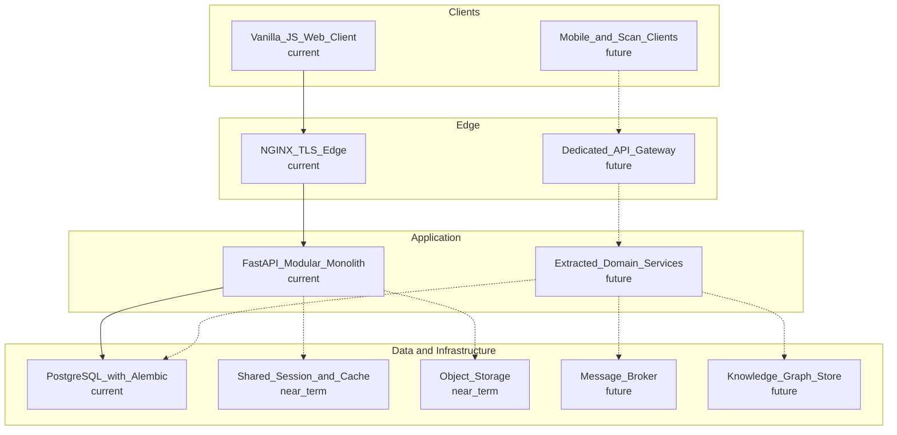

# Mercury Technologies — Blueprint Roadmap

| Field | Value |
|-------|-------|
| Document | Blueprint Roadmap — capability sequencing |
| Product | Mercury Aviation Enterprise Operating System (AEOS) |
| Scope | Blueprint intent and delivery order. Not a contractual delivery calendar. |
| Status | Living baseline — material reordering requires an ADR |
| Related | [VISION.md](VISION.md) · [CHANGELOG.md](CHANGELOG.md) · [docs/05_Product/Product_Family.md](docs/05_Product/Product_Family.md) |

---

## 1. Purpose and objectives

This roadmap defines **the order in which Mercury AEOS capability is built and why that order is forced**. Its objectives:

1. Make dependency order explicit, so no team builds a capability whose foundation does not yet exist.
2. Separate **delivered runtime capability** from **blueprint intent**, so nobody — internally or externally — mistakes a plan for a product.
3. Record **non-goals**, so effort is not spent relitigating settled architectural decisions.
4. Give commercial, compliance, and partner functions a shared reference for what to promise and when.

Two rules govern this file:

- **No dates are promised here.** Sequencing is expressed in horizons and dependency order. Commercial commitments are made in contracts, not in the blueprint.
- **Nothing is listed as delivered unless it exists in the runtime platform.** Aspirational entries live under *Planned*, always.

---

## 2. Roadmap principles

| Principle | Consequence for sequencing |
|-----------|----------------------------|
| **Foundation before surface** | Tenancy, identity, RBAC, and audit precede any domain feature that depends on them. |
| **Additive over rewrite** | New capability extends existing modules. Replacement of working code requires an ADR with explicit justification. |
| **Thread before analytics** | Predictive and analytical capability follows a complete Digital Thread; models on fragmented data are not built. |
| **Evidence before automation** | An automated action is only introduced where its audit and signature evidence path already exists. |
| **Architecture is fixed** | Vanilla JavaScript frontend, FastAPI backend, repository / service / thin-router layering, Alembic migrations, PostgreSQL. No SPA framework migration. See [docs/02_Architecture/Technical_Architecture.md](docs/02_Architecture/Technical_Architecture.md). |
| **Isolation is never deferred** | Any new persisted entity is organization-scoped at introduction, not retrofitted. |

---

## 3. Delivered — runtime foundation

The following capability exists in the Mercury Enterprise runtime platform today. Each row is the blueprint capability, mapped to the runtime increment that delivered it.

| Runtime increment | Blueprint capability delivered | Blueprint reference |
|-------------------|-------------------------------|---------------------|
| Platform baseline (package `16.0.0`) | FastAPI application lifespan and configuration, PostgreSQL deployment, NGINX frontend and reverse proxy, WebSocket event gateway, health and readiness probes, session RBAC, audit, structured logging, request correlation, CI | [docs/02_Architecture/Technical_Architecture.md](docs/02_Architecture/Technical_Architecture.md) |
| Security and infrastructure increment | Edge TLS 1.2 / 1.3, HTTP-to-HTTPS redirect, security headers, application and edge rate limiting, production environment validation, production Compose profile | [SECURITY.md](SECURITY.md) |
| Observability and operations increment | JSON structured logging with request / correlation / user identifiers, enriched health probes, Prometheus metrics, administrator APIs, expanded audit actions, backup and restore tooling | [docs/06_Security/Audit.md](docs/06_Security/Audit.md) |
| **Sprint 5 — Enterprise organizations & multi-tenancy** | Companies, organizations, sites, departments, teams, org users, memberships; membership-aware session context; org-scoped role resolution; membership-filtered organization and site APIs | [docs/03_Business/](docs/03_Business/), [docs/06_Security/Identity.md](docs/06_Security/Identity.md) |
| **Sprint 6 — Aircraft registry & fleet management** | Manufacturers, aircraft models, statuses, fleet operators, fleets, aircraft, registrations; org isolation and audit on fleet APIs | [docs/04_Data/Data_Model.md](docs/04_Data/Data_Model.md) |
| **Sprint 7 — Components & configuration management** | ATA chapters, component catalog, serialized components, immutable installation history, install / remove / transfer, TSN / TSO / CSN / CSO tracking, life limits, aircraft configuration API | [docs/04_Data/Digital_Thread.md](docs/04_Data/Digital_Thread.md) |
| **Sprint 7b — Technical library, personnel & certification** | Typed publications (maintenance, flight, engineering, operations) with revision history; aircraft families; alternate parts and interchangeability; personnel qualifications and ACA authorizations; maintenance task engine bound to immutable publication revisions; critical-task policies; immutable digital signatures; certification chain; technical logbook; AI-ready index and cross-reference structures; enterprise RBAC expansion and persona map | [docs/06_Security/Digital_Signatures.md](docs/06_Security/Digital_Signatures.md) |
| **Sprint 8 — Work orders, job cards & maintenance execution** | Work packages, work orders, job cards, attachments; validated job-card status transitions; certify bridge into technical logbook and aircraft / component history; assign, transition, complete-work, inspect (approve / reject / rework / independent), ACA release; role dashboards for manager, planner, supervisor, technician, QA and ACA; MRO reports; offline synchronization queue; performed-versus-inspected segregation of duties; fail-closed audit on complete, inspect and release; append-only logbook amendment | [docs/03_Business/MRO.md](docs/03_Business/MRO.md) |
| **Sprint 9 — Maintenance planning & aircraft maintenance program** | Maintenance programs with immutable revisions; MPD tasks with multi-unit intervals; maintenance checks from preflight through D / structural / engine / custom with due computation; Airworthiness Directives, Service Bulletins and Engineering Orders with approval workflow; Minimum Equipment List and Configuration Deviation List items; deferred defects with expiry and alerting; utilization counters and status traffic lights; hangar, parts, tool and workforce plan lines; forecast engine over 30 / 90 / 180 / 365 day windows; urgency-sorted due list; planner dashboard; automatic work package, work order and job card generation into execution | [docs/03_Business/CAMO.md](docs/03_Business/CAMO.md) |
| **Program B — Enterprise logistics** | Warehouse hierarchy; part master; stock ledger with FIFO and FEFO issue policies; rotable management; tool crib with calibration control; material requests; purchase requisition to request for quotation to purchase order to receive to inspect to putaway to invoice; vendor management; shipments; barcode and RFID scan APIs; automatic material and tool planning bridge from work-package generation; shortages dashboard | [docs/03_Business/Suppliers_Logistics.md](docs/03_Business/Suppliers_Logistics.md) |

```mermaid
graph LR
  Base["Platform_Baseline<br/>FastAPI, PostgreSQL, RBAC, audit"] --> S5["Sprint_5<br/>Organizations_Multi_Tenancy"]
  S5 --> S6["Sprint_6<br/>Aircraft_Registry_Fleets"]
  S6 --> S7["Sprint_7<br/>Components_Configuration"]
  S7 --> S7b["Sprint_7b<br/>Library_Personnel_Certification"]
  S7b --> S8["Sprint_8<br/>Work_Packages_Job_Cards_ACA"]
  S8 --> S9["Sprint_9<br/>Planning_MPD_AD_SB_EO_MEL_Forecast"]
  S9 --> PB["Program_B<br/>Enterprise_Logistics"]
  PB --> Next["Next_Horizon<br/>Assurance_and_Ecosystem"]
```

The dependency chain is not incidental. Components cannot exist without a fleet; certification cannot exist without personnel and immutable publications; job cards cannot release without certification; planning cannot generate packages without an execution engine; logistics cannot plan material without a forecast. **Program B logistics is downstream of Sprint 9 planning by design** — material and tool demand is derived from the same forecast and work-package generation that drives the hangar.

---

## 4. Near-term horizon — assurance and hardening (additive)

These items strengthen what exists. They do not introduce new domains.

| # | Item | Rationale | Reference |
|---|------|-----------|-----------|
| 1 | **Runtime persona RBAC enforcement** | Technician, Inspector, ACA, Planner and Supervisor overlays are mapped; enforce them uniformly at the service boundary so authority cannot be inferred from a dashboard. | [docs/06_Security/RBAC.md](docs/06_Security/RBAC.md) |
| 2 | **Single-transaction certify bridge** | Remove nested commits between job-card certification and the maintenance service so certification, logbook entry, and history update are atomic. | [docs/02_Architecture/Technical_Architecture.md](docs/02_Architecture/Technical_Architecture.md) |
| 3 | **PKI and smart-card signature adapters** | Replace the current provider-absent posture (unsigned methods are rejected) with real cryptographic signature providers. | [docs/06_Security/Digital_Signatures.md](docs/06_Security/Digital_Signatures.md) |
| 4 | **Shared session store** | Redis-backed sessions so the API can scale to multiple workers without session affinity. | [docs/02_Architecture/Technical_Architecture.md](docs/02_Architecture/Technical_Architecture.md) |
| 5 | **Directory synchronization and identity provider integration** | Unify organization users with the operator directory; prepare OpenID Connect federation. | [docs/06_Security/Identity.md](docs/06_Security/Identity.md) |
| 6 | **Object storage for certificates, photos and attachments** | Replace metadata-only attachment references with managed, integrity-checked binary storage. | [docs/04_Data/Data_Model.md](docs/04_Data/Data_Model.md) |
| 7 | **Native hangar scanning client** | Consume the existing logistics scan APIs from a purpose-built shop-floor client. | [docs/03_Business/Suppliers_Logistics.md](docs/03_Business/Suppliers_Logistics.md) |
| 8 | **Evidence pack export** | One-command, auditor-acceptable evidence bundle for an aircraft, work package, or component with resolvable revision references. | [docs/09_Regulations/](docs/09_Regulations/) |

---

## 5. Mid-term horizon — ecosystem expansion

Capability that opens Mercury beyond a single operating organization.

| Theme | Blueprint intent |
|-------|------------------|
| **OEM service-data exchange** | Ingest type design, catalog, and service data as structured, versioned, applicability-bearing data; return in-service effectivity signals. See [docs/03_Business/OEM.md](docs/03_Business/OEM.md). |
| **Lessor and asset-owner visibility** | Scoped, read-oriented access to asset condition, configuration, life status, and return-standard readiness. See [docs/03_Business/Leasing.md](docs/03_Business/Leasing.md). |
| **Authority oversight views** | Read-scoped, audit-logged oversight access to records and evidence, advisory in posture. See [docs/03_Business/Authority.md](docs/03_Business/Authority.md). |
| **Supplier and vendor integration at scale** | Electronic quotation, order acknowledgement, advance shipping notice, and certificate exchange with vendors. |
| **Component and engine shop workflows** | Shop-visit lifecycle for rotables with life continuity across removal, repair, and reinstallation. |
| **Flight operations and utilization intake** | Automated utilization and operational status intake feeding the forecast engine. |
| **Reliability and engineering analytics** | Trend, removal-rate, and repeat-finding analysis over thread data. |

---

## 6. Long-term horizon — intelligence and regulated extension

| Theme | Blueprint intent | Reference |
|-------|------------------|-----------|
| **Knowledge graph** | Represent the Digital Thread as a queryable graph across organizations, aircraft, components, publications, tasks and evidence. | [docs/07_AI/Knowledge_Graph.md](docs/07_AI/Knowledge_Graph.md) |
| **Predictive maintenance** | Failure-precursor and removal-forecast models built on thread and reliability data. | [docs/07_AI/AI_Strategy.md](docs/07_AI/AI_Strategy.md) |
| **Digital twin** | Configuration-accurate, life-accurate aircraft twin for scenario and planning simulation. | [docs/07_AI/Digital_Twin.md](docs/07_AI/Digital_Twin.md) |
| **Assistive AI in the workflow** | Retrieval-grounded assistance for publication lookup, task drafting and defect triage. AI advises; qualified persons and authorities decide, sign and release. | [docs/07_AI/AI_Strategy.md](docs/07_AI/AI_Strategy.md) |
| **Deeper regulatory alignment programmes** | Structured mapping and evidence alignment work with the frameworks documented under regulations. | [docs/09_Regulations/](docs/09_Regulations/) |
| **Military domain readiness** | Segregation, classification handling, and disconnected deployment topologies. Future domain; no current certification or accreditation is claimed. | [SECURITY.md](SECURITY.md) |

---

## 7. Future platform shape (described, not current)

The blueprint may describe a future multi-service topology. **This is not the current runtime.** The current runtime is a single FastAPI application with a vanilla JavaScript frontend behind NGINX, backed by PostgreSQL with Alembic-managed schema.

Solid edges are current. Dotted edges are future intent, and any move along them requires an ADR under [docs/08_Standards/ADR/](docs/08_Standards/ADR/).

---

## 8. Explicit non-goals

The following are **not** on the roadmap. Proposing them requires an ADR that overturns a founding decision.

- Replacing the vanilla JavaScript frontend with React, Vue, Angular, Next.js, or any other single-page-application framework.
- Rewriting the FastAPI backend in another language or framework.
- Abandoning the repository / service / thin-router layering or Alembic-managed migrations.
- Replacing PostgreSQL as the system of record.
- Claiming certified aviation, defence, surveillance, emergency-response, or safety-of-life operational approval without independent validation.
- Publishing compliance certification claims that have not been independently issued. See [SECURITY.md](SECURITY.md).
- Introducing AI that autonomously approves, certifies, or releases airworthiness-significant work.
- Duplicating an existing engine rather than extending it — for example, a second maintenance task engine, a second audit path, or a second permission model.

---

## 9. Governance of this roadmap

| Change | Required action |
|--------|-----------------|
| Adding an item within an existing horizon | Pull request with rationale and blueprint cross-links |
| Moving an item between horizons | Pull request with dependency justification |
| Marking an item as delivered | Evidence that it exists in the runtime platform, plus a [CHANGELOG.md](CHANGELOG.md) entry |
| Changing an architectural non-goal | ADR under [docs/08_Standards/ADR/](docs/08_Standards/ADR/), approved before any code |
| Changing a core principle | ADR plus update to [VISION.md](VISION.md) |

Contribution mechanics are in [CONTRIBUTING.md](CONTRIBUTING.md). Conduct expectations are in [CODE_OF_CONDUCT.md](CODE_OF_CONDUCT.md).

---

*Mercury Technologies — One Digital Thread. One Digital Aircraft Passport. One Aviation Enterprise Operating System.*
