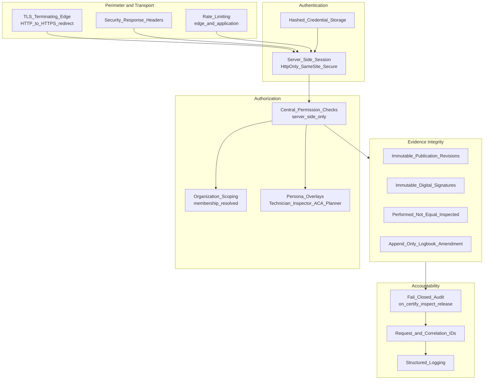
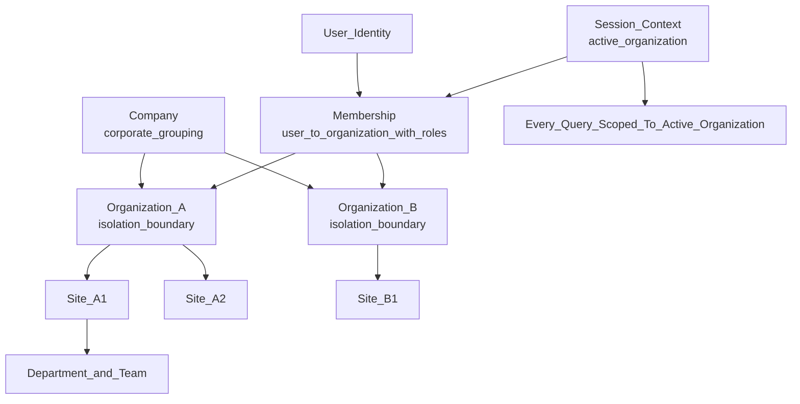

# Security — Mercury Aviation Enterprise Operating System

| Field | Value |
|-------|-------|
| Document | Security posture, threat model, and disclosure policy |
| Product | Mercury Aviation Enterprise Operating System (AEOS) |
| Scope | Blueprint security baseline and the security expectations it places on the runtime platform |
| Audience | Security researchers, customer security teams, auditors, architects, engineers |
| Status | Living baseline — changes to the security baseline require an ADR |
| Related | [VISION.md](VISION.md) · [ROADMAP.md](ROADMAP.md) · [docs/06_Security/RBAC.md](docs/06_Security/RBAC.md) · [docs/06_Security/Audit.md](docs/06_Security/Audit.md) |

---

## 1. Purpose and objectives

Mercury records airworthiness evidence. If that evidence can be read by the wrong organization, altered without trace, signed by someone who lacked authority, or lost, then the platform has failed at its primary purpose — regardless of how well any feature works.

This document exists to:

1. Give security researchers and customer security teams a **clear, single path** for reporting vulnerabilities.
2. State the **high-level threat model** Mercury designs against.
3. Document the **multi-tenant organization isolation** model, the **audit** posture, and **secrets** handling as security properties, not features.
4. State plainly **what Mercury does not claim** — no fabricated certification, attestation, or compliance badge.
5. Record the **security roadmap**, so the difference between an implemented control and an intended one is never ambiguous.

Section 8 is deliberately unflattering. It is there because an honest security statement is worth more to a customer than a confident one.

---

## 2. Reporting a vulnerability

**Report privately. Do not open a public issue, pull request, discussion, or social media post describing a suspected vulnerability.**

### 2.1 How to report

| Step | Detail |
|------|--------|
| **Channel** | Send a private report to the Mercury Technologies security contact. Where a project-level address is configured it is `security@mercury-technologies.example`; if a private security advisory facility is available on the hosting platform for this repository, that facility is the preferred channel. |
| **Encryption** | If you require encrypted transport and no key is published in the repository metadata, request one in a first contact message containing no vulnerability detail. |
| **Do not** | Do not include exploit detail in a public channel, a shared ticketing system, or a customer environment. |

### 2.2 What to include

- Affected component, endpoint, screen, or document, and the version or commit if known.
- A clear description of the issue and the security impact you believe it has.
- Reproduction steps, minimal proof of concept, and any relevant request or response captures with secrets redacted.
- Whether the issue involves cross-organization data exposure, privilege escalation, evidence tampering, or audit bypass — these are prioritized.
- Your assessment of severity and whether you believe the issue is being exploited.

### 2.3 What to expect

| Stage | Target |
|-------|--------|
| Acknowledgement of receipt | Within 3 business days |
| Initial triage and severity assessment | Within 10 business days |
| Status updates during remediation | At least every 10 business days until resolution |
| Remediation of critical severity issues | Prioritized above feature work; timeline communicated on triage |
| Coordinated disclosure | After a fix is available, or by mutual agreement; credit given to the reporter unless anonymity is requested |

These are the targets Mercury holds itself to. They are commitments of process, not a contractual service-level agreement, and they do not override obligations in a specific customer agreement.

### 2.4 Safe harbour and researcher expectations

Mercury will not pursue action against a researcher who, in good faith:

- tests only against systems they own or are explicitly authorized to test;
- avoids privacy violations, data destruction, service degradation, and access to data beyond the minimum needed to demonstrate the issue;
- does not use social engineering, physical intrusion, or attacks against Mercury personnel;
- does not exfiltrate, retain, or publish customer data, personal data, or airworthiness records;
- reports promptly and privately, and allows reasonable time for remediation before disclosure.

**Do not test against a customer's production Mercury environment.** Aviation operators use these records to make airworthiness decisions. Use your own deployment or request an authorized test environment.

### 2.5 Out of scope

Reports of the following, absent a demonstrated security impact, are acknowledged but not treated as vulnerabilities: missing best-practice headers with no exploitable consequence, absence of rate limiting on an unauthenticated read-only health probe, output of automated scanners without validation, social engineering, denial of service requiring implausible resource levels, self-inflicted issues requiring a compromised administrator account, and vulnerabilities in unsupported or heavily modified deployments.

---

## 3. High-level threat model

Mercury's security design targets the threats that matter for a multi-tenant system of airworthiness record. This is a high-level model; detailed control mappings live in [docs/06_Security/](docs/06_Security/).

### 3.1 Assets

| Asset | Why it matters |
|-------|----------------|
| Airworthiness evidence — job cards, inspections, certifications, ACA releases, technical logbook entries | Legal and safety record of aircraft condition |
| Digital Aircraft Passport — identity, configuration, life counters | Determines whether an aircraft may fly |
| Immutable publication revisions | Establish what authorized a maintenance action |
| Personnel qualifications and ACA authorizations | Determine who may certify and release |
| Digital signatures and the certification chain | Establish non-repudiation |
| Audit trail | Establishes what happened and who did it |
| Organization data boundaries | Commercially and legally sensitive; competitors may be tenants of the same platform |
| Logistics and procurement records — part master, stock, vendors, purchase orders | Commercial sensitivity and part-provenance integrity |
| Secrets — session and token secrets, database credentials, integration credentials | Compromise undermines every other control |
| Availability during a maintenance input | Loss of access during a check has direct operational cost |

### 3.2 Adversaries and threats

| Adversary | Primary threat |
|-----------|----------------|
| **External unauthenticated attacker** | Authentication bypass, injection, transport interception, denial of service, exposure of an unintended surface |
| **Authenticated user of another organization** | Cross-organization data disclosure — the highest-consequence failure in a multi-tenant AEOS |
| **Authenticated user within the organization exceeding authority** | Privilege escalation; certifying, inspecting, or releasing work without the required qualification or authorization |
| **Malicious or coerced insider** | Evidence tampering, backdating, audit suppression, deletion of a logbook entry, forging a signature |
| **Compromised integration or supplier account** | Injection of false part provenance, false receiving inspection, or false vendor records |
| **Supply-chain attacker** | Malicious dependency, build or image compromise |
| **Operator error** | Misconfiguration causing exposure, or destructive change without recovery capability |

### 3.3 Design responses

Every control shown is a property the blueprint requires of the runtime. Where a control is partially implemented, it is called out in section 7 and section 9.

---

## 4. Multi-tenant isolation

Isolation is the security property Mercury is most accountable for, because a single platform may host organizations that compete with each other, lessors and their lessees, and MRO providers serving rival operators.

### 4.1 The isolation model

| Property | Requirement |
|----------|-------------|
| **Organization is the isolation boundary** | Every persisted domain entity is owned by an organization at introduction. Isolation is never retrofitted to an existing entity as a later cleanup. |
| **Membership is explicit** | A user reaches an organization's data only through a membership record. Context switching without membership is denied; only a platform administrator role is exempt, and that exemption is audited. |
| **Session context carries the active organization** | Authorization decisions and data scoping resolve from the session's active organization and the roles that membership grants there. Roles are not global. |
| **Listing is filtered, not merely detail-checked** | Organization and site listings return only what the caller's memberships permit, so absence of a record is itself not an information leak. |
| **Cross-organization access is deliberate** | Any legitimate cross-organization flow — a lessor viewing asset condition, an MRO working on an operator's aircraft, an authority performing oversight — is an explicit, scoped, audited grant. It is never an implicit consequence of a shared platform. |
| **The user interface is not a boundary** | Hiding a control in the frontend is presentation, not security. Every restriction is enforced server-side. |

### 4.2 Current state and known gaps

Organization APIs and session isolation are implemented in the runtime, including membership-filtered organization and site access and organization-scoped role resolution. **Extending uniform organization write-scoping across every remaining engine is on the near-term horizon** and is tracked in [ROADMAP.md](ROADMAP.md). Mercury states this openly rather than implying that isolation is uniformly complete on every code path.

Detailed identity and tenancy specification: [docs/06_Security/Identity.md](docs/06_Security/Identity.md).

---

## 5. Authorization and role-based access control

| Requirement | Detail |
|-------------|--------|
| **Server-side and central** | Permission checks are resolved through the central RBAC path. Domain services do not implement local, divergent permission logic. |
| **Permission-based, not title-based** | Authority derives from named permissions — for example organization, fleet, component, configuration, planning, work-order and logistics permission families — resolved for the active organization. |
| **Persona overlays** | Technician, Inspector, Planner, Supervisor, quality assurance and airworthiness certification authority (ACA) personas map to permission sets. Uniform runtime enforcement of these overlays is a near-term item, stated as such. |
| **Segregation of duties** | The person who performed work cannot be the person who inspects it. Independent (double) inspection is required where critical-task policy demands it. ACA release authority is separate from execution authority. |
| **Least privilege by default** | New capability ships closed. A permission is granted, never assumed. |
| **Administrative safety rails** | Removal of the last administrator is refused; administrative mutations are audited. |

Specification: [docs/06_Security/RBAC.md](docs/06_Security/RBAC.md).

---

## 6. Audit and evidence integrity

Audit in Mercury is not logging. Logging helps engineers; audit protects the record.

| Property | Requirement |
|----------|-------------|
| **Audit everywhere** | Authentication events, authorization-relevant changes, administrative actions, and all safety-significant domain transitions are audited with actor, organization, action, target, and time. |
| **Fail-closed on safety-significant actions** | If the audit record for completion of work, inspection, or ACA release cannot be written, the action does not succeed. An unaudited release is worse than a refused one. |
| **Immutable signatures** | Digital signatures are immutable once recorded. Signature methods without a real provider are refused rather than simulated. |
| **Immutable publication revisions** | A maintenance action references the specific, immutable publication revision that authorized it. Release requires an immutable revision reference and an ATA reference. Revision number, revision date, and certification requirements are snapshotted into the technical logbook so later republication cannot rewrite history. |
| **Append-only amendment** | The technical logbook is not edited. Corrections are appended as amendments that preserve the original entry. |
| **Terminal-state protection** | A released job card cannot be mutated, and double release is refused. |
| **Correlation** | Request and correlation identifiers tie audit records, structured logs, and user actions together for investigation. |
| **Retention** | Audit and airworthiness records are retained per customer regulatory obligation. Retention configuration is a deployment responsibility documented for operators. |

Specification: [docs/06_Security/Audit.md](docs/06_Security/Audit.md) and [docs/06_Security/Digital_Signatures.md](docs/06_Security/Digital_Signatures.md).

---

## 7. Secrets, configuration, and data protection

### 7.1 Secrets

| Rule | Detail |
|------|--------|
| **No insecure defaults in production** | Required secrets — including the authentication credential, token signing secret, and cookie secret — must be explicitly configured. The application refuses to start a production or HTTPS configuration without them. |
| **Never in source control** | Secrets, tokens, private keys, and connection strings are never committed to this blueprint or to runtime repositories. |
| **Injected at deployment** | Secrets are supplied by environment or secret manager, not baked into images or configuration files. |
| **Rotate on exposure** | Any credential that appears in a log, ticket, chat message, screenshot, or commit is treated as compromised and rotated immediately. |
| **Hashed credential storage** | Login passwords are stored as **Argon2id** with unique salts. Legacy SHA-256(pepper + password) hashes are verified once and rehashed at login. Production refuses the development pepper as a secret. |
| **Least distribution** | Production secrets are held by the smallest possible set of operators, and access is logged. |

### 7.2 Transport and data protection

| Control | Detail |
|---------|--------|
| Transport encryption | Terminating edge enforces modern TLS with redirection of plaintext requests. |
| Session cookies | `HttpOnly`, `SameSite` restricted, and `Secure` in production or HTTPS deployments. |
| Response headers | Strict transport security, content security policy, framing and content-type protections, cross-origin isolation, and permissions policy. |
| Cross-origin access | Explicit origin allow-list; no permissive wildcard in production. |
| Error handling | Generic error bodies to callers; detail retained server-side with correlation identifiers. |
| Rate limiting | Applied at the edge and in the application, including on authentication, returning HTTP 429. |
| Encryption at rest | A deployment responsibility satisfied by the database and storage platform; documented for operators rather than claimed as an application feature. |
| Backup and recovery | Backup, restore, and verification tooling exists in the runtime; operators own schedule, offsite retention, and periodic restore testing. |
| Personal data | Personnel records, qualifications, and signature identities are personal data. Access is permission-gated and audited; minimization and retention are deployment obligations documented for operators. |

### 7.3 Dependencies and supply chain

- Dependencies are pinned and reviewed; upgrades are deliberate.
- Continuous integration runs on every change to the runtime.
- Container images are rebuilt to pick up base-image security updates rather than pinned indefinitely.
- New dependencies are justified: prefer the standard library and existing platform capability over adding surface area.
- Build and deployment artefacts are reproducible from source and configuration.

---

## 8. What Mercury does NOT claim

This section is as important as every control listed above. Mercury publishes only what it has.

**Mercury does not claim:**

- **No SOC 2 report, no ISO/IEC 27001 certificate, no PCI DSS attestation, no FedRAMP authorization, no HITRUST certification, and no equivalent third-party audit or certification.** No such badge appears in this repository, in the product, or in Mercury materials. If Mercury obtains one, this document will name the report, its scope, its period, and the issuing auditor — and nothing will be implied before that.
- **No aviation authority certification, approval, or acceptance of the software.** Mercury is not certified, qualified, or approved by the Federal Aviation Administration, Transport Canada, the European Union Aviation Safety Agency, the International Civil Aviation Organization, or any other authority. The regulatory documents under [docs/09_Regulations/](docs/09_Regulations/) describe **alignment intent and evidence support**, which is not approval.
- **No claim that using Mercury makes an organization compliant.** Compliance is a property of an organization's approved exposition, procedures, and personnel. Mercury supports compliance with records and evidence; it does not confer it.
- **No defence, military, security, surveillance, emergency-response, or safety-of-life operational accreditation.** Military aviation is a documented **future** domain. No current accreditation, classification authority, or clearance is claimed.
- **No penetration test report or bug bounty programme is currently published.** When independent testing is performed, its existence, scope, and date will be stated here; findings-level detail will be shared with customers under agreement.
- **No formal identity federation.** OpenID Connect, single sign-on, and multi-factor authentication are roadmap items, not delivered controls.
- **No cryptographic public-key-infrastructure signature providers today.** Signatures are immutable and attributed within the platform, and signature methods lacking a real provider are refused. Smart-card and public-key-infrastructure adapters are a near-term roadmap item.
- **No enforced API-key middleware.** Where an API-key configuration name is reserved in the runtime, it is reserved only and is not an active control.
- **No shared session store.** Sessions are not yet backed by a shared store, which constrains multi-worker deployment. A Redis-backed session store is a near-term item.
- **No managed object storage for attachments today.** Certificate and photograph attachments are reference-and-metadata based; managed, integrity-checked binary storage is a near-term item.
- **No Kubernetes network policies, service mesh, or hardened multi-cluster topology as a shipped control.**
- **No claim of uniform organization write-scoping on every code path.** Organization APIs and session isolation are implemented; extension across remaining engines is in progress and is stated as such in section 4.2.
- **No artificial intelligence that approves, certifies, inspects, or releases work.** Indexing, embedding, and cross-reference structures exist to make the platform AI-ready; predictive and assistive AI is roadmap work and will remain advisory to accountable humans.

If you find a Mercury document, screen, or communication that claims any of the above, treat it as a defect and report it under section 2 or under the integrity obligations in [CODE_OF_CONDUCT.md](CODE_OF_CONDUCT.md).

---

## 9. Security roadmap

Ordered by dependency, not by date. Governed by [ROADMAP.md](ROADMAP.md).

| # | Item | Security objective |
|---|------|--------------------|
| 1 | Uniform organization write-scoping across all engines | Close the residual isolation gap stated in section 4.2 |
| 2 | Runtime persona RBAC enforcement | Make Technician, Inspector, ACA, Planner and Supervisor authority uniformly enforced server-side |
| 3 | Single-transaction certification bridge | Remove nested-commit windows so certification, logbook entry, and history update are atomic |
| 4 | Public-key-infrastructure and smart-card signature providers | Cryptographic non-repudiation of certification and release |
| 5 | Shared session store | Safe multi-worker scaling without session affinity |
| 6 | Identity provider federation with single sign-on and multi-factor authentication | Enterprise-grade authentication and centralized deprovisioning |
| 7 | Managed object storage with integrity verification | Tamper-evident storage of certificates, photographs, and attachments |
| 8 | Evidence pack export with resolvable revision references | Auditor-acceptable, reproducible evidence bundles |
| 9 | Independent penetration testing and a published disclosure programme | External validation of the controls claimed here |
| 10 | Formal control mapping toward a recognized framework | A basis for a future, genuinely earned attestation |
| 11 | Classification handling and disconnected deployment topologies | Prerequisite for the future military domain |

---

## 10. Customer and operator responsibilities

Security is shared. A Mercury deployment is secure only if the operating organization holds up its side.

| Responsibility | Owner |
|----------------|-------|
| Application controls — authentication, RBAC, audit, isolation, signature integrity, input validation | Mercury |
| Secure defaults and refusal to start insecurely configured production instances | Mercury |
| Timely remediation and disclosure of vulnerabilities | Mercury |
| Secret generation, storage, rotation, and least distribution | Operator |
| Transport certificate management and renewal | Operator |
| Network segmentation, keeping metrics and administrative surfaces internal | Operator |
| Backup scheduling, offsite retention, and periodic restore testing | Operator |
| User lifecycle — joiner, mover, leaver — and membership hygiene | Operator |
| Retention configuration aligned to the operator's regulatory obligations | Operator |
| Host, container platform, and database patching | Operator |
| Ensuring qualified personnel hold the authority the platform grants them | Operator |

---

## 11. Related documents

| Topic | Document |
|-------|----------|
| Identity and tenancy | [docs/06_Security/Identity.md](docs/06_Security/Identity.md) |
| Role-based access control | [docs/06_Security/RBAC.md](docs/06_Security/RBAC.md) |
| Audit | [docs/06_Security/Audit.md](docs/06_Security/Audit.md) |
| Digital signatures | [docs/06_Security/Digital_Signatures.md](docs/06_Security/Digital_Signatures.md) |
| Technical architecture | [docs/02_Architecture/Technical_Architecture.md](docs/02_Architecture/Technical_Architecture.md) |
| Regulatory alignment | [docs/09_Regulations/](docs/09_Regulations/) |
| Conduct and integrity obligations | [CODE_OF_CONDUCT.md](CODE_OF_CONDUCT.md) |
| Contribution rules, including sensitive-content handling | [CONTRIBUTING.md](CONTRIBUTING.md) |
| Delivery sequencing | [ROADMAP.md](ROADMAP.md) |

---

*Mercury Technologies — One Digital Thread. One Digital Aircraft Passport. One Aviation Enterprise Operating System.*
