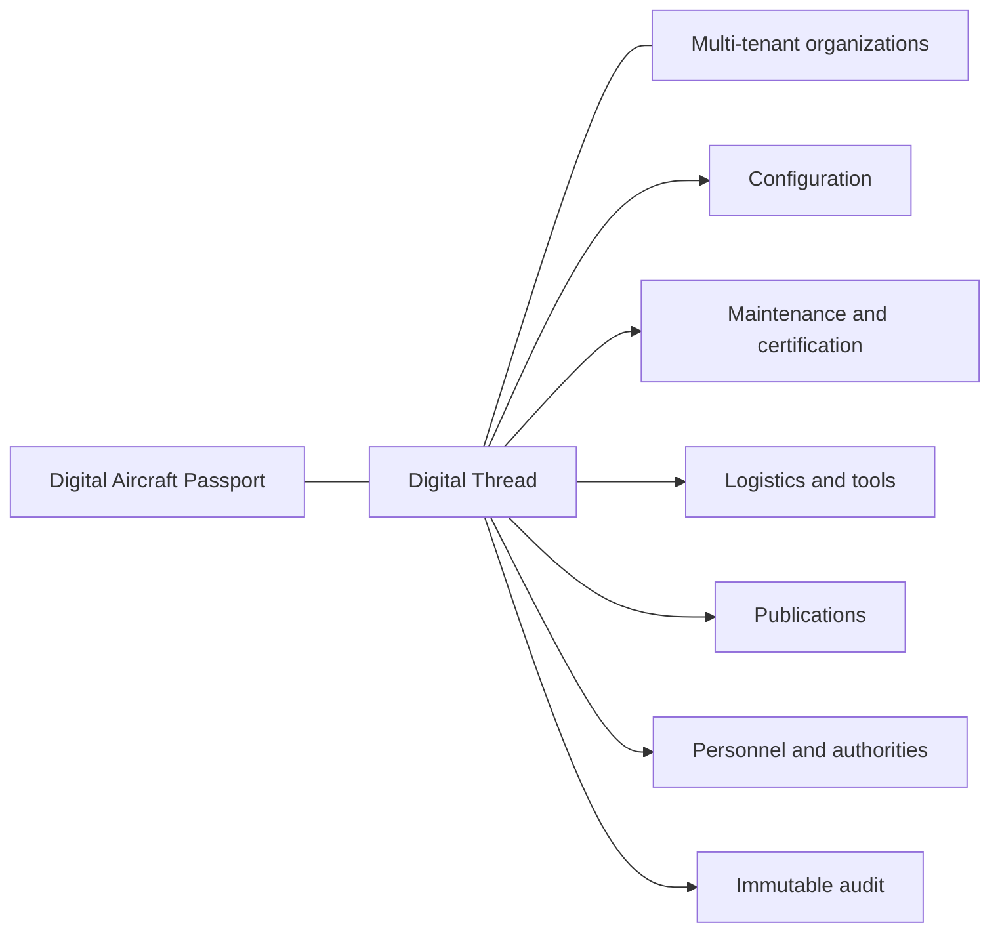

# VISION — Mercury Technologies

**Aviation Enterprise Operating System (AEOS)**  
**One Digital Thread · One Digital Aircraft Passport**

| Field | Value |
|-------|--------|
| Document | Corporate and product vision (founding) |
| Audience | Investors, customers, partners, regulators, architects, employees |
| Status | Normative |
| Detail essay | [docs/01_Executive/Vision.md](docs/01_Executive/Vision.md) |

---

## 1. One sentence

**Mercury is the Aviation Enterprise Operating System that makes every aircraft, part, person, publication, and decision share one Digital Thread.**

---

## 2. The category we create

Mercury is not a point MRO tool, not a bolt-on inventory module, and not a document portal with a work-order skin.

Mercury is an **Aviation Enterprise Operating System (AEOS)**: a multi-tenant, API-first, AI-ready, cloud-native platform that connects the aviation value chain — OEM, airline, business aviation, cargo, helicopter, MRO, CAMO, shops, warehouses, suppliers, lessors, airports, flight operations, engineering, quality, reliability, finance, HR, executives, and authorities — on a single trustworthy history.

Military operators are a declared **future** segment; they are not claimed as delivered.

---

## 3. The problem

Aviation still runs on fragmented systems that do not share provenance:

| Fragment | Failure mode |
|----------|--------------|
| OEM portals | Design and applicability disconnected from as-maintained reality |
| Airline ops | Dispatch and maintenance plans without live stores truth |
| MRO execution | Job cards without material/tool evidence |
| CAMO systems | Continuing airworthiness without contractor transparency |
| Warehouse ERPs | Stock movements without aircraft thread |
| Lessor desks | Lease return packs assembled by heroics |
| Authority reporting | Evidence reconstructed under audit pressure |

The common defect: **connections between records were narrative, not data.**

---

## 4. The Mercury answer

1. **Digital Aircraft Passport** — the long-lived identity of the aircraft: configuration, life, and airworthiness evidence as a resolvable view.  
2. **Digital Thread** — persisted links from birth → operate → maintain → modify → lease return → retire.  
3. **Organization isolation + RBAC + audit everywhere** — collaboration without contamination.  
4. **API-first modules** — enterprise integration without rewriting the core for every partner.  
5. **AI-ready, advisory only** — intelligence that explains; humans who certify ([ADR-0008](docs/08_Standards/ADR/ADR-0008-ai-advisory-only.md)).

---

## 5. North-star outcomes

| Stakeholder | Outcome |
|-------------|---------|
| Airline / operator | Closed-loop planning → execution → stores; higher dispatch reliability |
| MRO | Traceable packages, inspections, tools, and material |
| CAMO | Continuing airworthiness visibility across contracted work |
| OEM | Fleet feedback on configuration and applicability |
| Lessor | Transferable asset history and return condition evidence |
| Authority | Auditable integrity when operators present records |
| Investor | A platform category (AEOS), not a feature checklist |

---

## 6. Non-negotiables

- Multi-tenant with organization isolation  
- One Digital Thread and one Digital Aircraft Passport  
- RBAC and audit everywhere for safety- and business-critical actions  
- API-first, modular, additive evolution  
- AI advisory only unless a future ADR explicitly changes that law  
- No fabricated compliance badges; operators remain accountable to authorities  

Engineering stack constraints for the current product line: FastAPI + vanilla JS ([ADR-0005](docs/08_Standards/ADR/ADR-0005-vanilla-js-fastapi-stack.md)).

---

## 7. Delivered foundation (engineering truth)

Organizations & multi-tenancy · Aircraft registry & fleets · ATA · Components & serialized life · Install/remove history · Technical library · Logbook · Personnel & certification · Double inspection / QA / ACA · Work packages/orders/job cards · Maintenance planning · Enterprise logistics (Program B) · Audit trail · Document versioning & applicability

Detail: [ROADMAP.md](ROADMAP.md) · [docs/05_Product/Product_Family.md](docs/05_Product/Product_Family.md)

---

## 8. Related documents

[docs/01_Executive/Vision.md](docs/01_Executive/Vision.md) · [docs/01_Executive/Mission.md](docs/01_Executive/Mission.md) · [docs/04_Data/Digital_Thread.md](docs/04_Data/Digital_Thread.md) · [docs/02_Architecture/Enterprise_Architecture.md](docs/02_Architecture/Enterprise_Architecture.md) · [README.md](README.md)
