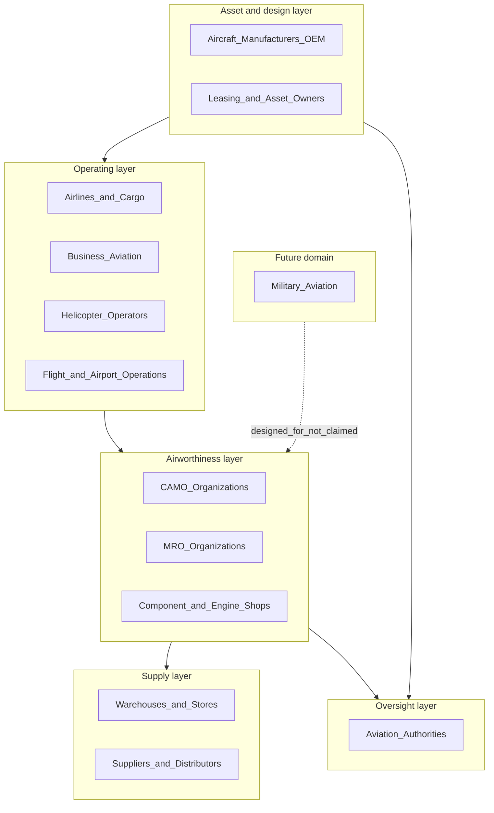

# Executive — Company Strategy

| Field | Value |
|-------|-------|
| Document | Company Strategy |
| Product | Mercury Aviation Enterprise Operating System (AEOS) |
| Organization | Mercury Technologies |
| Audience | Board, executives, investors, product and commercial leadership, senior architects |
| Status | Living baseline — strategic reordering requires an ADR |
| Related | [Vision.md](Vision.md) · [Mission.md](Mission.md) · [../05_Product/Product_Family.md](../05_Product/Product_Family.md) · [../../ROADMAP.md](../../ROADMAP.md) |

---

## 1. Purpose and objectives

This document states **how Mercury Technologies intends to win, in what order, and with what constraints**. It converts the vision in [Vision.md](Vision.md) and the commitments in [Mission.md](Mission.md) into a strategy that product, engineering, commercial, and compliance functions can align to.

Objectives:

1. State the strategic thesis and the assumptions it depends on.
2. Describe the market structure Mercury sells into and the segments it prioritizes.
3. Define positioning, the entry wedge, and the expansion motion.
4. Define product, go-to-market, and ecosystem strategy.
5. State the competitive posture and where durable advantage comes from.
6. Define the operating model, including what is deliberately not done.
7. Record strategic risks with mitigations, and the horizons against which progress is judged.

This is a strategy document, not a forecast. It contains no revenue projections, customer names, or commitments to dates; those belong in the operating plan and in contracts.

---

## 2. Strategic thesis

> **The dominant unaddressed cost in aviation operations is the reconciliation tax between systems that each work well. Whoever supplies the common substrate — tenancy, master data, thread, permissions, audit, contracts — becomes the platform the industry's functions run inside. Mercury intends to be that substrate.**

The thesis rests on four assumptions, each of which is testable:

| Assumption | Why we believe it | How it is falsified |
|-----------|-------------------|---------------------|
| Fragmentation cost exceeds feature-gap cost in mature aviation organizations | Operators already own capable point tools yet still run manual reconciliation across them | Customers consistently prioritize a single-function feature over integrated truth |
| Evidence provability is a purchasing driver, not just a compliance checkbox | Redeliveries, transactions, and audits are repeatedly cited as multi-week manual efforts | Buyers show no willingness to pay for provability over workflow speed |
| Multi-domain adoption inside one tenant is achievable | Planning-to-logistics demand derivation already demonstrates cross-domain value inside one platform | Customers insist on domain-siloed deployments and refuse shared master data |
| An ecosystem can form around one thread | Value chain participants already exchange the same facts, badly | Partners refuse to participate without owning the system of record themselves |

---

## 3. Market structure and segments

Mercury addresses the operating and airworthiness layer of aviation, across organization types rather than within one.

### 3.1 Segment prioritization

| Priority | Segment | Rationale | Domain document |
|----------|---------|-----------|-----------------|
| **1** | CAMO and airworthiness functions of mid-size operators; independent MRO organizations | Highest reconciliation pain, clearest evidence-provability need, decision cycles short enough to serve well, and the exact capability set the runtime already carries | [../03_Business/CAMO.md](../03_Business/CAMO.md), [../03_Business/MRO.md](../03_Business/MRO.md) |
| **2** | Business aviation, cargo and helicopter operators | Fleet complexity high relative to back-office capacity; strong appetite for one system rather than five | [../03_Business/Airline.md](../03_Business/Airline.md) |
| **3** | Warehouses, stores and supply functions inside existing customers | Program B logistics makes this a natural expansion inside an existing tenant rather than a new sale | [../03_Business/Suppliers_Logistics.md](../03_Business/Suppliers_Logistics.md) |
| **4** | Component and engine shops | Extends serialized life continuity across removal, shop visit and reinstallation | [../03_Business/MRO.md](../03_Business/MRO.md) |
| **5** | Leasing companies and asset owners | Return-standard readiness and portfolio condition, best sold once operators are on the platform | [../03_Business/Leasing.md](../03_Business/Leasing.md) |
| **6** | Aircraft manufacturers | Structured service-data exchange requires ecosystem density to be compelling | [../03_Business/OEM.md](../03_Business/OEM.md) |
| **7** | Aviation authorities | Oversight views, advisory posture; follows regulatory alignment maturity | [../03_Business/Authority.md](../03_Business/Authority.md) |
| **Future** | Military aviation | Requires segregation, classification handling and disconnected topologies; no accreditation claimed | [../../SECURITY.md](../../SECURITY.md) |

Large flag-carrier airlines are a deliberate later target: their procurement cycles, incumbent estates, and integration surface require the assurance and ecosystem horizons to be complete first.

---

## 4. Positioning

**Category:** Aviation Enterprise Operating System.

**Positioning statement:** *For aviation organizations whose airworthiness truth is spread across disconnected systems, Mercury is the operating system that binds organizations, aircraft, people, publications, maintenance, logistics and quality into One Digital Thread and One Digital Aircraft Passport — so that status is computed, evidence is provable, and access is isolated and audited.*

| We are positioned as | We are not positioned as |
|----------------------|--------------------------|
| The substrate the aviation enterprise runs on | A best-of-breed point tool in one function |
| A system of record for airworthiness evidence | A document management or scanning archive |
| Multi-domain and multi-stakeholder by design | An MRO suite with add-on modules |
| Honest about delivered versus planned capability | A vendor competing on certification badges it has not earned |
| Evidence-first, with AI as an advisor | An "AI-powered" platform where the model is the product |

---

## 5. Wedge and expansion motion

Mercury's commercial motion mirrors its technical dependency order: the platform is adopted where pain is sharpest, then expands across the same tenant because the substrate is already there.

| Stage | What is sold | Why it lands | Why the next stage follows |
|-------|-------------|--------------|----------------------------|
| **Wedge — continuing airworthiness and planning** | Maintenance programmes with immutable revisions, maintenance planning document tasks, checks, Airworthiness Directive, Service Bulletin and Engineering Order control, Minimum Equipment List and deferred defects, utilization, forecast and due list | Replaces spreadsheet-based compliance tracking with computed status; immediate audit relief | The forecast already generates work packages, so execution is the natural next step |
| **Execution** | Work packages, work orders, job cards, technician workflow, double inspection, quality assurance queues, ACA release, signatures, technical logbook | Removes re-keying between planning and hangar; enforces segregation of duties | Execution consumes material and tools, exposing supply as the next bottleneck |
| **Logistics** | Warehouses, part master, stock ledger, rotables, tool crib and calibration, procurement chain, vendors, shipping, scan interfaces | Demand is derived from the same forecast, so shortages surface before the check | Complete operational data makes quality and reliability analysis possible |
| **Quality, reliability, engineering** | Configuration integrity, findings and repeat-finding analysis, reliability trends | Uses the thread already present; no new data entry | Complete operational truth makes cost, capacity and workforce insight credible |
| **Insight** | Cost, capacity, workforce and portfolio views | Derived from reality rather than re-entered summaries | Internal completeness makes external participation valuable |
| **Ecosystem extension** | Scoped lessor, supplier, OEM and authority participation | Partners join a thread that is already dense | Density increases the cost of leaving and the value of joining |

Land-and-expand is not a sales tactic here; it is the dependency order of the platform, which is why the expansion is technically cheap for the customer.

---

## 6. Product strategy

| Strategic choice | Rationale | Reference |
|------------------|-----------|-----------|
| **Substrate first, features second** | Tenancy, master data, thread, RBAC and audit are built once and inherited by every domain, making each new domain cheaper than the last | [../02_Architecture/Enterprise_Architecture.md](../02_Architecture/Enterprise_Architecture.md) |
| **Modular licensing along domain boundaries** | Customers adopt in different orders; module boundaries are both a technical and a commercial instrument | [../05_Product/Product_Family.md](../05_Product/Product_Family.md), [../05_Product/Editions.md](../05_Product/Editions.md) |
| **One engine per concern** | A second maintenance task engine, audit path, or permission model would fracture the thread and double the compliance surface | [../../CONTRIBUTING.md](../../CONTRIBUTING.md) |
| **API-first delivery** | Every capability is a contract before a screen, which is what makes ecosystem participation possible | [../08_Standards/API_Standards.md](../08_Standards/API_Standards.md) |
| **Fixed architecture** | Vanilla JavaScript frontend, FastAPI backend, repository / service / thin-router layering, PostgreSQL, Alembic. No framework migration; engineering budget goes to aviation capability | [../../ROADMAP.md](../../ROADMAP.md) |
| **Assurance before intelligence** | Predictive value depends on a complete thread and on customers trusting the record; assurance work is therefore sequenced first | [../../SECURITY.md](../../SECURITY.md) |
| **AI advisory only** | Regulatory and ethical boundary: models assist retrieval, drafting and triage; qualified people decide, sign and release | [../07_AI/AI_Strategy.md](../07_AI/AI_Strategy.md) |

### 6.1 Pricing and packaging principles

Detailed commercial terms live in [../05_Product/Pricing_Strategy.md](../05_Product/Pricing_Strategy.md). The strategic principles are:

- **Value metric tied to managed assets and users, not to records created.** Charging per record would penalize the completeness the platform exists to create.
- **Modules priced along domain boundaries** so a customer can start at the wedge without buying the estate.
- **No paywall on audit, isolation, or evidence integrity.** Security and provability are properties of the platform, not an upsell tier.
- **Ecosystem participation priced to encourage joining.** A lessor or supplier reading scoped data should not face a barrier that keeps them off the thread.

---

## 7. Go-to-market strategy

| Element | Approach |
|---------|----------|
| **Motion** | Consultative, evidence-led. Discovery centres on reconciliation cost, audit preparation effort and aircraft-on-ground causes, quantified with the customer |
| **Proof** | Structured evaluation on the customer's own fleet data in an isolated organization, demonstrating computed status and a produced evidence pack — never a scripted demonstration of unavailable capability |
| **Honesty as a sales asset** | Delivered versus planned capability is stated in writing during evaluation. This loses some deals to more confident competitors and wins the ones that survive a security and compliance review |
| **Domain credibility** | Sales and solution roles staffed by people fluent in continuing airworthiness, execution and logistics practice; the buyer should not have to translate |
| **Adoption model** | Wedge deployment, then expansion inside the same tenant, with the customer's own data proving each next step |
| **Customer success** | Measured on thread completeness and evidence readiness inside the account, not on licence consumption |
| **Regional strategy** | Follow regulatory-alignment maturity documented in [../09_Regulations/](../09_Regulations/) rather than pursuing all jurisdictions simultaneously |

---

## 8. Partnership and ecosystem strategy

| Partner type | Role | Strategic value |
|--------------|------|-----------------|
| **Implementation and consulting partners** | Programme delivery, data migration, process alignment | Scales adoption without scaling headcount linearly |
| **Aircraft manufacturers** | Structured, versioned, applicability-bearing service data | Removes manual applicability determination — one of the largest remaining manual steps |
| **Suppliers and distributors** | Electronic quotation, order acknowledgement, shipping notice, certificate exchange | Extends part provenance into the thread |
| **Component and engine shops** | Shop-visit lifecycle with life continuity | Closes the largest remaining gap in serialized component history |
| **Leasing companies** | Scoped asset condition and return-standard visibility | Converts redelivery from a project into a query |
| **Aviation authorities** | Oversight-ready records and evidence, advisory posture | Reduces oversight friction for customers; never represented as approval |
| **Technology partners** | Identity providers, signature providers, object storage, infrastructure | Accelerates the assurance horizon without diluting focus |

Ecosystem strategy has one rule: **partners participate in the thread; they do not create a parallel one.** Any integration that would require Mercury to accept an unlinked, unaudited, or organization-ambiguous record is refused.

---

## 9. Competitive posture and durable advantage

### 9.1 Competitive landscape shape

| Competitor archetype | Typical strength | Structural weakness Mercury targets |
|----------------------|------------------|-------------------------------------|
| Established aviation maintenance suites | Deep functional coverage, installed base, regulatory familiarity | Bounded to the maintenance domain; integration-era data models; expensive change |
| Best-of-breed point tools | Excellent in one function | Each addition increases reconciliation cost; no shared thread |
| Generic enterprise resource planning platforms with aviation add-ons | Financial and procurement strength | No native airworthiness evidence model; certification, inspection and release semantics bolted on |
| Spreadsheets and internal tooling | Free, flexible, owned by domain experts | No isolation, no audit, no immutability, no continuity when a person leaves |
| Document and records archives | Retention and search | Documents, not structured applicability-bearing data; provability is manual |

### 9.2 Where advantage becomes durable

| Source of advantage | Why it compounds |
|---------------------|------------------|
| **Thread density** | Each additional linked domain makes every existing record more valuable and the platform harder to replace without losing the narrative |
| **Evidence provability** | Once an organization's audits and redeliveries depend on computed evidence, reverting to manual assembly is a visible operational regression |
| **Multi-domain tenancy** | Competitors must integrate across vendors what Mercury resolves inside one substrate |
| **Cross-organization participation** | Ecosystem value accrues to the platform holding the thread, not to any single participant |
| **Domain-correct enforcement** | Segregation of duties, immutable revisions and fail-closed audit are hard to retrofit into a model that did not start with them |
| **Honest posture** | Enterprise security and compliance reviews are where overstated claims fail; being precise is a repeatable win condition |

Advantage explicitly **not** claimed: proprietary algorithms, model superiority, or certification status. See [../../SECURITY.md](../../SECURITY.md) section 8.

---

## 10. Operating model

| Dimension | Strategy |
|-----------|----------|
| **Engineering** | Small, senior, domain-literate teams working additively on a fixed architecture; decisions recorded as Architecture Decision Records under [../08_Standards/ADR/](../08_Standards/ADR/) |
| **Single source of truth** | This blueprint governs intent; runtime implements approved slices; divergence is resolved by ADR and blueprint correction, never by a second truth |
| **Quality gates** | Available tests run; frontend load, endpoints, imports and existing behaviour verified before completion is declared |
| **Security ownership** | A named security lead owns the disclosure process, the threat model and the non-claims statement |
| **Compliance ownership** | A named compliance lead owns claim accuracy and regulatory representation |
| **Documentation as product** | The blueprint is maintained to the same standard as code; no placeholders are merged |
| **Hiring** | Aviation domain fluency valued equally with engineering depth; the cost of a domain misunderstanding in this product is high |
| **Culture** | Concerns raised early are rewarded; concealment is treated as misconduct — see [../../CODE_OF_CONDUCT.md](../../CODE_OF_CONDUCT.md) |

### 10.1 What Mercury deliberately does not do

- Does not pursue framework modernization for its own sake.
- Does not build a second engine for a concern that already has one.
- Does not sell capability that is on the roadmap as though it were delivered.
- Does not publish a compliance badge it has not independently earned.
- Does not enter the military domain before segregation and classification readiness exist.
- Does not chase every jurisdiction ahead of regulatory-alignment maturity.
- Does not let AI take an approval, certification, inspection or release action.

---

## 11. Strategic risks and mitigations

| Risk | Consequence if unmanaged | Mitigation |
|------|--------------------------|------------|
| **Cross-organization data exposure** | Existential: loss of licence to operate as a multi-tenant platform | Organization ownership at entity introduction; membership-resolved access; uniform write-scoping prioritized first on the near-term horizon; audit on every cross-organization access |
| **Evidence integrity failure** | Loss of customer and authority trust; possible false airworthiness record | Immutable revisions and signatures, append-only logbook, terminal-state protection, fail-closed audit |
| **Scope sprawl across too many domains at once** | Shallow capability everywhere, credible nowhere | Dependency-ordered roadmap; segment prioritization; ADR discipline on new domains |
| **Enterprise security review failure** | Deals blocked at the assurance gate | Assurance horizon sequenced before intelligence; explicit non-claims prevent surprise findings |
| **Incumbent bundling pressure** | Price and procurement disadvantage | Compete on thread density and provability, which bundling cannot replicate; modular entry lowers the decision threshold |
| **Key-person domain dependency** | Loss of aviation correctness | Domain knowledge encoded in this blueprint and in ADRs rather than held individually |
| **Regulatory divergence across jurisdictions** | Rework and delayed regional entry | Regulatory alignment documented per jurisdiction; regional sequencing follows that maturity |
| **AI overreach, internal or by a customer** | Safety and regulatory exposure | Hard constraint: AI advises only; no autonomous approval, certification or release |
| **Platform scaling constraints** | Operational limits under multi-worker load | Shared session store and object storage sequenced on the near-term horizon; constraints stated openly today |
| **Overstated claim by any Mercury representative** | Reputational and contractual damage | Non-claims statement in [../../SECURITY.md](../../SECURITY.md); misrepresentation treated as a conduct violation |

---

## 12. Strategic horizons

| Horizon | Strategic objective | Evidence that it is achieved |
|---------|--------------------|------------------------------|
| 1 — Foundation | Prove that airworthiness, execution and logistics can run on one substrate in one tenant | Customers operating all three domains in Mercury with material demand derived from the planning forecast |
| 2 — Assurance | Become defensible in enterprise security and audit reviews | Federated identity, cryptographic signature providers, uniform write-scoping, tested evidence pack export, independent security testing |
| 3 — Ecosystem | Make the thread multi-organizational | Lessors, suppliers, shops and manufacturers participating in scoped, audited access rather than by export |
| 4 — Intelligence | Convert thread density into forecasting and advisory value | Reliability and predictive capability in production use, advisory by design |
| 5 — Regulated extension | Operate in the most demanding regulatory contexts | Jurisdictional depth documented and demonstrated; military readiness prerequisites in place |

Sequencing, dependencies and non-goals: [../../ROADMAP.md](../../ROADMAP.md).

---

## 13. Related documents

| Topic | Document |
|-------|----------|
| Root vision statement of record | [../../VISION.md](../../VISION.md) |
| Extended executive vision | [Vision.md](Vision.md) |
| Mission and operating commitments | [Mission.md](Mission.md) |
| Founders' letter | [Founders_Letter.md](Founders_Letter.md) |
| Enterprise architecture | [../02_Architecture/Enterprise_Architecture.md](../02_Architecture/Enterprise_Architecture.md) |
| Domain strategies by stakeholder | [../03_Business/](../03_Business/) |
| Digital Thread specification | [../04_Data/Digital_Thread.md](../04_Data/Digital_Thread.md) |
| Product family, editions and pricing | [../05_Product/Product_Family.md](../05_Product/Product_Family.md) |
| Security posture and non-claims | [../../SECURITY.md](../../SECURITY.md) |
| AI strategy | [../07_AI/AI_Strategy.md](../07_AI/AI_Strategy.md) |
| Regulatory alignment | [../09_Regulations/](../09_Regulations/) |
| Delivery sequencing | [../../ROADMAP.md](../../ROADMAP.md) |

---

*Mercury Technologies — One Digital Thread. One Digital Aircraft Passport. One Aviation Enterprise Operating System.*
