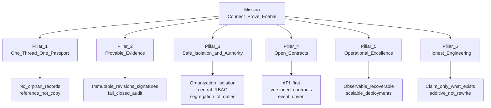

# Executive — Mission

| Field | Value |
|-------|-------|
| Document | Mission and operating commitments |
| Product | Mercury Aviation Enterprise Operating System (AEOS) |
| Organization | Mercury Technologies |
| Audience | Executives, employees, customers, partners, authorities |
| Status | Living baseline — changes require an ADR |
| Related | [Vision.md](Vision.md) · [Company_Strategy.md](Company_Strategy.md) · [../../ROADMAP.md](../../ROADMAP.md) |

---

## 1. Purpose and objectives

The vision states where Mercury is going. **The mission states what Mercury does every day to get there, and what it holds itself to while doing it.**

This document is written to be operationally usable: an engineer deciding how to implement a transition, a product manager deciding what to prioritize, a salesperson deciding what to promise, and a customer deciding whether to trust the platform should all be able to resolve their question against it.

Objectives:

1. State the mission in a single sentence that can be acted on.
2. Define the mission pillars that translate the vision's principles into daily practice.
3. Record the operating commitments Mercury makes to customers, engineers, partners, and authorities.
4. Show how the mission is executed across the aircraft lifecycle.
5. Define the constraints the mission accepts and the boundaries it will not cross.
6. Define how mission performance is measured.

---

## 2. Mission statement

> **Mercury Technologies builds and operates the Aviation Enterprise Operating System: a multi-tenant, API-first, audit-centric platform that makes every organization's aviation record complete, connected, provable, and safely accessible — so that qualified people can make airworthiness decisions from truth rather than from reconstruction.**

Three verbs carry the mission:

- **Connect** — bind organizations, aircraft, people, publications, tasks, parts, and evidence into One Digital Thread.
- **Prove** — make every airworthiness-significant fact traceable to an immutable authorizing revision, an accountable signer, and an audit record.
- **Enable** — put that truth in front of the person who needs it, scoped to their organization and their authority, at the moment of decision.

---

## 3. Mission pillars

### Pillar 1 — One Digital Thread, One Digital Aircraft Passport

Every capability Mercury builds must strengthen the thread. A feature that produces a record which cannot be placed in the aircraft and organization narrative is not accepted, however useful it appears in isolation. Each aircraft resolves to exactly one Digital Aircraft Passport whose configuration and life are computed from immutable events. Specification: [../04_Data/Digital_Thread.md](../04_Data/Digital_Thread.md).

### Pillar 2 — Provable evidence

Mercury's output is evidence, not activity. In practice this means:

- Work is authorized by a specific **immutable publication revision**, and release records that revision's number and date so later republication cannot rewrite history.
- Signatures are immutable and attributed. Where no real signature provider exists, the method is refused rather than simulated.
- The technical logbook is **append-only**; corrections are amendments that preserve the original.
- Released work cannot be mutated, and double release is refused.
- Audit on completion, inspection, and release is **fail-closed**: no audit, no action.

Specification: [../06_Security/Digital_Signatures.md](../06_Security/Digital_Signatures.md), [../06_Security/Audit.md](../06_Security/Audit.md).

### Pillar 3 — Safe isolation and correct authority

The organization is the isolation boundary. Membership grants reach; session context carries the active organization; authorization resolves server-side through central role-based access control (RBAC). Segregation of duties is enforced: the person who performed work cannot inspect it, and airworthiness certification authority (ACA) release authority is distinct from execution authority. Specification: [../06_Security/RBAC.md](../06_Security/RBAC.md), [../06_Security/Identity.md](../06_Security/Identity.md).

### Pillar 4 — Open contracts

Every capability is an API before it is a screen. Contracts are versioned, documented, and stable; significant state changes emit events so downstream capability can be added without coupling. Standards: [../08_Standards/API_Standards.md](../08_Standards/API_Standards.md).

### Pillar 5 — Operational excellence

A platform holding airworthiness records must be observable, recoverable, and predictable: structured logging with request and correlation identifiers, health and readiness probes, metrics, administrative visibility, rate limiting, and tested backup and restore. Deployment is reproducible and configuration-driven.

### Pillar 6 — Honest engineering

Mercury claims only what exists. Delivered capability and intended capability are labelled distinctly in every document, demonstration, and conversation. Changes are additive; working code is extended rather than replaced. No placeholders, no mocked logic presented as function, no compliance badge that has not been earned. See [../../SECURITY.md](../../SECURITY.md) section 8 and [../../CODE_OF_CONDUCT.md](../../CODE_OF_CONDUCT.md).

---

## 4. Operating commitments

### 4.1 To customers

| Commitment | What it means concretely |
|------------|--------------------------|
| **Your data is yours** | Organization isolation is enforced server-side; cross-organization access is explicit, scoped and audited. |
| **Your record is provable** | Every airworthiness-significant action resolves to an authorizing revision, an accountable signer and an audit entry. |
| **No surprises about capability** | You will be told what is delivered and what is planned, in writing, before you buy it. |
| **No lock-in through opacity** | Your data is reachable through documented APIs, and evidence is exportable with resolvable references. |
| **Continuity of your workflow** | Changes are additive; upgrades do not force you to relearn a working process without cause. |
| **Security handled seriously** | Vulnerabilities follow a defined private disclosure and remediation process with published response targets. |

### 4.2 To engineers building Mercury

| Commitment | What it means concretely |
|------------|--------------------------|
| **Fixed architecture, stable ground** | Vanilla JavaScript frontend, FastAPI backend, repository / service / thin-router layering, Alembic migrations, PostgreSQL. No framework churn. |
| **Read before writing** | Affected files are read and dependencies mapped before code is changed; existing components are reused rather than duplicated. |
| **One engine per concern** | No second maintenance task engine, no second audit path, no second permission model. |
| **Decisions are recorded** | Boundary, principle, and baseline changes are captured as Architecture Decision Records under [../08_Standards/ADR/](../08_Standards/ADR/). |
| **Stop when unclear** | Raising a question is always preferred to guessing. Guessing in a safety-adjacent record is a defect in the making. |
| **Quality gates are real** | Available tests are run; frontend load, endpoints, imports, and existing behaviour are verified before completion is declared. |

### 4.3 To partners and suppliers

Integration is a supported, documented, first-class path. Partner-provided data carries provenance into the thread. Partner access is scoped and audited like any other access.

### 4.4 To aviation authorities

Mercury supports oversight with records and evidence, and states plainly that it holds **no authority approval or certification of the software**. Regulatory documents describe alignment intent and evidence support, never approval. See [../09_Regulations/](../09_Regulations/) and [../../SECURITY.md](../../SECURITY.md).

---

## 5. Mission execution across the aircraft lifecycle

```mermaid
graph LR
  Induct["Induct_Aircraft<br/>registry_and_registration"] --> Config["Establish_Configuration<br/>ATA_positions_serialized_components_life"]
  Config --> Program["Adopt_Maintenance_Programme<br/>MPD_checks_AD_SB_EO"]
  Program --> Forecast["Forecast_Due_Work<br/>30_90_180_365_windows"]
  Forecast --> Plan["Plan_Inputs<br/>hangar_workforce_material_tools"]
  Plan --> Generate["Generate_Work_Package<br/>work_orders_and_job_cards"]
  Generate --> Supply["Supply_Materials_and_Tools<br/>Program_B_logistics"]
  Supply --> Execute["Execute_Job_Cards<br/>technician_work_and_findings"]
  Execute --> Inspect["Inspect<br/>including_independent_double_inspection"]
  Inspect --> Certify["Certify_and_Sign<br/>qualified_person_immutable_signature"]
  Certify --> Release["ACA_Release<br/>immutable_revision_and_ATA_reference"]
  Release --> Logbook["Technical_Logbook_Entry<br/>append_only"]
  Logbook --> Passport["Update_Digital_Aircraft_Passport"]
  Passport --> Reliability["Reliability_and_Continuing_Airworthiness_Review"]
  Reliability --> Program
```

| Lifecycle stage | Mission contribution | Runtime capability today |
|-----------------|---------------------|--------------------------|
| Induction and identity | The aircraft becomes an addressable, isolated, auditable entity | Aircraft registry, fleets, registrations, organization scoping |
| Configuration establishment | Configuration truth becomes computed rather than declared | ATA chapters, component catalog, serialized components, immutable install history, life counters and limits |
| Programme adoption | Requirements become data with intervals and applicability | Maintenance programmes with immutable revisions, MPD tasks, checks, Airworthiness Directives, Service Bulletins, Engineering Orders |
| Forecast and planning | Demand becomes visible before it becomes urgent | Forecast engine, due list, planner dashboard, hangar, workforce, parts and tool plan lines |
| Package generation | Planning becomes executable work without re-keying | Automatic work package, work order and job card generation |
| Supply | Material and tool demand is derived from the same plan | Program B warehouses, part master, stock ledger, rotables, tool crib, procurement chain, vendors, shipping, scan interfaces |
| Execution | Work is captured where it happens, with findings | Technician workflow, job-card transitions, attachments, offline synchronization queue |
| Inspection | Independence is enforced, not requested | Double inspection, quality assurance queues, performed-not-equal-inspected rule |
| Certification and release | Authority and authorization are proven | Certification chain, immutable signatures, ACA release requiring immutable revision and ATA reference |
| Record | History becomes permanent | Technical logbook with append-only amendment, component and aircraft history |
| Continuing airworthiness review | The loop closes on evidence, not anecdote | Utilization counters, status traffic lights, deferred defect and Minimum Equipment List control |

---

## 6. Mission constraints

The mission is bounded deliberately. These constraints are features of the mission, not limitations of ambition.

| Constraint | Reason |
|-----------|--------|
| **Mercury does not hold airworthiness authority** | Approval, certification, and release authority belong to qualified persons and approved organizations under applicable regulation. Mercury records and proves; it does not decide. |
| **Artificial intelligence advises; it never releases** | No model approves, certifies, inspects, or releases work. AI assists retrieval, drafting and triage under human accountability. See [../07_AI/AI_Strategy.md](../07_AI/AI_Strategy.md). |
| **No rewrite of a working platform** | The architecture is fixed; effort goes into aviation capability, not framework migration. See [../../ROADMAP.md](../../ROADMAP.md) non-goals. |
| **No claimed certification** | Mercury publishes no attestation, audit report, or compliance badge it has not independently obtained. |
| **Military is future** | Designed for segregation and classification readiness; no current accreditation claimed. |
| **Isolation is never traded for convenience** | No feature ships that reads across organizations without explicit, scoped, audited authorization. |

---

## 7. Mission metrics

| Pillar | Metric | Target posture |
|--------|--------|----------------|
| One thread, one passport | Share of airworthiness-significant records with complete, resolvable links | Increasing toward completeness; regressions treated as defects |
| Provable evidence | Count of unaudited safety-significant transitions | Zero, structurally enforced by fail-closed audit |
| Provable evidence | Time to produce an auditor-acceptable evidence pack | Reducing from days to minutes |
| Safe isolation and authority | Cross-organization disclosure findings | Zero; every cross-organization access explainable from audit |
| Safe isolation and authority | Segregation-of-duties violations reachable through the API | Zero |
| Open contracts | Share of capability reachable through documented API before user interface release | Complete |
| Operational excellence | Recovery objectives demonstrated by tested restore | Met and periodically re-demonstrated |
| Honest engineering | Capability claims found to overstate reality | Zero; any instance treated as a defect and corrected |

---

## 8. Future roadmap of the mission

The mission statement is durable. What changes is the breadth over which Mercury can honour it.

| Horizon | Mission extension | Reference |
|---------|-------------------|-----------|
| Assurance | Honour "provable" cryptographically — public-key-infrastructure and smart-card signature providers, atomic certification, managed tamper-evident attachment storage, evidence pack export | [../../SECURITY.md](../../SECURITY.md) |
| Ecosystem | Honour "connect" across organizational boundaries — OEM service-data exchange, lessor visibility, authority oversight views, supplier integration, shop-visit continuity | [../03_Business/](../03_Business/) |
| Intelligence | Honour "enable" predictively — knowledge graph, reliability analytics, predictive maintenance, digital twin, assistive retrieval, always advisory | [../07_AI/AI_Strategy.md](../07_AI/AI_Strategy.md) |
| Regulated extension | Honour the mission in the most demanding contexts — deeper regulatory alignment programmes and military domain readiness | [../09_Regulations/](../09_Regulations/) |

Sequencing and dependencies: [../../ROADMAP.md](../../ROADMAP.md).

---

## 9. Related documents

| Topic | Document |
|-------|----------|
| Root vision statement of record | [../../VISION.md](../../VISION.md) |
| Extended executive vision | [Vision.md](Vision.md) |
| Founders' letter | [Founders_Letter.md](Founders_Letter.md) |
| Company strategy | [Company_Strategy.md](Company_Strategy.md) |
| Enterprise architecture | [../02_Architecture/Enterprise_Architecture.md](../02_Architecture/Enterprise_Architecture.md) |
| Digital Thread specification | [../04_Data/Digital_Thread.md](../04_Data/Digital_Thread.md) |
| Security posture and non-claims | [../../SECURITY.md](../../SECURITY.md) |
| Conduct and integrity obligations | [../../CODE_OF_CONDUCT.md](../../CODE_OF_CONDUCT.md) |
| Contribution rules | [../../CONTRIBUTING.md](../../CONTRIBUTING.md) |

---

*Mercury Technologies — One Digital Thread. One Digital Aircraft Passport. One Aviation Enterprise Operating System.*
