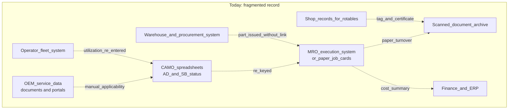
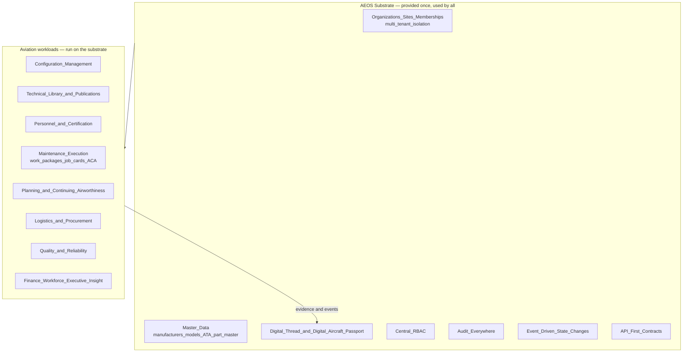

# Executive — Vision

| Field | Value |
|-------|-------|
| Document | Executive Vision (extended narrative) |
| Product | Mercury Aviation Enterprise Operating System (AEOS) |
| Organization | Mercury Technologies |
| Audience | Board, executives, investors, customer leadership, enterprise architects, authorities |
| Status | Living baseline — changes require an ADR |
| Root statement of record | [../../VISION.md](../../VISION.md) |
| Related | [Mission.md](Mission.md) · [Company_Strategy.md](Company_Strategy.md) · [Founders_Letter.md](Founders_Letter.md) |

---

## 1. Purpose and objectives

The root [VISION.md](../../VISION.md) is the concise, citable statement of record. **This document is the extended executive narrative behind it**: the industry conditions that make Mercury necessary, the reasoning behind each core principle, the shape of the ecosystem Mercury intends to serve, and how the vision will be measured over a multi-decade horizon.

Its objectives are to:

1. Give an executive reader enough industry context to evaluate the thesis without prior aviation systems background.
2. Explain *why* each core principle is non-negotiable, not merely assert it.
3. Define the scope of the ecosystem — who Mercury serves and in what capacity.
4. Establish the vision horizons that [../../ROADMAP.md](../../ROADMAP.md) sequences against.
5. Draw a clear, defensible line between what the runtime platform does today and what the vision intends.

---

## 2. Industry context

### 2.1 Aviation runs on evidence

Commercial aviation's safety record is the product of a disciplined evidence culture. An aircraft is airworthy not because it appears serviceable, but because a chain of records establishes that:

- its configuration matches an approved type design and approved modifications;
- every component installed is an approved part with traceable provenance and known accumulated life;
- every applicable Airworthiness Directive, applicable Service Bulletin, and scheduled maintenance requirement has been complied with or is within an approved deferral;
- the work performed was authorized by a specific, current technical publication revision;
- the work was performed and independently inspected by qualified persons;
- release to service was made by a person holding the authority to make it.

That chain is the asset. An aircraft with perfect physical condition and broken records cannot be operated or sold at value; an aircraft with intact records can be transferred, financed, leased, and audited.

### 2.2 The evidence is fragmented

Despite being the industry's core asset, this chain is assembled across systems that do not share a model of the world:

Every dotted edge is a human reconciliation step: a re-keyed value, an emailed spreadsheet, a scanned certificate filed in a folder. Each one is a place where truth can diverge and where an auditor's question becomes a research project.

### 2.3 The cost of fragmentation

| Symptom | Business consequence |
|---------|----------------------|
| Configuration drift between records and the physical aircraft | Rework, findings, re-inspection, and in the worst case an unairworthy condition undiscovered |
| Airworthiness Directive and Service Bulletin status tracked outside the system of record | Compliance risk and manual re-verification before every check and every audit |
| Component life reconstructed from tags and certificates | Delay and dispute at removal, shop visit, and reinstallation |
| Material and tool demand discovered during execution rather than in the forecast | Aircraft on ground, expedited freight, borrowed tooling, extended downtime |
| Evidence packs assembled manually | Weeks of effort per redelivery, transaction, or audit |
| Data locked in a single organization's tools | Every partner in the value chain re-enters what someone else already knows |

### 2.4 Why more point solutions do not solve it

The industry's instinct has been to add a specialist tool for each gap. Each addition improves a local process and adds a new integration boundary. After enough additions, the dominant cost is no longer any single process — it is the reconciliation between them.

Mercury's thesis is that the reconciliation cost is structural, and that it can only be removed by giving the industry's functions a **common substrate**: one tenancy model, one master data spine, one thread, one audit path, one permission model.

---

## 3. The AEOS thesis

> **Aviation does not need a twentieth system of record. It needs an operating system that the twenty functions can run inside.**

An operating system provides identity, isolation, storage, permissions, an event mechanism, and a stable interface — and then lets applications run on top without each one re-inventing those primitives. Mercury applies that pattern to aviation.

The consequence: a new workload — a lessor portal, a shop-visit workflow, an authority oversight view, a reliability model — inherits isolation, permissions, audit, and the thread for free. It does not create a new island.

---

## 4. One Digital Thread

### 4.1 Definition

The Digital Thread is the set of **durable, resolvable links** between every record that participates in an aircraft's or organization's narrative. It is not a report, a lineage feature, or an export. It is the shape of the data itself.

### 4.2 What the thread guarantees

| Question an executive, auditor, or engineer asks | Thread answer |
|------------------------------------------------|---------------|
| Why was this task performed? | The maintenance programme requirement, MPD task, Airworthiness Directive, Service Bulletin, Engineering Order, or reported defect that raised it |
| Under what authority was it performed? | The immutable publication revision referenced at execution, with its revision number and date snapshotted at release |
| Who performed and who inspected it? | The person records, their qualifications at the time, and their immutable signatures — with performed and inspected necessarily different persons |
| What was installed or removed? | The serialized component, its accumulated Time Since New, Time Since Overhaul, Cycles Since New and Cycles Since Overhaul, and its life limits |
| Where did the part come from? | The part master record, receiving inspection, vendor, and purchase order |
| Who released the aircraft to service? | The airworthiness certification authority (ACA) release and the resulting technical logbook entry |
| What is the aircraft's status now? | The Digital Aircraft Passport, computed from all of the above |

### 4.3 Thread integrity rules

1. **No orphans.** A record that cannot be placed in the aircraft and organization narrative should not exist.
2. **Reference, do not copy.** A copied value drifts; a reference cannot.
3. **Immutability where evidence lives.** Publication revisions, signatures, installation history, and logbook entries are immutable; corrections are appended, never overwritten.
4. **Bidirectional resolution.** Every link is navigable in both directions.
5. **Audit accompanies every transition.** For safety-significant transitions, the audit write is a precondition of success.

Specification: [../04_Data/Digital_Thread.md](../04_Data/Digital_Thread.md).

---

## 5. One Digital Aircraft Passport

The Digital Aircraft Passport is the single logical record of an aircraft. One aircraft, one passport, no reconciliation.

```mermaid
graph TB
  Passport["Digital_Aircraft_Passport"] --> Identity["Identity<br/>registration_serial_model_operator"]
  Passport --> Configuration["Current_Configuration<br/>ATA_positions_and_installed_components"]
  Passport --> History["Configuration_History<br/>immutable_install_and_remove_records"]
  Passport --> Life["Accumulated_Life<br/>TSN_TSO_CSN_CSO_and_limits"]
  Passport --> Program["Programme_Status<br/>MPD_checks_AD_SB_EO_compliance"]
  Passport --> Open["Open_Items<br/>MEL_CDL_and_deferred_defects"]
  Passport --> Evidence["Airworthiness_Evidence<br/>job_cards_inspections_signatures_ACA_releases"]
  Passport --> Logbook["Technical_Logbook<br/>append_only"]
  Passport --> Utilization["Utilization_Counters"]
```

Three properties make the passport more than a dashboard:

- **Computed, not asserted.** Configuration and life are derived from immutable events, so they cannot be quietly edited into a convenient state.
- **Continuously current.** It is true at all times, not at report-generation time.
- **Portable as evidence.** Because every element resolves to an immutable record, the passport can be presented to a lessor, buyer, or authority as evidence rather than as a summary requiring proof.

The passport is the artefact that turns Mercury from a workflow tool into an asset-value instrument. Aircraft transactions, lease redeliveries, and authority audits all reduce to: *can you prove it?*

---

## 6. The ecosystem Mercury serves

Mercury is an ecosystem platform, not a departmental application. Military aviation is a **future** domain, designed for but not claimed.

| Stakeholder | Role in the ecosystem | Vision commitment | Domain document |
|-------------|----------------------|-------------------|-----------------|
| Aircraft manufacturers (OEM) | Type design, catalogs, service data, applicability | Service data flows as structured, versioned, applicability-bearing data, with in-service effectivity feedback | [../03_Business/OEM.md](../03_Business/OEM.md) |
| Airlines, business, cargo and helicopter operators | Fleet, flight operations, maintenance control, reliability | Configuration truth, forecast-driven planning, fewer aircraft-on-ground surprises, defensible evidence | [../03_Business/Airline.md](../03_Business/Airline.md) |
| MRO organizations | Hangar execution, work packages, job cards, release | Package-to-release execution with enforced segregation of duties and clean turnover | [../03_Business/MRO.md](../03_Business/MRO.md) |
| CAMO organizations | Continuing airworthiness, programmes, Airworthiness Directive and Service Bulletin compliance | Airworthiness status computed continuously, not compiled before an audit | [../03_Business/CAMO.md](../03_Business/CAMO.md) |
| Component and engine shops | Rotables, repairs, shop visits | Serialized life continuity across removal, shop visit and reinstallation | [../03_Business/MRO.md](../03_Business/MRO.md) |
| Warehouses and suppliers | Logistics, procurement, receiving, shipping | Demand visible before the check; provenance carried into the thread | [../03_Business/Suppliers_Logistics.md](../03_Business/Suppliers_Logistics.md) |
| Leasing companies | Asset condition, lessor visibility, return standards | Continuous return-standard readiness instead of redelivery archaeology | [../03_Business/Leasing.md](../03_Business/Leasing.md) |
| Airports and flight operations | Utilization and operational status context | Operational reality bound to the same aircraft record maintenance uses | [../03_Business/Airline.md](../03_Business/Airline.md) |
| Engineering, quality assurance, reliability | Configuration integrity, inspection, signatures, trends | One thread as the basis for quality and reliability rather than sampled extracts | [../03_Business/MRO.md](../03_Business/MRO.md) |
| Finance, human resources, executives | Cost, capacity, workforce, portfolio insight | Insight derived from operational reality, not re-entered summaries | [Company_Strategy.md](Company_Strategy.md) |
| Aviation authorities | Oversight, records, evidence | Oversight-ready records with immutable references and complete audit; advisory posture, never a claim of approval | [../03_Business/Authority.md](../03_Business/Authority.md) |
| Military aviation | Future domain | Designed for segregation, classification readiness and disconnected topologies; no current accreditation claimed | [../../SECURITY.md](../../SECURITY.md) |

---

## 7. Core principles and their rationale

| Principle | Why it is non-negotiable |
|-----------|--------------------------|
| **One Digital Thread** | Without it, Mercury becomes another island and the reconciliation cost returns. The thread is the product. |
| **One Digital Aircraft Passport** | Two passports mean a reconciliation question, and a reconciliation question in airworthiness is a safety and value question. |
| **Multi-tenant with organization isolation** | Competitors, lessors and lessees, and rival operators' MRO providers share the platform. Isolation is the licence to operate. |
| **RBAC everywhere** | Authority in aviation is legally personal. If the platform lets an unqualified person certify, the platform has manufactured a false record. |
| **Audit everywhere, fail-closed** | An unaudited safety-significant action is indistinguishable from a fabricated one. Refusing the action is the safer failure. |
| **API-first** | The ecosystem thesis requires that partners integrate as first-class participants. A screen-first platform cannot be an ecosystem. |
| **AI-ready** | Value from prediction and assistance depends on structured, linked, indexed data. Retrofitting that later means re-modelling; designing for it costs almost nothing now. |
| **Cloud-native** | Operators span geographies and regulatory regimes; reproducible, observable, configuration-driven deployment is a prerequisite. |
| **Event-driven** | Aviation is a network of reactions — a defect raises a task, a task raises material demand. Events let those reactions exist without coupling modules. |
| **Modular** | Customers adopt in different orders and licence different scopes. Modularity is a commercial requirement as much as a technical one. |
| **Enterprise-scalable** | Real fleets, real document volumes, and multi-decade retention are the design case, not an optimization afterthought. |

Enforcement mechanics: [../02_Architecture/Technical_Architecture.md](../02_Architecture/Technical_Architecture.md), [../06_Security/RBAC.md](../06_Security/RBAC.md), [../06_Security/Audit.md](../06_Security/Audit.md).

---

## 8. Current reality versus vision

Professional integrity requires stating the boundary precisely. The runtime platform today implements a substantial, coherent slice of this vision.

**Implemented in the runtime:** organizations and multi-tenancy with membership-aware session context; aircraft registry and fleets; ATA chapters, component catalog, serialized components, immutable installation history and life tracking; technical library and typed publications with revision history and applicability; personnel, qualifications and ACA authorizations; the maintenance task engine and technical logbook with append-only amendment; work packages, work orders and job cards with validated transitions, double inspection, quality assurance queues, ACA release and immutable signatures; maintenance planning with programmes, MPD tasks, checks, Airworthiness Directives, Service Bulletins, Engineering Orders, Minimum Equipment List and Configuration Deviation List items, deferred defects, utilization counters, the forecast engine and automatic work-package generation; and Program B enterprise logistics with warehouses, part master, stock ledger, rotables, tool crib and calibration, the full procurement chain, vendors, shipping and scan interfaces — with material and tool demand derived from the same planning forecast.

**Vision, not yet reality:** cross-organization ecosystem exchange with OEMs, lessors and authorities at scale; federated enterprise identity; cryptographic signature providers; knowledge graph, reliability analytics, predictive maintenance and digital twin; and the military domain.

Sequencing: [../../ROADMAP.md](../../ROADMAP.md). Architecture of record: [../02_Architecture/Enterprise_Architecture.md](../02_Architecture/Enterprise_Architecture.md).

---

## 9. Vision horizons

| Horizon | Executive question it answers | Primary reference |
|---------|-------------------------------|-------------------|
| 1 — Foundation | Can one platform hold the whole operating record of an aviation organization, with isolation and audit? | [../02_Architecture/Enterprise_Architecture.md](../02_Architecture/Enterprise_Architecture.md) |
| 2 — Assurance | Can that record survive the scrutiny of an enterprise security review and a regulatory audit? | [../../SECURITY.md](../../SECURITY.md) |
| 3 — Ecosystem | Can partners across the value chain participate in the same thread instead of exporting from it? | [../03_Business/](../03_Business/) |
| 4 — Intelligence | Can the thread predict and advise, not only record? | [../07_AI/AI_Strategy.md](../07_AI/AI_Strategy.md) |
| 5 — Regulated extension | Can Mercury operate in the most demanding regulatory and defence contexts? | [../09_Regulations/](../09_Regulations/) |

---

## 10. How the vision is measured

| Dimension | Measure | Why this measure |
|-----------|---------|------------------|
| Thread integrity | Share of airworthiness-significant records with complete, resolvable links to aircraft, publication revision and signer | Directly tests the central claim |
| Passport completeness | Share of managed aircraft whose configuration, life and open items are computed rather than asserted | Distinguishes a real passport from a dashboard |
| Evidence readiness | Elapsed time to produce a complete, auditor-acceptable evidence pack | The commercial value of the thread, made measurable |
| Planning quality | Share of material and tool demand identified before the check opens | Tests the planning-to-logistics bridge |
| Isolation assurance | Zero cross-organization disclosure findings; every cross-organization access explainable from audit | The licence-to-operate metric |
| Adoption breadth | Number of distinct stakeholder domains operating inside the same tenant ecosystem | Tests the ecosystem thesis, not just seat growth |
| Record trust | Zero unaudited safety-significant state transitions | The floor beneath every other metric |

---

## 11. Related documents

| Topic | Document |
|-------|----------|
| Root vision statement of record | [../../VISION.md](../../VISION.md) |
| Mission and operating commitments | [Mission.md](Mission.md) |
| Founders' letter | [Founders_Letter.md](Founders_Letter.md) |
| Company strategy | [Company_Strategy.md](Company_Strategy.md) |
| Enterprise architecture | [../02_Architecture/Enterprise_Architecture.md](../02_Architecture/Enterprise_Architecture.md) |
| Digital Thread specification | [../04_Data/Digital_Thread.md](../04_Data/Digital_Thread.md) |
| Product family and editions | [../05_Product/Product_Family.md](../05_Product/Product_Family.md) |
| Security posture and non-claims | [../../SECURITY.md](../../SECURITY.md) |
| Delivery sequencing | [../../ROADMAP.md](../../ROADMAP.md) |

---

*Mercury Technologies — One Digital Thread. One Digital Aircraft Passport. One Aviation Enterprise Operating System.*
