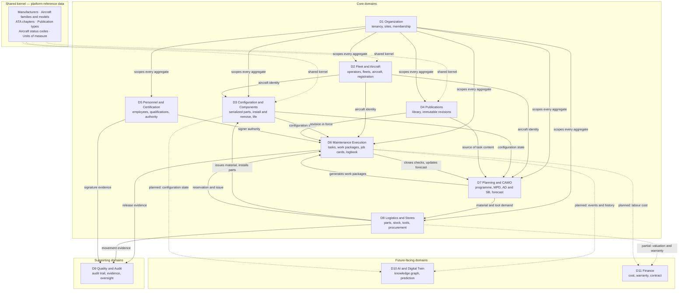
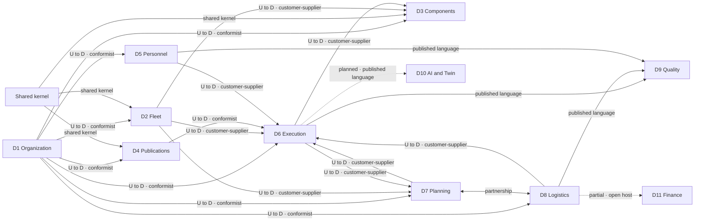
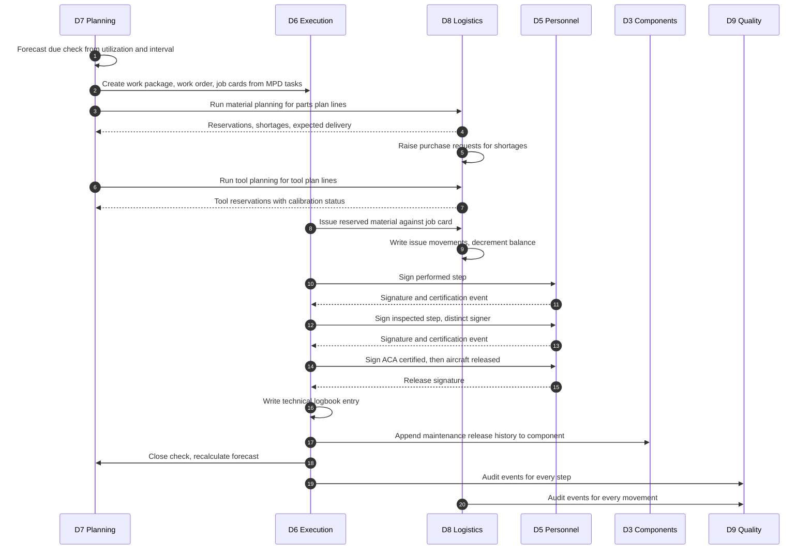

# Domain Architecture — Mercury Aviation Enterprise Operating System

| Field | Value |
|-------|-------|
| Document | Domain Architecture |
| Product | Mercury Aviation Enterprise Operating System (AEOS) |
| Organization | Mercury Technologies |
| Layer | Domain (bounded contexts, aggregates, ubiquitous language, integration) |
| Audience | Architects, domain consultants, developers, data modellers |
| Status | Living baseline |
| Companion documents | [Enterprise Architecture](Enterprise_Architecture.md) · [System Context](System_Context.md) · [Technical Architecture](Technical_Architecture.md) |
| Upstream authority | [Blueprint README](../../README.md) |

---

## 1. Scope

### 1.1 In scope

This document defines Mercury's **domain model at the architectural level**: which bounded contexts exist, what each one owns, the aggregates and lifecycle rules inside each context, the relationships and integration patterns between contexts, and the ubiquitous language that all of them share.

It covers eleven domains:

| # | Domain | Standing |
|---|--------|----------|
| D1 | Organization | Core, implemented |
| D2 | Fleet and Aircraft | Core, implemented |
| D3 | Configuration and Components | Core, implemented |
| D4 | Publications | Core, implemented |
| D5 | Personnel and Certification | Core, implemented |
| D6 | Maintenance Execution | Core, implemented |
| D7 | Planning and CAMO | Core, implemented |
| D8 | Logistics and Stores | Core, implemented |
| D9 | Quality and Audit | Supporting, partial |
| D10 | AI and Digital Twin | Future-facing, planned |
| D11 | Finance | Capability view, partial |

### 1.2 Out of scope

| Concern | Authoritative location |
|---------|------------------------|
| Capability maturity, value streams, governance | [Enterprise Architecture](Enterprise_Architecture.md) |
| Actors, external systems, container topology | [System Context](System_Context.md) |
| Layering, module package pattern, transaction mechanics | [Technical Architecture](Technical_Architecture.md) |
| Physical schema, column-level detail, identifier formats | [Data Model](../04_Data/Data_Model.md) |
| Digital thread edge catalogue | [Digital Thread](../04_Data/Digital_Thread.md) |
| Canonical vocabulary and reference catalogues | [Master Data](../04_Data/Master_Data.md) |
| Permission matrices and signature semantics | [Security documentation set](../06_Security/) |
| Naming and contract conventions | [Standards documentation set](../08_Standards/) |

### 1.3 Relationship to runtime modules

Each core domain maps one-to-one onto a Python package under `backend/app/`. This is intentional: the module boundary *is* the context boundary, so that a future service extraction is a packaging exercise rather than a redesign.

| Domain | Runtime package | API prefix |
|--------|----------------|------------|
| D1 Organization | `backend/app/org/` | `/api/v1` — organizations, sites, memberships |
| D2 Fleet and Aircraft | `backend/app/fleet/` | `/api/v1/fleet` |
| D3 Configuration and Components | `backend/app/components/` | `/api/v1/components` |
| D4 Publications | `backend/app/publications/` | `/api/v1/publications`, `/api/v1/library` |
| D5 Personnel and Certification | `backend/app/personnel/` | `/api/v1/personnel` |
| D6 Maintenance Execution | `backend/app/maintenance/`, `backend/app/work_orders/` | `/api/v1/maintenance`, `/api/v1/work-orders` |
| D7 Planning and CAMO | `backend/app/planning/` | `/api/v1/planning` |
| D8 Logistics and Stores | `backend/app/logistics/` | `/api/v1/logistics` |
| D9 Quality and Audit | `backend/app/audit.py`, `backend/app/routers/admin.py` | `/api/v1/audit`, `/admin` |
| D10 AI and Digital Twin | Not yet a module | — |
| D11 Finance | Cross-cutting fields in D8, guarded by `logistics.finance` | `/api/v1/logistics` |

---

## 2. Design principles

| # | Principle | Statement | Consequence |
|---|-----------|-----------|-------------|
| DP-1 | **The domain owns its data** | A context's tables are private. No other context reads or writes them directly. | Cross-context access goes through the owning context's service class. Joins across context tables are a defect. |
| DP-2 | **One aggregate, one transaction** | A single transaction modifies one aggregate root and its children; cross-aggregate work is a sequence of intentional steps. | Where the current runtime deviates — release plus logbook, package generation plus material reservation — the deviation is named explicitly in §5 and justified by an atomicity requirement. |
| DP-3 | **Organization scopes every tenant aggregate** | Every tenant-owned aggregate root carries an organization identifier, and every service asserts access before acting. | Organization is not a query filter added late; it is part of aggregate identity. |
| DP-4 | **Evidence aggregates are append-only** | Certification events, signatures, technical logbook entries, stock movements, and audit events are written once. | Corrections create new records referencing the original. No update path exists for evidence. |
| DP-5 | **Reference data is shared and immutable to tenants** | Manufacturers, models, ATA chapters, and publication types are platform catalogues that tenants read but do not own. | Shared kernel, governed centrally. See [Master Data](../04_Data/Master_Data.md). |
| DP-6 | **Language is ubiquitous and aviation-native** | The code, the API, and the user interface use the words the industry uses: job card, work package, ACA, MPD, rotable, serviceable. | No translation layer between domain expert and developer. Renaming a domain term requires an ADR. |
| DP-7 | **Upstream and downstream are declared** | Every context relationship in §6 states which side is upstream and which integration pattern applies. | Prevents accidental bidirectional coupling. |
| DP-8 | **Workflow invariants live in the domain, not the client** | Certification ordering, distinct-signer rules, release preconditions, and stock availability are enforced in the service layer. | A client can be wrong; the domain cannot. |
| DP-9 | **Future domains are shaped, not stubbed** | AI, twin, and finance are described as target contexts with defined boundaries and no placeholder code. | The blueprint carries the design; the runtime carries only what works. |

---

## 3. Domain map

---

## 4. Ubiquitous language

The following terms carry a single, binding meaning across every context, every API, and every screen. Redefining one requires an ADR under [docs/08_Standards/ADR/](../08_Standards/ADR/).

| Term | Definition | Owning domain |
|------|------------|---------------|
| **Company** | The legal or corporate parent grouping one or more organizations. | D1 |
| **Organization** | The tenant isolation boundary. Every tenant-owned record belongs to exactly one. | D1 |
| **Site** | A physical operating location — station, hangar, or warehouse campus — within an organization. | D1 |
| **Membership** | A user's association with an organization, carrying the role effective in that organization. | D1 |
| **Operator** | The organization holding operational responsibility for a set of aircraft. | D2 |
| **Fleet** | A managed grouping of aircraft within an operator. | D2 |
| **Aircraft** | A uniquely identified airframe with a registration, a model, and a status. | D2 |
| **Registration** | The nationality and registration mark assigned to an aircraft; historically variable. | D2 |
| **ATA chapter** | The Air Transport Association chapter classifying a system or task. | Shared kernel |
| **Component** | A serialized or batch-tracked part with its own identity and life record. | D3 |
| **Configuration** | The set of components installed on an aircraft at positions at a point in time. | D3 |
| **Installation history** | The append-only record of install, remove, transfer, and maintenance-release events for a component. | D3 |
| **Publication** | A controlled technical document — maintenance manual, illustrated parts catalogue, wiring diagram, structural repair manual, service bulletin text. | D4 |
| **Revision** | An immutable, dated version of a publication. Work is always performed against a specific revision. | D4 |
| **Employee** | A person in an organization who can be assigned work and can sign. | D5 |
| **Qualification** | A recorded competence held by an employee, with validity dates. | D5 |
| **Authorization** | A granted authority to certify — most significantly the Aircraft Certification Authority, or ACA. | D5 |
| **Digital signature** | A recorded act of signing, bound to an employee, a method, a target, and a hash of the canonical signed content. | D5 |
| **Maintenance task** | The unit of maintenance work that carries the certification lifecycle and produces the logbook entry. | D6 |
| **Certification event** | One completed step in a task's certification workflow, bound to a signature. | D6 |
| **Certification step** | One of: `performed`, `inspected`, `independent_inspection`, `aca_certified`, `aircraft_released`. | D6 |
| **Work package** | The planned bundle of work for an aircraft in a visit. | D6 |
| **Work order** | A grouping of job cards within a package, typically by system or trade. | D6 |
| **Job card** | The executable instruction issued to a technician; the shop-floor unit of work. | D6 |
| **Technical logbook entry** | The permanent record created on aircraft release, naming every signer and the revision in force. | D6 |
| **Independent inspection** | A second inspection by a distinct qualified individual, required on designated critical tasks. | D6 |
| **Release to service** | The certifying act returning an aircraft or component to service. | D6 |
| **Maintenance programme** | The approved schedule of recurring maintenance for a fleet or type. | D7 |
| **MPD task** | A Maintenance Planning Document task defining recurring work, its interval, and its resource demand. | D7 |
| **Check** | A scheduled maintenance event derived from the programme. | D7 |
| **Airworthiness directive** | A mandatory instruction issued by an authority. | D7 |
| **Service bulletin** | A manufacturer instruction, mandatory or recommended by applicability. | D7 |
| **Engineering order** | An organization's own approved engineering instruction. | D7 |
| **MEL / CDL** | Minimum Equipment List and Configuration Deviation List, governing dispatch with inoperative items. | D7 |
| **Deferred defect** | A defect carried forward under a defined control with a rectification deadline. | D7 |
| **Forecast / due list** | The projected schedule of upcoming maintenance from utilization and intervals. | D7 |
| **Part master** | The catalogue definition of a part number, independent of any physical unit. | D8 |
| **Stock unit** | A physical quantity of a part at a location, in a condition, with lot, batch, or serial identity. | D8 |
| **Stock balance** | The aggregated on-hand and reserved quantity for a part, location, and condition. | D8 |
| **Stock movement** | An append-only ledger row recording a change of stock state. | D8 |
| **Condition** | The airworthiness state of stock — serviceable, unserviceable, quarantine, scrap. | D8 |
| **Reservation** | A hold placed on available stock for a specific demand source. | D8 |
| **Material request** | A demand for parts against a work package or job card. | D8 |
| **Rotable** | A repairable component that cycles between service, removal, repair, and return to stock. | D8 |
| **Tool** | A controlled item requiring reservation, issue, return, and calibration currency. | D8 |
| **Audit event** | An immutable record of an actor performing an action on a target with an outcome. | D9 |

---

## 5. Bounded contexts

Each context below states its purpose, its aggregates, its invariants, what it publishes, what it consumes, and its honest current state.

### 5.1 D1 — Organization

**Purpose.** Own tenancy. Define who the customer enterprise is, how it is structured, who belongs to it, and what scope a session operates in.

**Aggregates.**

| Aggregate root | Children | Identity |
|----------------|----------|----------|
| Company | Organizations | Company identifier |
| Organization | Sites, departments, teams | Organization identifier — the tenancy key for the whole platform |
| Site | Departments | Site identifier, unique within organization |
| User | Memberships | Username |
| Membership | — | User plus organization |

**Invariants.**
- An organization belongs to exactly one company.
- A site belongs to exactly one organization.
- A user may only assume a session context for an organization in which they hold an active membership; platform administrators are the sole exception and their access is audited.
- The role effective in a session is derived from membership, not from the login directory alone.
- An organization must have at least one site before a session can be established against it.

**Publishes.** `organization.created`, `organization.updated`, `membership.granted`, `membership.revoked`, `session.context.switched`.

**Consumes.** Nothing. D1 is the most upstream context.

**Current state.** **Implemented.** Company, organization, site, department, team, and membership are persisted; session context switching validates membership and re-derives the effective role; denied switches are audited as security events.

---

### 5.2 D2 — Fleet and Aircraft

**Purpose.** Own aircraft identity. Answer "which aircraft exist, who operates them, and what are they."

**Aggregates.**

| Aggregate root | Children | Identity |
|----------------|----------|----------|
| Aircraft | Registrations, status history | Aircraft identifier, organization-scoped |
| Fleet | Aircraft assignments | Fleet identifier, organization-scoped |
| Operator | Fleets | Operator identifier, organization-scoped |
| Aircraft model — shared kernel | Variants | Model identifier, platform-owned |
| Aircraft family — shared kernel | Models | Family identifier, platform-owned |
| Manufacturer — shared kernel | Families | Manufacturer identifier, platform-owned |

**Invariants.**
- An aircraft references exactly one model from the shared catalogue.
- An aircraft belongs to exactly one organization and at most one fleet at a time.
- A registration mark is unique among active registrations within an organization.
- Manufacturer, family, and model are platform reference data; tenants read them and cannot mutate them.

**Publishes.** `aircraft.registered`, `aircraft.status.changed`, `aircraft.assigned.to.fleet`, `registration.changed`.

**Consumes.** D1 organization scope; shared-kernel catalogue.

**Current state.** **Implemented.** Shared manufacturer, family, model, and status catalogue plus organization-scoped operators, fleets, aircraft, and registrations. Lease and ownership structures are not yet first-class.

---

### 5.3 D3 — Configuration and Components

**Purpose.** Own what is fitted to the aircraft and what has happened to each fitted item. This context is the backbone of the digital aircraft passport.

**Aggregates.**

| Aggregate root | Children | Identity |
|----------------|----------|----------|
| Component | Installation history entries | Component identifier, organization-scoped |
| Aircraft configuration | Position assignments | Derived from aircraft plus installed components |
| ATA chapter — shared kernel | Sub-chapters | ATA code, platform-owned |
| Component catalogue entry | — | Catalogue identifier |

**Invariants.**
- A component is installed on at most one aircraft, at one position, at any moment.
- Every install, remove, transfer, and maintenance release appends a history entry; history is never rewritten.
- A history entry records the from-status and to-status, the actor, the reason, and a reference to the originating record.
- A component's organization must match the organization of the aircraft it is installed on.
- Removing a component does not delete its history; the history follows the component.

**Publishes.** `component.installed`, `component.removed`, `component.transferred`, `component.status.changed`, `configuration.changed`.

**Consumes.** D1 organization scope; D2 aircraft identity; shared-kernel ATA catalogue. Receives `maintenance_release` history events from D6 and physical part identity from D8.

**Current state.** **Implemented.** ATA catalogue, serialized components, install, remove, and transfer history, and aircraft configuration all exist. Full assembly hierarchy with next-higher-assembly rollup is a gap.

---

### 5.4 D4 — Publications

**Purpose.** Own controlled technical content. Guarantee that work performed can always be traced to the exact revision in force at the time.

**Aggregates.**

| Aggregate root | Children | Identity |
|----------------|----------|----------|
| Publication | Revisions | Publication identifier, organization-scoped |
| Revision | Storage locators | Revision identifier, immutable once created |
| Publication type — shared kernel | — | Type code, platform-owned |

**Invariants.**
- A revision is immutable. Correcting content means issuing a new revision, never editing an existing one.
- A revision carries a revision number, a revision date, and an effective date.
- A publication may be archived; archived publications cannot be bound to new work.
- Content binaries are referenced by licence-safe storage locator. Mercury holds the metadata and the pointer; it does not redistribute licensed manufacturer content it has no right to hold.
- Publications link to ATA chapters, aircraft models, and families so applicability can be resolved.

**Publishes.** `publication.created`, `revision.issued`, `publication.archived`.

**Consumes.** D1 organization scope; D2 model and family identity; shared-kernel ATA and publication-type catalogues.

**Current state.** **Implemented.** Organization-scoped publications with immutable revisions, licence-safe storage locators, and ATA, catalogue, model, and family linkage. A managed binary content store and an in-place viewer are planned.

---

### 5.5 D5 — Personnel and Certification

**Purpose.** Own who may do what, and record the act of signing. This context supplies the authority that makes a release valid.

**Aggregates.**

| Aggregate root | Children | Identity |
|----------------|----------|----------|
| Employee | Qualifications, authorizations | Employee identifier, organization-scoped |
| Qualification | — | Qualification identifier |
| Authorization | — | Authorization identifier — includes ACA |
| Digital signature | — | Signature identifier, immutable |

**Invariants.**
- An employee belongs to exactly one organization and must be active to sign.
- A signing employee must be bound to the authenticated user performing the request.
- The signing method must be a recognized method, and the presented credential must be verified for that method.
- A signature records a SHA-256 hash over a canonical payload of organization, target, step, employee, username, method, timestamp, and notes.
- A signature is never updated or deleted.
- ACA authorization must be held and valid at the moment of an ACA certification step.

**Publishes.** `employee.created`, `qualification.granted`, `qualification.expired`, `authorization.granted`, `signature.created`.

**Consumes.** D1 organization scope and user identity.

**Current state.** **Implemented.** Employees, qualifications, ACA authorizations, signer binding, credential verification per method, and hash-based signatures with attestation flags for PIN, password, PKI, smart card, and biometric readiness. Cryptographic certificate-chain signing is a named gap; the current scheme attests content and method but does not provide certificate-backed non-repudiation.

---

### 5.6 D6 — Maintenance Execution

**Purpose.** Own the performance and certification of work, and the permanent evidence that results from it. This is the most safety-critical context in the platform.

D6 spans two runtime packages that together form one bounded context, split by responsibility rather than by domain:

| Runtime package | Responsibility |
|-----------------|----------------|
| `backend/app/maintenance/` | The maintenance task, its certification workflow, digital signatures for certification, and the technical logbook |
| `backend/app/work_orders/` | The planning and shop-floor structure: work packages, work orders, and job cards |

**Aggregates.**

| Aggregate root | Children | Identity |
|----------------|----------|----------|
| Maintenance task | Certification events | Task identifier plus organization-unique task number |
| Work package | Work orders | Package identifier plus package number |
| Work order | Job cards | Order identifier |
| Job card | — | Job card identifier plus job card number |
| Technical logbook entry | — | Log entry identifier, immutable |

**Invariants.**
- A job card that will be certified must reference a maintenance task.
- Certification steps must be signed in the order required by the task's configuration; an out-of-order step is rejected.
- A step may be signed only once per task.
- The individual signing an independent inspection must be distinct from the individual who performed the work and from the primary inspector.
- Release requires that all prior required steps are complete, that the job card references an immutable publication revision, and that an ATA chapter is set.
- An aircraft release writes exactly one technical logbook entry, in the same transaction as the release signature.
- A logbook entry names the performing mechanic, the inspector, the independent inspector where applicable, the ACA, the release signature, and the publication revision in force.
- A finalized or released task cannot be re-signed.
- Job card, work order, and work package statuses roll up: a package is not complete while any child is open.

**Publishes.** `job_card.assigned`, `job_card.work.completed`, `job_card.inspected`, `job_card.released`, `task.certified`, `task.released`, `logbook.entry.created`, `work_package.status.changed`.

**Consumes.** D1 organization scope; D2 aircraft identity; D3 component identity — and writes `maintenance_release` history back to D3; D4 publication revisions as a release precondition; D5 employee authority and signature creation; D7 generated packages and job cards; D8 material issue against job cards.

**Current state.** **Implemented.** The full technician, inspector, independent inspector, ACA, and release chain is enforced server-side, with publication-revision and ATA preconditions, distinct-signer rules, automatic logbook creation, and component history write-back. Offline mobile execution is a gap.

---

### 5.7 D7 — Planning and CAMO

**Purpose.** Own continuing airworthiness. Decide what work is due, when, on what authority, and turn that decision into executable work.

**Aggregates.**

| Aggregate root | Children | Identity |
|----------------|----------|----------|
| Maintenance programme | Programme revisions, MPD tasks | Programme identifier, organization-scoped |
| Check | Generated package reference | Check identifier plus check code |
| Airworthiness directive | Applicability, compliance records | AD identifier |
| Service bulletin | Applicability, compliance records | SB identifier |
| Engineering order | Applicability | EO identifier |
| MEL / CDL item | — | Item identifier |
| Deferred defect | — | Defect identifier |
| Utilization record | — | Aircraft plus timestamp |
| Forecast entry | — | Derived |
| Plan line — parts, tools, hangar, workforce | — | Line identifier, work-package-scoped |

**Invariants.**
- A check belongs to an aircraft and derives from a programme revision.
- A check may generate at most one work package; a second attempt is rejected.
- Generating a package moves the check into work and records the generated package reference.
- A deferred defect must carry a rectification deadline and a controlling reference.
- Forecast entries are derived from utilization and interval; they are recomputed, never hand-edited.
- Plan lines are owned by the work package and reflect the demand that planning determined.

**Publishes.** `check.due`, `check.overdue`, `work_package.generated`, `forecast.recalculated`, `ad.raised`, `sb.raised`, `defect.deferred`.

**Consumes.** D1 organization scope; D2 aircraft and fleet identity; D3 configuration for applicability; D4 publications as task source; D6 package, order, and job card creation; D8 material and tool planning.

**Current state.** **Implemented.** Programmes and revisions, MPD tasks, checks, AD, SB, and EO records, MEL and CDL, deferred defects, utilization, forecast and due list, plan lines, and automatic work-package generation that reaches through to logistics reservation. Automated applicability evaluation against live configuration and interactive slot optimization are gaps.

---

### 5.8 D8 — Logistics and Stores

**Purpose.** Own the physical supply chain: what parts exist, where they are, in what condition, who holds them, and how they were procured.

**Aggregates.**

| Aggregate root | Children | Identity |
|----------------|----------|----------|
| Part master | Identifiers, family membership, supersessions | Part master identifier, organization-scoped |
| Warehouse | Locations | Warehouse identifier |
| Stock unit | — | Unit identifier, carrying serial, batch, or lot |
| Stock balance | — | Part plus location plus condition |
| Stock movement | — | Movement identifier, append-only |
| Reservation | — | Reservation identifier |
| Material request | Request lines | Request identifier |
| Tool | Reservations, issues, calibration records, lost-tool reports | Tool identifier |
| Purchase request | Lines | Request identifier |
| Request for quotation | Quotes | RFQ identifier |
| Purchase order | Lines, receipts | Order identifier |
| Receipt | Inspection, putaway | Receipt identifier |
| Rotable cycle | — | Cycle identifier |
| Shipment | Attachments | Shipment identifier |

**Invariants.**
- Every change to stock state writes a movement row. There is no silent stock change.
- Reserved quantity never exceeds on-hand quantity at a location and condition.
- A reservation that cannot be satisfied at a single location is rejected rather than silently split.
- Issue draws from stock units according to the part's issue policy — first expired, first out by default.
- Stock condition transitions are explicit; a unit does not become serviceable without a recorded event.
- Receiving establishes shelf life from the part master where the part is life-limited.
- A tool cannot be issued while an open issue exists against it.
- A tool with lapsed calibration cannot be reserved as calibration-current.

**Publishes.** `stock.received`, `stock.issued`, `stock.adjusted`, `stock.scrapped`, `stock.reserved`, `reservation.released`, `shortage.detected`, `purchase_request.raised`, `purchase_order.placed`, `goods.received`, `tool.issued`, `tool.returned`, `rotable.cycle.opened`, `shipment.dispatched`.

**Consumes.** D1 organization scope; D7 material and tool demand; D6 job card and work package references on issue; D3 component identity when an issued part becomes an installed component.

**Current state.** **Implemented.** Part master with families, identifiers, and supersession; warehouses, locations, stock units, balances, and the movement ledger; reservations, material requests, issue and return; tools with calibration and lost-tool reporting; purchase requests, RFQs, quotes, purchase orders, receipts with inspection and putaway; rotable cycles, shipments, and attachments; plus a dashboard and shortage view. Multi-currency valuation, cycle-count programmes, and supplier scoring are gaps.

---

### 5.9 D9 — Quality and Audit

**Purpose.** Own the evidence layer. Make the platform answerable to a quality manager or an authority inspector without forensic reconstruction.

**Aggregates.**

| Aggregate root | Children | Identity |
|----------------|----------|----------|
| Audit event | — | Event identifier, append-only |
| Evidence record | — | Evidence identifier |
| Finding — planned | Corrective actions | Finding identifier |
| Corrective action — planned | — | Action identifier |
| Audit programme — planned | Scheduled audits | Programme identifier |

**Invariants.**
- An audit event records actor, actor role, organization, site, target type, target identifier, source, outcome, origin, and detail.
- Audit events are never modified or deleted by application code.
- Audit queries are scoped to the caller's organization and site and honour the configured retention window.
- Audit write failure is logged and does not roll back the business transaction — a deliberate availability trade-off, recorded here so it is a decision rather than a surprise.

**Publishes.** Nothing. D9 is terminal by design.

**Consumes.** Every other context. Audit is produced both by middleware over authenticated mutating API calls and by explicit domain calls at significant transitions.

**Current state.** **Partial.** The audit trail, the evidence records, and the scoped audit query with retention are implemented. Findings, corrective actions, and audit programme management are planned. Tamper-evident hash chaining is planned and is the single most valuable hardening step for this context.

---

### 5.10 D10 — AI and Digital Twin — future-facing

**Purpose.** Turn the digital thread into foresight: retrieval over technical content, reliability insight, and condition prediction.

This context does not exist in the runtime. Document index, embedding, and knowledge cross-reference stubs are present under the maintenance APIs, but there is **no retrieval, no optical character recognition, and no model inference** in the current release. Describing it as available would violate principle EP-12 in the [Enterprise Architecture](Enterprise_Architecture.md#2-design-principles).

**Target aggregates.**

| Aggregate root | Purpose |
|----------------|---------|
| Knowledge node | A graph node projecting an aircraft, component, task, publication section, or defect |
| Knowledge edge | A typed, provenance-tagged relationship between nodes |
| Embedding index entry | A vector representation of a publication section or historical record |
| Twin state | The modelled current condition of an aircraft or component |
| Prediction | An advisory forecast with a confidence value and a provenance chain |
| Advisory | A surfaced recommendation, always attributed and always reviewable |

**Boundary rules — binding on any future implementation.**
- D10 is strictly **downstream**. It reads projections of other contexts and never writes into them.
- Every AI output carries provenance: which records informed it, which model version produced it, and when.
- No AI output may be a precondition for a certification step, a release, or a compliance determination.
- Advisory outputs surface to a human who accepts, rejects, or comments; the human decision is what is recorded.
- Model inference must never sit in the synchronous path of a safety-critical transaction.

**Relationship to the current decision engine.** The runtime contains an advisory decision engine used in the operations and incident domain. It is explicitly advisory, its evaluations are audited, and its recommendations require human review. It is a precedent for how D10 should behave, not an implementation of D10.

**Current state.** **Planned.** See the [AI documentation set](../07_AI/) and [Knowledge Graph](../04_Data/Knowledge_Graph.md).

---

### 5.11 D11 — Finance — capability view

**Purpose.** Express the economic consequence of maintenance and supply activity: what the work cost, what the inventory is worth, what is recoverable under warranty or contract.

Finance is presented as a **capability view** rather than a fully owned context, because Mercury does not intend to become a general ledger. The boundary is deliberate: Mercury owns the operational cost event and the asset valuation; the customer's finance system owns the accounting treatment.

**Aggregates.**

| Aggregate root | Standing |
|----------------|----------|
| Stock valuation | **Partial** — valuation fields exist on logistics records |
| Warranty record | **Partial** — warranty expiry captured on received stock units |
| Purchase commitment | **Partial** — represented by purchase orders |
| Labour cost record | **Planned** — derived from job card actual hours and a rate model |
| Work package cost rollup | **Planned** — material plus labour plus external services |
| Warranty claim | **Planned** — claim lifecycle and recovery tracking |
| Contract and rate schedule | **Planned** — customer and vendor commercial terms |

**Boundary rules.**
- Mercury records cost **events**; it does not perform accounting postings.
- The general-ledger interface, when built, is an outbound integration with an explicit contract, not a shared database.
- Finance visibility is permission-gated separately from operational visibility; the runtime already separates a `logistics.finance` scope from general logistics access.

**Current state.** **Partial.** Valuation and warranty fields plus a distinct finance permission scope exist. Labour costing, work-package rollup, claim management, and the ledger interface are planned.

---

## 6. Bounded context relationships

### 6.1 Relationship map

Legend: **U to D** is upstream to downstream. **Conformist** means the downstream context accepts the upstream model as-is. **Customer-supplier** means the downstream context's needs influence the upstream context's contract. **Partnership** means the two contexts succeed or fail together and coordinate their releases. **Published language** means integration through a stable, documented event or record contract. **Open host** means a general-purpose interface offered to multiple consumers.

### 6.2 Relationship register

| From | To | Pattern | What crosses the boundary | Enforcement |
|------|----|---------|---------------------------|-------------|
| D1 | All tenant contexts | Upstream, conformist | Organization identifier, site identifier, effective role | Every service resolves the organization and asserts access before acting |
| Shared kernel | D2, D3, D4 | Shared kernel | Manufacturers, families, models, ATA chapters, publication types, status codes | Platform-owned; tenants read only |
| D2 | D3 | Upstream, customer-supplier | Aircraft identity and organization ownership | Component installation validates the aircraft and matching organization |
| D2 | D6, D7 | Upstream, customer-supplier | Aircraft identity, registration, model | Tasks, packages, and checks reference the aircraft |
| D4 | D6 | Upstream, conformist | Publication and immutable revision identity | Release is blocked unless the job card references a live publication and a matching revision |
| D5 | D6 | Upstream, customer-supplier | Employee identity, active status, qualification, ACA authority | Signing validates employee, organization, active status, signer binding, credential, and step authority |
| D7 | D6 | Upstream, customer-supplier | Generated work package, work order, and job cards from MPD tasks | Planning calls the execution service; it never writes execution tables |
| D7 | D8 | Partnership | Material demand and tool demand; reservation, shortage, and calibration results flow back | Planning invokes logistics material and tool planning inline and updates its own plan lines from the result |
| D8 | D6 | Upstream, customer-supplier | Reservation availability, material issue against a job card | Issue records the job card or work package as the movement reference |
| D6 | D3 | Upstream, customer-supplier | Maintenance-release history event on the affected component | Written in the release transaction |
| D6 | D7 | Upstream, customer-supplier | Completion signals that close checks and drive forecast recalculation | Status rollup and check closure |
| D8 | D3 | Upstream, customer-supplier | A physical stock unit becoming an installed serialized component | Issue then install; identity is carried across |
| D6, D8, D5 | D9 | Published language | Audit events, certification events, movements, signatures | Middleware plus explicit domain audit calls |
| D6, D3 | D10 | Planned, published language | Read-only projections of history and configuration | To be defined; strictly one-directional |
| D8, D6 | D11 | Open host — partial | Valuation, warranty, commitment; labour cost planned | Guarded by a distinct finance permission scope |

### 6.3 Anti-corruption layers

Mercury applies an anti-corruption layer at every boundary where an external model would otherwise leak into the domain:

| Boundary | Layer | Reason |
|----------|-------|--------|
| External identity provider — planned | Identity translation into Mercury users and memberships | An external directory's group model must never become Mercury's authority model. Certification authority is Mercury's own determination. |
| OEM service data — planned | Applicability translation into Mercury AD, SB, and EO records | Manufacturer applicability formats vary; the domain must see one shape. |
| Customer general ledger — planned | Cost event export contract | Accounting treatment is the customer's concern, not Mercury's domain model. |
| Object store — planned | Storage locator abstraction | Publications already reference content by locator, which keeps the storage technology out of the domain. |
| AI model outputs — planned | Advisory record with provenance | Model output enters the domain only as an attributed advisory, never as a fact. |

### 6.4 Context ownership and team topology

| Context group | Cohesion rationale |
|---------------|--------------------|
| D1 plus D9 | Tenancy and evidence are platform-wide concerns with the same reviewers |
| D2 plus D3 plus D4 | The asset and its controlled information move together; the digital aircraft passport spans all three |
| D5 plus D6 | Authority and the act it authorizes are inseparable; changes to one usually implicate the other |
| D7 plus D8 | Planning and supply are a partnership; their release cycles must be coordinated |
| D10 plus D11 | Downstream analytical contexts, delivered later, on read-only projections |

---

## 7. Cross-domain workflows

### 7.1 Planning to execution to release to logistics

### 7.2 Where the domain deviates from one aggregate per transaction

Principle DP-2 says one transaction touches one aggregate. Two runtime flows deliberately break that rule, and both are justified by an atomicity requirement that outweighs the purity of the boundary:

| Flow | Aggregates in one transaction | Justification |
|------|------------------------------|---------------|
| Aircraft release | Maintenance task, certification event, digital signature, technical logbook entry, component installation history | A release without its logbook entry is an unrecorded release. There is no acceptable window in which one exists without the other. |
| Work package generation | Check, work package, work order, job cards, plan lines, stock reservations, tool reservations, hangar and workforce plans | A package that exists with material silently unreserved would mislead a planner into scheduling work that cannot be supported. |

Both are recorded here so that a future service extraction confronts them explicitly. Splitting either across services requires a compensating design — a saga with a durable outbox — and an ADR.

---

## 8. Non-functional requirements

### 8.1 Reading the targets

As in the [Enterprise Architecture](Enterprise_Architecture.md#111-how-to-read-this-section), **current baseline** is what the runtime demonstrably does; **aspirational enterprise target** is a directional design target used for sizing. Aspirational targets are not service-level agreements.

### 8.2 Availability

| Concern | Current baseline | Aspirational enterprise target |
|---------|------------------|-------------------------------|
| Domain availability | All contexts share one application process; the failure domain is the whole platform | Independent availability per context group, so that a logistics outage cannot stop a release |
| Critical-path contexts | D5 and D6 must be available for any release to occur | 99.95 percent for the certification and release path |
| Degraded operation | Not differentiated by context | Read-only continuation for D2, D3, D4, and D9 while write paths are degraded |
| Failure isolation | A defect in any module can affect all | Context-level bulkheads once contexts are separately deployable |

### 8.3 Performance

| Concern | Current baseline | Aspirational enterprise target |
|---------|------------------|-------------------------------|
| Certification step | Row lock on the task plus signature, event, and status write in one transaction | 95th percentile under 500 ms |
| Aircraft release | Adds logbook and component history to the certification transaction | 95th percentile under 1 second |
| Work package generation | Bounded by a caller-supplied job-card ceiling; material and tool planning run inline | Under 5 seconds for 200 job cards |
| Stock reservation | Availability computed from balances at reservation time | 95th percentile under 300 ms |
| Configuration read for an aircraft | Direct query against component tables | Under 200 ms from a passport read model |
| Cross-domain dashboard | Aggregates across contexts on demand | Under 1 second from purpose-built read models |

### 8.4 Durability and recoverability

| Concern | Current baseline | Aspirational enterprise target |
|---------|------------------|-------------------------------|
| Evidence durability — D5, D6, D9 | Delegated to PostgreSQL and the operator's backup regime | **RPO 0** for signatures, certification events, and logbook entries; write-ahead replication with synchronous commit for evidence tables |
| Transactional durability — D2, D3, D7, D8 | Same | **RPO 15 minutes** |
| Recovery of the release path | Whole-platform restore | **RTO 1 hour** for read-only evidence access; **RTO 4 hours** for full write capability |
| Ledger integrity — D8 movements | Append-only by convention and code discipline | Database-level append-only enforcement plus periodic reconciliation of balances against the movement ledger |
| Evidence retention | Configurable retention window on audit queries | Life of asset plus the authority-required period, with archival tiering |

These RPO and RTO figures are **aspirational enterprise targets** that express what Mercury's persistence strategy must eventually satisfy. The distinction between RPO 0 for evidence and RPO 15 minutes for transactional data is deliberate: losing fifteen minutes of stock movements is recoverable by a physical count, whereas losing a release signature is not recoverable at all.

### 8.5 Integrity

Domain integrity requirements, all **Implemented** unless marked:

| Requirement | Owning context |
|-------------|----------------|
| Certification steps occur in the required order | D6 |
| A step is signed once and only once per task | D6 |
| Independent inspection requires a distinct signer | D6 |
| Release requires a publication revision and an ATA chapter | D6 |
| Release always produces a logbook entry, atomically | D6 |
| A signature is bound to an active employee in the correct organization | D5 |
| A signing employee is bound to the authenticated user | D5 |
| Reserved stock never exceeds on-hand stock | D8 |
| Every stock state change writes a movement row | D8 |
| A component is installed at one position on one aircraft at a time | D3 |
| A publication revision is immutable once issued | D4 |
| A check generates at most one work package | D7 |
| Cross-context balance reconciliation between movements and balances | D8 — **Planned** |
| Tamper-evident chaining of evidence records | D9 — **Planned** |

### 8.6 Consistency model

| Boundary | Consistency | Rationale |
|----------|-------------|-----------|
| Within an aggregate | Strong, transactional | Invariants must hold at all times |
| Release plus logbook plus component history | Strong, one transaction | Evidence completeness is non-negotiable |
| Package generation plus reservations | Strong, one transaction | Planner trust in material availability |
| Execution completion to forecast recalculation | Strong today; **eventual is acceptable** | A forecast that lags by seconds harms nobody |
| Any context to D9 audit | Best-effort today, at-least-once target | Audit failure must not stop safe work, but must not be silently lost either |
| Any context to D10 | Eventual by design | Analytical projections tolerate lag |

---

## 9. Security considerations

**Organization is the primary security boundary of the domain model, not an attribute of it.** Every tenant-owned aggregate root carries an organization identifier, and every service asserts access against the caller's session before reading or writing. A defect that allows an aggregate to be fetched by identifier without an organization assertion is a tenant-isolation breach regardless of how obscure the path is. Isolation is therefore tested per context, not only at the framework level.

**Authority is domain state, not session state.** A session role determines what endpoints a user may call. Whether that user may *sign* a given certification step is determined by D5: the employee record, its active status, its qualifications, its ACA authorization, and the signer binding to the authenticated user. These two checks are independent and both must pass. Collapsing them into one would let a permission grant silently confer certification authority.

**Distinct-signer rules are a domain invariant with a safety purpose.** Independent inspection exists precisely so that one person's error is caught by another. Enforcement lives in D6 at signing time, is checked against prior certification events, and cannot be waived by configuration.

**Evidence contexts have a different threat model from operational contexts.** For D2, D7, and D8 the primary risks are unauthorized modification and cross-tenant leakage. For D5, D6, and D9 the primary risk is **repudiation** — a signer later denying an act, or a record being altered after the fact. This is why those contexts are append-only, why signatures hash a canonical payload, and why tamper-evident chaining is the highest-value planned hardening.

**Cross-context calls carry the caller's identity, not a service identity.** When planning calls execution, or execution calls personnel, the originating username and session role travel with the call and the downstream context re-asserts authorization. There is no internal trusted caller that bypasses checks. Preserving this property through any future service extraction is mandatory: the extracted service must authenticate the propagated principal, not trust the network.

**Publication licensing is a security and legal boundary.** D4 holds metadata and licence-safe locators rather than manufacturer binaries. Any future content store must preserve per-organization licence scoping and must not become a mechanism for redistributing licensed content across tenants.

**Finance visibility is separately gated.** D11 data is guarded by a distinct permission scope so that operational access does not imply commercial access. A maintenance supervisor seeing part availability should not thereby see vendor pricing.

Full detail: [Security documentation set](../06_Security/), [Identity](../06_Security/Identity.md), [RBAC](../06_Security/RBAC.md), [Audit](../06_Security/Audit.md), [Digital Signatures](../06_Security/Digital_Signatures.md).

---

## 10. Scalability considerations

### 10.1 Per-context growth and pressure

| Context | Growth driver | Dominant pressure | Mitigation path |
|---------|--------------|-------------------|-----------------|
| D1 Organization | Tenant count | Membership lookups on every request | Cache the membership and effective-role resolution per session |
| D2 Fleet | Aircraft count | Low; bounded by fleet size | None needed near term |
| D3 Components | Installed components times history events | History table growth | Partition history by time; index by component and aircraft |
| D4 Publications | Revisions times linked models | Metadata is small; binaries are external | Managed object store with signed URLs |
| D5 Personnel | Employees times signatures | Signature table grows with every certification step | Partition by time; archive with the evidence tier |
| D6 Execution | Job cards times certification events times logbook entries | Highest transactional write rate; row locks on state transitions | Keep transactions short; partition events and logbook by time |
| D7 Planning | Forecast recomputation across the fleet | Read-heavy computation over utilization and intervals | Materialize the due list; recompute on utilization change rather than on read |
| D8 Logistics | Movements, the fastest-growing table in the platform | Ledger volume and balance contention | Partition movements by time; consider per-location balance sharding |
| D9 Quality | Every mutating call plus every domain event | Audit volume exceeds business data volume | Time partitioning plus cold-tier archival; asynchronous write once a bus exists |
| D10 AI and Twin | Projection volume | Analytical, not transactional | Separate store, separate scaling |
| D11 Finance | Cost events | Low | Follows D8 |

### 10.2 Extraction order, if and when services become necessary

Mercury is a modular monolith today and that is the right shape for its current stage. If extraction becomes necessary, the domain boundaries determine the order — from the loosest coupling to the tightest:

1. **D9 Quality and Audit.** Already terminal and write-only from other contexts. The natural first extraction; requires only a durable event transport.
2. **D4 Publications.** Read-mostly, few write paths, and its only hard coupling to D6 is a revision existence check that an API call satisfies.
3. **D8 Logistics and Stores.** Large and self-contained, but its partnership with D7 means package generation would need a saga with compensation. This is the first extraction that costs real design work.
4. **D7 Planning and CAMO.** Depends on the D8 extraction being solved first, since the two are partners.
5. **D2 Fleet and D3 Components.** Extract together; splitting aircraft identity from configuration would create chatty cross-service reads on the hottest path in the platform.
6. **D5 Personnel and D6 Execution.** Extract last, or never. The certification transaction spans both, and its atomicity is a safety property. Distributing it would trade a guarantee for a saga.

**A standing conclusion:** the correct number of services for Mercury may well remain one for a long time. Extraction should be triggered by a demonstrated scaling or team-topology need, recorded in an ADR — never by architectural fashion.

### 10.3 What must survive any decomposition

- Organization isolation on every call, with the caller's principal propagated and re-verified.
- Ordered certification enforcement and distinct-signer rules.
- Atomic release plus logbook creation.
- Stock reservation correctness under concurrency.
- A complete audit trail with no gap at a service boundary.

---

## 11. Future enhancements

| # | Enhancement | Context | Value | Depends on |
|---|-------------|---------|-------|------------|
| 1 | Digital aircraft passport read model | D2, D3, D6 | One authoritative projection of identity, configuration, life, and evidence for lessors, buyers, and authorities | Cross-context read model |
| 2 | Full assembly hierarchy with next-higher-assembly rollup | D3 | Accurate life tracking on nested components | Component model extension |
| 3 | Automated applicability evaluation | D7 | AD and SB applicability resolved against live configuration instead of by hand | D3 configuration query contract |
| 4 | Findings, corrective actions, and audit programme | D9 | Completes the quality management capability | D9 aggregate expansion |
| 5 | Tamper-evident audit and evidence chaining | D9, D5, D6 | Hash-linked records with periodic anchoring; the highest-value integrity upgrade available | Append-only store |
| 6 | Cryptographic signature chain | D5 | Certificate-backed non-repudiation replacing hash attestation | Key management infrastructure |
| 7 | Reliability and trend analytics | D7, D10 | Removal rates, mean time between unscheduled removals, programme escalation evidence | Data quality from D3 and D6 |
| 8 | Knowledge graph over publications and history | D10 | Retrieval and cross-reference across the technical library | Graph store and embeddings |
| 9 | Digital twin and predictive maintenance | D10 | Condition-based forecast input, strictly advisory | Reliability data and twin state model |
| 10 | Labour costing and work package cost rollup | D11, D6 | True maintenance cost per event | Rate model and actual-hours capture |
| 11 | Warranty claim lifecycle | D11, D8 | Recovery of warranted cost | Warranty record expansion |
| 12 | Lessor and authority read-only projections | D2, D3, D6, D9 | Scoped, audited external visibility without granting tenancy | Cross-organization sharing construct |
| 13 | Lease and ownership as first-class fleet records | D2 | Correct asset attribution for lessors and financiers | Fleet model extension |
| 14 | Multi-currency valuation and cycle counting | D8 | International supply chain and inventory accuracy | Valuation model extension |
| 15 | Offline-capable job card execution | D6 | Hangar-floor work without connectivity | Conflict resolution design |
| 16 | Cross-organization data-sharing agreements | D1 | Operator, MRO, and lessor collaboration on shared aircraft | Explicit, audited sharing aggregate |

---

## 12. Related documents

**Within this architecture set**
[Enterprise Architecture](Enterprise_Architecture.md) · [System Context](System_Context.md) · [Technical Architecture](Technical_Architecture.md)

**Data and digital thread**
[Digital Thread](../04_Data/Digital_Thread.md) · [Data Model](../04_Data/Data_Model.md) · [Master Data](../04_Data/Master_Data.md) · [Knowledge Graph](../04_Data/Knowledge_Graph.md)

**Security**
[Security documentation set](../06_Security/) · [Identity](../06_Security/Identity.md) · [RBAC](../06_Security/RBAC.md) · [Audit](../06_Security/Audit.md) · [Digital Signatures](../06_Security/Digital_Signatures.md) · [SECURITY.md](../../SECURITY.md)

**Standards and governance**
[Standards documentation set](../08_Standards/) · [API Standards](../08_Standards/API_Standards.md) · [Coding Standards](../08_Standards/Coding_Standards.md) · [UI Standards](../08_Standards/UI_Standards.md) · [ADR register](../08_Standards/ADR/)

**Business, product, AI, regulation**
[Business documentation set](../03_Business/) · [Product documentation set](../05_Product/) · [AI documentation set](../07_AI/) · [Regulations documentation set](../09_Regulations/)

**Repository root**
[README](../../README.md) · [VISION](../../VISION.md) · [ROADMAP](../../ROADMAP.md)

---

*Mercury Technologies — One Digital Thread. One Digital Aircraft Passport. One Aviation Enterprise Operating System.*
