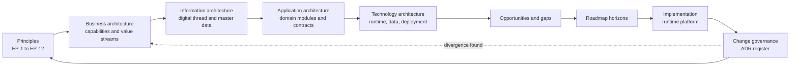
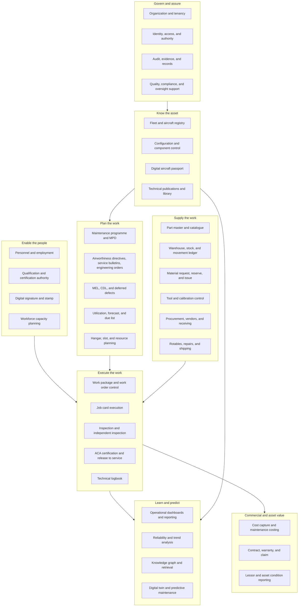
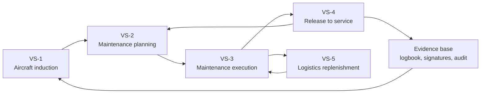
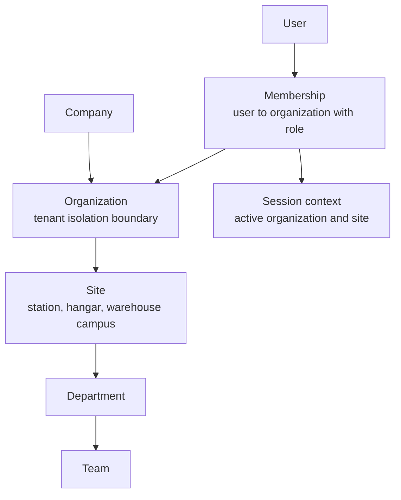

# Enterprise Architecture — Mercury Aviation Enterprise Operating System

| Field | Value |
|-------|-------|
| Document | Enterprise Architecture |
| Product | Mercury Aviation Enterprise Operating System (AEOS) |
| Organization | Mercury Technologies |
| Layer | Enterprise (business capability, value stream, governance) |
| Audience | Executives, enterprise architects, domain consultants, partners, auditors |
| Status | Living baseline |
| Companion documents | [Domain Architecture](Domain_Architecture.md) · [System Context](System_Context.md) · [Technical Architecture](Technical_Architecture.md) |
| Upstream authority | [Blueprint README](../../README.md) |

---

## 1. Scope

### 1.1 In scope

This document defines the **enterprise-level architecture** of Mercury: the business capabilities Mercury provides, the value streams those capabilities serve, the architecture principles that constrain every design decision, the governance model that keeps blueprint and runtime aligned, and the enterprise-level non-functional targets.

Specifically, it covers:

- The Mercury **capability map** across all aviation enterprise domains, with an honest maturity rating per capability.
- The five primary **value streams** — aircraft induction, maintenance planning, execution, release to service, and logistics replenishment — and how they traverse capabilities.
- The **architecture method**: a practical, TOGAF-flavored working model rather than a ceremonial ADM implementation.
- The **enterprise non-functional requirements**, split explicitly between *today's verified baseline* and *aspirational enterprise targets*.
- The **architecture governance** process: ADRs, principle compliance, dispensations, and blueprint/runtime reconciliation.
- The **architecture roadmap horizons** that sequence capability maturity.

### 1.2 Out of scope

| Concern | Authoritative location |
|---------|------------------------|
| Domain boundaries, bounded contexts, ubiquitous language | [Domain Architecture](Domain_Architecture.md) |
| Actors, external systems, container decomposition | [System Context](System_Context.md) |
| Layers, module package pattern, data flows, persistence | [Technical Architecture](Technical_Architecture.md) |
| Entity model, identifiers, digital thread edges | [Digital Thread](../04_Data/Digital_Thread.md), [Data Model](../04_Data/Data_Model.md) |
| Identity, RBAC matrices, audit schema, signature semantics | [Security documentation set](../06_Security/) |
| API, UI, and coding conventions; ADR register | [Standards documentation set](../08_Standards/) |
| Regulatory interpretation and authority mapping | [Regulations documentation set](../09_Regulations/) |
| Commercial packaging, editions, pricing | [Product documentation set](../05_Product/) |

### 1.3 Maturity legend

Every capability and target in this document carries an explicit maturity marker. Mercury's blueprint is deliberately **honest about the gap between intent and implementation**; capability claims that outrun the runtime are an architecture defect, not marketing latitude.

| Marker | Meaning |
|--------|---------|
| **Implemented** | Present in the runtime platform, exercised by automated tests, and usable end to end. |
| **Partial** | Present in the runtime for a meaningful subset of the capability; known gaps are named in text. |
| **Planned** | Designed in the blueprint, not present in the runtime. No customer commitment is implied. |
| **Aspirational** | A directional enterprise target used for design sizing. Not a service level agreement. |

---

## 2. Design principles

Mercury's enterprise principles are binding. A change that violates one requires an Architecture Decision Record under [docs/08_Standards/ADR/](../08_Standards/ADR/) before implementation.

| # | Principle | Statement | Rationale | Implication |
|---|-----------|-----------|-----------|-------------|
| EP-1 | **One Digital Thread** | Every configuration state, task, signature, part movement, and publication reference resolves into a single coherent narrative for an aircraft and an organization. | Airworthiness is an evidentiary discipline. Disconnected records force manual reconciliation and create audit risk. | No module may persist a lifecycle-significant fact without a traceable link to the aircraft, component, task, or organization it concerns. See [Digital Thread](../04_Data/Digital_Thread.md). |
| EP-2 | **One Digital Aircraft Passport** | Identity, configuration, life status, and airworthiness evidence for an aircraft are one logical passport, regardless of which module wrote each fact. | Lessors, authorities, and buyers need a single defensible asset record, not a report assembled from silos. | Fleet, components, maintenance, and planning must agree on aircraft identity and configuration semantics. |
| EP-3 | **Multi-tenant with organization isolation** | Organization is a first-class boundary on every tenant-owned row and every service call, not a UI filter. | Mercury serves competing operators, MROs, and lessors on shared infrastructure. | Every service resolves and asserts organization access before reading or writing. Cross-organization reads require an explicit, audited sharing construct. |
| EP-4 | **Role-based access control everywhere** | Authorization is enforced server-side on every endpoint through declared permissions; the client never decides access. | Client-side gating is a presentation convenience, never a control. | Router dependencies declare required permissions; services re-assert organization scope. See [Security documentation set](../06_Security/). |
| EP-5 | **Audit everywhere** | Every mutating, authenticated API call and every lifecycle-significant state change produces an audit record with actor, role, organization, site, target, outcome, and origin. | Regulators and quality systems ask "who did what, when, under what authority" — the platform must answer without forensics. | Audit is middleware plus explicit domain events, not an optional feature flag. |
| EP-6 | **API-first** | Every capability is available through a versioned HTTP API before it is available in any user interface. | Integrations, mobile clients, and AI agents are first-class consumers, not afterthoughts. | The vanilla-JS operator UI is one client of `/api/v1`, with no privileged backdoor. See [API standards](../08_Standards/API_Standards.md). |
| EP-7 | **AI-ready, not AI-dependent** | Data is structured, linked, and provenance-tagged so that AI can be added; no airworthiness decision depends on a model output. | Aviation safety cases cannot rest on non-deterministic components. | AI outputs are advisory, attributed, and reviewable. See [AI documentation set](../07_AI/). |
| EP-8 | **Cloud-native** | The platform runs as stateless, containerized, horizontally schedulable processes over managed data services. | Predictable operations, elastic cost, and disaster recovery. | State that currently lives in process memory is tracked as explicit architectural debt (see §11.3). |
| EP-9 | **Event-driven readiness** | Lifecycle-significant changes are modelled as domain events with stable names, whether delivered in-process today or over a broker later. | The migration from monolith to services must not require re-deriving the event vocabulary. | Event names are part of the contract and are governed like API paths. |
| EP-10 | **Modular by domain** | The system is decomposed by aviation domain, not by technical layer, and each domain owns its models, contracts, and persistence. | Domain modularity is the precondition for both team scaling and any future service extraction. | Cross-domain access goes through the owning domain's service class, never through another domain's tables. |
| EP-11 | **Additive evolution** | Mercury grows by adding modules, endpoints, and columns — never by rewriting working subsystems. | Continuity of certified evidence and customer trust outweighs architectural elegance. | Migrations are forward-only and additive; breaking changes require an ADR and a deprecation window. |
| EP-12 | **Evidence over assertion** | Compliance claims must be backed by retrievable records, not by product statements. | Mercury supports oversight; it does not grant approval. | Every regulatory-adjacent feature ships with the record that proves it happened. |

---

## 3. Architecture method — TOGAF-flavored, practically applied

Mercury borrows TOGAF's separation of architecture domains and its change-governance discipline, and deliberately discards its ceremony. The working model is a continuous cycle, not a phase gate.

| TOGAF concept | Mercury practice | Artefact |
|---------------|------------------|----------|
| Architecture principles | Twelve binding principles, testable in review | §2 of this document |
| Business architecture | Capability map plus five value streams | §4, §5 |
| Information systems architecture — data | Digital thread and master data model | [Digital Thread](../04_Data/Digital_Thread.md), [Master Data](../04_Data/Master_Data.md) |
| Information systems architecture — application | Domain modules with owned contracts | [Domain Architecture](Domain_Architecture.md) |
| Technology architecture | Container topology and runtime layers | [System Context](System_Context.md), [Technical Architecture](Technical_Architecture.md) |
| Opportunities and solutions | Gap analysis per capability maturity | §4.2 |
| Migration planning | Roadmap horizons H1–H4 | §15 |
| Implementation governance | ADR register plus principle compliance review | §14, [ADR register](../08_Standards/ADR/) |
| Architecture change management | Blueprint/runtime reconciliation loop | §14.3 |
| Requirements management | Non-functional requirements with explicit maturity | §11 |

**Deliberate omissions.** Mercury does not maintain an Architecture Repository taxonomy, a formal Architecture Board with scheduled sittings, or Business Transformation Readiness Assessments. The blueprint repository *is* the repository; the ADR register *is* the board record; readiness is demonstrated by shipped, tested slices.

---

## 4. Capability map

### 4.1 The map

### 4.2 Capability inventory and maturity

| Capability | Maturity | Runtime anchor | Gap to close |
|------------|----------|----------------|--------------|
| Organization and tenancy | **Implemented** | `backend/app/org/` — company, organization, site, department, team, membership; session context switching | Cross-organization data-sharing agreements between partner tenants. |
| Identity, access, and authority | **Partial** | Session cookie authentication, four session roles, permission checks per endpoint, thirteen documented aviation personas | External identity provider federation; personas as enforced principals rather than documented recommendations. |
| Audit, evidence, and records | **Implemented** | Middleware audit of authenticated mutating API calls plus explicit domain audit events; organization- and site-scoped audit query with retention | Tamper-evident chaining and long-term archival export. |
| Quality, compliance, and oversight support | **Partial** | Audit query API, certification event trail, release evidence snapshots | Finding and corrective-action management; scheduled audit programme. |
| Fleet and aircraft registry | **Implemented** | `backend/app/fleet/` — manufacturer, family, model, status catalogue plus organization-scoped operators, fleets, aircraft, registrations | Lease and ownership structures as first-class records. |
| Configuration and component control | **Implemented** | `backend/app/components/` — ATA catalogue, serialized components, install, remove, transfer history, aircraft configuration | Full assembly hierarchy and next-higher-assembly rollup. |
| Digital aircraft passport | **Partial** | Assembled from fleet, components, maintenance, and logbook records | A single passport read model and export contract. |
| Technical publications and library | **Implemented** | `backend/app/publications/` — organization-scoped publications, immutable revisions, licence-safe storage locators, ATA and model linkage | Managed binary content store and in-place viewer. |
| Personnel and employment | **Implemented** | `backend/app/personnel/` — employees, qualifications, authorizations | Training records and recurrent-training scheduling. |
| Qualification and certification authority | **Implemented** | Signer binding, authority checks per certification step, ACA authorizations | Authority scope by aircraft type rating enforced at task level. |
| Digital signature and stamp | **Implemented** | SHA-256 canonical-payload signatures with method flags for PIN, password, PKI, smart card, and biometric readiness | Cryptographic PKI signing with certificate chain validation. |
| Workforce capacity planning | **Partial** | Workforce plan lines generated with work packages | Shift rosters, skills-based assignment, and capacity levelling. |
| Maintenance programme and MPD | **Implemented** | `backend/app/planning/` — programmes, revisions, MPD tasks, checks | Programme escalation and sampling analysis. |
| Airworthiness directives, service bulletins, engineering orders | **Implemented** | Planning module AD, SB, and EO records with applicability | Automated applicability evaluation against live configuration. |
| MEL, CDL, and deferred defects | **Implemented** | Planning module MEL and CDL records, deferred defect tracking | Operational dispatch integration. |
| Utilization, forecast, and due list | **Implemented** | Utilization capture and forecast or due-list generation | Utilization ingestion from flight-operations systems. |
| Hangar, slot, and resource planning | **Partial** | Hangar plan lines created alongside generated work packages | Interactive slot optimization and constraint solving. |
| Work package and work order control | **Implemented** | `backend/app/work_orders/` — packages, orders, job cards with status rollup | Multi-site package transfer. |
| Job card execution | **Implemented** | Technician accept, progress, complete with signature capture | Offline-capable mobile execution. |
| Inspection and independent inspection | **Implemented** | Inspection and independent-inspection steps with distinct-signer authority checks | Sampling and surveillance inspection types. |
| ACA certification and release to service | **Implemented** | Ordered certification workflow with publication-revision and ATA preconditions before release | Authority-specific release-certificate rendering. |
| Technical logbook | **Implemented** | Log entry written automatically on aircraft release, capturing every signer and the publication revision in force | Flight-leg and defect-entry logbook alongside maintenance entries. |
| Part master and catalogue | **Implemented** | `backend/app/logistics/` — part master, families, identifiers, supersession chains | Manufacturer catalogue synchronization. |
| Warehouse, stock, and movement ledger | **Implemented** | Warehouses, locations, stock units, balances, and an append-only movement ledger | Multi-currency valuation and cycle-count programmes. |
| Material request, reserve, and issue | **Implemented** | Material requests with reserve, issue, and return; automated planning-driven reservation | Kitting and pre-pick staging. |
| Tool and calibration control | **Implemented** | Tool register with reservation, issue, return, calibration status, and lost-tool reporting | Tool-crib hardware integration. |
| Procurement, vendors, and receiving | **Implemented** | Purchase requests, requests for quotation, quotes, purchase orders, receipts with inspection and putaway | Supplier performance scoring and EDI. |
| Rotables, repairs, and shipping | **Implemented** | Rotable cycles, shipments, attachments | Third-party shop portal integration. |
| Operational dashboards and reporting | **Implemented** | Execution, planning, and logistics dashboards; report summary and history endpoints | Configurable report builder and scheduled distribution. |
| Reliability and trend analysis | **Planned** | — | Reliability data model and statistical engine. |
| Knowledge graph and retrieval | **Planned** | Document index and cross-reference stubs exist under maintenance APIs; no retrieval or OCR in the current release | Graph store, embeddings, and retrieval pipeline. See [AI documentation set](../07_AI/). |
| Digital twin and predictive maintenance | **Planned** | — | Twin state model and prediction service. |
| Cost capture and maintenance costing | **Partial** | Logistics valuation fields and a `logistics.finance` permission scope | Labour costing, work-package cost rollup, and general-ledger interface. |
| Contract, warranty, and claim | **Partial** | Warranty expiry captured on received stock units | Claim lifecycle and recovery tracking. |
| Lessor and asset condition reporting | **Planned** | — | Lessor read-only projection and return-condition reporting. |

---

## 5. Value streams

Mercury organizes delivery around five primary value streams. Each stream is stated as a chain of stages with an entry trigger, an exit condition, the capabilities consumed, and the evidence produced.

### 5.1 The end-to-end chain

### 5.2 VS-1 — Aircraft induction

**Trigger.** An organization takes an aircraft onto its certificate, or a new customer aircraft arrives for maintenance.
**Exit.** The aircraft exists with a verified registry entry, a baseline configuration, applicable publications, and an assigned maintenance programme.

| Stage | Activity | Capability | Evidence produced |
|-------|----------|------------|-------------------|
| 1 | Register operator, fleet, and aircraft against the shared model catalogue | Fleet and aircraft registry | Aircraft record with registration, model, and status |
| 2 | Establish baseline configuration and install serialized components by position | Configuration and component control | Component installation history entries |
| 3 | Link the applicable technical library — maintenance manual, illustrated parts catalogue, wiring, structural repair | Technical publications and library | Publication and immutable revision links |
| 4 | Assign the maintenance programme revision and derive the check structure | Maintenance programme and MPD | Programme assignment, check records |
| 5 | Load open airworthiness directives, service bulletins, deferred defects, and MEL items | AD, SB, EO; MEL, CDL, deferred defects | Compliance backlog visible on the aircraft |
| 6 | Capture the utilization baseline in hours and cycles | Utilization, forecast, due list | Utilization snapshot |

### 5.3 VS-2 — Maintenance planning

**Trigger.** Forecast horizon reached, a check falls due, an airworthiness directive becomes effective, or a defect is deferred.
**Exit.** A work package exists with job cards, materials reserved or flagged short, tools reserved, and a hangar and workforce plan.

| Stage | Activity | Capability | Evidence produced |
|-------|----------|------------|-------------------|
| 1 | Forecast against utilization and programme intervals to produce a due list | Utilization, forecast, due list | Forecast and due-list records |
| 2 | Select and scope a check; confirm applicability of programme revision tasks | Maintenance programme and MPD | Check in planned state |
| 3 | Generate the work package, work order, and job cards from MPD tasks | Work package and work order control | Package, order, and job card records |
| 4 | Run material planning: reserve available stock, flag shortages, raise purchase requests | Material request, reserve, issue; procurement | Reservations, shortage lines, purchase requests |
| 5 | Run tool planning: reserve tools and verify calibration currency | Tool and calibration control | Tool reservations with calibration status |
| 6 | Produce hangar, bay, shift, and workforce plan lines | Hangar and workforce planning | Hangar plan and workforce plan lines |

### 5.4 VS-3 — Maintenance execution

**Trigger.** The work package is released to the hangar floor.
**Exit.** Every job card is worked and inspected, with signatures captured at each required step.

| Stage | Activity | Capability | Evidence produced |
|-------|----------|------------|-------------------|
| 1 | Technician accepts a job card and confirms qualification and authority | Qualification and certification authority | Assignment record |
| 2 | Technician draws material against the reservation and draws tools | Material request, reserve, issue; tool control | Stock movements, tool issues |
| 3 | Technician performs the task against the referenced publication revision | Job card execution; publications | Publication revision binding on the card |
| 4 | Technician signs the *performed* step | Digital signature and stamp | Signature and certification event |
| 5 | Inspector signs the *inspected* step; a second, distinct inspector signs *independent inspection* when required | Inspection and independent inspection | Signatures with distinct-signer enforcement |
| 6 | Unserviceable removals are returned to stores and rotables enter the repair cycle | Rotables, repairs, shipping | Movement ledger entries, rotable cycle |

### 5.5 VS-4 — Release to service

**Trigger.** All required inspection steps on a job card are complete.
**Exit.** The aircraft or component is released, with a technical logbook entry that stands as the primary evidence record.

| Stage | Activity | Capability | Evidence produced |
|-------|----------|------------|-------------------|
| 1 | Preconditions are verified: publication revision present, ATA chapter set, required prior steps complete | ACA certification and release | Enforced precondition failures are rejected, not warned |
| 2 | The certifying individual signs *ACA certified* where the task demands it | ACA certification and release | Signature and certification event |
| 3 | The certifying individual signs *aircraft released* | ACA certification and release | Release signature |
| 4 | A technical logbook entry is written automatically, naming every signer and the publication revision in force | Technical logbook | Immutable log entry |
| 5 | Component records receive a maintenance-release history event where a component is implicated | Configuration and component control | Component history entry |
| 6 | Package and order status roll up; the check closes; the forecast recalculates | Work package control; forecast | Updated aircraft status and next-due position |

### 5.6 VS-5 — Logistics replenishment

**Trigger.** A planning shortage, a reorder point breach, or a scrapped or consumed unit.
**Exit.** Serviceable stock is available at the point of use with full traceability from vendor to aircraft.

| Stage | Activity | Capability | Evidence produced |
|-------|----------|------------|-------------------|
| 1 | Demand is detected from planning shortages or stock thresholds | Material planning; warehouse and stock | Shortage lines |
| 2 | A purchase request is raised and approved | Procurement | Purchase request |
| 3 | A request for quotation is issued and quotes are evaluated | Procurement | RFQ and quote records |
| 4 | A purchase order is placed against the selected vendor | Procurement | Purchase order |
| 5 | Goods are received, inspected, and put away into a location and condition | Procurement; warehouse and stock | Receipt, inspection, `receive` movements |
| 6 | Stock is reserved against the originating plan line and issued to the job card | Material request, reserve, issue | `reservation` and `issue` movements |
| 7 | Unserviceable rotables ship to a repair vendor and return to serviceable condition | Rotables, repairs, shipping | Rotable cycle, shipment records |

### 5.7 Value stream to capability to runtime traceability

| Value stream | Primary capabilities | Runtime modules | API surface |
|--------------|---------------------|-----------------|-------------|
| VS-1 Aircraft induction | Fleet registry; configuration; publications; programme | `org`, `fleet`, `components`, `publications`, `planning` | `/api/v1/fleet`, `/api/v1/components`, `/api/v1/publications`, `/api/v1/library`, `/api/v1/planning` |
| VS-2 Maintenance planning | Programme and MPD; AD/SB/EO; forecast; material and tool planning | `planning`, `work_orders`, `logistics` | `/api/v1/planning`, `/api/v1/work-orders`, `/api/v1/logistics` |
| VS-3 Maintenance execution | Job card execution; qualification; signature; material issue | `work_orders`, `maintenance`, `personnel`, `logistics` | `/api/v1/work-orders`, `/api/v1/maintenance`, `/api/v1/personnel`, `/api/v1/logistics` |
| VS-4 Release to service | ACA certification; technical logbook; component history | `maintenance`, `work_orders`, `components` | `/api/v1/maintenance`, `/api/v1/work-orders` |
| VS-5 Logistics replenishment | Procurement; warehouse and stock; rotables and shipping | `logistics`, `planning` | `/api/v1/logistics` |

---

## 6. Business architecture

### 6.1 Organizational model

Mercury models the customer enterprise as a five-level hierarchy, persisted and enforced rather than presentational.

The **organization** is the isolation boundary. The **site** is the operational scope for location-sensitive records. A user holds memberships in one or more organizations; the session carries an active organization and site, and switching context is an audited operation that re-derives the effective role from membership.

### 6.2 Stakeholder value

| Stakeholder | Primary value streams | What Mercury gives them |
|-------------|----------------------|-------------------------|
| Airline or operator | VS-1, VS-2, VS-4 | Fleet airworthiness status, compliance position, dispatch reliability |
| MRO organization | VS-2, VS-3, VS-5 | Hangar throughput, job-card control, material availability, release evidence |
| CAMO organization | VS-1, VS-2, VS-4 | Programme control, AD and SB compliance, continuing-airworthiness records |
| Component or engine shop | VS-3, VS-5 | Rotable cycles, shop-visit traceability |
| Warehouse and supply chain | VS-5 | Stock accuracy, reservation discipline, procurement lead-time control |
| Leasing company | VS-1, VS-4 | Asset condition, configuration status, records completeness |
| Aviation authority — advisory | VS-4 | Retrievable evidence: who signed, under what authority, against which revision |
| Original equipment manufacturer | VS-1, VS-2 | Type design, service data, and applicability distribution — a planned integration |
| Finance and executive | All | Cost, capacity, and portfolio insight |

Military aviation remains a **future** domain. Mercury designs for segregation and classification readiness without claiming any current certification or accreditation.

---

## 7. Information architecture summary

The information architecture is authoritative in the [Data documentation set](../04_Data/). At enterprise level, three statements matter:

1. **The digital thread is a graph, not a report.** Aircraft, component, task, job card, signature, logbook entry, publication revision, stock movement, and purchase order are nodes joined by persisted foreign keys, not reconstructed by matching text. See [Digital Thread](../04_Data/Digital_Thread.md).
2. **Master data is shared; transactional data is tenant-owned.** Manufacturers, aircraft models, ATA chapters, and publication types are platform catalogues. Everything an organization operates on carries an organization identifier. See [Master Data](../04_Data/Master_Data.md).
3. **Evidence records are append-only in intent.** Certification events, digital signatures, technical logbook entries, stock movements, and audit events are written once and never amended. Corrections are new records that reference the original.

---

## 8. Application architecture summary

Mercury is, today, a **modular monolith**: one FastAPI process hosting nine domain modules, each with its own models, schemas, repository, service, and router, over one PostgreSQL database. This is a deliberate, documented choice, not an accident of growth — see [Technical Architecture §3](Technical_Architecture.md#3-module-package-pattern) for the module pattern and [Domain Architecture](Domain_Architecture.md) for the boundaries the modules enforce.

The application architecture principle is that **module boundaries are maintained as if they were service boundaries**, so that extraction is a deployment decision rather than a redesign.

---

## 9. Technology architecture summary

| Concern | Current | Direction |
|---------|---------|-----------|
| API runtime | FastAPI, Python, single application process | Horizontally scaled stateless replicas behind a gateway |
| Presentation | Vanilla JavaScript operator UI served by NGINX, consuming same-origin `/api/v1` | Unchanged in kind; no SPA framework will be introduced |
| Persistence | PostgreSQL in container deployments, SQLite for local development | PostgreSQL with read replicas and partitioned ledger tables |
| Schema evolution | Alembic migrations, forward-only and additive | Unchanged |
| Real-time | In-process WebSocket broadcast manager | Broker-backed fan-out |
| Session state | In-process session dictionary | Shared session store — the prerequisite for multi-replica scale-out |
| Object storage | Licence-safe storage locators; binaries are not held by the platform | Managed object store with signed, time-limited URLs |
| Messaging | In-process service composition | Message bus carrying the domain events named in §2, EP-9 |
| Observability | Structured JSON logs, `/health`, `/ready`, `/live`, Prometheus `/metrics` | Distributed tracing and per-tenant service-level objectives |

Full detail is in [System Context §5](System_Context.md#5-container-diagram) and [Technical Architecture §2](Technical_Architecture.md#2-layered-architecture).

---

## 10. Cross-cutting concerns

| Concern | Enterprise position | Detail |
|---------|--------------------|--------|
| Tenancy | Organization identifier on every tenant-owned entity; access asserted in service layer | [Technical Architecture §4](Technical_Architecture.md#4-tenancy-and-authorization-enforcement) |
| Authorization | Permission-gated endpoints, role-derived permission sets, documented personas | [Security documentation set](../06_Security/) |
| Audit | Middleware plus explicit domain events, scoped and retained | [Security documentation set](../06_Security/) |
| Signatures | Canonical payload hashing with method attestation | [Security documentation set](../06_Security/) |
| Concurrency | Row-level locking on state transitions with optimistic version counters | [Technical Architecture §9](Technical_Architecture.md#9-consistency-concurrency-and-transactions) |
| Standards | API, UI, and coding conventions govern all modules | [Standards documentation set](../08_Standards/) |
| Regulation | Mercury supports oversight; it does not confer approval | [Regulations documentation set](../09_Regulations/) |

---

## 11. Non-functional requirements

### 11.1 How to read this section

Two columns appear throughout. **Current baseline** describes what the runtime demonstrably does in its documented deployment topology. **Aspirational enterprise target** is a directional design target used for sizing and roadmap planning. Aspirational targets are **not** service-level agreements and **must not** be quoted in a contract without an accompanying operational commitment from Mercury Technologies.

### 11.2 Availability

| Metric | Current baseline | Aspirational enterprise target |
|--------|------------------|-------------------------------|
| Service availability | Single application process; availability bounded by the host and database. No published figure. | 99.9 percent monthly for the core API, rising to 99.95 percent for the read path |
| Planned maintenance | Deployment requires a brief interruption | Zero-downtime rolling deployment |
| Degraded-mode behaviour | Health, readiness, and liveness endpoints expose state; the UI surfaces connectivity loss | Read-only continuation of records retrieval while the write path is degraded |
| Multi-region | Not present | Active-passive across two regions with documented failover |

The single-process constraint is architectural, not incidental: session state lives in process memory, so a second replica would not share sessions. Removing that constraint is the first prerequisite for any availability commitment.

### 11.3 Performance

| Metric | Current baseline | Aspirational enterprise target |
|--------|------------------|-------------------------------|
| Read endpoint latency | Response time recorded per request and exposed via the `x-response-time-ms` header and Prometheus histograms | 95th percentile under 300 ms for list and detail reads at nominal load |
| Write endpoint latency | Measured per request; certification and logistics writes take row locks | 95th percentile under 800 ms for transactional writes |
| Work-package generation | Bounded by a caller-supplied job-card ceiling; material and tool planning run inline in the same transaction | Under 5 seconds for a package of 200 job cards |
| Concurrent users | Bounded by the single worker | 500 concurrent authenticated sessions per tenant |
| Real-time event delivery | In-process broadcast to connected WebSocket clients with a five-second heartbeat | Under 2 seconds from state change to client notification |

### 11.4 Durability and recoverability

| Metric | Current baseline | Aspirational enterprise target |
|--------|------------------|-------------------------------|
| Data durability | Delegated to PostgreSQL and the operator's storage and backup regime | Eleven nines of annual object durability for archived evidence |
| Recovery point objective | Determined by the operator's backup schedule; not enforced by the platform | **RPO 15 minutes** for transactional records; **RPO 0** for released airworthiness evidence once evidence archival is implemented |
| Recovery time objective | Determined by the operator's restore procedure | **RTO 4 hours** for full service; **RTO 1 hour** for read-only records access |
| Backup verification | Operator responsibility | Automated monthly restore rehearsal with a published result |
| Evidence retention | Audit query applies a configurable retention window | Airworthiness evidence retained for the life of the asset plus the period the governing authority requires |

RPO and RTO figures above are **aspirational enterprise targets**. They express the design intent that Mercury's persistence and archival strategy must eventually satisfy, and they set the bar against which backup and replication design will be judged. They are not currently guaranteed by the runtime.

### 11.5 Integrity and correctness

| Requirement | Current baseline |
|-------------|------------------|
| Certification steps must occur in the required order for the task's configuration | **Implemented** — out-of-order signing is rejected with a conflict |
| The same individual cannot satisfy two steps that require distinct authority | **Implemented** — enforced at signing time |
| Release is impossible without an immutable publication revision reference and an ATA chapter | **Implemented** — enforced as a precondition |
| A technical logbook entry is created for every aircraft release | **Implemented** — written in the same transaction as the release signature |
| Stock cannot be reserved beyond availability | **Implemented** — availability is computed from on-hand less reserved and rejected on shortfall |
| Every stock state change writes a movement ledger row | **Implemented** — receive, issue, adjust, scrap, reservation, and release all emit movements |
| Concurrent edits to the same aggregate are detected | **Implemented** — version counters plus row locks produce conflict responses |

### 11.6 Usability and accessibility

| Requirement | Position |
|-------------|----------|
| Operator UI works on standard desktop browsers without a build step | **Implemented** — vanilla JavaScript, no framework |
| Hangar-floor use on tablets | **Partial** — responsive layout; no offline capability |
| Accessibility | **Aspirational target** — WCAG 2.1 level AA across operator screens |
| Internationalization | **Planned** — English only today |

### 11.7 Observability

| Requirement | Current baseline |
|-------------|------------------|
| Structured logging with request and correlation identifiers | **Implemented** |
| Health, readiness, and liveness probes | **Implemented** |
| Prometheus metrics for request rate, latency, login outcomes, rate-limit blocks, active sessions | **Implemented** |
| Distributed tracing | **Planned** |
| Per-tenant service-level objective reporting | **Aspirational target** |

---

## 12. Security considerations

Security detail is authoritative in the [Security documentation set](../06_Security/) and [SECURITY.md](../../SECURITY.md). At enterprise level:

**Tenant isolation is the highest-severity control.** A cross-organization data leak is a commercial-existence event for a platform serving competing operators. Isolation is enforced in the service layer on every read and write, not only at the query-builder level, and context switching is audited including denied attempts.

**Authorization is server-side and declarative.** Endpoints declare the permissions they require; roles carry permission sets; the administrator role holds a wildcard. The thirteen aviation personas — technician, stores, planner, inspector, ACA, engineering, reliability, quality assurance, purchasing, finance, supervisor, manager, administrator — are today a documented mapping that informs role design and will become enforced principals.

**Certification authority is a security control, not a workflow nicety.** Signer binding ties a signing employee to the authenticated user, credentials are verified per signing method, and distinct-signer rules prevent one person from satisfying independent checks. Weakening any of these is a safety issue, not a usability trade-off.

**Evidence integrity depends on immutability.** Certification events, signatures, logbook entries, and stock movements are written once. The current signature scheme hashes a canonical payload with SHA-256 and records which verification method was used; it attests to content and method but does not yet provide non-repudiation through a certificate chain. That gap is named openly and is on the roadmap.

**The audit trail must be complete before it is convenient.** Authenticated mutating API calls are audited by middleware; domain-significant actions add explicit records. Audit failure is logged but does not fail the business transaction — a deliberate trade-off that favours operational continuity, and one that a tamper-evident append-only store should eventually make unnecessary.

**Perimeter controls.** Transport security, security headers, rate limiting on authentication and general API traffic, HTTP-only session cookies with the secure attribute required in production, and cross-origin restrictions are all in place. Rate limiting is currently per-process and becomes approximate the moment a second replica exists.

**Known security debt**, tracked openly: in-memory sessions and approvals, no external identity provider federation, no cryptographic signing chain, no tamper-evident audit chaining, and no field-level encryption for personal data.

---

## 13. Scalability considerations

### 13.1 Dimensions

| Dimension | Constraint today | Path |
|-----------|-----------------|------|
| **Tenants** | Row-level organization scoping scales to many tenants on shared tables | Table partitioning by organization for the largest ledgers; dedicated databases for tenants that require physical separation |
| **Concurrent users** | One application process | Externalize session state, then run stateless replicas behind a load balancer |
| **Data volume** | Movement ledger, audit events, and certification events grow without bound | Time-based partitioning plus archival tiering to object storage |
| **Read load** | All reads hit the primary database | Read replicas for dashboards and reporting; purpose-built read models for the aircraft passport |
| **Write load** | Planning-driven package generation performs material and tool planning inline | Move non-critical planning side effects to asynchronous handlers on a broker |
| **Real-time fan-out** | In-process broadcast to locally connected clients | Broker-backed publish and subscribe so any replica can reach any client |
| **Geography** | Single region | Regional deployments with tenant-to-region pinning for data-residency compliance |

### 13.2 The three unlocks, in order

1. **Externalize session and approval state.** Everything else in horizontal scaling is blocked behind this. It converts a single-process application into a stateless one.
2. **Introduce the message bus.** Domain events already have stable names; giving them a transport decouples write paths, makes real-time fan-out replica-safe, and creates the seam along which services can later be extracted.
3. **Partition and tier the ledgers.** Movement, audit, and certification tables are append-only and time-ordered — the ideal shape for partitioning and cold-tier archival, and the main lever on long-term query cost.

### 13.3 What scaling must not break

Scaling must preserve, without exception: strict organization isolation, ordered certification workflow enforcement, the atomicity of release and logbook creation, and stock reservation correctness under concurrency. Any scaling proposal that trades one of these for throughput requires an ADR and will be refused absent a compelling safety argument.

---

## 14. Architecture governance

### 14.1 Decision records

Every change to an architecture principle, a domain boundary, an API contract, a security baseline, or the tenancy model requires an Architecture Decision Record in [docs/08_Standards/ADR/](../08_Standards/ADR/). An ADR states context, the decision, the alternatives considered, and the consequences — including the consequences Mercury dislikes.

### 14.2 Principle compliance review

Design proposals are reviewed against the twelve principles in §2. A proposal that conflicts with a principle is either revised or accompanied by a **dispensation**: a time-bounded, recorded exception with a named owner and a remediation trigger. Dispensations are recorded as ADRs and reviewed at each horizon boundary.

### 14.3 Blueprint and runtime reconciliation

The blueprint is the statement of intent; the runtime is the statement of fact. When they diverge:

1. The divergence is raised as an ADR, whichever side is ahead.
2. If the runtime implemented something better than the blueprint described, the blueprint is corrected.
3. If the runtime drifted from an approved design, the runtime is corrected or the design is formally revised.
4. **Never** is a second source of truth created to paper over the gap.

### 14.4 Capability maturity discipline

A capability may be promoted from Planned to Partial to Implemented only when the runtime evidence exists: working code, passing tests, and an exercised end-to-end path. Maturity claims in this document are reviewed whenever a value stream changes.

---

## 15. Architecture roadmap horizons

| Horizon | Theme | Principal outcomes |
|---------|-------|--------------------|
| **H1 — Consolidate** | Make the modular monolith excellent | Complete the digital aircraft passport read model; close the quality, finding, and corrective-action gap; harden tenant isolation testing; publish the API contract reference |
| **H2 — Externalize state** | Make the platform horizontally scalable | Shared session and approval store; stateless replicas; distributed rate limiting; managed object store for publication binaries |
| **H3 — Event backbone** | Make integration and real-time first-class | Message bus carrying named domain events; broker-backed real-time fan-out; asynchronous planning side effects; identity provider federation |
| **H4 — Intelligence and ecosystem** | Make the data work | Knowledge graph and retrieval over publications and history; reliability analytics; digital twin foundations; OEM portal integration; lessor and authority read-only projections |

Horizons are sequenced by dependency, not by date. H2 must precede any availability commitment. H3 must precede any credible service extraction. H4 depends on the data quality that H1 secures.

---

## 16. Future enhancements

| Enhancement | Value stream | Depends on | Notes |
|-------------|--------------|------------|-------|
| Digital aircraft passport export contract | VS-1, VS-4 | H1 | A single signed projection of identity, configuration, life, and evidence for lessors, buyers, and authorities |
| Quality management: findings, corrective actions, audit programme | All | H1 | Closes the largest gap between Mercury and a complete quality system |
| Reliability and trend analytics | VS-2 | H1 data quality | Removal rates, mean time between unscheduled removals, programme escalation evidence |
| External identity provider federation | All | H3 | Enterprise single sign-on, with authority checks remaining Mercury's own |
| Cryptographic signature chain | VS-3, VS-4 | H2 | Certificate-backed non-repudiation replacing hash attestation |
| Tamper-evident audit chaining | All | H2 | Hash-linked audit records with periodic anchoring |
| Offline-capable hangar-floor execution | VS-3 | H3 | Job card execution with deferred synchronization and conflict resolution |
| OEM service-data integration | VS-1, VS-2 | H4 | Automated applicability evaluation from manufacturer feeds |
| Lessor and authority read-only projections | VS-4 | H1, H4 | Scoped, audited, cross-organization visibility without granting tenancy |
| Maintenance costing and general-ledger interface | All | H1 | Labour and material cost rollup at work-package level |
| Knowledge graph and retrieval over the technical library | VS-2, VS-3 | H4 | Advisory only; never in the airworthiness decision path |
| Digital twin and predictive maintenance | VS-2 | H4 | Condition prediction feeding the forecast, always as advisory input |
| Military and classified-readiness segregation | All | H2, H3 | Deployment and data-segregation model; no certification claim |

---

## 17. Related documents

**Within this architecture set**
[Domain Architecture](Domain_Architecture.md) · [System Context](System_Context.md) · [Technical Architecture](Technical_Architecture.md)

**Data and digital thread**
[Digital Thread](../04_Data/Digital_Thread.md) · [Data Model](../04_Data/Data_Model.md) · [Master Data](../04_Data/Master_Data.md) · [Knowledge Graph](../04_Data/Knowledge_Graph.md)

**Security**
[Security documentation set](../06_Security/) · [Identity](../06_Security/Identity.md) · [RBAC](../06_Security/RBAC.md) · [Audit](../06_Security/Audit.md) · [Digital Signatures](../06_Security/Digital_Signatures.md) · [SECURITY.md](../../SECURITY.md)

**Standards and governance**
[Standards documentation set](../08_Standards/) · [API Standards](../08_Standards/API_Standards.md) · [UI Standards](../08_Standards/UI_Standards.md) · [Coding Standards](../08_Standards/Coding_Standards.md) · [ADR register](../08_Standards/ADR/)

**Business, product, AI, regulation**
[Business documentation set](../03_Business/) · [Product documentation set](../05_Product/) · [AI documentation set](../07_AI/) · [Regulations documentation set](../09_Regulations/)

**Repository root**
[README](../../README.md) · [VISION](../../VISION.md) · [ROADMAP](../../ROADMAP.md) · [CONTRIBUTING](../../CONTRIBUTING.md)

---

*Mercury Technologies — One Digital Thread. One Digital Aircraft Passport. One Aviation Enterprise Operating System.*
