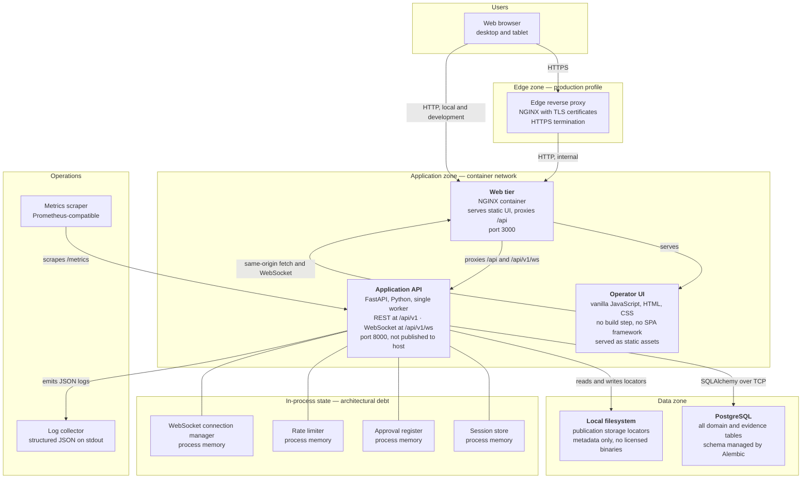
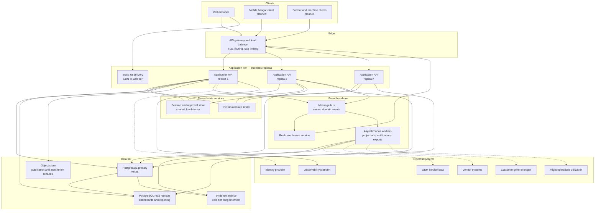
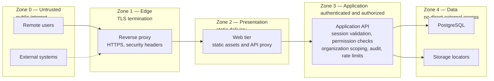

# System Context — Mercury Aviation Enterprise Operating System

| Field | Value |
|-------|-------|
| Document | System Context |
| Product | Mercury Aviation Enterprise Operating System (AEOS) |
| Organization | Mercury Technologies |
| Layer | System context and container (C4 levels 1 and 2) |
| Audience | Architects, integrators, security reviewers, operations engineers, partners |
| Status | Living baseline |
| Companion documents | [Enterprise Architecture](Enterprise_Architecture.md) · [Domain Architecture](Domain_Architecture.md) · [Technical Architecture](Technical_Architecture.md) |
| Upstream authority | [Blueprint README](../../README.md) |

---

## 1. Scope

### 1.1 In scope

This document defines Mercury's **system boundary**: who uses the platform, what sits outside it, what crosses the boundary in each direction, and how the system decomposes into deployable containers.

It provides:

- A **C4 level 1 system context diagram** naming every human actor and every external system.
- An **actor register** describing each persona's goals, the capabilities they touch, and the permissions that govern them.
- An **external system register** distinguishing what exists today from what is planned, with the integration pattern for each.
- A **C4 level 2 container diagram** of the current runtime, and a second showing the target topology.
- **Trust zones**, **data flows across the boundary**, and **deployment views** for local, container, and target operation.
- Non-functional requirements, security, and scalability considerations at the boundary.

### 1.2 Out of scope

| Concern | Authoritative location |
|---------|------------------------|
| Business capabilities, value streams, governance | [Enterprise Architecture](Enterprise_Architecture.md) |
| Bounded contexts, aggregates, ubiquitous language | [Domain Architecture](Domain_Architecture.md) |
| Component-level internals, layering, data flows within a container | [Technical Architecture](Technical_Architecture.md) |
| Entity and attribute detail | [Data Model](../04_Data/Data_Model.md) |
| Permission matrices, audit schema, signature mechanics | [Security documentation set](../06_Security/) |
| API contract conventions | [API Standards](../08_Standards/API_Standards.md) |

### 1.3 Honesty markers

| Marker | Meaning |
|--------|---------|
| **Current** | Present in the runtime and exercised today |
| **Partial** | Present for a subset of the described scope |
| **Planned** | Designed here, not built. No commitment implied |
| **Aspirational** | A directional target for sizing, not a service level agreement |

---

## 2. Design principles

| # | Principle | Statement | Implication at the boundary |
|---|-----------|-----------|-----------------------------|
| SP-1 | **One system boundary, one front door** | All clients reach Mercury through the versioned HTTP API at `/api/v1`. | The operator UI holds no privileged path. Any future mobile or partner client uses the same surface. |
| SP-2 | **Same-origin by default** | The browser talks to `/api/v1` and `/api/v1/ws` on its own origin through the web tier. | Cross-origin configuration is an explicit, restricted setting, not the norm. |
| SP-3 | **The backend is not publicly addressable** | In container deployments the application port is not published to the host; only the web tier is reachable. | Network topology is a control, not a convenience. |
| SP-4 | **Every actor is authenticated and scoped** | No anonymous access to tenant data. Every session carries an organization and a site. | Health and liveness probes are the only unauthenticated endpoints. |
| SP-5 | **External systems are integrated behind translation** | No external model enters the domain unmediated. | Each planned integration names its anti-corruption layer. |
| SP-6 | **Outbound data leaves only through declared contracts** | Exports, reports, and future partner projections are explicit, versioned, and audited. | There is no ad-hoc database access for third parties. |
| SP-7 | **Simulated is labelled simulated** | Where the platform returns demonstration or simulated data, it says so in the payload. | Integrators can distinguish real telemetry from reference data. |
| SP-8 | **The boundary is observable** | Health, readiness, liveness, and metrics endpoints exist for operators and orchestrators. | Operational visibility is part of the contract, not an add-on. |

---

## 3. C4 Level 1 — System context

```mermaid
flowchart TB
    subgraph PEOPLE["Human actors"]
        TECH["Technician<br/>performs and signs work"]
        INSP["Inspector<br/>inspects and signs"]
        ACA["ACA holder<br/>certifies and releases"]
        STORES["Stores keeper<br/>receives, reserves, issues"]
        PLAN["Planner and maintenance control<br/>forecasts and packages work"]
        CAMO["CAMO engineer<br/>programme, AD, SB, EO"]
        ENG["Engineering and reliability<br/>configuration and trends"]
        QA["Quality assurance<br/>audit and evidence"]
        PURCH["Purchasing<br/>requests, quotes, orders"]
        FIN["Finance<br/>cost and valuation"]
        SUP["Supervisor and manager<br/>capacity and throughput"]
        ADMIN["Platform administrator<br/>tenancy and operations"]
        LESSOR["Lessor representative<br/>asset condition — planned"]
        AUTH["Authority viewer<br/>oversight evidence — planned"]
    end

    MERCURY["<b>Mercury AEOS</b><br/>Multi-tenant aviation enterprise<br/>operating system<br/>fleet · configuration · publications<br/>personnel · maintenance · planning · logistics"]

    subgraph EXT["External systems"]
        IDP["Identity provider<br/>enterprise SSO — planned"]
        OBJ["Object store<br/>publication and attachment binaries — planned"]
        BUS["Message bus<br/>domain event transport — planned"]
        OEM["OEM portals<br/>type design, service data, applicability — planned"]
        REG["Authority data sources<br/>airworthiness directive feeds — planned"]
        VEND["Vendor and supplier systems<br/>quotes, orders, shipping — planned"]
        GL["Customer general ledger<br/>cost event export — planned"]
        OPS["Flight operations systems<br/>utilization in hours and cycles — planned"]
        OBS["Observability platform<br/>metrics and log collection — current"]
        MAIL["Notification service<br/>email and messaging — planned"]
    end

    TECH -->|"executes job cards, signs performed"| MERCURY
    INSP -->|"signs inspected and independent inspection"| MERCURY
    ACA -->|"certifies and releases to service"| MERCURY
    STORES -->|"receives, reserves, issues, returns"| MERCURY
    PLAN -->|"forecasts, generates work packages"| MERCURY
    CAMO -->|"manages programme and compliance"| MERCURY
    ENG -->|"reviews configuration and trends"| MERCURY
    QA -->|"reviews audit trail and evidence"| MERCURY
    PURCH -->|"raises requests, evaluates quotes"| MERCURY
    FIN -->|"reviews cost and valuation"| MERCURY
    SUP -->|"monitors capacity and throughput"| MERCURY
    ADMIN -->|"administers tenancy and platform"| MERCURY
    LESSOR -.->|"reads asset condition — planned"| MERCURY
    AUTH -.->|"reads oversight evidence — planned"| MERCURY

    MERCURY -.->|"authenticates users — planned"| IDP
    MERCURY -.->|"stores and retrieves binaries — planned"| OBJ
    MERCURY -.->|"publishes domain events — planned"| BUS
    MERCURY -.->|"ingests service data — planned"| OEM
    MERCURY -.->|"ingests directives — planned"| REG
    MERCURY -.->|"exchanges procurement documents — planned"| VEND
    MERCURY -.->|"exports cost events — planned"| GL
    MERCURY -.->|"ingests utilization — planned"| OPS
    MERCURY -->|"exposes metrics and logs — current"| OBS
    MERCURY -.->|"sends notifications — planned"| MAIL
```

**How to read this diagram.** Solid lines are relationships that exist in the runtime today. Dashed lines are planned. Only one external system — the observability platform, consuming the metrics and log output the platform already produces — is a current integration. Mercury today is deliberately self-contained: everything else it needs, it owns.

---

## 4. Actors

### 4.1 Actor register

| Actor | Goal | Primary value streams | Capabilities touched | Governing permissions |
|-------|------|----------------------|---------------------|----------------------|
| **Technician** | Perform assigned maintenance correctly and record it | VS-3 | Job card execution, publications, material draw, signature | `task.read`, `task.manage`, `work_order.execute`, `certification.sign`, `signature.create`, `publication.read`, `logistics.read` |
| **Inspector** | Verify work and sign the inspection step | VS-3 | Inspection, independent inspection, audit read | `inspector.approve`, `certification.sign`, `signature.create`, `audit.read`, `logbook.read` |
| **ACA holder** | Certify and release the aircraft to service | VS-4 | ACA certification, release, technical logbook | `certification.sign`, `certification.release`, `signature.create`, `logbook.read` |
| **Stores keeper** | Keep stock accurate and material available at the point of use | VS-5, VS-3 | Warehouse, stock, movement ledger, tools, material issue | `store.read`, `logistics.read`, `logistics.stores`, `logistics.tools` |
| **Planner / maintenance control** | Produce executable, resourced work packages on time | VS-2 | Forecast, checks, package generation, material and tool planning | `planner.read`, `planning.read`, `planning.manage`, `work_order.manage`, `fleet.read`, `maintenance.read` |
| **CAMO engineer** | Maintain continuing airworthiness and compliance | VS-1, VS-2 | Programme, MPD, AD, SB, EO, MEL, deferred defects | `planning.read`, `planning.manage`, `maintenance.read`, `publication.read`, `fleet.read` |
| **Engineering / reliability** | Understand configuration and behaviour over time | VS-1, VS-2 | Configuration, components, publications, trends | `engineering.read`, `configuration.read`, `component.read`, `fleet.read`, `qa.read` |
| **Quality assurance** | Demonstrate that the system is under control | All | Audit trail, logbook, certification evidence | `qa.read`, `audit.read`, `logbook.read`, `maintenance.read`, `certification.sign` |
| **Purchasing** | Secure the right parts at the right time and price | VS-5 | Purchase requests, RFQs, quotes, purchase orders, vendors | `logistics.read`, `logistics.purchase`, `publication.read`, `fleet.read` |
| **Finance** | Understand cost and asset value | All | Valuation, purchase commitment, warranty | `logistics.read`, `logistics.finance`, `logistics.purchase` |
| **Supervisor / manager** | Deliver throughput within capacity | VS-2, VS-3 | Work package oversight, logistics management, dashboards | `work_order.manage`, `logistics.manage`, `logistics.stores`, `planning.read`, `dashboard.read` |
| **Platform administrator** | Operate the platform and its tenancy safely | All | Organizations, memberships, admin operations, audit | Administrator role — full permission wildcard |
| **Lessor representative** — *Planned* | Verify asset condition and records completeness | VS-1, VS-4 | Aircraft passport, configuration, records | A future scoped cross-organization read grant |
| **Authority viewer** — *Planned* | Inspect evidence during oversight | VS-4 | Audit trail, logbook, certification evidence, publications in force | A future scoped, audited, read-only grant |

### 4.2 Personas and session roles

Mercury separates **what a user may call** from **what a user may certify**. Two mechanisms carry that separation:

**Session roles** — Administrator, Operator, Reviewer, Viewer — determine the permission set attached to a session. They gate endpoints.

**Aviation personas** — technician, stores, planner, inspector, ACA, engineering, reliability, quality assurance, purchasing, finance, supervisor, manager, administrator — describe the recommended permission profile for each real-world job. In the current runtime these personas are a **documented mapping** that informs role design and product configuration; they are not yet enforced principals in their own right. Making personas first-class is a named roadmap item.

**Certification authority** is neither of the above. Whether a given person may sign a given step is determined by their employee record, its active status, their qualifications, and their ACA authorization — checked at signing time, independently of the session role. See [Domain Architecture §5.5](Domain_Architecture.md#55-d5--personnel-and-certification) and the [Security documentation set](../06_Security/).

### 4.3 Actor to trust zone

| Actor group | Network position | Authentication | Notes |
|-------------|-----------------|----------------|-------|
| Hangar-floor users — technician, inspector, ACA, stores | Internal network or VPN | Session cookie, plus credential re-verification at each signing act | Signing always requires a fresh credential presentation |
| Office users — planner, CAMO, engineering, QA, purchasing, finance, supervisor | Internal network or VPN | Session cookie | |
| Platform administrator | Restricted administrative access | Session cookie with administrator role | All administrative writes are audited |
| Lessor and authority viewers — *Planned* | Public internet through the web tier | To be defined; scoped, time-bounded, read-only | Every access audited; no write path ever |
| Machine clients — *Planned* | Partner network or internet | To be defined | Same permission model as human callers |

---

## 5. Container diagram

### 5.1 C4 Level 2 — Current runtime

### 5.2 Container register — current

| Container | Technology | Responsibility | Scaling | State |
|-----------|-----------|----------------|---------|-------|
| **Edge reverse proxy** | NGINX with automated certificate management | HTTPS termination, security headers, certificate renewal. Production deployment profile only. | Stateless | None |
| **Web tier** | NGINX | Serves the static operator UI and reverse-proxies `/api` and the WebSocket path to the application, presenting one origin to the browser | Stateless | None |
| **Operator UI** | Vanilla JavaScript, HTML, CSS | All operator screens: fleet, components, publications, personnel, maintenance, work orders, planning, logistics, dashboards. No framework, no build step. | Served statically | Browser session only |
| **Application API** | FastAPI on Python, single worker | Every domain module: routers, services, repositories, models. Authentication, authorization, audit, rate limiting, WebSocket broadcast. | **Currently single instance** — see §5.3 | In-process session, approval, rate-limit, and WebSocket state |
| **PostgreSQL** | PostgreSQL | All domain and evidence tables. Schema evolved by forward-only Alembic migrations. | Vertical today | Durable |
| **Local filesystem** | Container volume | Publication storage locators and metadata. Mercury does not hold licensed manufacturer binaries. | Node-local | Durable within the volume |
| **Metrics scraper** | Prometheus-compatible | Scrapes the `/metrics` endpoint | External | External |
| **Log collector** | Any JSON log pipeline | Consumes structured logs from standard output | External | External |

### 5.3 The single-instance constraint

The application container **cannot currently be scaled horizontally**. Four pieces of state live in process memory:

| State | Effect of a second replica |
|-------|---------------------------|
| Session store | A user authenticated on replica A is unauthenticated on replica B |
| Approval register | An approval granted on one replica is invisible to another |
| Rate limiter counters | Effective limits multiply by the replica count |
| WebSocket connection manager | A broadcast reaches only the clients connected to the broadcasting replica |

This is stated plainly because it is the single most consequential fact about Mercury's current topology. Externalizing this state is horizon H2 in the [Enterprise Architecture roadmap](Enterprise_Architecture.md#15-architecture-roadmap-horizons) and is the prerequisite for any availability commitment.

### 5.4 Local development topology

| Aspect | Local mode | Container mode |
|--------|-----------|----------------|
| Database | SQLite file | PostgreSQL container |
| Schema | Created on start, with additive column reconciliation for long-lived development files | Alembic migrations applied before or alongside start |
| Frontend | Python's built-in static HTTP server on port 3000 | NGINX container on port 3000 |
| Origin | Dual-process; a generated local configuration points the UI at the API port | Same-origin through the web tier |
| Application port | Published on the host | **Not** published in the production profile |
| Seed data | Idempotent demonstration seeds for organizations, fleet, components, publications, personnel, maintenance, work orders, planning, and logistics | Same, controlled by configuration |

Same-origin operation is the production shape. The dual-process local mode exists for developer convenience and is the reason a cross-origin allowance exists at all.

### 5.5 C4 Level 2 — Target topology

The target topology **preserves the architecture rather than replacing it**: the same FastAPI application, the same vanilla-JS UI, the same domain modules, the same API contract. What changes is where state lives and how events travel. No SPA framework appears in the target. No service split is assumed — the replicas run the same modular monolith, which remains a legitimate long-term shape.

### 5.6 Current to target delta

| Element | Current | Target | Horizon |
|---------|---------|--------|---------|
| Session and approval state | Process memory | Shared store | H2 |
| Rate limiting | Per process | Distributed | H2 |
| Application instances | One | Many, stateless | H2 |
| Publication binaries | Locators only | Object store with signed, time-limited URLs | H2 |
| Real-time delivery | In-process broadcast | Broker-backed fan-out | H3 |
| Domain events | In-process composition | Message bus with named events | H3 |
| Read load | Primary only | Read replicas plus purpose-built read models | H3 |
| Identity | Local operator directory | Federated identity provider | H3 |
| External integration | None | Workers calling OEM, vendor, ledger, and operations systems | H4 |
| Evidence archival | Retention window on queries | Cold-tier archive | H2 to H4 |

---

## 6. External systems

### 6.1 External system register

| System | Direction | Status | Integration pattern | What crosses | Anti-corruption layer |
|--------|-----------|--------|--------------------|--------------|----------------------|
| **Identity provider** | Inbound authentication | **Planned** | OpenID Connect or SAML federation | Authenticated identity, group claims | Identity translation into Mercury users and memberships. Group claims may inform roles but **never** confer certification authority. |
| **Object store** | Bidirectional | **Planned** | Signed, time-limited URLs; the application never proxies bulk content | Publication revisions, job card attachments, shipment documents | The existing storage-locator abstraction already keeps storage technology out of the domain. |
| **Message bus** | Outbound, then bidirectional | **Planned** | Publish and subscribe with at-least-once delivery and a transactional outbox | Named domain events from the [Domain Architecture](Domain_Architecture.md) | Event schema versioning; consumers never see internal models. |
| **OEM portals** | Inbound | **Planned** | Scheduled pull or partner API | Type design data, service bulletins, applicability, illustrated parts catalogue references | Applicability translation into Mercury AD, SB, and EO records. |
| **Authority data sources** | Inbound | **Planned** | Scheduled pull of published directive feeds | Airworthiness directives and effectivity | Directive normalization into the planning model. Applicability determination remains the customer organization's responsibility, never the feed's. |
| **Vendor and supplier systems** | Bidirectional | **Planned** | Partner API or document exchange | RFQs, quotes, purchase orders, shipping notices, receipts | Procurement document translation; vendor identifiers never become Mercury part identifiers. |
| **Customer general ledger** | Outbound | **Planned** | Batch or event-driven export | Cost events: material issue, labour, purchase commitment | Cost event export contract. Mercury records events; the ledger performs accounting. |
| **Flight operations systems** | Inbound | **Planned** | API or file ingestion | Utilization in hours, cycles, and landings per aircraft | Utilization normalization into the planning utilization model. |
| **Observability platform** | Outbound | **Current** | Metrics scraping plus structured log collection | Request rate, latency histograms, login outcomes, rate-limit blocks, active session count, JSON logs with request and correlation identifiers | None required; the platform emits open formats. |
| **Notification service** | Outbound | **Planned** | Service API | Shortage alerts, due-list warnings, approval requests, calibration expiry | Notification templating outside the domain. |

### 6.2 Why so much is planned

Mercury's current release is deliberately **self-contained**. Every domain capability it claims, it implements itself against its own database. That is a defensible position for a platform whose core value is a coherent digital thread: integrations that arrive before the internal model is settled tend to cement the wrong shape.

The consequence, stated plainly: Mercury today does not automatically ingest manufacturer service data, does not receive utilization from flight operations, and does not exchange procurement documents electronically. Those workflows are performed by users against Mercury's own records. The integrations in §6.1 are the roadmap for removing that manual step, in the order that horizons H3 and H4 imply.

### 6.3 Integration principles

1. **Ingestion is never trusted as fact.** External data enters as a proposal that a qualified person reviews, except where the source is definitionally authoritative and the record is clearly attributed to it.
2. **Applicability is Mercury's determination.** A manufacturer bulletin says what it applies to in the manufacturer's terms; whether it applies to *this* aircraft in *this* configuration is resolved against Mercury's configuration data and recorded as a Mercury decision.
3. **Outbound contracts are versioned.** A partner consuming Mercury events or exports gets a stable, documented schema with a deprecation window.
4. **Every crossing is audited.** Inbound ingestion and outbound export both produce audit records naming the system, the volume, and the outcome.
5. **No integration bypasses tenancy.** An external system connects on behalf of an organization and sees only that organization's data.

---

## 7. Trust zones and boundary controls

| Boundary | Controls |
|----------|----------|
| Zone 0 to Zone 1 | TLS 1.2 or higher, certificate management, security response headers |
| Zone 1 to Zone 2 | Internal network only; the web tier is not a decision point for authorization |
| Zone 2 to Zone 3 | Same-origin proxying; cross-origin allowances restricted to configured origins with credentials |
| Zone 3 — within | Session validation on every request, permission checks per endpoint, organization and site scoping in every service, rate limiting on authentication and general API traffic, audit of authenticated mutating calls |
| Zone 3 to Zone 4 | The database is reachable only from the application network; the application port itself is not published to the host in production |
| Zone 4 | Durable storage; backup and restore are the deploying operator's responsibility today |

---

## 8. Data crossing the boundary

### 8.1 Inbound

| Data | Source | Channel | Validation |
|------|--------|---------|------------|
| Authentication credentials | Users | `POST /api/v1/auth/login` | Rate-limited; failures audited as both a login failure and a security event |
| Session context switch | Users | `POST /api/v1/auth/context` | Membership verified; denied attempts audited as security events |
| Domain writes — fleet, components, publications, personnel, maintenance, work orders, planning, logistics | Users | `/api/v1/*` | Schema validation, permission check, organization assertion, domain invariants |
| Certification signatures | Technicians, inspectors, ACA holders | `/api/v1/maintenance`, `/api/v1/work-orders` | Employee validity, signer binding, credential verification, step order, distinct-signer rules |
| WebSocket connection | Users | `/api/v1/ws` | Session cookie validated before the connection is accepted; unauthenticated connections are closed |
| Publication content locators | Users | `/api/v1/publications` | Locator recorded; Mercury does not ingest licensed binaries |
| External system data | External systems | — | **Planned**; will follow the integration principles in §6.3 |

### 8.2 Outbound

| Data | Destination | Channel | Controls |
|------|-------------|---------|----------|
| Domain reads | Users | `/api/v1/*` | Organization and site scoped; permission gated |
| Real-time notifications | Users | `/api/v1/ws` | Authenticated connections only; carries operator, role, organization, and site context |
| Reports and summaries | Users | `/api/v1/reports/*` | Organization and site scoped |
| Audit query results | Quality, inspectors, administrators | `/api/v1/audit` | Requires the audit read permission; scoped and retention-bounded |
| Metrics | Operations | `/metrics` | Can be disabled by configuration; contains no tenant data |
| Health, readiness, liveness | Orchestrators | `/health`, `/ready`, `/live` | Unauthenticated by design; no tenant data |
| Structured logs | Operations | Standard output | Carry request, correlation, and user identifiers; must not carry credentials or personal data beyond the username |
| Evidence and passport exports | Lessors, authorities, buyers | — | **Planned**; will be explicit, versioned, and audited |

### 8.3 Explicitly not crossing the boundary

- **Licensed manufacturer content.** Mercury references it by locator; it does not redistribute it.
- **Raw database access.** No third party receives direct database connectivity. Integration is through the API or, in future, the event bus.
- **Cross-tenant data.** No endpoint returns another organization's records. Planned lessor and authority views will be explicit, scoped grants, audited on every access — not a relaxation of isolation.
- **Credentials.** Passwords and signing credentials are never logged, never returned in a response, and never included in an audit detail field.

---

## 9. Non-functional requirements

### 9.1 Reading the targets

**Current baseline** describes what the runtime demonstrably does in its documented topology. **Aspirational enterprise target** is a directional target for sizing and roadmap planning, not a service-level agreement, and must not be quoted contractually without a matching operational commitment.

### 9.2 Availability

| Concern | Current baseline | Aspirational enterprise target |
|---------|------------------|-------------------------------|
| Boundary availability | Bounded by a single application instance, the web tier, and the database. No published figure. | 99.9 percent monthly for the API boundary; 99.95 percent for the read path |
| Edge availability | Single reverse proxy in the production profile | Redundant edge with health-checked upstreams |
| Deployment interruption | A restart interrupts service and drops in-memory sessions, forcing re-authentication | Zero-downtime rolling deployment with session survival |
| Health signalling | `/health`, `/ready`, and `/live` implemented and suitable for orchestrator probes | Unchanged; used for automated replacement |
| WebSocket continuity | Connections drop on restart; the client reconnects | Broker-backed fan-out so reconnection lands on any replica |
| Dependency failure | Database unavailability makes the API unhealthy | Read-only degraded mode from replicas |

### 9.3 Performance

| Concern | Current baseline | Aspirational enterprise target |
|---------|------------------|-------------------------------|
| Request latency visibility | Measured per request, returned in the `x-response-time-ms` header, and recorded in Prometheus histograms | Unchanged |
| Read latency at the boundary | Measured, not committed | 95th percentile under 300 ms |
| Write latency at the boundary | Measured, not committed | 95th percentile under 800 ms |
| Real-time delivery | In-process broadcast with a five-second heartbeat | Under 2 seconds from state change to client, at any replica count |
| Static asset delivery | Served by the web tier | CDN-delivered, cache-controlled |
| Concurrent sessions | Bounded by the single worker | 500 concurrent authenticated sessions per tenant |
| Rate limits | Separate per-minute budgets for authentication and general API traffic, enforced per process | Distributed enforcement with per-tenant budgets |

### 9.4 Durability and recoverability

| Concern | Current baseline | Aspirational enterprise target |
|---------|------------------|-------------------------------|
| Database durability | Delegated to PostgreSQL and the deploying operator's backup regime | Managed service with point-in-time recovery |
| Recovery point objective | Set by the operator's backup schedule; not enforced by the platform | **RPO 15 minutes** for transactional data; **RPO 0** for released airworthiness evidence |
| Recovery time objective | Set by the operator's restore procedure | **RTO 4 hours** for full service; **RTO 1 hour** for read-only evidence access |
| Session durability | Sessions are lost on restart; users re-authenticate | Sessions survive rolling deployment |
| Publication binaries | Not held by the platform; durability belongs to the locator's owner | Object store with eleven nines of annual durability for Mercury-held content |
| Evidence archive | Not present | Immutable cold tier retaining evidence for the life of the asset plus the authority-required period |
| Backup verification | Operator responsibility | Automated monthly restore rehearsal with a published result |

RPO and RTO figures above are **aspirational enterprise targets**. They set the bar for the persistence and archival design and are consistent with the figures in [Enterprise Architecture §11.4](Enterprise_Architecture.md#114-durability-and-recoverability) and [Domain Architecture §8.4](Domain_Architecture.md#84-durability-and-recoverability). They are not currently guaranteed.

### 9.5 Observability at the boundary

| Requirement | Status |
|-------------|--------|
| Every response carries request and correlation identifiers | **Current** |
| Request identifiers propagate from a caller-supplied header when present | **Current** |
| Structured JSON logs with request, correlation, and user context | **Current** |
| Prometheus metrics: request rate, latency, login outcomes, rate-limit blocks, active sessions | **Current** |
| Health, readiness, and liveness endpoints | **Current** |
| Distributed tracing across containers | **Planned** |
| Per-tenant service-level objective reporting | **Aspirational** |
| Synthetic monitoring of the critical release path | **Aspirational** |

### 9.6 Compatibility

| Requirement | Position |
|-------------|----------|
| Browser support | Current versions of major evergreen desktop browsers; no build step or transpilation required |
| Tablet support | **Partial** — responsive layout; no offline capability |
| API versioning | All endpoints under `/api/v1`; breaking changes require a new version and an ADR |
| Database | PostgreSQL for container and production deployments; SQLite for local development only |
| Container runtime | Standard OCI containers orchestrated by Compose today, orchestrator-agnostic by design |

---

## 10. Security considerations

**The boundary is small on purpose.** Mercury exposes one HTTP surface and one WebSocket path. There is no second admin port, no direct database exposure, and in the production container profile the application port is not published to the host at all. A small boundary is the cheapest security control available, and it is preserved deliberately.

**Authentication and session handling.** Login is rate-limited and every failure produces both a login-failure audit record and a security-event audit record. Sessions are cookie-based with the HTTP-only flag always set, the secure flag required in production, and a configured same-site policy. Sessions carry an expiry and are cleaned up on validation. Because sessions live in process memory, a restart forces re-authentication — inconvenient, but it also means no session outlives the process.

**Authorization is enforced behind the boundary, never at it.** The web tier proxies; it does not authorize. Every permission decision happens in the application, on every request, from the session's role. A misconfigured proxy cannot grant access it has no ability to grant.

**Tenant isolation at the boundary.** A session is bound to one organization and one site at a time. Switching context requires an active membership in the target organization, is re-derived rather than trusted from the client, and is audited — including denied attempts, which are recorded as security events. Platform administrators can cross organizations; that capability is itself audited on every use.

**Signing at the boundary.** A certification request must present both a valid session and a signing credential appropriate to the declared method. The session proves who is calling; the credential proves who is signing; the employee record proves they are permitted to sign that step. Three independent checks, none of which substitutes for another.

**Rate limiting and abuse.** Separate budgets apply to authentication and to general API traffic, keyed by client address with forwarded-header awareness. Blocks are counted as metrics. The limiter is per-process, so its effectiveness is a function of the current single-instance topology — another reason distributed limiting accompanies horizontal scaling in horizon H2.

**Transport and headers.** TLS 1.2 or higher at the edge, with security response headers applied. Cross-origin access is restricted to configured origins and exists primarily to support the dual-process local development mode.

**Unauthenticated surface.** Only the health, readiness, and liveness endpoints, plus the metrics endpoint where enabled. None returns tenant data. The metrics endpoint can be disabled by configuration where the deployment does not want it reachable.

**Planned external systems bring new risk.** Every integration in §6.1 widens the boundary. Each will require its own threat assessment before implementation, with particular attention to identity federation — where the failure mode is an external directory silently conferring authority that only Mercury should confer — and to lessor and authority read access, where the failure mode is a scoped grant becoming a general one.

**Known boundary debt**, tracked openly: in-memory sessions and approvals, per-process rate limiting, no external identity federation, no cryptographic signature chain, no tamper-evident audit chaining, and no distributed tracing.

Full detail: [Security documentation set](../06_Security/), [Identity](../06_Security/Identity.md), [RBAC](../06_Security/RBAC.md), [Audit](../06_Security/Audit.md), [Digital Signatures](../06_Security/Digital_Signatures.md), [SECURITY.md](../../SECURITY.md).

---

## 11. Scalability considerations

### 11.1 Scaling the boundary

| Element | Constraint | Path |
|---------|-----------|------|
| Edge proxy | Single instance in the production profile | Redundant edge behind a load balancer |
| Web tier | Stateless; already scalable | Multiple replicas or CDN delivery of static assets |
| Application API | **Single instance** — blocked by in-memory state | Externalize session, approval, and rate-limit state, then run stateless replicas |
| WebSocket fan-out | In-process; a broadcast reaches only locally connected clients | Broker-backed fan-out |
| Database | Single primary | Read replicas for dashboards and reporting; partition the largest ledgers |
| Publication content | Filesystem locators | Object store with signed URLs; the application never proxies bulk transfer |
| Rate limiting | Per process | Distributed counters with per-tenant budgets |

### 11.2 Scaling for tenants

| Tenant profile | Approach |
|----------------|----------|
| Small operators and MROs | Shared application replicas, shared database, row-level organization scoping |
| Large operators | Shared application, dedicated database or partitioned schema, dedicated read replica |
| Data-residency-constrained tenants | Regional deployment with tenant-to-region pinning |
| Tenants requiring physical separation | Dedicated deployment of the whole stack; the architecture supports this without code change |

### 11.3 Client-side scaling

The operator UI is deliberately framework-free. This constrains client-side complexity in a useful way: the boundary between UI and API stays coarse and explicit, screens fetch what they need from `/api/v1` and render it, and there is no client-side state layer that can silently diverge from the server. As screen count grows, the scaling levers are pagination and server-side filtering on list endpoints, purpose-built dashboard endpoints that aggregate server-side rather than fanning out many client requests, and cacheable static asset delivery. **Introducing an SPA framework is not one of the levers** — that constraint is architectural and is stated in the [Blueprint README](../../README.md).

### 11.4 What must survive scaling at the boundary

- One authenticated identity per request, resolved consistently regardless of which replica serves it.
- One organization scope per session, enforced identically on every replica.
- Complete audit, with no gap introduced by asynchronous handling.
- Real-time notifications reaching the right clients regardless of connection placement.
- Rate limits that mean what they say, independent of replica count.

---

## 12. Future enhancements

| # | Enhancement | Boundary effect | Depends on | Horizon |
|---|-------------|-----------------|------------|---------|
| 1 | Shared session and approval store | Unblocks horizontal scaling of the application container | Shared low-latency store | H2 |
| 2 | Distributed rate limiting | Accurate limits across replicas | Item 1 | H2 |
| 3 | Managed object store for publication and attachment binaries | New external system; signed, time-limited URLs | Storage locator abstraction already in place | H2 |
| 4 | Evidence archive tier | Long-retention immutable storage for signatures, logbook, and audit | Item 3 | H2 |
| 5 | Message bus with named domain events | New external system; enables asynchronous work and real-time fan-out | Event vocabulary already defined in the [Domain Architecture](Domain_Architecture.md) | H3 |
| 6 | Broker-backed WebSocket fan-out | Real-time notifications survive multi-replica deployment | Items 1 and 5 | H3 |
| 7 | Identity provider federation | New inbound trust relationship; enterprise single sign-on | Identity translation layer | H3 |
| 8 | Read replicas and purpose-built read models | Dashboards and the aircraft passport served without touching the primary | Database topology change | H3 |
| 9 | Mobile hangar client | New client on the same API surface; offline capability | Conflict-resolution design | H3 |
| 10 | Flight operations utilization ingestion | New inbound integration; removes manual utilization entry | Utilization normalization layer | H4 |
| 11 | OEM service data integration | New inbound integration; automated applicability proposals | Applicability translation layer | H4 |
| 12 | Vendor and supplier document exchange | New bidirectional integration across the procurement cycle | Procurement document translation | H4 |
| 13 | General ledger cost event export | New outbound integration with a versioned contract | Labour and material cost model | H4 |
| 14 | Lessor and authority read-only projections | New actor classes crossing the boundary under scoped, audited grants | Cross-organization sharing construct | H4 |
| 15 | Notification service integration | Outbound alerts for shortages, due items, approvals, and calibration expiry | Item 5 | H3 |
| 16 | Distributed tracing | Correlated spans across edge, application, and data tiers | Tracing infrastructure | H3 |
| 17 | Multi-region deployment | Tenant-to-region pinning for data residency; active-passive failover | Items 1, 5, and 8 | H4 |

---

## 13. Related documents

**Within this architecture set**
[Enterprise Architecture](Enterprise_Architecture.md) · [Domain Architecture](Domain_Architecture.md) · [Technical Architecture](Technical_Architecture.md)

**Data and digital thread**
[Digital Thread](../04_Data/Digital_Thread.md) · [Data Model](../04_Data/Data_Model.md) · [Master Data](../04_Data/Master_Data.md) · [Knowledge Graph](../04_Data/Knowledge_Graph.md)

**Security**
[Security documentation set](../06_Security/) · [Identity](../06_Security/Identity.md) · [RBAC](../06_Security/RBAC.md) · [Audit](../06_Security/Audit.md) · [Digital Signatures](../06_Security/Digital_Signatures.md) · [SECURITY.md](../../SECURITY.md)

**Standards and governance**
[Standards documentation set](../08_Standards/) · [API Standards](../08_Standards/API_Standards.md) · [UI Standards](../08_Standards/UI_Standards.md) · [Coding Standards](../08_Standards/Coding_Standards.md) · [ADR register](../08_Standards/ADR/)

**Business, product, AI, regulation**
[Business documentation set](../03_Business/) · [Product documentation set](../05_Product/) · [AI documentation set](../07_AI/) · [Regulations documentation set](../09_Regulations/)

**Repository root**
[README](../../README.md) · [VISION](../../VISION.md) · [ROADMAP](../../ROADMAP.md)

---

*Mercury Technologies — One Digital Thread. One Digital Aircraft Passport. One Aviation Enterprise Operating System.*
