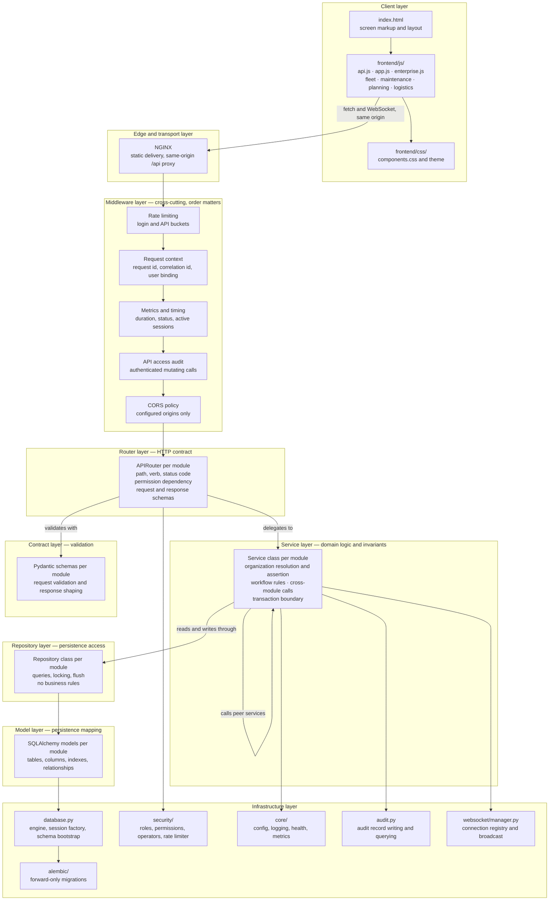
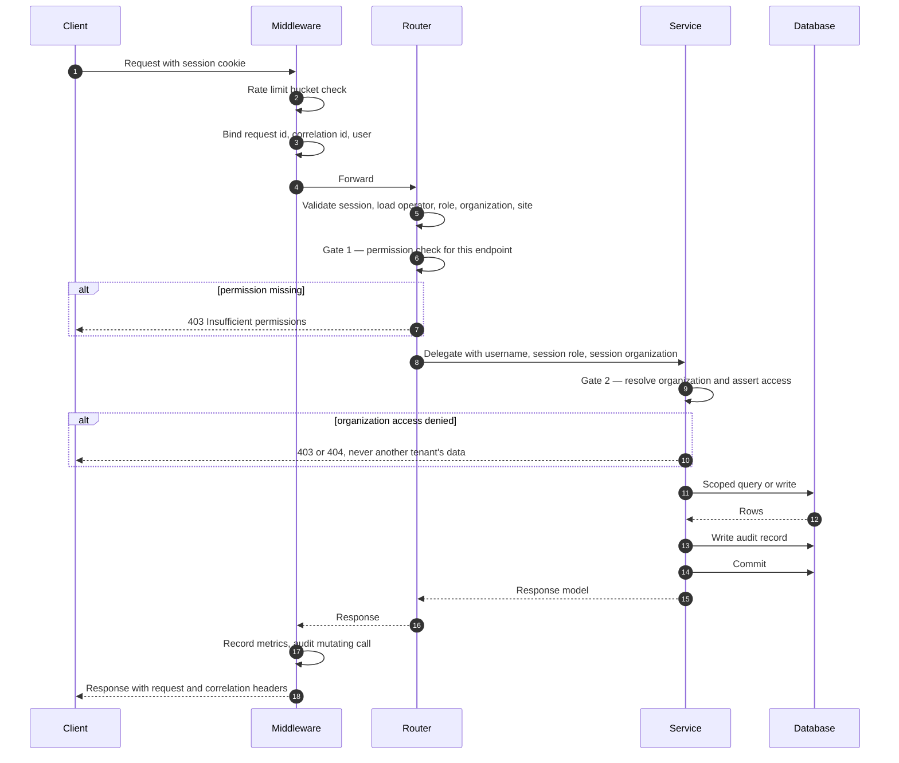
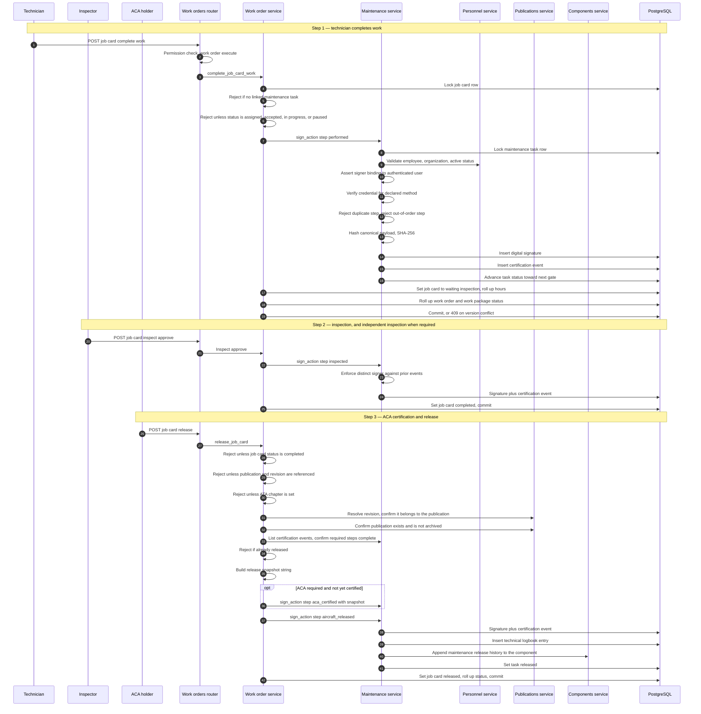
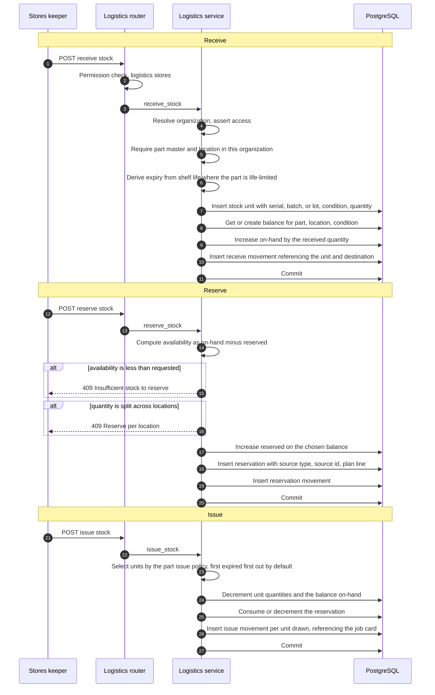
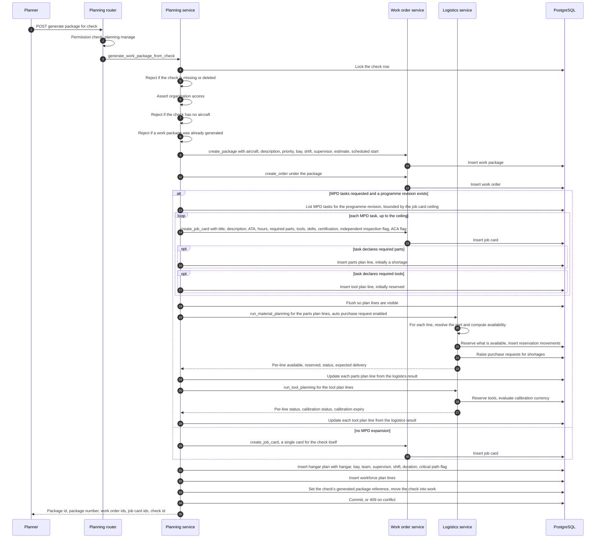

# Technical Architecture — Mercury Aviation Enterprise Operating System

| Field | Value |
|-------|-------|
| Document | Technical Architecture |
| Product | Mercury Aviation Enterprise Operating System (AEOS) |
| Organization | Mercury Technologies |
| Layer | Technical (layers, module pattern, data flows, persistence, runtime mechanics) |
| Audience | Developers, technical leads, reviewers, integrators, operations engineers |
| Status | Living baseline |
| Companion documents | [Enterprise Architecture](Enterprise_Architecture.md) · [Domain Architecture](Domain_Architecture.md) · [System Context](System_Context.md) |
| Upstream authority | [Blueprint README](../../README.md) |

---

## 1. Scope

### 1.1 In scope

This document describes **how Mercury is built**: the layering that every module obeys, the module package pattern, how tenancy and authorization are enforced in code, how transactions and concurrency work, how the frontend is organized, how the schema evolves, and — in detail — three data flows that define the platform's character:

- **Job card certify to technical logbook** — the safety-critical evidence chain.
- **Logistics stock movement ledger** — the append-only inventory truth.
- **Planning to work package generation to material reservation** — the cross-domain orchestration.

It is also explicit about **what Mercury is not yet**: a modular monolith is not a set of services, in-process state is not shared state, and inline orchestration is not an event-driven system. Section 12 states that honestly.

### 1.2 Out of scope

| Concern | Authoritative location |
|---------|------------------------|
| Capabilities, value streams, governance | [Enterprise Architecture](Enterprise_Architecture.md) |
| Bounded contexts, aggregates, ubiquitous language | [Domain Architecture](Domain_Architecture.md) |
| Actors, external systems, container topology | [System Context](System_Context.md) |
| Column-level schema and identifier formats | [Data Model](../04_Data/Data_Model.md) |
| Digital thread edge catalogue | [Digital Thread](../04_Data/Digital_Thread.md) |
| Permission matrices and audit schema detail | [Security documentation set](../06_Security/) |
| Naming, formatting, review conventions | [Coding Standards](../08_Standards/Coding_Standards.md), [API Standards](../08_Standards/API_Standards.md), [UI Standards](../08_Standards/UI_Standards.md) |
| Installation and deployment procedure | Runtime platform operational documentation |

### 1.3 Honesty markers

| Marker | Meaning |
|--------|---------|
| **Current** | In the runtime, exercised by tests |
| **Partial** | Present for a subset of the described scope |
| **Planned** | Designed here, not built |
| **Debt** | A known deviation from the target architecture, tracked deliberately |

---

## 2. Layered architecture

### 2.1 The layers



### 2.2 Layer responsibilities and prohibitions

| Layer | Owns | Must never |
|-------|------|-----------|
| **Client** | Rendering, user interaction, calling `/api/v1` | Enforce authorization, hold authoritative state, assume a permission it was not granted |
| **Edge** | TLS, static delivery, same-origin proxying | Make an authorization decision |
| **Middleware** | Rate limiting, request context, metrics, API-access audit, CORS | Contain domain logic |
| **Router** | HTTP verbs and paths, status codes, permission dependencies, request and response schemas | Contain business rules, query the database directly, or construct models |
| **Service** | Domain invariants, organization resolution and assertion, cross-module calls, the transaction boundary | Deal in HTTP concepts beyond raising typed errors; reach into another module's tables |
| **Repository** | Queries, filters, locking, flush, refresh | Contain business rules or make authorization decisions |
| **Model** | Table, column, index, and relationship definitions | Contain business logic |
| **Schema** | Request validation and response shaping | Contain business logic or query the database |
| **Infrastructure** | Configuration, logging, health, metrics, sessions, audit, WebSocket, migrations | Contain domain logic |

### 2.3 The one rule that keeps this honest

**A router never touches the database, and a repository never makes a decision.** Everything interesting happens in the service layer, which is therefore the only layer where domain invariants can be enforced — and the only layer that needs to be read carefully during a safety review. When a rule appears in a router, it has escaped its layer and should be moved.

---

## 3. Module package pattern

### 3.1 The canonical shape

Every domain module is a Python package under `backend/app/` with the same six files. Uniformity is the point: a developer who knows one module knows all of them.

```text
backend/app/<domain>/
├── __init__.py      Lazy export of the service class; avoids import cycles
├── models.py        SQLAlchemy models — tables, columns, indexes, relationships
├── schemas.py       Pydantic request and response contracts
├── repository.py    Query and persistence access; no business rules
├── service.py       Domain logic, invariants, tenancy assertion, transactions
└── router.py        APIRouter with prefix, tags, permission dependencies
```

The modules following this pattern are `org`, `fleet`, `components`, `publications`, `personnel`, `maintenance`, `work_orders`, `planning`, and `logistics`.

### 3.2 File-by-file contract

| File | Contract |
|------|----------|
| `__init__.py` | Declares `__all__` and lazily resolves the service class through a module-level `__getattr__`. Deferring the import breaks cycles between modules that call each other's services, which is common — planning calls work orders and logistics; work orders calls maintenance, publications, and personnel. |
| `models.py` | One SQLAlchemy model per table. Every tenant-owned table carries an organization column, indexed, and usually a composite index pairing organization with the most common filter. Mutable aggregates carry a version counter for optimistic concurrency, plus created and updated timestamps. |
| `schemas.py` | Separate create, update, and output models. Output models never expose internal columns that carry no contract meaning. Validation lives here so that malformed input never reaches the service layer. |
| `repository.py` | Query construction, filtering, ordering, pagination, `for_update` locking where a state transition needs it, and flush and refresh helpers. Methods are named for what they fetch, not for why. |
| `service.py` | The heart of the module. Resolves the effective organization, asserts access, enforces invariants, calls peer services for cross-domain work, writes audit records, and owns the commit. |
| `router.py` | Declares an `APIRouter` with a versioned prefix and a tag, attaches permission dependencies, maps request and response schemas, and delegates immediately to the service. Routers are thin by construction. |

### 3.3 Router conventions

Every module mounts under a versioned prefix and declares its required permissions at the endpoint. Current prefixes:

| Module | Prefix | Tag |
|--------|--------|-----|
| `org` | `/api/v1` | organizations |
| `fleet` | `/api/v1/fleet` | fleet |
| `components` | `/api/v1/components` | components |
| `publications` | `/api/v1/publications` and `/api/v1/library` | publications, technical-library |
| `personnel` | `/api/v1/personnel` | personnel |
| `maintenance` | `/api/v1/maintenance` | maintenance |
| `work_orders` | `/api/v1/work-orders` | work-orders |
| `planning` | `/api/v1/planning` | planning |
| `logistics` | `/api/v1/logistics` | logistics |

Routers are registered on the application at startup. Registration order does not affect routing, because prefixes do not overlap.

### 3.4 Service conventions

Every tenant-aware service exposes two members that are the backbone of multi-tenancy:

| Member | Purpose |
|--------|---------|
| `resolve_org_id(...)` | Determines the organization the call operates in: the requested organization when the caller is entitled to it, otherwise the session's organization. Never trusts a client-supplied organization without verification. |
| `assert_org_access(...)` | Raises a forbidden error unless the caller holds access to the given organization. Called before any read or write against tenant data. |

Cross-module work is done by **instantiating the peer service with the same database session** and calling its public methods. This keeps the peer module's invariants in force and keeps the whole operation in one transaction. It is also the seam along which a future extraction would cut: today's method call becomes tomorrow's API call.

### 3.5 Adding a module — the checklist

1. Create the package with all six files. Do not skip the repository "because the queries are simple"; simple queries grow.
2. Add the organization column, its index, and the composite indexes the access pattern needs.
3. Register the models in the schema bootstrap import list so table creation sees them.
4. Write a forward-only Alembic migration. Additive changes only.
5. Implement `resolve_org_id` and `assert_org_access` before implementing any business method.
6. Define permissions for the new capability and add them to the role and persona maps.
7. Mount the router under `/api/v1/<domain>` and register it on the application.
8. Add an idempotent seed function if the module needs demonstration data, and call it during startup.
9. Write tests covering the happy path, the tenancy boundary, the permission boundary, and every invariant.
10. Update the [Domain Architecture](Domain_Architecture.md) with the new context or aggregate, and raise an ADR if a boundary moved.

---

## 4. Tenancy and authorization enforcement

### 4.1 The two independent gates



**Gate 1 — endpoint permission** answers "may this role call this endpoint at all." It is declared on the router as a dependency and is coarse.

**Gate 2 — organization access** answers "may this user act on this organization's data." It is enforced in the service and is the control that keeps tenants apart.

Both gates always run. Neither substitutes for the other. A permission grant is not organization access, and organization membership is not a permission.

### 4.2 Roles and permissions

Four session roles carry permission sets:

| Role | Character |
|------|-----------|
| **Administrator** | Wildcard permission; the only role that can cross organizations, and every such crossing is audited |
| **Operator** | The working role: create and manage across fleet, components, publications, personnel, maintenance, work orders, planning, and logistics; may sign certification steps |
| **Reviewer** | Oversight: read broadly, approve, sign certification and release steps, read the audit trail |
| **Viewer** | Read-only across the domains, no write and no signing |

Thirteen aviation personas — technician, stores, planner, inspector, ACA, engineering, reliability, quality assurance, purchasing, finance, supervisor, manager, administrator — are defined as recommended permission profiles. In the current runtime they are a **documented mapping** used to design roles and configure deployments; they are not yet enforced principals. Full matrices are in the [Security documentation set](../06_Security/).

### 4.3 Session context

A session carries the operator, the effective role, the active organization, the active site, and an expiry. The effective role is derived from the user's **membership in the active organization**, not from the login directory alone — so the same person can be an operator in one organization and a viewer in another.

Switching context re-verifies membership, re-derives the role, validates that the target organization has a usable site, and writes an audit record. A denied switch writes a security-event audit record. **Debt:** sessions and approvals live in process memory, which is the constraint described in [System Context §5.3](System_Context.md#53-the-single-instance-constraint).

### 4.4 Certification authority is a third gate

For signing operations only, a third check applies, and it is entirely separate from the first two:

| Check | Question |
|-------|----------|
| Employee validity | Does this employee exist, in this organization, and are they active? |
| Signer binding | Is this employee bound to the authenticated user making the request? |
| Credential verification | Was a credential appropriate to the declared signing method presented and verified? |
| Step authority | Does this employee hold the authority the step demands, including ACA where required? |
| Distinct signer | Has this employee already signed a step that must be signed by someone else? |

A user with every permission in the system still cannot sign as an employee they are not bound to. This separation is deliberate and must not be collapsed.

---

## 5. Data flow — job card certification to technical logbook

This is the most safety-critical flow in the platform. It converts shop-floor work into permanent airworthiness evidence.

### 5.1 The chain



### 5.2 The certification steps

| Step | Meaning | Typical signer |
|------|---------|----------------|
| `performed` | The work was carried out | Technician |
| `inspected` | The work was inspected | Inspector |
| `independent_inspection` | A second, distinct inspection of a critical item | A different inspector |
| `aca_certified` | Certified by the holder of the Aircraft Certification Authority | ACA holder |
| `aircraft_released` | The aircraft is returned to service | ACA holder |

The **required** steps for a task depend on that task's configuration — whether it demands an inspector, an independent inspection, and ACA certification. Signing computes the required sequence, determines the next expected step, and rejects anything else with a conflict.

### 5.3 Invariants enforced in this flow

| # | Invariant | Failure response |
|---|-----------|-----------------|
| 1 | The job card must reference a maintenance task | 409 Conflict |
| 2 | The job card must be in an executable state to complete work | 409 Conflict |
| 3 | The signing employee must exist, belong to the task's organization, and be active | 404 Not Found |
| 4 | The signing employee must be bound to the authenticated user | 403 Forbidden |
| 5 | The credential must match the declared signing method | 403 Forbidden |
| 6 | A step may be signed only once per task | 409 Conflict |
| 7 | The step must be the next required step in order | 409 Conflict |
| 8 | The step must be required by the task's configuration | 400 Bad Request |
| 9 | Independent inspection must be signed by someone other than the performer and the primary inspector | 403 Forbidden |
| 10 | Release requires the job card to be inspection-complete | 409 Conflict |
| 11 | Release requires a referenced publication and a matching immutable revision | 409 Conflict |
| 12 | Release requires the publication to exist and not be archived | 409 Conflict |
| 13 | Release requires an ATA chapter | 409 Conflict |
| 14 | Release requires all prior required steps to be complete | 409 Conflict |
| 15 | An already-released task cannot be released again | 409 Conflict |
| 16 | A finalized task cannot be signed | 409 Conflict |
| 17 | A version mismatch on the task aborts the operation | 409 Conflict |

Every one of these is enforced **server-side in the service layer**. None depends on the client behaving.

### 5.4 What a signature actually is

A signature record captures the organization, the signer's employee identifier and username, the method, the purpose expressed as `certification.<step>`, the target type and identifier, the signing timestamp, notes, and a **SHA-256 hash over a canonical payload** composed of organization, task, step, employee, username, method, timestamp, and notes.

It also records method attestation flags: whether a PIN was verified, whether a password was confirmed, and whether the method was PKI, smart card, or biometric-ready.

**Honest limitation:** this is a strong integrity and attribution mechanism, not a cryptographic non-repudiation mechanism. The hash proves the recorded content has not been altered and records how the signer was verified. It does not bind the signature to a certificate under the signer's sole control. Certificate-backed signing is a named roadmap item, and the current scheme is designed so that adding it is additive rather than a replacement.

### 5.5 The logbook entry

On the `aircraft_released` step — and only then — a technical logbook entry is written **in the same transaction as the release signature**, capturing:

| Field | Source |
|-------|--------|
| Organization, aircraft, registration | The task |
| ATA chapter | The task |
| Task reference | The task |
| Publication and revision | The task, mirroring the job card's binding |
| Component and serial number | The task, where a component is implicated |
| Performing mechanic | The `performed` certification event |
| Inspector | The `inspected` certification event |
| Independent inspector | The `independent_inspection` certification event, where required |
| ACA | The `aca_certified` certification event, where required |
| Release signature | The signature created for `aircraft_released` |
| Summary and occurrence time | The task number, title, and the signing moment |
| Details | A composed snapshot including the revision number, revision date, and effective date in force |

Where the task references a component, a `maintenance_release` history entry is also appended to that component's installation history, carrying the actor, the reason, the task number, and the log entry identifier.

**This atomicity is deliberate and non-negotiable.** A release without its logbook entry is an unrecorded release. There is no acceptable window — not milliseconds — in which one exists without the other. Any future decomposition that separates these must provide an equivalent guarantee, not an eventual one. See [Domain Architecture §7.2](Domain_Architecture.md#72-where-the-domain-deviates-from-one-aggregate-per-transaction).

### 5.6 Digital thread edges created

| Edge | Meaning |
|------|---------|
| Job card to maintenance task | The shop-floor unit of work bound to its certification lifecycle |
| Maintenance task to certification events | The ordered record of who did what |
| Certification event to digital signature | The act bound to its attribution |
| Maintenance task to technical logbook entry | The permanent evidence record |
| Logbook entry to publication revision | The exact instructions in force at the time of work |
| Logbook entry to each signer | Full attribution across all roles |
| Component to maintenance release history | The component's own life record |
| Aircraft to logbook entry | The aircraft's continuing airworthiness narrative |

See [Digital Thread](../04_Data/Digital_Thread.md) for the complete edge catalogue.

---

## 6. Data flow — logistics stock movement ledger

### 6.1 The principle

**Every change to stock state writes a movement row.** There is no code path that alters a balance without a corresponding ledger entry. The movement table is the truth; balances are a maintained summary of it. This is what makes inventory auditable rather than merely current.

### 6.2 Movement types

| Type | Trigger | Balance effect | Ledger record |
|------|---------|----------------|---------------|
| `receive` | Goods received and put away | On-hand increases at the destination location and condition | Destination location, quantity, condition, reference to the receipt or order |
| `issue` | Material issued to a job card or work package | On-hand decreases; reserved decreases where the issue consumes a reservation | Source location, quantity, reference to the job card or material request |
| `transfer` | Stock moved between locations | On-hand decreases at source, increases at destination | Both locations recorded |
| `adjust` | Count correction | On-hand adjusted by the delta | Reason recorded in notes |
| `scrap` | Unit condemned | On-hand decreases; the unit moves to a scrap condition | Reason recorded |
| `reservation` | Stock held for a demand source | Reserved increases; on-hand unchanged | Reference to the demand source — a work package, plan line, or manual request |
| `release` | Reservation cancelled | Reserved decreases; on-hand unchanged | Reference to the released reservation |

### 6.3 Receive to reserve to issue



### 6.4 Reservation invariants

| Invariant | Behaviour |
|-----------|-----------|
| Availability is on-hand minus reserved | Computed at reservation time from live balances |
| A reservation may not exceed availability | Rejected with a conflict naming requested and available quantities |
| A quantity that no single location can satisfy is not silently split | Rejected with a conflict instructing the caller to reserve per location |
| Releasing a reservation never drives reserved below zero | Clamped at zero |
| Every reserve and release writes a movement | Enforced in the shared reservation helpers |

The refusal to auto-split a reservation across locations is a deliberate design choice. A silent split produces a reservation that looks satisfiable but requires a picker to visit two places — a small operational lie that compounds. Making the caller choose keeps the plan honest.

### 6.5 Issue policy

Stock units are drawn according to the part master's issue policy, defaulting to **first expired, first out**. This matters in aviation: shelf-life-limited consumables must be consumed in expiry order, not receipt order, or serviceable stock quietly expires on the shelf. Serialized units are drawn individually; batch and lot units are drawn by quantity with the balance decremented accordingly.

### 6.6 Ledger properties

| Property | Status | Note |
|----------|--------|------|
| Append-only | **Current, by code discipline** | No service method updates or deletes a movement |
| Database-enforced append-only | **Planned** | Trigger or permission-level enforcement would make the property structural rather than conventional |
| Balance reconstructable from movements | **Current in principle** | The movement history contains everything needed to recompute a balance |
| Periodic reconciliation of balances against movements | **Planned** | The natural integrity check for this design, and the way a silent balance drift would be caught |
| Time partitioning | **Planned** | Movements are the fastest-growing table in the platform |

### 6.7 Traceability chain

The ledger produces the supply-side arm of the digital thread:

```text
Vendor → purchase request → RFQ → quote → purchase order → receipt →
receive movement → stock unit → reservation → issue movement →
job card → maintenance task → certification → technical logbook entry → aircraft
```

Every hop is a persisted reference. Given a part installed on an aircraft, the chain back to the purchase order that bought it is a series of joins, not an investigation.

---

## 7. Data flow — planning to work package generation to material reservation

### 7.1 The orchestration

This is Mercury's most cross-domain operation: one call reaches through planning, work orders, and logistics, and returns a fully resourced work package.



### 7.2 Why this is one transaction

Everything above commits together. The reasoning is operational rather than technical: a planner reads a generated package and schedules real people and a real hangar bay against it. If the package existed but material reservation had silently failed, the planner would schedule work that cannot be performed, and would not discover it until a technician walked to the stores counter. Partial generation is worse than no generation.

The cost is a long transaction that holds a lock on the check and touches many tables. This is bounded in three ways: the caller supplies a maximum job card count, MPD task retrieval is limited by that ceiling, and the transaction does no external input or output. **Debt:** this is nonetheless the longest transaction in the platform and the first candidate for decomposition into a saga with a durable outbox once an event backbone exists.

### 7.3 Plan line lifecycle

| Line type | Created as | Updated by | Terminal states |
|-----------|-----------|-----------|-----------------|
| Parts plan line | `shortage`, with zero available and zero reserved | Material planning, from the logistics result | `reserved` when fully held; `shortage` with an expected delivery when a purchase request was raised |
| Tool plan line | `reserved`, with calibration assumed current | Tool planning, from the logistics result | `reserved` with a real calibration status and expiry; a calibration problem surfaces here rather than at the tool crib |
| Hangar plan | `planned` | Manual scheduling | Scheduled, in work, complete |
| Workforce plan line | Derived from the check's estimate and team | Manual assignment | Assigned, complete |

The initial pessimism is intentional: a parts line starts as a shortage and is only promoted when stock is actually held. A line that fails to be processed therefore remains visibly short rather than defaulting to a comfortable lie.

### 7.4 Cross-module call discipline

Three things about this flow illustrate the module pattern in practice:

1. **Planning never writes work order or logistics tables.** It calls `WorkOrderService.create_package`, `create_order`, and `create_job_card`, and `LogisticsService.run_material_planning` and `run_tool_planning`. Each peer service applies its own invariants.
2. **The database session is shared.** Peer services are constructed with the same session, so everything participates in one transaction and one rollback.
3. **The logistics import is deferred to call time.** Planning imports the logistics service inside the method rather than at module scope, avoiding a circular import between two modules that both need each other's contracts.

### 7.5 From generated package to executed work

Once generation commits, the flow rejoins §5: technicians accept job cards, draw the material that was reserved here, perform the work, and the certification chain produces the logbook entry. The check moves to complete when its package completes, and the forecast recalculates. That closing loop — plan, execute, certify, recalculate — is the operating rhythm of the whole platform.

---

## 8. Persistence architecture

### 8.1 Engine and session

A single SQLAlchemy engine is created from configuration with connection pre-ping enabled so that stale pooled connections are detected rather than surfacing as request failures. Sessions are created by a factory configured with autoflush off, autocommit off, and objects not expired on commit — so a service can return a committed object without triggering an extra load.

Request-scoped sessions are provided by a dependency that closes the session when the request ends. Background and startup work opens and closes its own sessions explicitly.

### 8.2 Schema management

| Mechanism | Use |
|-----------|-----|
| **Alembic migrations** | The authority for PostgreSQL. Forward-only, additive, one migration per feature increment. |
| **Schema bootstrap on start** | Creates missing tables for empty development databases, and applies a set of narrowly scoped additive column and index reconciliations for long-lived SQLite development files. |

The bootstrap path is a **development convenience, not a production mechanism**. Production upgrades run Alembic before or alongside application start. Every domain module's models are imported by the bootstrap so that table metadata is complete before creation.

### 8.3 Indexing strategy

| Pattern | Purpose |
|---------|---------|
| Organization column indexed on every tenant-owned table | Every query filters by organization; this is the highest-value index in the platform |
| Composite organization plus common filter | Type, priority, status, fleet, publication — matching real access patterns rather than speculative ones |
| Unique organization plus business number | Task numbers, package numbers, and job card numbers are unique within an organization, not globally |
| Foreign key columns indexed | Traversing the digital thread is the platform's most common read shape |
| Time-ordered indexes on evidence and ledger tables | Audit, movement, and certification queries are almost always time-bounded |

### 8.4 Conventions

| Convention | Rule |
|------------|------|
| Primary keys | Opaque string identifiers, generated by the application |
| Tenancy | An organization column on every tenant-owned table, never nullable in new tables |
| Timestamps | Created and updated timestamps in UTC, stored naive by platform convention |
| Soft delete | A deleted timestamp where a record must remain referenceable; evidence tables are never deleted at all |
| Optimistic concurrency | An integer version counter on mutable aggregates, incremented on every state change |
| Quantities and money | Fixed-precision decimals, never floating point |
| Enumerated values | Stored as short strings, validated in the schema layer |
| Booleans in legacy tables | Some older tables store flags as short strings for compatibility with early SQLite files; new tables use native booleans |

---

## 9. Consistency, concurrency, and transactions

### 9.1 Transaction boundary

The **service method** owns the transaction. Routers do not commit. Repositories flush but do not commit. A service either completes its whole operation and commits, or raises and rolls back.

### 9.2 Locking

State transitions take a row lock on the aggregate root before reading its current state:

| Flow | Locked |
|------|--------|
| Certification signing | Maintenance task |
| Job card transition | Job card |
| Package generation | Check |
| Stock reservation and issue | Stock unit and balance rows |

Locks are held for the duration of a short transaction and never across an external call.

### 9.3 Optimistic concurrency

Mutable aggregates carry a version counter. A caller may supply an expected version; a mismatch aborts with a conflict. Commits that fail on a concurrency condition are translated into a `409 Conflict` with a message naming the operation — for example a certification conflict, a release conflict, or a package generation conflict. The client's correct response is to re-read and retry, never to force.

### 9.4 Error mapping

| Condition | Status | Meaning |
|-----------|--------|---------|
| Validation failure | 422 | The request did not satisfy the schema |
| Missing session | 401 | Authentication required |
| Insufficient permission or organization access | 403 | Authenticated but not entitled |
| Record absent, or present in another organization | 404 | Deliberately indistinguishable, so that identifiers cannot be probed across tenants |
| Invariant violation or version conflict | 409 | The operation is not valid in the current state |
| Rate limit exceeded | 429 | With a retry-after hint |
| Unhandled error | 500 | Logged with the request identifier, which is returned to the caller |

Returning 404 rather than 403 for another organization's records is a deliberate isolation measure: distinguishing them would let a caller confirm that an identifier exists somewhere in the platform.

### 9.5 Audit consistency

Audit records are written inside the business transaction where a service writes them explicitly, so they commit or roll back together. The middleware-level API-access audit is written after the response is produced, in its own session, and a failure is logged without failing the request. **This is a deliberate availability trade-off** — a failing audit writer must not stop a technician from signing work — and it is the reason a durable, at-least-once audit path is a roadmap item rather than a nicety.

---

## 10. Frontend architecture

### 10.1 Constraints

The operator UI is **vanilla JavaScript, HTML, and CSS with no build step and no SPA framework**. This is an architectural constraint stated in the [Blueprint README](../../README.md), not a temporary state. React, Vue, Angular, and Next.js will not be introduced.

### 10.2 Organization

| Concern | Location |
|---------|----------|
| Screen markup and layout | `frontend/index.html` |
| API access | `frontend/js/api.js` — the single place that talks to `/api/v1` |
| Application shell, navigation, session, context switching | `frontend/js/app.js` |
| Enterprise screens | `frontend/js/enterprise.js` |
| Domain screens | `frontend/js/fleet.js`, `maintenance.js`, `planning.js`, `logistics.js`, and peers |
| Styling | `frontend/css/components.css` and the theme files |
| Local development override | A generated local configuration file that points the UI at a separate API origin in dual-process mode |

### 10.3 Rules

1. **All network access goes through the API module.** A screen that calls `fetch` directly has bypassed the platform's error handling, session handling, and header conventions.
2. **The server decides.** The UI hides controls the user cannot use as a courtesy; it never relies on hiding as a control.
3. **Same origin in production.** The web tier proxies `/api` and the WebSocket path, so the browser sees one origin and no cross-origin configuration is needed.
4. **Real-time is additive.** The WebSocket connection delivers notifications; every screen must remain correct and usable if it never connects.
5. **Screens are independent.** Adding a domain screen means adding a file and a navigation entry, not modifying a central state container.

See [UI Standards](../08_Standards/UI_Standards.md).

---

## 11. Cross-cutting infrastructure

| Concern | Implementation | Status |
|---------|---------------|--------|
| Configuration | Central settings with startup validation that refuses to boot on an unsafe production configuration | **Current** |
| Logging | Structured JSON with request identifier, correlation identifier, and user bound per request | **Current** |
| Metrics | Prometheus exposition of request rate and latency, login success and failure, rate-limit blocks, and active session count; disableable by configuration | **Current** |
| Health | `/health` with dependency detail, `/ready` for readiness, `/live` for liveness | **Current** |
| Rate limiting | Separate per-minute budgets for authentication and general API traffic, keyed by client address with forwarded-header awareness | **Current, per process — Debt** |
| Audit | Middleware over authenticated mutating API calls, plus explicit domain audit writes at significant transitions | **Current** |
| WebSocket | In-process connection registry with broadcast and a five-second heartbeat; the connection is authenticated before acceptance | **Current, in process — Debt** |
| Sessions and approvals | In-process dictionaries with expiry and cleanup | **Current — Debt** |
| Seeding | Idempotent per-module demonstration seeds executed at startup under configuration control | **Current** |
| Migrations | Alembic, forward-only and additive | **Current** |
| Tracing | — | **Planned** |
| Message bus | — | **Planned** |
| Object store | — | **Planned** |

---

## 12. Monolith modularity today, services tomorrow — an honest assessment

### 12.1 What Mercury actually is

Mercury is a **modular monolith**: one FastAPI application process, one PostgreSQL database, nine domain modules that each own their models, contracts, persistence, and logic, and which call each other through service classes over a shared database session.

It is not a microservice architecture, and this document will not describe it as one.

### 12.2 What the modularity genuinely buys

| Property | Real today? | Evidence |
|----------|------------|----------|
| Each domain owns its tables and models | **Yes** | Models live in the owning module; no module queries another's tables |
| Each domain owns its API contract | **Yes** | Schemas are per module; routers mount under per-domain prefixes |
| Cross-domain access goes through the owning service | **Yes** | Planning calls the work order and logistics services; work orders calls the maintenance, publications, and personnel services |
| Domain invariants are enforced by the owner | **Yes** | Calling a peer service applies that peer's rules; there is no bypass |
| Tenancy is enforced independently per module | **Yes** | Every service implements its own organization resolution and assertion |
| A domain can be reasoned about in isolation | **Mostly** | The exceptions are the two deliberate cross-aggregate transactions in §5 and §7 |

### 12.3 What it does not buy — stated plainly

| Property a service architecture would give | Mercury today |
|--------------------------------------------|---------------|
| Independent deployment | **No.** One artefact, one deployment. A logistics change redeploys the certification path. |
| Independent scaling | **No.** The whole application scales as a unit — and today does not scale horizontally at all. |
| Failure isolation | **No.** An unhandled defect in any module can affect the process. |
| Independent technology choices | **No**, and this is intentional. Uniformity is worth more than freedom here. |
| Enforced boundaries | **Partially.** Boundaries are maintained by convention, code review, and the module pattern — not by a network that makes violation impossible. |
| True asynchrony between domains | **No.** Cross-domain calls are synchronous, in-process, and in the same transaction. |

### 12.4 Where the monolith shows

Three places, named so they are not discovered by surprise:

1. **The release transaction** spans the maintenance task, certification events, signatures, the technical logbook, and component history. Splitting it would require a distributed guarantee for something that is currently a database guarantee — and evidence completeness is a safety property, not a performance one.
2. **Package generation** spans planning, work orders, and logistics in a single long transaction. This is the clearest candidate for a saga, and it would need compensating actions for reservations that succeeded before a later step failed.
3. **In-process state** — sessions, approvals, rate-limit counters, and WebSocket connections — means the application cannot run as more than one instance. This is the constraint that blocks everything else.

### 12.5 Why this is the right shape now

A modular monolith is the correct architecture for a platform at Mercury's stage, and the reasons are concrete rather than defensive:

- **Transactional integrity is free.** In aviation evidence, atomicity across the release chain is a requirement. A monolith provides it with a database transaction; a service architecture would provide it with a saga, more code, and more failure modes.
- **The domain model is still moving.** Boundaries drawn into network calls are expensive to redraw. Boundaries drawn as module edges cost a refactor.
- **Operational simplicity is a safety property.** Fewer moving parts means fewer ways to be down when a technician needs to sign a release.
- **The modularity is real.** Because module boundaries are maintained as though they were service boundaries, extraction remains available. The option has been preserved, not spent.

### 12.6 When and how extraction would happen

Extraction should be triggered by a **demonstrated** need — a scaling wall, a team-topology conflict, a differing availability requirement — recorded in an ADR. Never by fashion.

The order follows coupling, from loosest to tightest, and is detailed in [Domain Architecture §10.2](Domain_Architecture.md#102-extraction-order-if-and-when-services-become-necessary): quality and audit first, then publications, then logistics, then planning, then fleet and components together, with personnel and execution last or never.

Prerequisites before any extraction:

1. Externalized session state, so services can authenticate a propagated principal.
2. A message bus with a transactional outbox, so cross-service consistency has a mechanism.
3. Distributed tracing, so a cross-service failure remains diagnosable.
4. Contract tests at every boundary that becomes a network call.

**And the standing conclusion:** the correct number of services for Mercury may remain one for a very long time. Horizontal scaling of a stateless monolith addresses the load problems Mercury will realistically face, without paying for distributed consistency it does not need.

---

## 13. Non-functional requirements

### 13.1 Reading the targets

**Current baseline** is what the runtime demonstrably does. **Aspirational enterprise target** is a directional target for sizing and planning, not a service-level agreement.

### 13.2 Availability

| Concern | Current baseline | Aspirational enterprise target |
|---------|------------------|-------------------------------|
| Application availability | Single process; no published figure | 99.9 percent monthly for the API; 99.95 percent for the read path |
| Restart behaviour | In-memory sessions are lost; users re-authenticate; WebSocket clients reconnect | Sessions survive rolling deployment |
| Deployment | Requires an interruption | Zero-downtime rolling deployment |
| Dependency handling | Connection pre-ping detects stale connections; health endpoints report dependency state | Automatic replica replacement on failed readiness |
| Degraded mode | Not differentiated | Read-only continuation from replicas while the write path is degraded |

### 13.3 Performance

| Concern | Current baseline | Aspirational enterprise target |
|---------|------------------|-------------------------------|
| Request timing | Recorded per request, returned in a response header, and exposed as Prometheus histograms | Unchanged |
| Read latency | Measured, not committed | 95th percentile under 300 ms |
| Write latency | Measured, not committed | 95th percentile under 800 ms |
| Certification signing | One short transaction with a row lock | 95th percentile under 500 ms |
| Aircraft release | Adds logbook and component history to the same transaction | 95th percentile under 1 second |
| Package generation | Bounded by a caller-supplied job card ceiling; material and tool planning inline | Under 5 seconds for 200 job cards |
| Stock reservation | Balance read plus update in one transaction | 95th percentile under 300 ms |
| Dashboards | Aggregate across modules on demand | Under 1 second from purpose-built read models |
| Concurrency | Single worker | 500 concurrent authenticated sessions per tenant |

### 13.4 Durability and recoverability

| Concern | Current baseline | Aspirational enterprise target |
|---------|------------------|-------------------------------|
| Committed data | Durable in PostgreSQL, subject to the operator's backup regime | Managed service with point-in-time recovery |
| Evidence data — signatures, certification events, logbook | Same as all other data | **RPO 0**, with synchronous commit and replication for evidence tables |
| Transactional data — fleet, components, planning, logistics | Same | **RPO 15 minutes** |
| Recovery time | Set by the operator's restore procedure | **RTO 4 hours** for full service; **RTO 1 hour** for read-only evidence access |
| Movement ledger integrity | Append-only by code discipline | Database-enforced append-only plus scheduled balance reconciliation |
| Long-term retention | Retention window applied to audit queries | Immutable archive tier for the life of the asset plus the authority-required period |
| Backup verification | Operator responsibility | Automated monthly restore rehearsal with a published result |

These RPO and RTO figures are **aspirational enterprise targets** and match those in [Enterprise Architecture §11.4](Enterprise_Architecture.md#114-durability-and-recoverability), [Domain Architecture §8.4](Domain_Architecture.md#84-durability-and-recoverability), and [System Context §9.4](System_Context.md#94-durability-and-recoverability). The asymmetry is intentional: fifteen minutes of lost stock movements can be recovered by a physical count, while a lost release signature cannot be recovered at all.

### 13.5 Maintainability

| Requirement | Position |
|-------------|----------|
| Every domain module follows the same six-file pattern | **Current** |
| Business rules live in the service layer only | **Current** |
| Migrations are forward-only and additive | **Current** |
| Tests cover the happy path, tenancy boundary, permission boundary, and invariants per module | **Current** |
| API changes are additive within a version | **Current** |
| Contract tests at every module boundary | **Planned** — needed before any extraction |

### 13.6 Testability

The current test suite covers fleet registry, aircraft and components, publications library, enterprise maintenance, work order execution and its permission matrix, planning, and logistics — exercising the layered structure through the service and router layers against a real database session. Tests are the evidence behind every **Current** marker in this document; a capability without a test is at most **Partial**.

---

## 14. Security considerations

**Layering is a security control.** Because routers cannot query and repositories cannot decide, every authorization and tenancy decision is in one layer. A security review reads the service layer, not the whole codebase. Preserving that property is more valuable than any individual convenience it costs.

**Two gates always, three when signing.** Endpoint permission and organization access are independent and both mandatory. Signing adds employee validity, signer binding, credential verification, step authority, and distinct-signer checks. No gate substitutes for another, and no internal call path bypasses them — cross-module calls carry the caller's username and session role, and the peer service re-asserts.

**Cross-tenant identifiers are not probeable.** A record in another organization returns 404, indistinguishable from a record that does not exist. This closes an enumeration channel that a 403 would leave open.

**Input validation happens before the domain sees it.** Pydantic schemas validate at the router boundary, so services operate on well-formed data and can concentrate on domain rules rather than defensive parsing.

**SQL injection is structurally prevented.** All access is through SQLAlchemy constructs and parameterized queries. The small number of raw statements in the development-only schema bootstrap are static strings with no user input.

**Secrets and credentials never enter logs, responses, or audit details.** Passwords are hashed. Signing credentials are verified and discarded. Audit detail fields carry business context, never authentication material.

**Concurrency is a security concern, not only a correctness one.** Row locking on state transitions is what prevents two simultaneous requests from both passing a distinct-signer check, or both reserving the last unit of stock. Removing a lock for performance is a security change and must be reviewed as one.

**Evidence immutability is enforced by code discipline today.** No service method updates or deletes a signature, certification event, logbook entry, movement, or audit record. That is a strong convention but a convention nonetheless; database-level enforcement and tamper-evident chaining would make it structural, and both are named roadmap items.

**The audit trade-off is deliberate.** Middleware audit failures are logged and do not fail the business transaction, because an audit writer problem must not stop a technician from signing work. The cost is that a persistent audit failure could create a gap. A durable at-least-once path removes the trade-off rather than merely mitigating it.

**Known technical security debt**, tracked openly: in-memory sessions and approvals, per-process rate limiting, no external identity federation, hash-based rather than certificate-based signatures, no tamper-evident audit chaining, no field-level encryption for personal data, and no automated dependency-vulnerability gate in the build.

Full detail: [Security documentation set](../06_Security/), [Identity](../06_Security/Identity.md), [RBAC](../06_Security/RBAC.md), [Audit](../06_Security/Audit.md), [Digital Signatures](../06_Security/Digital_Signatures.md), [SECURITY.md](../../SECURITY.md).

---

## 15. Scalability considerations

### 15.1 The binding constraint

The application runs as a **single process** because sessions, approvals, rate-limit counters, and WebSocket connections live in its memory. Every other scaling improvement is downstream of removing that. Externalizing this state is the single highest-value technical change available to the platform.

### 15.2 Scaling levers, in dependency order

| # | Lever | Unlocks | Cost |
|---|-------|---------|------|
| 1 | Shared session and approval store | Stateless replicas, rolling deployment, session survival | A new infrastructure dependency |
| 2 | Distributed rate limiting | Accurate limits at any replica count | Follows from item 1 |
| 3 | Horizontal application replicas | Concurrency, availability, zero-downtime deployment | Load balancing and health checking |
| 4 | Read replicas | Dashboard and reporting load off the primary | Replication lag must be acceptable for those reads, and it is |
| 5 | Object store for binaries | Publication content and attachments without bloating the application | Signed-URL handling |
| 6 | Message bus with a transactional outbox | Asynchronous side effects, replica-safe real-time fan-out, integration seam | Delivery semantics and consumer idempotency |
| 7 | Time partitioning on movements, audit, certification events, and logbook | Bounded query cost as history grows | Migration and archival tooling |
| 8 | Purpose-built read models | Aircraft passport and dashboards served without cross-module fan-out | Projection maintenance, which item 6 makes tractable |

### 15.3 Query-level scaling

| Pattern | Status |
|---------|--------|
| List endpoints capped and paginated | **Current** — limits are clamped server-side rather than trusted from the client |
| Organization filter on every tenant query | **Current** |
| Composite indexes matching real access patterns | **Current** |
| Bounded generation loops | **Current** — package generation respects a caller-supplied ceiling |
| Materialized due list | **Planned** — recompute on utilization change instead of on read |
| Passport read model | **Planned** |
| Ledger partitioning | **Planned** |

### 15.4 The two long transactions

Release and package generation are the platform's longest transactions and its two deliberate cross-aggregate operations. Both are bounded and neither performs external input or output while holding locks. If either becomes a contention problem, the answers in order of preference are: reduce the work inside the lock, move genuinely non-critical side effects to asynchronous handlers once a bus exists, and only then consider decomposition with compensating actions. **The atomicity of release and logbook creation is not on the table** — it is a safety property, not a performance tuning parameter.

### 15.5 What must survive any scaling change

- Organization isolation on every call, on every replica.
- Ordered certification enforcement and distinct-signer rules.
- Atomic release plus logbook creation.
- Stock reservation correctness under concurrency.
- A complete audit trail, with no gap introduced by asynchrony.

---

## 16. Future enhancements

| # | Enhancement | Layer | Value | Depends on |
|---|-------------|-------|-------|------------|
| 1 | Shared session and approval store | Infrastructure | Unblocks every other scaling improvement | Shared low-latency store |
| 2 | Distributed rate limiting | Middleware | Accurate limits across replicas | Item 1 |
| 3 | Stateless horizontal replicas | Runtime | Concurrency, availability, zero-downtime deployment | Items 1 and 2 |
| 4 | Transactional outbox and message bus | Service and infrastructure | Asynchronous side effects, real-time fan-out, integration seam | Bus infrastructure |
| 5 | Broker-backed WebSocket fan-out | Infrastructure | Real-time works at any replica count | Item 4 |
| 6 | Object store for publication and attachment binaries | Service and infrastructure | Managed content with signed, time-limited URLs | Storage locator abstraction, already present |
| 7 | Database-enforced append-only evidence and ledger tables | Persistence | Makes immutability structural rather than conventional | Migration plus permission model |
| 8 | Tamper-evident hash chaining for audit and evidence | Service and persistence | The highest-value integrity upgrade available | Item 7 |
| 9 | Cryptographic signature chain | Service | Certificate-backed non-repudiation replacing hash attestation | Key management infrastructure |
| 10 | Scheduled balance-versus-movement reconciliation | Service | Detects any silent inventory drift | Job scheduling |
| 11 | Time partitioning of movements, audit, certification events, and logbook | Persistence | Bounded query cost as history grows | Migration tooling |
| 12 | Aircraft passport read model | Service and persistence | Single fast projection for lessors, authorities, and buyers | Item 4 for maintenance |
| 13 | Materialized due list | Service | Forecast reads stop recomputing | Item 4 |
| 14 | Read replicas for dashboards and reporting | Persistence | Analytical load off the primary | Database topology |
| 15 | Distributed tracing | Infrastructure | Cross-container diagnosis | Tracing infrastructure |
| 16 | Contract tests at every module boundary | Testing | Prerequisite for any safe extraction | Test infrastructure |
| 17 | Personas as enforced principals | Security | Aviation job roles become real authorization subjects | Permission model extension |
| 18 | Identity provider federation | Security | Enterprise single sign-on, with certification authority remaining Mercury's | Identity translation layer |
| 19 | Automated dependency vulnerability gate | Build | Supply chain assurance | Build pipeline |
| 20 | Saga decomposition of package generation | Service | Only if extraction demands it | Items 4 and 7, plus an ADR |

---

## 17. Related documents

**Within this architecture set**
[Enterprise Architecture](Enterprise_Architecture.md) · [Domain Architecture](Domain_Architecture.md) · [System Context](System_Context.md)

**Data and digital thread**
[Digital Thread](../04_Data/Digital_Thread.md) · [Data Model](../04_Data/Data_Model.md) · [Master Data](../04_Data/Master_Data.md) · [Knowledge Graph](../04_Data/Knowledge_Graph.md)

**Security**
[Security documentation set](../06_Security/) · [Identity](../06_Security/Identity.md) · [RBAC](../06_Security/RBAC.md) · [Audit](../06_Security/Audit.md) · [Digital Signatures](../06_Security/Digital_Signatures.md) · [SECURITY.md](../../SECURITY.md)

**Standards and governance**
[Standards documentation set](../08_Standards/) · [API Standards](../08_Standards/API_Standards.md) · [Coding Standards](../08_Standards/Coding_Standards.md) · [UI Standards](../08_Standards/UI_Standards.md) · [ADR register](../08_Standards/ADR/)

**Business, product, AI, regulation**
[Business documentation set](../03_Business/) · [Product documentation set](../05_Product/) · [AI documentation set](../07_AI/) · [Regulations documentation set](../09_Regulations/)

**Repository root**
[README](../../README.md) · [VISION](../../VISION.md) · [ROADMAP](../../ROADMAP.md) · [CONTRIBUTING](../../CONTRIBUTING.md)

---

*Mercury Technologies — One Digital Thread. One Digital Aircraft Passport. One Aviation Enterprise Operating System.*
