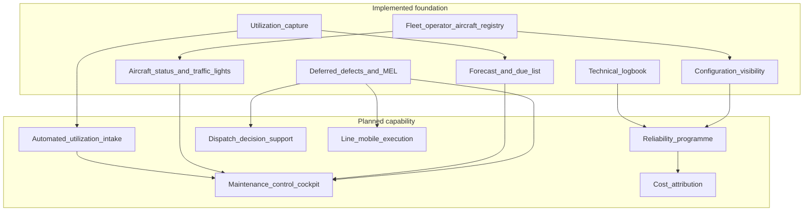
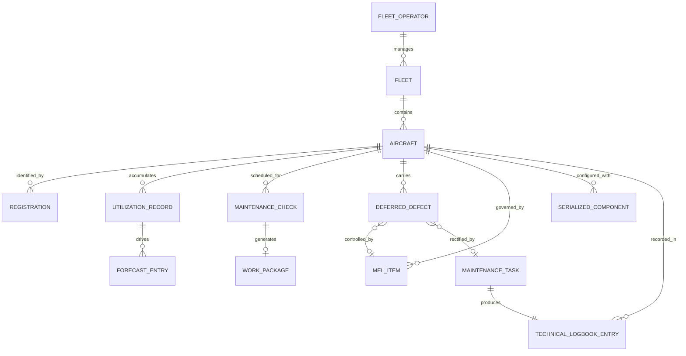
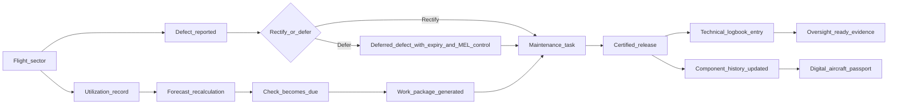
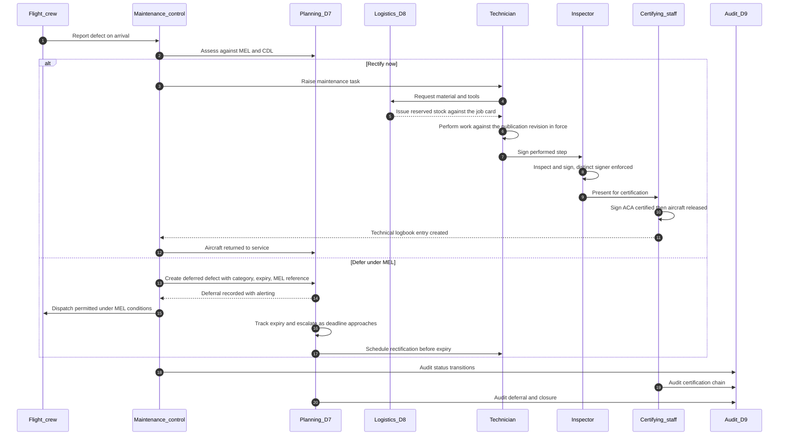
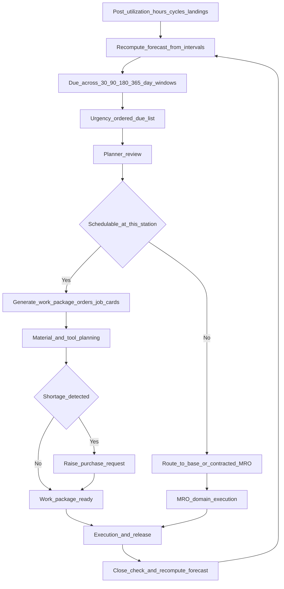
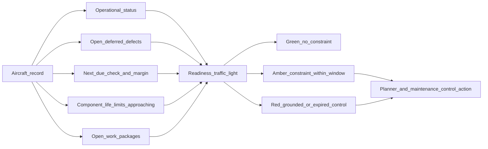

# Airline Domain — Operators and Fleet Operations

| Field | Value |
|-------|-------|
| Document | Airline Business Domain |
| Product | Mercury Aviation Enterprise Operating System (AEOS) |
| Organization | Mercury Technologies |
| Layer | Business domain (stakeholder capability, entity, and integration view) |
| Audience | Airline technical operations, maintenance control, reliability engineering, fleet management, domain consultants |
| Status | Living baseline |
| Companion documents | [OEM](OEM.md) · [MRO](MRO.md) · [CAMO](CAMO.md) · [Authority](Authority.md) · [Leasing](Leasing.md) |
| Upstream authority | [Domain Architecture](../02_Architecture/Domain_Architecture.md) · [Blueprint README](../../README.md) |

---

## 1. Purpose

### 1.1 What this domain exists to do

The airline domain is where Mercury answers the operator's defining question: **can this aircraft fly the next sector, legally and safely, and if not, what is the shortest defensible path to making it so?**

That question is deceptively simple. Answering it correctly requires knowing the airframe's identity and status, its accumulated hours and cycles, what maintenance is due and how much margin remains, which defects are open and under what control they are deferred, whether the Minimum Equipment List permits dispatch in the current configuration, and whether the personnel and parts needed for rectification are available at the station where the aircraft actually is. In most airlines that knowledge is distributed across a maintenance system, a technical records archive, a flight operations system, a spreadsheet held by maintenance control, and the memory of an experienced duty engineer.

Mercury's purpose in this domain is to make that answer a **single, continuously current, auditable state** derived from the Digital Thread rather than assembled by telephone.

The domain covers commercial airlines, cargo operators, business aviation flight departments, and helicopter operators. The regulatory frameworks and fleet economics differ; the operational question does not.

### 1.2 The operator's cost of fragmentation

| Fragmentation symptom | Operational cost | Mercury's answer |
|----------------------|------------------|------------------|
| Utilization posted daily by batch upload | Forecast is a day stale; short-notice checks surprise the schedule | Utilization is a first-class record that recomputes the forecast on change |
| Deferred defects tracked on a spreadsheet | Expiry is discovered by a station engineer, not by the system | Deferred defects carry expiry, alerting, and a controlling reference |
| MEL held as a PDF | Dispatch decisions rely on the crew's copy being current | MEL and CDL items are structured records bound to the aircraft |
| Aircraft status kept in the duty engineer's head | Nobody outside maintenance control can see fleet readiness | Aircraft status traffic lights are a queryable fleet view |
| Reliability data reconstructed at the quarterly review | Trends are found after they cost money, not before | Removal and finding data are captured as work is executed, not re-keyed |

### 1.3 Boundary with CAMO

An operator may hold its own continuing airworthiness responsibility or contract it out. Mercury does not force a choice. The **airline domain owns operational reality** — utilization, dispatch status, defect capture, fleet readiness. The **[CAMO domain](CAMO.md) owns the airworthiness determination** — what is due, on what authority, and whether the aircraft may be released. The two share the same data and the same aircraft records; they differ in accountability and in the permissions that gate them.

---

## 2. Business capabilities

### 2.1 Capability register

| # | Capability | What it means operationally | Standing |
|---|-----------|-----------------------------|----------|
| AL-C1 | **Fleet and operator registry** | Operators, fleets, aircraft, and registration history under one tenancy | Implemented |
| AL-C2 | **Aircraft status management** | Status codes with explicit, audited transitions — in service, AOG, maintenance, stored | Implemented |
| AL-C3 | **Registration lifecycle** | Registration marks tracked over time, including re-registration on transfer | Implemented |
| AL-C4 | **Utilization capture** | Hours, cycles, and landings recorded per aircraft, driving every interval calculation | Implemented |
| AL-C5 | **Fleet status traffic lights** | At-a-glance readiness across the fleet with urgency ordering | Implemented |
| AL-C6 | **Deferred defect control** | Defects carried forward with category, expiry date, controlling reference, and alerting | Implemented |
| AL-C7 | **MEL and CDL management** | Structured Minimum Equipment List and Configuration Deviation List items with rectification intervals | Implemented |
| AL-C8 | **Fault code capture** | Structured defect classification supporting trend analysis | Implemented |
| AL-C9 | **Technical logbook** | Permanent, append-only release record naming every signer and the revision in force | Implemented |
| AL-C10 | **Maintenance forecast** | Due list over 30, 90, 180, and 365-day windows derived from utilization and intervals | Implemented |
| AL-C11 | **Configuration visibility** | What is installed on each airframe, with life status and history | Implemented |
| AL-C12 | **Line station material visibility** | Stock and tool availability by location to support rectification decisions | Implemented |
| AL-C13 | **Automated utilization intake** | Direct feed from flight operations or ACARS rather than manual entry | Planned |
| AL-C14 | **Maintenance control cockpit** | A purpose-built operational picture combining status, defects, forecast, and material position | Planned |
| AL-C15 | **Reliability programme** | Removal rates, mean time between unscheduled removals, repeat-defect detection, escalation evidence | Planned |
| AL-C16 | **Dispatch decision support** | MEL-aware advisory on dispatch legality for the planned sector | Planned |
| AL-C17 | **Line maintenance mobile execution** | Offline-capable defect capture and rectification at the gate | Planned |
| AL-C18 | **Operational cost attribution** | Maintenance cost per aircraft, per hour, per event | Planned |

### 2.2 Capability dependency shape

---

## 3. Major entities

### 3.1 Entity register

| Entity | Owning Mercury domain | Description | Standing |
|--------|----------------------|-------------|----------|
| **Fleet operator** | D2 Fleet | The organization holding operational responsibility for a set of aircraft | Implemented |
| **Fleet** | D2 Fleet | A managed grouping of aircraft, typically by type or base | Implemented |
| **Aircraft** | D2 Fleet | The airframe: serial, model, status, operator, fleet | Implemented |
| **Registration** | D2 Fleet | The nationality and registration mark, historically variable | Implemented |
| **Aircraft status** | D2 Fleet, shared kernel codes | The operational condition of the airframe | Implemented |
| **Utilization record** | D7 Planning | Hours, cycles, and landings as of a timestamp | Implemented |
| **Maintenance check** | D7 Planning | A scheduled event derived from the programme, with due computation | Implemented |
| **Forecast entry** | D7 Planning, derived | Projected due date or due value for a check | Implemented |
| **Deferred defect** | D7 Planning | A carried-forward defect with category, expiry, and controlling reference | Implemented |
| **MEL item** | D7 Planning | A Minimum Equipment List entry with rectification interval | Implemented |
| **CDL item** | D7 Planning | A Configuration Deviation List entry | Implemented |
| **Fault code** | D6 Maintenance | Structured classification of a defect for trend analysis | Implemented |
| **Maintenance task** | D6 Maintenance | The certifiable unit of work, carrying the certification chain | Implemented |
| **Technical logbook entry** | D6 Maintenance | The permanent release record | Implemented |
| **Serialized component** | D3 Components | An installed item with life and history | Implemented |
| **Aircraft configuration** | D3 Components, derived | The installed set at positions | Implemented |
| **Flight / sector record** | — | The operational leg driving utilization | Planned |
| **Reliability observation** | — | A removal, finding, or repeat event classified for trend analysis | Planned |
| **Dispatch assessment** | — | An advisory determination of dispatch legality for a planned sector | Planned |
| **Cost event** | D11 Finance | Labour and material consumption attributed to an aircraft | Planned |

### 3.2 Entity relationship view

---

## 4. Relationships

### 4.1 To Mercury bounded contexts

| Mercury domain | Direction | What crosses the boundary |
|----------------|-----------|---------------------------|
| D1 Organization | Upstream | The operator's tenancy, sites, line stations, and memberships |
| D2 Fleet and Aircraft | Owned | Operators, fleets, aircraft, registrations, status |
| D3 Configuration and Components | Consumes | Installed configuration and component life for airworthiness assessment |
| D4 Publications | Consumes | Aircraft Flight Manual, MEL source, operational documentation |
| D6 Maintenance Execution | Partnership | Defects raised become tasks; releases return the aircraft to service |
| D7 Planning and CAMO | Partnership | Utilization drives the forecast; deferred defects and MEL gate dispatch |
| D8 Logistics and Stores | Consumes | Line station stock and tool availability for rectification |
| D9 Quality and Audit | Produces | Every status change, deferral, and release is evidence |

### 4.2 To other stakeholder domains

| Counterparty | Nature of the relationship | Mercury's mediation |
|--------------|---------------------------|---------------------|
| [CAMO](CAMO.md) | Determines what is due and whether the aircraft is airworthy; may be in-house or contracted | Shared aircraft, programme, and forecast records with distinct permission gating |
| [MRO](MRO.md) | Executes base and heavy maintenance the airline cannot perform on line | Work packages cross the boundary; the technical logbook is common evidence |
| [OEM](OEM.md) | Supplies type design, manuals, and service data; consumes in-service experience | Publications and SB records inbound; reliability return path planned |
| [Leasing](Leasing.md) | Owns a substantial share of the operator's fleet and holds return conditions | Configuration, life, and evidence are the shared asset record |
| [Authority](Authority.md) | Oversees the operator's approval and audits its records | Evidence is retained in queryable, resolvable form |
| Suppliers and logistics | Provide parts to the line station in AOG conditions | Material requests, reservations, and shipments |

### 4.3 The operator's slice of the digital thread

Every arrow in that diagram is a persisted, audited relationship rather than a process step performed outside the system. That is what [Digital Thread](../04_Data/Digital_Thread.md) means in operational terms.

### 4.4 Operator segments within this domain

The four segments this domain serves differ in fleet economics, regulatory framework, and maintenance drivers. They do **not** differ in schema: segment variation lands in master data — models, ATA range, programme content, MEL structure — rather than in tables or endpoints. That is the reason one operator domain serves all four rather than four editions of it. See [Master Data §4](../04_Data/Master_Data.md#4-reference-catalogues).

| Segment | What differs operationally | Capabilities it leans on hardest | Where Mercury is thin for this segment |
|---------|---------------------------|----------------------------------|----------------------------------------|
| **Commercial passenger airline** | High daily utilization, a multi-station line network, dispatch decisions measured in minutes, published schedule pressure | AL-C2, AL-C4, AL-C5, AL-C6, AL-C7, AL-C10 | Utilization is posted rather than fed (AL-C13); there is no station-level maintenance control cockpit (AL-C14) |
| **Cargo operator** | Night-weighted patterns, freighter conversion standards, loading systems and unit load devices, high cycle counts on short sectors | AL-C11 for the conversion and loading-system standard, AL-C4, AL-C6 | Loading systems and ground support equipment are not modelled as controlled configuration; cargo-specific dispatch conditions carry as ordinary MEL items rather than structured conditions |
| **Business aviation flight department** | Small fleet, few staff holding several roles, owner-driven schedule, high documentation expectation per airframe | AL-C1, AL-C9, AL-C10, plus passport assembly for owner and resale reporting | The certification segregation rules are **not relaxed for small teams**. A department where one person performs and inspects cannot satisfy them, and Mercury will refuse the release rather than provide an exception path — see §6.3 |
| **Helicopter and rotorcraft operator** | Component-life-dominated maintenance, retirement-life parts, offshore, EMS and utility bases, high cycle-to-hour ratios | AL-C11 and serialized component life, AL-C10 computed on cycles as well as hours | No assembly-hierarchy rollup, which costs more on rotor and transmission systems than on fixed-wing; exceedance events such as overtorque are not captured as structured life-affecting facts |

### 4.5 Enterprise functions mapped to capabilities

An operator is not one user community. The functions below are ecosystem roles inside the operator's own tenancy, each mapped to the capability and permission set that serves it.

| Function | What it is accountable for | Mercury capability it consumes | Persona and key permissions | Standing |
|----------|---------------------------|-------------------------------|----------------------------|----------|
| **Flight Ops** | Flying the sector, reporting defects on arrival, holding the dispatch decision under the MEL | Utilization posting, MEL and CDL read, open deferral visibility | `maintenance_control` today; a dedicated flight-ops read persona is planned | **Partial** — utilization and defects arrive by manual posting; sector capture and dispatch assessment are AL-C13 and AL-C16 |
| **Engineering** | Configuration decisions, technical queries, assessment of manufacturer service data for this fleet | Configuration read, publications by aircraft and by ATA, Engineering Orders raised through [CAMO](CAMO.md) | `engineering` — `engineering.read`, `configuration.read`, `component.read`, `publication.read` | Implemented |
| **Quality** | Compliance monitoring, audit readiness, findings and corrective action | Audit trail, certification evidence, technical logbook, task audit trails | `qa` — `qa.read`, `audit.read`, `logbook.read` | Implemented for evidence retrieval; a structured audit programme and findings register is planned — see [Authority §2](Authority.md#2-business-capabilities) |
| **Reliability** | Removal rates, repeat defects, trend detection, evidence for interval escalation | Fault code capture, component history, logbook, removal events | `reliability` — `qa.read`, `component.read`, `maintenance.read`, `fleet.read` | **Partial** — capture is implemented; the analytics layer is AL-C15 |
| **Finance** | Maintenance cost, maintenance reserves, budget variance | Material consumption through logistics; labour and cost rollup planned | `manager` with `logistics.finance` | **Partial** — AL-C18. Labour cost is not on the thread; see [Digital Thread §6.7](../04_Data/Digital_Thread.md#67-what-did-this-work-package-consume) |
| **HR and Training** | Employee records, licences, qualification currency, resourcing for planned work | Personnel employees, qualifications, authorizations, workforce plan lines | Personnel steward roles per [RBAC](../06_Security/RBAC.md) | Implemented for airworthiness-relevant personnel data only. Mercury holds certification authority because it is airworthiness data; payroll, benefits, and absence management are deliberately outside scope |
| **Executive** | Fleet readiness, operating cost, and risk posture across the portfolio | Planning and fleet dashboards | `manager` — `fleet.read`, `planning.read` | **Partial** — dashboards aggregate on demand; purpose-built read models are planned |
| **Warehouses and stores** | Line station and base material availability for rectification | Stock balances, shortages, reservations, issue against the job card | `store` — `logistics.stores`, `logistics.tools` | Implemented |
| **Suppliers** | AOG and routine parts supply into the station | Purchase request through receipt and putaway; vendor master | `logistics.purchase` | Implemented |
| **Component and engine shops** | Repair of rotables removed from the operator's aircraft | Rotable cycle, component removal and reinstallation history | `store`, `logistics.tools` | **Partial** — shop-visit life continuity is a named gap; see [MRO §4.4](MRO.md#44-shops-stores-and-the-supplier-ecosystem) |

---

## 5. APIs

### 5.1 Reading this section

**Current** endpoints exist in the runtime today. **Planned** endpoints are blueprint intent with no implementation. See [ROADMAP §1](../../ROADMAP.md#1-purpose-and-objectives).

### 5.2 Current endpoints serving this domain

| Area | Method and path | Purpose |
|------|-----------------|---------|
| Organization | `GET /api/v1/organizations` · `GET /api/v1/sites` | The operator's tenancy and its line stations and bases |
| Organization | `GET /api/v1/org/me` | The caller's effective organization and role context |
| Fleet | `GET /api/v1/fleet/operators` · `POST /api/v1/fleet/operators` | Fleet operator registry |
| Fleet | `GET /api/v1/fleet/fleets` · `POST /api/v1/fleet/fleets` | Fleet groupings |
| Fleet | `GET /api/v1/fleet/aircraft` | Fleet listing with filters |
| Fleet | `GET /api/v1/fleet/aircraft/{aircraft_id}` | Single airframe detail |
| Fleet | `POST /api/v1/fleet/aircraft` | Register an aircraft |
| Fleet | `PATCH /api/v1/fleet/aircraft/{aircraft_id}/status` | Change operational status — audited |
| Fleet | `GET /api/v1/fleet/statuses` | Status code catalogue |
| Fleet | `GET /api/v1/fleet/registrations` · `POST /api/v1/fleet/registrations` | Registration lifecycle |
| Planning | `PUT /api/v1/planning/utilization` | Post hours, cycles, and landings for an aircraft |
| Planning | `GET /api/v1/planning/aircraft-status` | Fleet readiness traffic lights |
| Planning | `GET /api/v1/planning/forecast` | Forecast across 30, 90, 180, 365-day windows |
| Planning | `GET /api/v1/planning/due-list` | Urgency-ordered due list |
| Planning | `GET /api/v1/planning/dashboard` | Planner and maintenance-control summary |
| Planning | `GET /api/v1/planning/checks` · `POST /api/v1/planning/checks` | Scheduled maintenance events |
| Planning | `GET /api/v1/planning/deferred-defects` · `POST /api/v1/planning/deferred-defects` | Deferred defect control |
| Planning | `GET /api/v1/planning/mel-items` · `POST /api/v1/planning/mel-items` | MEL and CDL items |
| Maintenance | `GET /api/v1/maintenance/tasks` · `POST /api/v1/maintenance/tasks` | Defect rectification and scheduled tasks |
| Maintenance | `GET /api/v1/maintenance/logbook` | Technical logbook |
| Maintenance | `GET /api/v1/maintenance/fault-codes` · `POST /api/v1/maintenance/fault-codes` | Structured defect classification |
| Components | `GET /api/v1/components/aircraft/{aircraft_id}/configuration` | Installed configuration |
| Components | `GET /api/v1/components/serialized` | Component life status across the fleet |
| Work orders | `GET /api/v1/work-orders/packages` · `GET /api/v1/work-orders/job-cards` | Open work against the fleet |
| Logistics | `GET /api/v1/logistics/stock/balances` | Line station material availability |
| Logistics | `GET /api/v1/logistics/shortages` | Material shortages affecting planned work |

### 5.3 Planned endpoints

| Area | Method and path | Purpose | Depends on |
|------|-----------------|---------|-----------|
| Operations | `POST /api/v1/fleet/aircraft/{aircraft_id}/sectors` | Post a completed sector, deriving utilization automatically | AL-C13 |
| Operations | `POST /api/v1/planning/utilization/import` | Bulk or streaming utilization intake from flight operations | AL-C13 |
| Maintenance control | `GET /api/v1/planning/maintenance-control/cockpit` | Combined status, defect, forecast, and material picture per station | AL-C14 |
| Dispatch | `POST /api/v1/planning/dispatch-assessment` | Advisory dispatch legality assessment against open MEL items | AL-C16 |
| Reliability | `GET /api/v1/reliability/removal-rates` | Removal rate and MTBUR by part number and ATA chapter | AL-C15 |
| Reliability | `GET /api/v1/reliability/repeat-defects` | Repeat and recurring defect detection by aircraft and system | AL-C15 |
| Line execution | `POST /api/v1/work-orders/job-cards/{job_card_id}/offline-sync` | Reconciliation of offline line maintenance activity | AL-C17 |
| Cost | `GET /api/v1/fleet/aircraft/{aircraft_id}/cost-summary` | Maintenance cost per aircraft and per flight hour | AL-C18 |

### 5.4 Contract principles

- **Utilization is the system's clock.** Posting utilization must recompute the forecast rather than requiring a separate refresh call. A forecast that can be stale relative to posted utilization is a defect.
- **Status changes are events, not attribute edits.** An aircraft moving to AOG is an operationally significant fact and is audited as one.
- **Dispatch assessment is advisory, permanently.** The planned endpoint returns an assessment with reasons. The commander and the certifying staff decide. No Mercury endpoint will ever return a dispatch authorization.
- **Deferred defects cannot be created without an expiry and a controlling reference.** The domain rejects an open-ended deferral; this is an invariant, not a validation preference.

---

## 6. Security

### 6.1 Persona access

| Persona | Typical airline-domain activity | Key permissions |
|---------|-------------------------------|-----------------|
| `maintenance_control` | Monitors fleet status, manages deferrals, coordinates rectification | `planning.read`, `planning.manage`, `fleet.read`, `maintenance.read`, `work_order.manage` |
| `planner` | Builds the maintenance plan from the forecast | `planning.read`, `planning.manage`, `work_order.manage`, `logistics.read` |
| `technician` | Rectifies defects at the line station | `task.manage`, `work_order.execute`, `certification.sign`, `publication.read` |
| `inspector` | Inspects rectification work | `inspector.approve`, `certification.sign`, `maintenance.read`, `audit.read` |
| `aca` | Releases the aircraft to service | `certification.release`, `certification.sign`, `logbook.read` |
| `reliability` | Analyses trends across the fleet | `qa.read`, `fleet.read`, `component.read`, `maintenance.read` |
| `engineering` | Assesses configuration and technical queries | `engineering.read`, `configuration.read`, `component.read` |
| `manager` | Reviews fleet readiness and cost position | `fleet.read`, `planning.read`, `logistics.finance` |

Persona definitions and the mapping onto session roles: [RBAC](../06_Security/RBAC.md).

### 6.2 Organization isolation

An airline's fleet, utilization, defect history, and readiness position are commercially sensitive. Every entity in this domain is organization-scoped, and every service asserts the caller's organization before reading or writing. Two properties matter especially here:

1. **Multi-operator groups.** An airline group with several operating certificates holds several organizations under one company. Isolation is enforced at the organization level, not the company level, so a subsidiary's records are not visible to a sister carrier unless a membership grants it.
2. **Line stations are sites, not tenants.** A station's staff see the fleet through site-scoped views but remain within the operator's organization. Site scoping filters; organization scoping isolates. These are different mechanisms and are not interchangeable.

### 6.3 Segregation of duties

The airline domain inherits the certification segregation rules from maintenance execution and does not weaken them under operational pressure:

- The individual who performed work cannot be the individual who inspects it.
- An independent inspection requires a third distinct individual.
- Release requires valid Aircraft Certification Authority at the moment of signing.
- These rules are enforced in the domain service layer and cannot be waived by configuration, by role, or by an AOG condition. A commercially urgent release is still a release.

### 6.4 Audit

Audit-critical transitions in this domain:

| Transition | Why it matters |
|------------|----------------|
| Aircraft status change to or from AOG | The operational and commercial record of downtime |
| Deferred defect creation | Establishes the deferral authority, category, and expiry |
| Deferred defect closure | Proves rectification occurred within the control period |
| Utilization posting | The basis of every interval and life calculation |
| Aircraft release to service | The certifying act; produces the technical logbook entry atomically |
| Logbook amendment | Append-only correction; the original entry is never overwritten |

Audit semantics, retention, and query scoping: [Audit](../06_Security/Audit.md).

---

## 7. Workflows

### 7.1 Defect reported through return to service

### 7.2 Utilization to forecast to work

### 7.3 Fleet readiness assessment

---

## 8. Future roadmap

| Horizon | Item | Value delivered | Dependency |
|---------|------|-----------------|-----------|
| Near term | Runtime persona RBAC enforcement across airline views | Maintenance control authority cannot be inferred from a dashboard | [ROADMAP §4](../../ROADMAP.md#4-near-term-horizon--assurance-and-hardening-additive) item 1 |
| Near term | Evidence pack export per aircraft | One-command audit bundle for a fleet review or a lease transaction | [ROADMAP §4](../../ROADMAP.md#4-near-term-horizon--assurance-and-hardening-additive) item 8 |
| Near term | Object storage for defect photographs and attachments | Line evidence becomes durable and integrity-checked | Object storage |
| Mid term | Automated utilization and operational status intake | Removes the daily manual posting and its lag | Flight operations integration contract |
| Mid term | Maintenance control cockpit | The operational picture in one place instead of five | Utilization intake and read models |
| Mid term | Reliability and engineering analytics | Trend, removal rate, and repeat-finding analysis over thread data | Data quality from components and execution |
| Mid term | Component and engine shop workflow integration | Life continuity across removal, repair, and reinstallation | Rotable lifecycle expansion |
| Long term | Dispatch decision support | MEL-aware advisory assessment ahead of the sector | Structured MEL conditions |
| Long term | Predictive removal forecasting | Condition-based input to the forecast, strictly advisory | [AI Strategy](../07_AI/AI_Strategy.md) |
| Long term | Digital twin for fleet scenario planning | Configuration-accurate simulation of maintenance scenarios | [Digital Twin](../07_AI/Digital_Twin.md) |
| Long term | Maintenance cost attribution per aircraft and flight hour | True operating economics from operational data | Finance capability expansion |

Horizon definitions and sequencing authority: [ROADMAP](../../ROADMAP.md).

---

## 9. Related documents

**Business domains**
[OEM](OEM.md) · [MRO](MRO.md) · [CAMO](CAMO.md) · [Authority](Authority.md) · [Leasing](Leasing.md)

**Architecture**
[Domain Architecture](../02_Architecture/Domain_Architecture.md) · [Enterprise Architecture](../02_Architecture/Enterprise_Architecture.md) · [System Context](../02_Architecture/System_Context.md) · [Technical Architecture](../02_Architecture/Technical_Architecture.md)

**Data**
[Digital Thread](../04_Data/Digital_Thread.md) · [Data Model](../04_Data/Data_Model.md) · [Master Data](../04_Data/Master_Data.md)

**Security**
[Security documentation set](../06_Security/) · [RBAC](../06_Security/RBAC.md) · [Identity](../06_Security/Identity.md) · [Audit](../06_Security/Audit.md) · [Digital Signatures](../06_Security/Digital_Signatures.md)

**Intelligence — advisory only, never a dispatch or airworthiness decision**
[AI documentation set](../07_AI/) · [AI Strategy](../07_AI/AI_Strategy.md) · [Digital Twin](../07_AI/Digital_Twin.md) · [Knowledge Graph](../04_Data/Knowledge_Graph.md)

**Regulation — descriptive mapping, not a claim of approval**
[Regulations documentation set](../09_Regulations/) · [FAA](../09_Regulations/FAA.md) · [Transport Canada](../09_Regulations/Transport_Canada.md)

**Repository root**
[README](../../README.md) · [VISION](../../VISION.md) · [ROADMAP](../../ROADMAP.md)

---

*Mercury Technologies — One Digital Thread. One Digital Aircraft Passport. One Aviation Enterprise Operating System.*
