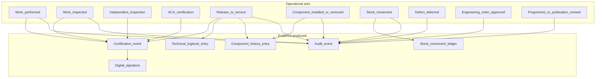
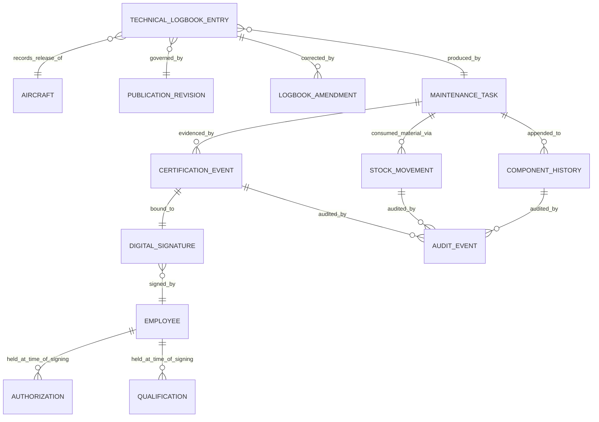
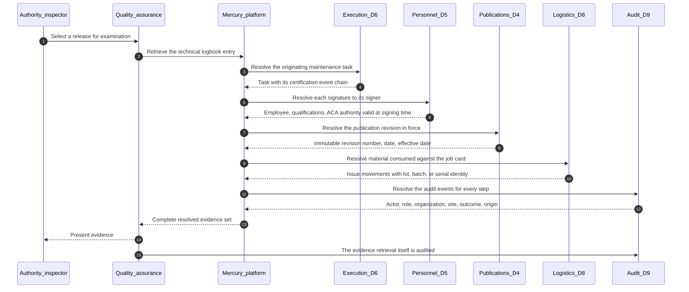
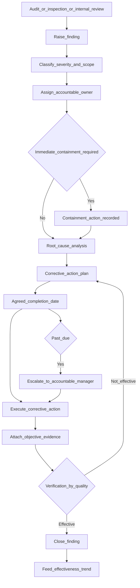

# Authority Domain — Regulatory Oversight and Evidence

| Field | Value |
|-------|-------|
| Document | Authority Business Domain |
| Product | Mercury Aviation Enterprise Operating System (AEOS) |
| Organization | Mercury Technologies |
| Layer | Business domain (stakeholder capability, entity, and integration view) |
| Audience | Quality assurance, compliance managers, accountable managers, legal, domain consultants, prospective authority stakeholders |
| Status | Living baseline |
| Posture | **Advisory and evidentiary. Mercury holds no aviation authority approval, delegation, or certification.** |
| Companion documents | [OEM](OEM.md) · [Airline](Airline.md) · [MRO](MRO.md) · [CAMO](CAMO.md) · [Leasing](Leasing.md) |
| Upstream authority | [Domain Architecture](../02_Architecture/Domain_Architecture.md) · [SECURITY.md](../../SECURITY.md) · [Blueprint README](../../README.md) |

---

## 1. Purpose

### 1.1 What this domain exists to do

The authority domain exists to make a Mercury-operated organization **oversight-ready by construction** rather than oversight-ready by preparation.

The distinction is the entire point. In most maintenance organizations, an audit triggers a project: records are gathered, revision status is reconstructed, signatures are matched to authorizations that were valid at the time, and a quality team spends weeks assembling a narrative that the underlying systems were never designed to produce. The evidence usually exists. It is simply not resolvable.

Mercury's design position is that **evidence is a by-product of doing the work correctly, not an artefact assembled afterwards**. Every certification step writes an immutable event. Every release writes a logbook entry naming the signers and the publication revision in force. Every stock movement, every deferral, every programme revision, and every approval writes an audit record with actor, organization, target, and outcome. When an inspector asks "show me the evidence for this release," the answer is a query, not an investigation.

### 1.2 Who this domain serves

| Party | Interest |
|-------|----------|
| The organization's **quality assurance function** | Internal audit, finding management, and demonstrable compliance |
| The organization's **accountable manager** | Confidence that the approval's obligations are being met and evidenced |
| The **regulating authority's inspector** | Access to complete, resolvable, unaltered records during oversight |
| **Auditors acting for a customer or lessor** | Independent verification of maintenance and airworthiness quality |
| **Mercury's own compliance function** | Ensuring the platform's claims match the platform's behaviour |

### 1.3 What Mercury does not claim

This section is binding on every other document in this repository, on every commercial conversation, and on every product surface.

| Claim Mercury does **not** make | The accurate position |
|---------------------------------|----------------------|
| Mercury is certified, approved, qualified, or accepted by any aviation authority | Mercury is a software platform. Regulatory approval attaches to **organizations**, not to the tools they use. No authority has approved, certified, or accredited Mercury. |
| Mercury holds a delegation or acts on an authority's behalf | Mercury holds no delegation of any kind. |
| Using Mercury makes an organization compliant | Compliance is a property of the organization's procedures, personnel, and conduct. Mercury supports compliance; it cannot confer it. |
| Mercury determines airworthiness | Airworthiness is determined by qualified persons in approved organizations. Mercury computes, records, and evidences their determinations. |
| Mercury's records are, by themselves, an approved record-keeping system | Whether an organization's use of Mercury satisfies its record-keeping obligations is a determination for that organization and its authority. |
| Mercury holds an independently issued compliance certification | No such certification has been issued. Claiming one that has not been independently issued is an explicit non-goal. See [ROADMAP §8](../../ROADMAP.md#8-explicit-non-goals) and [SECURITY.md](../../SECURITY.md). |
| Mercury is approved for military, defence, surveillance, emergency-response, or safety-of-life operations | Not claimed. Military aviation is a described future domain with no current accreditation. |

**Why this is stated so directly.** Aviation software vendors routinely blur "designed to support compliance with" into "compliant with," and buyers are misled. Mercury's founding position is that a company selling into a safety-critical, regulated industry has an obligation to state its regulatory standing precisely. Any Mercury material that softens the statements above is wrong and should be corrected against this document.

### 1.4 What Mercury does provide

Within that boundary, the platform provides a great deal:

- **Complete, append-only evidence** for certification, release, movement, and approval acts.
- **Resolvable references** — a release record resolves to the exact publication revision, the signers, their authorizations, the aircraft, and the components affected.
- **Immutable revision control** so historical work can be traced to the content that governed it.
- **Enforced segregation of duties** that cannot be waived by role, configuration, or operational pressure.
- **Scoped, audited access** so evidence can be shown without granting operational control.
- **Honest capability statements** so an organization presenting Mercury to its authority is not presenting an overstatement.

---

## 2. Business capabilities

### 2.1 Capability register

| # | Capability | What it means operationally | Standing |
|---|-----------|-----------------------------|----------|
| AUTH-C1 | **Immutable audit trail** | Actor, role, organization, site, target, source, outcome, origin recorded for every mutating action | Implemented |
| AUTH-C2 | **Certification event chain** | Append-only record of every certification step with its signature | Implemented |
| AUTH-C3 | **Digital signature records** | Immutable signatures hashing a canonical payload, bound to employee, method, and target | Implemented |
| AUTH-C4 | **Technical logbook** | Permanent release record naming every signer and the revision in force | Implemented |
| AUTH-C5 | **Append-only logbook amendment** | Corrections create new records; originals are never overwritten | Implemented |
| AUTH-C6 | **Task audit trail endpoint** | Complete certification and audit history for a single task in one call | Implemented |
| AUTH-C7 | **Immutable publication revisions** | Historical work resolves to the content that governed it | Implemented |
| AUTH-C8 | **Component installation history** | Append-only life and event record following the component | Implemented |
| AUTH-C9 | **Stock movement ledger** | Append-only record of every change of material state | Implemented |
| AUTH-C10 | **Personnel authorization records** | Qualifications and ACA authority with validity dates | Implemented |
| AUTH-C11 | **Fail-closed audit on certification acts** | Complete-work, inspect, and release fail if their audit write fails | Implemented |
| AUTH-C12 | **Retention-aware audit query** | Scoped audit access honouring the configured retention window | Implemented |
| AUTH-C13 | **Segregation of duties enforcement** | Distinct-signer rules enforced in the domain, not the client | Implemented |
| AUTH-C14 | **Evidence pack export** | One-command auditor-acceptable bundle for an aircraft, package, or component | Planned |
| AUTH-C15 | **Finding and corrective action management** | Internal and external audit findings with corrective action tracking to closure | Planned |
| AUTH-C16 | **Audit programme management** | Scheduled internal audit programme with scope and evidence | Planned |
| AUTH-C17 | **Read-scoped authority records access** | Advisory, time-boxed, audited read access for an inspector without operational rights | Planned |
| AUTH-C18 | **Tamper-evident evidence chaining** | Hash-linked records with periodic anchoring | Planned |
| AUTH-C19 | **Regulatory framework mapping** | Structured mapping of platform evidence to specific framework requirements | Planned |
| AUTH-C20 | **Occurrence reporting support** | Structured capture and export of reportable occurrences | Planned |

### 2.2 Evidence coverage

---

## 3. Major entities

### 3.1 Entity register

| Entity | Owning Mercury domain | Description | Standing |
|--------|----------------------|-------------|----------|
| **Audit event** | D9 Quality, append-only | Actor, actor role, organization, site, target type, target identifier, source, outcome, origin, detail | Implemented |
| **Certification event** | D6 Execution, append-only | One completed certification step bound to a signature | Implemented |
| **Digital signature** | D5 Personnel, immutable | The recorded act of signing with a hashed canonical payload | Implemented |
| **Technical logbook entry** | D6 Execution, append-only | The permanent release record | Implemented |
| **Logbook amendment** | D6 Execution, append-only | A correction referencing the original entry | Implemented |
| **Publication revision** | D4 Publications, immutable | The content in force at a point in time | Implemented |
| **Programme revision** | D7 Planning, immutable | The approved maintenance standard in force | Implemented |
| **Component installation history** | D3 Components, append-only | Install, remove, transfer, and maintenance release events | Implemented |
| **Stock movement** | D8 Logistics, append-only | Every change of material state | Implemented |
| **Qualification** | D5 Personnel | Recorded competence with validity dates | Implemented |
| **Authorization (ACA)** | D5 Personnel | Certification authority with validity dates | Implemented |
| **Critical task policy** | D6 Execution | Designation of tasks requiring independent inspection | Implemented |
| **Evidence record** | D9 Quality | A retained evidentiary artefact | Implemented |
| **Airworthiness Directive compliance** | D7 Planning | The obligation and its discharge | Partial — record exists, structured compliance state planned |
| **Finding** | — | An audit finding with severity, scope, and owner | Planned |
| **Corrective action** | — | The action closing a finding, with evidence and verification | Planned |
| **Audit programme** | — | The scheduled internal audit plan | Planned |
| **Oversight access grant** | — | A time-boxed, scoped, revocable read grant to an external reviewer | Planned |
| **Evidence pack** | — | An exported, resolvable bundle for a defined scope | Planned |
| **Regulatory requirement mapping** | — | A structured link from a framework requirement to the evidence satisfying it | Planned |

### 3.2 Evidence resolution chain

The property being asserted: from any logbook entry, an inspector can resolve backwards to the task, the certification steps, the signatures, the signers, the authorizations those signers held, the publication revision in force, the components affected, and the material consumed — without leaving the platform and without reconstruction.

---

## 4. Relationships

### 4.1 To Mercury bounded contexts

| Mercury domain | Direction | What crosses the boundary |
|----------------|-----------|---------------------------|
| D9 Quality and Audit | Owned | Audit events, evidence records; findings and audit programme planned |
| D6 Execution | Consumes | Certification events, logbook entries, task audit trails |
| D5 Personnel | Consumes | Signatures, qualifications, authorizations and their validity at time of signing |
| D3 Components | Consumes | Append-only installation and life history |
| D4 Publications | Consumes | Immutable revisions establishing what governed the work |
| D7 Planning | Consumes | Programme revisions, AD and SB records, approvals, deferrals |
| D8 Logistics | Consumes | The append-only movement ledger and material traceability |
| D1 Organization | Consumes | Tenancy, sites, memberships, and the effective role in each audit record |

D9 is **terminal by design**: it consumes from every context and publishes to none. Nothing in the platform depends on audit state, which is why an audit query can never affect operational behaviour.

### 4.2 To other stakeholder domains

| Counterparty | Nature of the relationship | Mercury's mediation |
|--------------|---------------------------|---------------------|
| [MRO](MRO.md) | Produces the largest volume of certification evidence | Certification chain and logbook are directly queryable |
| [CAMO](CAMO.md) | Produces determination, approval, and compliance evidence | Programme revisions, EO approvals, AD records, deferral control |
| [Airline](Airline.md) | Produces operational evidence — status, utilization, deferrals | Status transitions and deferral records are audited |
| [OEM](OEM.md) | Supplies the design and content baseline the evidence resolves to | Immutable publication revisions |
| [Leasing](Leasing.md) | Requests evidence for asset condition and return acceptance | The same evidence set, scoped differently |

### 4.3 Regulatory frameworks in scope of documentation

Mercury's regulations documentation set describes how platform capability relates to major frameworks. That documentation is **descriptive mapping work, not a claim of approval**:

| Framework | Documentation |
|-----------|---------------|
| FAA | [Regulations set](../09_Regulations/) |
| Transport Canada | [Regulations set](../09_Regulations/) |
| EASA | [Regulations set](../09_Regulations/) |
| ICAO | [Regulations set](../09_Regulations/) |

Deeper structured mapping and evidence alignment programmes are a long-term roadmap theme, not a delivered capability. See [ROADMAP §6](../../ROADMAP.md#6-long-term-horizon--intelligence-and-regulated-extension).

### 4.4 The oversight surface across the ecosystem

Oversight follows the approval, not the aircraft. Each ecosystem role below is examined against a different obligation, and the evidence an inspector asks for differs accordingly.

| Ecosystem role under oversight | What the inspector examines | Where the evidence lives in Mercury | Standing |
|-------------------------------|----------------------------|-------------------------------------|----------|
| **Commercial operator** | Continuing airworthiness management, dispatch under the MEL, deferral discipline, technical records | Deferral records with expiry and controlling reference, status transitions, technical logbook, audit trail | Implemented as retrievable evidence |
| **Cargo operator** | The same, plus conversion and loading-system configuration standard | Configuration and modification records through Engineering Orders | **Partial** — loading systems are not modelled as controlled configuration |
| **Business aviation operator** | Records completeness and, frequently, whether a small team genuinely achieved independent inspection | Certification events with distinct-signer enforcement, which cannot be waived | Implemented — and the enforcement is the evidence |
| **Helicopter and rotorcraft operator** | Retirement-life part control and component life accuracy | Serialized component life, installation history | **Partial** — no assembly rollup |
| **Maintenance organization** | Certifying staff authority, procedures, tool calibration, work performed against approved data | Certification chain, personnel authorizations with validity intervals, tool calibration records, publication revision binding | Implemented |
| **Component and engine shop** | Approved data used, life continuity across the visit, release certification | Rotable cycle, component history, certification events | **Partial** — shop-visit lifecycle is a named gap |
| **Warehouses, suppliers, and distributors** | Material traceability, receiving inspection, quarantine of unserviceable and suspect parts | Append-only movement ledger, condition states, receipts and putaway | Implemented for movement; certification trace is attachment-based |
| **Continuing-airworthiness provider** | Whether one provider's several customers are genuinely kept distinct | Organization isolation per customer, audited context switching | Implemented — see [CAMO §4.5](CAMO.md#45-operator-segments-and-contracting-models) |

### 4.5 Internal accountability functions

Oversight is not only external. Two internal functions carry the organization's own answer to it.

| Function | Accountability | Mercury capability it consumes | Persona and key permissions | Standing |
|----------|---------------|-------------------------------|----------------------------|----------|
| **Quality** | Internal audit, procedure conformance, findings and corrective action, preparation for external inspection | Audit event query by target and actor, task audit trails, certification evidence, personnel authority currency | `qa` — `qa.read`, `audit.read`, `logbook.read` | Implemented for evidence retrieval. A structured **audit programme, findings register, and corrective-action tracking** is the domain's principal planned capability, and its absence is stated rather than implied |
| **Executive and accountable manager** | Named accountability for the organization's approval, its safety and compliance posture, and its response to findings | Compliance and evidence views; audit summary | `manager`, with administrator scope for cross-organization review | **Partial** — evidence is queryable; a compliance posture read model is planned |
| **Reliability** | Demonstrating that programme effectiveness is monitored rather than assumed | Component history, fault codes, deferral history | `reliability` | **Partial** — analytics planned |
| **Engineering** | Defending the technical basis of a determination when it is challenged | Publication revisions, Engineering Orders with approver identity, configuration at the time | `engineering` | Implemented |
| **HR and Training** | Proving that the people who signed held the authority they claimed, on the day they claimed it | Qualifications and authorizations with issue and expiry, signer binding | Personnel steward roles per [RBAC](../06_Security/RBAC.md) | Implemented for the airworthiness-relevant subset |
| **Finance** | Substantiating that compliance was funded and executed, not deferred for cost | Compliance state and deferral history; cost attribution planned | `manager` with `logistics.finance` | **Partial** |

The recurring property: **an inspector never asks Mercury for an opinion.** Every row above is a request for a record that already exists, retrieved with its actor, its time, and its authority intact. That is the whole of Mercury's oversight value proposition, and §1.3 is the boundary on it.

---

## 5. APIs

### 5.1 Reading this section

**Current** endpoints exist in the runtime today. **Planned** endpoints are blueprint intent. Nothing in this section implies that any endpoint has been reviewed or accepted by an authority. See [ROADMAP §1](../../ROADMAP.md#1-purpose-and-objectives).

### 5.2 Current endpoints serving evidence needs

| Area | Method and path | Purpose |
|------|-----------------|---------|
| Task evidence | `GET /api/v1/maintenance/tasks/{task_id}/audit-trail` | Complete certification and audit history for one task |
| Task evidence | `GET /api/v1/maintenance/tasks/{task_id}` | Task state including certification progress |
| Release evidence | `GET /api/v1/maintenance/logbook` | Technical logbook with signer and revision references |
| Release evidence | `POST /api/v1/maintenance/logbook/{entry_id}/amend` | Append-only correction; the original is preserved |
| Signature evidence | `GET /api/v1/maintenance/signatures/{signature_id}` | Retrieve an immutable signature record |
| Policy evidence | `GET /api/v1/maintenance/critical-policies` | Which tasks require independent inspection and why |
| Authority evidence | `GET /api/v1/personnel/employees/{employee_id}/authorizations` | ACA and other authorities with validity dates |
| Competence evidence | `GET /api/v1/personnel/employees/{employee_id}/qualifications` | Qualifications with validity dates |
| Content evidence | `GET /api/v1/publications/{publication_id}/revisions` | Revision lineage establishing what was in force |
| Configuration evidence | `GET /api/v1/components/serialized/{component_id}/history` | Append-only component life and event history |
| Configuration evidence | `GET /api/v1/components/history` | Cross-fleet history query with filters |
| Configuration evidence | `GET /api/v1/components/aircraft/{aircraft_id}/configuration` | Installed configuration at a point in time |
| Material evidence | `GET /api/v1/logistics/stock/movements` | The append-only movement ledger |
| Material evidence | `GET /api/v1/logistics/receipts` | Receiving inspection and acceptance records |
| Tool evidence | `GET /api/v1/logistics/tools/{tool_id}/calibrations` | Calibration currency history |
| Tool evidence | `GET /api/v1/logistics/lost-tool-reports` | Foreign object risk control records |
| Airworthiness evidence | `GET /api/v1/planning/ads` · `GET /api/v1/planning/service-bulletins` | Obligation registers |
| Airworthiness evidence | `GET /api/v1/planning/engineering-orders` | Approved engineering instructions |
| Airworthiness evidence | `GET /api/v1/planning/deferred-defects` | Deferral control with expiry |
| Airworthiness evidence | `GET /api/v1/planning/programs/{program_id}/revisions` | Approved programme revision lineage |
| Platform audit | `GET /api/v1/audit` | Retention-aware, organization-scoped audit query |
| Administration | `/admin` endpoints | Administrative and platform oversight functions, themselves audited |

### 5.3 Planned endpoints

| Area | Method and path | Purpose | Depends on |
|------|-----------------|---------|-----------|
| Evidence export | `GET /api/v1/audit/evidence-pack` | Auditor-acceptable bundle for an aircraft, package, or component with resolvable references | AUTH-C14 |
| Findings | `GET`/`POST /api/v1/quality/findings` | Audit findings with severity, scope, and owner | AUTH-C15 |
| Findings | `POST /api/v1/quality/findings/{finding_id}/corrective-actions` | Corrective action with evidence and verification | AUTH-C15 |
| Audit programme | `GET`/`POST /api/v1/quality/audit-programme` | Scheduled internal audit plan | AUTH-C16 |
| Oversight access | `POST /api/v1/quality/oversight-grants` | Create a time-boxed, scoped, revocable read grant for a reviewer | AUTH-C17 |
| Oversight access | `DELETE /api/v1/quality/oversight-grants/{grant_id}` | Revoke a grant immediately | AUTH-C17 |
| Integrity | `GET /api/v1/audit/integrity-proof` | Verify the hash chain over a range of evidence records | AUTH-C18 |
| Mapping | `GET /api/v1/quality/requirement-mapping` | Framework requirement to supporting evidence mapping | AUTH-C19 |
| Occurrence | `POST /api/v1/quality/occurrences` | Structured occurrence capture for reporting | AUTH-C20 |

### 5.4 Contract principles

- **Evidence endpoints are read-only.** There is no API that edits a certification event, a signature, a logbook entry, a component history record, or a stock movement. Corrections are new records that reference originals.
- **Audit queries are organization-scoped and retention-aware.** An audit read cannot cross a tenancy boundary and cannot return records outside the configured retention window.
- **Oversight access, when built, grants read only.** An oversight grant will never confer the ability to create, approve, sign, release, or modify anything. An inspector observes; the organization acts.
- **Every oversight access is itself audited.** Who looked at what, when, under which grant. This protects the organization as much as it protects the platform.
- **Evidence packs must be resolvable, not merely complete.** A bundle containing a release record without the publication revision it cites is not evidence; it is a document dump.

---

## 6. Security

### 6.1 Persona access

| Persona | Typical authority-domain activity | Key permissions |
|---------|----------------------------------|-----------------|
| `qa` | Internal audit, evidence review, finding management | `qa.read`, `audit.read`, `logbook.read`, `maintenance.read`, `publication.read` |
| `inspector` | Reviews certification evidence in the course of inspection | `audit.read`, `inspector.approve`, `maintenance.read`, `logbook.read` |
| `aca` | Reviews the chain before certifying | `logbook.read`, `maintenance.read`, `certification.release` |
| `reliability` | Analyses findings and trends across evidence | `qa.read`, `maintenance.read`, `component.read` |
| `manager` | Accountable oversight of compliance position | `fleet.read`, `planning.read`, `work_order.read` |
| `administrator` | Platform administration; every action audited | `*` |
| External reviewer (planned) | Read-scoped, time-boxed oversight access under an explicit grant | Read-only projection; no write permission of any kind |

Persona-to-role mapping and permission semantics: [RBAC](../06_Security/RBAC.md).

### 6.2 The threat model is repudiation

Most Mercury domains defend primarily against unauthorized modification and cross-tenant leakage. The authority domain's primary threat is different: **repudiation** — a signer later denying an act, or a record being altered after the fact to change what an audit would show.

The controls that follow from that threat model:

| Control | Status |
|---------|--------|
| Evidence aggregates are append-only; no update path exists in application code | Implemented |
| Signatures hash a canonical payload of organization, target, step, employee, username, method, timestamp, and notes | Implemented |
| Signing requires the employee to be bound to the authenticated user | Implemented |
| Credential verification is performed per signing method | Implemented |
| Audit on certification acts is fail-closed | Implemented |
| Corrections are new records referencing originals | Implemented |
| Certificate-backed cryptographic non-repudiation | **Planned** — the current scheme attests content and method but is not certificate-chain backed |
| Tamper-evident hash chaining with periodic anchoring | **Planned** — the highest-value integrity hardening available to the platform |

The last two rows are stated as gaps because they are gaps. An organization presenting Mercury evidence to its authority should describe the current scheme accurately: immutable-by-design, hash-attested, fail-closed audited, and not yet cryptographically chained.

### 6.3 Organization isolation under oversight

Oversight access is the single most sensitive access pattern Mercury will ever implement, because it is the only one that crosses a tenancy boundary by intent. The planned design constraints are binding:

1. **Explicit grant.** No standing access. A grant is created by the organization, for a defined scope, for a defined period.
2. **Read only.** A grant confers no write capability. This is enforced structurally, not by permission configuration.
3. **Scoped.** By aircraft, package, date range, or evidence class — not blanket tenancy access.
4. **Revocable immediately.** Revocation takes effect on the next request, not at expiry.
5. **Audited on both sides.** The organization sees every access made under the grant.
6. **No operational surface.** An oversight session cannot approve, sign, release, defer, adjust stock, or change status.

### 6.4 Retention

Audit and evidence retention is configurable per deployment and must satisfy the retention obligations the organization is subject to. The blueprint's aspirational target is **life of asset plus the authority-required period, with archival tiering**. Evidence durability is targeted at RPO 0 — losing a release signature is not recoverable by any operational means, unlike losing fifteen minutes of stock movements. See [Domain Architecture §8.4](../02_Architecture/Domain_Architecture.md#84-durability-and-recoverability).

### 6.5 A note on audit write failure

Mercury's general posture is that an audit write failure is logged and does not roll back the business transaction — an availability trade-off recorded as a deliberate decision rather than left as a surprise. **Certification acts are the exception**: `complete-work`, `inspect`, and `release` are fail-closed. If their audit write fails, the operation fails.

That asymmetry is intentional and defensible. A stock adjustment without an audit record is a data quality problem. A release without an audit record is an unevidenced release.

---

## 7. Workflows

### 7.1 Oversight inspection of a release

No step in that sequence involves assembling a document, searching an archive, or reconstructing which manual revision applied. That is the operational meaning of oversight-ready by construction.

### 7.2 Finding to corrective action — planned

### 7.3 Scoped oversight access — planned

```mermaid
flowchart LR
    Request["External_reviewer_requests_access"] --> Review["Organization_reviews_request"]
    Review --> Decide{"Grant_access"}
    Decide -->|"No"| Decline["Declined_and_recorded"]
    Decide -->|"Yes"| Grant["Create_oversight_grant"]
    Grant --> Scope["Define_scope_aircraft_package_date_range"]
    Scope --> Period["Define_validity_period"]
    Period --> ReadOnly["Read_only_projection_issued"]
    ReadOnly --> Access["Reviewer_reads_evidence"]
    Access --> Audit["Every_access_audited_and_visible_to_organization"]
    Audit --> Expiry{"Expired_or_revoked"}
    Expiry -->|"Revoked"| Immediate["Effective_on_next_request"]
    Expiry -->|"Expired"| Ended["Access_ends"]
    Immediate --> Ended
    Ended --> Record["Grant_and_access_history_retained"]
```

---

## 8. Future roadmap

| Horizon | Item | Value delivered | Dependency |
|---------|------|-----------------|-----------|
| Near term | Evidence pack export | Turns an audit preparation project into a single command | [ROADMAP §4](../../ROADMAP.md#4-near-term-horizon--assurance-and-hardening-additive) item 8 |
| Near term | Object storage for certificates and evidence attachments | Durable, integrity-checked evidence rather than metadata references | [ROADMAP §4](../../ROADMAP.md#4-near-term-horizon--assurance-and-hardening-additive) item 6 |
| Near term | PKI and smart-card signature adapters | Moves from hash attestation toward certificate-backed non-repudiation | [ROADMAP §4](../../ROADMAP.md#4-near-term-horizon--assurance-and-hardening-additive) item 3 |
| Near term | Runtime persona RBAC enforcement | Consistent, provable authority enforcement at the service boundary | [ROADMAP §4](../../ROADMAP.md#4-near-term-horizon--assurance-and-hardening-additive) item 1 |
| Mid term | Finding and corrective action management | Completes the quality management capability inside the evidence spine | Quality domain expansion |
| Mid term | Audit programme management | Scheduled internal audit with evidence, closing the QMS loop | Quality domain expansion |
| Mid term | Read-scoped, time-boxed oversight access | Show evidence without granting tenancy or operational control | Cross-organization sharing construct |
| Mid term | Occurrence capture and structured export | Supports the organization's reporting obligations | Quality domain expansion |
| Long term | Tamper-evident chaining with periodic anchoring | Cryptographic rather than procedural integrity guarantee | Append-only store |
| Long term | Structured regulatory requirement mapping | Framework requirements linked to the evidence satisfying them | [Regulations set](../09_Regulations/) |
| Long term | Deeper regulatory alignment programmes | Structured alignment work with named frameworks | [ROADMAP §6](../../ROADMAP.md#6-long-term-horizon--intelligence-and-regulated-extension) |
| Long term | Military domain readiness | Segregation, classification handling, disconnected deployment; no certification claimed | [SECURITY.md](../../SECURITY.md) |

**A standing constraint on this roadmap.** No item above will be described as delivering regulatory approval, certification, or compliance. Each delivers *evidence capability*. The distinction is not pedantry; it is the difference between an accurate statement and a misrepresentation to a regulated buyer.

---

## 9. Related documents

**Business domains**
[OEM](OEM.md) · [Airline](Airline.md) · [MRO](MRO.md) · [CAMO](CAMO.md) · [Leasing](Leasing.md)

**Architecture**
[Domain Architecture](../02_Architecture/Domain_Architecture.md) · [Enterprise Architecture](../02_Architecture/Enterprise_Architecture.md) · [System Context](../02_Architecture/System_Context.md) · [Technical Architecture](../02_Architecture/Technical_Architecture.md)

**Data**
[Digital Thread](../04_Data/Digital_Thread.md) · [Data Model](../04_Data/Data_Model.md) · [Master Data](../04_Data/Master_Data.md)

**Security**
[Security documentation set](../06_Security/) · [RBAC](../06_Security/RBAC.md) · [Identity](../06_Security/Identity.md) · [Audit](../06_Security/Audit.md) · [Digital Signatures](../06_Security/Digital_Signatures.md) · [SECURITY.md](../../SECURITY.md)

**Regulation — descriptive mapping, not a claim of approval**
[Regulations documentation set](../09_Regulations/) · [FAA](../09_Regulations/FAA.md) · [Transport Canada](../09_Regulations/Transport_Canada.md)

**Intelligence — advisory only, and never part of an evidence record**
[AI documentation set](../07_AI/) · [AI Strategy](../07_AI/AI_Strategy.md) · [Knowledge Graph](../04_Data/Knowledge_Graph.md)

**Repository root**
[README](../../README.md) · [VISION](../../VISION.md) · [ROADMAP](../../ROADMAP.md)

---

*Mercury Technologies — One Digital Thread. One Digital Aircraft Passport. One Aviation Enterprise Operating System.*
