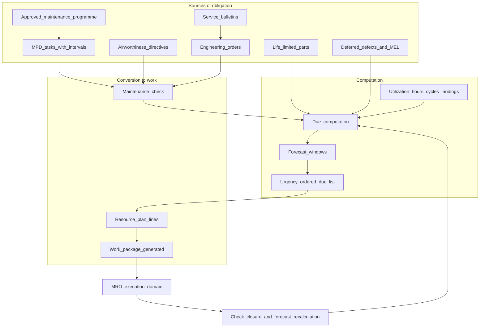
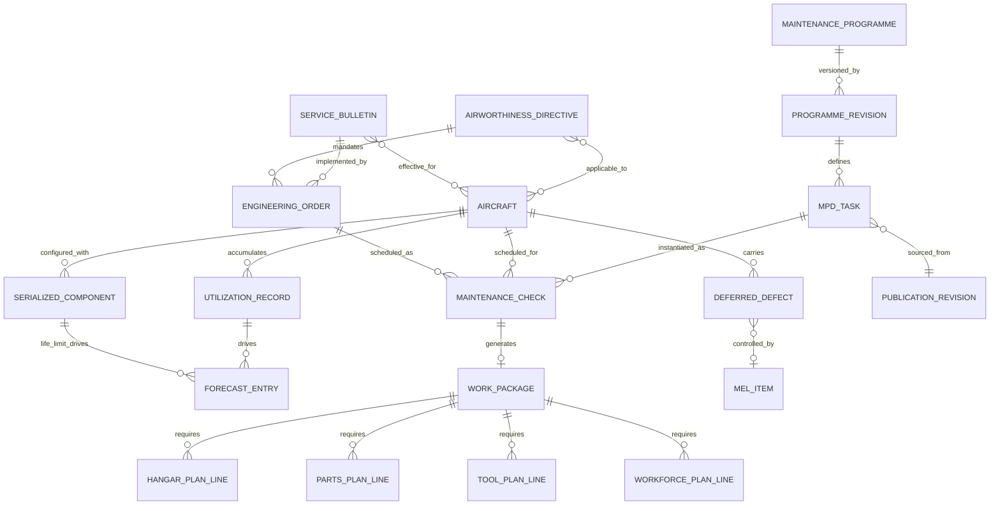
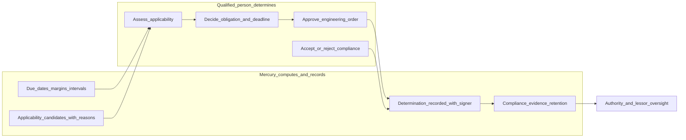
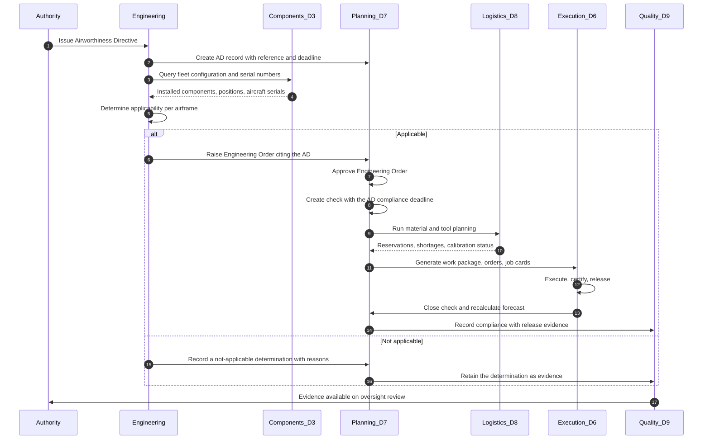
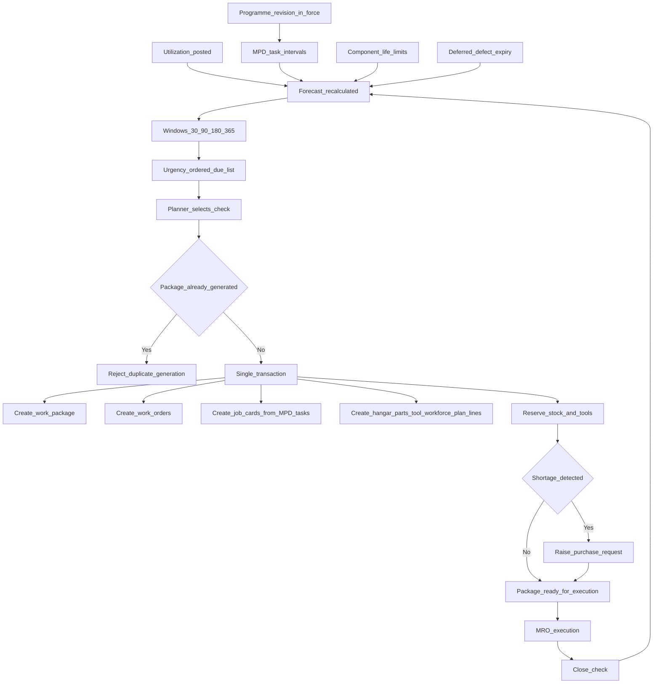
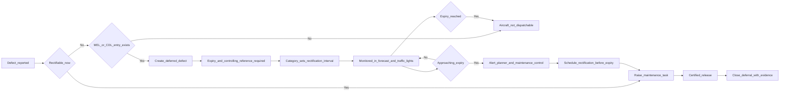

# CAMO Domain — Continuing Airworthiness Management

| Field | Value |
|-------|-------|
| Document | CAMO Business Domain |
| Product | Mercury Aviation Enterprise Operating System (AEOS) |
| Organization | Mercury Technologies |
| Layer | Business domain (stakeholder capability, entity, and integration view) |
| Audience | Continuing airworthiness managers, technical services, maintenance planning, engineering, quality assurance, domain consultants |
| Status | Living baseline |
| Companion documents | [OEM](OEM.md) · [Airline](Airline.md) · [MRO](MRO.md) · [Authority](Authority.md) · [Leasing](Leasing.md) |
| Upstream authority | [Domain Architecture](../02_Architecture/Domain_Architecture.md) · [Blueprint README](../../README.md) |

---

## 1. Purpose

### 1.1 What this domain exists to do

The CAMO domain is Mercury's **airworthiness conscience**. Where [MRO](MRO.md) answers "was this work done correctly," CAMO answers the prior and harder question: **what work is required, on what authority, by when, and what happens to the aircraft's airworthiness if it is not done.**

Continuing airworthiness management is fundamentally a problem of *obligation tracking under uncertainty*. Obligations arrive from four independent sources — the approved maintenance programme, authority Airworthiness Directives, manufacturer Service Bulletins, and the organization's own Engineering Orders. Each carries its own applicability logic, its own interval basis, and its own compliance evidence requirement. They accumulate against an asset whose utilization changes daily and whose configuration changes with every component swap.

Mercury's purpose in this domain is to hold that entire obligation set as **live, computed, evidenced state** rather than as a planner's spreadsheet reconciled monthly.

### 1.2 The four sources of obligation

| Source | Authority | Nature | Mercury entity |
|--------|-----------|--------|----------------|
| **Approved maintenance programme** | The operator's approved programme, derived from the manufacturer's MPD and accepted by the authority | Recurring, interval-driven | Maintenance programme, programme revision, MPD task, check |
| **Airworthiness Directive** | The regulating authority | Mandatory, with a compliance deadline that overrides commercial preference | Airworthiness Directive record with applicability and compliance |
| **Service Bulletin** | The manufacturer | Recommended or mandatory by classification and by AD reference | Service Bulletin record with effectivity |
| **Engineering Order** | The organization's own approved engineering function | Organization-specific, approved before embodiment | Engineering Order with approval workflow |

A CAMO that tracks only the first source and handles the other three by email is the industry norm and the industry's most common source of audit findings. Mercury holds all four in one model, against one aircraft, with one forecast.

### 1.3 What Mercury determines and what it does not

Mercury **computes** — due dates, remaining margin, interval expiry, deferral expiry, forecast windows, and candidate applicability. Mercury **records** — determinations, approvals, compliance evidence, and the identity of the person who made each call.

Mercury does **not** determine airworthiness. A qualified person in an approved organization does that, and Mercury's role is to give them complete information and then permanently record what they decided and why. No computed output in this domain is a compliance verdict, and no planned AI capability will ever become one. That boundary is stated identically in [Authority §1.3](Authority.md#13-what-mercury-does-not-claim) and is a founding non-goal in [ROADMAP §8](../../ROADMAP.md#8-explicit-non-goals).

---

## 2. Business capabilities

### 2.1 Capability register

| # | Capability | What it means operationally | Standing |
|---|-----------|-----------------------------|----------|
| CAMO-C1 | **Maintenance programme management** | Approved programmes per fleet or type, with immutable revisions | Implemented |
| CAMO-C2 | **MPD task library** | Maintenance Planning Document tasks with multi-unit intervals and resource demand | Implemented |
| CAMO-C3 | **Check definition and due computation** | Preflight through D check, structural, engine, and custom checks with computed due state | Implemented |
| CAMO-C4 | **Airworthiness Directive register** | AD records with reference, applicability narrative, and compliance tracking | Implemented |
| CAMO-C5 | **Service Bulletin register** | SB records with classification and effectivity | Implemented |
| CAMO-C6 | **Engineering Order workflow** | Raise, review, and approve an EO before embodiment | Implemented |
| CAMO-C7 | **MEL and CDL management** | Structured dispatch-deviation items with rectification intervals | Implemented |
| CAMO-C8 | **Deferred defect control** | Category, expiry, controlling reference, and alerting on approaching deadline | Implemented |
| CAMO-C9 | **Utilization tracking** | Hours, cycles, and landings as the basis of every interval calculation | Implemented |
| CAMO-C10 | **Forecast engine** | Projected due state across 30, 90, 180, and 365-day windows | Implemented |
| CAMO-C11 | **Urgency-ordered due list** | The planner's working queue, ordered by margin remaining | Implemented |
| CAMO-C12 | **Aircraft status traffic lights** | Fleet-wide airworthiness constraint visibility | Implemented |
| CAMO-C13 | **Resource plan lines** | Hangar, parts, tool, and workforce demand attached to a planned package | Implemented |
| CAMO-C14 | **Automatic work package generation** | Check to package to work orders to job cards, with material and tool planning invoked inline | Implemented |
| CAMO-C15 | **Life-limited part tracking** | TSN, TSO, CSN, CSO and life limits on serialized components | Implemented |
| CAMO-C16 | **Component configuration control** | Installed configuration as the applicability comparison target | Implemented |
| CAMO-C17 | **Machine-evaluated applicability** | AD and SB effectivity evaluated automatically against live configuration | Planned |
| CAMO-C18 | **Compliance status per obligation per aircraft** | A single queryable answer for "is this aircraft compliant with AD X" | Planned |
| CAMO-C19 | **Reliability programme and escalation evidence** | Trend data supporting interval escalation submissions | Planned |
| CAMO-C20 | **Airworthiness Review Certificate support** | Structured recommendation evidence for review and renewal | Planned |
| CAMO-C21 | **Programme compliance dashboard for oversight** | Read-scoped view suitable for authority or lessor review | Planned |
| CAMO-C22 | **Contracted CAMO multi-customer management** | A CAMO managing several operators' fleets under separate approvals | Planned |

### 2.2 Obligation to execution pipeline

---

## 3. Major entities

### 3.1 Entity register

| Entity | Owning Mercury domain | Description | Standing |
|--------|----------------------|-------------|----------|
| **Maintenance programme** | D7 Planning | The approved recurring maintenance schedule for a fleet or type | Implemented |
| **Programme revision** | D7 Planning, immutable | A dated, frozen version of the programme | Implemented |
| **MPD task** | D7 Planning | A recurring task with multi-unit intervals and resource demand | Implemented |
| **Maintenance check** | D7 Planning | A scheduled event derived from the programme, with computed due state | Implemented |
| **Airworthiness Directive** | D7 Planning | A mandatory authority instruction with a compliance deadline | Implemented |
| **Service Bulletin** | D7 Planning | A manufacturer instruction with classification and effectivity | Implemented |
| **Engineering Order** | D7 Planning | The organization's approved instruction, with an approval workflow | Implemented |
| **MEL item** | D7 Planning | A Minimum Equipment List entry with a rectification interval | Implemented |
| **CDL item** | D7 Planning | A Configuration Deviation List entry | Implemented |
| **Deferred defect** | D7 Planning | A carried-forward defect with expiry and controlling reference | Implemented |
| **Utilization record** | D7 Planning | Hours, cycles, and landings as of a timestamp | Implemented |
| **Forecast entry** | D7 Planning, derived | Projected due state; recomputed, never hand-edited | Implemented |
| **Hangar plan line** | D7 Planning | Bay and dock demand for a package | Implemented |
| **Parts plan line** | D7 Planning | Material demand feeding logistics reservation | Implemented |
| **Tool plan line** | D7 Planning | Tool demand feeding tool reservation with calibration check | Implemented |
| **Workforce plan line** | D7 Planning | Trade and headcount demand | Implemented |
| **Serialized component** | D3 Components | Life-limited and hard-time items with TSN, TSO, CSN, CSO | Implemented |
| **Aircraft configuration** | D3 Components, derived | The installed set used for applicability comparison | Implemented |
| **Publication revision** | D4 Publications, immutable | The task source content and the release precondition | Implemented |
| **Effectivity expression** | — | A machine-evaluable applicability rule | Planned |
| **Compliance record** | — | The determination and evidence for one obligation on one aircraft | Planned |
| **Reliability observation** | — | A removal, finding, or repeat event classified for trend analysis | Planned |
| **Airworthiness review record** | — | Structured evidence supporting a review recommendation | Planned |

### 3.2 Entity relationship view

---

## 4. Relationships

### 4.1 To Mercury bounded contexts

| Mercury domain | Direction | What crosses the boundary |
|----------------|-----------|---------------------------|
| D1 Organization | Upstream | Tenancy and the approval scope the CAMO operates under |
| D2 Fleet | Upstream | Aircraft identity, model, registration — the subject of every obligation |
| D3 Components | Upstream | Installed configuration and component life for applicability and hard-time tracking |
| D4 Publications | Upstream | MPD source content, SB text, and the immutable revision cited on generated work |
| D6 Execution | Downstream, customer-supplier | Generated work packages, orders, and job cards; completion signals return |
| D7 Planning | Owned | Programmes, checks, AD, SB, EO, MEL, deferrals, utilization, forecast, plan lines |
| D8 Logistics | Partnership | Material and tool demand out; reservations, shortages, and calibration status back |
| D9 Quality and Audit | Produces | Approval, determination, and deferral records as evidence |

### 4.2 To other stakeholder domains

| Counterparty | Nature of the relationship | Mercury's mediation |
|--------------|---------------------------|---------------------|
| [Airline](Airline.md) | Supplies utilization and defect reality; consumes the airworthiness verdict | Shared aircraft and forecast records with distinct permission gating |
| [MRO](MRO.md) | Executes what CAMO determines; returns certified evidence | Work package generation out; check closure and forecast recalculation back |
| [OEM](OEM.md) | Supplies MPD, SB, and manual content that seeds the programme | Publications and SB records as upstream inputs |
| [Authority](Authority.md) | Mandates through ADs and audits the CAMO's compliance evidence | AD records with compliance state; evidence queryable and resolvable |
| [Leasing](Leasing.md) | Requires airworthiness and life status for asset valuation and return | Forecast, life status, and compliance state are the asset's technical condition |

### 4.3 The determination boundary

The arrows never run from Mercury's computation directly to an approved outcome. Every path passes through a qualified person, and the person's identity is part of the record.

### 4.4 Enterprise functions the continuing-airworthiness function depends on

| Function | What it contributes to the determination | Mercury capability it uses | Persona and key permissions | Standing |
|----------|------------------------------------------|---------------------------|----------------------------|----------|
| **Engineering** | Applicability assessment, Engineering Order authorship, repair and modification technical basis, interval justification | Service Bulletin and AD records, EO authoring and approval, configuration read, publications by model and ATA | `engineering` — `engineering.read`, `configuration.read`, `publication.read` | Implemented; automated applicability evaluation is the domain's largest manual step and remains planned |
| **Reliability** | Evidence for escalation, de-escalation, and programme change; removal-rate and repeat-defect substantiation | Component history, fault codes, deferral history, logbook | `reliability` — `qa.read`, `component.read`, `maintenance.read` | **Partial** — the inputs are captured; the analytics that turn them into escalation evidence are planned |
| **Quality** | Audit of the CAMO's own compliance, procedure conformance, and the integrity of determinations | Audit trail, programme revision history, approval records, deferral control | `qa` — `qa.read`, `audit.read` | Implemented for evidence |
| **Flight Ops** | Utilization and defect reality; the dispatch decision the deferral framework enables | Utilization posting, MEL and CDL, deferred defect visibility | `maintenance_control` today | **Partial** — no flight-ops feed; see [Airline §4.5](Airline.md#45-enterprise-functions-mapped-to-capabilities) |
| **Warehouses and stores** | Whether the material a compliance deadline depends on will actually be there | Material plan lines, reservations, shortages | `store`, `logistics.read` | Implemented |
| **Suppliers** | Lead time on the parts a mandated modification requires | Procurement chain and expected delivery on the plan line | `logistics.purchase` | Implemented |
| **Component and engine shops** | Hard-time and life-limited unit turnaround, which sets the real deadline for a life-driven removal | Rotable cycle, component life columns | `store` | **Partial** — shop-visit life continuity is a named gap |
| **Finance** | The cost of a compliance programme and the reserve position behind it | Material cost through logistics; labour and rollup planned | `manager` with `logistics.finance` | **Partial** |
| **Executive** | Accountability for the airworthiness management exposition and the compliance risk position | Planning dashboards, compliance status views | `manager` — `planning.read`, `fleet.read` | **Partial** — a compliance posture read model is planned |

**HR and training** enter this domain in one specific and non-negotiable way: a determination or an approval recorded against a person is only as good as that person's recorded authority at the moment of the act. Qualification and authorization validity intervals are therefore continuing-airworthiness data, not personnel administration. See [Master Data §7](../04_Data/Master_Data.md#7-personnel-licences-and-certification-authority).

### 4.5 Operator segments and contracting models

| Variant | How the continuing-airworthiness picture differs | Consequence in Mercury |
|---------|------------------------------------------------|------------------------|
| **Commercial airline, in-house** | Large programme, high utilization, many concurrent obligations across a type fleet | The standard case. Programme, checks, forecast, and compliance records all live in the operator's organization |
| **Cargo operator** | Conversion standards and loading-system modifications create airframe-specific configuration baselines; high cycle accumulation drives cycle-based limits ahead of calendar limits | Handled through configuration and cycle-based interval computation. Conversion-specific equipment is not modelled as controlled configuration — the same limit noted in [Airline §4.4](Airline.md#44-operator-segments-within-this-domain) |
| **Business aviation** | Small fleet, programme often administered by a management company, high expectation of a complete records package at sale | Works today; the acute constraint is segregation of duties in a small team, which Mercury does not relax |
| **Helicopter and rotorcraft** | Component life and retirement-life parts dominate the programme far more than calendar checks | Serialized component life and cycle-driven forecasting carry this. The absence of assembly rollup is felt most here |
| **Contracted continuing-airworthiness provider** | One provider manages the programme for several unrelated operators, each with its own approval and records obligation | **Each operator is a separate organization.** A provider's staff hold memberships in each, and switching context is an audited act. There is no combined multi-customer view today, because that would require the cross-organization sharing construct rather than a broader permission — see [Digital Thread §12 item 4](../04_Data/Digital_Thread.md#12-future-enhancements) |

---

## 5. APIs

### 5.1 Reading this section

**Current** endpoints exist in the runtime today. **Planned** endpoints are blueprint intent. See [ROADMAP §1](../../ROADMAP.md#1-purpose-and-objectives).

### 5.2 Current endpoints — programme and obligations

| Area | Method and path | Purpose |
|------|-----------------|---------|
| Programme | `GET /api/v1/planning/programs` · `POST /api/v1/planning/programs` | Approved maintenance programmes |
| Programme | `GET /api/v1/planning/programs/{program_id}/revisions` | Programme revision history |
| Programme | `POST /api/v1/planning/programs/{program_id}/revisions` | Issue an immutable programme revision |
| MPD | `GET /api/v1/planning/mpd-tasks` · `POST /api/v1/planning/mpd-tasks` | MPD task library with multi-unit intervals |
| Checks | `GET /api/v1/planning/checks` · `POST /api/v1/planning/checks` | Scheduled maintenance events with due computation |
| Checks | `POST /api/v1/planning/checks/generate-package` | Generate work package, orders, and job cards; invokes material and tool planning |
| Directives | `GET /api/v1/planning/ads` · `POST /api/v1/planning/ads` | Airworthiness Directive register |
| Bulletins | `GET /api/v1/planning/service-bulletins` · `POST /api/v1/planning/service-bulletins` | Service Bulletin register |
| Engineering | `GET /api/v1/planning/engineering-orders` · `POST /api/v1/planning/engineering-orders` | Engineering Order register |
| Engineering | `POST /api/v1/planning/engineering-orders/{eo_id}/approve` | Approve an EO for embodiment |
| Dispatch control | `GET /api/v1/planning/mel-items` · `POST /api/v1/planning/mel-items` | MEL and CDL items |
| Dispatch control | `GET /api/v1/planning/deferred-defects` · `POST /api/v1/planning/deferred-defects` | Deferred defect control with expiry |

### 5.3 Current endpoints — computation and planning

| Area | Method and path | Purpose |
|------|-----------------|---------|
| Utilization | `PUT /api/v1/planning/utilization` | Post hours, cycles, and landings; the basis of every interval |
| Forecast | `GET /api/v1/planning/forecast` | Due state across 30, 90, 180, and 365-day windows |
| Forecast | `GET /api/v1/planning/due-list` | Urgency-ordered working queue |
| Fleet view | `GET /api/v1/planning/aircraft-status` | Airworthiness constraint traffic lights |
| Overview | `GET /api/v1/planning/dashboard` | Planner dashboard |
| Capacity | `GET /api/v1/planning/hangar-plans` · `POST /api/v1/planning/hangar-plans` | Hangar and dock planning |
| Material bridge | `POST /api/v1/logistics/material-planning/run` | Reserve material against parts plan lines, raise shortages |
| Tool bridge | `POST /api/v1/logistics/tool-planning/run` | Reserve tools with calibration currency check |
| Configuration | `GET /api/v1/components/aircraft/{aircraft_id}/configuration` | The applicability comparison target |
| Life status | `GET /api/v1/components/serialized` | TSN, TSO, CSN, CSO and life limits across the fleet |
| Life status | `PATCH /api/v1/components/serialized/{component_id}/life-limits` | Maintain life limits |
| Life status | `PATCH /api/v1/components/serialized/{component_id}/time-cycles` | Maintain accumulated time and cycles |
| Evidence | `GET /api/v1/maintenance/logbook` | Release evidence closing the obligation |
| Evidence | `GET /api/v1/maintenance/tasks/{task_id}/audit-trail` | Full certification and audit history |
| Work | `GET /api/v1/work-orders/packages` | Generated packages and their rollup status |

### 5.4 Planned endpoints

| Area | Method and path | Purpose | Depends on |
|------|-----------------|---------|-----------|
| Applicability | `POST /api/v1/planning/ads/{ad_id}/evaluate-applicability` | Evaluate an AD against live fleet configuration, returning affected aircraft with reasons | CAMO-C17 |
| Applicability | `POST /api/v1/planning/service-bulletins/{sb_id}/evaluate-applicability` | Same for Service Bulletins | CAMO-C17 |
| Compliance | `GET /api/v1/planning/compliance/{aircraft_id}` | Complete obligation and compliance state for one airframe | CAMO-C18 |
| Compliance | `POST /api/v1/planning/ads/{ad_id}/compliance` | Record a compliance determination with evidence and signer | CAMO-C18 |
| Reliability | `GET /api/v1/reliability/trends` | Removal rate and finding trend supporting interval escalation | CAMO-C19 |
| Review | `GET /api/v1/planning/airworthiness-review/{aircraft_id}` | Structured evidence set for an airworthiness review | CAMO-C20 |
| Oversight | `GET /api/v1/planning/compliance-dashboard` | Read-scoped programme compliance view for oversight parties | CAMO-C21, cross-organization sharing construct |
| Multi-customer | `GET`/`POST /api/v1/camo/managed-operators` | A contracted CAMO managing several operators under separate approvals | CAMO-C22 |

### 5.5 Contract principles

- **Forecast entries are derived, never edited.** There is no endpoint to set a due date directly. Changing a due date means changing utilization, interval, or programme revision, each of which is auditable. A hand-editable forecast is an unauditable forecast.
- **A check generates at most one work package.** A second generation attempt is rejected. This prevents duplicate work and duplicate material reservation.
- **Package generation is one transaction** spanning check, package, orders, job cards, plan lines, stock reservations, and tool reservations. A package that exists with material silently unreserved would mislead a planner into scheduling unsupportable work.
- **A deferral requires an expiry and a controlling reference.** Open-ended deferral is rejected by the domain.
- **Applicability endpoints, when built, return candidates with reasons and never a compliance verdict.** The determination endpoint is separate, requires a qualified signer, and records both positive and negative determinations.

---

## 6. Security

### 6.1 Persona access

| Persona | Typical CAMO-domain activity | Key permissions |
|---------|----------------------------|-----------------|
| `planner` | Builds and maintains the plan, generates packages | `planning.read`, `planning.manage`, `work_order.manage`, `publication.read`, `logistics.read` |
| `maintenance_control` | Manages deferrals and short-notice constraint resolution | `planning.read`, `planning.manage`, `fleet.read`, `maintenance.read`, `work_order.manage` |
| `engineering` | Assesses AD and SB applicability, drafts Engineering Orders | `engineering.read`, `configuration.read`, `component.read`, `publication.read`, `fleet.read` |
| `reliability` | Produces trend evidence for escalation and programme change | `qa.read`, `fleet.read`, `component.read`, `maintenance.read` |
| `qa` | Audits programme control, revision control, and compliance evidence | `qa.read`, `audit.read`, `publication.read`, `logbook.read` |
| `manager` | Reviews fleet airworthiness position and forward workload | `fleet.read`, `planning.read`, `work_order.read`, `logistics.finance` |
| `inspector` · `aca` | Consume CAMO output as the authority for the work they certify | `maintenance.read`, `certification.sign`, `certification.release` |

Persona-to-role mapping and permission semantics: [RBAC](../06_Security/RBAC.md).

### 6.2 Approval authority is distinct from write access

The `planning.manage` permission allows a planner to create checks, maintain the plan, and generate packages. It does **not** by itself confer the authority to approve an Engineering Order, revise an approved maintenance programme, or make a compliance determination. Those are engineering and quality acts with named accountability, and they are recorded with the identity of the approver.

This mirrors the two-check model used in [MRO §6.2](MRO.md#62-two-independent-authorization-checks): endpoint permission and domain authority are independent, and both must pass. A CAMO that lets anyone with write access approve an EO has no approval process, only a form.

### 6.3 Organization isolation

Every programme, check, directive, bulletin, order, deferral, utilization record, and forecast entry is organization-scoped.

Two cases require care:

- **Contracted CAMO.** A CAMO managing several operators' fleets holds each operator's obligations under that operator's organization. Cross-organization visibility for the managing CAMO is a planned capability (CAMO-C22) requiring an explicit, revocable, audited sharing grant — not a widened query filter.
- **Group operators.** Isolation is enforced at organization level, not company level. A sister carrier's compliance position is not visible without a membership that grants it.

### 6.4 Evidence integrity

The CAMO domain's records are the ones an inspector reads first. Three integrity properties matter:

| Property | Current posture |
|----------|-----------------|
| Programme revisions are immutable | Implemented — a revision is frozen once issued |
| Forecast is derived and not hand-editable | Implemented — no direct write path exists |
| Determinations carry the identity of the determiner | Implemented for EO approval; the general compliance record is planned |
| Evidence records are tamper-evident | **Planned** — hash chaining is the highest-value hardening step for this domain |

Mercury states the last row honestly. Append-only by code discipline is not the same as append-only by cryptographic construction, and the blueprint does not blur the two. See [Audit](../06_Security/Audit.md).

### 6.5 Audit

Audit-critical transitions:

| Transition | Why it matters |
|------------|----------------|
| Programme revision issue | Establishes the approved standard in force from that date |
| Engineering Order approval | The organization's commitment to an embodiment standard |
| AD or SB record creation | The point at which the obligation entered the system |
| Deferred defect creation and closure | Proves the control period and the rectification within it |
| Utilization posting | The basis of every interval calculation |
| Work package generation | Converts an obligation into scheduled, resourced work |

---

## 7. Workflows

### 7.1 Airworthiness Directive from receipt to compliance

The negative branch matters as much as the positive one. "This AD does not apply to our fleet, and here is the reasoning and the person who determined it" is a record an inspector will ask for, and most systems do not hold it.

### 7.2 Utilization to package generation

### 7.3 Deferred defect control

---

## 8. Future roadmap

| Horizon | Item | Value delivered | Dependency |
|---------|------|-----------------|-----------|
| Near term | Structured effectivity model on AD and SB records | Applicability becomes evaluable data rather than narrative | Planning model extension |
| Near term | Compliance record with signer identity | A single auditable answer per obligation per aircraft | Determination model |
| Near term | Evidence pack export per aircraft and per obligation | Audit-ready bundle produced in one command | [ROADMAP §4](../../ROADMAP.md#4-near-term-horizon--assurance-and-hardening-additive) item 8 |
| Near term | Runtime persona RBAC enforcement on planning endpoints | Approval authority cannot be inferred from write access | [ROADMAP §4](../../ROADMAP.md#4-near-term-horizon--assurance-and-hardening-additive) item 1 |
| Mid term | Machine-evaluated applicability against live configuration | Eliminates the largest manual, error-prone engineering task in the domain | Effectivity model plus configuration query contract |
| Mid term | Automated utilization intake from flight operations | Removes forecast lag entirely | Flight operations integration contract |
| Mid term | Reliability programme with escalation evidence | Interval escalation supported by data rather than assertion | Reliability analytics |
| Mid term | Interactive slot and capacity optimization | Balances due dates against hangar and workforce capacity | Planning model extension |
| Mid term | Contracted CAMO multi-operator management | One CAMO serving several operators under separate approvals | Cross-organization sharing construct |
| Long term | Airworthiness review evidence packaging | Structured support for review recommendation and renewal | Compliance record maturity |
| Long term | Tamper-evident chaining of determination and compliance evidence | Cryptographic rather than procedural append-only guarantee | Append-only store |
| Long term | Predictive removal and condition-based interval input | Advisory forecast enrichment; never an automatic compliance change | [AI Strategy](../07_AI/AI_Strategy.md) |
| Long term | Digital twin for programme scenario simulation | Model the effect of an interval or configuration change before committing | [Digital Twin](../07_AI/Digital_Twin.md) |

Horizon definitions and sequencing authority: [ROADMAP](../../ROADMAP.md).

---

## 9. Related documents

**Business domains**
[OEM](OEM.md) · [Airline](Airline.md) · [MRO](MRO.md) · [Authority](Authority.md) · [Leasing](Leasing.md)

**Architecture**
[Domain Architecture](../02_Architecture/Domain_Architecture.md) · [Enterprise Architecture](../02_Architecture/Enterprise_Architecture.md) · [System Context](../02_Architecture/System_Context.md) · [Technical Architecture](../02_Architecture/Technical_Architecture.md)

**Data**
[Digital Thread](../04_Data/Digital_Thread.md) · [Data Model](../04_Data/Data_Model.md) · [Master Data](../04_Data/Master_Data.md)

**Security**
[Security documentation set](../06_Security/) · [RBAC](../06_Security/RBAC.md) · [Identity](../06_Security/Identity.md) · [Audit](../06_Security/Audit.md) · [Digital Signatures](../06_Security/Digital_Signatures.md)

**Intelligence — advisory only, never a compliance determination**
[AI documentation set](../07_AI/) · [AI Strategy](../07_AI/AI_Strategy.md) · [Digital Twin](../07_AI/Digital_Twin.md) · [Knowledge Graph](../04_Data/Knowledge_Graph.md)

**Regulation — descriptive mapping, not a claim of approval**
[Regulations documentation set](../09_Regulations/) · [FAA](../09_Regulations/FAA.md) · [Transport Canada](../09_Regulations/Transport_Canada.md)

**Repository root**
[README](../../README.md) · [VISION](../../VISION.md) · [ROADMAP](../../ROADMAP.md)

---

*Mercury Technologies — One Digital Thread. One Digital Aircraft Passport. One Aviation Enterprise Operating System.*
