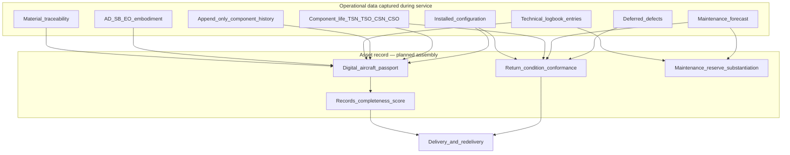
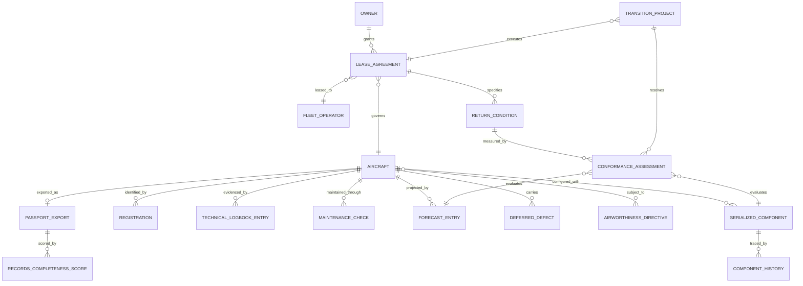
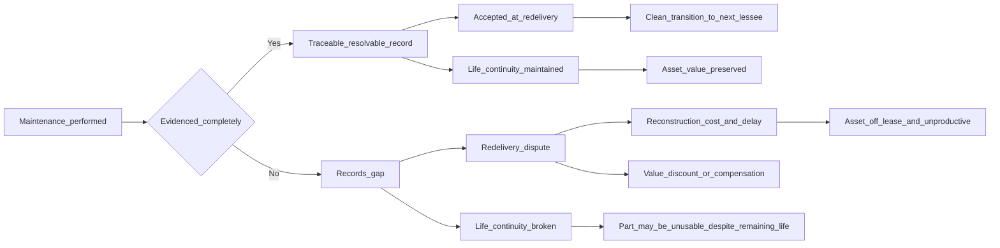
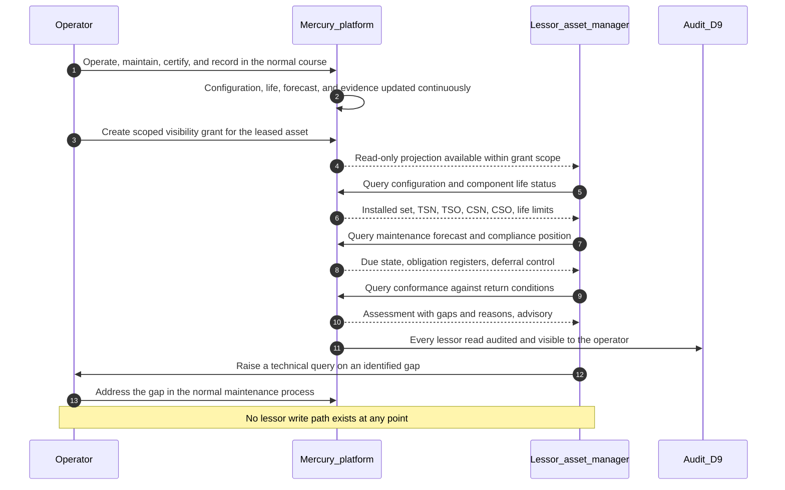
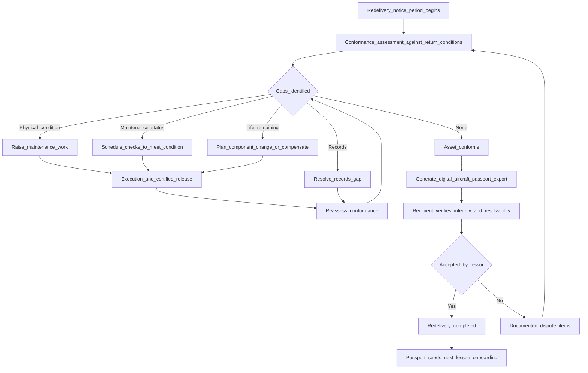

# Leasing Domain — Lessors, Asset Owners and Financiers

| Field | Value |
|-------|-------|
| Document | Leasing Business Domain |
| Product | Mercury Aviation Enterprise Operating System (AEOS) |
| Organization | Mercury Technologies |
| Layer | Business domain (stakeholder capability, entity, and integration view) |
| Audience | Asset managers, technical asset managers, lease transition teams, operator technical records, domain consultants |
| Status | Living baseline |
| Companion documents | [OEM](OEM.md) · [Airline](Airline.md) · [MRO](MRO.md) · [CAMO](CAMO.md) · [Authority](Authority.md) |
| Upstream authority | [Domain Architecture](../02_Architecture/Domain_Architecture.md) · [Blueprint README](../../README.md) |

---

## 1. Purpose

### 1.1 What this domain exists to do

More than half the world's commercial fleet is leased. For the party that owns the asset, the aircraft is not primarily an operational object — it is a **capital asset whose value is determined almost entirely by the quality and completeness of its technical records**.

That creates a structural problem the industry has never solved well. The lessor owns the asset but does not operate it. The operator holds the records but has no commercial incentive to maintain them to a transaction standard. Records are typically assembled at redelivery, under time pressure, from systems that were never designed to produce them. Disputes over records completeness routinely cost more than the physical condition items they accompany, and a records gap can strand an aircraft for months.

Mercury's purpose in this domain is to make **asset condition and records completeness a continuously observable state** rather than a redelivery-time discovery. If the Digital Thread is complete during operation, redelivery becomes an export rather than a reconstruction.

### 1.2 What the lessor actually needs to know

| Question | Where the answer lives in Mercury | Standing |
|----------|----------------------------------|----------|
| What is installed on my asset right now? | Aircraft configuration from serialized components | Implemented |
| How much life remains on the life-limited parts? | TSN, TSO, CSN, CSO and life limits on components | Implemented |
| What maintenance is due and when? | Forecast and due list from the programme and utilization | Implemented |
| Has the aircraft been maintained to its approved programme? | Programme revisions, check closure, release evidence | Implemented |
| Are the AD and SB obligations discharged? | AD, SB, and EO registers with embodiment evidence | Partial — records exist, structured compliance state planned |
| What defects are being carried, and under what control? | Deferred defects with category, expiry, controlling reference | Implemented |
| Is the records set complete and resolvable? | Certification chain, logbook, component history, movement ledger | Implemented |
| How does the current state compare to the return conditions? | — | **Planned** — return condition modelling |
| Can I see this without asking the operator? | — | **Planned** — scoped lessor visibility |

The pattern is deliberate and honest: Mercury already holds the substance the lessor needs. What is not yet built is the **scoped, cross-organization access** and the **return-condition comparison** that turn that substance into a lessor-facing product.

### 1.3 Scope and boundary

This domain covers operating lessors, finance lessors, banks and asset-backed security vehicles, aircraft trading companies, and technical asset managers acting on their behalf. It also covers the operator's own lease administration function, which carries the mirror-image obligation.

Mercury does **not** perform asset valuation, does not model lease accounting, and does not produce appraisals. It provides the technical condition record on which those activities depend. Commercial lease terms — rent, security deposits, maintenance reserves, end-of-lease compensation — are contract matters that Mercury may reference but does not adjudicate.

---

## 2. Business capabilities

### 2.1 Capability register

| # | Capability | What it means operationally | Standing |
|---|-----------|-----------------------------|----------|
| LEA-C1 | **Aircraft identity and registration history** | Airframe identity across registration changes, including re-registration on transfer | Implemented |
| LEA-C2 | **Configuration record** | The installed set of serialized components at positions, current and historical | Implemented |
| LEA-C3 | **Component life status** | TSN, TSO, CSN, CSO and life limits per component | Implemented |
| LEA-C4 | **Component history** | Append-only install, remove, transfer, and maintenance release events following the component | Implemented |
| LEA-C5 | **Maintenance forecast** | Due state across 30, 90, 180, and 365-day windows — the basis of half-life and condition assessment | Implemented |
| LEA-C6 | **Programme compliance evidence** | Programme revisions, check closure, and release records | Implemented |
| LEA-C7 | **AD, SB, and EO registers** | The obligation set and its embodiment status | Implemented |
| LEA-C8 | **Deferred defect visibility** | Open carried defects with category, expiry, and control | Implemented |
| LEA-C9 | **Certification and release evidence** | The full signer chain and publication revision per release | Implemented |
| LEA-C10 | **Material traceability** | Append-only movement ledger with lot, batch, and serial identity, and receiving inspection records | Implemented |
| LEA-C11 | **Lease and ownership as first-class fleet records** | Owner, lessor, lessee, lease term, and asset attribution on the aircraft record | Planned |
| LEA-C12 | **Return condition modelling** | Structured return conditions with continuous conformance comparison | Planned |
| LEA-C13 | **Lessor visibility portal** | Scoped, read-only, audited access to the asset's technical state without operational rights | Planned |
| LEA-C14 | **Digital aircraft passport export** | A portable, resolvable, verifiable asset record for transition or transaction | Planned |
| LEA-C15 | **Records completeness scoring** | Continuous measurement of gaps against a transaction standard | Planned |
| LEA-C16 | **Maintenance reserve support** | Utilization and event data supporting reserve calculation and claim substantiation | Planned |
| LEA-C17 | **Transition project management** | Structured delivery and redelivery workflow with condition items and evidence | Planned |
| LEA-C18 | **Back-to-birth trace assembly** | Assembled traceability for life-limited parts across owners and operators | Planned |

### 2.2 From operational thread to asset record

The important structural claim: nothing in the asset layer requires data that operations does not already produce. The planned capabilities are **assembly and scoped exposure**, not new data capture. That is why they are tractable.

---

## 3. Major entities

### 3.1 Entity register

| Entity | Owning Mercury domain | Description | Standing |
|--------|----------------------|-------------|----------|
| **Aircraft** | D2 Fleet | The asset itself: serial, model, status | Implemented |
| **Registration** | D2 Fleet | Registration mark history across transfers | Implemented |
| **Fleet operator** | D2 Fleet | The party operating the asset | Implemented |
| **Serialized component** | D3 Components | Installed items with life status | Implemented |
| **Component installation history** | D3 Components, append-only | The event record following the component | Implemented |
| **Aircraft configuration** | D3 Components, derived | The installed set at positions | Implemented |
| **Maintenance programme and revisions** | D7 Planning | The approved standard the asset was maintained to | Implemented |
| **Maintenance check** | D7 Planning | Scheduled events and their closure | Implemented |
| **Forecast entry** | D7 Planning, derived | Remaining margin to the next event | Implemented |
| **Airworthiness Directive / Service Bulletin / Engineering Order** | D7 Planning | The obligation set and its embodiment | Implemented |
| **Deferred defect** | D7 Planning | Carried defects with control and expiry | Implemented |
| **Technical logbook entry** | D6 Execution, append-only | Release evidence per event | Implemented |
| **Certification event and signature** | D6 / D5, append-only | Who certified what, under which authority | Implemented |
| **Stock movement and receipt** | D8 Logistics, append-only | Material provenance and receiving inspection | Implemented |
| **Rotable cycle** | D8 Logistics | Repair loop for a removed rotable | Implemented |
| **Lease agreement** | — | Lessor, lessee, term, and the asset it governs | Planned |
| **Ownership record** | — | Legal owner, distinct from operator | Planned |
| **Return condition** | — | A structured, measurable redelivery requirement | Planned |
| **Conformance assessment** | — | Current state measured against a return condition | Planned |
| **Records completeness score** | — | Gap measurement against a transaction standard | Planned |
| **Passport export** | — | A portable, resolvable, verifiable asset record | Planned |
| **Transition project** | — | Delivery or redelivery workflow with condition items | Planned |
| **Maintenance reserve event** | — | A reserve-relevant event with substantiating evidence | Planned |

### 3.2 Entity relationship view

---

## 4. Relationships

### 4.1 To Mercury bounded contexts

| Mercury domain | Direction | What crosses the boundary |
|----------------|-----------|---------------------------|
| D2 Fleet | Consumes; extension planned | Aircraft identity and registration history. Lease and ownership as first-class records is a named gap in [Domain Architecture §11](../02_Architecture/Domain_Architecture.md#11-future-enhancements). |
| D3 Components | Consumes | Configuration, life status, and append-only history — the core of asset value |
| D6 Execution | Consumes | Release evidence, certification chains, logbook entries |
| D7 Planning | Consumes | Programme compliance, forecast, obligations, deferrals |
| D8 Logistics | Consumes | Material provenance, receiving inspection, rotable cycles |
| D9 Quality and Audit | Consumes | The audit trail underpinning records credibility |
| D1 Organization | Consumes; extension planned | Tenancy. Cross-organization sharing is the prerequisite for lessor visibility. |

The leasing domain is almost entirely a **read domain**. It creates very little new operational data; its value comes from assembling, scoring, and scoping what the other domains already produce. That is a deliberate architectural position — a lessor capability that required operators to capture extra data would not be adopted.

### 4.2 To other stakeholder domains

| Counterparty | Nature of the relationship | Mercury's mediation |
|--------------|---------------------------|---------------------|
| [Airline](Airline.md) | Operates the asset and holds the records obligation under the lease | Shared aircraft records; scoped lessor visibility planned |
| [CAMO](CAMO.md) | Determines and evidences continuing airworthiness — the asset's technical credibility | Programme, forecast, and compliance state |
| [MRO](MRO.md) | Performs the work whose quality and traceability determine records value | Certification chain and component history |
| [OEM](OEM.md) | Defines the build standard and modification baseline against which condition is measured | Model, catalogue, and SB records |
| [Authority](Authority.md) | Its oversight standard sets the floor for what "complete records" means | The same evidence set, scoped differently |

### 4.3 Why records quality is asset value

The bottom-right path is the one that costs the most and is least understood outside the leasing community: a life-limited part with genuine remaining life but a broken back-to-birth trace may be commercially worthless. Mercury's append-only component history exists precisely to prevent that break.

### 4.4 Ecosystem roles in an asset transaction

A delivery, redelivery, or sale draws on functions that never appear on an aircraft's technical record but decide whether the transaction closes.

| Ecosystem role | What it needs from the asset record | Mercury capability that serves it | Standing |
|----------------|-------------------------------------|---------------------------------|----------|
| **Finance** | Book value, maintenance reserve substantiation, the cost of a records gap, end-of-lease compensation position | Component life and remaining-life columns, forecast, compliance state; reserve substantiation depends on cost data | **Partial** — the technical basis exists; maintenance reserve substantiation and cost attribution are planned. Labour cost is not on the thread |
| **Executive and portfolio management** | Condition and risk across a portfolio of assets held by different operators | Passport assembly per aircraft | **Partial for one aircraft, absent across a portfolio.** A portfolio view spans organizations and therefore depends entirely on the cross-organization sharing construct |
| **Engine shop** | Whether life-limited part life and module history are continuous and provable across every shop visit | Serialized component life, installation history, rotable cycle | **Partial** — the largest single risk to realizable engine value, because shop-visit life continuity is a named gap. See [MRO §4.4](MRO.md#44-shops-stores-and-the-supplier-ecosystem) |
| **Component shop** | Certification and trace on every repaired unit returned to the asset | Component history with maintenance-release events; certificates as attachments | **Partial** — the originating reference on a maintenance-release history event is free text, which weakens exactly the edge a records auditor examines. See [Digital Thread §5.4](../04_Data/Digital_Thread.md#54-weak-edges-and-what-they-cost) |
| **Warehouses and stores** | Which parts fitted to the asset came from where, in what condition, under whose inspection | Stock ledger, receipts, receiving inspection, putaway | **Partial** — provenance depends on a process-carried serial match at the stock-to-component handover |
| **Suppliers and distributors** | Certification paperwork adequate for a records audit years later | Vendor master, purchase order to receipt chain, attachments | **Partial** — trace is assembled rather than structured; certificates are attachments |
| **Quality and records** | Whether the records set is complete enough to hand over without dispute | Audit trail, certification chains, logbook, publication revisions | Implemented as retrievable evidence; completeness **scoring** is planned, which is why gaps are still found late |
| **Technical services and asset management** | Return-condition conformance measured continuously rather than at redelivery | Configuration, life, compliance, and evidence read across domains | **Planned** — return condition modelling and continuous conformance |

Two of those rows carry the domain's real message. **Every gap in the right-hand column is a gap in an operator's operational data, not in a lessor feature.** A lessor cannot be served by a lessor module bolted on at transaction time; it is served by the operator having captured the thread correctly for years beforehand. And **every one of these roles sits outside the operator's tenancy**, which is why the cross-organization sharing construct is the prerequisite named in every roadmap row in §8 rather than a convenience.

---

## 5. APIs

### 5.1 Reading this section

**Current** endpoints exist in the runtime today and serve asset-condition needs through the operator's own tenancy. **Planned** endpoints are blueprint intent. No lessor-facing external access exists in the current runtime. See [ROADMAP §1](../../ROADMAP.md#1-purpose-and-objectives).

### 5.2 Current endpoints serving asset-condition needs

| Area | Method and path | Purpose |
|------|-----------------|---------|
| Asset identity | `GET /api/v1/fleet/aircraft/{aircraft_id}` | Airframe identity, model, status |
| Asset identity | `GET /api/v1/fleet/registrations` | Registration history across transfers |
| Asset identity | `GET /api/v1/fleet/operators` · `GET /api/v1/fleet/fleets` | Operating attribution |
| Configuration | `GET /api/v1/components/aircraft/{aircraft_id}/configuration` | The installed set at positions |
| Configuration | `GET /api/v1/components/serialized` | Component inventory with life status |
| Configuration | `GET /api/v1/components/serialized/{component_id}` | Single component detail |
| Life | `GET /api/v1/components/serialized/{component_id}/history` | Append-only life and event history |
| Life | `GET /api/v1/components/history` | Cross-fleet history query |
| Airworthiness | `GET /api/v1/planning/forecast` · `GET /api/v1/planning/due-list` | Remaining margin to the next events |
| Airworthiness | `GET /api/v1/planning/checks` | Scheduled events and closure state |
| Airworthiness | `GET /api/v1/planning/programs/{program_id}/revisions` | The approved standard in force over time |
| Airworthiness | `GET /api/v1/planning/ads` · `/service-bulletins` · `/engineering-orders` | Obligation registers and embodiment |
| Airworthiness | `GET /api/v1/planning/deferred-defects` | Open carried defects with control and expiry |
| Evidence | `GET /api/v1/maintenance/logbook` | Release evidence per event |
| Evidence | `GET /api/v1/maintenance/tasks/{task_id}/audit-trail` | Full certification and audit history |
| Evidence | `GET /api/v1/publications/{publication_id}/revisions` | The content that governed the work |
| Provenance | `GET /api/v1/logistics/stock/movements` | Material movement ledger with lot, batch, serial |
| Provenance | `GET /api/v1/logistics/receipts` | Receiving inspection and acceptance |
| Provenance | `GET /api/v1/logistics/rotable-cycles` | Repair loops for removed rotables |

### 5.3 Planned endpoints

| Area | Method and path | Purpose | Depends on |
|------|-----------------|---------|-----------|
| Lease records | `GET`/`POST /api/v1/fleet/aircraft/{aircraft_id}/lease` | Lessor, lessee, owner, term as first-class records | LEA-C11 |
| Lease records | `GET`/`POST /api/v1/leasing/agreements` | Lease agreement register | LEA-C11 |
| Return conditions | `GET`/`POST /api/v1/leasing/agreements/{agreement_id}/return-conditions` | Structured, measurable redelivery requirements | LEA-C12 |
| Conformance | `GET /api/v1/leasing/agreements/{agreement_id}/conformance` | Continuous comparison of current state against return conditions | LEA-C12 |
| Passport | `GET /api/v1/fleet/aircraft/{aircraft_id}/passport` | Assembled digital aircraft passport read model | LEA-C14, cross-context read model |
| Passport | `POST /api/v1/fleet/aircraft/{aircraft_id}/passport/export` | Portable, resolvable, verifiable export for a transaction | LEA-C14 |
| Completeness | `GET /api/v1/fleet/aircraft/{aircraft_id}/records-completeness` | Gap score against a transaction standard | LEA-C15 |
| Visibility | `POST /api/v1/leasing/visibility-grants` · `DELETE /{grant_id}` | Scoped, revocable, audited lessor read access | LEA-C13, cross-organization sharing construct |
| Reserves | `GET /api/v1/leasing/reserve-events` | Reserve-relevant events with substantiating evidence | LEA-C16 |
| Transition | `GET`/`POST /api/v1/leasing/transitions` | Delivery and redelivery projects with condition items | LEA-C17 |
| Traceability | `GET /api/v1/components/serialized/{component_id}/back-to-birth` | Assembled traceability across owners and operators | LEA-C18 |

### 5.4 Contract principles

- **Lessor access is read-only, permanently.** No planned leasing endpoint will confer the ability to create, approve, sign, release, defer, or modify anything in the operator's tenancy. The lessor observes the asset; the operator operates it.
- **Every lessor read is audited and visible to the operator.** Transparency runs both ways. An operator can always see what the lessor looked at and when.
- **Passport exports must be resolvable and verifiable.** An export containing a release record without the revision it cites, or a component without its history, is not an asset record. Exports carry integrity information so a recipient can verify they have not been altered.
- **Conformance assessments are advisory.** A comparison against a return condition is an engineering and commercial input, not an acceptance. Acceptance is a contractual act between the parties.
- **Lease and ownership do not affect operational authorization.** Adding a lessor to the model must not create a path by which a non-operator influences a certification, a release, or a dispatch decision.

---

## 6. Security

### 6.1 Persona access

| Persona | Typical leasing-domain activity | Key permissions |
|---------|-------------------------------|-----------------|
| `engineering` | Assesses configuration and modification status against the build standard | `engineering.read`, `configuration.read`, `component.read`, `fleet.read` |
| `qa` | Verifies records completeness and evidence resolvability | `qa.read`, `audit.read`, `logbook.read`, `publication.read` |
| `planner` | Manages the maintenance position against return conditions | `planning.read`, `planning.manage`, `fleet.read` |
| `manager` | Owns the commercial and asset position | `fleet.read`, `planning.read`, `logistics.finance` |
| `reliability` | Assesses asset technical performance history | `qa.read`, `component.read`, `maintenance.read` |
| Lessor technical asset manager (planned) | Read-scoped observation of asset condition under an explicit grant | Read-only projection; no write permission of any kind |

Persona-to-role mapping and permission semantics: [RBAC](../06_Security/RBAC.md).

### 6.2 Cross-organization visibility is the hard problem

A lessor is not a member of the operator's organization and must never become one. Granting a lessor a membership would give it a session role, an effective permission set, and a path into operational data it has no business seeing — crew names, station costs, other lessors' assets on the same fleet.

The planned visibility construct is therefore built on the same constraints as [Authority §6.3](Authority.md#63-organization-isolation-under-oversight):

| Constraint | Why |
|-----------|-----|
| **Explicit, per-asset grant** | Visibility attaches to the aircraft the lessor owns, not to the operator's tenancy |
| **Read-only, enforced structurally** | Not a permission setting that could be widened by misconfiguration |
| **Scoped to asset-relevant evidence classes** | Configuration, life, compliance, release evidence — not commercial, personnel, or unrelated fleet data |
| **Time-boxed and revocable immediately** | Revocation effective on the next request |
| **Audited on both sides** | The operator sees every lessor access; the lessor has a record of what it was shown |
| **No operational surface** | No certification, release, deferral, status, or stock capability under any circumstance |
| **Personnel data minimized** | A lessor needs to know a release was properly certified, not the certifier's personal identity. Signer identity is disclosed only where the records standard requires it. |

### 6.3 What a lessor must not see

Explicitly out of scope for lessor visibility, by design:

- Other operators' or other lessors' aircraft on the same fleet or in the same organization.
- Commercial data: vendor pricing, purchase orders, labour rates, contract terms.
- Personnel records beyond what release evidence requires.
- Operational data unrelated to the asset: crew rostering, station staffing, unrelated defect history.
- Any write path whatsoever.

### 6.4 Export integrity

A passport export leaves Mercury's boundary and will be read by parties with no access to the platform. It therefore carries its own integrity properties: content hashing so alteration is detectable, resolvable internal references so a recipient can follow a release to its revision, and explicit statements of what is included and what is not. An export that quietly omits a category of evidence is worse than no export, because it creates false confidence.

### 6.5 Audit

Audit-critical transitions in this domain, once built:

| Transition | Why it matters |
|------------|----------------|
| Visibility grant creation and revocation | Establishes exactly what a lessor could see and when |
| Every read under a grant | Protects both parties in a records dispute |
| Passport export | The export is a commercial artefact; its generation is a recorded act |
| Conformance assessment | The technical position at a point in the transition |
| Return condition change | Return conditions are contractual; changes must be attributable |

Audit semantics and retention: [Audit](../06_Security/Audit.md).

---

## 7. Workflows

### 7.1 Continuous asset condition monitoring — planned

### 7.2 Redelivery from continuous state — planned

The final arrow is where the compounding value sits. A passport export that seeds the next operator's records — rather than being re-keyed — is how the industry's records problem is actually solved, one transition at a time.

### 7.3 Component life continuity across ownership

```mermaid
flowchart LR
    Birth["Component_manufactured"] --> Receive["Received_with_certificate_and_inspection"]
    Receive --> Install1["Installed_on_aircraft_A"]
    Install1 --> Accrue1["Life_accrues_TSN_CSN"]
    Accrue1 --> Remove1["Removed_with_recorded_reason"]
    Remove1 --> Shop["Rotable_cycle_opened_and_repaired"]
    Shop --> Return["Returned_to_stock_serviceable"]
    Return --> Install2["Installed_on_aircraft_B"]
    Install2 --> Accrue2["Life_continues_accruing"]
    Accrue2 --> Transfer["Asset_transferred_to_new_owner"]
    Transfer --> Export["History_exported_with_passport"]
    Export --> Continuity["Back_to_birth_trace_intact"]
    Continuity --> Usable["Remaining_life_commercially_realizable"]
    Gap["Any_undocumented_event"] -.->|"breaks_the_chain"| Broken["Trace_broken"]
    Broken -.-> Unusable["Remaining_life_not_realizable"]
```

Mercury's append-only installation history exists to make the lower path structurally impossible within the platform's boundary. Every install, remove, transfer, and maintenance release appends an entry; history is never rewritten, and it follows the component rather than the aircraft.

---

## 8. Future roadmap

| Horizon | Item | Value delivered | Dependency |
|---------|------|-----------------|-----------|
| Near term | Lease and ownership as first-class fleet records | Correct asset attribution, distinct from operating attribution | Fleet model extension, [Domain Architecture §11](../02_Architecture/Domain_Architecture.md#11-future-enhancements) item 13 |
| Near term | Evidence pack export per aircraft | The first practical step toward a passport export | [ROADMAP §4](../../ROADMAP.md#4-near-term-horizon--assurance-and-hardening-additive) item 8 |
| Near term | Object storage for certificates and attachments | Certificates of conformity and release documents become durable and verifiable | [ROADMAP §4](../../ROADMAP.md#4-near-term-horizon--assurance-and-hardening-additive) item 6 |
| Mid term | Digital aircraft passport read model | One authoritative projection of identity, configuration, life, and evidence | Cross-context read model, [Domain Architecture §11](../02_Architecture/Domain_Architecture.md#11-future-enhancements) item 1 |
| Mid term | Cross-organization data-sharing construct | The prerequisite for any external visibility; explicit, scoped, revocable, audited | [Domain Architecture §11](../02_Architecture/Domain_Architecture.md#11-future-enhancements) item 16 |
| Mid term | Lessor and asset-owner visibility | Scoped read access to asset condition without granting tenancy | [ROADMAP §5](../../ROADMAP.md#5-mid-term-horizon--ecosystem-expansion) |
| Mid term | Return condition modelling and continuous conformance | Redelivery surprises replaced by a monitored position | Structured condition model |
| Mid term | Records completeness scoring | Gaps found during operation, when they are cheap to fix | Passport read model |
| Mid term | Full assembly hierarchy with next-higher-assembly rollup | Accurate life tracking on nested components | Component model extension |
| Long term | Passport export with verifiable integrity | A portable asset record a counterparty can trust without platform access | Export contract and integrity design |
| Long term | Back-to-birth trace assembly across owners | Preserves realizable life value on life-limited parts | Cross-organization provenance |
| Long term | Maintenance reserve substantiation | Reserve claims supported by evidence rather than assertion | Finance capability expansion |
| Long term | Transition project management | Delivery and redelivery as a structured, evidenced workflow | Return condition maturity |

Horizon definitions and sequencing authority: [ROADMAP](../../ROADMAP.md).

---

## 9. Related documents

**Business domains**
[OEM](OEM.md) · [Airline](Airline.md) · [MRO](MRO.md) · [CAMO](CAMO.md) · [Authority](Authority.md)

**Architecture**
[Domain Architecture](../02_Architecture/Domain_Architecture.md) · [Enterprise Architecture](../02_Architecture/Enterprise_Architecture.md) · [System Context](../02_Architecture/System_Context.md) · [Technical Architecture](../02_Architecture/Technical_Architecture.md)

**Data**
[Digital Thread](../04_Data/Digital_Thread.md) · [Data Model](../04_Data/Data_Model.md) · [Master Data](../04_Data/Master_Data.md)

**Security**
[Security documentation set](../06_Security/) · [RBAC](../06_Security/RBAC.md) · [Identity](../06_Security/Identity.md) · [Audit](../06_Security/Audit.md) · [Digital Signatures](../06_Security/Digital_Signatures.md)

**Intelligence — advisory only, never a condition or value determination**
[AI documentation set](../07_AI/) · [AI Strategy](../07_AI/AI_Strategy.md) · [Digital Twin](../07_AI/Digital_Twin.md) · [Knowledge Graph](../04_Data/Knowledge_Graph.md)

**Regulation — descriptive mapping, not a claim of approval**
[Regulations documentation set](../09_Regulations/) · [FAA](../09_Regulations/FAA.md) · [Transport Canada](../09_Regulations/Transport_Canada.md)

**Repository root**
[README](../../README.md) · [VISION](../../VISION.md) · [ROADMAP](../../ROADMAP.md)

---

*Mercury Technologies — One Digital Thread. One Digital Aircraft Passport. One Aviation Enterprise Operating System.*
