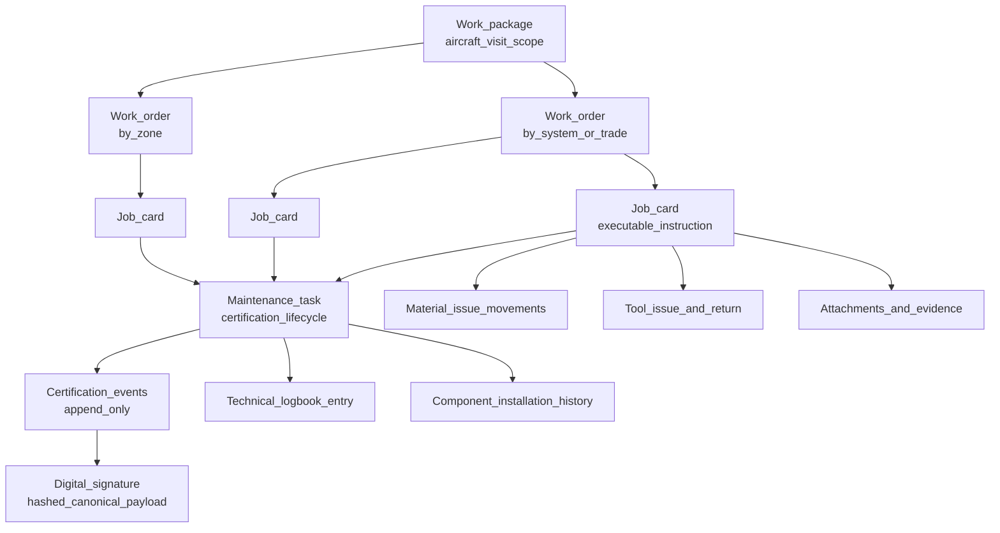
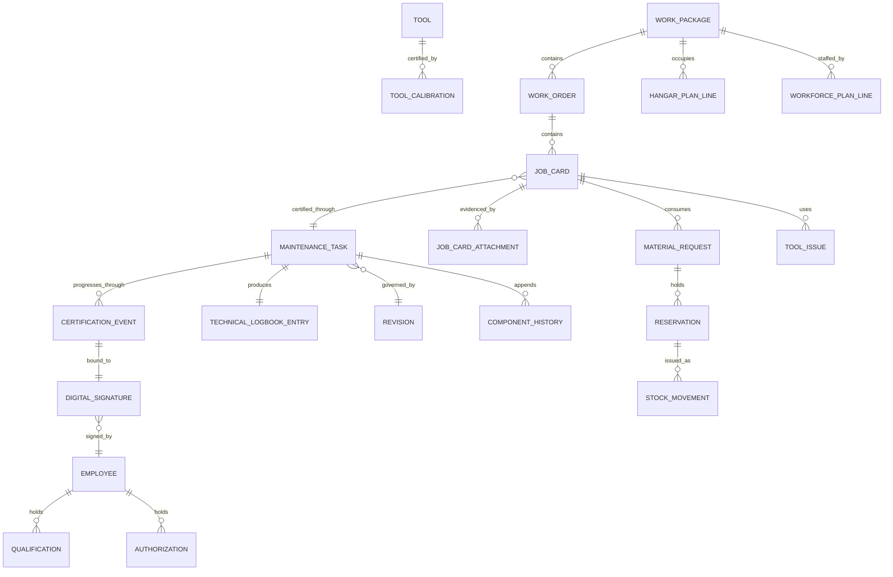
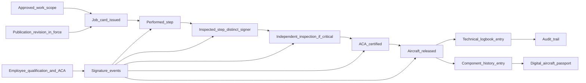
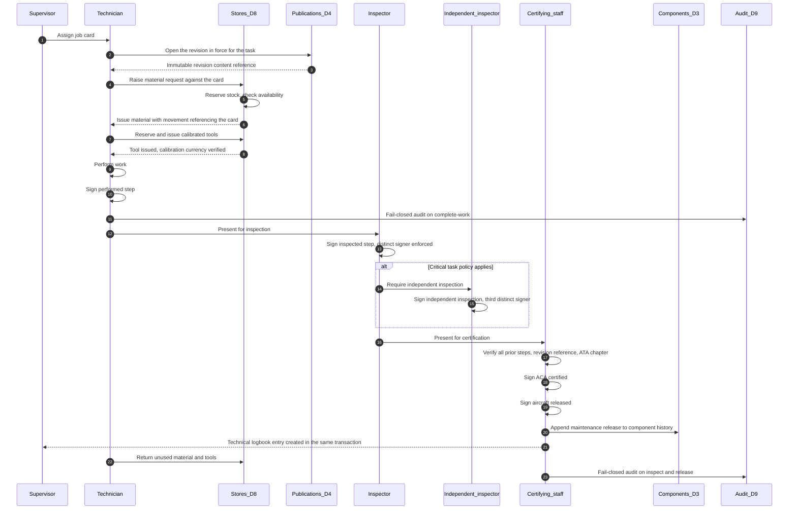
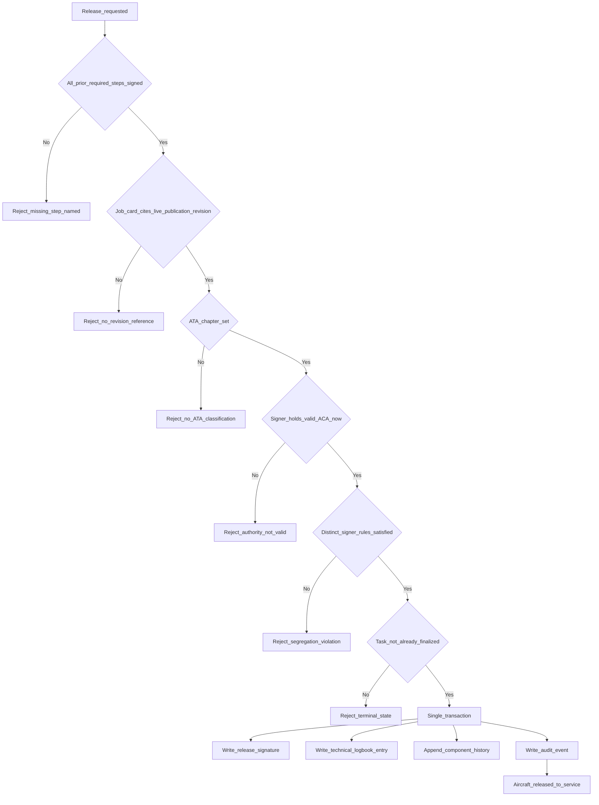

# MRO Domain — Maintenance, Repair and Overhaul Organizations

| Field | Value |
|-------|-------|
| Document | MRO Business Domain |
| Product | Mercury Aviation Enterprise Operating System (AEOS) |
| Organization | Mercury Technologies |
| Layer | Business domain (stakeholder capability, entity, and integration view) |
| Audience | MRO production management, hangar supervision, quality assurance, certifying staff, stores and tooling management, domain consultants |
| Status | Living baseline |
| Companion documents | [OEM](OEM.md) · [Airline](Airline.md) · [CAMO](CAMO.md) · [Authority](Authority.md) · [Leasing](Leasing.md) |
| Upstream authority | [Domain Architecture](../02_Architecture/Domain_Architecture.md) · [Blueprint README](../../README.md) |

---

## 1. Purpose

### 1.1 What this domain exists to do

The MRO domain is where Mercury turns an approved plan into **certified, evidenced work**. It is the most safety-critical domain in the platform and the one with the least tolerance for approximation.

Its purpose is to guarantee four things simultaneously, on every job card, without exception:

1. **The right work was done** — against the correct task, on the correct aircraft or component, at the correct position.
2. **The right person did it** — qualified, authorized, active, and bound to an authenticated identity.
3. **The right information governed it** — a specific, immutable publication revision, cited on the card and written into the logbook.
4. **The evidence survives** — an append-only certification chain that can be produced years later without forensic reconstruction.

A maintenance organization that can produce three of those four has an audit finding waiting to happen. Mercury's design position is that all four are enforced in the domain service layer, server-side, and cannot be bypassed by a client, a role grant, or a production deadline.

### 1.2 The shop-floor reality being modelled

| Hangar reality | Where systems typically fail | Mercury's position |
|----------------|------------------------------|--------------------|
| Work arrives as a package, is split by trade, and is executed card by card | Systems model the package but not the card, so nobody knows what a technician is actually holding | Work package, work order, and job card are distinct aggregates with status rollup |
| A card is signed by a mechanic, then an inspector, sometimes a second inspector | Segregation is a paper convention enforced by the supervisor's memory | Distinct-signer rules are domain invariants checked against prior certification events |
| The manual revision changes mid-check | The card cites "AMM" with no revision, and the auditor cannot reconstruct what was in force | Release is blocked unless the card references an immutable revision |
| Parts are drawn from stores against the card | Issue is recorded in a stores system with no link to the work | Every issue movement carries the job card or package reference |
| Tools are borrowed and calibration lapses unnoticed | Calibration is a certificate in a folder | Tool reservation checks calibration currency; lost tools are reported as records |
| The aircraft is released and the logbook is written afterwards | A window exists in which a release has no record | Release and logbook entry are written in one transaction |

### 1.3 Scope of the domain

This domain covers **base and heavy maintenance in the hangar**, **line maintenance execution** where the operator performs it, **component and engine shop work** on rotables, and the **stores and tooling functions** that support all three. It does not own the decision that the work is required — that is [CAMO](CAMO.md) — nor the operational context that produced the defect, which is [Airline](Airline.md).

---

## 2. Business capabilities

### 2.1 Capability register

| # | Capability | What it means operationally | Standing |
|---|-----------|-----------------------------|----------|
| MRO-C1 | **Work package management** | The planned bundle of work for an aircraft visit, with status rollup from its children | Implemented |
| MRO-C2 | **Work order structuring** | Grouping of job cards by system, trade, or zone within a package | Implemented |
| MRO-C3 | **Job card execution** | The executable shop-floor unit: assign, transition, complete work, inspect, release | Implemented |
| MRO-C4 | **Maintenance task engine** | The certifiable task carrying the certification chain and producing the logbook entry | Implemented |
| MRO-C5 | **Certification chain** | Performed, inspected, independent inspection, ACA certified, aircraft released — enforced in order | Implemented |
| MRO-C6 | **Segregation of duties** | Distinct-signer enforcement between performer, inspector, and independent inspector | Implemented |
| MRO-C7 | **Critical task policy** | Designation of tasks requiring independent inspection | Implemented |
| MRO-C8 | **Digital signatures** | Immutable signatures hashing a canonical payload, bound to employee, method, and target | Implemented |
| MRO-C9 | **Technical logbook** | Append-only release record with amendment rather than overwrite | Implemented |
| MRO-C10 | **Publication revision binding** | Release blocked unless the job card cites a live publication and matching revision | Implemented |
| MRO-C11 | **Component history write-back** | Maintenance release appended to the affected component's installation history | Implemented |
| MRO-C12 | **Job card attachments** | Photographs, certificates, and supporting evidence attached to the card | Implemented |
| MRO-C13 | **Role dashboards** | Purpose-built views for manager, planner, supervisor, technician, inspector, and ACA | Implemented |
| MRO-C14 | **Stores and material issue** | Warehouse hierarchy, stock ledger, FIFO and FEFO issue against the job card | Implemented |
| MRO-C15 | **Tool crib control** | Reservation, issue, return, calibration currency, and lost-tool reporting | Implemented |
| MRO-C16 | **Rotable and shop cycle** | Open and close a repair cycle for a removed rotable | Implemented |
| MRO-C17 | **Barcode and RFID scanning APIs** | Scan endpoints supporting shop-floor material and tool identification | Implemented |
| MRO-C18 | **Offline synchronization queue** | Queue structure for work performed without connectivity | Implemented (queue); client planned |
| MRO-C19 | **Execution reporting** | Production reports over packages, orders, and cards | Implemented |
| MRO-C20 | **Capacity and slot planning** | Hangar bay, dock, and workforce optimization against the visit schedule | Planned |
| MRO-C21 | **Labour time capture and costing** | Actual hours per card feeding cost rollup and customer invoicing | Planned |
| MRO-C22 | **Customer and contract management** | Third-party MRO customers, contracted scope, and commercial terms | Planned |
| MRO-C23 | **Native shop-floor client** | Purpose-built offline-capable device application consuming the scan and job card APIs | Planned |
| MRO-C24 | **Non-routine card generation** | Findings during a check raising controlled non-routine work with its own approval path | Planned |

### 2.2 Execution structure

---

## 3. Major entities

### 3.1 Entity register

| Entity | Owning Mercury domain | Description | Standing |
|--------|----------------------|-------------|----------|
| **Work package** | D6 Execution | The visit scope for an aircraft, with a package number and status rollup | Implemented |
| **Work order** | D6 Execution | A grouping of job cards within a package | Implemented |
| **Job card** | D6 Execution | The executable instruction issued to a technician | Implemented |
| **Job card attachment** | D6 Execution | Evidence attached to a card | Implemented |
| **Maintenance task** | D6 Execution | The certifiable unit carrying the certification workflow | Implemented |
| **Certification event** | D6 Execution, append-only | One completed step in the certification chain | Implemented |
| **Digital signature** | D5 Personnel, immutable | The recorded act of signing, hashed and bound | Implemented |
| **Technical logbook entry** | D6 Execution, append-only | The permanent release record | Implemented |
| **Critical task policy** | D6 Execution | The rule designating tasks requiring independent inspection | Implemented |
| **Fault code** | D6 Execution | Structured defect classification | Implemented |
| **Employee** | D5 Personnel | The person who can be assigned work and can sign | Implemented |
| **Qualification** | D5 Personnel | A recorded competence with validity dates | Implemented |
| **Authorization (ACA)** | D5 Personnel | Aircraft Certification Authority held by an individual | Implemented |
| **Warehouse and location** | D8 Logistics | The stores hierarchy supplying the hangar | Implemented |
| **Stock unit, balance, movement** | D8 Logistics | Physical material and its append-only ledger | Implemented |
| **Reservation** | D8 Logistics | A hold on stock for a specific work demand | Implemented |
| **Material request** | D8 Logistics | Demand raised against a package or card | Implemented |
| **Tool** | D8 Logistics | A controlled item with calibration and issue state | Implemented |
| **Tool calibration record** | D8 Logistics | Calibration currency evidence | Implemented |
| **Lost tool report** | D8 Logistics | Foreign object risk control record | Implemented |
| **Rotable cycle** | D8 Logistics | An open repair loop for a removed rotable | Implemented |
| **Hangar plan line** | D7 Planning | Bay and dock demand for a package | Implemented |
| **Workforce plan line** | D7 Planning | Trade and headcount demand for a package | Implemented |
| **Non-routine card** | — | Work arising from a finding during a check | Planned |
| **Labour time record** | — | Actual hours booked against a card | Planned |
| **MRO customer and contract** | — | Third-party customer and contracted scope | Planned |

### 3.2 Entity relationship view

---

## 4. Relationships

### 4.1 To Mercury bounded contexts

| Mercury domain | Direction | What crosses the boundary |
|----------------|-----------|---------------------------|
| D1 Organization | Upstream | Tenancy, hangar sites, departments, teams, memberships |
| D2 Fleet | Upstream | Aircraft identity, registration, model — every package targets an airframe |
| D3 Components | Bidirectional | Configuration read for the work; maintenance release history written back |
| D4 Publications | Upstream, conformist | The immutable revision that governs the card; a hard release precondition |
| D5 Personnel | Upstream | Employee identity, active status, qualification, ACA authority, signature creation |
| D6 Execution | Owned | Packages, orders, cards, tasks, certification events, logbook |
| D7 Planning | Upstream | Work packages generated from checks and MPD tasks |
| D8 Logistics | Upstream partnership | Material reservation and issue, tool reservation and issue |
| D9 Quality and Audit | Produces | Certification events, signatures, movements, and status transitions as evidence |
| D11 Finance | Downstream, planned | Labour and material cost events for rollup |

### 4.2 To other stakeholder domains

| Counterparty | Nature of the relationship | Mercury's mediation |
|--------------|---------------------------|---------------------|
| [CAMO](CAMO.md) | Supplies the approved work scope and accepts the completion evidence | Work packages arrive from planning; check closure and forecast recalculation return |
| [Airline](Airline.md) | Is the customer for base maintenance; owns the aircraft's operational reality | Shared aircraft and logbook records; status returns to service on release |
| [OEM](OEM.md) | Supplies the manual revision, the parts catalogue, and the SB being embodied | Publication revision binding and catalogue-resolved parts |
| [Authority](Authority.md) | Audits the organization's approval, its certifying staff, and its records | Certification chain and logbook are directly queryable evidence |
| [Leasing](Leasing.md) | Cares about the quality and traceability of work performed on a leased asset | Component history and release evidence form the asset record |
| Suppliers | Provide parts, repairs, and external services | Procurement chain from purchase request through receipt and putaway |

### 4.3 The evidence chain

Every node on that path is a persisted record. There is no step that exists only as a paper signature or an undocumented convention. That property is what makes the MRO domain's output usable as [Authority](Authority.md) evidence without preparation.

### 4.4 Shops, stores, and the supplier ecosystem

These are the ecosystem roles that surround hangar execution. Each is mapped to the capability that serves it and to the honest limit of that capability.

| Ecosystem role | What it does | Mercury capability it uses | Standing |
|----------------|-------------|---------------------------|----------|
| **Component shop** | Repairs, tests, and overhauls accessories and rotables removed from an aircraft | MRO-C16 rotable cycle; component installation history; stock condition states serviceable, unserviceable, quarantine; MRO-C15 tool control; certification chain on shop tasks | **Partial.** Opening and closing a repair cycle is implemented. A full shop visit — teardown findings, piece-part traceability, workscope agreement, and life continuity across the visit — is planned. See [Digital Thread §12 item 15](../04_Data/Digital_Thread.md#12-future-enhancements) |
| **Engine and APU shop** | Module-level workscope on engines and auxiliary power units, including life-limited part management | Serialized component life, install and remove at position, rotable cycle, SB and EO embodiment, MRO-C10 revision binding | **Partial.** There is no assembly hierarchy, so life-limited part life does not roll up to the engine as a next-higher assembly. This is the single largest modelling gap for engine work and is [Data Model §14 item 10](../04_Data/Data_Model.md#14-future-enhancements) |
| **Warehouse and stores** | Receives, inspects, stores, issues, and accepts return of material supporting the hangar | MRO-C14: warehouse and location hierarchy, append-only stock ledger, FIFO and FEFO issue policy, reservations against the card | Implemented |
| **Tool crib** | Controls calibrated and special tooling, and accounts for every tool leaving the crib | MRO-C15: reservation with calibration currency check, issue, return, calibration records, lost-tool reporting | Implemented |
| **Supplier and vendor** | Supplies parts, exchange units, and external repair services | Vendor master; purchase request, RFQ, quote, purchase order, shipment, receipt, putaway; receiving inspection | Implemented for goods. An external repair order lifecycle — send unit out, track at the vendor, receive with certification — is planned |
| **Distributor and broker** | Supplies parts sourced from the secondary market, where certification paperwork is the whole question | Vendor master with vendor type; receiving inspection; job card and part attachments | **Partial.** Certificates are captured as attachments rather than as a structured back-to-birth trace, which is why [Leasing](Leasing.md) treats provenance completeness as a measured risk |
| **Contracted labour provider** | Supplies technicians and inspectors working under the MRO's approval | Personnel employees, qualifications, authorizations, signer binding | Implemented — and deliberately strict: there is no guest signing path. See §6.4 |

### 4.5 Enterprise functions inside a maintenance organization

| Function | What it is accountable for | Mercury capability it consumes | Persona and key permissions | Standing |
|----------|---------------------------|-------------------------------|----------------------------|----------|
| **Engineering** | Repair schemes, workscope technical content, deviation and concession decisions, EO interpretation on the floor | Publications by aircraft and ATA, configuration read, Engineering Orders raised in planning | `engineering` — `engineering.read`, `configuration.read`, `publication.read` | Implemented |
| **Quality** | The organization's approval, procedures, certifying staff currency, internal audit, findings | Certification evidence, task audit trails, personnel authorizations, tool calibration currency, `qa` dashboards | `qa` — `qa.read`, `audit.read`, `logbook.read`, `certification.sign` | Implemented for evidence; audit programme and findings records are planned — see [Authority](Authority.md) |
| **Reliability** | Repeat findings, removal causes, and workscope feedback into the programme | Fault codes, component history, non-routine findings when MRO-C24 lands | `reliability` — `qa.read`, `component.read`, `maintenance.read` | **Partial** — capture implemented, analytics planned |
| **Production control and planning** | Visit sequencing, bay and dock allocation, trade loading, turn-time | MRO-C1, MRO-C2, hangar and workforce plan lines, MRO-C19 reporting | `planner`, `supervisor` — `planning.manage`, `work_order.manage` | Implemented for structure; capacity optimization is MRO-C20 |
| **Finance and commercial** | Quotation, contract scope, work-in-progress value, customer invoicing | Material cost through logistics; labour capture and package cost rollup planned | `manager` with `logistics.finance`, `logistics.purchase` | **Partial** — MRO-C21 and MRO-C22 |
| **HR and Training** | Trade qualification, licence currency, authorization scope, training records that gate assignment | Personnel qualifications and authorizations with validity intervals; workforce plan lines | Personnel steward roles per [RBAC](../06_Security/RBAC.md) | Implemented for the airworthiness-relevant subset only. Mercury is not an HR system and holds no payroll or absence data |
| **Executive** | Throughput, on-time performance, quality escape rate, commercial position | Execution dashboards and production reports | `manager` — `work_order.read`, `logistics.manage` | **Partial** — reporting exists; portfolio read models are planned |

The pattern across both tables is worth stating: **every one of these functions reads from the same execution and evidence records rather than from its own copy.** A quality manager, a reliability engineer, and a finance analyst looking at the same visit are looking at the same rows, differing only in permission scope. That is the operational meaning of one thread inside a single organization, before any cross-organization sharing exists.

---

## 5. APIs

### 5.1 Reading this section

**Current** endpoints exist in the runtime today. **Planned** endpoints are blueprint intent. See [ROADMAP §1](../../ROADMAP.md#1-purpose-and-objectives).

### 5.2 Current endpoints — execution

| Area | Method and path | Purpose |
|------|-----------------|---------|
| Packages | `GET /api/v1/work-orders/packages` | List work packages with filters |
| Packages | `POST /api/v1/work-orders/packages` | Create a work package |
| Packages | `GET /api/v1/work-orders/packages/{package_id}` | Package detail with rollup status |
| Orders | `GET /api/v1/work-orders/orders` · `POST /api/v1/work-orders/orders` | Work order structuring |
| Orders | `GET /api/v1/work-orders/orders/{order_id}` | Work order detail |
| Job cards | `GET /api/v1/work-orders/job-cards` | Shop-floor work queue with filters |
| Job cards | `POST /api/v1/work-orders/job-cards` | Create a job card |
| Job cards | `GET /api/v1/work-orders/job-cards/{job_card_id}` | Card detail |
| Job cards | `POST /api/v1/work-orders/job-cards/{job_card_id}/assign` | Assign to a technician |
| Job cards | `POST /api/v1/work-orders/job-cards/{job_card_id}/transition` | Validated status transition |
| Job cards | `POST /api/v1/work-orders/job-cards/{job_card_id}/complete-work` | Record work completion with fail-closed audit |
| Job cards | `POST /api/v1/work-orders/job-cards/{job_card_id}/inspect` | Approve, reject, rework, or independent inspection |
| Job cards | `POST /api/v1/work-orders/job-cards/{job_card_id}/release` | ACA release of the card |
| Job cards | `GET`/`POST /api/v1/work-orders/job-cards/{job_card_id}/attachments` | Evidence attachments |
| Production | `GET /api/v1/work-orders/dashboard` | Execution dashboard by role |
| Production | `GET /api/v1/work-orders/reports/{report}` | Production reporting |

### 5.3 Current endpoints — certification and evidence

| Area | Method and path | Purpose |
|------|-----------------|---------|
| Tasks | `GET /api/v1/maintenance/tasks` · `POST /api/v1/maintenance/tasks` | The certifiable task |
| Tasks | `GET /api/v1/maintenance/tasks/{task_id}` | Task detail with certification state |
| Tasks | `POST /api/v1/maintenance/tasks/{task_id}/transition` | Task lifecycle transition |
| Tasks | `POST /api/v1/maintenance/tasks/{task_id}/certify` | Sign a certification step |
| Tasks | `GET /api/v1/maintenance/tasks/{task_id}/audit-trail` | Full certification and audit history for a task |
| Logbook | `GET /api/v1/maintenance/logbook` | Technical logbook |
| Logbook | `POST /api/v1/maintenance/logbook/{entry_id}/amend` | Append-only amendment |
| Policy | `GET`/`POST /api/v1/maintenance/critical-policies` | Critical task designation |
| Signatures | `GET /api/v1/maintenance/signatures/{signature_id}` | Retrieve a signature record |
| Personnel | `GET /api/v1/personnel/employees` | Certifying and technical staff |
| Personnel | `GET`/`POST /api/v1/personnel/employees/{employee_id}/qualifications` | Competence records |
| Personnel | `GET`/`POST /api/v1/personnel/employees/{employee_id}/authorizations` | ACA and other authorities |
| Personnel | `POST /api/v1/personnel/employees/{employee_id}/stamps` | Certifying stamp record |
| Publications | `GET /api/v1/publications/by-aircraft/{aircraft_id}` | The manual set governing the work |
| Components | `POST /api/v1/components/serialized/{component_id}/install` | Install a component during the visit |
| Components | `POST /api/v1/components/serialized/{component_id}/remove` | Remove a component |
| Components | `GET /api/v1/components/serialized/{component_id}/history` | Component life and event history |

### 5.4 Current endpoints — stores and tooling

| Area | Method and path | Purpose |
|------|-----------------|---------|
| Stores | `GET /api/v1/logistics/warehouses` · `GET /api/v1/logistics/locations` | Stores hierarchy |
| Stores | `GET /api/v1/logistics/stock/balances` · `GET /api/v1/logistics/stock/units` | Availability and physical units |
| Stores | `GET /api/v1/logistics/stock/movements` | The append-only stock ledger |
| Stores | `POST /api/v1/logistics/stock/receive` · `/issue` · `/adjust` · `/scrap` | Stock transactions |
| Stores | `GET`/`POST /api/v1/logistics/reservations` | Reserve stock for a demand |
| Stores | `POST /api/v1/logistics/reservations/{reservation_id}/release` | Release a hold |
| Stores | `POST /api/v1/logistics/material-requests` | Raise material demand against work |
| Stores | `POST /api/v1/logistics/material-requests/{request_id}/approve` · `/reserve` · `/issue` · `/return` · `/cancel` | Material request lifecycle |
| Tools | `GET`/`POST /api/v1/logistics/tools` | Tool crib registry |
| Tools | `POST /api/v1/logistics/tools/{tool_id}/reserve` · `/issue` · `/return` | Tool control |
| Tools | `POST /api/v1/logistics/tools/{tool_id}/calibrate` · `GET /calibrations` | Calibration currency |
| Tools | `POST /api/v1/logistics/tools/{tool_id}/lost` · `GET /api/v1/logistics/lost-tool-reports` | Foreign object risk control |
| Tools | `GET /api/v1/logistics/tools/{tool_id}/history` | Tool custody history |
| Rotables | `POST /api/v1/logistics/rotable-cycles` · `/{cycle_id}/close` | Shop repair cycle |
| Shop floor | `POST /api/v1/logistics/scan` | Barcode and RFID identification |
| Planning bridge | `POST /api/v1/logistics/material-planning/run` · `/tool-planning/run` | Automatic demand planning for a package |
| Overview | `GET /api/v1/logistics/dashboard` · `GET /api/v1/logistics/shortages` | Stores position and constraints |

### 5.5 Planned endpoints

| Area | Method and path | Purpose | Depends on |
|------|-----------------|---------|-----------|
| Non-routine | `POST /api/v1/work-orders/job-cards/{job_card_id}/non-routine` | Raise controlled non-routine work from a finding | MRO-C24 |
| Labour | `POST /api/v1/work-orders/job-cards/{job_card_id}/time-entries` | Book actual hours against a card | MRO-C21 |
| Cost | `GET /api/v1/work-orders/packages/{package_id}/cost-summary` | Material plus labour plus external services rollup | MRO-C21, finance expansion |
| Capacity | `GET /api/v1/planning/hangar-capacity` · `POST /api/v1/planning/slot-optimize` | Bay, dock, and workforce optimization | MRO-C20 |
| Customers | `GET`/`POST /api/v1/mro/customers` · `/contracts` | Third-party customer and contracted scope | MRO-C22 |
| Offline | `POST /api/v1/work-orders/offline/sync` | Reconcile offline shop-floor activity with conflict resolution | MRO-C23 |
| Evidence | `GET /api/v1/work-orders/packages/{package_id}/evidence-pack` | Auditor-acceptable bundle with resolvable revision references | [ROADMAP §4](../../ROADMAP.md#4-near-term-horizon--assurance-and-hardening-additive) item 8 |

### 5.6 Contract principles

- **Certification endpoints are not idempotent by convenience.** A step may be signed once. A repeated call is rejected, not silently accepted.
- **Every issue movement carries its demand reference.** Material leaving stores without a job card or package reference is untraceable consumption and is rejected.
- **Release is the only endpoint that writes a logbook entry**, and it does so in the same transaction. There is no separate "create logbook entry" API, because that would permit a release without a record.
- **Rejection reasons are specific.** "Release rejected: independent inspection required by critical task policy and not yet signed" is actionable; a generic 400 is not.

---

## 6. Security

### 6.1 Persona access

| Persona | Typical MRO-domain activity | Key permissions |
|---------|---------------------------|-----------------|
| `technician` | Executes job cards, requests material, signs the performed step | `work_order.execute`, `task.manage`, `maintenance.manage`, `certification.sign`, `signature.create`, `publication.read`, `logistics.read` |
| `inspector` | Inspects completed work, approves, rejects, or calls rework; signs independent inspections | `inspector.approve`, `certification.sign`, `signature.create`, `work_order.execute`, `audit.read` |
| `aca` | Certifies and releases | `certification.release`, `certification.sign`, `signature.create`, `logbook.read` |
| `supervisor` | Manages the shop-floor queue and assignment | `work_order.manage`, `logistics.manage`, `logistics.stores`, `maintenance.read` |
| `store` | Receives, reserves, issues, and returns material and tools | `logistics.stores`, `logistics.tools`, `store.read`, `work_order.read` |
| `planner` | Structures packages and orders ahead of the visit | `planning.manage`, `work_order.manage`, `logistics.read` |
| `qa` | Reviews certification evidence and audit trails | `qa.read`, `audit.read`, `logbook.read`, `certification.sign` |
| `manager` | Reviews production and commercial position | `work_order.read`, `logistics.manage`, `logistics.purchase`, `logistics.finance` |

Persona-to-role mapping and permission semantics: [RBAC](../06_Security/RBAC.md).

### 6.2 Two independent authorization checks

This is the security property that most distinguishes the MRO domain, and it is deliberate:

| Check | Question answered | Where enforced |
|-------|-------------------|----------------|
| **Session authorization** | May this authenticated user call this endpoint at all? | Session role plus persona permissions at the API boundary |
| **Domain authority** | May this specific employee sign this specific step on this specific task, right now? | Personnel domain: employee record, active status, qualification validity, ACA authorization, signer binding to the authenticated user |

Both must pass. Collapsing them would allow a permission grant to silently confer certification authority, which is a safety failure rather than merely an access-control failure. A user with `certification.release` who is not a currently authorized ACA still cannot release.

### 6.3 Segregation of duties as a domain invariant

| Rule | Enforcement |
|------|-------------|
| The performer cannot be the inspector | Checked against prior certification events on the task |
| The independent inspector must differ from both the performer and the primary inspector | Checked against prior certification events on the task |
| Steps must be signed in the order the task configuration requires | Out-of-order steps rejected |
| A step may be signed only once | Duplicate signing rejected |
| A finalized or released task cannot be re-signed | Terminal state enforced |
| ACA authority must be valid at the moment of the ACA step | Evaluated at signing time, not at assignment time |

None of these can be waived by configuration, by an administrator role, or by production pressure. Waiving them would require code change and an ADR, which is exactly the friction that should exist.

### 6.4 Organization isolation

Every package, order, card, task, signature, logbook entry, stock unit, and tool is organization-scoped. Three cases deserve explicit attention:

- **An MRO serving multiple airline customers** holds each customer's aircraft under the arrangement its contract defines. Mercury does not permit implicit cross-organization visibility; a customer's fleet is either within the MRO's organization or reached through an explicit, audited sharing grant.
- **Multi-site MROs** use sites to scope hangars and stores. Site scoping filters the view; it does not create an isolation boundary.
- **Contract labour** signing under the MRO's approval must exist as an employee record in the MRO's organization with its own qualifications. There is no path to signing as a guest.

### 6.5 Audit and non-repudiation

Audit on `complete-work`, `inspect`, and `release` is **fail-closed**: if the audit write fails, the operation fails. This is a deliberate inversion of the platform's general availability-favouring stance, because a certification act without an audit record is worse than a certification act that did not happen.

Signatures hash a canonical payload of organization, target, step, employee, username, method, timestamp, and notes using SHA-256. The current scheme attests content and method. **Certificate-backed cryptographic non-repudiation is a named gap**, and PKI and smart-card signature adapters are a near-term roadmap item. Mercury states this plainly rather than implying a stronger guarantee than the runtime provides. See [Digital Signatures](../06_Security/Digital_Signatures.md).

---

## 7. Workflows

### 7.1 Job card execution and certification

### 7.2 Release precondition gate

### 7.3 Material and tool flow through the visit

```mermaid
flowchart LR
    Package["Work_package_generated"] --> MatPlan["Material_planning_run"]
    Package --> ToolPlan["Tool_planning_run"]
    MatPlan --> Reserve["Stock_reserved_per_plan_line"]
    MatPlan --> Short{"Shortage"}
    Short -->|"Yes"| PR["Purchase_request_raised"]
    PR --> RFQ["Request_for_quotation"]
    RFQ --> PO["Purchase_order"]
    PO --> Receive["Goods_receipt"]
    Receive --> Inspect["Receiving_inspection"]
    Inspect --> Putaway["Putaway_to_location"]
    Putaway --> Reserve
    ToolPlan --> ToolRes["Tool_reserved_with_calibration_check"]
    Reserve --> Issue["Issue_against_job_card"]
    ToolRes --> ToolIssue["Tool_issued_to_technician"]
    Issue --> Install["Component_installed_on_aircraft"]
    Install --> History["Component_history_entry"]
    ToolIssue --> Return["Tool_returned_and_accounted"]
    Return --> Lost{"Tool_unaccounted"}
    Lost -->|"Yes"| Report["Lost_tool_report_raised"]
    Removed["Rotable_removed"] --> Cycle["Rotable_cycle_opened"]
    Cycle --> Repair["Shop_repair"]
    Repair --> Close["Cycle_closed_and_returned_to_stock"]
```

---

## 8. Future roadmap

| Horizon | Item | Value delivered | Dependency |
|---------|------|-----------------|-----------|
| Near term | Single-transaction certify bridge | Removes nested commits so certification, logbook, and history are atomic without exception | [ROADMAP §4](../../ROADMAP.md#4-near-term-horizon--assurance-and-hardening-additive) item 2 |
| Near term | PKI and smart-card signature adapters | Replaces hash attestation with certificate-backed non-repudiation | [ROADMAP §4](../../ROADMAP.md#4-near-term-horizon--assurance-and-hardening-additive) item 3 |
| Near term | Runtime persona RBAC enforcement | Uniform authority enforcement at the service boundary | [ROADMAP §4](../../ROADMAP.md#4-near-term-horizon--assurance-and-hardening-additive) item 1 |
| Near term | Object storage for certificates, photographs, and attachments | Durable, integrity-checked shop-floor evidence | [ROADMAP §4](../../ROADMAP.md#4-near-term-horizon--assurance-and-hardening-additive) item 6 |
| Near term | Native hangar scanning client | Consumes the existing scan APIs from a purpose-built device application | [ROADMAP §4](../../ROADMAP.md#4-near-term-horizon--assurance-and-hardening-additive) item 7 |
| Near term | Work package evidence pack export | One-command auditor bundle with resolvable revision references | [ROADMAP §4](../../ROADMAP.md#4-near-term-horizon--assurance-and-hardening-additive) item 8 |
| Mid term | Non-routine card generation with approval path | Findings become controlled work rather than scope creep | Execution model extension |
| Mid term | Labour time capture and package cost rollup | True cost per visit and a basis for customer invoicing | Finance capability expansion |
| Mid term | Hangar capacity and slot optimization | Bay, dock, and workforce utilization against the visit schedule | Planning model extension |
| Mid term | Component and engine shop workflows | Full shop-visit lifecycle with life continuity across removal and reinstallation | Rotable lifecycle expansion |
| Mid term | Third-party customer and contract management | Commercial MRO operation on the same evidence spine | Contract model |
| Mid term | Offline-capable shop-floor execution | Hangar work without connectivity, reconciled on reconnection | Conflict resolution design |
| Long term | Tamper-evident chaining of certification evidence | Hash-linked records with periodic anchoring — the highest-value integrity upgrade available | Append-only store |
| Long term | Retrieval-grounded assistance for publication lookup and defect triage | Faster fault isolation with attributed sources; advisory only | [AI Strategy](../07_AI/AI_Strategy.md) |

Horizon definitions and sequencing authority: [ROADMAP](../../ROADMAP.md).

---

## 9. Related documents

**Business domains**
[OEM](OEM.md) · [Airline](Airline.md) · [CAMO](CAMO.md) · [Authority](Authority.md) · [Leasing](Leasing.md)

**Architecture**
[Domain Architecture](../02_Architecture/Domain_Architecture.md) · [Enterprise Architecture](../02_Architecture/Enterprise_Architecture.md) · [System Context](../02_Architecture/System_Context.md) · [Technical Architecture](../02_Architecture/Technical_Architecture.md)

**Data**
[Digital Thread](../04_Data/Digital_Thread.md) · [Data Model](../04_Data/Data_Model.md) · [Master Data](../04_Data/Master_Data.md)

**Security**
[Security documentation set](../06_Security/) · [RBAC](../06_Security/RBAC.md) · [Identity](../06_Security/Identity.md) · [Audit](../06_Security/Audit.md) · [Digital Signatures](../06_Security/Digital_Signatures.md)

**Intelligence — advisory only, never a certification or release precondition**
[AI documentation set](../07_AI/) · [AI Strategy](../07_AI/AI_Strategy.md) · [Digital Twin](../07_AI/Digital_Twin.md) · [Knowledge Graph](../04_Data/Knowledge_Graph.md)

**Regulation — descriptive mapping, not a claim of approval**
[Regulations documentation set](../09_Regulations/) · [FAA](../09_Regulations/FAA.md) · [Transport Canada](../09_Regulations/Transport_Canada.md)

**Repository root**
[README](../../README.md) · [VISION](../../VISION.md) · [ROADMAP](../../ROADMAP.md)

---

*Mercury Technologies — One Digital Thread. One Digital Aircraft Passport. One Aviation Enterprise Operating System.*
