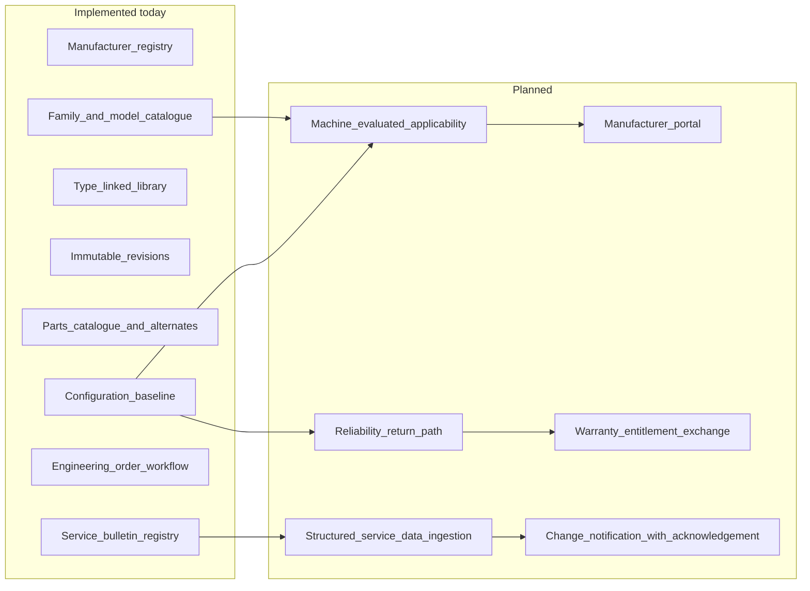
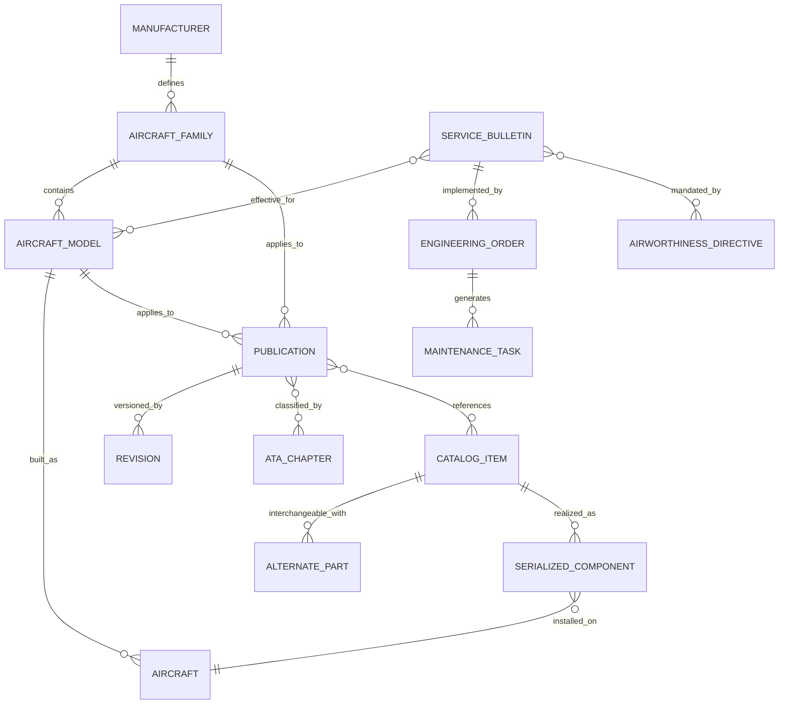
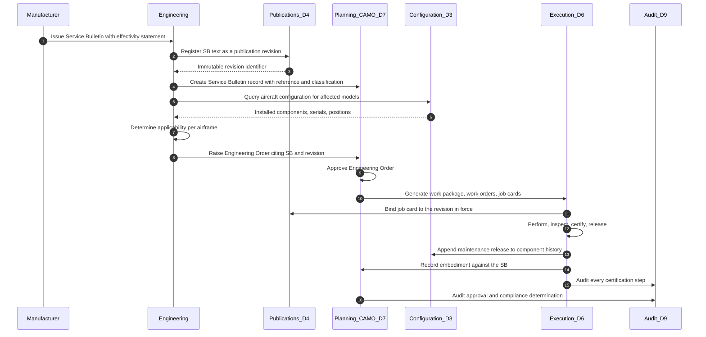
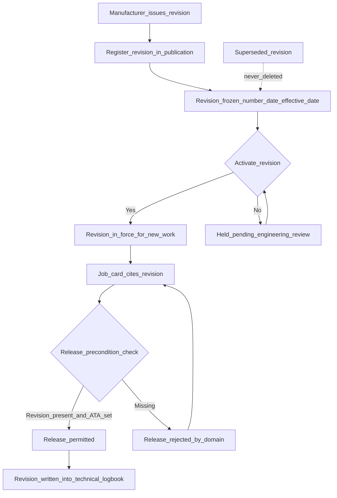
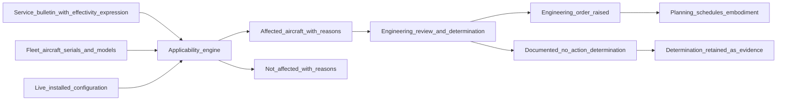

# OEM Domain — Original Equipment Manufacturers

| Field | Value |
|-------|-------|
| Document | OEM Business Domain |
| Product | Mercury Aviation Enterprise Operating System (AEOS) |
| Organization | Mercury Technologies |
| Layer | Business domain (stakeholder capability, entity, and integration view) |
| Audience | OEM engineering and customer support, product management, domain consultants, integration architects |
| Status | Living baseline |
| Companion documents | [Airline](Airline.md) · [MRO](MRO.md) · [CAMO](CAMO.md) · [Authority](Authority.md) · [Leasing](Leasing.md) |
| Upstream authority | [Domain Architecture](../02_Architecture/Domain_Architecture.md) · [Blueprint README](../../README.md) |

---

## 1. Purpose

### 1.1 What this domain exists to do

The OEM domain is where the **aircraft's design truth enters Mercury**. Every other domain in the platform consumes it. An airline's maintenance programme is derived from the manufacturer's Maintenance Planning Document. An MRO's job card cites a manufacturer manual revision. A CAMO's applicability determination compares a Service Bulletin's effectivity statement against the airframe's serial number and installed configuration. A lessor's return condition is measured against a build standard the manufacturer defined.

Mercury therefore treats OEM data as a **first-class, versioned, applicability-bearing input to the Digital Thread** — not as reference documents bolted onto an operator system. The domain's purpose is threefold:

1. **Establish type design identity.** Manufacturer, aircraft family, model, and variant form the shared catalogue against which every tenant's aircraft, publication, and part is resolved.
2. **Carry service data with its applicability intact.** A Service Bulletin without a machine-evaluable effectivity statement is a PDF. A Service Bulletin bound to models, serial ranges, and installed part numbers is an engineering instruction the platform can act on.
3. **Close the loop back to the manufacturer.** In-service configuration, removal rates, repeat findings, and compliance status are the OEM's most valuable feedback signal, and today they reach the manufacturer slowly and in fragments. Mercury's design intent is to make that return path structured, consented, and de-identified where the operator requires it.

### 1.2 The problem being solved

| Industry reality | Consequence in operations | Mercury's position |
|------------------|---------------------------|--------------------|
| Service data arrives as PDF, spreadsheet, and portal notification in a dozen formats | Engineering re-keys applicability by hand; errors are silent until an audit | Service data is ingested as structured records with applicability that the platform can evaluate |
| Type design catalogues live outside the operator's maintenance system | Part numbers are typed twice and diverge | Manufacturer, family, model, and ATA catalogues are platform-owned shared kernel data |
| Revision status is tracked in a librarian's spreadsheet | Work is performed against a superseded revision and discovered at audit | Publication revisions are immutable and a release is blocked without a revision reference |
| The manufacturer sees fleet reality only through warranty claims and AOG calls | Reliability improvement cycles are slow | In-service effectivity and reliability signals are designed as a structured return path |

### 1.3 What Mercury does not claim

Mercury is **not** a type certificate holder, a design organization, or a distributor of manufacturer intellectual property. The platform holds publication *metadata* and licence-safe storage locators; it does not redistribute licensed manufacturer content that a tenant has no right to hold. Applicability evaluation produces an **engineering recommendation for human determination**, never an automatic compliance verdict. See [Authority](Authority.md#13-what-mercury-does-not-claim) for the equivalent boundary on the regulatory side.

---

## 2. Business capabilities

### 2.1 Capability register

| # | Capability | What it means operationally | Standing |
|---|-----------|-----------------------------|----------|
| OEM-C1 | **Manufacturer registry** | A governed catalogue of manufacturers with codes, used as the root of type design identity | Implemented |
| OEM-C2 | **Aircraft family and model catalogue** | Family, model, and variant records that every tenant aircraft references; prevents free-text model names | Implemented |
| OEM-C3 | **Type-linked technical library** | Publications typed and bound to models, families, ATA chapters, and catalogue items | Implemented |
| OEM-C4 | **Immutable revision control** | Every publication revision is dated, numbered, and frozen; activation is an explicit act | Implemented |
| OEM-C5 | **Illustrated parts catalogue linkage** | Catalogue items, alternate parts, and interchangeability rules resolvable from the publication set | Implemented |
| OEM-C6 | **Service Bulletin registry** | SBs recorded with reference, title, classification, and effectivity narrative | Implemented |
| OEM-C7 | **Engineering Order derivation** | An operator's own approved instruction derived from an SB, with an approval workflow | Implemented |
| OEM-C8 | **Modification and configuration baseline** | Installed configuration expressed as serialized components at positions, comparable to a build standard | Implemented |
| OEM-C9 | **Machine-evaluated applicability** | Effectivity expressions evaluated automatically against live aircraft configuration and serial ranges | Planned |
| OEM-C10 | **Structured service-data ingestion** | Automated intake of SB, AD-linked, and manual revision feeds in S1000D / ATA iSpec 2200 shapes | Planned |
| OEM-C11 | **Manufacturer portal** | A scoped OEM tenancy giving manufacturers visibility of in-service effectivity and fleet uptake | Planned |
| OEM-C12 | **In-service reliability return path** | Consented, de-identified removal-rate and finding data flowing back to the manufacturer | Planned |
| OEM-C13 | **Warranty entitlement exchange** | Entitlement lookup and claim submission against manufacturer warranty terms | Planned |
| OEM-C14 | **Type design change notification** | Push notification of new revisions to affected operator tenancies with acknowledgement tracking | Planned |

### 2.2 Capability heat map

---

## 3. Major entities

### 3.1 Entity register

| Entity | Ownership | Description | Standing |
|--------|-----------|-------------|----------|
| **Manufacturer** | Platform shared kernel | The design or production organization. Root of type identity. | Implemented |
| **Aircraft family** | Platform shared kernel | A grouping of models sharing a design lineage and, usually, a common manual set. | Implemented |
| **Aircraft model** | Platform shared kernel | The specific type or variant an aircraft is built to. | Implemented |
| **ATA chapter** | Platform shared kernel | The classification spine linking publications, tasks, components, and findings. | Implemented |
| **Publication type** | Platform shared kernel | Maintenance, flight, engineering, or operations classification of a controlled document. | Implemented |
| **Publication** | Tenant, organization-scoped | A controlled technical document — AMM, IPC, WDM, SRM, CMM, SB text. | Implemented |
| **Revision** | Tenant, immutable | A dated, numbered, frozen version of a publication. Work always cites one. | Implemented |
| **Catalogue item** | Tenant | A part definition traceable to the manufacturer's parts catalogue. | Implemented |
| **Alternate part** | Tenant | An interchangeability relationship, directional where the manufacturer defines it as one-way. | Implemented |
| **Service Bulletin** | Tenant | A manufacturer instruction with reference, classification, and effectivity. | Implemented |
| **Engineering Order** | Tenant | The operator's approved implementation instruction, frequently derived from an SB. | Implemented |
| **Airworthiness Directive** | Tenant | The authority mandate that often makes an SB compulsory. Owned by [CAMO](CAMO.md), sourced here. | Implemented |
| **Serialized component** | Tenant | The physical realization of a catalogue item, with life and installation history. | Implemented |
| **Aircraft configuration** | Tenant, derived | The installed set of components at positions — the comparison target for applicability. | Implemented |
| **Effectivity expression** | Tenant | A machine-evaluable applicability rule over model, serial range, and installed part numbers. | Planned |
| **Service data feed** | Platform | A registered, versioned manufacturer content channel with an ingestion contract. | Planned |
| **OEM organization tenancy** | Platform | A manufacturer's own scoped organization with cross-organization visibility grants. | Planned |
| **Warranty entitlement** | Tenant | The manufacturer's coverage terms for a part, serial, or event class. | Planned |

### 3.2 Entity relationship view

---

## 4. Relationships

### 4.1 To Mercury bounded contexts

| Mercury domain | Direction | What crosses the boundary |
|----------------|-----------|---------------------------|
| D2 Fleet and Aircraft | OEM upstream | Manufacturer, family, model, and variant identity. An aircraft cannot exist without a catalogue model. |
| D3 Configuration and Components | OEM upstream | ATA classification, catalogue items, alternate part rules, life-limit definitions. |
| D4 Publications | OEM upstream | The controlled document set and its revision lineage. |
| D7 Planning and CAMO | OEM upstream | MPD task source content, SB text, effectivity narrative feeding AD and EO records. |
| D6 Maintenance Execution | OEM upstream, indirect | The revision in force cited on every job card and written into the technical logbook. |
| D8 Logistics and Stores | OEM upstream | Part master definitions, supersession chains, shelf-life and storage conditions. |
| D10 AI and Digital Twin | OEM upstream, planned | Publication corpus for retrieval; design baseline for twin state. |

Full context definitions and integration patterns: [Domain Architecture §5–§6](../02_Architecture/Domain_Architecture.md#5-bounded-contexts).

### 4.2 To other stakeholder domains

| Counterparty | Nature of the relationship | Mercury's mediation |
|--------------|---------------------------|---------------------|
| [Airline](Airline.md) | The OEM's customer and the source of in-service experience | Mercury holds the operator's configuration and utilization; the return path to the OEM is designed, not yet built |
| [CAMO](CAMO.md) | Converts SB and AD into a compliance obligation with a due date | SB and AD records feed programme revisions, checks, and the forecast engine |
| [MRO](MRO.md) | Performs the embodiment and cites the manufacturer revision on the job card | Revision reference is a hard precondition of release |
| [Authority](Authority.md) | Mandates SB embodiment through Airworthiness Directives | AD records reference the originating SB; evidence of embodiment is queryable |
| [Leasing](Leasing.md) | Measures asset value against build standard and modification status | Configuration and SB compliance state are inputs to return-condition assessment |

### 4.3 The digital thread edge

The OEM domain contributes the **design-truth end of the thread**: manufacturer to family to model to publication to revision to task to job card to signature to logbook entry. Every downstream evidence record can be resolved back to the design data that authorized it. That resolvability is the property [Digital Thread](../04_Data/Digital_Thread.md) exists to guarantee.

### 4.4 The manufacturer's supply and support network

The manufacturer is not a single counterparty. Its network participates in the type-design and part-identity data this domain owns.

| Ecosystem role | Position in the network | Mercury capability that represents it | Standing |
|----------------|------------------------|--------------------------------------|----------|
| **Tier supplier and equipment manufacturer** | Designs and produces a system or component under the airframer's specification; issues its own component maintenance manuals and bulletins | Manufacturer registry (OEM-C1) resolves the supplier as a manufacturer in its own right; catalogue items carry its part numbers; CMMs are publications bound to the catalogue item | Implemented. What is missing is the supplier-to-airframer relationship as data — the platform records both as manufacturers without expressing the design hierarchy between them |
| **Authorized component shop** | Repairs to the manufacturer's approved data and returns units with certification | Catalogue item and alternate-part rules define what may be fitted; rotable cycle records the loop; publications supply the CMM revision | **Partial** — see [MRO §4.4](MRO.md#44-shops-stores-and-the-supplier-ecosystem) |
| **Authorized engine and APU shop** | Performs module workscopes to manufacturer workscope planning guides | Serialized component life, SB and EO embodiment against the engine, publication revision binding | **Partial** — no assembly hierarchy for module and life-limited-part rollup |
| **Manufacturer distribution centre and warehouse** | Holds and ships spares against the manufacturer's part catalogue and supersession rules | Part master, part identifiers, supersession chains, vendor master; receipt and putaway | Implemented for the operator's side of the transaction. Manufacturer-side stock visibility and entitlement lookup are planned (OEM-C13) |
| **Licensed publication distributor** | Delivers manual revisions under a licence held by a specific operator | Publication and revision metadata with licence-safe storage locators, scoped per organization | Implemented as metadata. Structured revision-package ingestion is OEM-C10; the licensing boundary in §6.3 governs any content store |
| **Repair design and modification organization** | Produces approved data the operator embodies alongside manufacturer data | Engineering Orders (OEM-C7) carry an operator's own approved instruction with an approval workflow, whatever its design source | Implemented. Mercury records the approved instruction and its approver; it does not evaluate the design's validity |

### 4.5 Customer-side functions this domain serves

Service data enters an operator through specific functions, and each has a different question. The domain's job is to make one record answer all of them.

| Function | Question it brings to manufacturer data | Capability that answers it | Standing |
|----------|----------------------------------------|---------------------------|----------|
| **Engineering** | Does this bulletin apply to my airframes, and what does embodiment require? | OEM-C6, OEM-C8, configuration query; OEM-C9 when applicability becomes machine-evaluable | Implemented as a human determination against a queryable configuration; automated evaluation is planned |
| **Quality** | Was the work done against the revision that was in force, and can I prove it? | OEM-C4 immutable revisions, release precondition binding, audit on revision activation | Implemented |
| **Reliability** | Is this part performing as the manufacturer's design intent predicted? | Catalogue item as the type-level record; component history and removal events as the in-service record | **Partial** — the comparison is possible by traversal; the analytics and the return path (OEM-C12) are planned |
| **Flight Ops** | Is the flight manual and operational documentation I hold the current revision? | Publication types covering flight and operations documents, revision activation, planned acknowledgement tracking (OEM-C14) | Implemented for control; acknowledgement tracking is planned |
| **Planning and CAMO** | When must this become work, and against what deadline? | Service Bulletin and Engineering Order records feeding programme revisions and checks — see [CAMO](CAMO.md) | Implemented |
| **Warehouses and stores** | Which part number is valid now, and what supersedes it? | Part master identifiers, supersession chains, alternate-part interchangeability rules | Implemented |
| **Finance** | Is this event covered by warranty, and what is the entitlement? | Warranty entitlement exchange | **Planned** — OEM-C13 |
| **Executive** | What is my fleet's modification standard and compliance exposure? | Configuration baseline and compliance state across the fleet | **Partial** — answerable by traversal; a portfolio read model is planned |

---

## 5. APIs

### 5.1 Reading this section

Endpoints marked **Current** exist in the Mercury Enterprise runtime today under the `/api/v1` prefix. Endpoints marked **Planned** are blueprint intent with no runtime implementation. This distinction is binding: see [ROADMAP §1](../../ROADMAP.md#1-purpose-and-objectives).

### 5.2 Current endpoints serving this domain

| Area | Method and path | Purpose |
|------|-----------------|---------|
| Type design | `GET /api/v1/fleet/manufacturers` | List manufacturers in the shared catalogue |
| Type design | `POST /api/v1/fleet/manufacturers` | Register a manufacturer — governed, administrative |
| Type design | `GET /api/v1/fleet/families` | List aircraft families |
| Type design | `GET /api/v1/fleet/models` | List models, filterable by manufacturer and family |
| Type design | `POST /api/v1/fleet/models` | Register a model against a manufacturer and family |
| Classification | `GET /api/v1/components/ata-chapters` | List ATA chapters |
| Classification | `POST /api/v1/components/ata-chapters` | Extend the ATA catalogue |
| Catalogue | `GET /api/v1/components/catalog` | List catalogue items — the part definition layer |
| Catalogue | `POST /api/v1/components/catalog` | Create a catalogue item |
| Catalogue | `GET /api/v1/components/catalog/{catalog_item_id}/alternates` | Resolve interchangeable parts |
| Catalogue | `POST /api/v1/components/catalog/alternates` | Record an interchangeability rule |
| Library | `GET /api/v1/publications/types` | List publication types |
| Library | `GET /api/v1/publications` | List publications with filters |
| Library | `POST /api/v1/publications` | Create a controlled publication |
| Library | `GET /api/v1/publications/by-model/{aircraft_model_id}` | Resolve the manual set applicable to a model |
| Library | `GET /api/v1/publications/by-ata/{ata_chapter_id}` | Resolve publications by system |
| Library | `GET /api/v1/publications/by-component/{component_id}` | Resolve publications for an installed component |
| Library | `GET /api/v1/publications/by-aircraft/{aircraft_id}` | Resolve the applicable set for a specific airframe |
| Library | `GET /api/v1/publications/{publication_id}/revisions` | Revision history |
| Library | `POST /api/v1/publications/{publication_id}/revisions` | Issue a new immutable revision |
| Library | `POST /api/v1/publications/{publication_id}/revisions/{revision_id}/activate` | Bring a revision into force |
| Library | `POST /api/v1/publications/{publication_id}/ata/{ata_chapter_id}` | Bind a publication to an ATA chapter |
| Library | `POST /api/v1/publications/{publication_id}/catalog/{catalog_item_id}` | Bind a publication to a catalogue item |
| Library | `POST /api/v1/publications/{publication_id}/archive` | Withdraw a publication from new work |
| Service data | `GET /api/v1/planning/service-bulletins` | List Service Bulletins |
| Service data | `POST /api/v1/planning/service-bulletins` | Record a Service Bulletin |
| Service data | `GET /api/v1/planning/engineering-orders` | List Engineering Orders |
| Service data | `POST /api/v1/planning/engineering-orders` | Raise an Engineering Order |
| Service data | `POST /api/v1/planning/engineering-orders/{eo_id}/approve` | Approve an EO for embodiment |
| Configuration | `GET /api/v1/components/aircraft/{aircraft_id}/configuration` | Installed configuration for applicability comparison |

### 5.3 Planned endpoints

| Area | Method and path | Purpose | Depends on |
|------|-----------------|---------|-----------|
| Applicability | `POST /api/v1/planning/service-bulletins/{sb_id}/evaluate-applicability` | Evaluate effectivity against live fleet configuration, returning affected aircraft with reasons | OEM-C9, structured effectivity model |
| Applicability | `GET /api/v1/fleet/aircraft/{aircraft_id}/applicable-service-data` | All SB, AD, and EO applicable to one airframe with compliance state | OEM-C9 |
| Ingestion | `POST /api/v1/publications/import` | Structured import of a manufacturer revision package | OEM-C10, object storage |
| Ingestion | `GET /api/v1/oem/feeds` · `POST /api/v1/oem/feeds/{feed_id}/sync` | Register and synchronize a manufacturer service-data channel | OEM-C10 |
| Portal | `GET /api/v1/oem/fleet-effectivity/{sb_reference}` | Manufacturer-scoped view of embodiment uptake across consenting operators | OEM-C11, cross-organization sharing construct |
| Portal | `GET /api/v1/oem/reliability/removals` | De-identified removal-rate summary by part number | OEM-C12, consent model |
| Warranty | `GET /api/v1/logistics/parts/{part_id}/warranty-entitlement` | Entitlement lookup against manufacturer terms | OEM-C13 |
| Notification | `POST /api/v1/publications/{publication_id}/revisions/{revision_id}/notify` | Push a revision notification with acknowledgement tracking | OEM-C14, event bus |

### 5.4 Contract principles

- Shared kernel catalogues are **read-mostly for tenants**. Write access to manufacturer, family, and model is administrative and audited.
- Every service-data record carries its **source reference** — the manufacturer's own bulletin number — so the platform record can always be reconciled with the manufacturer's document.
- Applicability responses, when built, must return **reasons, not just matches**. "Effective because serial 4127 falls in range 4100–4200 and part 3244-01 is installed at position ENG-1" is auditable; a bare list is not.
- No planned OEM endpoint may write into an operator's compliance state. The manufacturer supplies data; the operator's CAMO determines obligation.

---

## 6. Security

### 6.1 Persona access

Mercury's session roles are Administrator, Operator, Reviewer, and Viewer. Aviation personas overlay fine-grained permissions on top of those roles. The personas relevant to this domain:

| Persona | Typical OEM-domain activity | Key permissions |
|---------|----------------------------|-----------------|
| `engineering` | Evaluates SB applicability, raises Engineering Orders, maintains catalogue linkage | `engineering.read`, `configuration.read`, `component.read`, `publication.read`, `fleet.read` |
| `planner` | Converts approved EOs into scheduled work | `planning.read`, `planning.manage`, `publication.read`, `work_order.manage` |
| `reliability` | Analyses in-service performance against type design | `qa.read`, `component.read`, `maintenance.read`, `fleet.read` |
| `qa` | Verifies revision control and embodiment evidence | `qa.read`, `audit.read`, `publication.read`, `logbook.read` |
| `technician` | Reads the manual revision cited on a job card | `publication.read`, `task.manage`, `work_order.execute` |
| `administrator` | Governs the shared catalogue | `*` |

Full persona and permission definitions: [RBAC](../06_Security/RBAC.md).

### 6.2 Organization isolation

| Data class | Isolation posture |
|------------|-------------------|
| Manufacturer, family, model, ATA chapter, publication type | **Platform shared kernel.** Readable by all tenants, writable only by administrators. Contains no tenant-identifying information. |
| Publications, revisions, catalogue items, alternates | **Organization-scoped.** A tenant's library reflects the licences that tenant holds. Cross-tenant read is not possible. |
| Service Bulletins, Engineering Orders | **Organization-scoped.** Two operators may hold the same manufacturer SB as separate records with separate compliance states. |
| Aircraft configuration | **Organization-scoped**, and the most sensitive data in this domain — it reveals fleet composition and modification status. |

The planned manufacturer portal (OEM-C11) does **not** relax this. It requires an explicit, revocable, audited cross-organization sharing grant per operator, defaulting to de-identified aggregates. An OEM never receives an operator's registration marks, personnel identities, or commercial terms by default.

### 6.3 Licensing as a security boundary

Manufacturer content is licensed intellectual property. Mercury holds publication metadata and licence-safe storage locators rather than redistributing binaries it has no right to hold. Any future managed content store must preserve per-organization licence scoping; a shared content cache that lets Tenant B read Tenant A's licensed manual is a legal breach as well as an isolation breach, and is treated with the same severity.

### 6.4 Audit

Every mutating call in this domain writes an audit event recording actor, actor role, organization, site, target type, target identifier, source, outcome, and origin. Three transitions are audit-critical:

1. **Revision activation** — establishes which content was in force from that moment, and is therefore the anchor for every downstream release record.
2. **Engineering Order approval** — the point at which an operator commits to an embodiment standard.
3. **Publication archive** — removes content from new work; the audit record proves when the withdrawal took effect.

Audit semantics and retention: [Audit](../06_Security/Audit.md).

---

## 7. Workflows

### 7.1 Service Bulletin intake through embodiment

### 7.2 Revision control and the release precondition

The critical property: a superseded revision is never removed. Work performed two years ago can still be traced to the exact content that authorized it, which is what makes historical evidence defensible under [Authority](Authority.md) review.

### 7.3 Planned — machine-evaluated applicability

Note the shape: the engine produces **candidates with reasons**; a qualified engineer makes the determination. Both the positive and the negative determination are retained as evidence, because "we assessed this SB and concluded it does not apply, for these reasons" is exactly what an inspector asks for.

---

## 8. Future roadmap

| Horizon | Item | Value delivered | Dependency |
|---------|------|-----------------|-----------|
| Near term | Structured effectivity model on SB and AD records | Applicability becomes data rather than prose | Planning model extension |
| Near term | Object storage for publication binaries with integrity checking | Ends metadata-only library; enables in-place viewing under licence scope | [ROADMAP §4](../../ROADMAP.md#4-near-term-horizon--assurance-and-hardening-additive) item 6 |
| Near term | Revision acknowledgement tracking | Proof that affected personnel saw a revision, closing a common audit finding | Notification path |
| Mid term | Machine-evaluated applicability against live configuration | Removes the largest manual, error-prone engineering task in the domain | Effectivity model plus configuration query contract |
| Mid term | Structured service-data ingestion in S1000D and ATA iSpec 2200 shapes | Manufacturer feeds land as data, not attachments | Import contract and anti-corruption layer |
| Mid term | Manufacturer portal with consented cross-organization visibility | Manufacturers see real in-service effectivity uptake | Cross-organization data-sharing agreement construct |
| Mid term | In-service reliability return path | Closes the design-improvement loop with de-identified fleet data | Reliability analytics and consent model |
| Long term | Warranty entitlement and claim exchange | Recovers warranted cost automatically rather than by correspondence | Finance capability expansion |
| Long term | Knowledge graph over the publication corpus | Retrieval-grounded engineering assistance across the full manual set | [Knowledge Graph](../07_AI/Knowledge_Graph.md) |
| Long term | Design baseline as digital twin input | Configuration-accurate simulation against the manufacturer's build standard | [Digital Twin](../07_AI/Digital_Twin.md) |

Sequencing authority and horizon definitions: [ROADMAP](../../ROADMAP.md).

---

## 9. Related documents

**Business domains**
[Airline](Airline.md) · [MRO](MRO.md) · [CAMO](CAMO.md) · [Authority](Authority.md) · [Leasing](Leasing.md)

**Architecture**
[Domain Architecture](../02_Architecture/Domain_Architecture.md) · [Enterprise Architecture](../02_Architecture/Enterprise_Architecture.md) · [System Context](../02_Architecture/System_Context.md) · [Technical Architecture](../02_Architecture/Technical_Architecture.md)

**Data**
[Digital Thread](../04_Data/Digital_Thread.md) · [Data Model](../04_Data/Data_Model.md) · [Master Data](../04_Data/Master_Data.md)

**Security**
[Security documentation set](../06_Security/) · [RBAC](../06_Security/RBAC.md) · [Identity](../06_Security/Identity.md) · [Audit](../06_Security/Audit.md) · [Digital Signatures](../06_Security/Digital_Signatures.md)

**Intelligence — advisory only, never an applicability determination**
[AI documentation set](../07_AI/) · [AI Strategy](../07_AI/AI_Strategy.md) · [Knowledge Graph](../07_AI/Knowledge_Graph.md) · [Digital Twin](../07_AI/Digital_Twin.md)

**Regulation — descriptive mapping, not a claim of approval**
[Regulations documentation set](../09_Regulations/) · [FAA](../09_Regulations/FAA.md) · [Transport Canada](../09_Regulations/Transport_Canada.md)

**Repository root**
[README](../../README.md) · [VISION](../../VISION.md) · [ROADMAP](../../ROADMAP.md)

---

*Mercury Technologies — One Digital Thread. One Digital Aircraft Passport. One Aviation Enterprise Operating System.*
