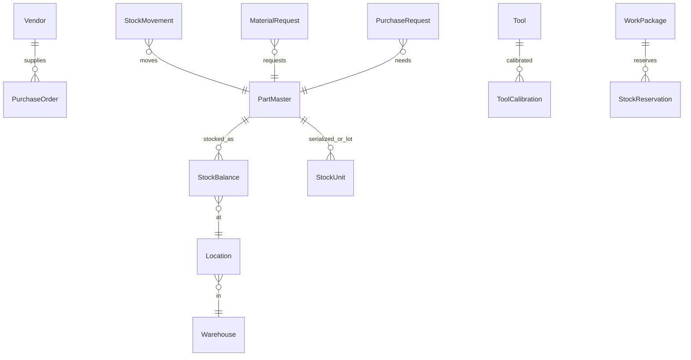
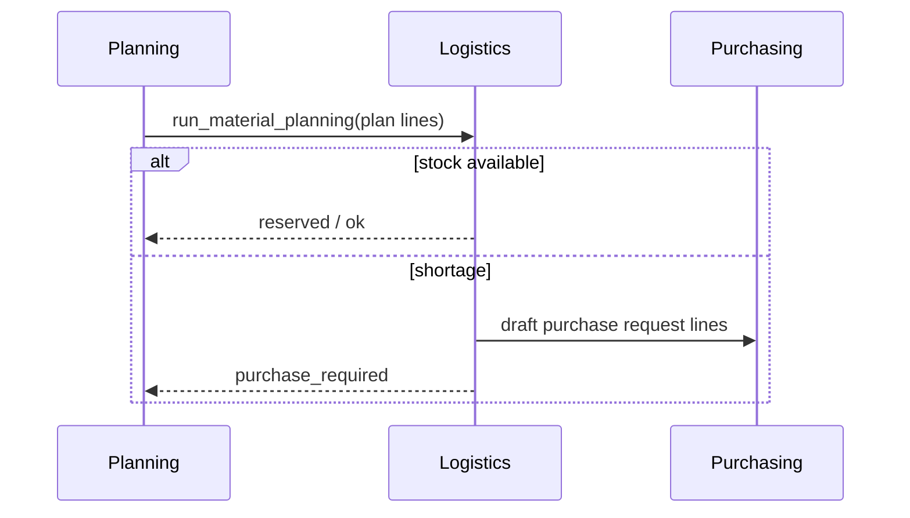

# Suppliers, Warehouses & Logistics Ecosystem

| Field | Value |
|-------|--------|
| Document | Business domain — suppliers, warehouses, and logistics ecosystem |
| Product | Mercury Aviation Enterprise Operating System (AEOS) |
| Audience | Supply-chain leaders, stores, purchasing, MRO ops, airline materials, architects |
| Status | Normative for Program B logistics capability |
| Companions | [MRO](MRO.md) · [Airline](Airline.md) · [OEM](OEM.md) · [Digital Thread](../04_Data/Digital_Thread.md) · [ADR-0007](../08_Standards/ADR/ADR-0007-logistics-as-integrated-program.md) |

---

## 1. Purpose

This document defines how Mercury models the **materials and tooling ecosystem** that surrounds continued airworthiness: vendors, warehouses, stores, receiving and shipping, procurement, tool cribs, and the join to maintenance planning and execution.

It exists so logistics is never described as “inventory screens.” In Mercury, logistics is a **Digital Thread segment**: every receive, issue, reservation, calibration, and purchase order must remain queryably linked to aircraft, work, and evidence.

---

## 2. Business capabilities

| Capability | Description | Standing |
|------------|-------------|---------|
| Warehouse hierarchy | Buildings, stores, rooms, zones, aisles, shelves, bins, typed locations | **Delivered** |
| Part master | OEM/customer PN, ATA, NSN, hazmat, shelf life, identifiers | **Delivered** |
| Stock ledger | Immutable movements; balances; FIFO/FEFO | **Delivered** |
| Rotables | Repair cycles, loan/pool/exchange, LLP flags | **Delivered** |
| Tool crib | Calibration, kits, issue/return, lost tool reports | **Delivered** |
| Material requests | Tech → supervisor → stores issue | **Delivered** |
| Procurement | PR → RFQ → PO → receive → inspect → putaway → invoice | **Delivered** |
| Vendors | OEM/distributor/local/repair ratings and lead times | **Delivered** |
| Shipping | Incoming/outgoing, tracking, DG flags | **Delivered** |
| Planning bridge | Auto reserve / shortage / PR on WP generate | **Delivered** |
| Object-store certificates/photos | Binary evidence beyond URI metadata | **Planned** |
| Native hangar scan client | Consumes scan API | **Planned** |
| EDI / courier / GL posting | External financial and carrier networks | **Planned** |

---

## 3. Major entities

| Entity | Role on the thread |
|--------|-------------------|
| `PartMaster` | Logistics identity of a part (links optionally to Sprint 7 catalog) |
| `StockUnit` | Serialized/lot instance with condition and location |
| `StockMovement` | Immutable ledger event |
| `Vendor` | Supply and repair counterparty |
| `Tool` | Calibrated resource that can gate work |
| `MaterialRequest` / `PurchaseOrder` | Demand and replenishment evidence |

---

## 4. Relationships to other domains

| Domain | Relationship |
|--------|--------------|
| Planning | Plan lines drive reservations and shortages |
| Work orders / job cards | `waiting_parts` and MR linkage |
| Components | Configuration install/remove remains Sprint 7; stores condition is logistics |
| Personnel | Issuer, receiver, inspector identities |
| Audit / RBAC | `logistics.*` permissions; fail-closed audit on stock and approvals |

---

## 5. APIs

Primary surface: `/api/v1/logistics/*`

Representative groups: warehouses, locations, parts, stock, reservations, transfers, tools, material-requests, vendors, purchase-requests, rfqs, purchase-orders, receipts, shipments, scan, dashboard, shortages, material-planning/run, tool-planning/run.

Standards: [API Standards](../08_Standards/API_Standards.md).

---

## 6. Security

| Control | Application |
|---------|-------------|
| Organization isolation | Every logistics table carries `organization_id` |
| RBAC | `logistics.read`, `manage`, `stores`, `purchase`, `tools`, `finance` |
| Personas | store, purchasing, finance, supervisor, technician (MR create), QA |
| Audit | Receive, issue, adjust, approve, putaway audited; critical paths fail closed |
| Quarantine | Unserviceable/rejected material segregated by location type |

See [RBAC](../06_Security/RBAC.md) and [Audit](../06_Security/Audit.md).

---

## 7. Workflows

### 7.1 Planning → shortage → purchase

### 7.2 PO receive → inspect → putaway

Purchase order receipt creates receiving lines; inspection accepts or rejects; putaway writes stock movements into general or quarantine locations.

### 7.3 Tool calibration gate

Tools with overdue calibration cannot be reserved or issued for planned work.

---

## 8. Ecosystem roles

| Role | What Mercury enables |
|------|----------------------|
| Warehouse / stores | Location control, issue/return, quarantine |
| Purchasing | PR/RFQ/PO and vendor performance |
| Suppliers / distributors / OEM spares | Vendor master; future portal packs |
| Component / engine shops | Rotable repair cycles; future shop-visit continuity |
| Finance | Invoice records; future GL export |
| Quality | Inspection of receipts; DG/hazmat flags |
| Executive | Logistics dashboard KPIs |

---

## 9. Future roadmap

1. Object storage for certificates and photos  
2. Hangar scan / RFID clients on the existing scan API  
3. Cross-organization lessor/OEM sharing constructs for material provenance packs  
4. EDI and courier webhooks  
5. Single-transaction planning↔logistics bridge  
6. Deeper engine/component shop visit hierarchies  

---

## 10. Related documents

[ADR-0007](../08_Standards/ADR/ADR-0007-logistics-as-integrated-program.md) · [MRO](MRO.md) · [Airline](Airline.md) · [Data Model](../04_Data/Data_Model.md) · [Product Family](../05_Product/Product_Family.md)
