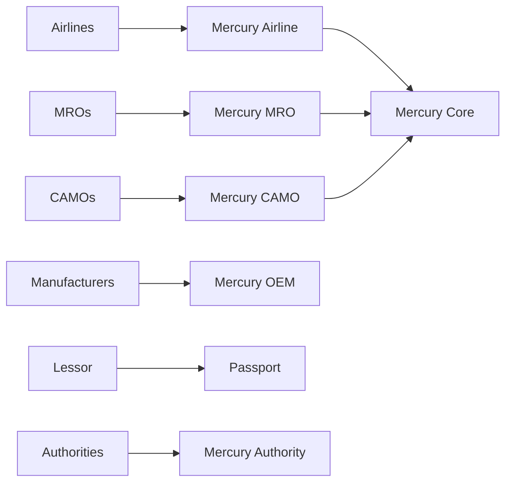

# Industries Overview

| Field | Value |
|-------|--------|
| Document | Industry coverage map for Mercury AEOS |
| Status | Normative for GTM and architecture scoping |
| Companions | [Product Line Strategy](../../05_Product/Product_Line_Strategy.md) · [Future Vision 10-Year](../../01_Executive/Future_Vision_10_Year.md) |

---

## 1. Purpose

Define every industry Mercury serves or intends to serve, the primary products, and honest delivery standing. Military, UAV, and eVTOL are **future** unless marked otherwise.

---

## 2. Industry catalogue

| Industry | Primary products | Needs (summary) | Standing |
|----------|------------------|-----------------|----------|
| Airlines | Airline, MRO, Core, Passport, Executive | Fleet airworthiness, MCC, stores, audit | **Partial** |
| Business Aviation | Airline, MRO, Core | Mixed fleet, FBO interfaces, flexibility | **Partial** |
| Cargo | Airline, MRO, Logistics | Utilization-heavy, freighter mods | **Partial** |
| Military | Core+, Authority patterns | Classification, mission config | **Future** |
| Helicopters | Airline/MRO | Airframe specifics, cycle regimes | **Partial** (generic model) |
| UAV / Drone | Core, Twin, Connect | Fleet of systems, remote ops | **Future** |
| eVTOL | OEM, Airline, Authority | Certification flux, urban ops | **Future** |
| Aircraft Manufacturers | OEM, Passport, Connect | Applicability, in-service feedback | **Foundation Partial** |
| Engine Manufacturers | OEM, MRO shops | LLP, shop visits | **Foundation Partial** |
| Component Manufacturers | OEM, Marketplace | PMA/OEM spares, alternates | **Foundation Partial** |
| MROs | MRO, Logistics, Academy | Execution, tools, materials | **Strong Partial** |
| CAMOs | CAMO, Airline, Passport | Programs, directives, oversight | **Partial** |
| FBOs | Airline light, Marketplace | Line service, transient aircraft | **Planned** |
| Leasing Companies | Passport, Executive, OEM | Asset transfer evidence | **Planned packs** |
| Authorities | Authority, Audit | Oversight evidence access | **Planned** |
| Training Organizations | Academy, Careers | Competency evidence | **Planned** |

---

## 3. Design principles

1. One Digital Thread across industries — no industry-specific forked databases.
2. Industry packs specialize UX and workflows, not tenancy physics.
3. Future industries require ADRs when they change isolation or classification models (especially Military).

---

## 4. Mermaid — industry to product

---

## 5. Related documents

[Airline.md](../Airline.md) · [MRO.md](../MRO.md) · [OEM.md](../OEM.md) · [CAMO.md](../CAMO.md) · [Authority.md](../Authority.md) · [Leasing.md](../Leasing.md)
