# Data Model — Mercury Aviation Enterprise Operating System

| Field | Value |
|-------|-------|
| Document | Data Model — conceptual and logical |
| Product | Mercury Aviation Enterprise Operating System (AEOS) |
| Organization | Mercury Technologies |
| Layer | Data (subject areas, entities, keys, relationships, integrity) |
| Audience | Data modellers, architects, backend developers, integration partners, auditors |
| Status | Living baseline — entity or key changes require an ADR |
| Companion documents | [Digital Thread](Digital_Thread.md) · [Master Data](Master_Data.md) · [Knowledge Graph](Knowledge_Graph.md) |
| Upstream authority | [Domain Architecture](../02_Architecture/Domain_Architecture.md) · [Blueprint README](../../README.md) |

---

## 1. Scope

### 1.1 In scope

This document is the authoritative description of **Mercury's persisted data model**: which entities exist, what identifies them, how they relate, which of those relationships are enforced by the database and which are enforced only by application code, and what temporal and lifecycle semantics apply to each table group.

It covers three levels:

| Level | Question it answers | Where in this document |
|-------|--------------------|------------------------|
| **Conceptual** | What things does an aviation enterprise have, and how do they connect? | §3 |
| **Logical** | What tables, keys, columns, and constraints represent those things? | §5 |
| **Physical posture** | What engine, index, and integrity reality does the runtime actually present? | §6, §7, §10 |

The model described here is the model the runtime carries. Where the model is weaker than the blueprint intends, this document says so in the same sentence rather than in a footnote. Section 6 in particular is a candid statement of referential-integrity debt.

### 1.2 Out of scope

| Concern | Authoritative location |
|---------|------------------------|
| Bounded contexts, aggregates, ubiquitous language | [Domain Architecture](../02_Architecture/Domain_Architecture.md) |
| The link semantics that bind entities into one narrative | [Digital Thread](Digital_Thread.md) |
| Reference catalogues, stewardship, and data ownership | [Master Data](Master_Data.md) |
| Graph projection and AI-facing overlay | [Knowledge Graph](Knowledge_Graph.md) |
| Layering, transaction mechanics, deployment topology | [Technical Architecture](../02_Architecture/Technical_Architecture.md) |
| Permission matrices, signature semantics, audit governance | [Security documentation set](../06_Security/) |
| API request and response shapes | [API Standards](../08_Standards/API_Standards.md) |
| Commercial packaging of the capabilities these tables support | [Editions](../05_Product/Editions.md) |

### 1.3 How the schema is defined

There are no hand-written `CREATE TABLE` scripts. The schema is declared once, in SQLAlchemy models, and materialized two ways:

| Mechanism | Purpose | Location |
|-----------|---------|----------|
| SQLAlchemy declarative models | The single definition of every table | `backend/app/models.py` plus `models.py` in each domain package |
| Alembic migrations | Versioned schema evolution, the required path for PostgreSQL | `backend/alembic/versions/` |
| `ensure_schema()` bootstrap | Development convenience: `create_all` plus additive index and column patches | `backend/app/database.py` |

Engine selection is configuration, not code: `DATABASE_URL` defaults to a local SQLite file and is set to PostgreSQL for any deployment that matters. The model is written to the intersection of both dialects, which explains several of the conventions in §4.

**One binding rule:** a new table is added by writing a SQLAlchemy model *and* an Alembic migration. Relying on `create_all` to introduce a table in a deployed environment is a defect.

### 1.4 Table groups

| Group | Runtime package | Tables | Standing |
|-------|----------------|--------|----------|
| Organization | `backend/app/org/` | 7 | Core, implemented |
| Fleet and aircraft | `backend/app/fleet/` | 8 | Core, implemented |
| Components and configuration | `backend/app/components/` | 5 | Core, implemented |
| Publications | `backend/app/publications/` | 5 | Core, implemented |
| Personnel and certification | `backend/app/personnel/` | 4 | Core, implemented |
| Maintenance and evidence | `backend/app/maintenance/` | 9 (6 operative, 3 AI-ready stubs) | Core, implemented |
| Work execution | `backend/app/work_orders/` | 4 | Core, implemented |
| Planning and CAMO | `backend/app/planning/` | 14 | Core, implemented |
| Logistics and stores | `backend/app/logistics/` | 44 | Core, implemented |
| Operations and audit | `backend/app/models.py` | 4 | Mixed — audit implemented, operations partial |

Roughly one hundred persisted tables. Three of them — the AI index, embedding, and cross-reference tables — exist as schema without payload and are described honestly in §5.11 and in [Knowledge Graph](Knowledge_Graph.md).

---

## 2. Design principles

| # | Principle | Statement | Consequence in the schema |
|---|-----------|-----------|---------------------------|
| DM-1 | **Organization is part of identity, not a filter** | Every tenant-owned table carries `organization_id`, and uniqueness is expressed *within* the organization. | Business keys are almost always `UniqueConstraint(organization_id, <code>)`. A tenant cannot see, collide with, or be affected by another tenant's numbering. |
| DM-2 | **Evidence is append-only** | Signatures, certification events, installation history, stock movements, logbook entries, and audit events are inserted once. | Those tables carry `created_at` or `occurred_at` and deliberately **no** `updated_at`. Absence of `updated_at` is the schema-level signal that a table is immutable. |
| DM-3 | **Correction is a new record, never an edit** | A wrong revision is superseded; a wrong movement is reversed; a wrong logbook entry is amended by appending. | Supersession columns (`supersedes_publication_id`, `supersedes_revision_id`, `logistics_part_supersessions`) exist instead of update paths. |
| DM-4 | **Reference data is global and tenant-immutable** | Manufacturers, families, models, statuses, ATA chapters, component catalogue, publication types carry no `organization_id`. | Tenants read them. Only platform stewardship writes them. See [Master Data](Master_Data.md). |
| DM-5 | **Deletion is a lifecycle state, not a removal** | Nothing safety-relevant is physically deleted. | Two mechanisms coexist: a `status` string on almost everything, and `deleted_at` on the table groups where withdrawal is a distinct act from status change. §8 explains why this is two mechanisms and not one. |
| DM-6 | **Surrogate keys everywhere, business keys constrained separately** | Primary keys are opaque. Human-meaningful identifiers are unique constraints, not keys. | `id String(80)` holding a UUID on nearly every table; `task_number`, `package_number`, `job_card_number`, `po_number` are uniquely constrained but never joined on. |
| DM-7 | **Time is recorded as it happened, not as it was entered** | Domain events carry an event time distinct from the row's creation time. | `occurred_at`, `signed_at`, `effective_date`, `revision_date`, `date_installed` are domain time. `created_at` is system time. They are never conflated. |
| DM-8 | **Derived values are computed, not stored as truth** | The forecast, due list, and configuration view are computed from base tables on read. | There is no `forecast` table. Stock balances are a deliberate exception — a materialized aggregate justified in §9. |
| DM-9 | **The model is dialect-portable** | SQLite for development, PostgreSQL for deployment, one model for both. | Explains `String(80)` UUID keys instead of a native UUID type, and the boolean-as-string convention in §4.5, which is debt this document names rather than hides. |
| DM-10 | **Additive evolution** | New columns are nullable or defaulted; new tables are new; existing columns are not repurposed. | Migrations are forward-only and additive. Repurposing a column requires an ADR. |

---

## 3. Conceptual model

### 3.1 Subject areas

At the conceptual level Mercury holds nine kinds of thing, and one spine that connects them.

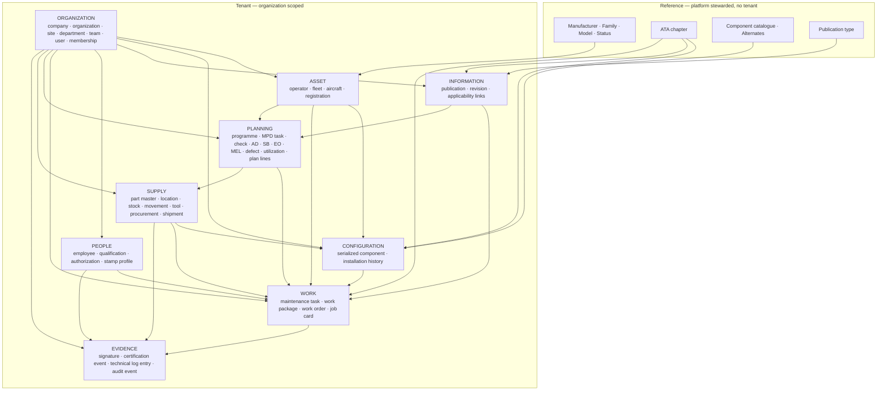

Read the diagram as dependency, not as data flow: an arrow means *the target cannot be understood without the source*. A job card without an aircraft, an organization, a publication revision, and a signer is not a job card — it is an orphan row.

### 3.2 The conceptual spine

Every one of those subject areas exists so that a single question can be answered without forensic reconstruction:

> **For this aircraft, at this moment: what is fitted, how much life remains, what work was done, against which revision of which manual, by whom under what authority, with which parts from which vendor — and where is the proof?**

That question is the [Digital Thread](Digital_Thread.md). This document supplies its vertebrae; the Digital Thread document supplies the ligaments. The operator-facing and lessor-facing aggregation of the answer is the **Digital Aircraft Passport**, specified in [Digital Thread §7](Digital_Thread.md#7-the-digital-aircraft-passport).

### 3.3 Conceptual entity definitions

Only entities whose conceptual meaning is not obvious from their name are defined here. The full vocabulary is in [Domain Architecture §4](../02_Architecture/Domain_Architecture.md#4-ubiquitous-language).

| Conceptual entity | Definition | Why it exists as its own entity |
|-------------------|-----------|--------------------------------|
| **Organization** | The tenancy boundary. One legal or operational unit whose records are invisible to every other. | Isolation must be a property of identity; see DM-1. |
| **Component catalogue entry** | The type-level definition of a part: what it is, its ATA classification, whether it is serialized, its life limits *as designed*. | One catalogue entry is realized as many physical units. Type-level limits and unit-level accumulated life are different facts. |
| **Serialized component** | One physical, individually tracked unit with its own accumulated life and installation state. | Life limits attach to units, not to types. |
| **Installation history entry** | One immutable fact about a unit: installed, removed, transferred, released. | Configuration at a past date is only knowable if history is append-only. |
| **Publication revision** | An immutable version of a controlled document. | Work performed must be attributable to the exact content in force at the time. A mutable document destroys that attribution. |
| **Maintenance task** | The unit of work that carries the certification lifecycle and produces the logbook entry. | Certification attaches to a task, not to a schedule row or a shop-floor card. |
| **Job card** | The executable instruction handed to a technician. | Shop-floor granularity differs from certification granularity; conflating them would force either over-signing or under-signing. |
| **Digital signature** | The recorded act of signing, bound to a person, a method, a target, and a hash of the signed content. | The act is a fact independent of the thing signed, which is why the table is polymorphic. |
| **Stock movement** | One immutable ledger row recording a change in stock state. | Inventory truth must be reconstructable, and a mutable quantity cannot be audited. |
| **Part master** | The tenant's commercial and supply definition of a part number. | Distinct from the catalogue entry: one is engineering type design, the other is procurement and stores reality. See [Master Data §5](Master_Data.md#5-part-master-versus-component-catalogue). |

### 3.4 Conceptual entity-relationship view

§3.1 shows dependency between subject areas. This view shows the **relationships themselves**, in entity-relationship form, across all nine subject areas at conceptual granularity. It is deliberately reduced: attributes are omitted, and where a subject area holds many tables only the entities that carry a cross-area relationship appear. The full table-level detail is §5.

```mermaid
erDiagram
    COMPANY ||--o{ ORGANIZATION : owns
    ORGANIZATION ||--o{ SITE : operates
    ORGANIZATION ||--o{ MEMBERSHIP : grants
    USER ||--o{ MEMBERSHIP : holds
    ORGANIZATION ||--o{ EMPLOYEE : employs

    MANUFACTURER ||--o{ AIRCRAFT_FAMILY : designs
    AIRCRAFT_FAMILY ||--o{ AIRCRAFT_MODEL : contains
    AIRCRAFT_MODEL ||--o{ AIRCRAFT : realized_as
    ORGANIZATION ||--o{ AIRCRAFT : owns_records_for
    FLEET_OPERATOR ||--o{ AIRCRAFT : operates
    FLEET ||--o{ AIRCRAFT : groups
    AIRCRAFT ||--o{ REGISTRATION : identified_over_time_by
    AIRCRAFT ||--o| UTILIZATION : accumulates

    ATA_CHAPTER ||--o{ COMPONENT_CATALOG : classifies
    ATA_CHAPTER ||--o{ PUBLICATION : classifies
    ATA_CHAPTER ||--o{ MAINTENANCE_TASK : classifies
    COMPONENT_CATALOG ||--o{ SERIALIZED_COMPONENT : realized_as
    COMPONENT_CATALOG ||--o{ ALTERNATE_PART : interchangeable_with
    AIRCRAFT ||--o{ SERIALIZED_COMPONENT : configured_with
    SERIALIZED_COMPONENT ||--o{ INSTALLATION_HISTORY : chronicled_by

    PUBLICATION_TYPE ||--o{ PUBLICATION : typed_by
    ORGANIZATION ||--o{ PUBLICATION : licensed_to
    PUBLICATION ||--o{ PUBLICATION_REVISION : versioned_by
    AIRCRAFT_MODEL ||--o{ PUBLICATION : applicable_to

    EMPLOYEE ||--o{ QUALIFICATION : holds
    EMPLOYEE ||--o{ AUTHORIZATION : holds
    EMPLOYEE ||--o{ DIGITAL_SIGNATURE : signs
    USER ||--o| EMPLOYEE : bound_to

    MAINTENANCE_PROGRAM ||--o{ PROGRAM_REVISION : versioned_by
    PROGRAM_REVISION ||--o{ MPD_TASK : specifies
    PROGRAM_REVISION ||--o{ MAINTENANCE_CHECK : schedules
    AIRCRAFT ||--o{ MAINTENANCE_CHECK : due_for
    AIRCRAFT ||--o{ DEFERRED_DEFECT : carries
    MEL_ITEM ||--o{ DEFERRED_DEFECT : controls
    PUBLICATION ||--o{ AIRWORTHINESS_DIRECTIVE : documented_in
    PUBLICATION ||--o{ SERVICE_BULLETIN : documented_in
    SERVICE_BULLETIN ||--o{ ENGINEERING_ORDER : implemented_by

    MAINTENANCE_CHECK ||--o| WORK_PACKAGE : generates
    WORK_PACKAGE ||--o{ WORK_ORDER : contains
    WORK_ORDER ||--o{ JOB_CARD : contains
    JOB_CARD }o--|| MAINTENANCE_TASK : certified_through
    PUBLICATION_REVISION ||--o{ MAINTENANCE_TASK : governs
    PUBLICATION_REVISION ||--o{ JOB_CARD : governs
    SERIALIZED_COMPONENT ||--o{ MAINTENANCE_TASK : subject_of
    AIRWORTHINESS_DIRECTIVE }o--o| WORK_ORDER : discharged_by
    ENGINEERING_ORDER }o--o| WORK_ORDER : discharged_by

    MAINTENANCE_TASK ||--o{ CERTIFICATION_EVENT : progresses_through
    CERTIFICATION_EVENT ||--|| DIGITAL_SIGNATURE : evidenced_by
    MAINTENANCE_TASK ||--o| TECHNICAL_LOG_ENTRY : produces
    AIRCRAFT ||--o{ TECHNICAL_LOG_ENTRY : released_in
    PUBLICATION_REVISION ||--o{ TECHNICAL_LOG_ENTRY : cited_by
    MAINTENANCE_TASK ||--o{ INSTALLATION_HISTORY : appends

    PART_MASTER ||--o{ STOCK_UNIT : stocked_as
    PART_MASTER ||--o{ STOCK_BALANCE : summarized_by
    PART_MASTER ||--o{ PART_SUPERSESSION : superseded_through
    LOCATION ||--o{ STOCK_UNIT : holds
    LOCATION ||--o{ STOCK_BALANCE : holds
    STOCK_MOVEMENT }o--o| JOB_CARD : consumed_against
    RESERVATION }o--o| JOB_CARD : held_for
    WORK_PACKAGE ||--o{ PARTS_PLAN_LINE : plans
    WORK_PACKAGE ||--o{ TOOL_PLAN_LINE : plans
    WORK_PACKAGE ||--o{ WORKFORCE_PLAN_LINE : plans
    WORK_PACKAGE ||--o{ HANGAR_PLAN : occupies
    VENDOR ||--o{ PURCHASE_ORDER : fulfils
    PURCHASE_ORDER ||--o{ RECEIPT : received_as
    RECEIPT ||--o{ STOCK_UNIT : putaway_as
    TOOL ||--o{ TOOL_CALIBRATION : certified_by
    TOOL ||--o{ TOOL_ISSUE : issued_through
    JOB_CARD ||--o{ TOOL_ISSUE : uses
    SERIALIZED_COMPONENT ||--o{ ROTABLE_CYCLE : repaired_through

    ORGANIZATION ||--o{ AUDIT_EVENT : scopes
    AUDIT_EVENT }o--o| USER : attributed_to
```

Three relationships in that diagram deserve to be read carefully, because each is weaker in the database than the notation suggests:

| Relationship as drawn | What actually enforces it | Where the detail is |
|-----------------------|--------------------------|---------------------|
| `ORGANIZATION` to every tenant entity | Application code only. `organization_id` carries no foreign key, and this is the platform's most consequential integrity gap | §6.1, [Digital Thread §5.4](Digital_Thread.md#54-weak-edges-and-what-they-cost) |
| `PART_MASTER` to `COMPONENT_CATALOG` — the supply-to-engineering bridge | Nothing. It is a text match between `oem_part_number` and `part_number`, which is why it is drawn nowhere above and stated here instead | [Master Data §5.3](Master_Data.md#53-how-they-are-reconciled) |
| `STOCK_UNIT` to `SERIALIZED_COMPONENT` — the moment a stocked part becomes installed configuration | A serial number carried across by process at issue and install; no reference column exists | [Master Data §5.4](Master_Data.md#54-the-issue-to-install-handover) |

An entity-relationship diagram flatters a schema. Read this one alongside §6.

---

## 4. Cross-cutting conventions

Every table in the schema obeys the following, and the exceptions are enumerated rather than implied.

### 4.1 Identity

| Convention | Detail |
|------------|--------|
| Primary key | `id String(80)`, populated with `str(uuid.uuid4())` at insert. |
| Sole exception | `aircraft_statuses.code String(40)` is the primary key, because the code *is* the stable identifier and is referenced by value from `aircraft.status_code`. |
| Business keys | Expressed as `UniqueConstraint`, never as the primary key. |
| Why strings and not native UUID | DM-9. One model must materialize on SQLite and PostgreSQL. A native `UUID` column type would fork the model. |

Keys are opaque by design. Any client, report, or integration that parses meaning out of an `id` is relying on an implementation accident.

### 4.2 Tenancy

| Convention | Detail |
|------------|--------|
| Column name | **`organization_id String(80)`**, always, on every tenant-owned table. |
| There is no `org_id` column | `org_id` is the *application-level variable* name used in services and dependencies. The persisted column is `organization_id`. Documents, queries, and integrations must use `organization_id`. |
| Site scoping | `site_id String(80)` exists on `memberships`, `incidents`, `evidence`, and `audit_events`. Site is a narrowing dimension within an organization, never an isolation boundary of its own. |
| Global tables | `companies`, `manufacturers`, `aircraft_families`, `aircraft_models`, `aircraft_statuses`, `ata_chapters`, `component_catalog`, `alternate_parts`, `publication_types` carry no `organization_id`. |
| Child tables | Some child rows inherit tenancy through their parent rather than repeating it — `personnel_qualifications` and `personnel_authorizations` carry `employee_id` and no `organization_id`. Reads of those tables **must** join to the parent to establish scope. This is the single most defect-prone pattern in the schema and is called out again in §11.2. |

### 4.3 Temporality

| Column | Meaning | Present on |
|--------|---------|-----------|
| `created_at` | System time the row was inserted | Nearly every table |
| `updated_at` | System time of last mutation | Mutable entities only. **Absent by design** on immutable tables |
| `occurred_at` | Domain time the event happened | `component_installation_history`, `certification_events`, `technical_log_entries`, `audit_events` |
| `signed_at` | Domain time of the signing act | `digital_signatures` |
| `effective_date`, `revision_date` | Domain validity of controlled information | `publication_revisions`, `maintenance_program_revisions` |
| `effective_from`, `effective_to` | Validity interval of an assignment | `registrations` |
| `issued_at`, `expires_at` | Validity interval of a competence or authority | `personnel_qualifications`, `personnel_authorizations` |
| `deleted_at` | Withdrawal time; see §8 | Planning tables and three logistics parent tables |

The rule from DM-7: **never infer domain time from `created_at`.** A signature recorded at 02:00 for work performed at 22:00 the previous day is correct data, and the two timestamps must both survive.

### 4.4 Immutability

A table is immutable when it has no `updated_at` and no service method that issues an `UPDATE`. The immutable set:

| Table | What it records | Correction mechanism |
|-------|----------------|---------------------|
| `digital_signatures` | An act of signing, with a SHA-256 hash over the canonical payload | None. A wrong signature is followed by a corrective task and a new signature. |
| `certification_events` | One completed certification step | None. Rejection is a new event; rework is a new task cycle. |
| `component_installation_history` | Install, remove, transfer, maintenance release | Append a corrective event with a `reason`. |
| `technical_log_entries` | The permanent record created on aircraft release | Append an amending entry that references the original. |
| `logistics_stock_movements` | Every change of stock state | Append a reversing movement. |
| `audit_events` | Actor, action, target, outcome | None. Audit is terminal by design. |
| `publication_revisions` | Controlled content version | Issue a new revision that supersedes it. |

Immutability today is **enforced by code discipline, not by the database**. No table has a database-level append-only guarantee, and no evidence record is hash-chained to its predecessor. Both are named gaps: see §11.3 and §13.

### 4.5 Booleans — a named schema debt

Boolean-valued columns are stored as **`String(10)` holding the literal text `"true"` or `"false"`** — for example `component_catalog.is_serialized`, `component_catalog.is_life_limited`, `registrations.is_current`, `maintenance_tasks.aca_required`, `job_cards.independent_inspection_required`, `digital_signatures.pin_verified`.

This is portability debt from DM-9, and it is genuinely a defect surface:

| Risk | Mitigation today | Correct fix |
|------|-----------------|-------------|
| A value of `"True"`, `"1"`, or `""` is neither true nor false | Writers go through service helpers that normalize to lowercase literals | Native `Boolean` columns |
| SQL predicates cannot use `WHERE is_current` | Predicates compare to the string `'true'` | Native `Boolean` columns |
| Index selectivity on a low-cardinality string column | Acceptable at current scale | Native `Boolean` columns |

The remediation is a mechanical Alembic migration to native `Boolean` on PostgreSQL, listed in §13. It requires an ADR because it changes the API serialization contract at the edge, and it must not be done piecemeal — a half-migrated schema is worse than either end state.

### 4.6 Authorship

`created_by` is **not** universal. It is present on `evidence`, `job_card_attachments`, `logistics_warehouse_transfers`, `logistics_reservations`, `logistics_purchase_orders`, and `logistics_rotable_cycles`.

Elsewhere authorship is recovered from `audit_events` (actor, action, target type, target identifier) or from explicit domain columns — `component_installation_history.actor`, `certification_events.actor_username`, `digital_signatures.signer_username`. This is workable for evidence-grade records, where the domain columns exist precisely because authorship is part of the fact. It is thin for ordinary configuration edits, where the audit trail is the only source. Uniform `created_by` and `updated_by` is listed in §13.

### 4.7 Digital Thread keys

A small set of columns does nearly all the work of connecting Mercury's records into one narrative. They are named here as a convention because a new table's participation in the thread is determined entirely by which of them it carries. [Digital Thread §5](Digital_Thread.md#5-thread-edge-catalogue) catalogues every individual edge; this table states the **key vocabulary** those edges are built from.

| Thread key | Column | What it anchors | Integrity class | Obligation on a new table |
|-----------|--------|-----------------|-----------------|---------------------------|
| **Tenancy** | `organization_id` | The isolation boundary every other key inherits | Application-enforced, no constraint | **Mandatory** on any tenant-owned table, and the leading column of its primary composite index |
| **Asset** | `aircraft_id`, plus `from_aircraft_id` and `to_aircraft_id` on transfer events | The airframe an event concerns | Mixed: FK from `registrations`, application-enforced from tasks, log entries and history | Mandatory on any asset event, directly or through a parent that carries it |
| **Unit** | `component_id`, `catalog_item_id`, `part_master_id` | The physical thing and its two type-level definitions | FK within components and logistics; **text match between the two definitions** | Required where the event concerns a part |
| **Work** | `task_id`, `maintenance_task_id`, `job_card_id`, `work_order_id`, `work_package_id` | The work that caused the event | FK down the package-to-card chain; application-enforced from card to task | Required on execution and consumption records |
| **Authority** | `signature_id`, `release_signature_id`, `signer_employee_id`, `employee_id` | Who acted, and under what recorded authority | FK to signatures; application-enforced to employees | **Mandatory on any certifying event.** An event that certifies without naming authority is not evidence |
| **Information in force** | `publication_revision_id` | The immutable content that authorized the method | Application-enforced | Mandatory on any record that performs or releases work |
| **Classification** | `ata_chapter_id` | The cross-cutting system index that lets unrelated records be correlated | FK on publications and catalogue, application-enforced elsewhere | Required on work, findings, and publications |
| **Domain time** | `occurred_at`, `signed_at`, `effective_date` | When it happened, never conflated with `created_at` | Column convention | Mandatory on every event; §4.3 |
| **Originating reference** | `reference_type` with `reference_id`, `demand_reference_type` with `demand_reference_id`, and the free-text `reference` | The record that caused this one, so the chain walks backwards | Polymorphic strings; **weakest key class in the schema** | Required on movements, reservations, and history events. New tables must use the typed pair, never free text |
| **Programme basis** | `program_revision_id`, `mpd_task_id`, `publication_id` on directives and bulletins | The approved basis that made the work due | Mixed FK and application-enforced | Required on planning records |

Three rules follow from this table, and they are binding on any schema change:

1. **A new table that carries no thread key is either reference data or an orphan.** There is no third category. If a proposed table holds tenant-owned operational facts and none of the keys above apply, the design is wrong before the migration is written.
2. **Polymorphic references must use the typed pair.** `reference_type` plus `reference_id` is acceptable; a bare free-text `reference` is not, and the one that exists — `component_installation_history.reference` — is tracked as debt in §14 item 4 rather than treated as a pattern to copy.
3. **A thread key is not optional because it is inconvenient at the point of insert.** The certification path demonstrates the alternative: revision reference and ATA chapter are release preconditions, enforced server-side, and the result is that no released task in the platform is missing either. Nullable thread keys accumulate into exactly the reconciliation problem Mercury exists to remove.

The security consequence is stated once and carried through the whole document: **`organization_id` is the first thread key and the only one whose absence is a disclosure rather than a gap.** See §12 and [Digital Thread §10](Digital_Thread.md#10-security-considerations).

---

## 5. Logical model

Each subsection gives the tables, the enforced constraints, the invariants the service layer adds on top, and an entity-relationship diagram in Mercury's actual table names.

### 5.0 Naming — requested name versus actual table

Blueprint prose and external conversation frequently use short names. The persisted names differ. This mapping is normative:

| Commonly said | Actual table |
|---------------|--------------|
| `sites` | `org_sites` |
| `users` | `org_users` |
| `organization_members` | `memberships` |
| `operators` | `fleet_operators` |
| `aircraft_registrations` | `registrations` |
| `aircraft_status` | `aircraft_statuses` |
| `employees` | `personnel_employees` |
| `employee_qualifications` | `personnel_qualifications` |
| `employee_authorizations` | `personnel_authorizations` |
| `technical_logbook` | `technical_log_entries` |
| `forecast` | **no table** — computed; see §9.1 |
| `logistics_stock_reservations` | `logistics_reservations` |

---

### 5.1 Organization

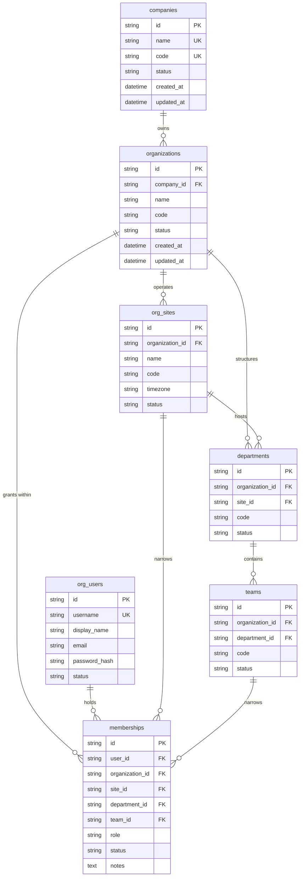

| Table | Business key | Notable columns |
|-------|-------------|-----------------|
| `companies` | `name` unique, `code` unique — globally | The only tenant-parent table; not itself organization-scoped |
| `organizations` | `(company_id, code)` — `uq_org_company_code` | `id` is the tenancy key for the entire platform |
| `org_sites` | `(organization_id, code)` — `uq_site_org_code` | `timezone` defaults to `UTC`; drives local-time presentation |
| `departments` | `(organization_id, code)` — `uq_dept_org_code` | `site_id` nullable — a department may span sites |
| `teams` | `(department_id, code)` — `uq_team_dept_code` | Always inside a department |
| `org_users` | `username` unique globally | `password_hash String(255)` (Argon2id PHC strings; legacy SHA-256 hex still readable until rehash); `platform_role`; the directory identity |
| `memberships` | `(user_id, organization_id, site_id, department_id, team_id, role)` — `uq_membership_scope` | `role` defaults to `Viewer`; composite indexes `ix_memberships_user_org`, `ix_memberships_org_status` |

**Service-enforced invariants beyond the constraints.** A session may only assume an organization in which the user holds an active membership; the effective role is derived from that membership rather than from the login directory; a denied context switch is written to `audit_events` as a security event. Organization-membership roles are restricted to `Operator`, `Reviewer`, and `Viewer` — a membership can never confer `Administrator`.

**Note on `org_users` uniqueness.** `username` is globally unique across the platform, not per company. That is a deliberate simplification of the current identity model and a constraint that federated identity work (see [Identity](../06_Security/Identity.md)) will have to confront: two customers cannot independently own the same username string.

---

### 5.2 Fleet and aircraft

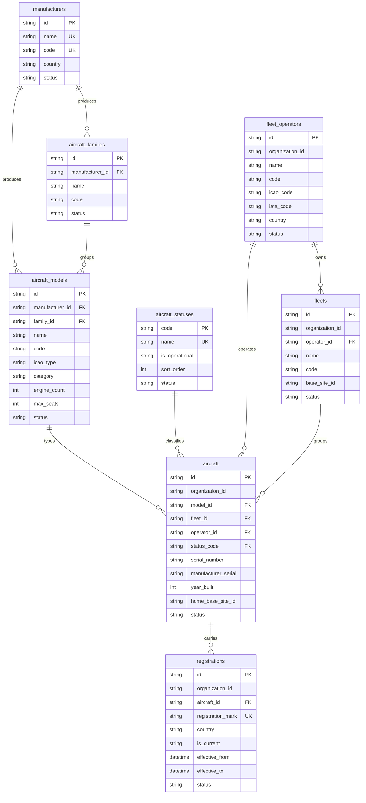

| Table | Tenancy | Business key |
|-------|---------|-------------|
| `manufacturers` | Global reference | `name` and `code`, each unique |
| `aircraft_families` | Global reference | `(manufacturer_id, code)` — `uq_aircraft_family_mfr_code` |
| `aircraft_models` | Global reference | `(manufacturer_id, code)` — `uq_aircraft_model_mfr_code` |
| `aircraft_statuses` | Global reference | `code` is the primary key; `name` unique |
| `fleet_operators` | Tenant | `(organization_id, code)` — `uq_fleet_operator_org_code` |
| `fleets` | Tenant | `(organization_id, code)` — `uq_fleet_org_code` |
| `aircraft` | Tenant | `(organization_id, serial_number)` — `uq_aircraft_org_serial` |
| `registrations` | Tenant | **`registration_mark` unique globally** — `uq_registration_mark` |

**Two model decisions worth stating explicitly.**

*Aircraft identity is the serial number, not the registration.* `uq_aircraft_org_serial` makes the airframe serial the organization-unique identifier, and `registrations` is a separate table with `effective_from` / `effective_to` and an `is_current` flag. This is correct: registration marks change on sale, lease transfer, and re-registration, and the airframe's history must survive the change. The [Digital Aircraft Passport](Digital_Thread.md#7-the-digital-aircraft-passport) depends on this separation.

*Registration mark uniqueness is global, and that is a constraint with a real edge.* `uq_registration_mark` spans all organizations. It correctly reflects reality — a mark is unique in a national register at a point in time — but it means two Mercury tenants cannot both hold a row for the same mark, including for legitimate historical reasons such as a mark reassigned years later to a different airframe. Resolving this requires making the constraint `(registration_mark, is_current)` or moving to a temporal exclusion constraint. It is listed in §13 and must not be changed without an ADR, because relaxing it wrongly would permit two active aircraft to claim one mark.

**Denormalization present by design.** `aircraft.operator_id` duplicates a fact reachable through `fleets.operator_id`, and `maintenance_tasks.registration`, `work_packages.registration`, and `technical_log_entries.registration` copy the registration mark as text. For the evidence tables this is not denormalization to be cleaned up — it is a **point-in-time capture**. The logbook must state the mark the aircraft carried at release, even after the mark changes.

---

### 5.3 Components and configuration

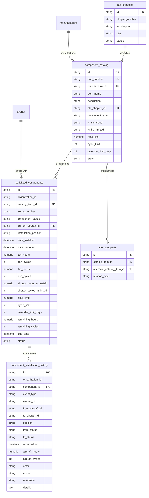

| Constraint | Effect |
|------------|--------|
| `component_catalog.part_number` unique globally | One catalogue entry per part number across the platform. Catalogue is reference data — DM-4. |
| `uq_ata_chapter_sub` on `(chapter_number, subchapter)` | One row per chapter and subchapter pair |
| `uq_component_org_serial` on `(organization_id, serial_number)` | A serial is unique within a tenant. Two tenants may legitimately hold the same serial string for different physical units. |
| **`uq_aircraft_position_occupant` on `(current_aircraft_id, installation_position)`** | **One component per position per aircraft, enforced by the database.** This is the strongest configuration-integrity guarantee in the schema. |
| Composite indexes | `ix_serialized_components_org_status`, `_org_aircraft`, `_org_catalog`; `ix_comp_hist_org_component`, `_org_aircraft`, `_org_event` |

**Life tracking columns.** Four accumulated-life counters (`tsn_hours`, `csn_cycles`, `tso_hours`, `cso_cycles`), the aircraft counters captured at install (`aircraft_hours_at_install`, `aircraft_cycles_at_install`), unit-level limit overrides that shadow the catalogue defaults (`hour_limit`, `cycle_limit`, `calendar_limit_days`), and the derived remaining-life columns (`remaining_hours`, `remaining_cycles`, `due_date`).

The unit-level limits override the catalogue values deliberately: a repaired or modified unit may carry a different limit from its type. The remaining-life columns are **maintained** rather than computed on read — a performance choice that carries a real consistency obligation, discussed in §9.2.

**History is the source of configuration truth.** `serialized_components.current_aircraft_id` and `installation_position` are the *current* state; `component_installation_history` is the *record*. Configuration as of a past date is answered from history, never from current state. `event_type` distinguishes install, remove, transfer, and maintenance release; `from_status` / `to_status` capture the transition; `reference` carries the originating record identifier.

**Named weakness.** `component_installation_history.reference` is `String(120)` free text. It is how a maintenance release traces back to the job card or task that caused it, and it has no foreign key and no format constraint. That makes one of the most valuable thread edges convention-dependent. See [Digital Thread §5.4](Digital_Thread.md#54-weak-edges-and-what-they-cost) and §13 item 4.

---

### 5.4 Publications

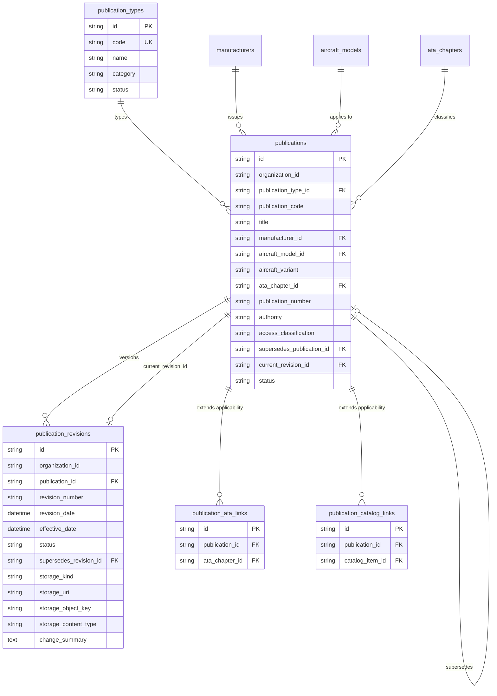

| Constraint | Effect |
|------------|--------|
| `publication_types.code` unique globally | Reference data |
| `uq_publication_org_number` on `(organization_id, publication_number)` | One publication per number per tenant |
| `uq_publication_revision_number` on `(publication_id, revision_number)` | A revision number is used once per publication |
| `publications.current_revision_id` FK with `use_alter` | Deliberate circular reference between the two tables; resolved at DDL time |
| Indexes | `ix_publications_org_type`, `_org_code`, `_org_model`, `_org_mfr`, `_org_ata`, `_org_status`, `_org_title`; `ix_pub_revisions_org_pub`, `_org_status`, `_effective`, `_revision_date` |

**Immutability and the release precondition.** A revision is written once. Correction is a new revision that sets `supersedes_revision_id`. This immutability is what makes the release precondition in §5.6 meaningful: a job card that references `publication_revision_id` references content that cannot subsequently change.

**Content is referenced, not held.** Four storage columns (`storage_kind`, `storage_uri`, `storage_object_key`, `storage_content_type`) plus `storage_notes` form a licence-safe locator. Mercury holds metadata and a pointer. `access_classification` (`public`, `internal`, `restricted`, `licensed`) records the licence posture per publication. This is both a legal boundary and a data-model decision: Mercury must not become a mechanism for redistributing licensed manufacturer content across tenants. A managed object store with integrity checking is on the near-term horizon in [ROADMAP §4](../../ROADMAP.md#4-near-term-horizon--assurance-and-hardening-additive).

**Applicability is resolved from four places** — `aircraft_model_id`, `aircraft_variant`, `ata_chapter_id` on the publication itself, plus the many-to-many `publication_ata_links` and `publication_catalog_links`. Automated applicability evaluation against live configuration is a planning gap, not a schema gap: the links exist and are not yet consumed by an evaluator.

---

### 5.5 Personnel and certification authority

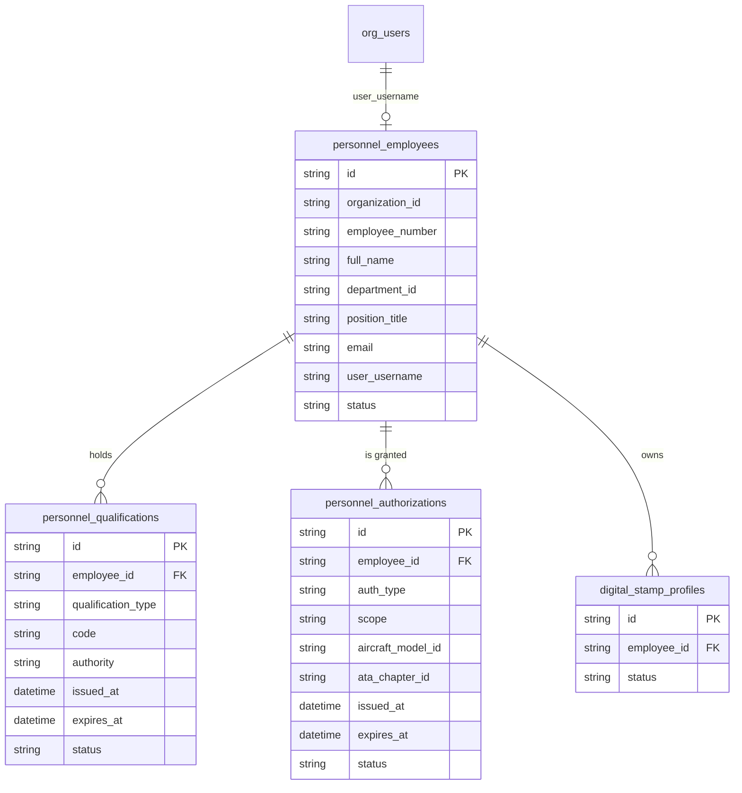

| Constraint | Effect |
|------------|--------|
| `uq_personnel_org_employee_number` on `(organization_id, employee_number)` | Employee number unique per tenant |
| `ix_personnel_employees_org_status`, `_org_username` | Supports signer resolution on the certification path |
| `ix_personnel_qualifications_employee_type`, `ix_personnel_authorizations_employee_type` | Supports authority checks at signing time |

**`user_username` is the signer binding.** It links the employee record to the authenticated directory identity in `org_users.username`. At signing time the service asserts that the employee being signed *as* is bound to the user making the request. Without this column, a permission grant would be sufficient to sign as somebody else — which is exactly the failure the aviation certification model exists to prevent.

**Two independent authority scopes.** `personnel_qualifications` records competence — a licence, a type course, a task authorization — with `authority` and a validity interval. `personnel_authorizations` records granted authority to certify, most significantly the Aircraft Certification Authority, optionally narrowed by `aircraft_model_id` and `ata_chapter_id`. Session role and certification authority are checked separately and both must pass; see [RBAC](../06_Security/RBAC.md).

**Tenancy weakness restated.** Neither child table carries `organization_id`. Scope is only established by joining to `personnel_employees`. Any query, report, or future integration that reads qualifications directly without that join is a tenant-isolation defect waiting to happen. §13 item 2 proposes adding the column.

---

### 5.6 Maintenance execution and evidence

This is the safety-critical core of the schema.

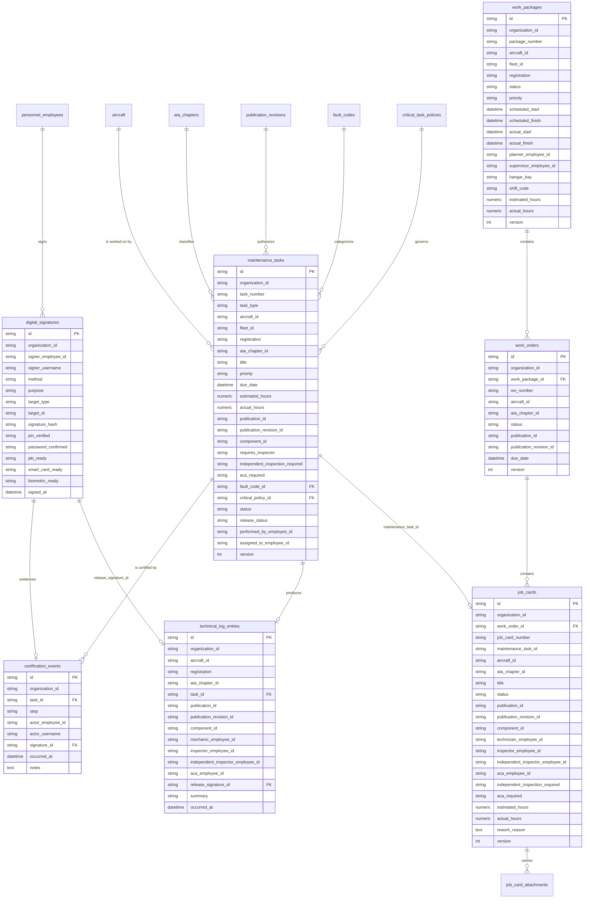

| Table | Business key | Immutable |
|-------|-------------|-----------|
| `maintenance_tasks` | `uq_maintenance_task_org_number` on `(organization_id, task_number)` | No — `version` column supports optimistic concurrency |
| `certification_events` | None; `ix_certification_events_task_step` | **Yes** |
| `digital_signatures` | None; `ix_digital_signatures_org_target` | **Yes** |
| `technical_log_entries` | None; `ix_technical_log_entries_org_aircraft`, `_org_occurred` | **Yes** |
| `work_packages` | `uq_work_package_org_number` on `(organization_id, package_number)` | No — `version` |
| `work_orders` | `uq_work_order_org_number` on `(organization_id, wo_number)` | No — `version` |
| `job_cards` | `uq_job_card_org_number` on `(organization_id, job_card_number)` | No — `version` |

**Optimistic concurrency.** `maintenance_tasks`, `work_packages`, `work_orders`, and `job_cards` carry an integer `version`. Concurrent mutation of a task or card is detected rather than silently last-write-wins. This matters most on the certification path, where two inspectors could otherwise both believe they hold the card.

**The certification chain is not modelled as a state column alone.** `maintenance_tasks.status` and `release_status` are the current state; `certification_events` is the *record* of how that state was reached, one row per step, each optionally bound to a `digital_signatures` row. The steps are `performed`, `inspected`, `independent_inspection`, `aca_certified`, `aircraft_released`.

Invariants the service layer enforces, none of which the database can express:

- Steps are signed in the required order; an out-of-order step is rejected.
- A step is signed at most once per task.
- The independent inspector must be a distinct person from the performer and from the primary inspector.
- Release requires all prior required steps complete, a referenced immutable `publication_revision_id`, and a set `ata_chapter_id`.
- An aircraft release writes exactly one `technical_log_entries` row **in the same transaction** as the release signature.
- A released or finalized task cannot be re-signed.
- Status rolls up: a work package is not complete while any child job card is open.

**`digital_signatures` is polymorphic and therefore unconstrainable.** `target_type` plus `target_id` addresses the signed object — a task, a job card, a logbook entry. No foreign key is possible against a polymorphic reference. `signature_hash String(64)` holds SHA-256 over a canonical payload of organization, target, step, employee, username, method, timestamp, and notes. The five `*_ready` / `*_verified` columns record which credential method was verified.

Stated plainly, because overstatement here would be a compliance problem: **the current scheme attests content and method; it is not certificate-backed non-repudiation.** There is no certificate chain and no hash chain between successive signatures. PKI and smart-card adapters are on the near-term horizon. See [Digital Signatures](../06_Security/Digital_Signatures.md).

**The logbook entry is the passport's evidence row.** `technical_log_entries` names all four signer roles, the release signature, the aircraft, the registration mark as carried at the time, the component if applicable, and the publication revision in force. It is the single row that makes a release provable years later, and it is why the release transaction spans five aggregates — a deviation from one-aggregate-per-transaction that [Domain Architecture §7.2](../02_Architecture/Domain_Architecture.md#72-where-the-domain-deviates-from-one-aggregate-per-transaction) records deliberately.

---

### 5.7 Planning and CAMO

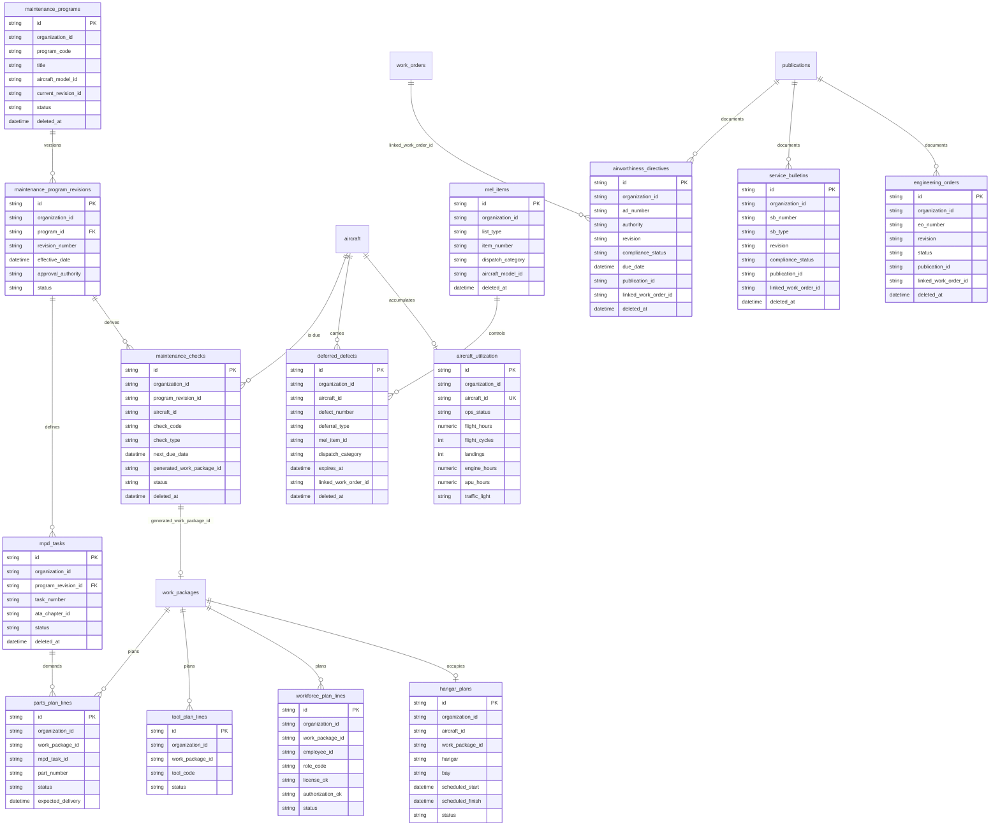

| Table | Business key | Soft delete |
|-------|-------------|-------------|
| `maintenance_programs` | `(organization_id, program_code)` | `deleted_at` |
| `maintenance_program_revisions` | `(program_id, revision_number)` | — |
| `mpd_tasks` | `(program_revision_id, task_number)` | `deleted_at` |
| `maintenance_checks` | None | `deleted_at` |
| `airworthiness_directives` | `(organization_id, ad_number, revision)` | `deleted_at` |
| `service_bulletins` | `(organization_id, sb_number, revision)` | `deleted_at` |
| `engineering_orders` | `(organization_id, eo_number, revision)` | `deleted_at` |
| `mel_items` | `(organization_id, list_type, item_number)` | `deleted_at` |
| `deferred_defects` | `(organization_id, defect_number)` | `deleted_at` |
| `aircraft_utilization` | **`aircraft_id` unique** | — |

**Revision is part of the key for AD, SB, and EO.** `(organization_id, ad_number, revision)` means Revision 2 of an airworthiness directive is a distinct row from Revision 1, and the compliance position against each is separately recorded. This is the correct model: superseding revisions frequently change applicability and compliance method, and collapsing them would destroy the compliance history.

**`aircraft_utilization` is one row per aircraft — current counters only.** `flight_hours`, `flight_cycles`, `landings`, `engine_hours`, `apu_hours` are updated in place, and there is no utilization *history* table. The consequence is precise and worth stating: the forecast can be computed for today, but the utilization state as of an arbitrary past date cannot be reconstructed. A history table is §13 item 9.

**Plan lines join to logistics by business key, not by surrogate.** `parts_plan_lines.part_number` is text matched against `logistics_part_masters.oem_part_number`; `tool_plan_lines.tool_code` is text matched against `logistics_tools.tool_code`. This is the planning-to-logistics partnership expressed as a string join, and it is fragile in exactly the way string joins are: a renamed or superseded part number silently breaks the link. See [Digital Thread §5.4](Digital_Thread.md#54-weak-edges-and-what-they-cost).

**Package generation is the planning-to-execution edge.** `maintenance_checks.generated_work_package_id` records the work package a check produced. A check generates at most one package, enforced in the service layer; a second attempt is rejected.

---

### 5.8 Logistics and stores

Forty-four tables, presented as five clusters rather than one unreadable diagram.

#### 5.8.1 Location hierarchy

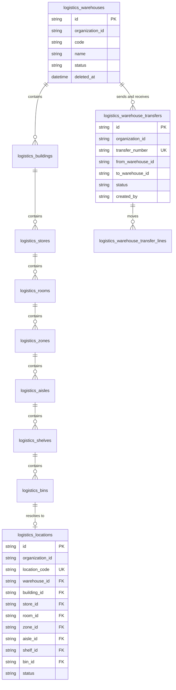

Eight hierarchy levels — warehouse, building, store, room, zone, aisle, shelf, bin — plus `logistics_locations` as a **denormalized resolution table** carrying a foreign key to every level and a single `location_code` unique per organization. Stock and movements address `logistics_locations`, not the hierarchy. This is intentional: a stock query must not join eight tables, and a physical location is a single addressable thing.

#### 5.8.2 Part master and identity

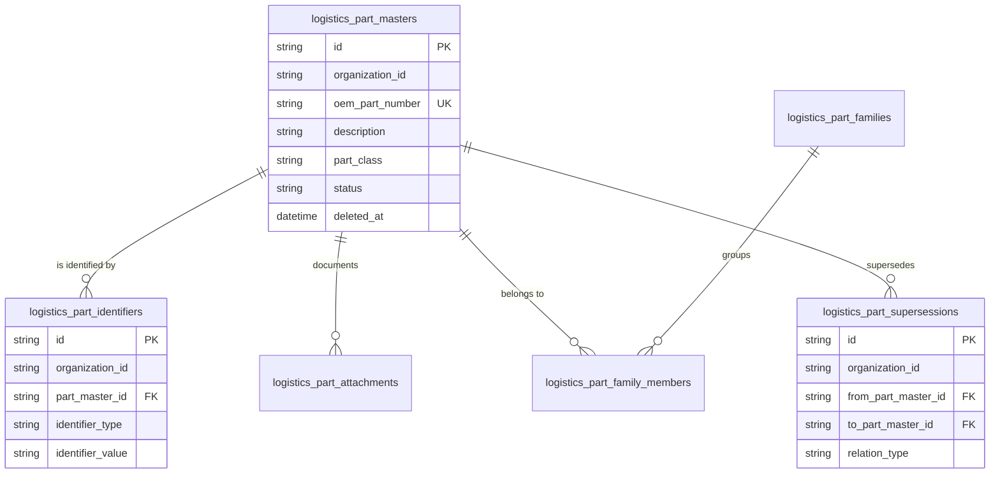

| Constraint | Effect |
|------------|--------|
| `(organization_id, oem_part_number)` unique | Part master is **tenant-owned**, unlike `component_catalog` which is global |
| `(organization_id, identifier_type, identifier_value)` unique | One NSN, barcode, or vendor part number resolves to one part |
| `(from_part_master_id, to_part_master_id, relation_type)` unique | Supersession is typed and recorded once per direction |

The distinction between `component_catalog` (global, engineering type design) and `logistics_part_masters` (tenant, commercial and stores reality) is the most frequently misunderstood pair in the schema. [Master Data §5](Master_Data.md#5-part-master-versus-component-catalogue) is the authority on why they are separate and how they are reconciled.

#### 5.8.3 Stock and the movement ledger

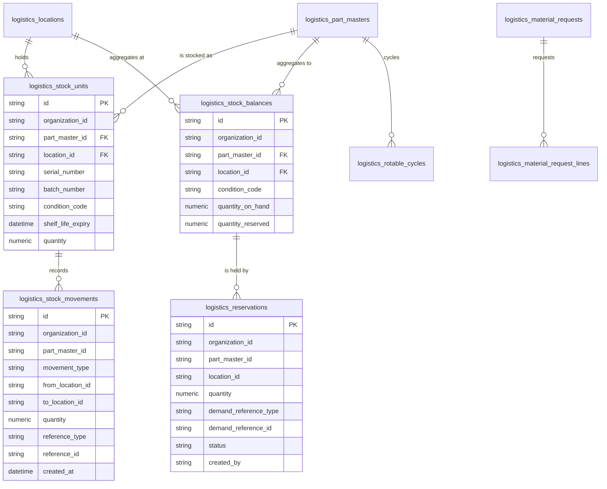

| Constraint | Effect |
|------------|--------|
| `(part_master_id, location_id, condition_code)` unique on `logistics_stock_balances` | Exactly one balance row per part, location, and condition |

`logistics_stock_movements` is the append-only ledger and the fastest-growing table in the platform. Every state change writes a row; `reference_type` and `reference_id` carry the originating demand — a job card, a work package, a transfer, a receipt. Service-enforced invariants: reserved quantity never exceeds on-hand at a location and condition; a reservation that cannot be satisfied at one location is rejected rather than silently split; issue draws by policy, first-expired-first-out by default; condition transitions are explicit.

Balance-to-ledger reconciliation is **not** yet implemented. That is the integrity gap the ledger design exists to make solvable, and it is §13 item 6.

#### 5.8.4 Tools

`logistics_tools` (unique per `(organization_id, tool_code)`, soft-deletable), `logistics_tool_kits`, `logistics_tool_kit_members`, `logistics_shadow_boards`, `logistics_tool_calibrations`, `logistics_tool_issues`, `logistics_tool_reservations`, `logistics_lost_tool_reports`, `logistics_tool_history`.

Service invariants: a tool cannot be issued while an open issue exists against it; a tool with lapsed calibration cannot be reserved as calibration-current. `logistics_lost_tool_reports` exists because a tool unaccounted for in an aircraft is a safety event, not an inventory discrepancy.

#### 5.8.5 Procurement chain

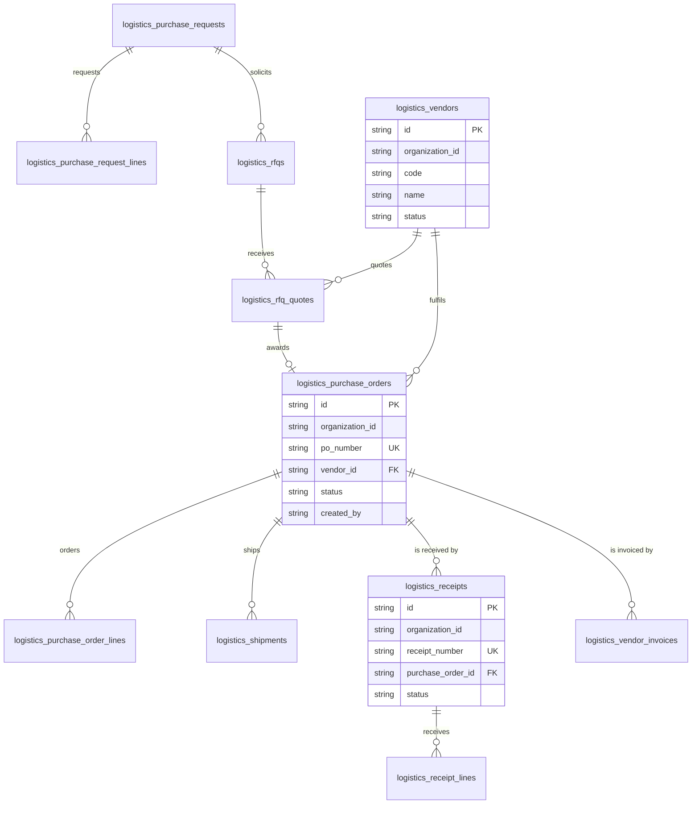

Every document in the chain has an organization-unique number: `request_number`, `rfq_number`, `po_number`, `shipment_number`, `receipt_number`, `invoice_number`. That is what makes the chain auditable end to end — requisition through quotation, order, shipment, receipt with inspection and putaway, to vendor invoice.

**Finance is present as fields, not as a ledger.** Valuation and warranty columns exist on logistics records and are gated by the distinct `logistics.finance` permission scope. Mercury records cost events; it does not perform accounting postings. See [Domain Architecture §5.11](../02_Architecture/Domain_Architecture.md#511-d11--finance--capability-view).

---

### 5.9 Audit and evidence

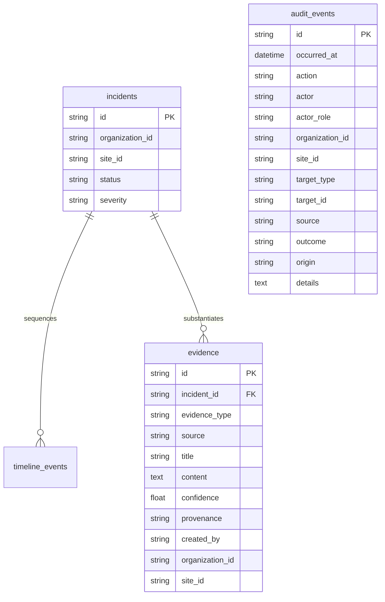

`audit_events` is written from two places: middleware over authenticated mutating API calls, and explicit domain calls at significant transitions. It is never modified or deleted by application code, is queried scoped to the caller's organization and site, and honours a configured retention window.

One trade-off is recorded here so it is a decision rather than a surprise: **audit write failure is logged and does not roll back the business transaction.** Availability of safe work is preferred over guaranteed audit completeness, except on the certification path where audit is fail-closed. See [Audit](../06_Security/Audit.md).

`evidence.provenance` distinguishes `operator_entered` from derived sources, and `confidence` is a float — both because this table originated in the operations domain where evidence quality varies. It is not the same thing as airworthiness evidence, which lives in `technical_log_entries`, `certification_events`, and `digital_signatures`.

---

### 5.10 Operations — honest standing

`incidents`, `timeline_events`, and `evidence` are persisted. **Missions, the global timeline ring buffer, decisions, alerts, and sensor fusion are in-memory only** and do not survive a restart.

The consequence for this document is specific and important: **operations activity is largely outside the persisted data model, and therefore outside the Digital Thread.** Incidents are in; missions and decisions are not. Anyone reasoning about thread completeness must exclude the in-memory operations state. The Command module's standing is characterized in [Product Family §5.1](../05_Product/Product_Family.md#51-m1--command--operations-heritage).

### 5.11 AI-ready structures — schema without payload

| Table | Columns of note | Actual state |
|-------|----------------|--------------|
| `ai_document_index_stubs` | `organization_id` (nullable), `source_type`, `source_id`, `title`, `ata_chapter_id`, `status` default `pending_index` | **No index payload.** Rows record intent to index. |
| `ai_embedding_stubs` | FK to `ai_document_index_stubs.id`, `model_name`, `dimensions`, `status` default `not_computed` | **No vectors stored.** |
| `ai_knowledge_cross_refs` | `from_type`, `from_id`, `to_type`, `to_id`, `relation`; indexes `ix_ai_cross_refs_org_from`, `_org_to` | A typed edge table. Structurally usable; not populated at scale. |

These three tables are the reason [Knowledge Graph](Knowledge_Graph.md) can describe a graph overlay without inventing one. They are the beginning of a projection, not a working retrieval system. **There is no retrieval, no optical character recognition, and no model inference in the current release.** Describing them as an AI capability would be an overstatement.

---

## 6. Referential integrity posture

This section exists because the honest answer is more useful than a flattering one.

### 6.1 Two classes of relationship

| Class | Enforcement | Examples |
|-------|------------|----------|
| **Declared foreign key** | Database-enforced. Orphans impossible. | `organizations.company_id`, `org_sites.organization_id`, `aircraft.model_id`, `serialized_components.catalog_item_id`, `serialized_components.current_aircraft_id`, `component_installation_history.component_id`, `publication_revisions.publication_id`, `personnel_qualifications.employee_id`, `certification_events.task_id`, `certification_events.signature_id`, `technical_log_entries.task_id`, `technical_log_entries.release_signature_id`, `work_orders.work_package_id`, `job_cards.work_order_id`, `maintenance_program_revisions.program_id`, `mpd_tasks.program_revision_id`, and the logistics hierarchy and document chains |
| **Unconstrained `String(80)` reference** | Application-enforced only. Orphans possible. | `maintenance_tasks.aircraft_id`, `maintenance_tasks.component_id`, `maintenance_tasks.publication_revision_id`, `job_cards.maintenance_task_id`, `job_cards.aircraft_id`, `work_packages.aircraft_id`, `digital_signatures.signer_employee_id`, `technical_log_entries.aircraft_id` and its four employee columns, `maintenance_checks.aircraft_id`, `maintenance_checks.generated_work_package_id`, `deferred_defects.aircraft_id`, `aircraft_utilization.aircraft_id`, every `organization_id`, and every planning-to-logistics reference |

Critically, `organization_id` itself is an unconstrained string on tenant tables. Tenancy is enforced by service-layer assertion on every read and write, not by the database.

### 6.2 Why it is this way, and what it costs

The pattern arose from module independence: a domain package declaring a foreign key into another package's table couples their migration order and their extraction path. That is a real architectural benefit, consistent with [Domain Architecture DP-1](../02_Architecture/Domain_Architecture.md#2-design-principles) — the domain owns its data, and cross-context access goes through services.

The cost is equally real:

| Cost | Concrete failure mode |
|------|----------------------|
| Orphan rows are possible | A defect or a direct database edit can leave a job card pointing at a nonexistent aircraft |
| No cascade or restrict semantics | Nothing prevents a referenced row from being withdrawn while dependents reference it |
| Thread traversal cannot be validated by the database | Thread completeness must be verified by application-level checks, which do not yet exist as a scheduled job |
| Tenant isolation depends on uniform service discipline | A single service method that forgets its organization assertion is a cross-tenant leak, and the database will not catch it |

### 6.3 The required compensating controls

Because the database does not enforce these edges, the following are not optional:

1. **Every service method asserts organization access before reading or writing.** Uniform write-scoping is the highest-priority item on the near-term horizon in [ROADMAP §4](../../ROADMAP.md#4-near-term-horizon--assurance-and-hardening-additive).
2. **Cross-context references are resolved through the owning context's service**, which validates existence and tenancy — never by a direct join into another module's tables.
3. **Isolation is tested per module**, not only at the framework level.
4. **A scheduled thread-integrity check** must verify referential completeness across the unconstrained edges. This does not exist yet and is §13 item 3.

---

## 7. Immutability and evidence integrity

| Property | Current state | Gap |
|----------|--------------|-----|
| Append-only evidence tables | Enforced by code discipline; no `updated_at`, no update path | No database-level append-only constraint |
| Signature content attestation | SHA-256 over a canonical payload | Not certificate-backed; no key management |
| Chaining between successive evidence records | **None** | Hash-linked records with periodic anchoring |
| Ledger-to-balance reconciliation | **None** | Scheduled reconciliation of `logistics_stock_movements` against `logistics_stock_balances` |
| Retention | Configurable window on audit queries | Life-of-asset retention with archival tiering |

Tamper-evident chaining of evidence records is the single highest-value integrity upgrade available to Mercury. It converts "we have no update path in the code" into "an alteration is detectable." Until it exists, the honest claim is *append-only by construction and discipline*, not *tamper-evident*.

---

## 8. Soft delete and lifecycle

Two mechanisms coexist, and the distinction is meaningful rather than accidental.

| Mechanism | Where | Semantics |
|-----------|-------|-----------|
| **`status String(40)`** | Nearly every table | Lifecycle state: `active`, `archived`, `cancelled`, `draft`, and domain-specific values |
| **`deleted_at DateTime NULL`** | `maintenance_programs`, `mpd_tasks`, `maintenance_checks`, `airworthiness_directives`, `service_bulletins`, `engineering_orders`, `deferred_defects`, `mel_items`, `logistics_warehouses`, `logistics_part_masters`, `logistics_tools` | Withdrawal: the row is excluded from all normal queries but is retained |

There is **no `is_deleted` column and no `is_active` column anywhere in the schema.** Any query or integration written against those names is wrong.

Why both? Because on planning and logistics master records, *withdrawn* and *inactive* are different facts with different consequences. An airworthiness directive with `status = 'closed'` was complied with. An airworthiness directive with `deleted_at` set was raised in error. Conflating them would corrupt the compliance record. On the tables where that distinction does not arise, `status` alone suffices.

**Binding rules.**

- Queries against soft-deletable tables **must** filter `deleted_at IS NULL`. Omitting the filter surfaces withdrawn records as live ones.
- Nothing in the immutable set of §4.4 is ever soft-deleted. Evidence is not withdrawable.
- Physical deletion of a safety-relevant row is prohibited. Retention and archival policy governs eventual disposition, not application code.

---

## 9. Derived and materialized data

### 9.1 Computed on read — there is no forecast table

The maintenance forecast and due list are **computed at request time** from `maintenance_checks`, `mpd_tasks`, `airworthiness_directives`, `service_bulletins`, `deferred_defects`, and `aircraft_utilization`. `GET /api/v1/planning/forecast` returns a computed projection over 30, 90, 180, and 365-day windows. No forecast row is persisted.

This follows DM-8 and is right for correctness — a stored forecast goes stale the moment utilization changes. It has two consequences that must be stated:

1. **The forecast is not reproducible historically.** Because `aircraft_utilization` holds current counters with no history, "what was due on 1 March" cannot be recomputed. For a document set that emphasizes provability, this is a real gap. §13 item 9.
2. **Forecast cost is borne on every read.** Materializing the due list and recomputing it on utilization change rather than on read is the scaling path, in §10.

### 9.2 Materialized aggregates — the deliberate exceptions

| Materialized | Source of truth | Why materialized | Risk |
|--------------|----------------|------------------|------|
| `logistics_stock_balances` | `logistics_stock_movements` | Availability must be answered in milliseconds during reservation; replaying the ledger cannot meet that | Balance and ledger can diverge with no detection today |
| `serialized_components.remaining_hours`, `remaining_cycles`, `due_date` | Limits minus accumulated life | Life status is read constantly across fleet and passport views | Values are stale if a limit or counter is updated without recomputation |
| `serialized_components.current_aircraft_id`, `installation_position` | `component_installation_history` | Current configuration must be a single indexed lookup | Current state can diverge from history if a write path bypasses the history append |
| `publications.current_revision_id` | `publication_revisions` | The revision in force is on the release critical path | Pointer can lag revision activation |

Each of these is a defensible performance decision. Together they define Mercury's reconciliation obligation: **every materialized aggregate needs a reconciliation job, and none exists yet.** That is one item, §13 item 6, and it covers all four.

---

## 10. Indexing and query patterns

### 10.1 Index sources

| Source | Mechanism |
|--------|-----------|
| Column-level | `index=True` on foreign keys, status columns, codes, and event timestamps |
| Table-level | `__table_args__` composite `Index(...)` and `UniqueConstraint(...)` |
| Bootstrap patches | `ensure_schema()` in `backend/app/database.py` adds `CREATE INDEX IF NOT EXISTS` for SQLite development |

The bootstrap patches are a development convenience. **Indexes required in production must exist in an Alembic migration**, not only in `ensure_schema()`. Relying on the bootstrap in a deployed environment is a defect.

### 10.2 The leading-column rule

Almost every composite index leads with `organization_id`, because almost every query is organization-scoped. `ix_aircraft_org_status`, `ix_maintenance_tasks_org_status`, `ix_job_cards_org_status`, `ix_publications_org_type`, `ix_comp_hist_org_component`, `ix_digital_signatures_org_target` all follow the pattern.

**This is a design rule, not a coincidence.** A new index whose leading column is not `organization_id` on a tenant table requires justification, because it will be scanned across tenants before being filtered by one.

### 10.3 Hot query paths and their support

| Path | Query shape | Index support |
|------|------------|---------------|
| Aircraft configuration | `serialized_components` by organization and `current_aircraft_id` | `ix_serialized_components_org_aircraft` |
| Component history | `component_installation_history` by organization and component | `ix_comp_hist_org_component` |
| Task list by aircraft | `maintenance_tasks` by organization, aircraft, status | `ix_maintenance_tasks_org_aircraft`, `_org_status` |
| Certification chain replay | `certification_events` by task and step | `ix_certification_events_task_step` |
| Signature lookup for a target | `digital_signatures` by organization, target type, target id | `ix_digital_signatures_org_target` |
| Logbook for an aircraft | `technical_log_entries` by organization and aircraft, ordered by `occurred_at` | `ix_technical_log_entries_org_aircraft`, `_org_occurred` |
| Job card queue for a technician | `job_cards` by organization and technician | `ix_job_cards_org_technician` |
| Stock availability | `logistics_stock_balances` by part, location, condition | Unique constraint serves as the index |
| Movement history | `logistics_stock_movements` by organization and `created_at` | Composite org plus timestamp index |
| Publication applicability | `publications` by organization and model, ATA, or manufacturer | `ix_publications_org_model`, `_org_ata`, `_org_mfr` |
| Audit query | `audit_events` by organization, site, `occurred_at`, action | Column-level indexes |

### 10.4 Known query weaknesses

| Weakness | Effect |
|----------|--------|
| Forecast computation joins six tables per request | Grows with fleet size; the reason materialization is on the roadmap |
| Boolean-as-string predicates | Low selectivity on `is_current`, `is_life_limited`, `aca_required` |
| Cross-domain dashboards aggregate on demand | No purpose-built read models; latency grows with tenant size |
| Passport assembly is a multi-domain read | No materialized passport projection; §13 item 1 |
| Planning-to-logistics string joins | Cannot be supported by a foreign-key index; matches on `part_number` text |

---

## 11. Non-functional requirements

### 11.1 Reading the targets

Consistent with [Enterprise Architecture §11.1](../02_Architecture/Enterprise_Architecture.md#111-how-to-read-this-section): **current baseline** is what the runtime demonstrably does. **Aspirational enterprise target** is a directional design target used for sizing and sequencing. Aspirational targets are not service-level agreements and must never be quoted as commitments in a contract or an evaluation.

### 11.2 Integrity

| Requirement | Current baseline | Aspirational enterprise target |
|-------------|-----------------|-------------------------------|
| Tenant isolation on every tenant table | `organization_id` present; enforced by service assertion | Uniform write-scoping verified by test per module; database-level policy where the engine supports it |
| Declared foreign keys on cross-domain edges | Partial — §6.1 | Every thread-critical edge either constrained or covered by a scheduled integrity check |
| Evidence immutability | Code discipline; no update path | Database-level append-only enforcement |
| Evidence tamper evidence | None | Hash-chained records with periodic external anchoring |
| One occupant per aircraft position | **Database-enforced** by `uq_aircraft_position_occupant` | Maintained |
| Balance-to-ledger consistency | No reconciliation | Scheduled reconciliation with alerting on divergence |
| Materialized life values consistent with limits | Maintained on write | Recomputation job plus divergence alerting |
| Child-table tenancy | `personnel_qualifications` and `personnel_authorizations` inherit through parent | `organization_id` added to every tenant-derived child table |

### 11.3 Performance

| Operation | Current baseline | Aspirational enterprise target |
|-----------|-----------------|-------------------------------|
| Aircraft configuration read | Direct indexed query on `serialized_components` | Under 200 ms from a passport read model |
| Certification step write | Row lock on task plus signature, event, and status write in one transaction | 95th percentile under 500 ms |
| Aircraft release | Adds logbook and component history to the same transaction | 95th percentile under 1 second |
| Stock reservation | Availability from `logistics_stock_balances` | 95th percentile under 300 ms |
| Forecast for one aircraft | Computed across six tables | Under 500 ms from a materialized due list |
| Work package generation, 200 job cards | Bounded by a caller-supplied ceiling; material and tool planning inline | Under 5 seconds |
| Component history read, 10-year unit | Indexed scan on history | Under 500 ms with time partitioning |
| Passport assembly | Multi-domain read, no projection | Under 1 second from a materialized projection |

### 11.4 Durability and recoverability

| Data class | Current baseline | Aspirational enterprise target |
|-----------|-----------------|-------------------------------|
| Evidence — signatures, certification events, logbook, audit | Delegated to PostgreSQL and the operator's backup regime | **RPO 0**; synchronous commit and write-ahead replication for evidence tables |
| Transactional — fleet, configuration, planning, logistics | Same | **RPO 15 minutes** |
| Read-only evidence access after failure | Whole-platform restore | **RTO 1 hour** |
| Full write capability after failure | Whole-platform restore | **RTO 4 hours** |
| Retention | Configurable audit window | Life of asset plus the authority-required period, with archival tiering |

The asymmetry is deliberate and worth restating: fifteen minutes of lost stock movements is recoverable by a physical count. A lost release signature is not recoverable at all.

### 11.5 Portability and evolution

| Requirement | Standing |
|-------------|----------|
| One model materializes on SQLite and PostgreSQL | Implemented — the source of the conventions in §4.1 and §4.5 |
| PostgreSQL is the system of record | Non-goal to change — [ROADMAP §8](../../ROADMAP.md#8-explicit-non-goals) |
| Schema changes are additive and Alembic-managed | Implemented |
| No repurposing of existing columns | Requires an ADR |
| Native boolean migration | Planned; requires an ADR because it changes edge serialization |

---

## 12. Security considerations

**`organization_id` is a security control, not a data attribute.** It appears on every tenant table so that isolation is part of identity rather than a filter applied late. Because the column carries no foreign key and no database-level policy, **the entire multi-tenant guarantee rests on uniform service-layer assertion.** A single query path that fetches by primary key without asserting organization is a tenant-isolation breach regardless of how obscure the path is. This is the schema's highest-severity risk and the reason isolation is tested per module.

**Child tables without `organization_id` are the sharpest edge.** `personnel_qualifications` and `personnel_authorizations` can only be scoped by joining `personnel_employees`. These tables gate *certification authority*. A read path that reaches them without the join could return another tenant's authority data, and the query would look correct. Adding the column is §13 item 2 and should be treated as security work rather than modelling tidiness.

**Evidence tables have a repudiation threat model, not a confidentiality one.** For fleet, planning, and logistics the primary risks are unauthorized modification and cross-tenant leakage. For `digital_signatures`, `certification_events`, `technical_log_entries`, and `audit_events` the primary risk is **repudiation** — a signer later denying an act, or a record altered after the fact. That is why those tables are append-only, why the signature hashes a canonical payload, and why chaining is the highest-value hardening available.

**Signature strength must not be overstated.** `signature_hash` plus the `*_verified` and `*_ready` flags attest *what* was signed and *by which method*. There is no certificate chain. Any statement that Mercury provides cryptographic non-repudiation today would be false. See [Digital Signatures](../06_Security/Digital_Signatures.md) and [SECURITY.md](../../SECURITY.md).

**The signer binding is a security column.** `personnel_employees.user_username` is what prevents signing as another person. Session role determines which endpoints a user may call; the employee record, its active status, its qualifications, and its authorizations determine whether that user may sign a given step. Both checks are independent and both must pass. Collapsing them would let a permission grant silently confer certification authority.

**Publication content is a licensing boundary in the schema.** `access_classification` and the storage locator columns exist so Mercury holds metadata and pointers rather than licensed binaries. A future managed content store must preserve per-organization licence scoping. A shared, cross-tenant content store would be a legal exposure, not merely a design shortcut.

**Credentials.** `org_users.password_hash String(255)` holds an Argon2id PHC string (or a legacy SHA-256 hex digest pending login-time upgrade). No plaintext credential, no signing key, and no vendor secret belongs in any table described here.

**Finance columns are separately gated.** Valuation and vendor pricing on logistics records are guarded by the `logistics.finance` permission scope, distinct from general logistics access. A maintenance supervisor seeing part availability must not thereby see vendor pricing.

**Audit is scoped and retention-bounded.** Audit reads are filtered by the caller's organization and site. Audit is terminal: nothing reads audit to make a business decision, which is what keeps it safe to write liberally.

Full detail: [Security documentation set](../06_Security/) · [Identity](../06_Security/Identity.md) · [RBAC](../06_Security/RBAC.md) · [Audit](../06_Security/Audit.md) · [Digital Signatures](../06_Security/Digital_Signatures.md).

---

## 13. Scalability considerations

### 13.1 Growth drivers by table group

| Group | Growth driver | Dominant pressure | Mitigation path |
|-------|--------------|-------------------|-----------------|
| Organization | Tenant count | Membership resolution on every request | Cache membership and effective-role resolution per session |
| Fleet | Aircraft count | Low; bounded by fleet size | None needed near term |
| Components | Units times history events | `component_installation_history` growth | Time-partition history; keep the org-plus-component index leading |
| Publications | Revisions times applicability links | Metadata small; binaries external | Managed object store with signed URLs |
| Personnel | Employees times signatures | `digital_signatures` grows with every certification step | Time-partition; archive with the evidence tier |
| Maintenance | Tasks times certification events times logbook entries | Highest transactional write rate; row locks on state transitions | Keep transactions short; time-partition events and logbook |
| Work execution | Job cards per package times packages | Status rollup queries across children | Composite indexes already in place; consider counters if rollup becomes hot |
| Planning | Forecast recomputation across the fleet | Read-heavy computation over six tables | Materialize the due list; recompute on utilization change rather than on read |
| Logistics | `logistics_stock_movements` — the fastest-growing table in the platform | Ledger volume plus balance row contention | Time-partition movements; consider per-location balance sharding |
| Audit | Every mutating call plus every domain event | Audit volume exceeds business data volume | Time-partition plus cold-tier archival; asynchronous write once a durable bus exists |

### 13.2 Contention points

| Point | Cause | Mitigation |
|-------|-------|-----------|
| `logistics_stock_balances` row for a fast-moving part | Every reservation and issue updates one row | Short transactions; per-location partitioning of hot parts |
| `maintenance_tasks` row during certification | Row lock held across signature, event, and status write | Keep the transaction minimal; never place external calls inside it |
| `publications.current_revision_id` on activation | Circular reference update | Rare event; acceptable |
| Work package generation | One transaction spanning packages, orders, cards, plan lines, and reservations | Caller-supplied job-card ceiling; the atomicity is deliberate |

### 13.3 Partitioning candidates, in priority order

1. `logistics_stock_movements` by time — highest volume.
2. `audit_events` by time — highest volume relative to business value per row.
3. `component_installation_history` by time — grows for the life of every unit and must stay queryable for decades.
4. `digital_signatures` and `certification_events` by time — evidence tier, archived together.
5. `technical_log_entries` by time — smaller but must remain readable for the life of the asset.

### 13.4 What must survive any decomposition

If domain packages are ever extracted into services, the following data properties are non-negotiable and constrain the extraction design:

- `organization_id` asserted on every call, with the caller's principal propagated and re-verified — never a trusted internal caller.
- Atomic release plus logbook plus component history. Distributing this transaction trades a safety guarantee for a saga.
- Ordered certification enforcement and distinct-signer rules.
- Stock reservation correctness under concurrency.
- A complete audit trail with no gap at a service boundary.

Extraction order is set by domain coupling, not by data volume; see [Domain Architecture §10.2](../02_Architecture/Domain_Architecture.md#102-extraction-order-if-and-when-services-become-necessary).

---

## 14. Future enhancements

Ordered by value per unit of risk. Each item is a data-model change, not a feature.

| # | Enhancement | Tables affected | Value | Depends on |
|---|-------------|----------------|-------|------------|
| 1 | **Digital Aircraft Passport read model** | New projection over fleet, components, maintenance, evidence | One authoritative, fast projection of identity, configuration, life, and evidence for operators, lessors, buyers, and authorities | Stable cross-domain read contract |
| 2 | **`organization_id` on tenant-derived child tables** | `personnel_qualifications`, `personnel_authorizations`, and any comparable child | Closes the sharpest tenant-isolation edge in the schema | Backfill migration |
| 3 | **Scheduled thread-integrity check** | All unconstrained reference columns in §6.1 | Detects orphans that the database cannot prevent | Reference registry per column |
| 4 | **Typed originating reference on history and movements** | `component_installation_history.reference`, `logistics_stock_movements.reference_type` / `reference_id` | Makes the release-to-job-card and issue-to-card edges machine-traversable instead of conventional | Reference-type enumeration |
| 5 | **Tamper-evident evidence chaining** | `digital_signatures`, `certification_events`, `technical_log_entries`, `audit_events` | Converts append-only-by-discipline into alteration-detectable | Append-only store, anchoring design |
| 6 | **Reconciliation jobs for all materialized aggregates** | `logistics_stock_balances`, `serialized_components` life columns, `publications.current_revision_id`, current configuration versus history | Detects divergence between derived values and their sources | Scheduler |
| 7 | **Native boolean columns** | Every `String(10)` boolean | Removes a class of silent data defects and improves predicate quality | ADR; coordinated edge-serialization change |
| 8 | **Materialized due list** | New projection over planning tables | Removes six-table computation from every forecast read | Recompute-on-utilization-change trigger |
| 9 | **Utilization history** | New `aircraft_utilization_history` alongside current counters | Makes the forecast historically reproducible and enables reliability analysis | Retention policy |
| 10 | **Assembly hierarchy with next-higher-assembly rollup** | `serialized_components` self-reference | Accurate life tracking on nested components | Rollup semantics definition |
| 11 | **Lease and ownership as first-class fleet records** | New tables under fleet | Correct asset attribution for lessors and financiers; a prerequisite for lessor-facing passport views | Fleet model extension |
| 12 | **Managed object storage for binaries** | `publication_revisions` storage columns, `job_card_attachments`, `logistics_part_attachments` | Integrity-checked content with per-organization licence scoping | Object store, signed URL scheme |
| 13 | **Uniform `created_by` and `updated_by`** | All mutable tables | Authorship without depending solely on the audit trail | Backfill strategy |
| 14 | **Temporal registration constraint** | `registrations` | Permits historically legitimate reuse of a mark while still preventing two active claims | ADR; exclusion constraint |
| 15 | **Time partitioning** | `logistics_stock_movements`, `audit_events`, `component_installation_history`, `digital_signatures`, `certification_events` | Sustains decade-scale volume | PostgreSQL partitioning strategy |
| 16 | **Cross-organization sharing construct** | New tables under organization | Lets a lessor, shop, or authority read scoped data without being granted tenancy | Explicit, audited sharing aggregate |
| 17 | **Labour cost and package cost rollup** | New tables referencing job cards and work packages | True maintenance cost per event | Rate model, actual-hours capture |
| 18 | **Graph projection tables** | Beyond `ai_knowledge_cross_refs` | Backs the overlay described in [Knowledge Graph](Knowledge_Graph.md) | Projection contract, provenance model |

---

## 15. Related documents

**Data set**
[Digital Thread](Digital_Thread.md) · [Master Data](Master_Data.md) · [Knowledge Graph](Knowledge_Graph.md)

**Architecture**
[Enterprise Architecture](../02_Architecture/Enterprise_Architecture.md) · [Domain Architecture](../02_Architecture/Domain_Architecture.md) · [System Context](../02_Architecture/System_Context.md) · [Technical Architecture](../02_Architecture/Technical_Architecture.md)

**Security**
[Security documentation set](../06_Security/) · [Identity](../06_Security/Identity.md) · [RBAC](../06_Security/RBAC.md) · [Audit](../06_Security/Audit.md) · [Digital Signatures](../06_Security/Digital_Signatures.md) · [SECURITY.md](../../SECURITY.md)

**Product**
[Product Family](../05_Product/Product_Family.md) · [Editions](../05_Product/Editions.md) · [Pricing Strategy](../05_Product/Pricing_Strategy.md)

**Standards and governance**
[API Standards](../08_Standards/API_Standards.md) · [Coding Standards](../08_Standards/Coding_Standards.md) · [ADR register](../08_Standards/ADR/) · [CONTRIBUTING](../../CONTRIBUTING.md)

**Business — who depends on these tables**
[Business documentation set](../03_Business/) · [Airline](../03_Business/Airline.md) · [MRO](../03_Business/MRO.md) · [CAMO](../03_Business/CAMO.md) · [OEM](../03_Business/OEM.md) · [Authority](../03_Business/Authority.md) · [Leasing](../03_Business/Leasing.md)

**AI — what may and may not be done with this data**
[AI documentation set](../07_AI/) · [AI Strategy](../07_AI/AI_Strategy.md) · [Digital Twin](../07_AI/Digital_Twin.md)

**Regulation and delivery**
[Regulations documentation set](../09_Regulations/) · [ROADMAP](../../ROADMAP.md) · [CHANGELOG](../../CHANGELOG.md)

---

*Mercury Technologies — One Digital Thread. One Digital Aircraft Passport. One Aviation Enterprise Operating System.*
