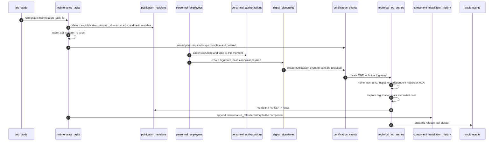
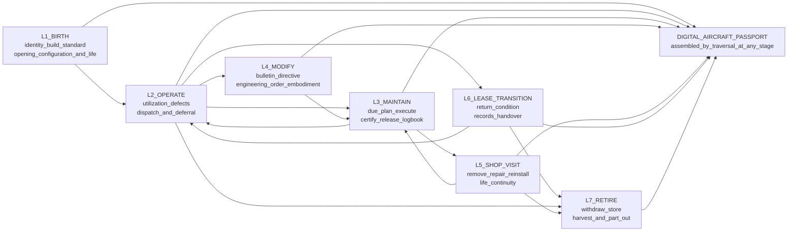
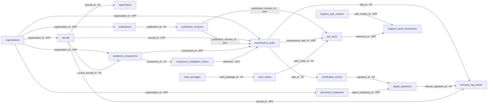
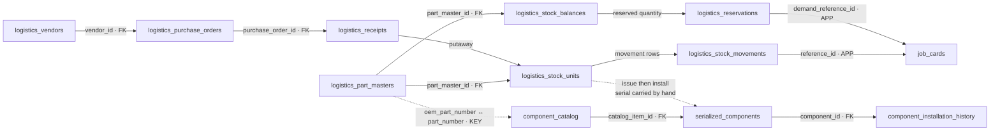
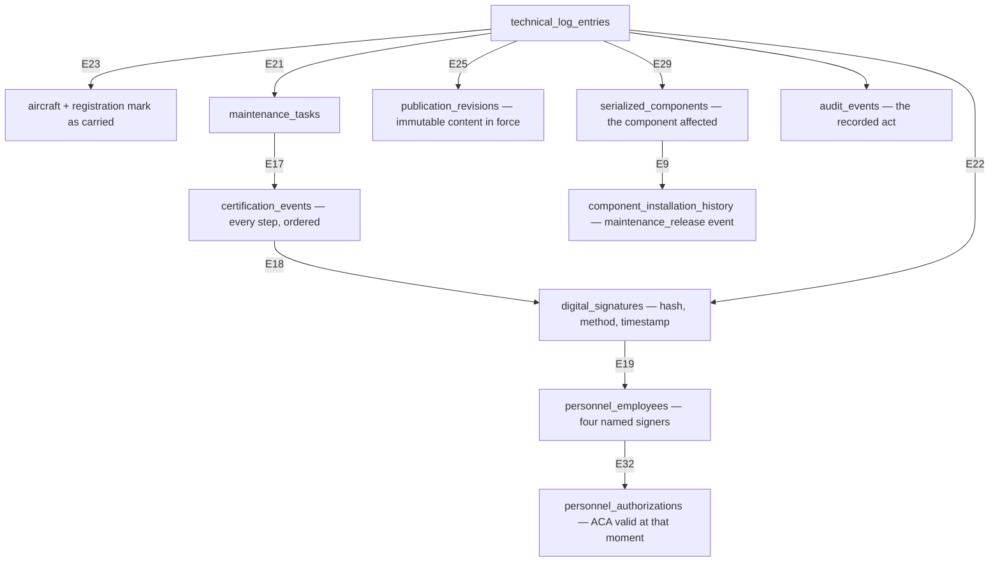
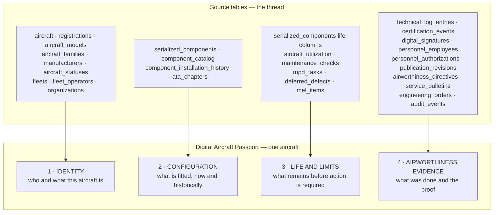

# Digital Thread — Mercury Aviation Enterprise Operating System

| Field | Value |
|-------|-------|
| Document | Digital Thread — the conceptual spine |
| Product | Mercury Aviation Enterprise Operating System (AEOS) |
| Organization | Mercury Technologies |
| Layer | Data (linkage semantics, traversal, evidence continuity) |
| Audience | Architects, domain consultants, data modellers, quality managers, auditors, lessors, integration partners |
| Status | Living baseline — thread edge changes require an ADR |
| Companion documents | [Data Model](Data_Model.md) · [Master Data](Master_Data.md) · [Knowledge Graph](Knowledge_Graph.md) |
| Upstream authority | [VISION.md](../../VISION.md) · [Blueprint README](../../README.md) |

---

## 1. Scope

### 1.1 In scope

This is the **spine document of the Mercury blueprint**. Every other data and product document either supplies a vertebra to the thread or consumes it.

The Digital Thread is the property that **every asset event in Mercury links aircraft, organization, task, part, signature, and publication revision into one continuous, traversable narrative.** Not a report. Not an integration. A structural property of the data model: given any single record, you can walk outward and reconstruct the whole story around it, in both directions, without leaving the platform and without manual reconciliation.

This document defines:

| Section | Content |
|---------|---------|
| §3 | The thread node catalogue — what participates in the thread |
| §4 | The thread event model — what an *asset event* is, what every one must carry, and where events fall across the asset lifecycle from birth to retirement |
| §5 | The **thread edge catalogue** — every link, its column, and whether the database enforces it |
| §6 | Worked traversals — the questions the thread exists to answer, resolved edge by edge |
| §7 | The **Digital Aircraft Passport** — the operator and lessor-facing aggregation |
| §8 | Thread integrity — completeness rules, measures, and honest gaps |
| §9 to §12 | Non-functional requirements, security, scalability, future enhancements |

### 1.2 Out of scope

| Concern | Authoritative location |
|---------|------------------------|
| Tables, columns, keys, indexes, constraint names | [Data Model](Data_Model.md) |
| Reference catalogues, ownership, stewardship | [Master Data](Master_Data.md) |
| Graph overlay and AI projection of the thread | [Knowledge Graph](Knowledge_Graph.md) |
| Bounded contexts, aggregates, transaction boundaries | [Domain Architecture](../02_Architecture/Domain_Architecture.md) |
| Permission matrices, signature cryptography, audit governance | [Security documentation set](../06_Security/) |
| Which stakeholder derives which value from the thread | [Business documentation set](../03_Business/) |
| Commercial packaging of thread-dependent capability | [Editions](../05_Product/Editions.md) · [Pricing Strategy](../05_Product/Pricing_Strategy.md) |
| Regulatory basis for records and evidence | [Regulations documentation set](../09_Regulations/) |

### 1.3 What the thread is not

Three clarifications, because the term is used loosely across the industry:

- **The thread is not a graph database.** It is the relational schema described in [Data Model](Data_Model.md), traversed by foreign keys and by application-resolved references. A graph overlay is described honestly in [Knowledge Graph](Knowledge_Graph.md) as future-facing.
- **The thread is not an integration layer.** It does not connect Mercury to other systems. It connects Mercury's own records to each other, which is precisely what an integration layer between separate systems cannot do.
- **The thread is not complete.** §5.4 and §8 enumerate the edges that are weak, conventional, or missing. A blueprint that claimed a complete thread would be useless for planning the work that completes it.

---

## 2. Design principles

| # | Principle | Statement | Consequence |
|---|-----------|-----------|-------------|
| DT-1 | **Every asset event names its aircraft and its organization** | No event exists in the thread without both anchors. | An event that cannot be attributed to an aircraft within an organization is not a thread event; it is an orphan. |
| DT-2 | **Authority is named on every certifying event** | The person, their employee record, and the signature are recorded — not merely a user session. | This is what makes an event provable rather than merely logged. |
| DT-3 | **Information in force is captured, not referenced loosely** | Work links to an **immutable publication revision**, never to a mutable document. | The content that authorized the work can be produced years later, unchanged. |
| DT-4 | **Material provenance follows the part into configuration** | Receipt, condition, location, issue, install, and removal form one chain on the same physical identity. | "Where did this part come from" is a traversal, not an investigation. |
| DT-5 | **The thread is append-only where it is evidential** | Signatures, certification events, installation history, movements, logbook entries, and audit events are inserted once. | The narrative cannot be quietly rewritten. See [Data Model §4.4](Data_Model.md#44-immutability). |
| DT-6 | **Time is recorded as it happened** | Domain time and system time are distinct columns and are never conflated. | A thread traversed by `occurred_at` reconstructs reality; one traversed by `created_at` reconstructs data entry. |
| DT-7 | **Traversal is bidirectional** | Every edge is designed to be walked from either end. | From a signature to the aircraft; from an aircraft to every signature. Both must be indexed. |
| DT-8 | **A break in the thread is a defect, not a data-quality issue** | An unresolvable reference on a thread-critical edge is treated with the severity of a broken invariant. | §8 defines the measures. Several are not yet automated, and that is stated as a gap rather than implied as coverage. |
| DT-9 | **The passport is a projection, never a second truth** | The Digital Aircraft Passport is assembled from thread records; it stores no independent facts. | A passport that could disagree with the underlying records would be worse than no passport. §7. |
| DT-10 | **Advisory output is not a thread fact** | AI and analytical output enters the thread only as an attributed advisory, never as an evidential record. | No inference may be a precondition for a certification, a release, or a compliance determination. |

---

## 3. Thread node catalogue

### 3.1 The six spine nodes

The thread has six nodes that every asset event must connect. The user-facing shorthand is *aircraft ↔ org ↔ task ↔ part ↔ signature ↔ publication revision*.

| # | Spine node | Primary table | What it anchors |
|---|-----------|---------------|-----------------|
| 1 | **Organization** | `organizations` | Tenancy. The isolation boundary that every other node inherits. |
| 2 | **Aircraft** | `aircraft` | The asset. Identity is the airframe serial, not the registration mark. |
| 3 | **Task** | `maintenance_tasks` | The work. Carries the certification lifecycle and produces the logbook entry. |
| 4 | **Part** | `serialized_components` and `logistics_part_masters` | The physical thing. Two nodes, one physical reality; see §5.3. |
| 5 | **Signature** | `digital_signatures` | The act of authority. Bound to a person, a method, a target, and a content hash. |
| 6 | **Publication revision** | `publication_revisions` | The information in force. Immutable by construction. |

### 3.2 Supporting nodes

| Node | Table | Role in the thread |
|------|-------|--------------------|
| Company | `companies` | Groups organizations for a corporate parent |
| Site | `org_sites` | Narrows an event to a physical location |
| User and membership | `org_users`, `memberships` | The authenticated identity and its scope; bound to the employee node |
| Fleet and operator | `fleets`, `fleet_operators` | Groups aircraft for planning and commercial attribution |
| Registration | `registrations` | The mark carried by an aircraft over a validity interval |
| Model, family, manufacturer | `aircraft_models`, `aircraft_families`, `manufacturers` | Type identity; drives applicability |
| ATA chapter | `ata_chapters` | System classification; the thread's cross-cutting index |
| Component catalogue entry | `component_catalog` | Type-level definition of a part |
| Installation history event | `component_installation_history` | The append-only configuration record |
| Employee, qualification, authorization | `personnel_employees`, `personnel_qualifications`, `personnel_authorizations` | Who, and under what authority |
| Certification event | `certification_events` | One completed step in the certification chain |
| Technical log entry | `technical_log_entries` | The permanent release record |
| Work package, work order, job card | `work_packages`, `work_orders`, `job_cards` | The planned and shop-floor structure of work |
| Programme, revision, MPD task | `maintenance_programs`, `maintenance_program_revisions`, `mpd_tasks` | The approved basis for scheduled work |
| Check | `maintenance_checks` | A due scheduled event; generates a package |
| AD, SB, EO | `airworthiness_directives`, `service_bulletins`, `engineering_orders` | Mandated and manufacturer-instructed work |
| MEL item, deferred defect | `mel_items`, `deferred_defects` | Controlled dispatch with inoperative items |
| Utilization | `aircraft_utilization` | The counters that drive due computation |
| Stock unit, balance, movement, reservation | `logistics_stock_units`, `logistics_stock_balances`, `logistics_stock_movements`, `logistics_reservations` | Physical supply state and its ledger |
| Location | `logistics_locations` | Where a physical thing is |
| Tool, calibration, issue | `logistics_tools`, `logistics_tool_calibrations`, `logistics_tool_issues` | Controlled equipment and its currency |
| Vendor and procurement chain | `logistics_vendors`, requests, RFQs, quotes, orders, shipments, receipts, invoices | Commercial provenance |
| Audit event | `audit_events` | Who did what to which record, with what outcome |

### 3.3 What is deliberately outside the thread

Being precise here matters more than being expansive.

| Excluded | Reason |
|----------|--------|
| Missions, the global timeline ring buffer, decisions, alerts, sensor fusion | **In-memory only; not persisted.** They do not survive a restart and therefore cannot participate in a durable narrative. See [Data Model §5.10](Data_Model.md#510-operations--honest-standing). |
| `incidents`, `timeline_events`, `evidence` | Persisted, but they belong to the operations domain and are not linked to aircraft configuration or airworthiness evidence. They are adjacent to the thread, not part of it. |
| AI index, embedding, and cross-reference rows | Schema exists without payload. A projection of the thread, not a member of it. See [Knowledge Graph](Knowledge_Graph.md). |
| Advisory decision output | DT-10. Enters only as an attributed advisory. |
| Derived forecast values | Computed on read; no persisted row. See [Data Model §9.1](Data_Model.md#91-computed-on-read--there-is-no-forecast-table). |

---

## 4. The thread event model

### 4.1 Definition

An **asset event** is a persisted record of something that happened to, with, or about an aircraft or a component. Every asset event is required to carry the following. This is the thread's contract, and it is the single most important table in this document.

| Required anchor | Column pattern | Purpose |
|-----------------|---------------|---------|
| **Organization** | `organization_id` | Tenancy. Without it the event is unattributable and a leak risk. |
| **Aircraft or component** | `aircraft_id`, `component_id`, or a parent that carries one | The asset the event concerns. |
| **Domain time** | `occurred_at`, `signed_at`, or an equivalent | When it happened, distinct from when it was recorded. |
| **Actor** | `actor`, `actor_username`, `signer_employee_id`, `created_by`, or an audit row | Who caused it. |
| **Originating reference** | `reference`, `reference_id`, `task_id`, `demand_reference_id` | The record that caused it, so the chain can be walked backwards. |
| **Authority, where the event certifies** | `signature_id`, `release_signature_id` | The act that makes it provable. |
| **Information in force, where the event performs work** | `publication_revision_id` | What authorized the method. |

### 4.2 The canonical asset events

| Event | Table | Aircraft anchor | Time | Actor | Authority | Revision |
|-------|-------|----------------|------|-------|-----------|----------|
| Component installed | `component_installation_history` (`event_type = install`) | `aircraft_id` | `occurred_at` | `actor` | — | — |
| Component removed | `component_installation_history` (`remove`) | `from_aircraft_id` | `occurred_at` | `actor` | — | — |
| Component transferred | `component_installation_history` (`transfer`) | `from_aircraft_id`, `to_aircraft_id` | `occurred_at` | `actor` | — | — |
| Maintenance release on component | `component_installation_history` (`maintenance_release`) | `aircraft_id` | `occurred_at` | `actor` | via `reference` to the task | via the task |
| Certification step signed | `certification_events` | via `maintenance_tasks.aircraft_id` | `occurred_at` | `actor_employee_id`, `actor_username` | `signature_id` | via the task |
| Signature created | `digital_signatures` | via `target_type` and `target_id` | `signed_at` | `signer_employee_id`, `signer_username` | itself | — |
| **Aircraft released to service** | `technical_log_entries` | `aircraft_id` | `occurred_at` | four employee columns | `release_signature_id` | `publication_revision_id` |
| Job card transitioned | `job_cards` status change plus `audit_events` | `aircraft_id` | audit `occurred_at` | audit `actor` | signature where certifying | `publication_revision_id` |
| Stock received | `logistics_stock_movements` | via job card or work package on the reference | `created_at` | via `audit_events` | — | — |
| Stock issued to work | `logistics_stock_movements` | via `reference_id` to the job card | `created_at` | via `audit_events` | — | — |
| Tool issued and returned | `logistics_tool_issues` | via the job card | issue and return timestamps | issue actor | — | — |
| Check became due | Computed from `maintenance_checks` and `aircraft_utilization` | `aircraft_id` | computed | — | — | via programme revision |
| Work package generated | `work_packages` plus `maintenance_checks.generated_work_package_id` | `aircraft_id` | `created_at` | via `audit_events` | — | via programme revision |
| Compliance recorded against AD, SB, EO | `airworthiness_directives`, `service_bulletins`, `engineering_orders` | applicability plus `linked_work_order_id` | `due_date`, status change | via `audit_events` | via the linked work order's release | `publication_id` |
| Defect deferred | `deferred_defects` | `aircraft_id` | `expires_at`, `created_at` | via `audit_events` | — | via `mel_item_id` |

### 4.3 The release event — the thread's densest point

An aircraft release is where every spine node meets in one transaction. This is the event that defines the thread, and its density is why it deserves a diagram of its own.

**All of that is one transaction.** [Domain Architecture §7.2](../02_Architecture/Domain_Architecture.md#72-where-the-domain-deviates-from-one-aggregate-per-transaction) records this as a deliberate deviation from one-aggregate-per-transaction, justified because a release without its logbook entry is an unrecorded release, and there is no acceptable window in which one exists without the other.

For the thread this transaction is the guarantee that **there is no such thing as a release that cannot be traced.** Every release produces a `technical_log_entries` row naming all four signer roles, the release signature, the aircraft, the mark it carried, the component if applicable, and the revision in force.

### 4.4 Events along the asset lifecycle

The events in §4.2 are not a flat set. They accumulate in stages over an asset life measured in decades, and each stage writes a characteristic group of records. This subsection states which stages the thread genuinely covers and which it covers only in part — because the thread's value is asymmetric across the lifecycle, and knowing where it thins is what makes it plannable.

| # | Lifecycle stage | What happens to the asset | Thread records written | Standing |
|---|----------------|--------------------------|------------------------|----------|
| **L1** | **Birth** — type design, build, entry into service | The airframe acquires identity, a build standard, an initial configuration with opening life, a registration mark, a manual set, and an approved maintenance programme | `aircraft` against an `aircraft_models` row; `registrations`; `serialized_components` at positions with opening `tsn_hours` and `csn_cycles`; `component_installation_history` install events; publications and revisions bound to the model; `maintenance_programs` and its first revision; `aircraft_utilization` opening counters | **Partial.** Entry is fully supported as configuration and opening-balance data capture. There is **no manufacturer build-record or delivery-package import**, so birth data is entered rather than received, and its accuracy is an onboarding quality problem. See [Master Data §11.2](Master_Data.md#112-opening-balances-for-life-tracked-items) |
| **L2** | **Operate** | The aircraft flies, accumulates hours, cycles and landings, develops defects, and is dispatched with or without carried items | `aircraft_utilization` current counters; `deferred_defects` with expiry and controlling reference; `mel_items`; `aircraft.status_code` transitions with `audit_events` | **Partial.** Current state is complete; **utilization history does not exist**, so "what was due on a date two years ago" is not recomputable — §5.4 and §12 item 9 |
| **L3** | **Maintain** — scheduled and unscheduled | Work becomes due, is planned, packaged, executed, inspected, certified, and released | `maintenance_checks` → `work_packages` → `work_orders` → `job_cards` → `maintenance_tasks` → `certification_events` → `digital_signatures` → `technical_log_entries` → `component_installation_history`; plan lines, reservations and `logistics_stock_movements` alongside | **Implemented — the densest and best-covered stage of the lifecycle**, and the one §4.3 describes in full |
| **L4** | **Modify** | Configuration changes against an approved instruction: bulletin embodiment, mandated modification, repair, or a supplemental design change | `service_bulletins`, `airworthiness_directives`, `engineering_orders` with `linked_work_order_id`; install and remove history at the affected positions; the release and its logbook entry | **Partial.** Every element is recorded, but there is **no dedicated modification record** distinguishing a configuration change from routine maintenance, and effectivity is prose rather than a machine-evaluable expression. See [OEM §2.1](../03_Business/OEM.md#21-capability-register) |
| **L5** | **Component exchange and shop visit** | A unit is removed, sent out, repaired or overhauled, and reinstalled here or elsewhere — its life continuing across the boundary | `component_installation_history` remove, transfer and install events; `logistics_rotable_cycles`; stock movements and condition changes; the unit's own life columns | **Partial, and the weakest evidential stage.** Life continuity across a visit performed by another organization depends on a process-carried serial match (E59) rather than a reference. §12 item 15 |
| **L6** | **Lease transition and return** | The asset is assessed against a return standard, its records are handed to a counterparty, and it moves to a new operator | No records of its own. The stage is served entirely by traversal — the four passport faces in §7 read across identity, configuration, life, and evidence | **Partial.** The facts exist; **lease and ownership are not modelled** (§7.2 Face 1), there is no evidence-pack export, and there is no way to grant a counterparty scoped read access without granting tenancy. This is the stage where the thread's gaps cost the most money |
| **L7** | **Retire, store, or part out** | The aircraft is withdrawn from service; units with remaining life are harvested and returned to stock | `aircraft.status_code` transition to a stored or withdrawn status; component removals with history; stock receipt of harvested units | **Partial.** The status transition and the component removals are recorded. There is **no teardown or part-out record** tying a harvested unit's onward life to the airframe it came from beyond its history rows |

Two properties of that diagram matter more than the stages themselves.

**The thread is read backwards far more often than it is written.** L3 and L4 write most of the records, but the questions that decide money and airworthiness are asked at L6 and L7, sometimes twenty years later, by someone who was not present for any of it. That is why append-only evidence (DT-5) and immutable revisions (DT-3) are non-negotiable rather than stylistic: they are what make a stage readable long after the people who wrote it have moved on.

**Every weak stage is a stage that crosses an organizational boundary.** L1 receives data from a manufacturer, L5 hands a unit to a shop, L6 hands an asset to a lessor or a new operator, L7 disperses units into a market. L2 through L4 are strong precisely because they happen inside one tenancy. The single structural fix that strengthens four of the seven stages is therefore the **cross-organization scoped sharing construct** — §12 item 4 — and that is the reason it ranks where it does rather than lower.

---

## 5. Thread edge catalogue

Each edge below states the tables it joins, the column that carries it, whether the **database** enforces it, and whether the edge is traversable in both directions with index support.

Legend: **FK** = declared foreign key, database-enforced. **APP** = unconstrained `String(80)` reference, application-enforced only. **KEY** = business-key text match, no constraint. See [Data Model §6](Data_Model.md#6-referential-integrity-posture) for why both classes exist and what the weaker class costs.

### 5.1 Spine edges

These are the edges the thread cannot lose.

| # | Edge | Column | Class | Reverse traversal |
|---|------|--------|-------|-------------------|
| E1 | Organization → every tenant record | `organization_id` | **APP** | Indexed as the leading column of nearly every composite index |
| E2 | Company → organization | `organizations.company_id` | FK | Indexed |
| E3 | Aircraft → registration | `registrations.aircraft_id` | FK | `ix_registrations_org_aircraft`, `ix_registrations_org_current` |
| E4 | Aircraft model → aircraft | `aircraft.model_id` | FK | Indexed |
| E5 | Aircraft status → aircraft | `aircraft.status_code` | FK | `ix_aircraft_org_status_code` |
| E6 | Fleet → aircraft, operator → aircraft | `aircraft.fleet_id`, `aircraft.operator_id` | FK | Indexed |
| E7 | **Aircraft → installed component** | `serialized_components.current_aircraft_id` | FK | `ix_serialized_components_org_aircraft`; plus `uq_aircraft_position_occupant` guarantees one occupant per position |
| E8 | Catalogue entry → serialized component | `serialized_components.catalog_item_id` | FK | `ix_serialized_components_org_catalog` |
| E9 | **Component → installation history** | `component_installation_history.component_id` | FK | `ix_comp_hist_org_component` |
| E10 | History event → aircraft | `aircraft_id`, `from_aircraft_id`, `to_aircraft_id` | **APP** | `ix_comp_hist_org_aircraft` |
| E11 | **Aircraft → maintenance task** | `maintenance_tasks.aircraft_id` | **APP** | `ix_maintenance_tasks_org_aircraft` |
| E12 | Component → maintenance task | `maintenance_tasks.component_id` | **APP** | Column-level index |
| E13 | **Publication revision → task** | `maintenance_tasks.publication_revision_id` | **APP** | `ix_maintenance_tasks_org_pub` |
| E14 | Publication → revision | `publication_revisions.publication_id` | FK | `ix_pub_revisions_org_pub` |
| E15 | Publication → current revision | `publications.current_revision_id` | FK, `use_alter` | Indexed |
| E16 | Revision → superseded revision | `publication_revisions.supersedes_revision_id` | FK | Indexed |
| E17 | **Task → certification event** | `certification_events.task_id` | FK | `ix_certification_events_task_step` |
| E18 | **Certification event → signature** | `certification_events.signature_id` | FK | Indexed |
| E19 | Employee → signature | `digital_signatures.signer_employee_id` | **APP** | Column-level index |
| E20 | Signature → signed target | `target_type` plus `target_id` | **APP**, polymorphic | `ix_digital_signatures_org_target` |
| E21 | **Task → technical log entry** | `technical_log_entries.task_id` | FK | Indexed |
| E22 | **Release signature → log entry** | `technical_log_entries.release_signature_id` | FK | Indexed |
| E23 | Log entry → aircraft | `technical_log_entries.aircraft_id` | **APP** | `ix_technical_log_entries_org_aircraft`, `_org_occurred` |
| E24 | Log entry → the four signers | `mechanic_employee_id`, `inspector_employee_id`, `independent_inspector_employee_id`, `aca_employee_id` | **APP** | Not individually indexed |
| E25 | Log entry → revision in force | `publication_revision_id` | **APP** | Not indexed |
| E26 | Work package → work order | `work_orders.work_package_id` | FK | `ix_work_orders_package` |
| E27 | Work order → job card | `job_cards.work_order_id` | FK | `ix_job_cards_work_order` |
| E28 | **Job card → maintenance task** | `job_cards.maintenance_task_id` | **APP** | Column-level index |
| E29 | Job card → aircraft, component, revision | `aircraft_id`, `component_id`, `publication_revision_id` | **APP** | Column-level indexes |
| E30 | Job card → assigned people | `technician_employee_id`, `inspector_employee_id`, `independent_inspector_employee_id`, `aca_employee_id` | **APP** | `ix_job_cards_org_technician` |
| E31 | Employee → user identity | `personnel_employees.user_username` | **APP** | `ix_personnel_employees_org_username` |
| E32 | Employee → qualification, authorization | `employee_id` | FK | Indexed by employee and type |
| E33 | ATA chapter → task, job card, work order, log entry, publication, catalogue entry, authorization | `ata_chapter_id` | Mixed — FK on publications and catalogue, **APP** elsewhere | Indexed on the high-traffic paths |

### 5.2 Planning edges

| # | Edge | Column | Class |
|---|------|--------|-------|
| E34 | Programme → revision | `maintenance_program_revisions.program_id` | FK |
| E35 | Programme revision → MPD task | `mpd_tasks.program_revision_id` | FK |
| E36 | Programme revision → check | `maintenance_checks.program_revision_id` | **APP** |
| E37 | Aircraft → check | `maintenance_checks.aircraft_id` | **APP** |
| E38 | **Check → generated work package** | `maintenance_checks.generated_work_package_id` | **APP** |
| E39 | Aircraft → utilization | `aircraft_utilization.aircraft_id`, unique | **APP** |
| E40 | Publication → AD, SB, EO | `publication_id` | **APP** |
| E41 | AD, SB, EO → linked work order | `linked_work_order_id` | **APP** |
| E42 | MEL item → deferred defect | `deferred_defects.mel_item_id` | **APP** |
| E43 | Aircraft → deferred defect | `deferred_defects.aircraft_id` | **APP** |
| E44 | Work package → plan lines | `parts_plan_lines.work_package_id`, `tool_plan_lines.work_package_id`, `workforce_plan_lines.work_package_id`, `hangar_plans.work_package_id` | **APP** |
| E45 | MPD task → parts plan line | `parts_plan_lines.mpd_task_id` | **APP** |
| E46 | Employee → workforce plan line | `workforce_plan_lines.employee_id` | **APP** |

Edge **E38** is the planning-to-execution seam: a check generates at most one work package, and that identifier is how a completed package closes a check and drives forecast recalculation. Edge **E41** is the compliance seam: an airworthiness directive is discharged by a work order, and its release evidence is reachable through that link.

### 5.3 Supply and provenance edges

The part node is two records — a tenant part master and, where the part is a tracked component, a serialized component referencing a global catalogue entry. See [Master Data §5](Master_Data.md#5-part-master-versus-component-catalogue).

| # | Edge | Column | Class |
|---|------|--------|-------|
| E47 | Part master → stock unit, balance | `part_master_id` | FK |
| E48 | Location → stock unit, balance | `location_id` | FK |
| E49 | Stock unit → movement | movement rows reference part and location | **APP** |
| E50 | **Movement → originating demand** | `reference_type` plus `reference_id` | **APP**, polymorphic |
| E51 | **Reservation → demand** | `demand_reference_type` plus `demand_reference_id` | **APP**, polymorphic |
| E52 | Vendor → purchase order, quote, shipment, invoice | `vendor_id` | FK |
| E53 | Purchase order → receipt → receipt line | `purchase_order_id`, `receipt_id` | FK |
| E54 | Part master → identifiers, families, supersessions, attachments | `part_master_id` | FK |
| E55 | Tool → issue, reservation, calibration | `tool_id` | FK |
| E56 | Tool code → tool plan line | `tool_plan_lines.tool_code` | **KEY** |
| E57 | Part number → parts plan line | `parts_plan_lines.part_number` | **KEY** |
| E58 | **Catalogue entry ↔ part master** | `part_number` ↔ `oem_part_number` | **KEY** |
| E59 | **Stock unit → serialized component** | Serial number carried across at issue and install | **KEY**, by process |
| E60 | Rotable cycle → part master | `part_master_id` | FK |

### 5.4 Weak edges and what they cost

This section exists so nobody plans on a thread stronger than the one that exists. Each weak edge is named, its failure mode is stated concretely, and the compensating control is identified.

| Edge | Weakness | Concrete failure mode | Compensating control today | Fix |
|------|----------|----------------------|---------------------------|-----|
| **E58** catalogue ↔ part master | Text match on part number, no column | A part number formatted with different spacing exists in both tables and does not match. A stocked part appears to have no type definition, so life limits are not inherited at creation and a life-limited part can be treated as non-tracked. | Normalization rules at data entry ([Master Data §10.3](Master_Data.md#103-normalization-rules)); process rule that a trackable part must have a catalogue entry before a part master | Typed link column |
| **E59** stock unit → serialized component | Serial number carried by process, not by reference | A transcription difference between the stock unit's serial and the component's serial breaks provenance exactly where a lessor or authority looks for it | Serial normalization; never reformat between the two | Explicit reference from component to originating stock unit |
| **E57, E56** plan line → part or tool | Business-key text join | A renamed or superseded part number silently orphans the plan line. Material appears unplanned, or planned against nothing. | Codes treated as stable master data | Surrogate reference with supersession resolution |
| **`component_installation_history.reference`** | Free-text `String(120)`, no format rule | The maintenance-release history event cannot be reliably walked back to the job card that caused it. The configuration-to-evidence edge becomes conventional. | Convention in the release path | Typed `reference_type` plus `reference_id` |
| **E50, E51** movement and reservation references | Polymorphic strings | An issue cannot be reliably attributed to its job card, so material consumption per work package is not dependable | Written consistently by the issue path | Reference-type enumeration and validation |
| **E20** signature → target | Polymorphic by nature; no foreign key is possible | A signature could reference a target that no longer resolves | `ix_digital_signatures_org_target` supports the reverse lookup; the target is never deleted | Validation on insert against a type registry |
| **E1** organization → everything | `organization_id` has no constraint and no database policy | A service method that omits its organization assertion leaks across tenants, and the database will not catch it | Service-layer assertion on every read and write; per-module isolation tests | Uniform write-scoping, verified by test; database-level policy where the engine supports it |
| **E24, E25** log entry signers and revision | Unindexed reverse traversal | "Every release this ACA signed" and "every task performed against this revision" are table scans | Acceptable at current volume | Add indexes |
| Utilization history | **No table.** Only current counters exist | "What was due on 1 March" cannot be recomputed, so a historical forecast is not reproducible | None | Utilization history table |
| Operations events | In-memory; not persisted | Missions, decisions, and the global timeline contribute nothing to the durable narrative | None; the limitation is stated rather than mitigated | Persist what belongs in the thread; leave simulation out |

**The single highest-severity item in this table is E1.** Every other weakness produces an incomplete narrative. E1 produces a cross-tenant disclosure. Uniform write-scoping is correspondingly the first item on the near-term horizon in [ROADMAP §4](../../ROADMAP.md#4-near-term-horizon--assurance-and-hardening-additive).

---

## 6. Thread traversals

Each traversal below is a real question a customer asks, resolved as a sequence of edges. These are the acceptance criteria for the thread.

### 6.1 "Prove this release was valid"

Start: one `technical_log_entries` row.

Every step resolves. Three qualifications must accompany any claim made from this traversal:

- The signature attests content and method. It is **not** certificate-backed non-repudiation; there is no certificate chain. See [Digital Signatures](../06_Security/Digital_Signatures.md).
- Records are append-only by construction and discipline, **not** tamper-evident. No hash chain links successive records.
- Authority validity is asserted at signing time and the authorization row retains its interval, so the check is reproducible.

### 6.2 "What is fitted to this aircraft, and how much life remains?"

`aircraft` → E7 → `serialized_components` filtered to the aircraft → E8 → `component_catalog` for type, ATA, and designed limits.

Life comes from the unit: `tsn_hours`, `csn_cycles`, `tso_hours`, `cso_cycles`, unit-level limits that override the catalogue, and the maintained `remaining_hours`, `remaining_cycles`, `due_date`. Position occupancy is guaranteed unique by `uq_aircraft_position_occupant`.

Two honest notes. The remaining-life columns are **maintained rather than recomputed on read**, so they depend on write-path correctness and have no reconciliation job today ([Data Model §9.2](Data_Model.md#92-materialized-aggregates--the-deliberate-exceptions)). And there is no assembly hierarchy, so life on nested components does not roll up to a next-higher assembly.

### 6.3 "What was fitted on a date two years ago?"

Not from current state — from history. `component_installation_history` for the aircraft, filtered to `occurred_at <= target`, reduced per position by taking the latest event before the target and excluding positions whose latest event is a removal or an outbound transfer.

This works because history is append-only and carries `from_status`, `to_status`, `position`, and the aircraft counters at the time. It is the traversal that makes the passport historically defensible, and it is the reason DT-5 is non-negotiable.

### 6.4 "Where did this part come from?"

`serialized_components` → E59 (by serial, process-carried) → `logistics_stock_units` → putaway → `logistics_receipts` → E53 → `logistics_purchase_orders` → E52 → `logistics_vendors`, with `logistics_stock_movements` supplying every state change in between.

**This traversal has the thread's weakest link in it.** E59 is a process-carried serial match, not a reference. Where the serial was transcribed consistently, provenance resolves cleanly. Where it was not, the chain breaks at exactly the point a lessor or auditor cares about. That is why serial normalization is a hard quality rule rather than a preference.

### 6.5 "Which work was authorized by this manual revision?"

`publication_revisions` → E13 → `maintenance_tasks` → E17 → `certification_events`, and separately → `job_cards` via `publication_revision_id`, and → `technical_log_entries` via E25.

This traversal answers the question that arises whenever a revision is found to be defective: *what did we do on the strength of it?* It resolves, but the reverse direction on E25 is unindexed and becomes a scan at scale — §12 item 7.

### 6.6 "Was this airworthiness directive complied with, and where is the evidence?"

`airworthiness_directives` → E41 → `work_orders` → E27 → `job_cards` → E28 → `maintenance_tasks` → E17 and E21 → certification events and the logbook entry. Separately E40 links the AD to the publication documenting it.

Because `(organization_id, ad_number, revision)` is the business key, compliance is tracked per revision. Applicability, however, is a recorded human determination — automated applicability evaluation against live configuration does not exist. See [Master Data §4.6](Master_Data.md#46-publications-as-controlled-master-data).

### 6.7 "What did this work package consume?"

`work_packages` → E26 → `work_orders` → E27 → `job_cards` → E50 → `logistics_stock_movements` where `reference_id` is the job card, plus E44 to the plan lines that expressed the demand and E55 for tool issues.

Actual-versus-planned consumption is answerable to the extent that movement references were written consistently. Labour cost is **not** in the thread: no rate model and no cost rollup exist. See [Domain Architecture §5.11](../02_Architecture/Domain_Architecture.md#511-d11--finance--capability-view).

### 6.8 "Who touched this record, and when?"

`audit_events` filtered by `target_type` and `target_id`, scoped to the caller's organization and site. Audit is written by middleware over authenticated mutating calls and by explicit domain calls at significant transitions.

One trade-off, recorded so it is a decision rather than a surprise: audit write failure is logged and does not roll back the business transaction, except on the certification path where audit is fail-closed. See [Audit](../06_Security/Audit.md).

---

## 7. The Digital Aircraft Passport

### 7.1 Definition

The **Digital Aircraft Passport** is the operator-facing and lessor-facing aggregation of everything the thread knows about one aircraft: **identity, configuration, life limits, and airworthiness evidence** — assembled from thread records, never stored as independent facts.

It is what turns a redelivery from a project into a query, an audit preparation from weeks into a request, and a sale or lease transaction from a document hunt into a scoped read.

Per DT-9, the passport is a **projection**. It holds no fact that is not already in the thread. A passport that could disagree with the underlying records would be worse than no passport, because it would be trusted.

### 7.2 The four faces

#### Face 1 — Identity

| Content | Source | Standing |
|---------|--------|----------|
| Airframe serial, manufacturer serial, year built | `aircraft` | Implemented |
| Current registration mark, country, effective interval | `registrations` where `is_current` | Implemented |
| **Registration history** | `registrations` with `effective_from` and `effective_to` | Implemented — and the reason identity survives a re-registration |
| Model, family, manufacturer, ICAO type, category, engine count | `aircraft_models`, `aircraft_families`, `manufacturers` | Implemented |
| Operational status and whether it counts as operational | `aircraft_statuses` via `status_code` | Implemented |
| Operator, fleet, home base site | `fleet_operators`, `fleets`, `home_base_site_id` | Implemented |
| Owning organization | `organization_id` | Implemented |
| **Ownership and lease structure** | — | **Not modelled.** Lease and ownership are not first-class fleet records. For a lessor-facing passport this is the most conspicuous gap. |

#### Face 2 — Configuration

| Content | Source | Standing |
|---------|--------|----------|
| Currently installed components, by position | `serialized_components` filtered by `current_aircraft_id`; one occupant per position guaranteed by constraint | Implemented |
| Type, ATA classification, serialization and life policy per component | `component_catalog` | Implemented |
| Install date, aircraft counters at install | `serialized_components` | Implemented |
| **Complete installation, removal, and transfer history** | `component_installation_history`, append-only | Implemented |
| Configuration as of any past date | Derived from history — §6.3 | Implemented as a traversal; no materialized projection |
| Interchangeability and approved alternates | `alternate_parts` | Implemented |
| **Assembly hierarchy and next-higher-assembly rollup** | — | **Not modelled.** Nested component life does not roll up. |
| Modification and repair state | Reachable through engineering orders and tasks | Partial — no dedicated modification record |

#### Face 3 — Life and limits

| Content | Source | Standing |
|---------|--------|----------|
| Accumulated life per component: TSN, CSN, TSO, CSO | `serialized_components` | Implemented |
| Applicable limits — unit-level overriding catalogue defaults | `serialized_components`, `component_catalog` | Implemented |
| Remaining hours, cycles, and due date | Maintained columns on `serialized_components` | Implemented — maintained on write, **no reconciliation job** |
| Aircraft utilization: flight hours, cycles, landings, engine and APU hours | `aircraft_utilization` | Implemented — **current counters only, no history** |
| Next due checks with intervals and thresholds | `maintenance_checks`, `mpd_tasks` | Implemented |
| Forecast over 30, 90, 180, 365 days | Computed on read | Implemented — **not historically reproducible** |
| Open deferred defects with expiry and dispatch category | `deferred_defects`, `mel_items` | Implemented |
| Outstanding AD, SB, and EO positions | Planning tables with compliance status per revision | Implemented |

#### Face 4 — Airworthiness evidence

| Content | Source | Standing |
|---------|--------|----------|
| **Every release to service** with all four named signers, the release signature, the ATA chapter, and the revision in force | `technical_log_entries` | Implemented |
| The full certification chain per task, in order | `certification_events` | Implemented |
| Signature records with method, hash, and timestamp | `digital_signatures` | Implemented |
| Signer authority valid at the moment of signing | `personnel_authorizations` with validity interval | Implemented |
| The immutable content that authorized the work | `publication_revisions` | Implemented |
| Compliance position per AD, SB, and EO revision | Planning tables with `linked_work_order_id` | Implemented |
| Component maintenance-release events | `component_installation_history` | Implemented — originating reference is free text |
| Who changed which record, when, with what outcome | `audit_events` | Implemented |
| **Part provenance to vendor** | Supply chain traversal §6.4 | Partial — depends on process-carried serial matching |
| **Tamper evidence** | — | **Not implemented.** Append-only by construction, not alteration-detectable. |
| **Cryptographic non-repudiation** | — | **Not implemented.** Hash attestation only. |
| **One-command evidence pack export** | — | **Not implemented.** Named on the near-term horizon in [ROADMAP §4](../../ROADMAP.md#4-near-term-horizon--assurance-and-hardening-additive). |

### 7.3 Who consumes the passport, and for what

| Consumer | Use | Faces needed | Blocking gap |
|----------|-----|-------------|--------------|
| Operator and CAMO | Continuing airworthiness status, audit readiness | All four | None — this is the delivered case |
| MRO | Incoming aircraft condition, work scoping | 1, 2, 3 | None |
| **Lessor and asset owner** | Return-standard readiness, portfolio condition | All four | Lease and ownership records; scoped cross-organization access |
| Buyer in a transaction | Records completeness and life status | All four | Evidence pack export |
| Aviation authority | Oversight, advisory posture | 2, 4 | Scoped read-only access; tamper evidence strengthens the position |
| Component or engine shop | Unit life continuity across a shop visit | 2, 3 | Shop-visit lifecycle with life continuity |
| Insurer or financier | Asset condition and maintenance discipline | 1, 3 | Ownership records |

Every one of the external consumers needs the same thing structurally: **scoped, audited, read-only access across an organization boundary.** Mercury has no cross-organization sharing construct today. Access is per-organization membership, so serving a lessor means either granting membership — which over-grants — or exporting, which leaves the thread. That construct is the single unlock for four of the seven consumers above, and it is §12 item 4.

### 7.4 Implementation status — stated plainly

**The Digital Aircraft Passport is a specified projection that is assembled by traversal today, not a materialized read model or a single endpoint.**

| Property | Standing |
|----------|----------|
| Every fact the passport needs exists in the thread | **Yes**, except lease and ownership, assembly hierarchy, utilization history, and labour cost |
| A single API returns the passport | **No.** It is assembled across fleet, components, maintenance, planning, and logistics endpoints |
| A materialized projection exists | **No.** Passport assembly is a multi-domain read with no read model |
| Cross-organization scoped access | **No.** No sharing construct |
| One-command evidence pack export | **No.** Named on the near-term horizon |
| Tamper evidence over the evidence face | **No.** Highest-value planned hardening |

Anyone representing the passport to a customer, a lessor, or an authority must present it as *the thread, assembled* — which is true and valuable — and must not present it as a delivered single-view product. The distinction is precisely the kind of overstatement [Company Strategy §10.1](../01_Executive/Company_Strategy.md#101-what-mercury-deliberately-does-not-do) prohibits.

---

## 8. Thread integrity

### 8.1 Completeness rules

A thread event is **complete** when every anchor in §4.1 resolves. The rules below are stated as requirements with their actual enforcement.

| # | Rule | Enforcement today |
|---|------|-------------------|
| TI-1 | Every tenant record carries a resolvable `organization_id` | Service-layer assertion; **no constraint** |
| TI-2 | Every asset event names an aircraft or a component, directly or through a parent | Service-layer; **no constraint** |
| TI-3 | Every certifying event carries a signature bound to an active, authorized employee | **Enforced** at signing |
| TI-4 | Every release references an immutable publication revision | **Enforced** as a release precondition |
| TI-5 | Every release sets an ATA chapter | **Enforced** as a release precondition |
| TI-6 | Every release writes exactly one technical log entry, atomically | **Enforced** in one transaction |
| TI-7 | Certification steps are ordered, signed once, with a distinct independent inspector | **Enforced** in the service layer |
| TI-8 | Every install, remove, transfer, and maintenance release appends history | **Enforced** in the service layer |
| TI-9 | One component per aircraft position at a time | **Enforced by the database** — `uq_aircraft_position_occupant` |
| TI-10 | Every stock state change writes a movement row | **Enforced** in the service layer |
| TI-11 | Reserved quantity never exceeds on-hand at a location and condition | **Enforced** in the service layer |
| TI-12 | A check generates at most one work package | **Enforced** in the service layer |
| TI-13 | Publication revisions are immutable once issued | **Enforced** — no update path |
| TI-14 | Evidence records are never updated or deleted | **Enforced** by discipline; **not** by the database |
| TI-15 | Every unconstrained reference resolves to a live row | **Not enforced and not measured** |
| TI-16 | Materialized aggregates agree with their sources | **Not enforced and not measured** |
| TI-17 | Evidence records are alteration-detectable | **Not implemented** |

Rules TI-3 through TI-13 are genuinely enforced and cannot be bypassed through the API. TI-15, TI-16, and TI-17 are the gaps, and together they define the integrity work ahead.

### 8.2 Thread integrity measures

| Measure | Definition | Target | Automated |
|---------|-----------|--------|-----------|
| **Release traceability** | Releases whose §6.1 traversal fully resolves | 100 percent | No |
| **Configuration continuity** | Components whose current state agrees with the latest history event | 100 percent | No |
| **Provenance completeness** | Serialized components whose §6.4 traversal reaches a vendor | Improving trend | No |
| **Revision binding** | Released tasks referencing a resolvable immutable revision | 100 percent | Enforced at release; not measured after |
| **Demand attribution** | Stock movements against work whose `reference_id` resolves to a live job card | 100 percent | No |
| **Plan-line resolution** | Plan lines whose part number or tool code resolves to a live master record | 100 percent | No |
| **Orphan rate** | Unconstrained references pointing at nothing | Zero | No |
| **Ledger agreement** | Balance rows agreeing with the movement ledger | 100 percent | No |

Read this table as the honest position: **thread integrity is strong at transaction boundaries and unmeasured in the background.** The scheduled thread-integrity check in §12 item 1 is what converts these from aspirations into monitored properties.

### 8.3 Severity when the thread breaks

| Severity | Break | Consequence |
|----------|-------|-------------|
| **Critical** | A release cannot be traced to its signature, signer authority, or revision; a cross-tenant reference | A release that cannot be proved is, for audit purposes, a release that did not happen. A cross-tenant reference is a disclosure. |
| **Critical** | Configuration disagrees with history | The passport states a false configuration, which can support a false airworthiness determination |
| **High** | Provenance chain broken at the stock-to-component handover | Part origin unprovable; a redelivery or transaction finding |
| **High** | Movement not attributable to its demand | Consumption per package unreliable; cost and reliability analysis compromised |
| **Medium** | Plan line unresolvable | Material planning degraded; shortage detection unreliable |
| **Medium** | History event's originating reference unresolvable | Evidence reachable by inference rather than traversal |

---

## 9. Non-functional requirements

### 9.1 Reading the targets

As in [Data Model §11.1](Data_Model.md#111-reading-the-targets): **current baseline** is what the runtime does. **Aspirational enterprise target** is directional, used for sizing and sequencing, and must never be quoted as a service-level commitment.

### 9.2 Traversal performance

| Traversal | Current baseline | Aspirational enterprise target |
|-----------|-----------------|-------------------------------|
| Current configuration for one aircraft | Indexed query on `serialized_components` | Under 200 ms |
| Component history for one unit, ten years | Indexed scan on `ix_comp_hist_org_component` | Under 500 ms |
| Configuration as of a past date | Derived from history per §6.3 | Under 1 second |
| Certification chain replay for one task | `ix_certification_events_task_step` | Under 200 ms |
| Release proof traversal §6.1 | Multi-table read across five domains | Under 1 second |
| Logbook for one aircraft, full life | `ix_technical_log_entries_org_aircraft`, `_org_occurred` | Under 1 second, paginated |
| Provenance traversal §6.4 | Multi-hop across logistics | Under 2 seconds |
| **Full passport assembly** | Multi-domain read, no projection | **Under 2 seconds** from a materialized projection |
| Evidence pack export for one aircraft | Not implemented | Asynchronous, with progress and an integrity manifest |
| Reverse traversal: all releases by one signer | Unindexed scan on `technical_log_entries` employee columns | Under 1 second with an index |

### 9.3 Integrity and durability

| Requirement | Current baseline | Aspirational enterprise target |
|-------------|-----------------|-------------------------------|
| Thread event completeness at write time | Enforced on the certification and release path | Enforced on every asset-event write path |
| Orphan detection on unconstrained edges | None | Scheduled check with alerting on any orphan |
| Evidence durability | PostgreSQL plus the operator's backup regime | **RPO 0** for signatures, certification events, logbook, audit |
| Transactional durability | Same | **RPO 15 minutes** |
| Read-only evidence access after failure | Whole-platform restore | **RTO 1 hour** |
| Evidence retention | Configurable audit window | Life of asset plus the authority-required period, with archival tiering |
| Alteration detectability | None | Hash-chained evidence with periodic external anchoring |
| Atomic release plus logbook plus history | **Implemented** in one transaction | Preserved through any future decomposition — non-negotiable |

### 9.4 Consistency model along the thread

| Boundary | Consistency | Rationale |
|----------|------------|-----------|
| Release, signature, logbook, component history | **Strong, one transaction** | Evidence completeness is not negotiable |
| Package generation, plan lines, reservations | **Strong, one transaction** | A planner must be able to trust that material is reserved |
| Certification step ordering | **Strong** | Safety invariant |
| Execution completion to forecast recalculation | Strong today; eventual is acceptable | A forecast lagging by seconds harms nobody |
| Stock movement to balance | Strong within the transaction; **no reconciliation** | Divergence would be undetected — the gap |
| Configuration to installation history | Strong within the transaction; **no reconciliation** | Same |
| Any event to audit | Best-effort, except fail-closed on certification | Audit failure must not stop safe work, but must not be silently lost |
| Thread to graph projection | Eventual by design | Analytical projections tolerate lag — [Knowledge Graph](Knowledge_Graph.md) |

---

## 10. Security considerations

**`organization_id` is the thread's first edge and its primary security boundary.** Every traversal starts inside one organization and must stay there. Because the column carries no foreign key and no database-level policy, **the entire multi-tenant guarantee is a service-layer property.** A traversal implemented as a direct join across module tables — rather than through the owning context's service — is exactly how an isolation assertion gets skipped. This is why cross-context reads go through services and why isolation is tested per module rather than only at the framework level.

**Traversal is an access-control surface in its own right.** The thread's value is that one record leads to everything around it. That is also its risk: an endpoint that returns a thread traversal can disclose far more than the record the caller asked for. Every traversal endpoint must scope every hop, not just the entry point. A permission check at the door of a ten-hop traversal is not a permission check.

**The evidence face of the thread has a repudiation threat model.** For identity, configuration, and life the primary risks are unauthorized modification and cross-tenant leakage. For signatures, certification events, logbook entries, and audit the primary risk is **repudiation** — a signer later denying an act, or a record altered after the fact. That is why those tables are append-only, why the signature hashes a canonical payload, and why tamper-evident chaining is the highest-value hardening available to Mercury. Until it exists, the honest claim is *append-only by construction and discipline*, not *tamper-evident*.

**Authority must never be inferable from the thread alone.** Session role governs which endpoints a user may call. The employee record, its active status, its qualifications, and its authorizations govern whether that user may sign a given step. Both checks are independent and both must pass. The signer binding in `personnel_employees.user_username` is what prevents signing as another person, and it is a security control rather than a convenience column.

**Distinct-signer rules are a safety invariant, not a configuration option.** Independent inspection exists so one person's error is caught by another. Enforcement is at signing time against prior certification events and cannot be waived.

**The passport is the highest-value disclosure target in the platform.** It aggregates fleet composition, maintenance discipline, personnel authority, supplier relationships, and asset condition into one view. Any external passport access — lessor, buyer, authority — must be read-only, field-scoped rather than record-scoped, time-bounded, and audited per access. Granting organization membership to an external party as a shortcut would over-grant catastrophically, which is why the sharing construct in §12 item 4 is a security requirement and not merely a feature.

**Publication content is a licensing boundary inside the thread.** The thread links to revision *metadata* and a licence-safe storage locator. It must never become a mechanism for redistributing licensed manufacturer content across tenants. Any future content store must preserve per-organization licence scoping.

**AI must not become a thread fact.** Per DT-10, model output enters only as an attributed advisory. No inference may be a precondition for a certification step, a release, or a compliance determination, and inference must never sit in the synchronous path of a safety-critical transaction. See [Knowledge Graph §9](Knowledge_Graph.md#9-security-considerations) and [AI documentation set](../07_AI/).

**Audit is terminal by design.** Nothing reads audit to make a business decision, which is what makes it safe to write liberally. Audit reads are scoped to the caller's organization and site and honour the configured retention window.

Full detail: [Security documentation set](../06_Security/) · [Identity](../06_Security/Identity.md) · [RBAC](../06_Security/RBAC.md) · [Audit](../06_Security/Audit.md) · [Digital Signatures](../06_Security/Digital_Signatures.md) · [SECURITY.md](../../SECURITY.md).

---

## 11. Scalability considerations

### 11.1 What grows, and how fast

| Thread element | Growth driver | Rate |
|----------------|--------------|------|
| `logistics_stock_movements` | Every stock state change | **Fastest-growing table in the platform** |
| `audit_events` | Every mutating call plus every domain transition | Exceeds business data volume |
| `component_installation_history` | Every install, remove, transfer, release, for the life of every unit | Steady, retained for decades |
| `digital_signatures` | Every certification step | Steady, retained for the life of the asset |
| `certification_events` | Several per task | Steady |
| `technical_log_entries` | One per release | Steady, smallest of the evidence tables and the most valuable per row |
| `job_cards` | Per work package per aircraft per check | Steady |
| Passport traversal cost | Aircraft age times fleet size | The passport gets more expensive to assemble every year an aircraft flies |

That last row is the scaling insight specific to this document. **The thread does not merely grow; individual traversals get more expensive over time**, because an aircraft's history is monotonically increasing. A twenty-year-old airframe has twenty years of history to traverse. Materialization is therefore not an optimization, it is a requirement that arrives on a schedule.

### 11.2 Traversal scaling strategy

| Pressure | Strategy | Standing |
|----------|----------|----------|
| Passport assembly across five domains | Materialized passport read model, refreshed on thread events | Planned — §12 item 2 |
| Historical configuration reconstruction | Periodic configuration snapshots alongside append-only history | Planned |
| Forecast computed over six tables per read | Materialized due list, recomputed on utilization change | Planned |
| Decade-scale history and evidence volume | Time partitioning on movements, audit, history, signatures, certification events | Planned |
| Reverse traversals on unindexed evidence columns | Add indexes on log-entry signer and revision columns | Planned — §12 item 7 |
| Hot-row contention on stock balances | Short transactions; consider per-location partitioning of fast-moving parts | Position stated |
| Cross-domain dashboards | Purpose-built read models rather than on-demand aggregation | Planned |

### 11.3 Thread properties that must survive decomposition

If domain packages are ever extracted into services, the thread constrains the design. These are non-negotiable:

1. **`organization_id` asserted on every hop**, with the caller's principal propagated and re-verified. No trusted internal caller.
2. **Atomic release plus logbook plus component history.** Distributing this transaction trades a safety guarantee for a saga. Extract personnel and execution last, or never.
3. **Ordered certification and distinct-signer enforcement**, wherever the certification service lives.
4. **Stock reservation correctness under concurrency.**
5. **An audit trail with no gap at a service boundary.**
6. **Traversability across the boundary.** An edge that becomes a network call must remain walkable in both directions with acceptable latency, or the thread degrades into an integration — which is precisely the reconciliation cost Mercury exists to remove.

Extraction order is set by coupling, not volume: [Domain Architecture §10.2](../02_Architecture/Domain_Architecture.md#102-extraction-order-if-and-when-services-become-necessary).

---

## 12. Future enhancements

Ordered by value per unit of risk. Every item strengthens the thread; none redesigns it.

| # | Enhancement | Strengthens | Value | Depends on |
|---|-------------|------------|-------|------------|
| 1 | **Scheduled thread-integrity check** | TI-15, TI-16; every weak edge in §5.4 | Converts thread completeness from an assumption into a monitored property. The highest-value item because it makes every other gap visible. | Reference registry per unconstrained column |
| 2 | **Materialized Digital Aircraft Passport read model** | §7 in full | One authoritative, fast projection for operators, lessors, buyers, and authorities | Stable cross-domain read contract |
| 3 | **Tamper-evident evidence chaining** | Face 4; TI-17 | Converts append-only-by-discipline into alteration-detectable. The strongest available upgrade to Mercury's evidential claim. | Append-only store, anchoring design |
| 4 | **Cross-organization scoped sharing construct** | §7.3 | Unlocks lessor, authority, shop, and buyer access without granting tenancy. The single unlock for four of seven passport consumers. | Explicit, audited sharing aggregate |
| 5 | **Typed originating references** | `component_installation_history.reference`, E50, E51 | Makes release-to-job-card and issue-to-card edges machine-traversable rather than conventional | Reference-type enumeration |
| 6 | **Typed catalogue-to-part-master link and stock-to-component reference** | E58, E59 | Repairs the two weakest links in the provenance chain | Data reconciliation |
| 7 | **Indexes on reverse evidence traversals** | E24, E25 | Makes "every release by this signer" and "every task on this revision" cheap | Migration |
| 8 | **Evidence pack export** | Face 4 | One-command, auditor-acceptable bundle for an aircraft, package, or component with resolvable revision references and an integrity manifest | Object storage, integrity manifest |
| 9 | **Utilization history** | Face 3; historical forecast reproducibility | Makes "what was due then" answerable and enables reliability analysis | Retention policy |
| 10 | **Configuration snapshots** | §6.3 | Bounds the cost of historical configuration reconstruction as history grows | Snapshot cadence design |
| 11 | **Lease and ownership as first-class records** | Face 1 | Correct asset attribution; a prerequisite for a credible lessor-facing passport | Fleet model extension |
| 12 | **Assembly hierarchy with next-higher-assembly rollup** | Face 2, Face 3 | Accurate life on nested components | Rollup semantics |
| 13 | **Reconciliation jobs for materialized aggregates** | TI-16 | Detects divergence between derived values and their sources | Scheduler |
| 14 | **Automated applicability evaluation** | §6.6 | Resolves AD and SB applicability against live configuration instead of by hand | Configuration query contract |
| 15 | **Shop-visit lifecycle with life continuity** | Face 2, Face 3 | Closes the largest remaining gap in serialized component history | Partner workflows |
| 16 | **Labour cost and package cost rollup** | §6.7 | Puts true maintenance cost on the thread | Rate model, actual-hours capture |
| 17 | **Cryptographic signature providers** | Face 4 | Replaces hash attestation with certificate-backed non-repudiation | Key management |
| 18 | **Time partitioning of high-volume thread tables** | §11.1 | Sustains decade-scale volume | PostgreSQL partitioning strategy |
| 19 | **Graph projection of the thread** | Retrieval and cross-reference | Backs the overlay in [Knowledge Graph](Knowledge_Graph.md) | Projection contract, provenance model |
| 20 | **Persist what belongs of the operations domain** | §3.3 | Brings genuine operational events into the durable thread and leaves simulation out | Decision on scope |

---

## 13. Related documents

**Data set**
[Data Model](Data_Model.md) · [Master Data](Master_Data.md) · [Knowledge Graph](Knowledge_Graph.md)

**Architecture**
[Enterprise Architecture](../02_Architecture/Enterprise_Architecture.md) · [Domain Architecture](../02_Architecture/Domain_Architecture.md) · [System Context](../02_Architecture/System_Context.md) · [Technical Architecture](../02_Architecture/Technical_Architecture.md)

**Security**
[Security documentation set](../06_Security/) · [Identity](../06_Security/Identity.md) · [RBAC](../06_Security/RBAC.md) · [Audit](../06_Security/Audit.md) · [Digital Signatures](../06_Security/Digital_Signatures.md) · [SECURITY.md](../../SECURITY.md)

**Business — who consumes the thread**
[Business documentation set](../03_Business/) · [Leasing](../03_Business/Leasing.md) · [CAMO](../03_Business/CAMO.md) · [MRO](../03_Business/MRO.md) · [OEM](../03_Business/OEM.md) · [Authority](../03_Business/Authority.md)

**Product**
[Product Family](../05_Product/Product_Family.md) · [Editions](../05_Product/Editions.md) · [Pricing Strategy](../05_Product/Pricing_Strategy.md)

**AI and regulation**
[AI documentation set](../07_AI/) · [AI Strategy](../07_AI/AI_Strategy.md) · [Digital Twin](../07_AI/Digital_Twin.md) · [Regulations documentation set](../09_Regulations/) · [FAA](../09_Regulations/FAA.md) · [Transport Canada](../09_Regulations/Transport_Canada.md)

**Executive and governance**
[VISION](../../VISION.md) · [Company Strategy](../01_Executive/Company_Strategy.md) · [ROADMAP](../../ROADMAP.md) · [ADR register](../08_Standards/ADR/)

---

*Mercury Technologies — One Digital Thread. One Digital Aircraft Passport. One Aviation Enterprise Operating System.*
