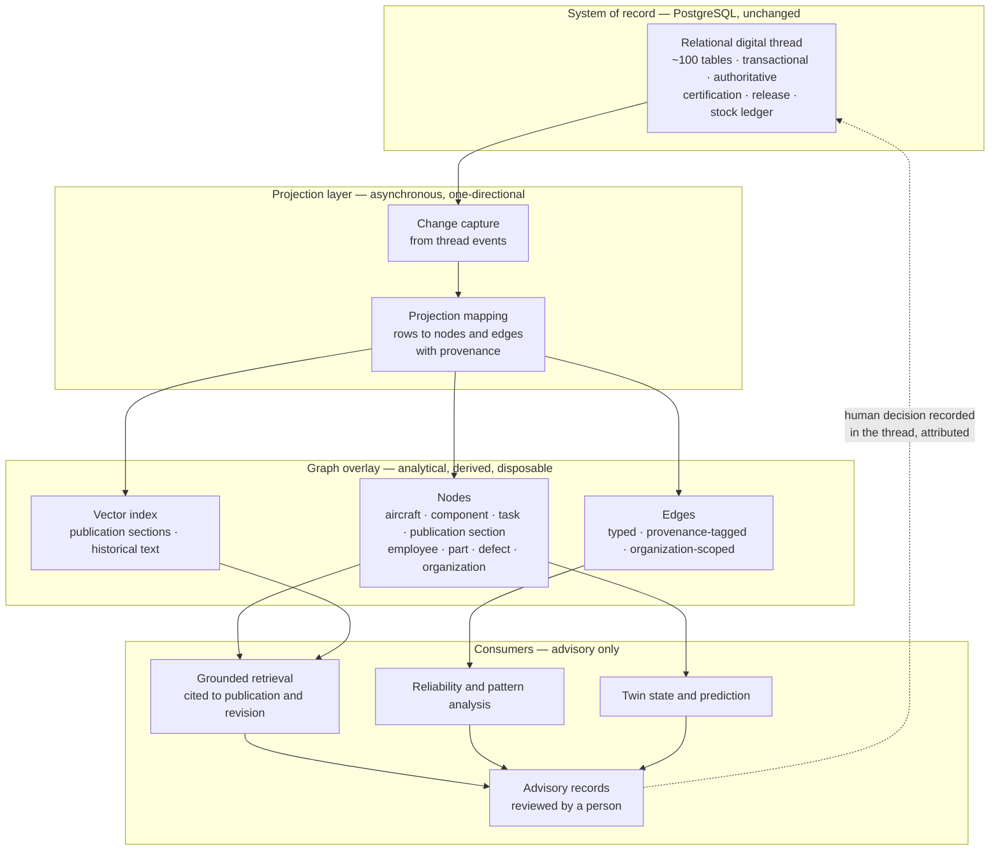
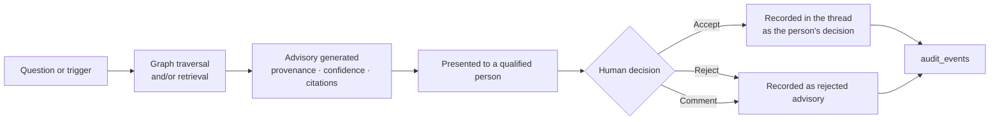

# Knowledge Graph — Data Layer

| Field | Value |
|-------|-------|
| Document | Knowledge Graph — graph overlay on the relational digital thread |
| Product | Mercury Aviation Enterprise Operating System (AEOS) |
| Organization | Mercury Technologies |
| Layer | Data (projection, overlay, retrieval substrate) |
| Audience | Data architects, AI engineers, integration partners, security reviewers |
| Status | **Future-facing specification.** The overlay is not implemented. Schema-ready structures exist without payload. |
| Companion documents | [Digital Thread](Digital_Thread.md) · [Data Model](Data_Model.md) · [Master Data](Master_Data.md) |
| AI-side authority | [AI documentation set](../07_AI/) · [AI Strategy](../07_AI/AI_Strategy.md) · [Digital Twin](../07_AI/Digital_Twin.md) |

---

## 1. Scope

### 1.1 In scope

This document specifies **how a knowledge graph sits over Mercury's relational digital thread** — what it projects, what it must never do, how provenance is preserved, and what has to be true before it can be built.

It is the **data-layer** view. It answers: what is the graph made of, where does each node and edge come from, who owns the projection, and what are the integrity, security, and scaling constraints on it.

The **AI-layer** view — model strategy, retrieval design, twin behaviour, advisory governance — lives under [docs/07_AI/](../07_AI/). Where the two documents touch, this one is authoritative on the projection and the data contract; [AI Strategy](../07_AI/AI_Strategy.md) is authoritative on what models may do with it.

### 1.2 Honest status, stated first

Nothing in this document describes a working capability. Stating that up front is not a disclaimer; it is the point.

| Claim | Reality |
|-------|---------|
| A graph store exists | **No.** PostgreSQL is the system of record and the only store. |
| A graph is populated from the thread | **No.** No projection process exists. |
| Embeddings are computed and stored | **No.** `ai_embedding_stubs` stores no vectors. |
| Retrieval-augmented search over publications works | **No.** There is no retrieval, no optical character recognition, and no model inference in the current release. |
| Typed cross-reference edges can be stored | **Yes, structurally.** `ai_knowledge_cross_refs` is a usable typed edge table. It is not populated at scale and nothing consumes it. |
| A queryable graph API exists | **No.** |

What *does* exist is three schema-ready tables and a relational thread dense enough that a projection would be worth building. Both facts matter. The first prevents overstatement; the second is why this document is a specification rather than a wish.

Representing any of the above as delivered would violate the honesty commitments in [Company Strategy §10.1](../01_Executive/Company_Strategy.md#101-what-mercury-deliberately-does-not-do) and [SECURITY.md](../../SECURITY.md).

### 1.3 Out of scope

| Concern | Authoritative location |
|---------|------------------------|
| The relational thread itself — nodes, edges, traversals | [Digital Thread](Digital_Thread.md) |
| Tables, columns, keys, constraints | [Data Model](Data_Model.md) |
| Reference vocabularies the graph classifies against | [Master Data](Master_Data.md) |
| Model selection, prompting, evaluation, advisory governance | [AI Strategy](../07_AI/AI_Strategy.md) |
| Twin state modelling and simulation | [Digital Twin](../07_AI/Digital_Twin.md) |
| Bounded context ownership of the AI domain | [Domain Architecture §5.10](../02_Architecture/Domain_Architecture.md#510-d10--ai-and-digital-twin--future-facing) |
| Permission model and audit governance | [Security documentation set](../06_Security/) |
| Whether graph capability is licensed in an edition | [Editions](../05_Product/Editions.md) |

---

## 2. Design principles

These are binding on any future implementation. They are not preferences.

| # | Principle | Statement | Consequence |
|---|-----------|-----------|-------------|
| KG-1 | **The relational thread is the truth; the graph is a projection** | PostgreSQL remains the system of record. The graph holds no fact that does not originate in a relational row. | A graph node is always resolvable to its source row. If the graph and the thread disagree, the thread is right and the graph is stale. |
| KG-2 | **The overlay is strictly read-only toward the thread** | The graph never writes into domain tables. | Consistent with [Domain Architecture](../02_Architecture/Domain_Architecture.md#510-d10--ai-and-digital-twin--future-facing): the AI context is strictly downstream. A write path from graph to domain would let inference become record. |
| KG-3 | **Organization is a property of every node and every edge** | Tenancy is projected, not assumed. | A traversal cannot leave its organization. Multi-tenant graph isolation is designed in from the first node, exactly as [Data Model DM-1](Data_Model.md#2-design-principles) requires of the relational model. |
| KG-4 | **Every node and edge carries provenance** | Source table, source row identifier, projection timestamp, and projection version. | An answer can always be traced to the records that produced it. Without this the graph is an oracle, and an oracle is not admissible evidence. |
| KG-5 | **No AI output is a thread fact** | Inference enters the domain only as an attributed advisory reviewed by a person. | No model output may be a precondition for a certification step, a release, or a compliance determination. This mirrors [Digital Thread DT-10](Digital_Thread.md#2-design-principles). |
| KG-6 | **Inference is never in a safety-critical synchronous path** | No certification, release, or dispatch transaction waits on a model. | Model latency and availability must not be able to ground an aircraft or block a release. |
| KG-7 | **Eventual consistency is acceptable and must be visible** | The graph lags the thread. Every response states its projection freshness. | A user must never be unable to tell whether they are looking at current data. Silent staleness is worse than visible lag. |
| KG-8 | **Retrieval is grounded and cited** | Every retrieved assertion names the publication, revision, and section it came from. | Ungrounded generation over technical content is prohibited. An uncited answer about a maintenance procedure is a safety hazard, not a productivity feature. |
| KG-9 | **Licence scope survives the projection** | A publication's `access_classification` and organization scope constrain what may be indexed, embedded, retrieved, or shown. | The graph must not become a mechanism for redistributing licensed manufacturer content across tenants. |
| KG-10 | **Build on a complete thread, not a partial one** | Graph and model work follows thread completeness, not the reverse. | [ROADMAP](../../ROADMAP.md#2-roadmap-principles): thread before analytics. Models over fragmented data produce confident nonsense. |

---

## 3. Why an overlay, and why not a graph database today

### 3.1 What the relational thread already does well

The honest starting position is that Mercury's relational model is a good graph. It has typed nodes, typed edges, referential enforcement on its spine, and indexed bidirectional traversal on its hot paths. The traversals in [Digital Thread §6](Digital_Thread.md#6-thread-traversals) all resolve in SQL.

For the questions Mercury asks operationally — what is fitted, what is due, who signed, against which revision — **relational is the correct technology.** Transactional integrity, one-transaction release atomicity, and row-level locking are precisely what a certification path needs, and precisely what graph stores tend to relax.

### 3.2 What relational does badly

Three classes of question are awkward or impractical in SQL over this schema:

| Question class | Example | Why SQL struggles |
|----------------|---------|-------------------|
| **Variable-depth traversal** | "Everything connected to this component within four hops, in any direction" | Requires recursive CTEs over heterogeneous unconstrained joins; each hop is a different table with a different column |
| **Similarity and semantics** | "Find procedures resembling this defect description" | Text similarity over publication content is not a relational operation, and the content is not even in the database — only locators are |
| **Pattern and path discovery** | "Which fault patterns recur across this fleet's history, and what removals followed them" | Multi-hop pattern matching across history, tasks, defects, and removals, with no fixed shape |

These are exactly the questions that reliability engineering, defect triage, and technical-publication lookup consist of. They are worth answering, and they are not worth distorting the transactional model to answer.

### 3.3 The overlay position

Read the two properties that make this safe:

**The arrow from the overlay back to the thread is dotted and passes through a human.** An advisory is surfaced; a person accepts, rejects, or comments; **the human decision is what gets recorded.** The model's output is never itself a domain fact.

**The overlay is disposable.** It can be dropped and rebuilt from the thread at any time, because it holds no independent facts. That is the practical test of KG-1: if losing the graph would lose information, the design is wrong.

---

## 4. Current state — the schema-ready structures

Three tables exist in `backend/app/maintenance/models.py`. They are the beginning of a projection, not a working system.

### 4.1 `ai_document_index_stubs`

| Column | Meaning |
|--------|---------|
| `organization_id` — **nullable** | Tenancy. Nullable, which is a defect for this table: see §4.4. |
| `source_type`, `source_id` | Polymorphic pointer to the thread row this index entry represents |
| `title` | Human label |
| `ata_chapter_id` | Classification, so retrieval can be scoped by system |
| `status` — default `pending_index` | Lifecycle of the indexing intent |

**No index payload.** A row records an intention to index something. Nothing performs the indexing.

### 4.2 `ai_embedding_stubs`

| Column | Meaning |
|--------|---------|
| Foreign key to `ai_document_index_stubs.id` | The document this embedding would describe |
| `model_name`, `dimensions` | Which model would produce it, and of what width |
| `status` — default `not_computed` | Lifecycle |

**No vectors are stored.** There is no vector column and no vector index. PostgreSQL is deployed without a vector extension.

### 4.3 `ai_knowledge_cross_refs`

| Column | Meaning |
|--------|---------|
| `from_type`, `from_id` | Source node, polymorphic |
| `to_type`, `to_id` | Target node, polymorphic |
| `relation` | Edge type — for example `related_ata`, `related_component`, `related_task`, `related_fault` |
| Indexes | `ix_ai_cross_refs_org_from`, `ix_ai_cross_refs_org_to` |

This is a genuine typed edge table with organization-scoped indexes in both directions. **It is the most usable of the three** and could carry a first-generation overlay without any new store. It is not populated at scale and nothing consumes it.

### 4.4 Honest assessment of the three tables

| Property | Assessment |
|----------|-----------|
| Structurally sound as a projection beginning | Yes for `ai_knowledge_cross_refs`; partially for the index stubs |
| Provenance adequate for KG-4 | **No.** There is no projection timestamp and no projection version. A row cannot state how stale it is. |
| Tenancy adequate for KG-3 | **No.** `ai_document_index_stubs.organization_id` is nullable, and the cross-reference table's organization scoping is by index convention rather than a NOT NULL column. Both must be tightened before any population. |
| Polymorphic references validated | **No.** `source_type`, `from_type`, and `to_type` are unvalidated strings with no type registry. |
| Relation vocabulary governed | **No.** `relation` is free text. Without a controlled vocabulary the edge set becomes unqueryable within a month of real use. |
| Ready to populate today | **No.** The four items above are prerequisites, and all four are cheap. |

**These four fixes are the smallest useful piece of work in this document**, and they must precede population rather than follow it. Retrofitting tenancy and provenance onto a populated projection is far more expensive than declaring them first.

---

## 5. The projection model

### 5.1 Node types

Every node projects from exactly one relational row and carries its provenance.

| Node type | Source table | Key properties projected | Notes |
|-----------|-------------|-------------------------|-------|
| `Organization` | `organizations` | code, name, status | The scope boundary; every traversal is rooted in one |
| `Aircraft` | `aircraft` | serial number, model, status, current registration | Identity is the airframe serial, not the mark |
| `AircraftModel` | `aircraft_models` | code, ICAO type, category, family, manufacturer | Reference; shared across tenants |
| `AtaChapter` | `ata_chapters` | chapter, subchapter, title | Reference; **the graph's primary cross-cutting index** |
| `ComponentType` | `component_catalog` | part number, ATA, serialization and life policy, designed limits | Reference |
| `Component` | `serialized_components` | serial, status, position, accumulated life, remaining life | Tenant |
| `ConfigurationEvent` | `component_installation_history` | event type, occurred at, from and to status, position | Tenant, immutable source |
| `Publication` | `publications` | number, type, authority, access classification | Tenant |
| `PublicationRevision` | `publication_revisions` | revision number, revision date, effective date | Tenant, immutable source |
| `PublicationSection` | **Derived** from revision content | section identifier, heading, ATA scope | **Requires content extraction that does not exist**; §7.2 |
| `Task` | `maintenance_tasks` | task number, type, priority, status, release status | Tenant |
| `JobCard` | `job_cards` | number, status, ATA, required certification | Tenant |
| `WorkPackage` | `work_packages` | number, status, schedule | Tenant |
| `CertificationEvent` | `certification_events` | step, occurred at | Tenant, immutable source |
| `Signature` | `digital_signatures` | method, signed at, hash | Tenant, immutable source. **Hash only — never signed content** |
| `LogbookEntry` | `technical_log_entries` | summary, occurred at, registration as carried | Tenant, immutable source |
| `Employee` | `personnel_employees` | employee number, position, status | Tenant. **Pseudonymized in analytical use**; §9 |
| `Authorization` | `personnel_authorizations` | type, scope, validity interval | Tenant |
| `Part` | `logistics_part_masters` | part number, class | Tenant |
| `Vendor` | `logistics_vendors` | code, name, status | Tenant. **Commercially sensitive** |
| `Location` | `logistics_locations` | location code | Tenant |
| `StockMovement` | `logistics_stock_movements` | movement type, quantity, timestamp | Tenant, immutable source, highest volume |
| `Tool` | `logistics_tools` | tool code, calibration currency | Tenant |
| `FaultCode` | `fault_codes` | code, description | Reference within tenant |
| `Defect` | `deferred_defects` | number, deferral type, dispatch category, expiry | Tenant |
| `Directive` | `airworthiness_directives`, `service_bulletins`, `engineering_orders` | number, revision, authority, compliance status | Tenant |
| `Check` | `maintenance_checks` | code, type, next due | Tenant |
| `MpdTask` | `mpd_tasks` | task number, intervals, ATA | Tenant |
| `Advisory` | **Graph-native** | model version, confidence, provenance chain, review state | The **only** graph-native node type. Never projected into the thread except as a recorded human decision. |

### 5.2 Edge types

Edges are typed, directed, organization-scoped, and provenance-tagged. Most project directly from a thread edge in [Digital Thread §5](Digital_Thread.md#5-thread-edge-catalogue).

| Edge type | From → To | Thread source |
|-----------|-----------|---------------|
| `BELONGS_TO_ORG` | any tenant node → `Organization` | `organization_id` — E1 |
| `HAS_MODEL` | `Aircraft` → `AircraftModel` | E4 |
| `REGISTERED_AS` | `Aircraft` → registration mark, with interval | E3 |
| `INSTALLED_ON` | `Component` → `Aircraft`, with position and interval | E7, E9 |
| `IS_TYPE` | `Component` → `ComponentType` | E8 |
| `CLASSIFIED_AS` | `Task`, `JobCard`, `Publication`, `ComponentType`, `MpdTask` → `AtaChapter` | E33 |
| `PERFORMED_ON` | `Task` → `Aircraft` | E11 |
| `AFFECTS_COMPONENT` | `Task`, `JobCard` → `Component` | E12, E29 |
| `AUTHORIZED_BY` | `Task`, `JobCard` → `PublicationRevision` | E13 |
| `REVISION_OF` | `PublicationRevision` → `Publication` | E14 |
| `SUPERSEDES` | `PublicationRevision` → `PublicationRevision`; `Part` → `Part` | E16, part supersessions |
| `SECTION_OF` | `PublicationSection` → `PublicationRevision` | Derived — content extraction required |
| `CERTIFIED_BY` | `Task` → `CertificationEvent` | E17 |
| `EVIDENCED_BY` | `CertificationEvent` → `Signature` | E18 |
| `SIGNED_BY` | `Signature` → `Employee` | E19 |
| `HELD_AUTHORITY` | `Employee` → `Authorization`, with interval | E32 |
| `RELEASED_AS` | `Task` → `LogbookEntry` | E21 |
| `CONTAINS` | `WorkPackage` → `WorkOrder` → `JobCard` | E26, E27 |
| `EXECUTES` | `JobCard` → `Task` | E28 |
| `CONSUMED` | `JobCard` → `StockMovement` → `Part` | E50, E47 |
| `SUPPLIED_BY` | `Part` → `Vendor`, via the procurement chain | E52, E53 |
| `STORED_AT` | `Part` → `Location` | E48 |
| `GENERATED` | `Check` → `WorkPackage` | E38 |
| `DERIVED_FROM` | `Check` → `MpdTask` → programme revision | E35, E36 |
| `DISCHARGED_BY` | `Directive` → `WorkOrder` | E41 |
| `CONTROLLED_BY` | `Defect` → MEL item | E42 |
| `SIMILAR_TO` | `PublicationSection` ↔ `PublicationSection`; `Defect` ↔ `Defect` | **Graph-native, computed.** Carries a similarity score and is never treated as a factual relationship |
| `CO_OCCURS_WITH` | `FaultCode` ↔ `ComponentType`, with observed frequency | **Graph-native, computed** from history |
| `ADVISES` | `Advisory` → any node | **Graph-native.** Always carries provenance and review state |

**`ai_knowledge_cross_refs` is the existing home for this edge set.** Its `relation` column is where the vocabulary above would live — which is exactly why that column needs to become a controlled vocabulary before population, per §4.4.

### 5.3 The relation vocabulary is governed

Uncontrolled edge types are how graph projects fail. A free-text `relation` column accumulates `related_component`, `relatedComponent`, `component_related`, and `has_component` within one quarter, and every query then has to know all four.

| Rule | Requirement |
|------|-------------|
| Adding an edge type | Requires review and registration in the vocabulary, alongside its thread source |
| Renaming an edge type | Requires an ADR — it invalidates every stored edge and every query |
| Distinguishing projected from computed edges | Structural. A `SIMILAR_TO` edge must never be mistakable for an `INSTALLED_ON` edge |
| Confidence on computed edges | Mandatory. A projected edge has no confidence because it is a fact; a computed edge always has one because it is an inference |

### 5.4 Projection mechanics

| Concern | Design |
|---------|--------|
| Trigger | Thread events. The runtime has an in-process event bus and a WebSocket gateway; a durable broker is the prerequisite for reliable projection |
| Direction | **Strictly one-directional.** Thread to graph. Never the reverse. |
| Idempotency | Node and edge identity is derived from source table plus source row identifier, so replay converges rather than duplicating |
| Ordering | Not guaranteed. The projection must tolerate out-of-order arrival, because eventual consistency is accepted under KG-7 |
| Rebuild | Full rebuild from the thread must always be possible. It is the disposability test of KG-1. |
| Freshness | Every node carries `projected_at` and every query response reports the projection lag |
| Failure | Projection failure degrades the graph and **must never** affect a thread write. A graph outage cannot be allowed to block a release. |

### 5.5 What must not be projected

| Excluded | Reason |
|----------|--------|
| Signed content bodies | Only the hash and metadata. Projecting signed payloads would multiply the repudiation surface. |
| Publication binaries | KG-9. Licence scope. Only metadata, section structure, and — where licensing permits — extracted text within the owning organization. |
| Credentials, hashes used for authentication, session material | Never leaves the security boundary. |
| Personal data beyond operational need | KG-3 and §9. Employee nodes are pseudonymized for analytical use. |
| In-memory operations state | Missions, decisions, alerts, and the global timeline are not persisted, so they are not thread facts and cannot be projected. See [Digital Thread §3.3](Digital_Thread.md#33-what-is-deliberately-outside-the-thread). |
| Derived forecast values | Recompute from the thread; a projected forecast would be a stale second truth. |

---

## 6. Provenance and confidence

KG-4 is what separates a defensible overlay from an oracle. Every node, edge, and answer carries a chain back to records.

### 6.1 Required provenance fields

| Field | On | Purpose |
|-------|----|---------| 
| `source_table`, `source_id` | Every projected node and edge | Resolves to the authoritative row |
| `projected_at` | Every node and edge | Freshness, per KG-7 |
| `projection_version` | Every node and edge | Which mapping produced it; enables reasoning about a mapping defect after the fact |
| `organization_id` | Every node and edge | KG-3. **NOT NULL** |
| `confidence` | Computed edges and advisories only | Absent on projected facts by design — a fact has no confidence |
| `model_name`, `model_version` | Computed edges and advisories | Which model produced it |
| `evidence_node_ids` | Advisories | The specific nodes that informed the output |
| `review_state` | Advisories | `pending`, `accepted`, `rejected`, `commented` |

### 6.2 The provenance contract for any answer

Every retrieval or advisory response must be able to answer four questions, and a response that cannot is not shippable:

1. **Which records informed this?** Resolvable node identifiers back to thread rows.
2. **Which model version produced it, if any?**
3. **How fresh is the underlying projection?**
4. **What is the review state, and who reviewed it?**

For retrieval over technical content, KG-8 adds a fifth: **which publication, which revision, and which section.** A citation to a publication without a revision is not a citation, because the content of a publication changes and the revision is the only immutable anchor.

### 6.3 Advisory lifecycle

**The recorded fact is the human decision, never the advisory.** The runtime already contains a precedent: the advisory decision engine in the operations domain is explicitly advisory, its evaluations are audited, and its recommendations carry review states. It is a behavioural precedent for how this must work, not an implementation of it.

---

## 7. Target architecture

Phased, with each phase gated on the previous one and on thread completeness per KG-10.

### 7.1 Phase 0 — prerequisites in the existing schema

No new infrastructure. Cheap, and required before anything else.

| Item | Change |
|------|--------|
| Tenancy | `organization_id` NOT NULL on all three `ai_*` tables |
| Provenance | Add `projected_at` and `projection_version` |
| Type validation | A registry of valid `source_type`, `from_type`, and `to_type` values, validated on insert |
| Relation vocabulary | Controlled vocabulary for `relation`, governed per §5.3 |
| Thread integrity | The scheduled thread-integrity check from [Digital Thread §12 item 1](Digital_Thread.md#12-future-enhancements) — projecting a broken thread propagates the break |

### 7.2 Phase 1 — first-generation overlay in PostgreSQL

Still no graph database. `ai_knowledge_cross_refs` carries the edge set.

| Capability | Delivers | Constraint |
|-----------|----------|-----------|
| Projected edges for the spine relationships in §5.2 | Two and three-hop traversal via recursive CTEs | Deeper traversal becomes impractical; that is the signal to move to Phase 2 |
| ATA-centred cross-reference | "Everything classified under this chapter for this aircraft" | Bounded depth |
| Fault-code co-occurrence from history | First reliability signal | Statistical only, no inference |
| Freshness reporting | KG-7 satisfied | — |

Phase 1 is worth doing on its own merits: it validates the projection mapping, the vocabulary, and the provenance model at low cost, and it produces useful cross-reference navigation without a new store.

### 7.3 Phase 2 — content extraction and grounded retrieval

The prerequisite is a managed object store for publication binaries, which is already on the near-term horizon in [ROADMAP §4](../../ROADMAP.md#4-near-term-horizon--assurance-and-hardening-additive).

| Capability | Delivers | Constraint |
|-----------|----------|-----------|
| Section-level extraction from revisions into `PublicationSection` nodes | Retrieval at the right granularity — a procedure, not a manual | **Licence-gated by KG-9.** Extraction is permitted only where the organization's licence allows it. |
| Vector index over sections | Semantic search | Requires a vector store or a PostgreSQL vector extension — an infrastructure decision needing an ADR |
| Grounded, cited retrieval | Publication lookup that names publication, revision, and section | KG-8. Ungrounded generation is prohibited. |
| Defect-to-procedure similarity | Triage assistance | Advisory only |

**Content extraction is where licensing bites hardest.** Mercury holds locators, not binaries. Extracting text creates a derived copy inside Mercury, and whether that is permitted depends on the licence recorded in `publications.access_classification`. This must be resolved per organization and per publication **before** extraction, and the extraction pipeline must refuse to process content it is not licensed to derive from. That is a legal control implemented as a data control.

### 7.4 Phase 3 — graph store and pattern analysis

Only if Phase 1 demonstrably hits its depth limit. A graph store is a real operational commitment — backup, upgrade, expertise, security review — and adopting one before the need is proven would be the kind of architectural fashion [ROADMAP §8](../../ROADMAP.md#8-explicit-non-goals) rules out.

| Capability | Delivers |
|-----------|----------|
| Variable-depth traversal | "Everything connected to this component within four hops" |
| Pattern matching | Recurring fault and removal patterns across a fleet |
| Reliability analytics | Removal rates, mean time between unscheduled removals, programme escalation evidence |
| Twin state graph | Configuration and life-accurate twin per [Digital Twin](../07_AI/Digital_Twin.md) |

**PostgreSQL remains the system of record.** Replacing it is an explicit non-goal. A graph store, if adopted, is a derived analytical store that can be rebuilt from the thread and dropped without loss.

### 7.5 Phase 4 — predictive and advisory in workflow

| Capability | Governance |
|-----------|-----------|
| Failure-precursor and removal-forecast models | Advisory only; provenance mandatory; never a release precondition |
| Condition-based forecast input | Feeds the planner's judgement; the planner decides |
| Assistive drafting for tasks and defect triage | Human authors and signs |

KG-5 and KG-6 are absolute here. No autonomous approval, certification, or release. No model in a synchronous safety-critical path.

---

## 8. Non-functional requirements

### 8.1 Reading the targets

Every figure below is an **aspirational target for a capability that does not exist.** None is a current baseline, and none may be quoted as a commitment. The convention follows [Data Model §11.1](Data_Model.md#111-reading-the-targets).

### 8.2 Projection

| Requirement | Target |
|-------------|--------|
| Projection lag, thread write to graph visibility | Under 60 seconds at the 95th percentile |
| Projection lag reported on every response | Mandatory — KG-7 |
| Full rebuild from thread | Achievable within one maintenance window for the largest tenant |
| Idempotent replay | Guaranteed; replay converges |
| Out-of-order tolerance | Guaranteed |
| Projection failure impact on thread writes | **Zero.** A graph outage cannot block a release. |
| Provenance completeness | 100 percent of nodes and edges carry source, timestamp, and version |

### 8.3 Query

| Requirement | Target |
|-------------|--------|
| Two-hop traversal within one organization | Under 200 ms |
| Four-hop traversal | Under 1 second |
| Semantic retrieval over publication sections | Under 2 seconds including citation resolution |
| Citation resolution to publication, revision, section | 100 percent — an uncited retrieval result is not returned |
| Reliability pattern query over a fleet's history | Under 10 seconds, asynchronous where longer |
| Concurrent analytical load impact on transactional latency | **Zero** — separate store, separate scaling |

### 8.4 Correctness and honesty

| Requirement | Target |
|-------------|--------|
| Graph facts traceable to a thread row | 100 percent |
| Graph facts not present in the thread | **Zero** — any such fact is a defect |
| Computed edges distinguishable from projected edges | Structural, always |
| Confidence present on every computed edge and advisory | 100 percent |
| Advisories without a provenance chain | **Zero** — refuse to emit rather than emit unattributed |
| Retrieval results citing a revision that no longer resolves | Zero; revisions are immutable, so this can only be a projection defect |
| Model output entering the thread as fact | **Zero, by construction** |

### 8.5 Availability

| Requirement | Target |
|-------------|--------|
| Graph availability requirement | **Lower than the thread's.** Advisory capability may degrade; certification may not. |
| Degradation behaviour | Graph unavailable produces an explicit unavailable response, never a silent fallback to stale or ungrounded output |
| Thread availability dependency on the graph | None, in either direction of failure |

That first row is a deliberate architectural statement. Most systems make the analytical layer as available as the transactional one. Mercury explicitly does not, because doing so would create pressure to place inference on a critical path — which KG-6 forbids.

---

## 9. Security considerations

**Multi-tenant isolation is harder in a graph than in a relational store, and this is the overlay's primary risk.** In SQL, a missing organization predicate returns wrong rows. In a graph, a missing organization constraint on a *traversal* can walk from one tenant's node to another's along a shared reference node — a model, an ATA chapter, a catalogue entry — and return a path that crosses tenants. Three controls are mandatory and non-negotiable:

1. **Every node and edge carries a NOT NULL `organization_id`.** KG-3. The current nullable column on `ai_document_index_stubs` must be fixed before any population.
2. **Reference nodes are shared but not traversable across tenants.** A traversal may reach `AtaChapter` or `AircraftModel`; it may not continue from there into another organization's nodes. Shared reference nodes are traversal sinks, not bridges.
3. **Organization scope is part of the query, enforced at every hop** — not a post-filter on the result set. Filtering a completed traversal is not isolation, because the traversal already touched data it should not have.

**The graph amplifies aggregation risk.** The relational model discloses per-record. A graph discloses per-neighbourhood. A single traversal can reveal fleet composition, maintenance discipline, supplier relationships, personnel authority, and defect history together — the same aggregation concern that makes the [Digital Aircraft Passport](Digital_Thread.md#7-the-digital-aircraft-passport) the platform's highest-value disclosure target. Graph read endpoints therefore need field-level and node-type-level authorization, not just organization scoping. A user permitted to see components must not thereby see vendor pricing because both are two hops from the same part.

**Personal data requires pseudonymization in analytical use.** `Employee` nodes support authority traversal, which is legitimate and necessary for evidence. They must not become a productivity-surveillance substrate. Analytical and reliability queries operate on pseudonymized employee identifiers; only evidence traversal — where naming the signer is the entire point — resolves to the person, and that resolution is permission-gated and audited.

**Licensed content is a legal boundary that the projection can breach.** KG-9. `publications.access_classification` and organization scope constrain what may be indexed, embedded, extracted, retrieved, or displayed. An embedding derived from licensed content is a derived work. A shared vector index across tenants would be a redistribution mechanism. **Vector indexes must be organization-partitioned, and the partition must be part of the index key rather than a filter applied to results.** This is the same constraint [Master Data §14.3](Master_Data.md#143-multi-tenant-considerations-at-scale) states for master-data caching, and for the same reason.

**Signed content must never be projected.** Only signature hashes and metadata. Projecting the canonical signed payloads would multiply the surface on which a repudiation dispute could be argued, for no analytical benefit.

**Prompt injection is a real threat once retrieval exists.** Retrieved technical content is untrusted input to a model. Content that instructs a model to disregard its constraints must not be able to cause it to emit an uncited answer, exceed its scope, or claim authority. Mitigations: retrieval results are cited and bounded; the model has no write capability into the thread; no model output can satisfy a certification precondition. KG-5 and KG-6 are the structural defence — an injected instruction cannot release an aircraft if no model output can release an aircraft.

**Every graph and retrieval access is audited.** Because a traversal can disclose a neighbourhood, the audit record must capture the entry point, the scope, and the node types traversed — not merely that a query occurred. Bulk traversal and export need rate limiting for the same reason master-data bulk export does.

**Model and projection infrastructure is in scope for security review.** A vector store, a graph store, and an embedding pipeline are each new attack surface, new credential surface, and new data-at-rest surface. Adopting any of them requires a security review before deployment, and Phase 3's operational commitment includes that review rather than deferring it.

**Non-claims.** Mercury does not claim AI-based airworthiness determination, certified predictive capability, or autonomous decision-making. See [SECURITY.md](../../SECURITY.md) and [AI Strategy](../07_AI/AI_Strategy.md).

Full detail: [Security documentation set](../06_Security/) · [RBAC](../06_Security/RBAC.md) · [Audit](../06_Security/Audit.md).

---

## 10. Scalability considerations

### 10.1 Projection volume

| Thread source | Node and edge volume | Projection strategy |
|---------------|---------------------|--------------------|
| `logistics_stock_movements` | Highest volume in the platform | **Do not project every movement as a node.** Aggregate to part-and-period, or project only movements referencing work. This is the single most important projection scoping decision. |
| `audit_events` | Exceeds business data volume | Do not project. Audit is terminal by design and answerable relationally. |
| `component_installation_history` | Grows for the life of every unit | Project fully — it is configuration truth and the payoff is high |
| `certification_events`, `digital_signatures` | Steady, per certification step | Project fully — evidence traversal is a core use |
| `PublicationSection` | Sections per revision times revisions, accumulating forever | Project current and in-force revisions eagerly; superseded revisions on demand |
| Vector index | One vector per section per model version | The dominant storage cost; a model change re-embeds the corpus |

### 10.2 Traversal cost characteristics

| Characteristic | Implication |
|----------------|-------------|
| Aircraft history grows monotonically | A twenty-year-old airframe's neighbourhood is far larger than a new one's. Traversal cost grows with asset age, exactly as [Digital Thread §11.1](Digital_Thread.md#111-what-grows-and-how-fast) notes for the relational thread. |
| Reference nodes are extremely high-degree | `AtaChapter` connects to a large fraction of every tenant's nodes. Traversals through reference nodes must be bounded, and reference nodes must be traversal sinks per §9. |
| Computed similarity edges grow quadratically if unbounded | Top-k only, with a similarity floor. An unbounded `SIMILAR_TO` set is how a graph becomes unqueryable. |
| Multi-tenant graph in one store | Every traversal must be organization-constrained at every hop, which is both a security requirement and the property that keeps a large tenant from slowing a small one |

### 10.3 Scaling position

| Position | Rationale |
|----------|-----------|
| The overlay scales separately from the thread | Analytical, not transactional. Separate store, separate resources, separate failure domain. |
| Analytical load must never affect transactional latency | An NFR in §8.3 with a target of zero, and a hard architectural boundary |
| Rebuild capability bounds operational risk | Because the graph is disposable, a corrupted or outgrown projection is a rebuild rather than a recovery |
| Phase 1 in PostgreSQL is the honest starting point | Proves the projection model without an infrastructure commitment. Depth limits, when hit, are the evidence that justifies Phase 3. |
| Vector storage is the dominant cost at Phase 2 | Sizing must assume re-embedding on model change, and organization partitioning multiplies index count |

---

## 11. Future enhancements

Sequenced. Each item depends on the ones above it.

| # | Enhancement | Phase | Value | Depends on |
|---|-------------|-------|-------|------------|
| 1 | **Tighten the three `ai_*` tables** — NOT NULL tenancy, provenance columns, type registry, controlled relation vocabulary | 0 | Makes the existing structures safe to populate. Cheapest high-value item in this document. | Migration |
| 2 | **Scheduled thread-integrity check** | 0 | A projection of a broken thread propagates the break | [Digital Thread §12 item 1](Digital_Thread.md#12-future-enhancements) |
| 3 | **Durable event transport** | 0 | Reliable, replayable, one-directional projection | Message broker |
| 4 | **Projection service for spine edges** | 1 | First real overlay; validates mapping, vocabulary, and provenance at low cost | Items 1 to 3 |
| 5 | **ATA-centred cross-reference navigation** | 1 | Immediate user value: everything related to a chapter for an aircraft | Item 4 |
| 6 | **Fault-code co-occurrence statistics** | 1 | First reliability signal, statistical and honest | Item 4, history quality |
| 7 | **Managed object storage for publication binaries** | 2 | Prerequisite for any content extraction | [ROADMAP §4](../../ROADMAP.md#4-near-term-horizon--assurance-and-hardening-additive) |
| 8 | **Licence-gated section extraction** | 2 | `PublicationSection` nodes at the right retrieval granularity, within licence | Item 7, per-publication licence determination |
| 9 | **Organization-partitioned vector index** | 2 | Semantic search with isolation as an index property, not a filter | Item 8, ADR on vector infrastructure |
| 10 | **Grounded, cited retrieval** | 2 | Publication lookup citing publication, revision, and section | Item 9 |
| 11 | **Defect-to-procedure similarity for triage** | 2 | Advisory triage assistance | Item 10 |
| 12 | **Graph store adoption, if depth limits are demonstrated** | 3 | Variable-depth traversal and pattern matching | Evidence from Phase 1, ADR, security review |
| 13 | **Reliability and trend analytics** | 3 | Removal rates, mean time between unscheduled removals, programme escalation evidence | Item 12, data quality from configuration and execution |
| 14 | **Twin state graph** | 3 | Configuration and life-accurate twin | Item 12, [Digital Twin](../07_AI/Digital_Twin.md) |
| 15 | **Predictive models, advisory only** | 4 | Failure precursor and removal forecast | Item 13, advisory governance |
| 16 | **Assistive drafting and triage in workflow** | 4 | Productivity with a human author and signer | Item 10, KG-5 |
| 17 | **Cross-organization graph participation** | 4 | Lets a lessor, shop, or OEM traverse a scoped subgraph without tenancy | [Digital Thread §12 item 4](Digital_Thread.md#12-future-enhancements) |

---

## 12. Related documents

**Data set**
[Digital Thread](Digital_Thread.md) · [Data Model](Data_Model.md) · [Master Data](Master_Data.md)

**AI set — authoritative on model behaviour**
[AI documentation set](../07_AI/) · [AI Strategy](../07_AI/AI_Strategy.md) · [Digital Twin](../07_AI/Digital_Twin.md)

**Architecture**
[Domain Architecture](../02_Architecture/Domain_Architecture.md) · [Enterprise Architecture](../02_Architecture/Enterprise_Architecture.md) · [Technical Architecture](../02_Architecture/Technical_Architecture.md) · [System Context](../02_Architecture/System_Context.md)

**Security**
[Security documentation set](../06_Security/) · [RBAC](../06_Security/RBAC.md) · [Audit](../06_Security/Audit.md) · [Digital Signatures](../06_Security/Digital_Signatures.md) · [SECURITY.md](../../SECURITY.md)

**Business — who would consume the overlay, and for what**
[Business documentation set](../03_Business/) · [Airline](../03_Business/Airline.md) · [MRO](../03_Business/MRO.md) · [CAMO](../03_Business/CAMO.md) · [OEM](../03_Business/OEM.md)

**Regulation — descriptive mapping, not a claim of approval**
[Regulations documentation set](../09_Regulations/) · [FAA](../09_Regulations/FAA.md) · [Transport Canada](../09_Regulations/Transport_Canada.md)

**Product**
[Product Family](../05_Product/Product_Family.md) · [Editions](../05_Product/Editions.md) · [Pricing Strategy](../05_Product/Pricing_Strategy.md)

**Governance**
[ROADMAP](../../ROADMAP.md) · [ADR register](../08_Standards/ADR/) · [Company Strategy](../01_Executive/Company_Strategy.md)

---

*Mercury Technologies — One Digital Thread. One Digital Aircraft Passport. One Aviation Enterprise Operating System.*
