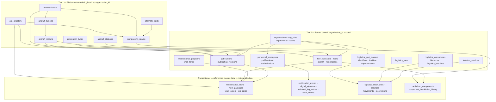
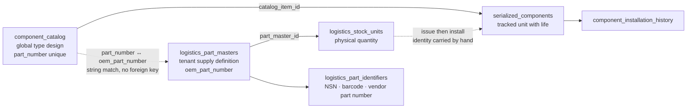
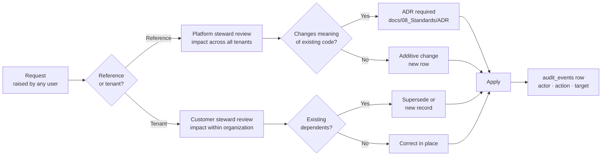
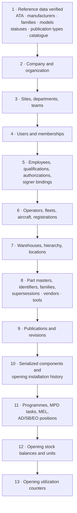

# Master Data — Mercury Aviation Enterprise Operating System

| Field | Value |
|-------|-------|
| Document | Master Data — canonical catalogues, ownership, stewardship |
| Product | Mercury Aviation Enterprise Operating System (AEOS) |
| Organization | Mercury Technologies |
| Layer | Data (reference catalogues, master records, governance) |
| Audience | Data stewards, domain consultants, implementation leads, integration partners, quality managers |
| Status | Living baseline — ownership changes require an ADR |
| Companion documents | [Data Model](Data_Model.md) · [Digital Thread](Digital_Thread.md) · [Knowledge Graph](Knowledge_Graph.md) |
| Upstream authority | [Domain Architecture](../02_Architecture/Domain_Architecture.md) · [Blueprint README](../../README.md) |

---

## 1. Scope

### 1.1 In scope

This document defines **which data in Mercury is master data, who owns it, who may change it, and what happens when it is wrong**.

Master data is the data that other data depends on for meaning. An ATA chapter is not a transaction; it is the vocabulary that makes a task classifiable, a publication findable, and a reliability trend comparable across a fleet. If master data is inconsistent, every downstream record inherits the inconsistency — and in an airworthiness context that inheritance is a compliance problem, not a reporting inconvenience.

The document covers:

| Section | Content |
|---------|---------|
| §3 | The ownership model — platform-stewarded versus tenant-owned, and why the line falls where it does |
| §4 | Reference catalogues: ATA chapters, manufacturers, families, models, aircraft statuses, publication types |
| §5 | Part master versus component catalogue — the most consequential distinction in Mercury's data model |
| §6 | Vendors and supply-side master data |
| §7 | Personnel, licences, qualifications, and certification authority as master data |
| §8 | Organization structure as master data, and roles, personas and permissions as a governed vocabulary |
| §9 | Stewardship model: stewardship roles, decision rights, change process |
| §10 | Data quality rules, measures, and remediation |
| §11 | Onboarding, migration, and deduplication |

### 1.2 Out of scope

| Concern | Authoritative location |
|---------|------------------------|
| Table columns, keys, indexes, constraint names | [Data Model](Data_Model.md) |
| Link semantics between master records and transactions | [Digital Thread](Digital_Thread.md) |
| Graph projection of master data for retrieval | [Knowledge Graph](Knowledge_Graph.md) |
| Bounded contexts and aggregate boundaries | [Domain Architecture](../02_Architecture/Domain_Architecture.md) |
| Who may call which endpoint | [RBAC](../06_Security/RBAC.md) |
| Regulatory basis for the vocabularies used | [Regulations documentation set](../09_Regulations/) |
| Commercial packaging | [Editions](../05_Product/Editions.md) |

### 1.3 What counts as master data in Mercury

Three classes, distinguished by who may write them and how often they change:

| Class | Definition | Write authority | Examples |
|-------|-----------|-----------------|----------|
| **Reference data** | Industry or platform vocabulary. Shared by all tenants. Changes rarely, and only through platform stewardship. | Mercury platform steward | `ata_chapters`, `manufacturers`, `aircraft_families`, `aircraft_models`, `aircraft_statuses`, `publication_types`, `component_catalog`, `alternate_parts` |
| **Tenant master data** | Records that define the customer's own world and are referenced by many transactions. Changes occasionally, under customer governance. | Customer data steward, within their organization | `organizations`, `org_sites`, `departments`, `teams`, `fleet_operators`, `fleets`, `aircraft`, `personnel_employees`, `logistics_part_masters`, `logistics_vendors`, `logistics_warehouses`, `logistics_locations`, `logistics_tools`, `maintenance_programs`, `mel_items` |
| **Transactional data** | Records of things that happened. Not master data. Included here only to mark the boundary. | Operational users under RBAC | `maintenance_tasks`, `job_cards`, `certification_events`, `logistics_stock_movements`, `technical_log_entries` |

The practical test: **if changing one row silently changes the meaning of thousands of others, it is master data.** Renaming an ATA chapter changes the meaning of every task classified under it. Correcting a job card's actual hours changes one job card.

---

## 2. Design principles

| # | Principle | Statement | Consequence |
|---|-----------|-----------|-------------|
| MD-1 | **One vocabulary, platform-wide** | Reference catalogues are global tables with no `organization_id`. Every tenant classifies against the same ATA chapters, models, and publication types. | Fleet-wide and cross-customer comparability becomes possible; a per-tenant ATA fork would make reliability analysis meaningless. |
| MD-2 | **Tenants read reference data; they never write it** | Reference tables are exposed read-only to tenant roles. Additions require platform stewardship. | Prevents drift. A customer cannot invent ATA chapter 97 and thereby become uncomparable. |
| MD-3 | **Tenant master data is sovereign inside the organization** | Part masters, vendors, employees, warehouses, and programmes belong to the customer and are organization-scoped. | Mercury does not impose a supply-chain or organizational taxonomy. Two tenants may hold the same part number with different policies. |
| MD-4 | **Type-level and unit-level facts are separate records** | A catalogue entry describes the type; a serialized component describes one physical unit. | Life limits *as designed* and life *as accumulated* are different facts, and conflating them corrupts airworthiness status. §5. |
| MD-5 | **Master data is never hard-deleted** | Withdrawal is `deleted_at` or a `status` transition, never a `DELETE`. | Historical records keep resolvable references. A withdrawn part master still explains a ten-year-old installation. |
| MD-6 | **Identity is a surrogate; the code is a constraint** | Master records are keyed by opaque `id`; the human-meaningful code carries a unique constraint. | A part number or employee number can be corrected without rewriting every reference to it. |
| MD-7 | **Supersession is modelled, not overwritten** | Replacement is an explicit typed relationship. | `logistics_part_supersessions`, `alternate_parts`, `publications.supersedes_publication_id`, `publication_revisions.supersedes_revision_id`. |
| MD-8 | **Every master record has a named steward** | An owner is accountable for accuracy, not merely permitted to edit. | §9. Unstewarded master data degrades by default. |
| MD-9 | **Quality is measured, not assumed** | Completeness, uniqueness, and linkage are measurable properties with defined thresholds. | §10 defines the measures. Several are not yet automated, and that is stated. |
| MD-10 | **Reference additions are additive** | New chapters, models, and types are added; existing codes are not repurposed. | Repurposing a code silently rewrites history. Requires an ADR. |

---

## 3. The ownership model

### 3.1 The two-tier picture

### 3.2 Where the line falls, and why

The boundary is not arbitrary. It follows a single test: **does a shared definition create value, or does it impose someone else's model?**

| Catalogue | Tier | Reasoning |
|-----------|------|-----------|
| ATA chapters | Platform | An industry standard. A per-tenant variant would destroy cross-fleet comparability and make publication applicability untranslatable. |
| Manufacturers, families, models | Platform | Objective facts about type design. A customer does not own the definition of what a model is. |
| Aircraft statuses | Platform | A controlled vocabulary with an `is_operational` semantic that downstream logic depends on. Tenant-defined statuses would break status-derived behaviour. |
| Publication types | Platform | The taxonomy of controlled document kinds is industry-shaped, and the `category` drives library navigation. |
| Component catalogue | Platform | Type design: what the part *is*, its ATA classification, whether it is serialized, its designed life limits. Objective and shareable. |
| Part master | **Tenant** | Commercial and stores reality: policies, units of issue, shelf life, stocking levels, vendor relationships. Legitimately different per customer. §5. |
| Vendors | Tenant | A supplier relationship is the customer's, including its approvals and terms. |
| Warehouses and locations | Tenant | Physical facilities belong to the customer. |
| Tools | Tenant | Tool crib contents and calibration regimes are the customer's. |
| Employees, qualifications, authorizations | Tenant | Personnel data is the customer's, and certification authority is theirs to grant. |
| Maintenance programmes, MEL | Tenant | Approved against the customer's own approval basis and authority. |
| Publications | Tenant | Even manufacturer content is held per organization, because *licence* is per organization. §4.6. |

### 3.3 The consequence for integrations

An integration that wants to add a manufacturer, a model, or an ATA chapter is asking for a **platform** change and must go through stewardship in §9. An integration that wants to add part masters, vendors, or employees is operating inside a tenant and needs only that tenant's authorization.

This distinction is the first thing to establish in any integration design. Getting it wrong produces either a tenant that cannot onboard its own suppliers, or a platform catalogue polluted by one customer's local conventions.

---

## 4. Reference catalogues

### 4.1 ATA chapters — `ata_chapters`

The classification backbone. Every task, publication, authorization scope, and component type resolves to an ATA chapter, which is what makes the [Digital Thread](Digital_Thread.md) navigable by system rather than only by aircraft.

| Property | Value |
|----------|-------|
| Table | `ata_chapters` |
| Tenancy | Global — no `organization_id` |
| Identity | `id` surrogate; `(chapter_number, subchapter)` unique via `uq_ata_chapter_sub` |
| Key columns | `chapter_number String(10)`, `subchapter String(10)` default `00`, `title String(200)`, `description`, `status` |
| Referenced by | `component_catalog.ata_chapter_id`, `publications.ata_chapter_id`, `publication_ata_links.ata_chapter_id`, `maintenance_tasks.ata_chapter_id`, `work_orders.ata_chapter_id`, `job_cards.ata_chapter_id`, `technical_log_entries.ata_chapter_id`, `mpd_tasks.ata_chapter_id`, `personnel_authorizations.ata_chapter_id`, `ai_document_index_stubs.ata_chapter_id` |

**Stewardship rules.**

- Chapter and subchapter are added, never renumbered. Renumbering silently reclassifies history.
- `title` may be corrected for spelling or clarity. A change of meaning is a new row, not an edit.
- Subchapter granularity is a platform decision. A tenant that needs finer classification uses its own task numbering, not a private ATA chapter.
- Withdrawal is `status`, not deletion, because historic tasks must keep resolving.

**Why it is a release precondition.** `ata_chapter_id` must be set on a task before aircraft release. This is not bureaucracy: an unclassified release cannot be found by a subsequent structural or system-level audit, and cannot contribute to reliability analysis. See [Data Model §5.6](Data_Model.md#56-maintenance-execution-and-evidence).

### 4.2 Manufacturers, families, models

Three tables forming the type-design hierarchy.

| Table | Identity | Notable columns |
|-------|----------|-----------------|
| `manufacturers` | `name` unique, `code` unique — globally | `country`, `status` |
| `aircraft_families` | `(manufacturer_id, code)` via `uq_aircraft_family_mfr_code` | `name`, `description`, `status` |
| `aircraft_models` | `(manufacturer_id, code)` via `uq_aircraft_model_mfr_code` | `family_id` nullable, `icao_type`, `category` default `fixed_wing`, `engine_count` default 2, `max_seats` |

**`family_id` is nullable on purpose.** Not every model belongs to a family, and forcing an artificial family for a one-off type would create a fictional master record. Applicability resolution must therefore handle both model-level and family-level scope; see §4.6.

**`category` carries real semantics.** `fixed_wing` versus rotorcraft affects which programme structures, position naming, and publication types make sense. Mercury serves helicopter operators as a first-class segment ([Company Strategy §3.1](../01_Executive/Company_Strategy.md#31-segment-prioritization)), so this field is not cosmetic.

**`icao_type` is the interoperability key.** It is how Mercury's model identity aligns with external flight-operations and air-traffic data. It is indexed and should be populated wherever an ICAO designator exists.

**Stewardship rules.**

- Manufacturer codes are stable. A corporate merger creates a new manufacturer row and a supersession relationship recorded in `description`, not a rename that rewrites history.
- A model's `engine_count`, `category`, and `icao_type` are type-design facts. If a customer disputes one, the resolution is a stewardship review, not a tenant-local override.
- Variants that differ operationally but not by type certificate are handled by `aircraft.manufacturer_serial` and `publications.aircraft_variant`, not by proliferating model rows.

### 4.3 Aircraft statuses — `aircraft_statuses`

The only reference table whose primary key is the code itself: `code String(40)` PK, referenced by value from `aircraft.status_code`.

| Column | Purpose |
|--------|---------|
| `code` | Primary key, referenced by `aircraft.status_code` |
| `name` | Unique display name |
| `is_operational` | **Semantic flag** — drives whether an aircraft counts as available |
| `sort_order` | Presentation order, default 100 |
| `status` | Lifecycle of the status row itself |

**`is_operational` is behaviour, not decoration.** Dashboards, availability counts, and planning views read it. Adding a status without setting it correctly produces an aircraft that is neither available nor grounded in every derived count. This is the clearest example of why MD-2 exists: a tenant-invented status would silently corrupt availability reporting.

**Note on the double `status`.** `aircraft.status_code` is the operational status of the aircraft. `aircraft.status` is the lifecycle of the aircraft *record*. They are different columns with different meanings, and the naming is unfortunate. Any query, report, or integration must be explicit about which it means. Renaming would break the API contract and requires an ADR; until then the ambiguity is documented rather than hidden.

### 4.4 Publication types — `publication_types`

| Column | Purpose |
|--------|---------|
| `code` | Unique globally — the type identifier |
| `name` | Display name |
| `category` | Groups types for library navigation; indexed |
| `status` | Lifecycle |

Types span maintenance, flight, engineering, and operations categories. `category` drives the technical library browse tree at `/api/v1/library/browse`, so a type added without a coherent category becomes invisible in navigation while remaining queryable by API — a silent quality failure worth checking for.

### 4.5 Component catalogue — `component_catalog` and `alternate_parts`

The type-level definition of a part. Global, platform-stewarded, and **the counterpart to the tenant-owned part master** discussed in §5.

| Column group | Columns | Meaning |
|--------------|---------|---------|
| Identity | `part_number String(120)` **unique globally**, `manufacturer_id`, `oem_name` | What the part is and who makes it |
| Classification | `ata_chapter_id`, `component_type` default `general`, `description` | How it is classified and found |
| Tracking policy | `is_serialized` default `"true"`, `is_life_limited` default `"false"` | Whether units are individually tracked, and whether life applies |
| Designed limits | `hour_limit Numeric(12,2)`, `cycle_limit Integer`, `calendar_limit_days Integer` | Life limits **as designed for the type** |

`alternate_parts` records typed interchangeability between catalogue entries — the engineering statement that one part may substitute for another.

**Two properties deserve emphasis.**

*`part_number` is globally unique.* One catalogue row per part number across the entire platform. This is what makes the catalogue shared reference data, and it means two tenants installing the same part number are installing the same *type*. That shared identity is precisely what makes cross-fleet reliability analysis possible.

*Catalogue limits are defaults, not the unit's truth.* `serialized_components` carries its own `hour_limit`, `cycle_limit`, and `calendar_limit_days` which **override** the catalogue values. A repaired, modified, or life-extended unit legitimately differs from its type. Any process that reads catalogue limits as authoritative for a specific unit is wrong. The unit's own limits win; the catalogue supplies the default at creation.

### 4.6 Publications as controlled master data

`publications` and `publication_revisions` are **tenant-scoped**, which surprises people who reason from "the manufacturer wrote it, so it is reference data." The reason is licensing: the right to hold and use a manufacturer manual is granted per organization. `publications.access_classification` (`public`, `internal`, `restricted`, `licensed`) records that posture per record, and the storage locator columns mean Mercury holds metadata and a pointer rather than a redistributable binary.

**Applicability is resolved from five places**, and all five must be considered:

| Source | Scope |
|--------|-------|
| `publications.aircraft_model_id` | Model-level applicability |
| `publications.aircraft_variant` | Free-text variant narrowing |
| `publications.ata_chapter_id` | Primary chapter |
| `publication_ata_links` | Additional chapters, many-to-many |
| `publication_catalog_links` | Applicable catalogue items, many-to-many |

Automated applicability evaluation against live configuration is **not** implemented. The links exist; no evaluator consumes them. Applicability determination is a human judgement recorded in AD, SB, and EO records today. This is one of the largest remaining manual steps in continuing airworthiness and is a named gap in [ROADMAP §5](../../ROADMAP.md#5-mid-term-horizon--ecosystem-expansion).

---

## 5. Part master versus component catalogue

This is the distinction most often misunderstood, and getting it wrong produces either duplicated part definitions or a supply chain that cannot express its own policies.

### 5.1 Two records, two questions

| | `component_catalog` | `logistics_part_masters` |
|---|---------------------|--------------------------|
| **Question answered** | *What is this part, by type design?* | *How does this organization buy, stock, and issue this part?* |
| Tenancy | **Global** — no `organization_id` | **Tenant** — `organization_id` |
| Identity | `part_number` unique platform-wide | `(organization_id, oem_part_number)` unique |
| Owner | Mercury platform steward | Customer data steward |
| Content | ATA classification, serialization policy, designed life limits, manufacturer | Description, part class, unit of issue, stocking policy, shelf life, valuation, procurement attributes |
| Referenced by | `serialized_components.catalog_item_id`, `publication_catalog_links`, `alternate_parts` | `logistics_stock_units`, `logistics_stock_balances`, `logistics_reservations`, `logistics_part_identifiers`, `logistics_part_family_members`, `logistics_part_supersessions`, `logistics_part_attachments`, `logistics_rotable_cycles` |
| Soft delete | `status` | `deleted_at` |
| Analogy | The type certificate data sheet's view of the part | The stores catalogue's view of the part |

### 5.2 Why they are separate

Three reasons, each sufficient on its own:

1. **Ownership differs.** ATA classification and designed life limits are objective type-design facts and should be identical for every customer. Unit of issue, reorder point, preferred vendor, and shelf-life policy are commercial decisions that legitimately differ between an airline and an MRO handling the same part number.
2. **Cardinality differs.** A tenant stocks thousands of consumables that are not airworthiness-tracked components and have no catalogue entry — sealant, fasteners, lubricants. Conversely, the catalogue contains type definitions for parts a given tenant has never stocked. Forcing one table would either pollute reference data with tenant consumables or block a tenant from stocking what it needs.
3. **Lifecycle differs.** A part master is withdrawn (`deleted_at`) when a customer stops stocking a part. A catalogue entry is never withdrawn while any tenant's history references it.

### 5.3 How they are reconciled

The reconciliation is **by business key, not by foreign key**. `component_catalog.part_number` and `logistics_part_masters.oem_part_number` are matched as text. There is no join column and no constraint.

This is honest debt, and its cost is specific:

| Failure mode | Consequence |
|--------------|-------------|
| Part number formatted differently in the two tables — hyphens, spacing, case | A stocked part appears to have no type definition; life limits are not inherited at creation |
| A part master created for a part with no catalogue entry | Nothing prevents installing an untracked part as if it were a component |
| A catalogue entry superseded while the part master keeps the old number | Supersession is visible in `logistics_part_supersessions` but not to configuration |

**Required mitigations today.** Part-number formatting is normalized at data entry per §10.3. Any part intended to become a serialized component must have a catalogue entry before a part master is created. Both are process controls, not enforced constraints. A typed link column between the two tables is [Data Model §14 item 4](Data_Model.md#14-future-enhancements) territory and should be treated as master-data work rather than a logistics feature.

### 5.4 The issue-to-install handover

The moment a physical stock unit becomes an installed serialized component is the most consequential master-data handover in the platform:

1. Logistics issues from `logistics_stock_units`, writing a `logistics_stock_movements` row referencing the job card.
2. A `serialized_components` row is created or updated, referencing `component_catalog` via `catalog_item_id` and carrying the serial number.
3. Installation appends to `component_installation_history`.

**Serial-number identity must be carried across intact.** If the serial recorded on the stock unit differs from the serial on the component — by transcription, formatting, or omission — the part's provenance chain breaks at exactly the point where a lessor or an authority would look for it. Serial normalization is therefore a §10 quality rule with a hard threshold, not a soft preference.

### 5.5 Part identifiers and supersession

| Table | Purpose | Uniqueness |
|-------|---------|-----------|
| `logistics_part_identifiers` | Alternate identifiers — NSN, barcode, RFID tag, vendor part number, customer part number | `(organization_id, identifier_type, identifier_value)` |
| `logistics_part_families` and `logistics_part_family_members` | Grouping for policy and reporting | `(family_id, part_master_id)` |
| `logistics_part_supersessions` | Typed replacement relationships | `(from_part_master_id, to_part_master_id, relation_type)` |
| `alternate_parts` | Engineering interchangeability between **catalogue** entries | Catalogue-level pair |

**Identifier uniqueness is what makes scanning safe.** One barcode must resolve to exactly one part. The constraint is what stands between a scan-driven stores operation and a silently wrong issue. Duplicate identifiers are a §10 quality failure with a zero-tolerance threshold.

**Two supersession models coexist deliberately.** `alternate_parts` is engineering interchangeability at the type level and is platform-stewarded. `logistics_part_supersessions` is the tenant's supply-side replacement chain. A part may be interchangeable but not superseded, or superseded but not interchangeable. Collapsing them would lose a distinction that matters at the point of installation.

---

## 6. Vendor and supply master data

### 6.1 Vendors — `logistics_vendors`

| Property | Value |
|----------|-------|
| Tenancy | Tenant — `(organization_id, code)` unique |
| Referenced by | `logistics_rfq_quotes`, `logistics_purchase_orders`, `logistics_shipments`, `logistics_vendor_invoices`, receipt records |

A vendor record is the anchor of part provenance in the procurement chain. Every quotation, order, shipment, receipt, and invoice resolves to one vendor, which is what makes "where did this part come from" answerable.

**Stewardship rules.**

- Vendor codes are stable. A renamed or acquired supplier is a new record with the relationship noted, not a rename that rewrites purchase history.
- Approval status is a lifecycle `status` transition. A vendor may not be used for an airworthiness-relevant purchase while unapproved — a process control, since it is not enforced by constraint.
- Duplicate vendors are the most common supply master-data defect: the same supplier entered twice under different codes fragments spend visibility and, more seriously, fragments approval status. §10 and §11.4.

**Not modelled today:** supplier scoring, multi-currency valuation, and contract or rate schedules. These are named gaps in [Domain Architecture §5.8](../02_Architecture/Domain_Architecture.md#58-d8--logistics-and-stores) and §5.11 respectively. Vendor performance is therefore a manual assessment, not a computed one.

### 6.2 Locations — the warehouse hierarchy

Eight hierarchy levels — `logistics_warehouses`, `logistics_buildings`, `logistics_stores`, `logistics_rooms`, `logistics_zones`, `logistics_aisles`, `logistics_shelves`, `logistics_bins` — resolved into `logistics_locations` with `location_code` unique per organization.

**`logistics_locations.location_code` is the addressable master identifier.** Stock, balances, movements, and reservations reference the location, not the hierarchy. A location code that is inconsistent with the hierarchy it resolves to is a quality defect that will surface as stock that cannot be found. Location code conventions must be established during onboarding and then frozen — recoding locations after stock exists is an inventory event, not a data edit.

### 6.3 Tools — `logistics_tools`

Tenant master data, `(organization_id, tool_code)` unique, soft-deletable. Referenced by `logistics_tool_kits`, `logistics_tool_kit_members`, `logistics_shadow_boards`, `logistics_tool_calibrations`, `logistics_tool_issues`, `logistics_tool_reservations`, `logistics_lost_tool_reports`, `logistics_tool_history`.

**`tool_code` is also the planning join key.** `tool_plan_lines.tool_code` matches it as text. Renaming a tool code after plan lines exist silently breaks the planning-to-logistics link — the same string-join fragility described in [Data Model §5.7](Data_Model.md#57-planning-and-camo). Tool codes are therefore stable master data, not a labelling convenience.

Calibration currency is a master-data-adjacent property with a hard operational consequence: a tool with lapsed calibration cannot be reserved as calibration-current. Keeping `logistics_tool_calibrations` accurate is a stewardship obligation, not an administrative one.

---

## 7. Personnel, licences, and certification authority

### 7.1 The three records

| Table | Content | Identity |
|-------|---------|----------|
| `personnel_employees` | The person: `employee_number`, `full_name`, `department_id`, `position_title`, `email`, `user_username`, `status` | `(organization_id, employee_number)` unique |
| `personnel_qualifications` | Competence: `qualification_type`, `code`, `description`, `authority`, `issued_at`, `expires_at`, `status` | `employee_id` FK; **no `organization_id`** |
| `personnel_authorizations` | Granted authority to certify: `auth_type`, `scope`, `aircraft_model_id`, `ata_chapter_id`, `issued_at`, `expires_at`, `status` | `employee_id` FK; **no `organization_id`** |

Plus `digital_stamp_profiles`, which holds the stamp identity associated with an employee. This is distinct from `digital_signatures`, which records signing *acts* and lives in the maintenance domain.

### 7.2 Qualification versus authorization — a distinction with teeth

**A qualification is what a person is competent to do.** A licence issued by an authority, a type course, a task-specific competence. It carries `authority` (who issued it) and a validity interval.

**An authorization is what this organization permits them to certify.** Most significantly the Aircraft Certification Authority, optionally narrowed by `aircraft_model_id` and `ata_chapter_id`.

The distinction is not academic. A person may hold a valid national licence (qualification) without holding this organization's ACA (authorization), and must not be permitted to release an aircraft. Conversely an organization cannot grant authority beyond what the qualification supports. **Both are checked, and both must pass**, alongside the third and independent check of session role in [RBAC](../06_Security/RBAC.md).

### 7.3 Licence and authority as master data with an expiry dimension

Unlike most master data, personnel authority is **time-bounded**. `issued_at` and `expires_at` on both tables mean a master record can be structurally present and operationally invalid on the same day.

| Requirement | Standing |
|-------------|----------|
| Validity is evaluated at the moment of the certification step, not at login | Implemented |
| ACA authorization must be held and valid at the moment of an ACA step | Implemented |
| Expiry does not delete the record — history must show the authority that existed at the time | Implemented |
| Proactive expiry alerting and a currency dashboard | **Not implemented** — a named gap; expiry is enforced at the point of use but not surfaced in advance |

The gap matters operationally: a technician discovering at 03:00 that their authorization lapsed at midnight is an avoidable disruption. Currency forecasting is §13 item 5.

### 7.4 The signer binding

`personnel_employees.user_username` links the employee to `org_users.username`. It is the control that prevents signing as another person: at signing time the service asserts that the employee identity being used is bound to the authenticated user.

**Stewardship implication.** This column is a security control, and its accuracy is a stewardship obligation of the highest order. An employee record bound to the wrong username, or bound to a shared account, defeats the entire certification model. Two rules follow:

- Every employee who will sign must have exactly one `user_username`, and it must be a named individual account.
- Reassigning `user_username` when someone leaves is prohibited. A departing person's employee record retains its binding so historical signatures remain attributable; the new person gets a new employee record.

### 7.5 The tenancy weakness, restated as a stewardship risk

Neither `personnel_qualifications` nor `personnel_authorizations` carries `organization_id`. Scope is established only by joining `personnel_employees`. Because these tables gate certification authority, a read path that omits the join is a cross-tenant exposure of authority data that would look like working code. This is [Data Model §14 item 2](Data_Model.md#14-future-enhancements) and should be prioritized as security work.

---

## 8. Organization structure as master data

`companies`, `organizations`, `org_sites`, `departments`, `teams`, `org_users`, `memberships`.

| Record | Stewardship note |
|--------|-----------------|
| `companies` | The corporate parent. Globally unique `name` and `code`. Created during commercial onboarding. |
| `organizations` | **The tenancy key for the entire platform.** `(company_id, code)` unique. Creating one is a significant act: every downstream record inherits its `organization_id`. |
| `org_sites` | `(organization_id, code)` unique. `timezone` defaults to `UTC` and drives local-time presentation — an incorrect timezone produces shift and due-date confusion at the worst possible moments. |
| `departments`, `teams` | Structural narrowing within an organization; referenced by memberships and employees. |
| `org_users` | `username` unique **globally**, not per company. See §8.1. |
| `memberships` | The grant of a role within a scope. `uq_membership_scope` spans user, organization, site, department, team, and role. |

### 8.1 Two structural constraints worth knowing before onboarding

**`org_users.username` is globally unique.** Two customers cannot independently own the same username string. During onboarding this must be resolved by a naming convention — typically email-shaped usernames — before users are created. Retrofitting a convention after accounts exist is disruptive. Federated identity work will have to confront this properly; see [Identity](../06_Security/Identity.md).

**An organization must have at least one site before a session can be established against it.** Site is not optional infrastructure. Onboarding order is company, organization, site, then everything else.

### 8.2 Membership is the authority record, not the directory

The role effective in a session is derived from `memberships`, not from the login directory alone. Membership roles are restricted to `Operator`, `Reviewer`, and `Viewer`; a membership can never confer `Administrator`. Denied context switches are audited as security events.

The stewardship consequence: **membership hygiene is access control.** A stale active membership for a departed employee is a live access grant. Membership review belongs in the customer's periodic access review, and the `status` column exists so revocation is a state change with an audit trail rather than a deletion.

### 8.3 Roles, personas, and permissions as reference master data

Roles are master data of an unusual kind: they are a **code-declared vocabulary rather than rows in a table**, and they are governed accordingly. [RBAC](../06_Security/RBAC.md) is authoritative on their meaning and on the permission matrix. This subsection states only their standing as master data — who may change them, what a change costs, and where a value is persisted.

| Vocabulary | Where it lives | Where a value is persisted | Who may change the vocabulary |
|-----------|----------------|---------------------------|-------------------------------|
| **Session roles** — `Administrator`, `Operator`, `Reviewer`, `Viewer` | Declared in application code, not a table | `memberships.role`; the effective role in a session; `audit_events.actor_role` | Platform architecture owner, by ADR. A session role is referenced by every permission decision in the platform |
| **Aviation personas** — technician, inspector, ACA, planner, supervisor, store, engineering, reliability, quality, maintenance control, manager | Declared in code as permission bundles overlaying session roles | Currently expressed through membership and employee context rather than a dedicated persona column | Platform architecture owner. Adding a persona is additive; changing what an existing persona may do is not |
| **Permissions** — `<domain>.<capability>`, for example `logistics.stores`, `certification.release` | Declared in code and attached to endpoints as dependencies | Not persisted per user; derived from role and persona at request time | Platform architecture owner, by ADR where an existing permission's scope changes |
| **Certification authorities** — the authority types recorded against a person, notably ACA | `personnel_authorizations.authorization_type` with a validity interval | Persisted per employee, per type, with `issued_at` and `expires_at` | **Customer personnel steward.** This is the one row in this table that a customer governs, and it is the one that confers the ability to release an aircraft |
| **Qualifications** — recorded competences | `personnel_qualifications` | Persisted per employee with validity | Customer personnel steward |
| **Stewardship roles** — the accountability model in §9.1 | This document | Not persisted; an organizational assignment | Mercury and the customer jointly, per §9.1 |

Three stewardship rules follow, and they are the reason roles are treated as master data at all rather than as configuration:

1. **Role vocabulary changes are retroactive.** `audit_events.actor_role` and `memberships.role` hold role values recorded at the time of the act. Redefining what `Operator` means does not rewrite those rows — it changes how every historical row must be *read*. That is precisely the "change of meaning of an existing reference code" class in §9.2, and it requires an ADR for the same reason.
2. **A membership can never confer `Administrator`.** Membership roles are restricted to `Operator`, `Reviewer`, and `Viewer` (§8.2). Administrator is not grantable through the tenant-facing path, which is what keeps cross-organization access an explicit, audited act rather than a side effect of a generous membership.
3. **Permission is not authority.** A permission decides which endpoint a user may call; an authorization decides whether a specific person may sign a specific step. The two vocabularies are governed by different stewards — platform architecture and the customer's quality or training function — and they are deliberately never merged. §7.2 states the operational consequence; [MRO §6.2](../03_Business/MRO.md#62-two-independent-authorization-checks) states it from the shop-floor side.

**The honest position on persona enforcement:** personas are documented and used to shape the interface, and uniform runtime enforcement of persona permissions at the service boundary is a named near-term item rather than a delivered property. See [RBAC](../06_Security/RBAC.md) and [ROADMAP §4](../../ROADMAP.md#4-near-term-horizon--assurance-and-hardening-additive). Anyone treating the persona table in a business document as an enforced control today is overstating it.

---

## 9. Stewardship model

### 9.1 Roles and decision rights

| Role | Sits with | Owns | Decision rights |
|------|-----------|------|-----------------|
| **Platform data steward** | Mercury Technologies | `ata_chapters`, `manufacturers`, `aircraft_families`, `aircraft_models`, `aircraft_statuses`, `publication_types`, `component_catalog`, `alternate_parts` | Approves additions and corrections to reference data; rejects tenant-specific requests that would fragment the vocabulary |
| **Platform architecture owner** | Mercury Technologies | The ownership boundary itself | Approves any change to which tier a catalogue belongs to — requires an ADR |
| **Customer data steward** | Customer, named per organization | All tenant master data in §3.1 | Approves creation, correction, and withdrawal within their organization |
| **Engineering steward** | Customer engineering function | Part master engineering attributes, catalogue mapping, interchangeability decisions, life-limit overrides on units | Determines whether a part may be installed and whether an alternate is acceptable |
| **Supply steward** | Customer stores and procurement | Part master commercial attributes, vendors, locations, tools | Approves vendor records and stocking policy |
| **Personnel steward** | Customer quality or training function | Employees, qualifications, authorizations, signer bindings | Grants and revokes certification authority |
| **Quality manager** | Customer quality function | Master-data quality outcomes | Accountable for the measures in §10; escalates unresolved defects |
| **Organization administrator** | Customer | Organization structure, sites, memberships | Grants and revokes access |

**MD-8 in practice:** every table in §3.1 maps to exactly one steward above. A master table without a named steward degrades by default, because nobody is accountable for the difference between a record that is present and a record that is right.

### 9.2 Change process

| Change class | Path | Evidence |
|--------------|------|----------|
| New reference row — new ATA subchapter, new model, new publication type | Platform steward approval; additive | `audit_events` |
| Correction of a reference row's spelling or description | Platform steward approval | `audit_events` |
| **Change of meaning of an existing reference code** | **ADR required** — it retroactively reclassifies history | ADR plus `audit_events` |
| Move a catalogue between ownership tiers | **ADR required** | ADR |
| New tenant master record | Customer steward approval within RBAC | `audit_events` |
| Correction of a tenant master record with dependents | Supersession or new record, not an in-place rewrite that changes meaning | `audit_events` plus supersession row |
| Withdrawal of a tenant master record | `deleted_at` or `status`; never `DELETE` | `audit_events` |
| Grant or revoke certification authority | Personnel steward, recorded with validity interval | `audit_events` plus the authorization row |

### 9.3 Audit of master-data change

Every master-data mutation through the API writes an `audit_events` row carrying actor, actor role, organization, site, target type, target identifier, source, outcome, and origin. Because master data changes the meaning of downstream records, **this audit trail is the only way to explain why a historical report no longer reconciles.** Direct database edits bypass it entirely and are prohibited outside a controlled migration.

---

## 10. Data quality

### 10.1 Dimensions and measures

| Dimension | Measure | Target | Automated today |
|-----------|---------|--------|-----------------|
| **Completeness** | Percentage of `aircraft` rows with `model_id`, `serial_number`, and a current registration | 100 percent | No |
| | Percentage of `serialized_components` on a life-limited catalogue item with limits populated | 100 percent | No |
| | Percentage of `logistics_part_masters` with a resolvable `component_catalog` match where the part is trackable | 100 percent | No |
| | Percentage of signing employees with `user_username` populated | 100 percent | Enforced at signing, not measured in advance |
| **Uniqueness** | Duplicate `logistics_part_identifiers` values within a type | Zero | Enforced by constraint |
| | Duplicate vendors representing one supplier | Zero | No — requires fuzzy matching |
| | Duplicate part masters for one part number | Zero | Enforced by constraint on `oem_part_number` |
| **Validity** | `ata_chapter_id` set on every task before release | 100 percent | **Enforced** as a release precondition |
| | `publication_revision_id` referenced on every released task | 100 percent | **Enforced** as a release precondition |
| | Qualifications and authorizations valid at time of use | 100 percent | **Enforced** at signing |
| | Boolean-as-string columns holding exactly `"true"` or `"false"` | 100 percent | Normalized by service helpers, not constrained |
| **Consistency** | `serialized_components.current_aircraft_id` agrees with the latest `component_installation_history` event | 100 percent | No — reconciliation job planned |
| | `logistics_stock_balances` agrees with the `logistics_stock_movements` ledger | 100 percent | No — reconciliation job planned |
| | Part number formatting identical between catalogue and part master | 100 percent | No |
| **Linkage** | Percentage of unconstrained reference columns resolving to a live row | 100 percent | No — thread-integrity check planned |
| | Percentage of `parts_plan_lines.part_number` values resolving to a part master | 100 percent | No |
| **Timeliness** | Utilization counters updated within the operator's reporting cycle | Per customer policy | No |
| | Calibration records current for all tools reserved as calibration-current | 100 percent | **Enforced** at reservation |

Read the "Automated today" column carefully. The measures enforced at the point of use — release preconditions, signing validity, calibration currency — are genuinely enforced and cannot be bypassed through the API. **The measures that require a scheduled job are not implemented.** Master-data quality in Mercury today is therefore strong at transaction boundaries and unmeasured in the background. Closing that gap is §13 items 1 and 2.

### 10.2 Defect severity

| Severity | Definition | Examples | Response |
|----------|-----------|----------|----------|
| **Critical** | Could produce a false airworthiness determination or a cross-tenant exposure | Wrong life limit on a unit; authorization granted to the wrong employee; duplicate barcode resolving to the wrong part; `user_username` bound to a shared account | Immediate correction, audit review, and assessment of whether any release relied on the defective data |
| **High** | Breaks a thread edge or blocks a controlled process | Part master with no catalogue match for a trackable part; plan line referencing a nonexistent part number; missing ATA classification on an open task | Correct before the affected work proceeds |
| **Medium** | Degrades reporting or navigation | Publication type with an incoherent category; duplicate vendor; missing `icao_type` | Scheduled remediation |
| **Low** | Cosmetic | Inconsistent capitalization in a description | Batch correction |

### 10.3 Normalization rules

Applied at data entry, because retrofitting them is expensive:

| Field | Rule |
|-------|------|
| Part numbers | Uppercase; internal spacing removed; hyphens retained as the manufacturer prints them. Applied identically to `component_catalog.part_number` and `logistics_part_masters.oem_part_number`. |
| Serial numbers | Uppercase; leading zeros retained as printed on the nameplate. Never reformatted between stock unit and component. |
| Registration marks | Uppercase; hyphenation as the national register prints it. |
| Codes — organization, site, fleet, vendor, tool, location | Uppercase alphanumeric with hyphens; no whitespace; stable once referenced. |
| Employee numbers | The customer's own scheme, stable, unique within the organization. |
| Usernames | Email-shaped, globally unique — see §8.1. |
| Boolean-as-string columns | Exactly lowercase `"true"` or `"false"`. |

---

## 11. Onboarding, migration, and deduplication

### 11.1 Load order

Master data must be loaded in dependency order. Loading out of order produces orphans that the database will not reject, because most cross-domain references are unconstrained strings — see [Data Model §6](Data_Model.md#6-referential-integrity-posture).

Two ordering constraints are absolute: **reference data must be verified before any tenant data references it**, and **an organization must have at least one site before a session can be established**.

### 11.2 Opening balances for life-tracked items

The hardest part of any Mercury onboarding is establishing correct opening life state on serialized components, because the platform's value depends on it and the source data is usually imperfect.

| Field | Sourcing rule |
|-------|--------------|
| `serial_number` | From the nameplate, normalized per §10.3. Never inferred. |
| `catalog_item_id` | Matched to `component_catalog.part_number`. **No match means stop** and raise a reference-data request; do not proceed with an unclassified component. |
| `tsn_hours`, `csn_cycles` | From the last certified record. If unknown, the component is quarantined for engineering determination — never defaulted to zero. |
| `tso_hours`, `cso_cycles` | From the last shop visit record. |
| `aircraft_hours_at_install`, `aircraft_cycles_at_install` | From the installation record. Required for correct life computation going forward. |
| `hour_limit`, `cycle_limit`, `calendar_limit_days` | Unit-level values where they differ from the catalogue; otherwise inherited from the catalogue at creation. |
| Opening `component_installation_history` | One `install` event per fitted component with `occurred_at` set to the actual installation date and `reason` marking it as a migration opening entry. |

**Defaulting an unknown life value to zero is the single most damaging migration error possible in this platform.** It presents a life-limited part as newly installed and can produce a false airworthiness determination. The correct handling is quarantine and engineering determination, recorded as such.

### 11.3 Migration controls

| Control | Requirement |
|---------|-------------|
| Staging | Load into an isolated organization first; validate; then load production tenancy |
| Validation | Run every §10.1 measure against staged data before promotion |
| Reversibility | Every load batch identifiable so it can be withdrawn via `deleted_at` or `status`, never by `DELETE` |
| Audit | Migration writes `audit_events` with `origin` distinguishing migration from operator action |
| Sign-off | Customer data steward accepts each load class in writing before it is used operationally |
| Prohibition | Direct database writes that bypass service-layer validation and audit are not a migration technique |

### 11.4 Deduplication

Deduplication after references exist is difficult precisely because references are unconstrained strings. The order is fixed:

1. **Detect.** Exact match on normalized codes; fuzzy match on names for vendors and manufacturers.
2. **Decide the survivor.** The record with the longest reference history survives, not the most complete one — repointing fewer references is safer.
3. **Repoint references.** Every referencing column must be found, including unconstrained string columns that no foreign key will reveal. This is why the reference registry in [Data Model §14 item 3](Data_Model.md#14-future-enhancements) matters.
4. **Withdraw the duplicate.** `deleted_at` or `status`, never `DELETE`.
5. **Record the merge.** A supersession row where the model supports it, plus `audit_events`.

**Duplicates in immutable evidence are never merged.** If two employee records both have signatures against them, both records stay. Evidence attribution must remain exactly as it was at the time of signing, even when the underlying master data was wrong. The correction is a documented note, not a rewrite.

---

## 12. Non-functional requirements

### 12.1 Reading the targets

As in [Data Model §11.1](Data_Model.md#111-reading-the-targets): **current baseline** is what the runtime does. **Aspirational enterprise target** is directional and must not be quoted as a commitment.

### 12.2 Integrity

| Requirement | Current baseline | Aspirational enterprise target |
|-------------|-----------------|-------------------------------|
| Reference data is tenant-immutable | Global tables; writes require platform-level permission | Explicit steward role separate from platform administration |
| Master identifiers unique in their scope | Enforced by unique constraints | Maintained |
| Catalogue-to-part-master linkage | Text match, unenforced | Typed link column with validation |
| No hard deletion of master data | `deleted_at` and `status`; discipline-enforced | Database-level prevention |
| Master-data change is audited | `audit_events` on API mutations | Field-level before-and-after capture on master tables |
| Personnel authority valid at time of use | **Enforced** at signing | Maintained, plus advance currency alerting |
| Duplicate detection | Manual | Scheduled detection with a steward work queue |

### 12.3 Performance

| Operation | Current baseline | Aspirational enterprise target |
|-----------|-----------------|-------------------------------|
| ATA chapter lookup | Small indexed table | Cached in process; under 10 ms |
| Model and manufacturer resolution | Small indexed tables | Cached; under 10 ms |
| Catalogue search by part number | Unique index on `part_number` | Under 100 ms |
| Part master search within a tenant | Composite index on organization and part class | Under 200 ms |
| Identifier scan resolution | Unique index on `(organization_id, identifier_type, identifier_value)` | Under 100 ms — a shop-floor scan must feel instant |
| Employee and authority resolution at signing | `ix_personnel_employees_org_username`, `ix_personnel_authorizations_employee_type` | Under 100 ms, inside the certification transaction |
| Publication applicability resolution | Indexed by organization, model, ATA, manufacturer | Under 300 ms |
| Location resolution | `location_code` unique per organization | Under 100 ms |

### 12.4 Availability and freshness

| Requirement | Current baseline | Aspirational enterprise target |
|-------------|-----------------|-------------------------------|
| Reference data availability | Shares the platform failure domain | Read-available even during write degradation — reference reads must never block a release |
| Master data change propagation | Immediate; single database, no cache to invalidate | Cache invalidation contract once reference caching is introduced |
| Calibration and authority currency | Evaluated at point of use | Evaluated at point of use **and** forecast in advance |
| Reference catalogue completeness for a new customer type | Manual pre-onboarding verification | Coverage report per model and ATA range before onboarding |

---

## 13. Security considerations

**Reference data write access is a platform privilege, and its blast radius is every tenant.** A wrong `is_operational` flag on an aircraft status silently corrupts availability reporting for every customer. A repurposed ATA chapter code silently reclassifies history platform-wide. Reference write access must therefore be held by a small, named group, separately from ordinary tenant administration, and every change must be audited. In the current permission model, reference mutation sits behind administrative scopes; a dedicated steward role that can write reference data *without* holding full platform administration is a hardening item in §14.

**Tenant master data is a tenant-isolation surface.** Part masters, vendors, employees, and locations are organization-scoped, and every read and write must assert organization access. Because `organization_id` carries no database-level policy, this is entirely a service-layer guarantee — see [Data Model §12](Data_Model.md#12-security-considerations).

**Personnel master data is the most sensitive tenant master data in the platform**, for two independent reasons. It is personal data subject to privacy obligation, and it is the *authority* record that determines who may certify airworthiness. The two child tables carry no `organization_id`, so their scope depends on a join — a defect surface described in §7.5. Treat any change to personnel read paths as security-relevant work.

**The signer binding is a control, not an attribute.** `user_username` is what prevents signing as another person. Its accuracy is a security property. Shared accounts, reassigned bindings, and unbound signing employees each defeat the certification model, and none of the three is prevented by a constraint. Stewardship is the control.

**Vendor and pricing master data is commercially sensitive and separately gated.** Valuation and vendor pricing sit behind the distinct `logistics.finance` permission scope. A maintenance supervisor seeing part availability must not thereby see vendor pricing.

**Publication master data is a licensing boundary.** `access_classification` and licence-safe storage locators exist so Mercury holds metadata and pointers rather than redistributable binaries. Because publications are organization-scoped, licence scoping is structurally correct today. A future shared content store must preserve it; a cross-tenant content store would be a legal exposure.

**Identifier uniqueness is a safety control.** A duplicate barcode resolving to the wrong part is a wrong-part-fitted risk, not a data-quality nuisance. The unique constraint on `logistics_part_identifiers` is doing safety work.

**Master data leaks structure.** A vendor list, an employee roster, and a fleet list are all commercially and personally sensitive. Master-data read endpoints need the same organization scoping as transactional ones, and bulk export of master data should be audited and rate-limited. Bulk-export controls are §14 item 8.

Full detail: [Security documentation set](../06_Security/) · [Identity](../06_Security/Identity.md) · [RBAC](../06_Security/RBAC.md) · [Audit](../06_Security/Audit.md).

---

## 14. Scalability considerations

### 14.1 Growth characteristics

| Catalogue | Cardinality | Growth | Read pressure |
|-----------|------------|--------|---------------|
| `ata_chapters` | Hundreds | Effectively static | **Very high** — every task, publication, and authorization resolves it |
| `manufacturers` | Hundreds | Slow | High |
| `aircraft_families`, `aircraft_models` | Thousands | Slow | High |
| `aircraft_statuses` | Tens | Static | Very high |
| `publication_types` | Tens | Static | Moderate |
| `component_catalog` | Tens of thousands, growing across the platform | Steady | High |
| `logistics_part_masters` | Tens of thousands **per tenant** | Steady | Very high |
| `logistics_part_identifiers` | Several per part master | Steady | **Very high** — every scan |
| `logistics_locations` | Thousands to tens of thousands per tenant | Steady | High |
| `logistics_vendors` | Hundreds per tenant | Slow | Moderate |
| `personnel_employees` | Hundreds to thousands per tenant | Slow | High — every signature |
| `personnel_qualifications`, `personnel_authorizations` | Several per employee | Steady | High — every certification step |
| `publications`, `publication_revisions` | Thousands per tenant, revisions accumulate forever | Steady | High |

### 14.2 Scaling strategy

| Pressure | Strategy |
|----------|----------|
| Very-high-read, near-static reference tables | In-process caching with an explicit invalidation contract. Not implemented; the tables are small enough that the database absorbs it today. |
| Identifier scan resolution at shop-floor rates | Unique index is sufficient; keep the lookup to a single indexed equality match and never add a join to it |
| Part master search across a large tenant | Composite indexes leading with `organization_id`; full-text search on description is a future consideration |
| Publication revision accumulation | Metadata stays small; binaries live in external storage. Archive superseded revision *metadata* only when retention policy permits, which for airworthiness records is rarely. |
| Catalogue growth across all tenants | `component_catalog` is global, so it grows with the platform rather than with one customer. Unique index on `part_number` keeps lookup constant. |
| Personnel authority checks inside the certification transaction | Indexed by employee and type; keep the check to indexed reads with no computed predicates |

### 14.3 Multi-tenant considerations at scale

| Consideration | Position |
|---------------|----------|
| Reference data is shared, so its cost is amortized across all tenants | An argument for keeping the ownership line where §3.2 puts it |
| Tenant master data grows per customer | Every index leads with `organization_id`; a large tenant does not slow a small one |
| A single large tenant's part master does not affect another's | Isolation by index leading column, not merely by filter |
| Cross-tenant reference caching is safe | Reference data has no tenancy, so one cache serves all tenants |
| Cross-tenant master-data caching is **not** safe | Any future cache of tenant master data must be keyed by `organization_id`, and the key must be part of the cache key rather than checked after retrieval |

That last point is a design constraint on future work, not an observation. A cache keyed only by part number would be a cross-tenant leak.

---

## 15. Future enhancements

| # | Enhancement | Affects | Value | Depends on |
|---|-------------|---------|-------|------------|
| 1 | **Master-data quality dashboard** | All §10.1 measures | Turns quality from an assumption into a measured, owned property | Measure implementation, steward work queue |
| 2 | **Scheduled linkage and consistency checks** | Unconstrained reference columns; catalogue-to-part-master matching; current state versus history | Detects the defects the database cannot prevent | Reference registry per column |
| 3 | **Typed catalogue-to-part-master link** | `component_catalog`, `logistics_part_masters` | Replaces a fragile text match on the most consequential master-data pair in the platform | Reconciliation of existing data |
| 4 | **`organization_id` on personnel child tables** | `personnel_qualifications`, `personnel_authorizations` | Closes a tenant-isolation edge on authority data | Backfill migration |
| 5 | **Authority and calibration currency forecasting** | `personnel_qualifications`, `personnel_authorizations`, `logistics_tool_calibrations` | Prevents avoidable operational disruption from foreseeable expiry | Notification path |
| 6 | **Dedicated reference steward role** | Reference catalogues | Lets reference data be maintained without granting full platform administration | RBAC extension |
| 7 | **Duplicate detection with a steward work queue** | Vendors, part masters, employees, manufacturers | Prevents fragmented spend, approval status, and authority | Fuzzy matching, merge tooling |
| 8 | **Bulk-export controls on master data** | All master tables | Master data is commercially and personally sensitive; bulk reads should be audited and rate-limited | Audit extension |
| 9 | **Field-level change history on master tables** | All master tables | Explains why a historical report no longer reconciles, without relying on interpreting audit detail text | Change-capture design |
| 10 | **Automated publication applicability evaluation** | `publication_ata_links`, `publication_catalog_links`, model and variant scope | Removes one of the largest remaining manual steps in continuing airworthiness | Configuration query contract |
| 11 | **OEM reference-data ingestion** | Manufacturers, models, catalogue, service data | Structured, versioned, applicability-bearing reference data instead of manual entry | Partner contracts, anti-corruption layer |
| 12 | **Multi-currency valuation and supplier scoring** | Vendors, part master valuation | Makes international supply chains and vendor performance computable | Valuation model extension |
| 13 | **Contract and rate schedules as master data** | New tables under logistics | Commercial terms become referenceable rather than tribal | Finance capability expansion |
| 14 | **Reference-data coverage report per customer type** | Reference catalogues | Verifies before onboarding that a new customer's models and ATA range are covered | Reporting layer |
| 15 | **Cross-organization master-data sharing** | Part masters, vendors, publications | Lets a group of related organizations share supply master data without merging tenancy | Explicit, audited sharing construct |

---

## 16. Related documents

**Data set**
[Data Model](Data_Model.md) · [Digital Thread](Digital_Thread.md) · [Knowledge Graph](Knowledge_Graph.md)

**Architecture**
[Enterprise Architecture](../02_Architecture/Enterprise_Architecture.md) · [Domain Architecture](../02_Architecture/Domain_Architecture.md) · [System Context](../02_Architecture/System_Context.md) · [Technical Architecture](../02_Architecture/Technical_Architecture.md)

**Security**
[Security documentation set](../06_Security/) · [Identity](../06_Security/Identity.md) · [RBAC](../06_Security/RBAC.md) · [Audit](../06_Security/Audit.md) · [Digital Signatures](../06_Security/Digital_Signatures.md)

**Business and regulation**
[Business documentation set](../03_Business/) · [Regulations documentation set](../09_Regulations/) · [FAA](../09_Regulations/FAA.md) · [Transport Canada](../09_Regulations/Transport_Canada.md)

**AI — consumers of the vocabulary this document governs**
[AI documentation set](../07_AI/) · [AI Strategy](../07_AI/AI_Strategy.md) · [Digital Twin](../07_AI/Digital_Twin.md)

**Product**
[Product Family](../05_Product/Product_Family.md) · [Editions](../05_Product/Editions.md) · [Pricing Strategy](../05_Product/Pricing_Strategy.md)

**Governance**
[ADR register](../08_Standards/ADR/) · [CONTRIBUTING](../../CONTRIBUTING.md) · [ROADMAP](../../ROADMAP.md)

---

*Mercury Technologies — One Digital Thread. One Digital Aircraft Passport. One Aviation Enterprise Operating System.*
