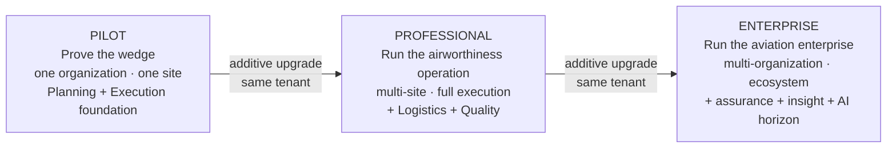

# Editions — Mercury Aviation Enterprise Operating System

| Field | Value |
|-------|-------|
| Document | Editions — packaging tiers and capability mapping |
| Product | Mercury Aviation Enterprise Operating System (AEOS) |
| Organization | Mercury Technologies |
| Layer | Product (packaging, entitlement, capability mapping) |
| Audience | Commercial and solution roles, product management, customer success, implementation partners, evaluating customers |
| Status | Living baseline — edition boundary changes require product leadership approval |
| Companion documents | [Product Family](Product_Family.md) · [Pricing Strategy](Pricing_Strategy.md) |
| Upstream authority | [Company Strategy](../01_Executive/Company_Strategy.md) · [ROADMAP](../../ROADMAP.md) |

---

## 1. Scope

### 1.1 In scope

This document defines **Mercury's three commercial editions — Pilot, Professional, and Enterprise — and maps capability to each one honestly, distinguishing what is delivered from what is planned.**

It exists so that a commercial conversation, a proposal, and a security review all describe the same product. A capability that appears in an edition column here without a *delivered* standing may be discussed as roadmap intent and must not be sold as available.

| Section | Content |
|---------|---------|
| §3 | The three editions, their intent, who each is for, and the OEM and Lessor packs |
| §4 | The capability matrix — module by module, edition by edition, with delivered-versus-planned standing |
| §5 | **How editions are actually enforced** — the honest answer, which is contractual rather than technical today |
| §6 | What is never gated by edition, and why |
| §7 | Movement between editions |
| §8 to §11 | Non-functional requirements, security, scalability, future enhancements |

### 1.2 Out of scope

| Concern | Authoritative location |
|---------|------------------------|
| What each module does and its capability standing | [Product Family](Product_Family.md) |
| Value metrics, packaging logic, and pricing principles | [Pricing Strategy](Pricing_Strategy.md) |
| Delivery sequencing and horizons | [ROADMAP](../../ROADMAP.md) |
| Segment prioritization and go-to-market motion | [Company Strategy](../01_Executive/Company_Strategy.md) |
| Permission model and roles | [RBAC](../06_Security/RBAC.md) |
| Contractual terms, service levels, support commitments | The contract. This document is not a commitment. |

### 1.3 Naming note

**"Standard" and "Professional" refer to the same middle edition.** This document uses **Professional** as the canonical name. Where a customer or a legacy document says Standard, it means Professional. Using both names in one proposal is how ambiguity gets signed.

---

## 2. Design principles

| # | Principle | Statement | Consequence |
|---|-----------|-----------|-------------|
| ED-1 | **Editions follow module boundaries, not feature lists** | An edition is a set of modules plus a set of scale and assurance characteristics. | A customer can reason about what they are buying. Feature-by-feature tiering would make the boundary arbitrary and the upgrade path unclear. |
| ED-2 | **No edition withholds safety, isolation, or evidence integrity** | Tenancy, RBAC, audit, immutability, signature integrity, and segregation of duties are in every edition. | ED-2 is absolute and is restated as §6. A Pilot customer gets the same isolation guarantees as an Enterprise customer. |
| ED-3 | **Editions respect the dependency order** | An edition cannot include a module whose prerequisites it omits. | Follows [Product Family §4](Product_Family.md#4-dependency-order). Selling Logistics without Planning would sell a warehouse system, not a thread. |
| ED-4 | **Delivered and planned are marked in every cell** | Edition inclusion says *entitled*; standing says *exists*. Both are shown. | Prevents the most common enterprise-software misrepresentation: a tier chart that implies availability. |
| ED-5 | **The entry edition is a real product, not a crippled demonstration** | Pilot delivers a complete wedge capability on real fleet data in an isolated organization. | The evaluation must prove value, which a hobbled tier cannot do. See [Company Strategy §7](../01_Executive/Company_Strategy.md#7-go-to-market-strategy). |
| ED-6 | **Upgrade is additive and non-destructive** | Moving up an edition adds modules to the same tenant. No migration, no re-entry, no data loss. | This is a technical property of the modular monolith, not a commercial promise. |
| ED-7 | **Enforcement mechanism is stated honestly** | Editions are contractual and deployment-scoped today, not enforced by a runtime entitlement system. | §5. Pretending otherwise would be discovered in the first technical review. |
| ED-8 | **Ecosystem participation is not priced out of reach** | Scoped external participation — lessor, authority, supplier — is designed to encourage joining the thread. | Follows [Company Strategy §6.1](../01_Executive/Company_Strategy.md#61-pricing-and-packaging-principles). Currently planned capability. |

---

## 3. The three editions

### 3.1 Pilot

**Intent.** Prove, on the customer's own fleet data in an isolated organization, that computed airworthiness status and provable evidence replace spreadsheet reconciliation.

| Dimension | Position |
|-----------|----------|
| Who it is for | A CAMO or airworthiness function evaluating Mercury; a small operator; a single-site independent MRO |
| Scope | One organization, one site, one fleet |
| Modules | Foundation, Fleet, Configuration, Library, Personnel, Planning, Execution |
| What it proves | The forecast computes; work packages generate from checks; the certification chain enforces; the logbook is produced automatically and is traceable |
| What it deliberately excludes | Logistics, Quality management beyond the audit trail, multi-site and multi-organization operation, ecosystem participation |
| Duration | Time-bounded evaluation or an ongoing small-operator deployment |
| Honest framing | This is a **complete wedge**, not a trial with features removed. ED-5. |

### 3.2 Professional

**Intent.** Run the whole airworthiness operation on one substrate — planning, execution, and supply — across multiple sites.

| Dimension | Position |
|-----------|----------|
| Who it is for | Mid-size operators, business aviation, cargo and helicopter operators, established independent MROs, CAMOs managing several fleets |
| Scope | One organization, multiple sites, multiple fleets |
| Modules | Pilot plus Logistics, Quality, Command, and the Finance and Insight capability view |
| What it delivers that Pilot does not | Material and tool demand derived from the same forecast; the full procurement chain; tool crib and calibration; the shortages view; audit and evidence queries; reporting |
| Why it is the centre of gravity | It is where the platform thesis pays off: shortages surface before the check arrives, without a second system and without reconciliation |
| Honest framing | Everything in this edition marked *delivered* in §4 exists in the runtime today. |

### 3.3 Enterprise

**Intent.** Run the aviation enterprise: multiple organizations under one company, enterprise assurance posture, and the ecosystem and intelligence horizons as they land.

| Dimension | Position |
|-----------|----------|
| Who it is for | Multi-entity groups; operators with separate CAMO and MRO legal entities; organizations with an enterprise security and identity estate; customers who need lessor, authority, or supplier participation |
| Scope | Multiple organizations under one company, unlimited sites and fleets |
| Modules | Professional plus multi-organization operation, federated identity, cryptographic signature providers, evidence pack export, cross-organization sharing, the Twin and AI horizon |
| What it delivers that Professional does not | Enterprise identity integration, edition-level assurance capability, ecosystem participation, and first access to intelligence capability as it becomes real |
| Honest framing | **A significant part of this edition's distinguishing capability is planned rather than delivered.** §4 marks every cell. An Enterprise contract signed today buys the delivered Professional capability at multi-organization scope, plus committed roadmap participation — and must say exactly that. |

### 3.4 OEM and Lessor packs

> **Standing: every pack in this section is Planned. None may be sold, quoted as available, or demonstrated as working today.** All of them depend on the cross-organization scoped sharing construct in §4.13, which does not exist in the runtime. This subsection specifies the packaging so that it is designed rather than improvised under deal pressure — which is exactly how over-granting happens.

#### 3.4.1 A pack is not a fourth edition

| Question | Answer |
|----------|--------|
| What is a pack? | A **scoped add-on** describing how a party who does not operate the aircraft participates in an operator's thread |
| Why not make them editions? | An edition is a module set for the organization that runs an airworthiness operation. A lessor does not run one, and an OEM does not run the operator's. Packaging them as editions would imply they hold continuing-airworthiness capability and responsibility they neither have nor want |
| Who holds the entitlement? | Either the operator, extending scoped participation outward, or the external party itself where they receive genuine workflow value. [Pricing Strategy §8.2](Pricing_Strategy.md#82-participant-classes) sets which, per participant class |
| What does a pack never include? | Write access to another organization's airworthiness records, tenancy in that organization, or any certification or release authority. **Absolute, in every pack** |
| Which edition can carry one? | Enterprise only. Packs depend on multi-organization operation and on the sharing construct |

#### 3.4.2 The Lessor and asset-owner pack

**Intent.** Give a lessor or asset owner continuous, read-scoped visibility of the condition of assets they own, wherever those assets are operated, without granting them tenancy and without the operator running an export project every quarter.

| Dimension | Position |
|-----------|----------|
| Who it is for | Operating lessors, asset owners, portfolio managers, and the technical-asset-management function acting for them |
| Contents | Read-scoped aircraft configuration and effective build state; component life status against limits; airworthiness directive and service bulletin compliance status; open deferred defects and MEL items; the technical logbook and release evidence for owned assets; return-standard readiness against lease-return conditions |
| Access shape | **Read-only, field-scoped, time-bounded, audited per access.** Never membership |
| Depends on | The sharing construct (§4.13); **lease and ownership as first-class fleet records**, which is Planned in [Product Family §5.3](Product_Family.md#53-m3--fleet); and the materialized passport projection for acceptable latency |
| Standing | **Planned.** Two prerequisites, both Planned |
| Why it matters commercially | It is the pack that makes the [Digital Aircraft Passport](../04_Data/Digital_Thread.md#7-the-digital-aircraft-passport) defensible across a transaction rather than merely internally useful |

#### 3.4.3 The OEM pack

**Intent.** Let a manufacturer exchange structured service data with operators on the thread, so that applicability determination stops being a manual reading exercise performed independently by every operator of the same type.

| Dimension | Position |
|-----------|----------|
| Who it is for | Aircraft, engine, and component manufacturers, and their in-service engineering and product-support functions |
| Contents | Structured service-bulletin and service-letter publication into subscribing operators' libraries; effectivity and applicability signals evaluated against live configuration; de-identified, consent-scoped in-service reliability and removal signals returning to the manufacturer |
| Access shape | Publication **into** an operator's library is a proposal the operator accepts, never a direct write. Signals **out** require explicit, per-operator, revocable consent and de-identification |
| Depends on | The sharing construct; **automated applicability evaluation against live configuration**, Planned in [Product Family §5.8](Product_Family.md#58-m8--planning); the managed binary content store |
| Standing | **Planned.** Its most valuable component — automated applicability — is itself Planned |
| Commercial shape | Partnership terms, potentially reciprocal. [Pricing Strategy §8.2](Pricing_Strategy.md#82-participant-classes) explains why removing manual applicability determination is worth more to Mercury's customers than a licence fee is to Mercury |

#### 3.4.4 Adjacent participant classes, deliberately not packaged as packs

| Party | Why not a pack |
|-------|----------------|
| **Aviation authority** | Oversight access is **never priced and never packaged.** A regulator must not encounter a commercial construct between themselves and a Mercury customer's records. [Pricing Strategy §8.2](Pricing_Strategy.md#82-participant-classes) states this as an absolute |
| **Component and engine shop** | A shop performs work and needs a workflow, not a visibility pack. It is served by the shop-visit lifecycle with life continuity — Planned, and tracked as a module capability in [Product Family §10](Product_Family.md#10-future-enhancements) rather than as packaging |
| **Supplier and distributor** | Electronic quotation, acknowledgement, shipping notice, and certificate exchange are integration surfaces on M9, priced minimally or not at all so that participation is not suppressed |
| **The operator's own contractor** | Scoped participation inside the operator's tenancy, counted within their named-user metric. No pack required |

#### 3.4.5 The honest packaging rules

| # | Rule |
|---|------|
| 1 | **A pack is Planned until the sharing construct exists.** Until then, describing one as available is a misrepresentation, not optimism |
| 2 | **A pack is never delivered by granting organization membership.** Membership over-grants catastrophically — it confers the member's role across the whole organization, not a scoped read of specific assets. Substituting membership because a deal is close would be a security failure caused by a commercial decision |
| 3 | **A pack is read-only.** No external party writes into an operator's airworthiness record, in any pack, ever |
| 4 | **The operator consents, per party and per scope, and can revoke.** The operator owns the records; a pack is their grant to make, not Mercury's to sell over their head |
| 5 | **Every pack access is audited.** Scoped external access that is not recorded is indistinguishable from a leak |
| 6 | **A pack never gates anything in §6.** Isolation, audit, immutability, and evidence integrity are not pack contents |

#### 3.4.6 What can honestly be offered today

Nothing in §3.4. The two mechanisms that exist are both wrong for the purpose, and saying so plainly is more useful than a workaround:

| Mechanism available today | Why it is not a pack |
|---------------------------|----------------------|
| Grant the external party organization membership | Over-grants. They receive a role across the entire organization rather than scoped visibility of specific assets, and rule 2 prohibits it |
| Export data and send it | **Leaves the thread.** The recipient holds a detached snapshot with no provenance, no currency, and no audit of their access — the precise problem Mercury exists to remove |

The correct answer to a lessor or OEM opportunity today is therefore to describe the pack as designed roadmap capability, name the sharing construct as its prerequisite, and decline to simulate it. That is ED-7 and PR-8 applied to the packaging layer.

---

## 4. Capability matrix

**How to read this matrix.** The edition columns state **entitlement**: whether a capability is in scope for that edition. The standing column states **reality**: whether it exists in the runtime. Both must be true before a capability is sold.

For a one-page module-level view of the same mapping, see [Product Family §3.4](Product_Family.md#34-module-to-edition-mapping). This section is authoritative wherever the two differ.

| Legend | Meaning |
|--------|---------|
| ● | Included in the edition |
| ◐ | Included, scoped or limited — see the note |
| ○ | Not included |
| **D** | **Delivered** — exists in the runtime, enforced server-side |
| **P** | **Partial** — some capability exists; named parts do not |
| **N** | **Planned** — no runtime capability. Roadmap intent only. |

### 4.1 Foundation — M2 Organization and Access

| Capability | Standing | Pilot | Professional | Enterprise |
|-----------|----------|:-----:|:------------:|:----------:|
| Multi-tenancy with organization isolation | **D** | ● | ● | ● |
| Companies, organizations, sites, departments, teams | **D** | ◐ one org, one site | ◐ one org, multi-site | ● multi-org |
| Users, memberships, membership-aware session context | **D** | ● | ● | ● |
| Four session roles and the full permission scope set | **D** | ● | ● | ● |
| Aviation persona overlays | **P** mapped; uniform enforcement planned | ● | ● | ● |
| Audit trail on mutating calls and domain events | **D** | ● | ● | ● |
| Administrative APIs, health, readiness, metrics, structured logging | **D** | ● | ● | ● |
| Edge TLS, security headers, rate limiting | **D** | ● | ● | ● |
| Backup and restore tooling | **D** | ● | ● | ● |
| **Federated identity — OpenID Connect, directory synchronization** | **N** | ○ | ○ | ● |
| **Shared session store for multi-worker scale-out** | **N** | ○ | ◐ | ● |
| Uniform write-scoping verified by test | **N** | ● | ● | ● |

Note on the last row: it is marked included in every edition because it is a **platform correctness obligation**, not a feature. It appears here so that its planned standing is visible, not so that it can be sold.

### 4.2 M3 Fleet

| Capability | Standing | Pilot | Professional | Enterprise |
|-----------|----------|:-----:|:------------:|:----------:|
| Manufacturer, family, model, status catalogue | **D** | ● | ● | ● |
| Fleet operators and fleets | **D** | ◐ one fleet | ● | ● |
| Aircraft keyed by airframe serial | **D** | ● | ● | ● |
| Registration history with validity intervals | **D** | ● | ● | ● |
| Status transitions, isolated and audited | **D** | ● | ● | ● |
| **Lease and ownership as first-class records** | **N** | ○ | ○ | ● |

### 4.3 M4 Configuration

| Capability | Standing | Pilot | Professional | Enterprise |
|-----------|----------|:-----:|:------------:|:----------:|
| ATA catalogue, component catalogue, alternate parts | **D** | ● | ● | ● |
| Serialized components with install, remove, transfer | **D** | ● | ● | ● |
| Immutable installation history | **D** | ● | ● | ● |
| One component per aircraft position, database-enforced | **D** | ● | ● | ● |
| TSN, CSN, TSO, CSO and life limits with unit-level override | **D** | ● | ● | ● |
| Aircraft configuration API | **D** | ● | ● | ● |
| Historical configuration by traversal | **D** | ● | ● | ● |
| **Assembly hierarchy with next-higher-assembly rollup** | **N** | ○ | ● | ● |
| **Materialized Digital Aircraft Passport projection** | **N** | ○ | ◐ | ● |

### 4.4 M5 Library

| Capability | Standing | Pilot | Professional | Enterprise |
|-----------|----------|:-----:|:------------:|:----------:|
| Typed publications with access classification | **D** | ● | ● | ● |
| **Immutable revisions** with effective dates and supersession | **D** | ● | ● | ● |
| Licence-safe storage locators | **D** | ● | ● | ● |
| Applicability by manufacturer, model, variant, ATA, catalogue links | **D** | ● | ● | ● |
| Library browse and search | **D** | ● | ● | ● |
| **Managed binary content store with integrity checking** | **N** | ○ | ● | ● |
| **In-place document viewer** | **N** | ○ | ● | ● |
| **Automated applicability evaluation against live configuration** | **N** | ○ | ○ | ● |
| Section-level extraction and grounded retrieval | **N** | ○ | ○ | ● |

### 4.5 M6 Personnel

| Capability | Standing | Pilot | Professional | Enterprise |
|-----------|----------|:-----:|:------------:|:----------:|
| Employees, qualifications, authorizations including ACA | **D** | ● | ● | ● |
| Signer binding preventing signing as another person | **D** | ● | ● | ● |
| Credential verification per method; PIN and password | **D** | ● | ● | ● |
| Immutable SHA-256 signatures over a canonical payload | **D** | ● | ● | ● |
| Authority validity asserted at the certification step | **D** | ● | ● | ● |
| **PKI and smart-card signature adapters** | **N** | ○ | ◐ | ● |
| **Cryptographic certificate-chain non-repudiation** | **N** | ○ | ○ | ● |
| Authority and currency expiry forecasting | **N** | ○ | ● | ● |

**The non-claim, restated in a commercial document because this is where it matters most.** No edition currently provides certificate-backed non-repudiation. Every edition provides hash attestation of signed content and verified method. Any proposal implying otherwise is a misrepresentation. See [Digital Signatures](../06_Security/Digital_Signatures.md).

### 4.6 M7 Execution

| Capability | Standing | Pilot | Professional | Enterprise |
|-----------|----------|:-----:|:------------:|:----------:|
| Maintenance task engine | **D** | ● | ● | ● |
| Work packages, work orders, job cards, attachments | **D** | ● | ● | ● |
| Validated job-card transitions; assign, complete, inspect, release | **D** | ● | ● | ● |
| **Ordered certification chain with segregation of duties** | **D** | ● | ● | ● |
| **Release preconditions — revision and ATA required** | **D** | ● | ● | ● |
| **Atomic release plus technical logbook entry** | **D** | ● | ● | ● |
| Append-only logbook amendment | **D** | ● | ● | ● |
| Component history write-back on maintenance release | **D** | ● | ● | ● |
| Critical task policies and fault codes | **D** | ● | ● | ● |
| Role dashboards and MRO reports | **D** | ◐ core roles | ● | ● |
| Offline synchronization queue | **D** | ○ | ● | ● |
| Single-transaction certify bridge | **N** | ● | ● | ● |
| **Fully offline-capable job card execution** | **N** | ○ | ● | ● |

### 4.7 M8 Planning

| Capability | Standing | Pilot | Professional | Enterprise |
|-----------|----------|:-----:|:------------:|:----------:|
| Maintenance programmes with immutable revisions | **D** | ● | ● | ● |
| MPD tasks with multi-unit intervals | **D** | ● | ● | ● |
| Maintenance checks with due computation | **D** | ● | ● | ● |
| AD, SB, EO control keyed per revision with approval workflow | **D** | ● | ● | ● |
| MEL and CDL items | **D** | ● | ● | ● |
| Deferred defects with expiry and alerting | **D** | ● | ● | ● |
| Utilization counters and traffic lights | **D** | ● | ● | ● |
| Forecast over 30, 90, 180, 365-day windows; due list | **D** | ● | ● | ● |
| Planner dashboard and aircraft status view | **D** | ● | ● | ● |
| **Automatic work package generation into Execution** | **D** | ● | ● | ● |
| Hangar, parts, tool, workforce plan lines | **D** | ◐ plan lines produced; no logistics fulfilment | ● | ● |
| **Automatic material and tool planning bridge into Logistics** | **D** | ○ requires Logistics | ● | ● |
| Materialized due list | **N** | ○ | ● | ● |
| Utilization history and reproducible historical forecast | **N** | ○ | ● | ● |
| Interactive slot and capacity optimization | **N** | ○ | ○ | ● |
| Automated utilization intake from flight operations | **N** | ○ | ○ | ● |

### 4.8 M9 Logistics

| Capability | Standing | Pilot | Professional | Enterprise |
|-----------|----------|:-----:|:------------:|:----------:|
| Warehouse hierarchy and addressable locations | **D** | ○ | ● | ● |
| Part master with identifiers, families, supersessions | **D** | ○ | ● | ● |
| Stock units, balances, **append-only movement ledger** | **D** | ○ | ● | ● |
| FIFO and FEFO issue policies | **D** | ○ | ● | ● |
| Reservations, material requests, issue and return | **D** | ○ | ● | ● |
| Rotable cycles | **D** | ○ | ● | ● |
| Tool crib with calibration control and lost-tool reporting | **D** | ○ | ● | ● |
| Procurement chain: requisition, RFQ, quote, PO, shipment, receipt, invoice | **D** | ○ | ● | ● |
| Vendor management | **D** | ○ | ● | ● |
| Barcode and RFID scan APIs | **D** | ○ | ● | ● |
| Shortages and logistics dashboards | **D** | ○ | ● | ● |
| Distinct finance permission scope | **D** | ○ | ● | ● |
| **Native hangar scanning client** | **N** | ○ | ● | ● |
| Balance-to-ledger reconciliation | **N** | ○ | ● | ● |
| Multi-currency valuation, cycle counting, supplier scoring | **N** | ○ | ○ | ● |
| Electronic vendor integration | **N** | ○ | ○ | ● |

### 4.9 M10 Quality

| Capability | Standing | Pilot | Professional | Enterprise |
|-----------|----------|:-----:|:------------:|:----------:|
| Immutable audit trail | **D** | ● | ● | ● |
| Scoped audit query with retention window | **D** | ● | ● | ● |
| Evidence records with provenance | **D** | ● | ● | ● |
| Fail-closed audit on the certification path | **D** | ● | ● | ● |
| Segregation-of-duties and configuration integrity | **D** via M4 and M7 | ● | ● | ● |
| **Findings and corrective actions** | **N** | ○ | ● | ● |
| **Audit programme management** | **N** | ○ | ● | ● |
| Repeat-finding analysis | **N** | ○ | ○ | ● |
| **Evidence pack export** | **N** | ○ | ◐ | ● |
| **Tamper-evident evidence chaining** | **N** | ○ | ○ | ● |
| Scheduled thread-integrity checking | **N** | ● | ● | ● |

The audit trail is in every edition because ED-2 makes it non-negotiable. Quality *management* — findings, corrective actions, programme scheduling — is the Professional and Enterprise capability, and it is planned.

### 4.10 M1 Command

| Capability | Standing | Pilot | Professional | Enterprise |
|-----------|----------|:-----:|:------------:|:----------:|
| Incident lifecycle with evidence, persisted | **D** | ○ | ● | ● |
| Connector registry and health | **D** | ○ | ● | ● |
| Advisory decision engine with human review | **D**, in-memory | ○ | ● | ● |
| Alerts, missions, timeline, fusion | **P**, in-memory only | ○ | ◐ | ◐ |
| Live map, radar, twin airport view, narration | **P**, frontend simulation | ○ | ◐ | ◐ |
| Response orchestration API | **D** | ○ | ● | ● |
| Persisted operations events feeding the forecast | **N** | ○ | ○ | ● |

**Command must be positioned carefully in any proposal.** Its persistent capability is incidents, evidence, connector health, and the audit trail. Its missions, decisions, alerts, and live picture are in-memory or client-side simulation. It is not an airworthiness or safety-of-life capability and Mercury claims no certification for such use. See [Product Family §5.1](Product_Family.md#51-m1--command--operations-heritage) and [SECURITY.md](../../SECURITY.md).

### 4.11 M11 Twin and AI

| Capability | Standing | Pilot | Professional | Enterprise |
|-----------|----------|:-----:|:------------:|:----------:|
| AI-ready index, embedding, cross-reference structures | Schema only, no payload | ● | ● | ● |
| Knowledge graph projection | **N** | ○ | ○ | ● |
| Grounded, cited retrieval over publications | **N** | ○ | ○ | ● |
| Reliability and trend analytics | **N** | ○ | ○ | ● |
| Predictive maintenance, advisory only | **N** | ○ | ○ | ● |
| Digital twin | **N** | ○ | ○ | ● |
| Assistive drafting and defect triage | **N** | ○ | ○ | ● |

**Every row in this table is planned.** There is no retrieval, no optical character recognition, and no model inference in the current release. An Enterprise proposal may describe this as committed roadmap participation. It may not describe it as included capability. See [Knowledge Graph §1.2](../04_Data/Knowledge_Graph.md#12-honest-status-stated-first).

### 4.12 M12 Finance and Insight

| Capability | Standing | Pilot | Professional | Enterprise |
|-----------|----------|:-----:|:------------:|:----------:|
| Stock valuation and warranty fields | **P** | ○ | ● | ● |
| Purchase commitments via purchase orders | **P** | ○ | ● | ● |
| Distinct finance permission scope | **D** | ○ | ● | ● |
| Reports — summary, history, executive view | **D** | ◐ core reports | ● | ● |
| **Labour cost records and package cost rollup** | **N** | ○ | ○ | ● |
| Warranty claim lifecycle | **N** | ○ | ○ | ● |
| Contract and rate schedules | **N** | ○ | ○ | ● |
| General-ledger outbound interface | **N** | ○ | ○ | ● |
| Cost, capacity, workforce insight | **N** | ○ | ○ | ● |

### 4.13 Ecosystem participation

| Capability | Standing | Pilot | Professional | Enterprise |
|-----------|----------|:-----:|:------------:|:----------:|
| **Cross-organization scoped sharing construct** | **N** | ○ | ○ | ● |
| Lessor and asset-owner scoped visibility | **N** | ○ | ○ | ● |
| Authority oversight read-scoped views, advisory posture | **N** | ○ | ○ | ● |
| Component and engine shop workflows with life continuity | **N** | ○ | ○ | ● |
| OEM service-data exchange | **N** | ○ | ○ | ● |
| Supplier and vendor integration at scale | **N** | ○ | ○ | ● |

All planned. Today, serving an external party means either granting organization membership — which over-grants — or exporting, which leaves the thread. The sharing construct is the single unlock for this entire table and is a security requirement rather than merely a feature. See [Digital Thread §7.3](../04_Data/Digital_Thread.md#73-who-consumes-the-passport-and-for-what).

How this capability is packaged once it exists — and what may not be said about it before then — is specified in [§3.4](#34-oem-and-lessor-packs).

### 4.14 Scale and operational envelope

| Dimension | Pilot | Professional | Enterprise |
|-----------|-------|--------------|------------|
| Organizations | 1 | 1 | Multiple under one company |
| Sites | 1 | Multiple | Unlimited |
| Fleets | 1 | Multiple | Unlimited |
| Aircraft | Bounded by agreement | By value metric | By value metric |
| Named users | Bounded by agreement | By value metric | By value metric |
| Deployment | Mercury-operated | Mercury-operated | Mercury-operated or customer-managed by agreement |
| Environments | Production only | Production plus one non-production | Production plus non-production by agreement |
| Identity | Local users | Local users | Federated, when delivered |
| Data residency | As offered | As offered | By agreement |
| Support and success | Evaluation support | Standard | Named customer success, quarterly thread-completeness review |

Numeric limits are commercial parameters, not technical ones, and belong in the contract. The value metrics that drive them are in [Pricing Strategy §4](Pricing_Strategy.md#4-value-metrics).

---

## 5. How editions are actually enforced

This is the section a technical evaluator will ask about, and the honest answer is short.

### 5.1 The current mechanism

**There is no runtime entitlement, licensing, feature-flag, or edition-gating system in the Mercury codebase.** An edition is a **contractual and deployment-scoped** construct, realized through four mechanisms:

| Mechanism | What it controls | How strong it is |
|-----------|-----------------|------------------|
| **Contract scope** | Which modules the customer is licensed to use, and the numeric envelope in §4.14 | Legal, not technical |
| **Provisioning** | Which organizations and sites exist; whether a customer has one organization or several | Structural and effective — multi-organization operation genuinely requires provisioned organizations |
| **Permission grants** | Which roles and scopes are granted to the customer's users; a customer whose users hold no `logistics.*` scopes cannot use Logistics | Technical and effective at the user level |
| **Environment configuration** | Deployment-level configuration and administrative runtime settings | Operational |

### 5.2 What this means in practice

| Consequence | Detail |
|-------------|--------|
| A module not licensed is not *technically blocked* | If a user were granted the relevant permission scopes, the endpoints would respond. Restriction is by permission grant and provisioning, not by an entitlement check. |
| Permission-based restriction is real but coarse | Withholding the `logistics.*` scopes genuinely prevents Logistics use. It does not express "Professional but not Enterprise" for capability that shares a scope. |
| Scale limits are not enforced | Aircraft counts, site counts, and user counts are contractual. The runtime does not count or cap them. |
| An edition upgrade requires no code change | Which is exactly why upgrade is non-destructive under ED-6 — and also why enforcement is weak. |
| Publication access classifications are not edition gating | `public`, `internal`, `restricted`, `licensed` are content licence metadata, not commercial packaging. |

### 5.3 Why this is disclosed rather than papered over

Three reasons. It will be found in the first serious technical or security review, and being the one who said it first is the difference between candour and a finding. It is a genuine gap that belongs on a roadmap, and roadmaps built on inaccurate current-state assessments fail. And it is consistent with the operating commitment not to sell what is on the roadmap as though it were delivered — see [Company Strategy §10.1](../01_Executive/Company_Strategy.md#101-what-mercury-deliberately-does-not-do).

### 5.4 What proper enforcement would require

Listed here as scope, not as a promise:

1. An entitlement record per organization, naming licensed modules and numeric limits.
2. A service-boundary entitlement check, applied alongside — never instead of — the existing permission check.
3. Enforced numeric limits with a clear, non-punitive over-limit behaviour: warn and report, never silently degrade a safety-critical path.
4. Entitlement changes written to the audit trail, since they change what a tenant may do.
5. A capability-discovery endpoint so the interface can present only what the tenant is entitled to.

**One constraint on any such work is absolute.** An entitlement check must never be able to block a certification step, a release, or an audit read. A commercial control that could ground an aircraft or prevent evidence retrieval would be a safety defect dressed as a business rule. Entitlement gates *feature access*; it never gates *safety, isolation, or evidence*. That is ED-2 applied to the enforcement mechanism itself.

---

## 6. What is never gated by edition

ED-2, stated as an enumerated list because it is the commitment most likely to be tested.

| Never gated | Present in every edition, including Pilot |
|-------------|------------------------------------------|
| Organization isolation and multi-tenant separation | Yes |
| Role-based access control and the full permission model | Yes |
| The audit trail and scoped audit query | Yes |
| Immutability of publication revisions | Yes |
| Immutability of signatures, certification events, logbook entries, installation history, stock movements | Yes |
| Ordered certification enforcement | Yes |
| Segregation of duties and distinct independent inspector | Yes |
| Release preconditions — immutable revision and ATA chapter | Yes |
| Atomic release plus technical logbook entry | Yes |
| Signer binding preventing signing as another person | Yes |
| Fail-closed audit on the certification path | Yes |
| Edge TLS, security headers, rate limiting | Yes |
| Backup and restore capability | Yes |
| The customer's right to export their own data | Yes |

**These are not features.** They are properties of the platform, and a platform that sold them by tier would be selling the absence of safety at the lower tiers. See [Pricing Strategy §3](Pricing_Strategy.md#3-pricing-principles).

---

## 7. Movement between editions

### 7.1 Upgrade

Upgrade is **additive and non-destructive**, and this is a technical property rather than a commercial courtesy: modules operate on the same substrate within the same tenant, so enabling one adds capability over data that already exists.

| From → To | What happens | Customer effort |
|-----------|-------------|-----------------|
| Pilot → Professional | Logistics, Quality management, Command, and reporting are enabled in the same organization | Load logistics master data — warehouses, locations, part masters, vendors, tools — and opening stock. See [Master Data §11](../04_Data/Master_Data.md#11-onboarding-migration-and-deduplication). |
| Professional → Enterprise | Additional organizations are provisioned under the same company; enterprise assurance and ecosystem capability is enabled as delivered | Organization design, identity integration when available, sharing-agreement design when available |
| Pilot → Enterprise | Both of the above | Both of the above |

**No re-implementation, no data migration, no re-entry.** The most valuable property of the upgrade path is what the customer does *not* have to do: the aircraft, components, publications, employees, and history entered during Pilot are the same records Professional and Enterprise operate on.

### 7.2 Downgrade

| Rule | Detail |
|------|--------|
| Data is retained, not deleted | Withdrawal is a lifecycle state. Evidence is never removed. |
| Access to a de-scoped module's data becomes read-only or unavailable by permission grant | Depending on the agreement |
| **Evidence access is never withdrawn** | A customer must always be able to retrieve the airworthiness evidence they created. Withholding it would be indefensible regardless of commercial status. |
| Export on termination | The customer's right to their own data is not edition-dependent |

That third row is worth stating in bold in any contract. An operator's audit obligations do not end when a subscription does.

### 7.3 Evaluation to production

| Stage | Position |
|-------|----------|
| Structured evaluation | On the customer's own fleet data in an isolated organization, demonstrating computed status and a produced evidence pack |
| Never a scripted demonstration of unavailable capability | [Company Strategy §7](../01_Executive/Company_Strategy.md#7-go-to-market-strategy) |
| Delivered versus planned stated in writing during evaluation | Mandatory. This document is the artifact used to do it. |
| Evaluation organization becomes the production organization, or is retired | By agreement; either path is non-destructive |

---

## 8. Non-functional requirements

### 8.1 Reading the targets

As elsewhere: **current baseline** is what the runtime does; **aspirational enterprise target** is directional and is not a service-level commitment. Actual service levels are contractual. See [Data Model §11.1](../04_Data/Data_Model.md#111-reading-the-targets).

### 8.2 Per-edition operational envelope

| Requirement | Pilot | Professional | Enterprise |
|-------------|-------|--------------|------------|
| Availability posture | Best-effort, single deployment | Production posture, single deployment | Production posture, aspiring to 99.95 percent on the certification and release path |
| Failure domain | Whole platform | Whole platform | Whole platform today; module-group isolation is the target |
| Horizontal scale-out | Not required | Constrained by in-process sessions | Requires the shared session store — planned |
| Evidence durability target | RPO 0 aspiration, same as every edition | Same | Same |
| Transactional durability target | RPO 15 minutes aspiration | Same | Same |
| Recovery of read-only evidence access | RTO 1 hour aspiration | Same | Same |
| Backup and restore | Included | Included | Included, with agreed schedule and tested restore |
| Performance targets | Same as every edition — see [Product Family §7.3](Product_Family.md#73-module-level-performance) | Same | Same |
| Non-production environment | None | One | By agreement |

**Durability and evidence targets are identical across editions**, deliberately. Losing a release signature is not more acceptable for a small customer.

### 8.3 Support and success

| Requirement | Pilot | Professional | Enterprise |
|-------------|-------|--------------|------------|
| Onboarding | Guided load of the §11 onboarding sequence in Master Data | Guided, including logistics master data | Programme-managed, multi-organization |
| Data steward identification | Required before load | Required per domain | Required per organization and per domain |
| Success measure | Thread completeness and evidence readiness, not licence consumption | Same | Same, with quarterly review |
| Roadmap participation | Informed | Consulted | Committed participation in named horizon items |

---

## 9. Security considerations

**No edition may withhold a security property.** §6 is the enumerated commitment, ED-2 is the principle, and §5.4 extends it to the enforcement mechanism itself: an entitlement check must never be capable of blocking a certification step, a release, or an audit read.

**Multi-organization operation in Enterprise raises the isolation stakes rather than relaxing them.** A group operating several organizations under one company has users who legitimately hold memberships in more than one. Every context switch re-derives the effective role from membership, and a denied switch is audited as a security event. Cross-organization *visibility* remains prohibited without the planned sharing construct — a user with two memberships sees two organizations one at a time, never merged. Any request for a merged multi-organization view must be met with the sharing construct, not with a relaxed filter.

**The absence of runtime entitlement enforcement is a commercial exposure, not a security exposure.** Permissions and organization isolation are enforced independently of edition and are unaffected by it. A customer cannot reach another customer's data by being on the wrong tier. What a customer could theoretically do is use a module they have not licensed, given the permission grants to do so. That is a licensing matter. Conflating the two — in either direction — would be a mistake: describing entitlement as a security control would overstate it, and describing the gap as a security hole would misstate it.

**Federated identity is an Enterprise capability with a boundary condition.** When delivered, an external directory's group model must never become Mercury's authority model. Certification authority is Mercury's own determination, held in M6 personnel records, and no identity provider claim may confer it. This anti-corruption boundary is recorded in [Domain Architecture §6.3](../02_Architecture/Domain_Architecture.md#63-anti-corruption-layers).

**Ecosystem participation, when it lands, must be read-only, field-scoped, time-bounded, and audited per access.** Granting an external party organization membership as a shortcut would over-grant catastrophically. This is why the sharing construct is a security requirement.

**Publication licence classification is not commercial packaging.** `public`, `internal`, `restricted`, `licensed` describe content licence posture per organization. They must not be repurposed as edition gating, because doing so would entangle a legal control with a commercial one.

**Non-claims apply to every edition equally.** Mercury publishes no compliance certification it has not independently earned and claims no certified aviation, defence, surveillance, emergency-response, or safety-of-life operational approval. No edition changes this. See [SECURITY.md](../../SECURITY.md).

Full detail: [Security documentation set](../06_Security/) · [Identity](../06_Security/Identity.md) · [RBAC](../06_Security/RBAC.md) · [Audit](../06_Security/Audit.md) · [Digital Signatures](../06_Security/Digital_Signatures.md).

---

## 10. Scalability considerations

### 10.1 What actually changes with edition

| Dimension | How it scales across editions |
|-----------|------------------------------|
| Organizations | The only structural dimension that genuinely differs. Multi-organization operation requires provisioned organizations and multi-membership users. |
| Sites and fleets | Contractual, not technical. The schema supports many; editions bound them commercially. |
| Aircraft count | Drives configuration, history, planning, and evidence volume. The dominant technical scale driver. |
| Module count | Drives table breadth and cross-module read cost, not depth |
| Users | Drives session and permission-resolution load — the dimension most affected by the in-process session constraint |
| Asset age | **The most underestimated driver.** A twenty-year-old airframe's history is larger than a new one's, so traversal cost grows with fleet age independently of fleet size. See [Digital Thread §11.1](../04_Data/Digital_Thread.md#111-what-grows-and-how-fast). |

### 10.2 Honest constraints by edition

| Edition | Constraint | Consequence |
|---------|-----------|-------------|
| Pilot | Single deployment, no non-production environment | Adequate for its purpose |
| Professional | In-process sessions limit multi-worker scale-out | A large multi-site customer may reach this before Mercury does. Disclose it. |
| Professional | Logistics movement volume is the fastest-growing table | Time partitioning is planned, not delivered |
| Enterprise | Multi-organization is provisioned, not partitioned | All organizations share one database and one application process. Per-organization performance isolation does not exist. |
| Enterprise | No purpose-built read models for cross-module views | Dashboard and passport latency grows with tenant size and asset age |
| All | No durable message broker | Audit and future projection are in-process |

Row four is the one most likely to matter in an Enterprise evaluation and is the least likely to be volunteered by a competitor: **provisioning several organizations does not isolate their performance from each other.** A noisy organization affects its siblings.

### 10.3 What must remain true at any scale

Isolation asserted on every call. Ordered certification and distinct-signer enforcement. Atomic release plus logbook plus component history. Stock reservation correctness under concurrency. A complete audit trail with no gap. None of these is an edition feature; all are platform invariants.

---

## 11. Future enhancements

| # | Enhancement | Editions affected | Value | Depends on |
|---|-------------|-------------------|-------|------------|
| 1 | **Runtime entitlement enforcement** with an audited entitlement record and a capability-discovery endpoint | All | Makes editions technically real instead of contractual; enables self-service capability presentation | §5.4 scope, ADR |
| 2 | **Workspaces for Fleet, Configuration, Library, and Personnel** | All, most visibly Pilot | Four delivered modules become usable through the interface. No backend work required. | Interface work |
| 3 | **Shared session store** | Professional, Enterprise | Removes the horizontal scaling constraint | Redis |
| 4 | **Federated identity** | Enterprise | Removes a common enterprise procurement blocker | OpenID Connect |
| 5 | **Cryptographic signature providers** | Professional, Enterprise | Converts hash attestation into certificate-backed non-repudiation | Key management |
| 6 | **Evidence pack export** | Professional, Enterprise | Turns audit preparation and redelivery from a project into a request | Object storage, integrity manifest |
| 7 | **Cross-organization scoped sharing** | Enterprise | Unlocks the entire ecosystem participation table in §4.13 and every pack in §3.4 | Audited sharing aggregate |
| 8 | **Findings, corrective actions, audit programme** | Professional, Enterprise | Completes the quality management capability that Professional is sold on | M10 aggregate expansion |
| 9 | **Tamper-evident evidence chaining** | Enterprise, then all | The strongest available upgrade to Mercury's evidential claim; belongs everywhere once built, per ED-2 | Append-only store |
| 10 | **Lease and ownership records** | Enterprise | Prerequisite for a credible lessor-facing offer | Fleet model extension |
| 11 | **Per-organization performance isolation** | Enterprise | Removes the noisy-neighbour effect within one company | Partitioning or module-group deployment |
| 12 | **Non-production environment provisioning** | Professional, Enterprise | Customer-side change management | Deployment automation |
| 13 | **Knowledge graph, retrieval, reliability, twin** | Enterprise | Converts thread density into insight, advisory by design | [Knowledge Graph §7](../04_Data/Knowledge_Graph.md#7-target-architecture) |
| 14 | **A published, versioned edition definition** kept in step with the runtime | All | One artifact that commercial, product, and compliance functions cannot disagree about | This document plus release discipline |

---

## 12. Related documents

**Product set**
[Product Family](Product_Family.md) · [Pricing Strategy](Pricing_Strategy.md)

**Executive and commercial**
[Company Strategy](../01_Executive/Company_Strategy.md) · [Vision](../01_Executive/Vision.md) · [Mission](../01_Executive/Mission.md) · [Founders' Letter](../01_Executive/Founders_Letter.md)

**Business — segment fit per edition**
[Business documentation set](../03_Business/) · [CAMO](../03_Business/CAMO.md) · [MRO](../03_Business/MRO.md) · [Airline](../03_Business/Airline.md) · [Leasing](../03_Business/Leasing.md) · [OEM](../03_Business/OEM.md) · [Authority](../03_Business/Authority.md) · [Suppliers and Logistics](../03_Business/Suppliers_Logistics.md)

**Architecture and data**
[Domain Architecture](../02_Architecture/Domain_Architecture.md) · [Technical Architecture](../02_Architecture/Technical_Architecture.md) · [Digital Thread](../04_Data/Digital_Thread.md) · [Data Model](../04_Data/Data_Model.md) · [Master Data](../04_Data/Master_Data.md) · [Knowledge Graph](../04_Data/Knowledge_Graph.md)

**Security and regulation**
[Security documentation set](../06_Security/) · [SECURITY.md](../../SECURITY.md) · [Regulations documentation set](../09_Regulations/)

**Delivery**
[ROADMAP](../../ROADMAP.md) · [CHANGELOG](../../CHANGELOG.md) · [ADR register](../08_Standards/ADR/)

---

*Mercury Technologies — One Digital Thread. One Digital Aircraft Passport. One Aviation Enterprise Operating System.*
