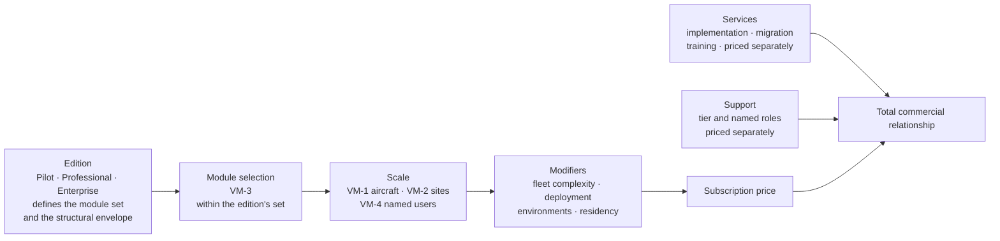

# Pricing Strategy — Mercury Aviation Enterprise Operating System

| Field | Value |
|-------|-------|
| Document | Pricing Strategy — value metrics, packaging, and commercial principles |
| Product | Mercury Aviation Enterprise Operating System (AEOS) |
| Organization | Mercury Technologies |
| Layer | Product (commercial model) |
| Audience | Product and commercial leadership, board, solution and customer-success roles, finance |
| Status | Living baseline — metric or principle changes require product and commercial leadership approval |
| Companion documents | [Editions](Editions.md) · [Product Family](Product_Family.md) |
| Upstream authority | [Company Strategy §6.1](../01_Executive/Company_Strategy.md#61-pricing-and-packaging-principles) |

---

## 1. Scope

### 1.1 In scope

This document defines **how Mercury prices — the value metrics, the packaging logic, and the principles that govern both.** It is a framework document. It tells a commercial team how to construct a price, not what to charge.

| Section | Content |
|---------|---------|
| §3 | Pricing principles — the design principles of the commercial model |
| §4 | Value metrics — what Mercury meters, what it deliberately does not, and why |
| §5 | The packaging model — how metrics and editions combine into an offer |
| §6 | **Illustrative** packaging structures, clearly marked, with no real prices |
| §7 | Commercial motion, quoting discipline, discounting policy, and the pilot-to-paid conversion |
| §8 | Ecosystem and external-participant pricing |
| §9 to §12 | Non-functional requirements on the commercial system, security, scalability, future enhancements |

### 1.2 What this document does not contain

**There are no list prices, rate cards, currency amounts, discount percentages, or revenue projections in this document, and none may be added to it.**

This is a deliberate constraint with three reasons behind it:

| Reason | Explanation |
|--------|-------------|
| **Prices belong in contracts and the operating plan** | A blueprint that carried prices would become stale, would be quoted out of context, and would create commitment where none exists. [ROADMAP](../../ROADMAP.md#1-purpose-and-objectives) applies the same rule to dates. |
| **Invented numbers are worse than no numbers** | A plausible-looking price in an internal document gets repeated to a customer. A framework cannot be misquoted as a quote. |
| **The metric framework is the durable asset** | List prices change every year. The question of *what* to meter — and what must never be metered — is a strategic decision that should outlive several price revisions. |

Where this document shows numbers, they are **structural illustrations** — band shapes, ratios, and multipliers demonstrating how a model behaves — and they are labelled illustrative every time. §6.1 states the rule.

### 1.3 Out of scope

| Concern | Authoritative location |
|---------|------------------------|
| Which modules exist and their delivered-versus-planned standing | [Product Family](Product_Family.md) |
| Which modules and limits belong to which edition | [Editions](Editions.md) |
| Segment prioritization, positioning, competitive posture | [Company Strategy](../01_Executive/Company_Strategy.md) |
| Actual prices, terms, service levels, support commitments | The contract and the operating plan |
| Revenue model, forecasting, unit economics | The operating plan |

---

## 2. The commercial thesis

> **Mercury's price should rise with the value of the asset base under management and the breadth of the operation it runs — and should never rise with the completeness of the customer's data.**

The platform exists to remove the reconciliation tax between systems that each work well ([Company Strategy §2](../01_Executive/Company_Strategy.md#2-strategic-thesis)). Its value compounds as the thread densifies: each additional linked module makes every existing record more valuable. A pricing model must be aligned with that compounding rather than working against it.

That single sentence rules out an entire class of metric. Charging per record, per transaction, per job card, per document, or per API call would tax the customer for the exact behaviour the platform exists to encourage. A customer who hesitates before recording a component's history because it costs money has been sold the wrong contract, and the thread — the product's whole basis — degrades.

---

## 3. Pricing principles

| # | Principle | Statement | What it rules out |
|---|-----------|-----------|-------------------|
| PR-1 | **Value metrics track managed assets and operational breadth** | Price rises with aircraft under management, sites operated, modules adopted, and named users. | Per-record, per-transaction, per-document, per-signature, per-API-call metering. |
| PR-2 | **Completeness is never taxed** | Recording more history, more components, more evidence must never increase cost. | Storage-based, row-based, or event-based pricing. |
| PR-3 | **No paywall on audit, isolation, or evidence integrity** | Security and provability are properties of the platform, not an upsell tier. | A "compliance add-on", a "security tier", an "audit module". See [Editions §6](Editions.md#6-what-is-never-gated-by-edition). |
| PR-4 | **Modules are priced along domain boundaries** | A customer can start at the wedge without buying the estate. | Monolithic all-or-nothing licensing that raises the entry threshold. |
| PR-5 | **Pricing respects the dependency order** | A module is only offered where its prerequisites are present. | Selling Logistics without Planning, which would deliver a warehouse system rather than a thread. |
| PR-6 | **Expansion is priced to be obviously worth it** | The incremental price of the next module must be small relative to the reconciliation cost it removes. | Expansion pricing that makes the second module a harder decision than the first. |
| PR-7 | **Ecosystem participation is priced to encourage joining** | A lessor, supplier, shop, or authority reading scoped data must not face a barrier that keeps them off the thread. | Per-seat pricing for external read participants at internal-user rates. |
| PR-8 | **Planned capability is not priced as delivered** | A price may reflect committed roadmap participation, and the contract must say so explicitly. | Charging for AI, twin, or ecosystem capability as though it were available. |
| PR-9 | **Price is transparent and reconstructable** | A customer can compute their own price from published metrics and their own operational facts. | Opaque quoting where the customer cannot tell what drove the number. |
| PR-10 | **Success is measured on thread completeness, not licence consumption** | Customer success is not compensated on usage growth. | Metrics that create an incentive to encourage data entry the customer does not need. |
| PR-11 | **The commercial model must not create a safety incentive** | No pricing mechanism may make it cheaper to record less, defer maintenance, or skip evidence. | Any metric whose minimization is operationally undesirable. |
| PR-12 | **Over-limit behaviour is non-punitive** | Exceeding a contracted metric produces a report and a conversation, never degradation of a safety-critical path. | Hard caps that could block a certification, a release, or an audit read. |

**PR-11 deserves emphasis because it is the principle most often violated inadvertently.** Any metric a customer can reduce by doing less of something must be checked: would reducing it be operationally *bad*? Per-signature pricing would create a mild incentive to consolidate signatures. Per-job-card pricing would create an incentive to write fewer, broader cards. Per-component pricing would create an incentive not to track a component. Each is a small distortion, and in an airworthiness context small distortions are exactly the kind of thing that shows up in an accident report years later. Aircraft count and site count pass this test cleanly: a customer cannot reduce them without disposing of an aircraft or closing a facility.

---

## 4. Value metrics

### 4.1 The four primary metrics

| # | Metric | Definition | Why it is a good metric | Verification |
|---|--------|-----------|------------------------|--------------|
| **VM-1** | **Aircraft under management** | Count of `aircraft` rows in an active lifecycle state within the customer's organizations | Tracks asset value directly. Cannot be gamed without disposing of an aircraft. Correlates with every real cost driver: configuration volume, planning load, evidence volume. | Countable from the platform |
| **VM-2** | **Operating sites** | Count of `org_sites` in an active state | Tracks operational complexity: each site adds stores, shifts, tooling, and coordination. A genuine driver of platform value and of implementation effort. | Countable from the platform |
| **VM-3** | **Modules adopted** | Which modules from [Product Family §3.2](Product_Family.md#32-module-register) are licensed | Aligns price with breadth of value. The instrument that lets a customer start at the wedge. | Contractual |
| **VM-4** | **Named users** | Distinct `org_users` with an active membership | Tracks organizational reach. Named rather than concurrent, because named is verifiable and concurrent invites disputes. | Countable from the platform |

### 4.2 Secondary and modifier metrics

Not primary drivers; used to adjust an offer where they represent genuinely different cost or value.

| Metric | Use | Note |
|--------|-----|------|
| **Organizations** | The structural boundary between Professional and Enterprise | Multi-organization operation is real additional complexity, not a packaging invention |
| **Fleet complexity** | Distinct aircraft models under management | A three-model fleet carries materially more programme, publication, and applicability work than a single-model fleet of the same size |
| **Deployment model** | Mercury-operated versus customer-managed | Different cost and support structure |
| **Non-production environments** | Count of additional environments | Real infrastructure cost |
| **Data residency** | Jurisdictional hosting requirement | Real infrastructure and compliance cost |
| **Implementation scope** | Data migration volume and complexity | Priced as services, separately from subscription — §5.4 |
| **Support tier** | Response commitments and named success roles | Priced separately |

### 4.3 What Mercury deliberately does not meter

This table is the operational expression of PR-1, PR-2, and PR-11.

| Not metered | Why not |
|-------------|---------|
| Records, rows, or database volume | PR-2. Would tax completeness. |
| Maintenance tasks, work packages, work orders, job cards | Would create an incentive to write fewer, coarser work units. PR-11. |
| Signatures or certification events | Would create an incentive to consolidate certification. **Unacceptable.** PR-11. |
| Technical logbook entries | Would tax the production of the platform's most valuable evidence. |
| Serialized components or installation history events | Would create an incentive not to track a component. PR-11. |
| Publications, revisions, or documents | Would penalize keeping the library current. |
| Stock movements | Would penalize a complete ledger — the basis of inventory truth. |
| Audit events | PR-3. Audit is never a cost line. |
| API calls | Would penalize integration, which is how the ecosystem forms. PR-7. |
| Storage consumed | Would tax history, which for an airworthiness record grows for the life of the asset and must be retained regardless. |
| Reports run or dashboards viewed | Would penalize the use of insight the customer already paid for. |

### 4.4 Metric integrity requirements

For a metric to be usable it must be countable, stable, and disputable in the customer's favour.

| Requirement | Detail |
|-------------|--------|
| Countable from the platform | VM-1, VM-2, and VM-4 are all directly countable. VM-3 is contractual. |
| Definition published | The customer must be able to reproduce the count themselves. PR-9. |
| Measured as a period average or a stated point, never a peak | A single day's spike must not set a year's price |
| Lifecycle-aware | An aircraft withdrawn mid-term stops counting from the next measurement point. Soft-deleted and inactive records do not count. |
| Ambiguity resolves toward the customer | A genuinely unclear count is resolved in the customer's favour and the definition is then clarified in this document |
| **No metering telemetry leaves the customer's tenant beyond the counts themselves** | §10 |

**Honest constraint.** The runtime does not currently count, cap, or report these metrics. Metric measurement is manual or query-based today, which is a direct consequence of the absence of runtime entitlement enforcement described in [Editions §5](Editions.md#5-how-editions-are-actually-enforced). A usage and entitlement reporting capability is §12 item 1, and it is a prerequisite for PR-9 being genuinely true rather than merely intended.

---

## 5. Packaging model

### 5.1 The structure of an offer

Four rules govern the composition:

1. **Edition first.** The edition establishes the available module set and the structural envelope — organizations, sites, environments. See [Editions §3](Editions.md#3-the-three-editions).
2. **Modules within the edition.** A customer need not take every module their edition permits, subject to PR-5 dependency order.
3. **Scale within modules.** Aircraft, sites, and users size the subscription.
4. **Services and support are separate.** Implementation is not bundled into subscription, because bundling makes both harder to reason about and hides the true cost of a poor data migration.

### 5.2 Module pricing weights

Modules are not equal. Rather than assigning prices, this document assigns **relative weight classes**, which is the durable decision.

| Weight class | Modules | Rationale |
|--------------|---------|-----------|
| **Included — never priced** | M2 Organization and Access | PR-3. Tenancy, RBAC, audit, and isolation are the substrate. They are not a module a customer can decline. |
| **Foundation — bundled with any airworthiness module** | M3 Fleet, M4 Configuration, M5 Library, M6 Personnel | These four are prerequisites for Planning and Execution and carry no independent value without them. Pricing them separately would create four sales conversations to reach one outcome, and would make the wedge harder to buy for no revenue benefit. |
| **Core — the primary value carriers** | M8 Planning, M7 Execution | Where the customer's pain is sharpest and the platform's value is most measurable. The wedge. |
| **Core — high operational scope** | M9 Logistics | Broad functional surface, high implementation effort, high value. Weighted comparably to Planning and Execution. |
| **Assurance** | M10 Quality | Modest weight. Its audit-trail foundation is never priced (PR-3); its management capability — findings, corrective actions, programme — is the priced part, and is currently planned. |
| **Adjacent** | M1 Command | Modest weight. Positioned honestly per [Product Family §5.1](Product_Family.md#51-m1--command--operations-heritage); not an airworthiness capability. |
| **Insight** | M12 Finance and Insight | Modest weight for the delivered reporting; the cost rollup and ledger interface are planned. |
| **Future — roadmap participation only** | M11 Twin and AI | PR-8. May be priced as committed roadmap participation, explicitly stated as such in the contract. Never priced as delivered capability. |

**The foundation-bundling decision is the most consequential one in this table.** Four fully delivered modules are deliberately not separately priced, because separating them would raise the entry threshold that PR-4 exists to lower.

### 5.3 Band structure

Scale metrics are banded rather than strictly linear, with two properties:

| Property | Requirement |
|----------|-------------|
| **Bands, not per-unit linearity** | A customer's price should not change when they acquire one aircraft. Bands make the price predictable and the conversation infrequent. |
| **Declining marginal rate** | The hundredth aircraft costs less than the tenth. Mercury's marginal cost per aircraft declines, and the customer's alternative — an incumbent suite — also discounts at scale. |
| **Band boundaries published** | PR-9. A customer must be able to see which band they are in and what the next one costs. |
| **Measurement at defined points** | Annually or at renewal, on a period average, never on a peak. |
| **Non-punitive over-band behaviour** | PR-12. Exceeding a band produces a report and a true-up conversation. It never degrades service, and it can never block a certification, a release, or an audit read. |

### 5.4 Services, priced separately

| Service | Why separate |
|---------|-------------|
| Implementation and onboarding | Effort varies enormously with the customer's data quality. Bundling would either overcharge clean customers or undercharge difficult ones. |
| Data migration | The hardest and most variable part of any Mercury deployment, particularly opening life state on serialized components. See [Master Data §11.2](../04_Data/Master_Data.md#112-opening-balances-for-life-tracked-items). |
| Master-data preparation | Reference coverage verification, part-number normalization, deduplication |
| Training and enablement | Per-role, per-site |
| Integration development | Per interface |

**Migration must never be discounted to zero to win a subscription.** A migration performed cheaply produces a thread with gaps, and a thread with gaps produces a customer whose passport is not defensible — which then becomes Mercury's problem, correctly attributed to Mercury's product. Defaulting an unknown component life value to zero is the single most damaging migration error possible in this platform, and it happens under time pressure. Pricing migration honestly is a product-quality control, not a revenue decision.

---

## 6. Illustrative packaging structures

### 6.1 The labelling rule

> **Every table in this section is ILLUSTRATIVE. The numbers demonstrate the shape of a model — band widths, relative weights, ratios. They are not prices, not price ratios calibrated to any market, and not approved for use in a customer-facing document.**

Any use of this section externally requires product and commercial leadership approval and substitution of real, approved figures. A commercial team that lifts a table from here into a proposal has made an error, not taken a shortcut.

### 6.2 Illustrative — band structure shape

**ILLUSTRATIVE ONLY.** Demonstrates banding and declining marginal rate. The unit column is a relative index, not a currency.

| Aircraft band (VM-1) | Illustrative relative index per aircraft | Illustrative shape |
|----------------------|:---------------------------------------:|--------------------|
| 1 – 5 | 1.00 | Entry band; typically a Pilot or small-operator footprint |
| 6 – 15 | 0.85 | |
| 16 – 40 | 0.70 | Typical Professional footprint |
| 41 – 100 | 0.55 | |
| 101 – 250 | 0.42 | Typical Enterprise footprint |
| 251+ | Negotiated | Enterprise agreement |

The only durable content in this table is the **shape**: bands widen, and the marginal index declines monotonically. Both properties follow from §5.3, and both would remain true whatever the real numbers turn out to be.

### 6.3 Illustrative — module weighting

**ILLUSTRATIVE ONLY.** Relative weights, not prices. Demonstrates §5.2 as a computation.

| Component | Illustrative weight | Standing |
|-----------|:------------------:|----------|
| M2 Organization and Access | 0 — included | Delivered |
| Foundation bundle: M3, M4, M5, M6 | 0 — bundled with any core module | Delivered |
| M8 Planning | 1.0 | Delivered |
| M7 Execution | 1.0 | Delivered |
| M9 Logistics | 0.9 | Delivered |
| M10 Quality management | 0.3 | **Planned** — audit trail included at no charge per PR-3 |
| M1 Command | 0.2 | Partial |
| M12 Finance and Insight | 0.3 | Partial |
| M11 Twin and AI | Roadmap participation, stated as such | **Planned** |

Worked illustration: a Professional customer taking Planning, Execution, and Logistics carries an illustrative module weight of 2.9, applied against their aircraft band and site count. Nothing in that sentence is a price. It shows how the pieces combine.

### 6.4 Illustrative — site and user modifiers

**ILLUSTRATIVE ONLY.**

| Metric | Illustrative treatment |
|--------|----------------------|
| Sites (VM-2) | First site included; each additional site adds a modest fixed increment reflecting stores, shifts, and coordination complexity |
| Named users (VM-4) | An allowance derived from aircraft band — a larger fleet implies more users — with additional users banded, not per-seat |
| Fleet complexity | A modest uplift beyond a threshold number of distinct models, reflecting programme, publication, and applicability effort |
| Additional organizations | Enterprise only; a structural increment per organization reflecting genuine operational separation |
| Non-production environments | A modest fixed increment per environment |

The **user allowance derived from fleet size** is the design decision worth preserving here. Per-seat pricing on a shop floor is a bad fit: technicians are numerous, their access is intermittent, and per-seat charging creates pressure toward shared accounts — which would defeat the signer binding in [Master Data §7.4](../04_Data/Master_Data.md#74-the-signer-binding) and therefore defeat the certification model. **A pricing model that encourages shared accounts is a safety defect.** This is PR-11 applied to VM-4, and it is not negotiable.

### 6.5 Illustrative — edition shapes

**ILLUSTRATIVE ONLY.** Shows how the pieces typically combine, not what any customer pays.

| | Pilot | Professional | Enterprise |
|---|-------|--------------|------------|
| Typical aircraft band | 1 – 5 | 6 – 100 | 40+ |
| Sites | 1 | 2 – 10 | Unlimited |
| Organizations | 1 | 1 | Multiple |
| Modules | Foundation + Planning + Execution | + Logistics, Quality, Command, Insight | + assurance, ecosystem, AI horizon |
| Term shape | Short, evaluation-oriented | Annual or multi-year | Multi-year |
| Services shape | Light onboarding | Full onboarding including logistics master data | Programme-managed, multi-organization |
| Support shape | Evaluation support | Standard | Named success, quarterly thread-completeness review |
| Planned-capability content | Minimal | Some — see [Editions §4](Editions.md#4-capability-matrix) | **Substantial — must be stated explicitly in the contract** |

That last row is the one a commercial team must not skip. An Enterprise agreement signed today buys delivered Professional capability at multi-organization scope plus committed roadmap participation. PR-8 requires the contract to say so in those terms.

---

## 7. Commercial motion and quoting discipline

### 7.1 Discovery grounds the price

The motion is consultative and evidence-led. Discovery quantifies, with the customer, three things: reconciliation cost across their current systems, audit-preparation effort, and aircraft-on-ground causes attributable to information failure. See [Company Strategy §7](../01_Executive/Company_Strategy.md#7-go-to-market-strategy).

A price is defensible when the customer has quantified the cost Mercury removes. A price presented before that quantification is a guess, and it invites a procurement conversation about the number rather than a business conversation about the outcome.

### 7.2 Quoting rules

| Rule | Requirement |
|------|-------------|
| **Delivered and planned stated in writing** | Every quote carries the [Editions](Editions.md) capability matrix for the scoped modules. Non-negotiable. |
| **Metrics stated with their definitions** | The customer must be able to reproduce their own count. PR-9. |
| **Band boundaries stated** | Including the next band, so growth is not a surprise |
| **Over-limit behaviour stated** | Report and true-up, never degradation. PR-12. |
| **Services quoted separately** | With migration scoped against actual data quality, not assumed |
| **No capability quoted that is not in the matrix** | A capability discussed in discovery and absent from the matrix must be marked as roadmap in the quote |
| **Roadmap participation priced as such** | Explicitly labelled, never as delivered capability. PR-8. |
| **Nothing gated that §6 of Editions says is never gated** | A quote that tiers audit, isolation, or evidence integrity is invalid |

### 7.3 Discounting policy

| Position | Detail |
|----------|--------|
| Multi-year commitment | The preferred concession. Aligns with implementation payback and reduces both parties' churn cost. |
| Multi-module adoption | The second preferred concession. Directly supports PR-6, making expansion obviously worth it. |
| Early-customer partnership | Acceptable where the customer genuinely contributes to product direction, and the contribution is named in the agreement rather than implied |
| Reference and case-study value | Acceptable, scoped and reciprocal |
| **Discounting migration below cost** | **Not acceptable.** §5.4. It produces a defective thread and an unhappy customer, correctly blamed on Mercury. |
| **Discounting to match a competitor's bundle** | Discouraged. Mercury competes on thread density and provability, which bundling cannot replicate. Competing on price against a bundle is competing on the incumbent's terms. |
| **Discounting by removing audit, isolation, or evidence integrity** | **Prohibited.** PR-3. There is no version of Mercury without them. |
| **Discounting by claiming planned capability as delivered** | **Prohibited.** PR-8. This is a conduct matter, not a commercial one. See [CODE_OF_CONDUCT.md](../../CODE_OF_CONDUCT.md). |

### 7.4 Renewal and expansion

| Practice | Detail |
|----------|--------|
| Renewal is measured on outcome | Thread completeness and evidence readiness, not licence consumption. PR-10. |
| Expansion follows the dependency order | Which is why it is technically cheap for the customer — the substrate is already there |
| Metric growth is reported before it is invoiced | A customer should never learn they crossed a band from an invoice |
| Contraction is handled without withdrawing evidence access | A customer must always be able to retrieve the airworthiness evidence they created. See [Editions §7.2](Editions.md#72-downgrade). |

### 7.5 Pilot to paid conversion

Pilot is a **complete wedge on the customer's own fleet data**, not a trial with features removed — ED-5 in [Editions §2](Editions.md#2-design-principles). That single fact determines how conversion works: the technical work is already done, so conversion is a commercial event, and the only honest basis for it is whether the wedge demonstrably delivered.

#### 7.5.1 Conversion is gated on evidence, not on a calendar

A Pilot converts when the customer can point at outcomes on their own data. Each gate below is observable in the platform, which is what stops the conversation from becoming a matter of opinion under time pressure.

| # | Gate | What the customer should be able to demonstrate themselves |
|---|------|-----------------------------------------------------------|
| 1 | **The thread is real** | Their aircraft, components with opening life state, publications with revisions, and employees with qualifications are loaded and linked — not a seeded demonstration set |
| 2 | **Status is computed, not maintained by hand** | The forecast and due list are produced from their programme and utilization, and are trusted enough to plan against |
| 3 | **Work generates from the plan** | A check produced a work package, work orders, and job cards without re-entry |
| 4 | **The certification chain held** | Work was performed, inspected, and released, with segregation of duties enforced and a technical logbook entry produced automatically |
| 5 | **Evidence is retrievable** | They can answer "prove this release was valid" from the platform rather than from a filing cabinet. [Digital Thread §6.1](../04_Data/Digital_Thread.md#61-prove-this-release-was-valid) |
| 6 | **The reconciliation cost is quantified** | The discovery numbers from §7.1 have been revisited against what actually happened |

**A Pilot that has not met gates 1 through 5 should be extended or ended, not converted.** Converting a Pilot whose data was never loaded properly sells a subscription over a thread with gaps — and a thread with gaps produces a passport that is not defensible, which becomes Mercury's problem and is correctly attributed to Mercury's product. This is the same reasoning that makes underpricing migration unacceptable in §5.4.

#### 7.5.2 How conversion is priced

| Aspect | Position |
|--------|----------|
| What changes technically | **Nothing.** The evaluation organization becomes the production organization. No migration, no re-entry, no data loss. [Editions §7.1](Editions.md#71-upgrade) |
| What changes commercially | The subscription moves from an evaluation term to a banded subscription against VM-1 aircraft, VM-2 sites, VM-4 named users, and the adopted module set |
| The usual destination | **Professional**, because the capability that most often triggers conversion is Logistics — material and tool demand derived from the same forecast the Pilot proved |
| Remaining at Pilot scope | Legitimate and expected for a genuinely small single-site operator. Pilot is a real product, and a customer who stays there has not failed to convert |
| Services on conversion | Quoted separately and scoped against measured data quality, never bundled to sweeten the subscription. §5.4 |
| Retroactivity | **None.** Conversion pricing applies forward. Evaluation-period usage is never re-invoiced at production rates |

#### 7.5.3 The rules

| # | Rule | Why |
|---|------|-----|
| 1 | **Never charge again for data already entered.** | The customer loaded it during Pilot. Re-pricing it as onboarding at conversion would tax exactly the completeness PR-2 protects |
| 2 | **Never convert on a deadline the outcome has not earned.** | A conversion driven by a quarter-end rather than by §7.5.1 produces a customer who does not know what they bought, and a renewal that fails a year later |
| 3 | **The capability matrix travels with the conversion quote.** | The customer is now buying modules they have not exercised — most obviously Logistics. Delivered versus planned must be restated in writing, not assumed to have been covered at Pilot. PR-8 and §7.2 |
| 4 | **State the constraints they are about to meet.** | Professional at multi-site scale meets the in-process session limit and the un-reconciled logistics balances. Disclosing them at conversion is the same discipline as disclosing them at first contact — see [Editions §10.2](Editions.md#102-honest-constraints-by-edition) |
| 5 | **A Pilot that does not convert keeps its evidence.** | The customer's right to retrieve the airworthiness evidence they created is not contingent on becoming a paying customer. [Editions §7.2](Editions.md#72-downgrade) |
| 6 | **Measure the conversion on thread completeness, not on licence count.** | PR-10. The success measure at conversion is the same one used at renewal |

Rule 5 deserves the emphasis. A Pilot customer entered real maintenance records against real aircraft. Those records are theirs, they may carry regulatory obligations, and withholding them to create commercial pressure would expose an operator to jeopardy that is not theirs to bear. §10 states this as a security and conduct position, and it applies from the first day of an evaluation, not from contract signature.

---

## 8. Ecosystem and external participant pricing

### 8.1 The strategic position

PR-7. Ecosystem value accrues to the platform holding the thread, and density increases both the value of joining and the cost of leaving. A pricing barrier that keeps a lessor, supplier, shop, or authority off the thread destroys more value than the seat revenue it captures.

### 8.2 Participant classes

**All of the following depend on the cross-organization scoped sharing construct, which is planned rather than delivered.** See [Editions §4.13](Editions.md#413-ecosystem-participation) and [Digital Thread §12 item 4](../04_Data/Digital_Thread.md#12-future-enhancements). Nothing in this section may be sold today.

| Participant | Access shape | Pricing position |
|-------------|-------------|------------------|
| **Lessor or asset owner** | Read-scoped asset condition, configuration, life status, return-standard readiness | Priced to the *lessor* as portfolio visibility across their assets wherever those assets sit, not per operator seat. Their value scales with portfolio, so their metric should too. |
| **Aviation authority** | Read-scoped oversight of records and evidence, advisory posture | **Not priced.** An oversight body should never face a commercial barrier to inspecting a Mercury customer's records. Charging for oversight access would be indefensible. |
| **Component or engine shop** | Shop-visit lifecycle with life continuity | Priced to the shop as a participant, since they receive genuine workflow value |
| **Supplier or distributor** | Electronic quotation, order acknowledgement, shipping notice, certificate exchange | Minimal or zero for participation. The operator has already paid for Logistics; charging the supplier to respond electronically would suppress adoption of the exact behaviour that extends part provenance into the thread. |
| **Aircraft manufacturer** | Structured service-data exchange; in-service effectivity signals | Partnership terms, potentially reciprocal. Removing manual applicability determination is worth more to Mercury's customers than a licence fee is to Mercury. |
| **Operator's own external contractor** | Scoped participation within the operator's tenancy | Counted within the operator's named-user metric |

### 8.3 The two rules

1. **Never price a participant in a way that keeps them off the thread.** The marginal value of one more participant is high; the marginal revenue is not the point.
2. **Never let a participant create a parallel thread.** Any integration requiring Mercury to accept an unlinked, unaudited, or organization-ambiguous record is refused regardless of the commercial terms attached. [Company Strategy §8](../01_Executive/Company_Strategy.md#8-partnership-and-ecosystem-strategy).

---

## 9. Non-functional requirements on the commercial system

Pricing depends on measurement, and measurement is a system with its own requirements.

### 9.1 Reading the targets

**Current baseline** is what exists today. **Target** is what a working commercial system requires. Consistent with [Data Model §11.1](../04_Data/Data_Model.md#111-reading-the-targets).

### 9.2 Measurement

| Requirement | Current baseline | Target |
|-------------|-----------------|--------|
| VM-1, VM-2, VM-4 countable from the platform | Query-based and manual | An entitlement and usage report per organization, on demand |
| Metric definitions published and reproducible by the customer | Defined in this document; not computed in-product | Customer-visible usage view matching the published definitions exactly |
| Measurement at a defined period average, not a peak | Manual | Automated period sampling |
| Lifecycle-aware counting — soft-deleted and inactive excluded | Correct by query construction | Enforced in the reporting implementation |
| Metric history retained for dispute resolution | None | Retained per contract term |
| Over-limit detection | None | Detected, reported, and surfaced to both parties before invoice |
| Metering accuracy | Unverified | Reconcilable against the customer's own count |

### 9.3 Integrity

| Requirement | Target |
|-------------|--------|
| A metric is never derived from data the customer cannot see | Absolute. PR-9. |
| A metric is never counted from evidence tables | Absolute. PR-2 and PR-3 — metering evidence would tax provability. |
| Entitlement enforcement, when built, never blocks certification, release, or audit read | **Absolute.** PR-12. A commercial control that could ground an aircraft is a safety defect. |
| Entitlement changes are audited | Required — they change what a tenant may do |
| Metric ambiguity resolves toward the customer | Policy, then a definition clarification in this document |
| Pricing changes never apply retroactively within a term | Contractual |

### 9.4 Transparency

| Requirement | Target |
|-------------|--------|
| A customer can compute their own price from published metrics | PR-9 |
| A customer can see their current metric values | Usage view |
| A customer can see their band and the next band | Usage view |
| Capability discovery reflects entitlement | Capability endpoint — [Editions §5.4](Editions.md#54-what-proper-enforcement-would-require) |
| Delivered versus planned visible in-product, not only in a proposal | Longer-term; strongly aligned with PR-8 |

---

## 10. Security considerations

**Metering must not become surveillance of the customer's operation.** The counts in §4.1 — aircraft, sites, named users — are the only operational facts a commercial process needs. Metric collection must never require Mercury to inspect maintenance content, evidence, personnel records, vendor terms, or defect history. A metering implementation that read job cards to count them would be both a PR-2 violation and a privacy exposure.

**Entitlement data is tenant data and must be organization-scoped and audited.** An entitlement record names licensed modules and numeric limits per organization. It is read on request paths, which makes it a high-traffic security-relevant record: an entitlement lookup that is not organization-scoped is a cross-tenant read on a hot path. Any implementation must treat it with the same isolation discipline as every other tenant table. See [Data Model §12](../04_Data/Data_Model.md#12-security-considerations).

**Entitlement enforcement must never be able to block safety, isolation, or evidence.** This is stated in PR-12, §9.3, and [Editions §5.4](Editions.md#54-what-proper-enforcement-would-require), and it is repeated here because it is the single most dangerous way a commercial mechanism could harm an operator. A licensing check in the release path would be a mechanism by which a billing dispute could ground an aircraft. It must be architecturally impossible, not merely policy-prohibited.

**Pricing and vendor commercial data is separately gated inside the product.** Valuation and vendor pricing sit behind the distinct `logistics.finance` permission scope, so a maintenance supervisor seeing part availability does not thereby see vendor pricing. Mercury's own pricing conversations must respect the same boundary: a customer's negotiated terms are confidential to that customer and are not visible to another.

**Commercial documents are a claim surface.** An overstated capability in a proposal is a misrepresentation with contractual and reputational consequence, and Mercury treats it as a conduct violation rather than an enthusiasm. This is why §7.2 makes the capability matrix mandatory in every quote. See [SECURITY.md](../../SECURITY.md) non-claims and [CODE_OF_CONDUCT.md](../../CODE_OF_CONDUCT.md).

**A customer's data export right is not a commercial lever.** It survives downgrade, dispute, and termination. Withholding an operator's airworthiness evidence to gain commercial leverage would be indefensible and would expose the customer to regulatory jeopardy that is not theirs to bear.

**External participant access is a security design before it is a pricing design.** Every participant class in §8.2 requires read-only, field-scoped, time-bounded, audited access. Granting organization membership to an external party because it is commercially simpler would over-grant catastrophically. Pricing must not be allowed to drive the access mechanism.

---

## 11. Scalability considerations

### 11.1 Does the model scale across customer sizes?

| Customer size | Test | Result |
|---------------|------|--------|
| Single-aircraft operator | Is the entry price proportionate? | Yes — foundation bundling (§5.2) and the entry band (§6.2) keep the wedge reachable. PR-4. |
| Mid-size operator, 20 – 60 aircraft | Does price track value? | Yes — the primary target, and where the band structure is best calibrated |
| Large operator, 250+ aircraft | Does the model break down? | Bands become negotiated agreements. Expected and acceptable; large-flag-carrier procurement is a deliberate later target per [Company Strategy §3.1](../01_Executive/Company_Strategy.md#31-segment-prioritization). |
| MRO with no owned fleet | Does VM-1 still work? | **Partially — a genuine weakness.** An MRO manages aircraft it does not own, and its value driver is throughput and site count rather than fleet size. §11.2. |
| Component shop | Does VM-1 work? | **No.** A shop has no aircraft. §11.2. |
| Multi-entity group | Does the model handle it? | Yes — organizations as a structural metric, Enterprise edition |

### 11.2 The known weakness in VM-1

**Aircraft under management is a good metric for operators and CAMOs, and a poor one for MROs and component shops.**

An independent MRO's value from Mercury scales with visits, sites, and workforce, not with a fleet it does not own. A component or engine shop has no aircraft at all. Applying VM-1 to either would produce a price that is either arbitrary or absurd.

| Option | Assessment |
|--------|-----------|
| Substitute a throughput metric — work packages or visits per period | **Rejected.** Violates PR-11: it would create an incentive to write fewer, coarser work packages, distorting the shop-floor work breakdown. |
| Use aircraft *serviced* in a period rather than *managed* | Workable for an MRO; a reasonable analogue of VM-1 that preserves PR-11, since an MRO cannot reduce it without turning away work |
| Weight VM-2 sites and VM-4 users more heavily for MRO and shop segments | Workable and simple; both metrics pass the PR-11 test cleanly |
| Introduce a shop-specific metric — component units under management | Plausible for component shops; needs the shop-visit lifecycle to exist first, which is planned |

**Resolution:** for MRO and shop segments, price on **aircraft serviced in the period, sites, and named users**, weighting sites and users more heavily. This is stated here as a segment-specific metric variant rather than left as an inconsistency, because an undocumented metric variant becomes an inconsistent one within two quarters. It should be validated against real deals and revised here.

### 11.3 Does the model scale operationally for Mercury?

| Requirement | Position |
|-------------|----------|
| Price computable without a bespoke analysis per deal | Bands and weights make it computable. PR-9. |
| Metric collection automatable | Yes for VM-1, VM-2, VM-4 — requires the usage reporting in §12 item 1 |
| Renewal predictable | Yes — banded metrics change infrequently |
| Expansion low-friction | Yes — additive module weights on the same tenant |
| Ecosystem participants at scale | Requires the sharing construct; pricing is minimal by design so administrative cost per participant must also be minimal |
| Model survives cost-structure change | Yes — weights and bands are recalibratable without changing the metric set, which is the point of separating the two |

### 11.4 Alignment with platform cost

| Platform cost driver | Metric that tracks it |
|---------------------|----------------------|
| Configuration and history volume | VM-1 aircraft, and asset age |
| Planning computation load | VM-1 aircraft, fleet complexity |
| Evidence volume | VM-1 aircraft — **never metered directly**, per PR-2 |
| Logistics movement volume | VM-2 sites, module adoption |
| Session and permission resolution | VM-4 named users |
| Support and success effort | VM-2 sites, organizations, module count |
| Implementation effort | Data quality and migration volume — priced as services |

**One misalignment is accepted deliberately.** Storage and evidence volume grow with asset age independently of any metric, so an old fleet costs Mercury more than a new fleet of the same size at the same price. This is accepted, because the alternative — metering storage or evidence — would violate PR-2 and PR-3 and would tax the completeness the platform exists to create. The correct response is engineering: time partitioning and archival tiering, per [Digital Thread §12 item 18](../04_Data/Digital_Thread.md#12-future-enhancements).

---

## 12. Future enhancements

| # | Enhancement | Value | Depends on |
|---|-------------|-------|------------|
| 1 | **Usage and entitlement reporting per organization** | Makes PR-9 genuinely true: the customer can see and reproduce their own metrics | Metric implementation |
| 2 | **Runtime entitlement enforcement**, with the absolute constraint that it can never block certification, release, or audit read | Makes editions technically real rather than contractual | [Editions §5.4](Editions.md#54-what-proper-enforcement-would-require), ADR |
| 3 | **Customer-facing capability discovery** | The interface presents what the tenant is entitled to; delivered-versus-planned becomes visible in-product | Item 2 |
| 4 | **Calibrated bands and module weights**, approved and maintained outside this document | Turns the framework into a usable rate card without putting prices in the blueprint | Real deal data, commercial leadership |
| 5 | **Validated MRO and shop metric variant** | Resolves the §11.2 weakness with evidence rather than assumption | Deal data from those segments |
| 6 | **Ecosystem participant pricing model** | Enables PR-7 in practice | Cross-organization sharing construct |
| 7 | **Value-realization measurement per account** | Ties renewal to thread completeness and evidence readiness, per PR-10 | Thread-completeness measures from [Digital Thread §8.2](../04_Data/Digital_Thread.md#82-thread-integrity-measures) |
| 8 | **Reconciliation-cost calculator for discovery** | Grounds price in the customer's own quantified cost, consistently across deals | Discovery methodology |
| 9 | **Migration scoping model** | Prices migration against measured data quality rather than assumption, protecting thread quality | [Master Data §10](../04_Data/Master_Data.md#10-data-quality) measures |
| 10 | **Published metric definitions in customer documentation** | Transparency as a competitive property, not merely a policy | Item 1 |
| 11 | **Multi-year and multi-module concession framework** | Makes §7.3 consistent across the commercial team instead of deal-by-deal | Commercial leadership |
| 12 | **Segment-specific packaging for helicopter, cargo, and business aviation** | Fleet complexity and site patterns differ materially from scheduled airline operations | Segment deal data |

---

## 13. Related documents

**Product set**
[Editions](Editions.md) · [Product Family](Product_Family.md)

**Executive and commercial**
[Company Strategy](../01_Executive/Company_Strategy.md) · [Vision](../01_Executive/Vision.md) · [Mission](../01_Executive/Mission.md) · [Founders' Letter](../01_Executive/Founders_Letter.md)

**Business — segment value narratives that ground the metrics**
[Business documentation set](../03_Business/) · [CAMO](../03_Business/CAMO.md) · [MRO](../03_Business/MRO.md) · [Airline](../03_Business/Airline.md) · [Leasing](../03_Business/Leasing.md) · [OEM](../03_Business/OEM.md) · [Authority](../03_Business/Authority.md) · [Suppliers and Logistics](../03_Business/Suppliers_Logistics.md)

**Data — what the platform must never charge for**
[Digital Thread](../04_Data/Digital_Thread.md) · [Data Model](../04_Data/Data_Model.md) · [Master Data](../04_Data/Master_Data.md) · [Knowledge Graph](../04_Data/Knowledge_Graph.md)

**Conduct and claims**
[SECURITY.md](../../SECURITY.md) · [CODE_OF_CONDUCT.md](../../CODE_OF_CONDUCT.md) · [CONTRIBUTING](../../CONTRIBUTING.md)

**Delivery**
[ROADMAP](../../ROADMAP.md) · [CHANGELOG](../../CHANGELOG.md)

---

*Mercury Technologies — One Digital Thread. One Digital Aircraft Passport. One Aviation Enterprise Operating System.*
