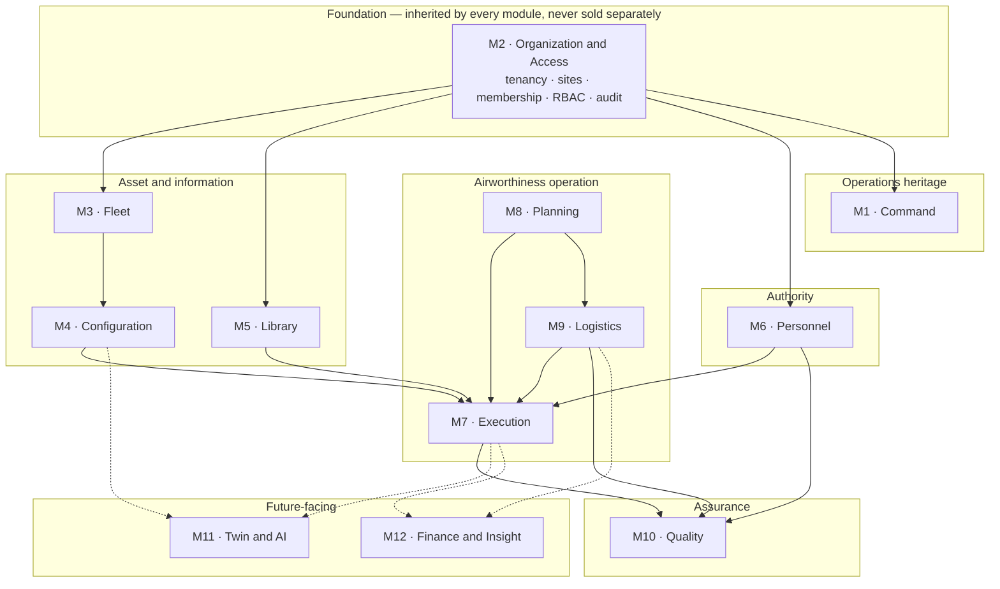
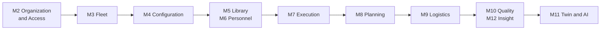

# Product Family — Mercury Aviation Enterprise Operating System

| Field | Value |
|-------|-------|
| Document | Product Family — module structure and standing |
| Product | Mercury Aviation Enterprise Operating System (AEOS) |
| Organization | Mercury Technologies |
| Layer | Product (module definition, capability standing, dependency order) |
| Audience | Product management, commercial and solution roles, customer success, implementation partners, executives |
| Status | Living baseline — module boundary changes require an ADR |
| Companion documents | [Editions](Editions.md) · [Pricing Strategy](Pricing_Strategy.md) |
| Upstream authority | [Domain Architecture](../02_Architecture/Domain_Architecture.md) · [ROADMAP](../../ROADMAP.md) |

---

## 1. Scope

### 1.1 In scope

This document defines **the modules that make up Mercury AEOS, what each one does, and precisely what is delivered versus planned in each**.

It is the reference that commercial, solution, and customer-success functions use to answer "what does Mercury do" without overstating and without underselling. Every capability row carries a standing, and the standings are honest to the runtime rather than to the ambition.

| Section | Content |
|---------|---------|
| §3 | The module map, how modules map to domains, runtime packages, and API surfaces, and the module-level edition mapping |
| §4 | The dependency order — why modules must be adopted in a particular sequence |
| §5 | Module-by-module definition with delivered-versus-planned capability tables |
| §6 | The user-interface standing per module, which differs materially from the API standing |
| §7 to §10 | Non-functional requirements, security, scalability, future enhancements |

### 1.2 Out of scope

| Concern | Authoritative location |
|---------|------------------------|
| Capability-level edition entitlement, scale envelopes, packs, and how editions are enforced | [Editions](Editions.md). §3.4 here is a module-level summary only |
| Value metrics, packaging, and pricing principles | [Pricing Strategy](Pricing_Strategy.md) |
| Bounded contexts, aggregates, invariants | [Domain Architecture](../02_Architecture/Domain_Architecture.md) |
| Tables, entities, keys | [Data Model](../04_Data/Data_Model.md) |
| The linkage that makes modules one platform | [Digital Thread](../04_Data/Digital_Thread.md) |
| Delivery sequencing and horizons | [ROADMAP](../../ROADMAP.md) |
| Stakeholder-specific value narratives | [Business documentation set](../03_Business/) |
| Permission model | [RBAC](../06_Security/RBAC.md) |

### 1.3 What a Mercury module is

A module is **a domain boundary that is simultaneously a technical package and a commercial instrument.** Each core module maps one-to-one onto a Python package under `backend/app/` and onto an API prefix under `/api/v1`. That is deliberate: the module boundary *is* the context boundary, so packaging a module differently is a licensing decision rather than a re-architecture.

Three properties follow, and they are what distinguish Mercury from a suite of integrated products:

- **Modules share one substrate.** Tenancy, identity, permissions, audit, and reference data are built once and inherited. Adding a module does not add a reconciliation burden.
- **Modules share one thread.** A job card in Execution references the same aircraft record that Fleet owns and the same revision that Library owns. There is no synchronization step because there is nothing to synchronize.
- **Modules are adopted in dependency order, not in preference order.** §4. This is a technical fact with a commercial consequence, and it is why Mercury's land-and-expand motion is cheap for the customer rather than merely convenient for the vendor.

---

## 2. Design principles

| # | Principle | Statement | Consequence |
|---|-----------|-----------|-------------|
| PF-1 | **One engine per concern** | There is one maintenance task engine, one audit path, one permission model, one signature mechanism. | A module never ships a private copy of a shared capability. Proposing a second engine requires an ADR overturning a founding decision. |
| PF-2 | **Modules are named in the industry's language** | Job card, work package, ACA, MPD, rotable, serviceable. | No translation layer between domain expert and product. A module named for an internal abstraction would be a defect. |
| PF-3 | **Delivered and planned are stated in writing, always** | Every capability row carries a standing. | Honesty is a sales asset in enterprise security and compliance review. See [Company Strategy §7](../01_Executive/Company_Strategy.md#7-go-to-market-strategy). |
| PF-4 | **A module is API-first** | Every capability is a contract before it is a screen. | This is why several modules are API-complete and interface-thin, and why that gap is stated openly in §6 rather than hidden. |
| PF-5 | **No module paywalls safety, isolation, or evidence** | Tenancy, RBAC, audit, immutability, and signature integrity are properties of the platform. | They are never a module or an upsell. See [Pricing Strategy §3](Pricing_Strategy.md#3-pricing-principles). |
| PF-6 | **Future modules are shaped, not stubbed** | Twin and AI are described as target modules with defined boundaries and no placeholder code. | The blueprint carries the design; the runtime carries only what works. |
| PF-7 | **A module's value grows with the thread** | Each additional adopted module makes every existing record more valuable. | This is the platform's compounding property and the honest basis of the expansion motion — not a pricing tactic. |
| PF-8 | **Advisory capability never becomes authority** | No module output may approve, certify, or release. | Binding on Command today and on Twin and AI in future. |

---

## 3. The module map

### 3.1 The family

### 3.2 Module register

| # | Module | Domain | Runtime package | API prefix | Standing |
|---|--------|--------|-----------------|-----------|----------|
| M1 | **Command** | — (no domain; operations heritage) | `backend/app/routers/ops.py`, `ops/`, `missions/`, `timeline/`, `decision/`, `alerts.py`, `fusion/`, `connectors/` | `/api/v1/ops`, `/api/v1/incidents`, `/api/v1/decisions`, `/api/v1/alerts`, `/api/v1/connectors`, `/api/v1/dashboard/summary` | **Partial — mixed persistence.** §5.1 |
| M2 | **Organization and Access** | D1 | `backend/app/org/`, `security/`, `audit.py`, `routers/admin.py` | `/api/v1` organizations, sites, memberships; `/api/v1/auth`; `/admin` | **Delivered** |
| M3 | **Fleet** | D2 | `backend/app/fleet/` | `/api/v1/fleet` | **Delivered** |
| M4 | **Configuration** | D3 | `backend/app/components/` | `/api/v1/components` | **Delivered** |
| M5 | **Library** | D4 | `backend/app/publications/` | `/api/v1/publications`, `/api/v1/library` | **Delivered** |
| M6 | **Personnel** | D5 | `backend/app/personnel/` | `/api/v1/personnel` | **Delivered** |
| M7 | **Execution** | D6 | `backend/app/maintenance/`, `backend/app/work_orders/` | `/api/v1/maintenance`, `/api/v1/work-orders` | **Delivered** |
| M8 | **Planning** | D7 | `backend/app/planning/` | `/api/v1/planning` | **Delivered** |
| M9 | **Logistics** | D8 | `backend/app/logistics/` | `/api/v1/logistics` | **Delivered** |
| M10 | **Quality** | D9 | `backend/app/audit.py`, `routers/admin.py` | `/api/v1/audit`, `/admin/audit` | **Partial** |
| M11 | **Twin and AI** | D10 | Not a module | — | **Planned** |
| M12 | **Finance and Insight** | D11 | Cross-cutting fields in M9, guarded by `logistics.finance` | `/api/v1/logistics`, `/api/v1/reports` | **Partial** |

Runtime platform version at the time of writing: **16.0.0**.

### 3.3 Reading the standings

| Standing | Meaning | What may be said commercially |
|----------|---------|-------------------------------|
| **Delivered** | Exists in the runtime, exercised through the API, enforced server-side | May be demonstrated and contracted |
| **Partial** | Some capability exists; specific named parts do not | May be demonstrated *as scoped*, with the gaps stated in writing |
| **Planned** | Designed in the blueprint; no runtime capability | May be discussed as roadmap intent only, never as available |

PF-3 is not a style preference. Enterprise security and compliance review is where overstated claims fail, and the deals that survive that review are the ones worth having.

### 3.4 Module-to-edition mapping

This table answers one question only: **which modules does each edition include.** It is a navigational summary. [Editions §4](Editions.md#4-capability-matrix) is authoritative for capability-level entitlement, and where the two ever disagree, Editions wins.

`●` included · `◐` included but scoped — see the note · `○` not included

| # | Module | Standing | Pilot | Professional | Enterprise | Note on the scoped cells |
|---|--------|----------|:-----:|:------------:|:----------:|--------------------------|
| M2 | **Organization and Access** | Delivered | ● | ● | ● | Never sold; inherited by every edition. Pilot is one organization and one site, Professional is one organization and many sites, Enterprise is many organizations |
| M3 | **Fleet** | Delivered | ◐ | ● | ● | Pilot is bounded to one fleet. Lease and ownership records are Planned and Enterprise-only |
| M4 | **Configuration** | Delivered | ● | ● | ● | Assembly rollup and a materialized passport projection are Planned |
| M5 | **Library** | Delivered | ● | ● | ● | Managed binary store and viewer are Planned; automated applicability is Planned and Enterprise-only |
| M6 | **Personnel** | Delivered | ● | ● | ● | Cryptographic signature providers are Planned. **No edition has certificate-backed non-repudiation** |
| M7 | **Execution** | Delivered | ● | ● | ● | Pilot carries core role dashboards; offline execution is Planned |
| M8 | **Planning** | Delivered | ◐ | ● | ● | Pilot produces plan lines but has no Logistics to fulfil them, so the material and tool bridge is inert |
| M9 | **Logistics** | Delivered | ○ | ● | ● | The single largest capability difference between Pilot and Professional |
| M10 | **Quality** | Partial | ◐ | ● | ● | **The audit trail is in every edition, including Pilot** — PF-5. Only quality *management* — findings, corrective actions, programme scheduling — is edition-scoped, and it is Planned |
| M1 | **Command** | Partial | ○ | ● | ● | Positioned as operations heritage. Its in-memory and simulated surfaces must be disclosed — §5.1 |
| M12 | **Finance and Insight** | Partial | ○ | ● | ● | Delivered reporting only; costing and the ledger interface are Planned |
| M11 | **Twin and AI** | Planned | ○ | ○ | ● | **Every capability is Planned.** Enterprise buys committed roadmap participation, never available capability |

**Three readings of this table that would be wrong**, and are worth pre-empting because each has been a real source of misrepresentation in enterprise software:

1. **An included module is not a delivered capability.** The edition columns state entitlement; the standing column states reality. A cell can be `●` in an edition whose capability is Planned — M11 across Enterprise is exactly that. Both must be true before anything is sold. ED-4 in [Editions §2](Editions.md#2-design-principles).
2. **The mapping is not enforced by the runtime.** There is no entitlement system. Editions are contractual, provisioned, and permission-scoped, and that is stated openly in [Editions §5](Editions.md#5-how-editions-are-actually-enforced).
3. **Nothing safety-bearing is edition-scoped.** Isolation, RBAC, audit, immutability, ordered certification, segregation of duties, and signer binding are in every cell of every row. They are properties of M2 and of the domain services, not features. [Editions §6](Editions.md#6-what-is-never-gated-by-edition) enumerates the commitment.

**The mapping follows the dependency order, not commercial preference.** Pilot stops where it does because Logistics without Planning would be a warehouse system rather than part of a thread, and Professional adds Logistics precisely because Planning is already there to drive it. §4 explains why that order cannot be reversed, and it is the reason expansion is technically cheap for the customer.

---

## 4. Dependency order

The order in which modules can be adopted is forced by the platform, not chosen by the vendor.

| Dependency | Why it cannot be reversed |
|------------|--------------------------|
| Everything depends on M2 | Every record carries an organization. Tenancy is part of identity, not a setting. |
| M4 depends on M3 | A component is installed *on an aircraft*. Configuration without a fleet has nothing to attach to. |
| M7 depends on M5 and M6 | A release requires an immutable publication revision and a qualified, authorized signer. Both are preconditions enforced server-side, not policies. |
| M7 depends on M4 | Work affects components, and the maintenance release writes back to component history. |
| M8 generates into M7 | Planning creates work packages, orders, and job cards by calling Execution. Planning without Execution produces a schedule nobody can perform. |
| M9 is driven by M8 | Material and tool demand derive from the forecast and from package generation. Logistics adopted first is a warehouse system, not part of a thread. |
| M10 consumes all of them | Quality is evidence about work that happened. |
| M11 depends on thread completeness | Models over fragmented data produce confident nonsense. [ROADMAP](../../ROADMAP.md#2-roadmap-principles): thread before analytics. |

**The commercial consequence.** Mercury's land-and-expand motion mirrors this order exactly, which is why expansion is technically cheap for the customer: the substrate is already there, and the next module consumes data that already exists rather than requiring a new data-entry programme. See [Company Strategy §5](../01_Executive/Company_Strategy.md#5-wedge-and-expansion-motion).

**M1 Command sits outside this order**, because it does not participate in the airworthiness thread. §5.1.

---

## 5. The modules

### 5.1 M1 — Command — operations heritage

**What it is.** Mercury's operations heritage: an operational command surface built around incidents, connector health, alerting, an advisory decision engine, a live map and radar picture, sensor fusion, and mission phase tracking. It predates the aviation enterprise modules and is the origin of the platform's operator-centred interaction model.

**Why it is still in the product.** Two reasons that are worth stating plainly rather than defending. It established the operator ergonomics — the incident-centred workspace, the advisory-only decision posture with human review, the event log, the real-time console — that the aviation modules inherited. And the **advisory decision engine is the behavioural precedent for how Mercury will govern AI**: explicitly advisory, evaluations audited, recommendations requiring human acceptance, review states recorded. That precedent is doing real work in [Knowledge Graph §6.3](../04_Data/Knowledge_Graph.md#63-advisory-lifecycle).

**Honest standing — this is the most important table in this document.**

| Capability | Standing | Detail |
|-----------|----------|--------|
| Incident lifecycle — create, status, events, evidence, assessment, report | **Delivered, persisted** | `incidents`, `timeline_events`, `evidence` tables |
| Audit of operator actions | **Delivered, persisted** | `audit_events` |
| Connector registry, health, health history, start, stop, recover, poll | **Delivered** | Runtime state in the connector manager; simulated unless a real source is configured |
| Advisory decision engine — evaluate, list, review | **Delivered, in-memory only** | Bounded to 200 decisions; review states `pending`, `acknowledged`, `commented`, `rejected_advisory`. **Does not survive a restart.** |
| Alerts derived from incidents and events | **Delivered, in-memory only** | Bounded to 250 |
| Mission lifecycle — objectives, resources | **In-memory only** | Not persisted |
| Global timeline | **In-memory only** | Ring buffer, 250 entries |
| Sensor fusion and threat scoring | **In-memory only** | Computed |
| Approvals | **In-memory only** | Not persisted |
| Live map, radar console, digital twin airport view, AI narration, mission strip | **Frontend simulation** | Client-side; not backed by live sensor data in the delivered configuration |
| Response orchestration — `/api/v1/ops/coordinate` | **Delivered as an API; no frontend caller** | Orchestration hook available to integrators |
| Integrations and compliance workspace content | **Demonstration data**, marked as simulated in the response | Not a live integration inventory |

**Three statements that must accompany any presentation of M1.**

1. **Most of Command's state is in-memory and does not survive a restart.** Incidents, their evidence, and the audit trail persist. Missions, decisions, alerts, approvals, fusion, and the global timeline do not.
2. **The live operational picture is substantially frontend simulation.** The map, radar scope, fusion bars, and narration are client-side. Presenting them as a live sensor integration would be a misrepresentation.
3. **Command is not part of the Digital Thread.** Its persisted incidents are adjacent to the thread but are not linked to aircraft configuration or airworthiness evidence. See [Digital Thread §3.3](../04_Data/Digital_Thread.md#33-what-is-deliberately-outside-the-thread) and [Data Model §5.10](../04_Data/Data_Model.md#510-operations--honest-standing).

**Product position.** M1 is presented as **operations heritage with an advisory posture**, not as an airworthiness or safety-of-life capability. Mercury claims no certified aviation, defence, surveillance, or emergency-response operational approval. See [SECURITY.md](../../SECURITY.md).

**Planned.** Decide which operations events genuinely belong in the durable thread — utilization intake and operational status are the credible candidates, because they feed the forecast — persist those, and leave the simulation out. [Digital Thread §12 item 20](../04_Data/Digital_Thread.md#12-future-enhancements).

---

### 5.2 M2 — Organization and Access

**What it is.** The foundation every other module inherits: multi-tenancy, organizational structure, identity, session context, role resolution, permissions, and the audit trail.

**Never sold as a module.** PF-5. Tenancy, isolation, permissions, and audit are properties of the platform. A customer does not buy them; a customer cannot operate without them.

| Capability | Standing |
|-----------|----------|
| Companies, organizations, sites, departments, teams | **Delivered** |
| Organization users and memberships with scope | **Delivered** |
| Membership-aware session context switching, with denied switches audited as security events | **Delivered** |
| Organization-scoped role resolution — effective role derived from membership, not from the login directory | **Delivered** |
| Four session roles: `Administrator`, `Operator`, `Reviewer`, `Viewer` | **Delivered** |
| Approximately fifty permission scopes across all domains, including a distinct `logistics.finance` scope | **Delivered** |
| Aviation persona overlays — technician, inspector, ACA, planner, supervisor, store, engineering, reliability, QA, purchasing, finance, maintenance control, manager | **Mapped; enforcement is partial.** Uniform persona enforcement at the service boundary is item 1 on the near-term horizon in [ROADMAP §4](../../ROADMAP.md#4-near-term-horizon--assurance-and-hardening-additive) |
| Audit trail over authenticated mutating calls plus explicit domain events | **Delivered** |
| Administrative APIs — system, health, metrics, audit, user management, runtime configuration allow-list | **Delivered** |
| Structured logging with request, correlation, and user identifiers; Prometheus metrics; health, readiness, liveness probes | **Delivered** |
| TLS at the edge, security headers, application and edge rate limiting, production environment validation | **Delivered** |
| Federated identity — OpenID Connect, directory synchronization | **Planned** |
| Shared session store for multi-worker scale-out | **Planned** — sessions are currently in-process, which constrains horizontal scaling |
| Uniform write-scoping verified by test across every module | **Planned** — the highest-priority assurance item |

**Honest constraint worth surfacing in any evaluation.** Sessions are held in process. Running multiple API workers therefore requires session affinity today. A Redis-backed session store is on the near-term horizon, and until it lands, horizontal scale-out is limited. Stating this proactively is what §7 of [Company Strategy](../01_Executive/Company_Strategy.md#7-go-to-market-strategy) means by honesty as a sales asset.

---

### 5.3 M3 — Fleet

**What it is.** Aircraft identity. Which aircraft exist, who operates them, what type they are, and what state they are in.

| Capability | Standing |
|-----------|----------|
| Manufacturer, family, and model catalogue — platform reference data | **Delivered** |
| Aircraft status catalogue with an operational semantic | **Delivered** |
| Fleet operators with ICAO and IATA codes | **Delivered** |
| Fleets with a base site | **Delivered** |
| Aircraft keyed by airframe serial within the organization | **Delivered** |
| Registration records with validity intervals and a current flag, so identity survives re-registration | **Delivered** |
| Aircraft status transitions, organization-isolated and audited | **Delivered** |
| **Lease and ownership as first-class records** | **Planned** — the most conspicuous gap for lessor-facing use |
| Ownership and asset-attribution reporting | **Planned** — depends on the above |

**Why registration is separate from identity.** Aircraft identity is the airframe serial. Registration marks change on sale, lease transfer, and re-registration, and the airframe's history must survive the change. This is what makes the [Digital Aircraft Passport](../04_Data/Digital_Thread.md#7-the-digital-aircraft-passport) defensible across a transaction.

---

### 5.4 M4 — Configuration

**What it is.** What is fitted to the aircraft, what has happened to each fitted item, and how much life remains. This module is the backbone of the Digital Aircraft Passport.

| Capability | Standing |
|-----------|----------|
| ATA chapter catalogue | **Delivered** |
| Component catalogue with serialization and life policy, and designed limits | **Delivered** |
| Alternate parts and interchangeability | **Delivered** |
| Serialized components with organization-unique serials | **Delivered** |
| Install, remove, and transfer, each appending immutable history | **Delivered** |
| **One component per aircraft position, enforced by the database** | **Delivered** |
| TSN, CSN, TSO, CSO tracking with aircraft counters captured at install | **Delivered** |
| Unit-level life limits overriding catalogue defaults | **Delivered** |
| Remaining hours, cycles, and due date | **Delivered** — maintained on write |
| Aircraft configuration API | **Delivered** |
| Configuration as of a past date | **Delivered as a traversal** over immutable history; no materialized projection |
| Maintenance-release history written back from Execution | **Delivered** |
| **Assembly hierarchy with next-higher-assembly rollup** | **Planned** — nested component life does not roll up today |
| Reconciliation of current state against history | **Planned** |

---

### 5.5 M5 — Library

**What it is.** Controlled technical content, with a guarantee that work performed can always be traced to the exact revision in force at the time.

| Capability | Standing |
|-----------|----------|
| Publication types across maintenance, flight, engineering, and operations categories | **Delivered** |
| Organization-scoped publications with codes, numbers, authority, and access classification | **Delivered** |
| **Immutable revisions** with revision number, revision date, and effective date | **Delivered** |
| Supersession of publications and of revisions | **Delivered** |
| Licence-safe storage locators — Mercury holds metadata and a pointer, not redistributable binaries | **Delivered** |
| Applicability by manufacturer, model, variant, ATA chapter, plus many-to-many ATA and catalogue links | **Delivered** |
| Library browse and search; lookup by ATA, model, component, aircraft | **Delivered** |
| Revision activation under an administrative scope | **Delivered** |
| **Managed binary content store with integrity checking** | **Planned** — near-term horizon |
| **In-place document viewer** | **Planned** |
| **Automated applicability evaluation against live configuration** | **Planned** — one of the largest remaining manual steps in continuing airworthiness |
| Section-level content extraction and retrieval | **Planned** — M11, licence-gated |

**Why immutability is the module's core value.** A release is blocked unless the job card references a live publication and a matching revision. Because a revision cannot be edited, the content that authorized a release can be produced years later, unchanged. A mutable document library cannot make that statement, and every downstream compliance claim depends on it.

---

### 5.6 M6 — Personnel

**What it is.** Who may do what, and the record of the act of signing. This module supplies the authority that makes a release valid.

| Capability | Standing |
|-----------|----------|
| Employees, organization-unique by employee number | **Delivered** |
| Qualifications with issuing authority and validity interval | **Delivered** |
| Authorizations including ACA, optionally scoped by model and ATA chapter | **Delivered** |
| Digital stamp profiles | **Delivered** |
| **Signer binding** from employee to authenticated user, preventing signing as another person | **Delivered** |
| Credential verification per signing method — PIN, password, with PKI, smart card, and biometric readiness flags | **Delivered** |
| Immutable signatures hashing a canonical payload with SHA-256 | **Delivered** |
| Authority validity asserted at the moment of the certification step | **Delivered** |
| **Cryptographic certificate-chain signing** | **Planned** — the current scheme attests content and method; it is **not** certificate-backed non-repudiation |
| **PKI and smart-card signature adapters** | **Planned** — near-term horizon |
| Proactive expiry and currency alerting | **Planned** — expiry is enforced at point of use but not surfaced in advance |

**The non-claim, stated for the record.** Mercury does not currently provide cryptographic non-repudiation. There is no certificate chain and no hash chain between successive signatures. What is provided is a hash attestation of the signed content and the verified method. Any representation beyond that would be false. See [Digital Signatures](../06_Security/Digital_Signatures.md).

---

### 5.7 M7 — Execution

**What it is.** The performance and certification of work, and the permanent evidence that results. The most safety-critical module in the platform.

| Capability | Standing |
|-----------|----------|
| Maintenance task engine with organization-unique task numbers | **Delivered** |
| Work packages, work orders, job cards, and attachments | **Delivered** |
| Validated job-card status transitions | **Delivered** |
| Assign, transition, complete work, inspect with approve, reject, rework, and independent paths, ACA release | **Delivered** |
| **Ordered certification chain**: performed, inspected, independent inspection, ACA certified, aircraft released | **Delivered, enforced server-side** |
| **Segregation of duties** — performed versus inspected, and a distinct independent inspector | **Delivered, enforced server-side** |
| **Release preconditions** — all prior steps complete, an immutable publication revision referenced, an ATA chapter set | **Delivered, enforced server-side** |
| **Atomic release plus technical logbook entry** in one transaction | **Delivered** |
| Technical logbook naming mechanic, inspector, independent inspector, ACA, release signature, and revision in force | **Delivered** |
| Append-only logbook amendment | **Delivered** |
| Component history write-back on maintenance release | **Delivered** |
| Critical task policies and fault codes | **Delivered** |
| Optimistic concurrency on tasks, packages, orders, and cards | **Delivered** |
| Fail-closed audit on complete, inspect, and release | **Delivered** |
| Role dashboards for manager, planner, supervisor, technician, QA, and ACA; MRO reports | **Delivered** |
| Offline synchronization queue | **Delivered** |
| **Single-transaction certify bridge** — removing nested commits between job-card certification and the maintenance service | **Planned** — near-term horizon |
| **Fully offline-capable job card execution** on the hangar floor | **Planned** — a queue exists; conflict resolution design does not |
| Labour cost capture and rollup | **Planned** — M12 |

**What makes this module defensible.** Every invariant listed as delivered is enforced in the service layer, not in the client. A client can be wrong; the domain cannot. An out-of-order certification step is rejected. A second signature on the same step is rejected. An independent inspection by the performer is rejected. A release without a revision is rejected. These are the properties that survive a compliance audit.

---

### 5.8 M8 — Planning

**What it is.** Continuing airworthiness: what work is due, when, on what authority, and turning that decision into executable work.

| Capability | Standing |
|-----------|----------|
| Maintenance programmes with immutable revisions and approval authority | **Delivered** |
| MPD tasks with multi-unit intervals — calendar, flight hours, cycles, landings, engine, APU, component hours | **Delivered** |
| Maintenance checks from preflight through D, structural, engine, and custom, with due computation | **Delivered** |
| Airworthiness directives, service bulletins, and engineering orders, keyed **per revision** with an approval workflow | **Delivered** |
| MEL and CDL items with dispatch categories and repair intervals | **Delivered** |
| Deferred defects with expiry, dispatch category, and alerting | **Delivered** |
| Utilization counters and status traffic lights | **Delivered** |
| Forecast engine over 30, 90, 180, and 365-day windows | **Delivered** — computed on read |
| Urgency-sorted due list; planner dashboard; aircraft status view | **Delivered** |
| Hangar, parts, tool, and workforce plan lines | **Delivered** |
| **Automatic work package, work order, and job card generation into Execution** | **Delivered** |
| **Automatic material and tool planning bridge into Logistics** | **Delivered** |
| **Automated applicability evaluation against live configuration** | **Planned** — applicability is a recorded human determination today |
| Interactive slot and capacity optimization | **Planned** |
| Utilization history, making a historical forecast reproducible | **Planned** |
| Automated utilization and operational status intake from flight operations | **Planned** |

**The capability that demonstrates the platform thesis.** Generating a work package reaches through to Execution *and* to Logistics reservation in one transaction. A planner who schedules a check discovers material shortages before the aircraft arrives, without a second system and without a reconciliation step. That is the reconciliation tax removed, which is the whole argument in [Company Strategy §2](../01_Executive/Company_Strategy.md#2-strategic-thesis).

---

### 5.9 M9 — Logistics

**What it is.** The physical supply chain: what parts exist, where they are, in what condition, who holds them, and how they were procured. Delivered as Program B.

| Capability | Standing |
|-----------|----------|
| Eight-level warehouse hierarchy resolving to addressable locations | **Delivered** |
| Warehouse transfers with lines | **Delivered** |
| Part master with families, alternate identifiers, supersessions, and attachments | **Delivered** |
| Stock units, balances, and an **append-only movement ledger** | **Delivered** |
| Issue policies including first-in-first-out and first-expired-first-out | **Delivered** |
| Reservations with demand references; reservation refused rather than silently split across locations | **Delivered** |
| Material requests with lines | **Delivered** |
| Rotable cycles | **Delivered** |
| Tool crib: tools, kits, shadow boards, calibration control, issue, return, reservation, lost-tool reporting, history | **Delivered** |
| Procurement chain: purchase requisition, RFQ, quotes, purchase order, shipment, receipt with inspection and putaway, vendor invoice | **Delivered** |
| Vendor management | **Delivered** |
| Barcode and RFID scan APIs | **Delivered** |
| Shortages dashboard and logistics dashboard | **Delivered** |
| Distinct `logistics.finance` permission scope separating commercial from operational visibility | **Delivered** |
| **Native hangar scanning client** consuming the scan APIs | **Planned** — near-term horizon |
| Balance-to-ledger reconciliation | **Planned** |
| Multi-currency valuation, cycle-count programmes, supplier scoring | **Planned** |
| Electronic vendor integration — quotation, order acknowledgement, advance shipping notice, certificate exchange | **Planned** |

**Why every stock change writes a ledger row.** There is no silent stock change. Inventory truth is reconstructable, which is what makes a part's provenance traversable from vendor to installed position. The gap is that no job yet reconciles the materialized balances against the ledger, so a divergence would currently go undetected.

---

### 5.10 M10 — Quality

**What it is.** The evidence layer. Making the platform answerable to a quality manager or an authority inspector without forensic reconstruction.

| Capability | Standing |
|-----------|----------|
| Immutable audit trail: actor, actor role, organization, site, target, source, outcome, origin, detail | **Delivered** |
| Audit query scoped to organization and site, honouring a retention window | **Delivered** |
| Evidence records with provenance and confidence | **Delivered** |
| Fail-closed audit on the certification path | **Delivered** |
| Configuration integrity through immutable history | **Delivered via M4** |
| Segregation-of-duties enforcement | **Delivered via M7** |
| **Findings and corrective actions** | **Planned** |
| **Audit programme management and scheduling** | **Planned** |
| Repeat-finding analysis | **Planned** |
| **Tamper-evident hash chaining of evidence records** | **Planned** — the single highest-value integrity upgrade available to Mercury |
| **Evidence pack export** — a one-command auditor-acceptable bundle | **Planned** — near-term horizon |
| Reliability and trend analytics | **Planned** — M11 |

**The honest position.** Mercury's evidence is append-only by construction and discipline. It is **not** tamper-evident: no hash chain links successive records, and no database-level append-only constraint exists. The distinction matters in an audit, and stating it correctly is what makes the rest of the claim credible.

---

### 5.11 M11 — Twin and AI

**What it is.** Turning thread density into foresight: retrieval over technical content, reliability insight, condition prediction, and a configuration-accurate twin.

**Standing: Planned. There is no runtime capability.**

| Capability | Standing |
|-----------|----------|
| AI-ready index, embedding, and knowledge cross-reference tables | **Schema exists without payload** |
| Retrieval over publications | **Not implemented** — no retrieval, no optical character recognition, no model inference in the current release |
| Embeddings and vector search | **Not implemented** — no vectors are stored |
| Knowledge graph projection | **Planned** — specified in [Knowledge Graph](../04_Data/Knowledge_Graph.md) |
| Reliability and trend analytics | **Planned** |
| Predictive maintenance | **Planned** |
| Digital twin | **Planned** |
| Assistive drafting and defect triage | **Planned** |

**Boundary rules binding on any future implementation.** M11 is strictly downstream: it reads projections and never writes into other modules. Every output carries provenance — which records informed it, which model version produced it, when. No output may be a precondition for a certification step, a release, or a compliance determination. Advisory outputs surface to a person who accepts, rejects, or comments, and **the human decision is what is recorded.** Inference never sits in the synchronous path of a safety-critical transaction.

**The precedent already exists.** M1's advisory decision engine behaves exactly this way. It is a behavioural precedent, not an implementation of M11.

**These rules are not specific to M11.** The boundary between an advisory output and a certified attestation is specified once, for the whole platform, in [Digital Signatures §6.7](../06_Security/Digital_Signatures.md#67-advisory-output-versus-certified-attestation), and it already governs the delivered forecast, due list, and alerting capability in M8.

**What must be true first.** Thread completeness. See [Knowledge Graph §7](../04_Data/Knowledge_Graph.md#7-target-architecture) for the phased path, which begins with four cheap schema fixes rather than with a model.

---

### 5.12 M12 — Finance and Insight

**What it is.** The economic consequence of maintenance and supply activity, and the executive view over it.

**Presented as a capability view, not a fully owned module.** Mercury does not intend to become a general ledger. Mercury owns the operational cost event and the asset valuation; the customer's finance system owns the accounting treatment.

| Capability | Standing |
|-----------|----------|
| Stock valuation fields on logistics records | **Partial** |
| Warranty expiry captured on received stock units | **Partial** |
| Purchase commitments represented by purchase orders | **Partial** |
| Distinct `logistics.finance` permission scope | **Delivered** |
| Reports — summary and history; executive readiness and risk view | **Delivered** |
| **Labour cost records** derived from job card actual hours and a rate model | **Planned** |
| **Work package cost rollup** — material plus labour plus external services | **Planned** |
| Warranty claim lifecycle and recovery tracking | **Planned** |
| Contract and rate schedules | **Planned** |
| General-ledger interface | **Planned** — an outbound integration with an explicit contract, never a shared database |
| Cost, capacity, and workforce insight from operational reality | **Planned** |

**Boundary rule.** Mercury records cost *events*; it does not perform accounting postings. Finance visibility is permission-gated separately from operational visibility, so a maintenance supervisor seeing part availability does not thereby see vendor pricing.

---

## 6. Interface standing versus API standing

This section exists because the difference is large, material to any evaluation, and easy to discover in a demonstration.

Mercury's frontend is a single-page vanilla JavaScript application with **twelve workspace tabs**: Command, Digital Twin, Radar, Executive, History, Admin, Cloud, Integrations, Compliance, Maintenance, Planning, Logistics.

| Module | API standing | Dedicated workspace tab | Interface standing |
|--------|-------------|------------------------|--------------------|
| M1 Command | Partial | **Command**, plus Digital Twin, Radar, History | Rich — the most developed interface in the product, substantially simulation |
| M2 Organization and Access | Delivered | **Admin**, plus session and context controls | Adequate for administration |
| M3 Fleet | **Delivered** | **None** | **API-complete, interface-thin** |
| M4 Configuration | **Delivered** | **None** | **API-complete, interface-thin** |
| M5 Library | **Delivered** | **None** | **API-complete, interface-thin** |
| M6 Personnel | **Delivered** | **None** | **API-complete, interface-thin** |
| M7 Execution | Delivered | **Maintenance** | Delivered, with role dashboards |
| M8 Planning | Delivered | **Planning** | Delivered, with a planner dashboard |
| M9 Logistics | Delivered | **Logistics** | Delivered, with dashboards and shortages |
| M10 Quality | Partial | **Compliance**, plus Admin audit | Partial |
| M11 Twin and AI | Planned | Digital Twin tab exists as a simulated airport view | **Not an AI interface** |
| M12 Finance and Insight | Partial | **Executive**, plus Cloud and Integrations | Partial; Cloud and Integrations tabs carry demonstration content |

**Four modules — Fleet, Configuration, Library, and Personnel — are fully delivered as APIs with no dedicated workspace.** They are exercised through the API and through the Maintenance, Planning, and Logistics workspaces that consume them. This is a direct consequence of PF-4, API-first delivery, and it is the single most likely source of a mismatch between what a demonstration shows and what the platform does.

**How to handle it.** State it before the demonstration, not after. The capability is real and contractable; the screen is not there yet. Building those four workspaces is §10 item 1 and is the highest-value product work available that requires no new backend capability at all.

**The Digital Twin tab is a naming hazard.** It presents a simulated airport operational picture from the operations heritage. It is not the aircraft digital twin described in M11. Anyone demonstrating it must say so.

---

## 7. Non-functional requirements

### 7.1 Reading the targets

As elsewhere in this blueprint: **current baseline** is what the runtime demonstrably does. **Aspirational enterprise target** is directional, used for sizing and sequencing, and must never be quoted as a service-level commitment. See [Data Model §11.1](../04_Data/Data_Model.md#111-reading-the-targets).

### 7.2 Module-level availability

| Concern | Current baseline | Aspirational enterprise target |
|---------|-----------------|-------------------------------|
| Failure domain | All modules share one FastAPI process; the failure domain is the whole platform | Independent availability per module group, so a Logistics outage cannot stop a release |
| Critical path | M6 and M7 must be available for any release to occur | 99.95 percent for the certification and release path |
| Degraded operation | Not differentiated by module | Read-only continuation for M3, M4, M5, and M10 while write paths are degraded |
| Horizontal scale-out | Constrained by in-process sessions | Shared session store; multiple workers without affinity |
| M11 availability | Not applicable | **Deliberately lower than the platform's** — advisory capability may degrade; certification may not |

### 7.3 Module-level performance

| Operation | Current baseline | Aspirational enterprise target |
|-----------|-----------------|-------------------------------|
| Certification step | One transaction with a row lock on the task | 95th percentile under 500 ms |
| Aircraft release | Adds logbook and component history to the same transaction | 95th percentile under 1 second |
| Aircraft configuration read | Direct indexed query | Under 200 ms |
| Stock reservation | Availability from materialized balances | 95th percentile under 300 ms |
| Work package generation, 200 job cards | Bounded by a caller-supplied ceiling; material and tool planning inline | Under 5 seconds |
| Forecast for one aircraft | Computed across six tables on read | Under 500 ms from a materialized due list |
| Cross-module dashboard | Aggregated on demand | Under 1 second from purpose-built read models |
| Passport assembly | Multi-module read, no projection | Under 2 seconds from a materialized projection |

### 7.4 Module independence

| Requirement | Standing |
|-------------|----------|
| One module per domain boundary, one package, one API prefix | **Delivered** |
| Cross-module access through the owning module's service, never a direct table join | **Delivered by convention**, enforced by review |
| A module may be omitted from a deployment without breaking others, subject to §4 | **Partial** — dependency order is real; optional modules are not independently deployable |
| Module boundaries survive a future service extraction as a packaging exercise | **By design** — see [Domain Architecture §10.2](../02_Architecture/Domain_Architecture.md#102-extraction-order-if-and-when-services-become-necessary) |
| Runtime entitlement enforcement per module | **Not implemented** — see [Editions §5](Editions.md#5-how-editions-are-actually-enforced) |

---

## 8. Security considerations

**Security is not a module and is never packaged as one.** PF-5. Tenancy, RBAC, audit, immutability, signature integrity, and isolation are properties every module inherits from M2. There is no edition, tier, or add-on that withholds them. This is both an ethical position and a practical one: a platform whose isolation is a premium feature would fail every enterprise security review it entered.

**Module boundaries are isolation boundaries.** Every module's service layer asserts organization access before reading or writing. Because `organization_id` carries no database-level policy, a single module method that omits its assertion is a cross-tenant leak that the database will not catch. Isolation is therefore tested per module rather than only at the framework level, and uniform write-scoping across all modules is the highest-priority assurance item. See [Data Model §12](../04_Data/Data_Model.md#12-security-considerations).

**Authority is module-owned and cannot be inferred from access.** M2 determines which endpoints a user may call. M6 determines whether that user may sign a given certification step. Both checks are independent and both must pass. Collapsing them would let a permission grant silently confer certification authority — which is why the two live in different modules with different owners.

**Cross-module calls carry the caller's identity, not a service identity.** When Planning calls Execution, or Execution calls Personnel, the originating username and session role travel with the call and the downstream module re-asserts authorization. There is no internal trusted caller. Preserving this property through any future service extraction is mandatory.

**M1 Command has a different threat and claim profile from the aviation modules.** Its advisory decision engine is explicitly advisory and its evaluations are audited, but much of its state is in-memory and much of its picture is simulated. It must not be presented as a safety-of-life, surveillance, or emergency-response capability, and Mercury claims no certification or accreditation for such use. See [SECURITY.md](../../SECURITY.md).

**M9 separates commercial from operational visibility.** The distinct `logistics.finance` scope means part availability and vendor pricing are different grants. M12 inherits that separation.

**M5 carries a licensing boundary.** Publications hold metadata and licence-safe locators per organization. Any future content store must preserve per-organization licence scoping.

**M11 is constrained before it is built.** Strictly downstream, provenance mandatory, no output as a precondition for certification or release, no inference in a synchronous safety-critical path. See [Knowledge Graph §9](../04_Data/Knowledge_Graph.md#9-security-considerations).

**Non-claims apply to the whole family.** Mercury does not claim certified aviation, defence, surveillance, emergency-response, or safety-of-life operational approval, and publishes no compliance certification it has not independently earned. See [SECURITY.md](../../SECURITY.md) and [Company Strategy §10.1](../01_Executive/Company_Strategy.md#101-what-mercury-deliberately-does-not-do).

Full detail: [Security documentation set](../06_Security/) · [Identity](../06_Security/Identity.md) · [RBAC](../06_Security/RBAC.md) · [Audit](../06_Security/Audit.md) · [Digital Signatures](../06_Security/Digital_Signatures.md).

---

## 9. Scalability considerations

### 9.1 Per-module growth and pressure

| Module | Growth driver | Dominant pressure | Mitigation path |
|--------|--------------|-------------------|-----------------|
| M1 Command | Incidents and connector events | Low; in-memory state is bounded by design | Persist what belongs; leave simulation out |
| M2 Organization and Access | Tenant count; audit volume | Membership resolution per request; audit volume exceeds business data | Cache membership resolution; time-partition and archive audit |
| M3 Fleet | Aircraft count | Low, bounded by fleet size | None needed near term |
| M4 Configuration | Units times history events | History growth over decades | Time-partition history; configuration snapshots |
| M5 Library | Revisions times applicability links | Metadata small; binaries external | Managed object store with signed URLs |
| M6 Personnel | Employees times signatures | Signature volume grows with every certification step | Time-partition; archive with the evidence tier |
| M7 Execution | Job cards times certification events | Highest transactional write rate; row locks on state transitions | Keep transactions short; partition events and logbook by time |
| M8 Planning | Forecast recomputation across the fleet | Read-heavy computation over six tables | Materialize the due list; recompute on utilization change |
| M9 Logistics | Movements — the fastest-growing table in the platform | Ledger volume; balance row contention | Time-partition movements; per-location balance sharding |
| M10 Quality | Every mutating call plus every domain event | Volume | Time-partition plus cold-tier archival; asynchronous write once a durable bus exists |
| M11 Twin and AI | Projection volume | Analytical, not transactional | Separate store, separate scaling, lower availability requirement |
| M12 Finance and Insight | Cost events | Low | Follows M9 |

### 9.2 Platform scaling constraints, stated openly

| Constraint | Effect | Resolution |
|-----------|--------|-----------|
| In-process sessions | Multi-worker scale-out needs affinity | Shared session store — near-term horizon |
| Single application process | One failure domain across all modules | Module-group deployment separation, if and when a demonstrated need arises |
| Passport and dashboard assembly on demand | Latency grows with tenant size and asset age | Purpose-built read models |
| Materialized aggregates without reconciliation | Divergence would be undetected | Reconciliation jobs |
| No durable message broker | Audit and projection are in-process | Message broker, prerequisite for M11 |

### 9.3 The standing conclusion on decomposition

Mercury is a modular monolith and that is the right shape for its current stage. Module boundaries mean a future extraction would be a packaging exercise rather than a redesign — but **the correct number of services may well remain one for a long time.** Extraction should be triggered by a demonstrated scaling or team-topology need and recorded in an ADR, never by architectural fashion. Extraction order is set by coupling: [Domain Architecture §10.2](../02_Architecture/Domain_Architecture.md#102-extraction-order-if-and-when-services-become-necessary).

---

## 10. Future enhancements

Ordered by value per unit of effort, weighted toward work that unlocks existing capability rather than adding new capability.

| # | Enhancement | Modules | Value | Depends on |
|---|-------------|---------|-------|------------|
| 1 | **Workspaces for Fleet, Configuration, Library, and Personnel** | M3, M4, M5, M6 | Makes four fully delivered modules visible and usable. **No new backend capability required.** The highest-value product work available. | Interface work only |
| 2 | **Uniform persona RBAC enforcement at the service boundary** | M2, all | Authority cannot be inferred from a dashboard | Near-term horizon item 1 |
| 3 | **Shared session store** | M2 | Removes the horizontal scaling constraint | Redis |
| 4 | **Evidence pack export** | M10, M4, M7 | Turns audit preparation and redelivery from a project into a request | Object storage, integrity manifest |
| 5 | **Materialized Digital Aircraft Passport** | M3, M4, M7, M10 | One authoritative fast view for operators, lessors, buyers, authorities | Cross-module read contract |
| 6 | **Tamper-evident evidence chaining** | M10, M6, M7 | The strongest available upgrade to Mercury's evidential claim | Append-only store |
| 7 | **PKI and smart-card signature adapters** | M6 | Replaces hash attestation with certificate-backed non-repudiation | Key management |
| 8 | **Lease and ownership as first-class fleet records** | M3 | Prerequisite for a credible lessor-facing product | Fleet model extension |
| 9 | **Cross-organization scoped sharing** | M2, M3, M4, M7, M10 | Lets lessors, shops, and authorities participate without being granted tenancy | Audited sharing aggregate |
| 10 | **Findings, corrective actions, and audit programme** | M10 | Completes the quality management capability | Aggregate expansion |
| 11 | **Automated applicability evaluation** | M8, M5, M4 | Removes one of the largest remaining manual steps in continuing airworthiness | Configuration query contract |
| 12 | **Native hangar scanning client** | M9 | Consumes the existing scan APIs from a purpose-built shop-floor client | Client development |
| 13 | **Offline-capable job card execution** | M7 | Hangar-floor work without connectivity | Conflict resolution design |
| 14 | **Federated identity** | M2 | Enterprise identity integration; removes a common procurement blocker | OpenID Connect |
| 15 | **Labour costing and package cost rollup** | M12, M7 | True maintenance cost per event | Rate model, actual-hours capture |
| 16 | **Reliability and trend analytics** | M11, M8 | Removal rates, mean time between unscheduled removals, programme escalation evidence | Data quality from M4 and M7 |
| 17 | **Assembly hierarchy with rollup** | M4 | Accurate life on nested components | Component model extension |
| 18 | **Shop-visit lifecycle with life continuity** | M4, M9 | Closes the largest remaining gap in serialized component history | Partner workflows |
| 19 | **Knowledge graph and grounded retrieval** | M11, M5 | Publication lookup and cross-reference over the technical library | [Knowledge Graph §7](../04_Data/Knowledge_Graph.md#7-target-architecture) |
| 20 | **Predictive maintenance and digital twin** | M11 | Condition-based forecast input, strictly advisory | Reliability data, twin state model |
| 21 | **Runtime entitlement enforcement** | M2, all | Makes commercial editions technically enforced rather than contractual | [Editions §5](Editions.md#5-how-editions-are-actually-enforced) |
| 22 | **Decide and persist the operations events that belong in the thread** | M1, M8 | Brings utilization and operational status intake into the durable thread; retires simulation from the product surface | Scope decision |

---

## 11. Related documents

**Product set**
[Editions](Editions.md) · [Pricing Strategy](Pricing_Strategy.md)

**Architecture**
[Enterprise Architecture](../02_Architecture/Enterprise_Architecture.md) · [Domain Architecture](../02_Architecture/Domain_Architecture.md) · [System Context](../02_Architecture/System_Context.md) · [Technical Architecture](../02_Architecture/Technical_Architecture.md)

**Data**
[Digital Thread](../04_Data/Digital_Thread.md) · [Data Model](../04_Data/Data_Model.md) · [Master Data](../04_Data/Master_Data.md) · [Knowledge Graph](../04_Data/Knowledge_Graph.md)

**Business — who buys which modules**
[Business documentation set](../03_Business/) · [CAMO](../03_Business/CAMO.md) · [MRO](../03_Business/MRO.md) · [Airline](../03_Business/Airline.md) · [Leasing](../03_Business/Leasing.md) · [OEM](../03_Business/OEM.md) · [Authority](../03_Business/Authority.md) · [Suppliers and Logistics](../03_Business/Suppliers_Logistics.md)

**Security and AI**
[Security documentation set](../06_Security/) · [SECURITY.md](../../SECURITY.md) · [AI documentation set](../07_AI/)

**Executive and delivery**
[Company Strategy](../01_Executive/Company_Strategy.md) · [Vision](../01_Executive/Vision.md) · [Mission](../01_Executive/Mission.md) · [ROADMAP](../../ROADMAP.md) · [CHANGELOG](../../CHANGELOG.md)

---

*Mercury Technologies — One Digital Thread. One Digital Aircraft Passport. One Aviation Enterprise Operating System.*
