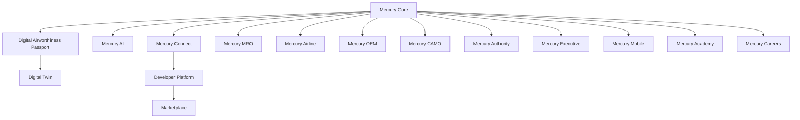

# Product Line Strategy

| Field | Value |
|-------|--------|
| Document | Product line & packaging strategy |
| Status | Normative |
| Companions | [Product Vision](../01_Executive/Product_Vision.md) · [Editions](Editions.md) · [Pricing Strategy](Pricing_Strategy.md) · [products/](products/) |

---

## 1. Scope

How Mercury Technologies packages AEOS capabilities into **sellable products** without fracturing the Digital Thread or forcing customers into a monolith they cannot staff.

---

## 2. Design principles

1. **Mercury Core is mandatory** for every deployment.  
2. **Industry products** (Airline, MRO, OEM, CAMO, Authority) are capability packs on Core.  
3. **Experience products** (Executive, Mobile, Academy, Careers) consume Core APIs.  
4. **Platform products** (AI, Connect, Developer, Marketplace, Twin, Passport) extend the ecosystem.  
5. **Editions** (Pilot → Professional → Enterprise) gate depth, not a different data model ([Editions.md](Editions.md)).

---

## 3. Dependency graph

---

## 4. Capability ownership

| Capability cluster | Primary product | Also used by |
|--------------------|-----------------|--------------|
| Org, session, RBAC, audit | Core | All |
| Fleet, registry | Airline / Core | MRO, CAMO, OEM |
| Components / config | Core | OEM, MRO, Passport |
| Publications / library | Core | All maintenance products |
| Certification / logbook | MRO / Airline | CAMO, Authority |
| Planning | Airline / CAMO / MRO | — |
| Logistics | MRO / Airline | Marketplace (future) |
| Advisory AI | AI | Executive, Twin |
| Oversight UX | Authority | — |

---

## 5. Go-to-market sequencing

| Wave | Focus | Rationale |
|------|-------|-----------|
| Wave 1 | Core + MRO + Airline (maintenance control) | Paying operational pain; delivered foundation |
| Wave 2 | Passport productization + CAMO depth | Lease/audit differentiation |
| Wave 3 | Connect + Developer + Mobile | Ecosystem lock-in via APIs |
| Wave 4 | Marketplace + Academy + Careers | Network effects |
| Wave 5 | Authority + OEM packs + Twin/AI maturity | Regulated & manufacturer loops |

Military, UAV, and eVTOL appear in [Future Vision 10-Year](../01_Executive/Future_Vision_10_Year.md) — not Wave 1 claims.

---

## 6. Anti-patterns

| Anti-pattern | Why forbidden |
|--------------|---------------|
| Separate database per product SKU | Breaks Passport and Thread |
| “Light” product that skips audit | Violates AEOS constitution |
| Marketplace listing without org isolation | Multi-tenant breach |
| AI SKU that auto-releases | ADR-0008 |

---

## 7. Related documents

[products/README.md](products/README.md) · [Industries Overview](../03_Business/industries/Industries_Overview.md) · [ADR-0001](../08_Standards/ADR/ADR-0001-aeos-not-point-mro.md)
