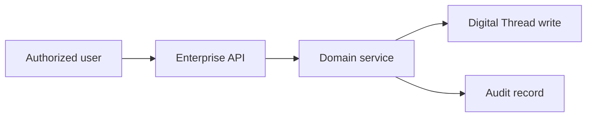

# Mercury Digital Twin

| Field | Value |
|-------|--------|
| Product | Mercury Digital Twin |
| Status | **Partial** |
| Family | Mercury AEOS |
| Companions | [README](README.md) · [Product Line Strategy](../Product_Line_Strategy.md) · [Digital Thread](../../04_Data/Digital_Thread.md) |

---

## 1. Purpose

Mercury Digital Twin visualizes and simulates fleet/aircraft state for operations and planning — bound to Passport truth, not a decorative 3D toy.

---

## 2. Positioning

Mercury Digital Twin is a named commercial and architectural product within the Mercury Aviation Enterprise Operating System. It does not ship a separate database or a divergent security model. It packages capabilities on **Mercury Core** so buyers recognize their operating role while the **Digital Thread** remains continuous.

---

## 3. Target users

- Ops and maintenance controllers
- Executives
- Reliability (future analytics)

---

## 4. Business capabilities

| Capability | Status |
|------------|--------|
| Digital Twin workspace (UI) | Partial |
| Twin services / simulation | Planned |
| Physics digital twin OEM-grade | Long-term |

---

## 5. Major entities

TwinView projections over Aircraft, utilization, open work, defects.

---

## 6. Relationships to the Digital Thread

Every mutation that affects configuration, airworthiness evidence, material, tooling, or certification must persist resolvable references (aircraft, task/work, publication revision, actor, organization). See [Digital Airworthiness Passport](../../10_Platform/Digital_Airworthiness_Passport.md) and [ADR-0002](../../08_Standards/ADR/ADR-0002-digital-thread-passport.md).

---

## 7. APIs

UI workspace today; future `/api/v1/twin/*`.

All APIs follow [API Standards](../../08_Standards/API_Standards.md) and organization isolation ([Multi-Tenant Standards](../../08_Standards/Multi_Tenant_Standards.md)).

---

## 8. Security

| Control | Application |
|---------|-------------|
| RBAC | Product permissions subset of the central catalogue |
| Org isolation | Service-layer enforcement on every query |
| Audit | Fail-closed on safety-critical mutations |
| AI | Advisory only if AI surfaces are included |

See [RBAC](../../06_Security/RBAC.md) · [Audit](../../06_Security/Audit.md) · [Zero Trust](../../10_Platform/Zero_Trust_Architecture.md).

---

## 9. Workflows

Product-specific workflows are detailed in domain standards under `docs/08_Standards` and business views under `docs/03_Business`.

---

## 10. Dependencies

Core, Passport, AI (advisory overlays).

---

## 11. Roadmap

Live maintenance state twin; what-if planning; airport/airspace later.

---

## 12. Related documents

[Product Vision](../../01_Executive/Product_Vision.md) · [Editions](../Editions.md) · [Industries](../../03_Business/industries/Industries_Overview.md)
