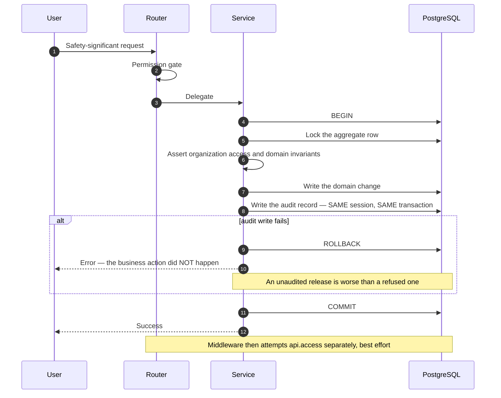
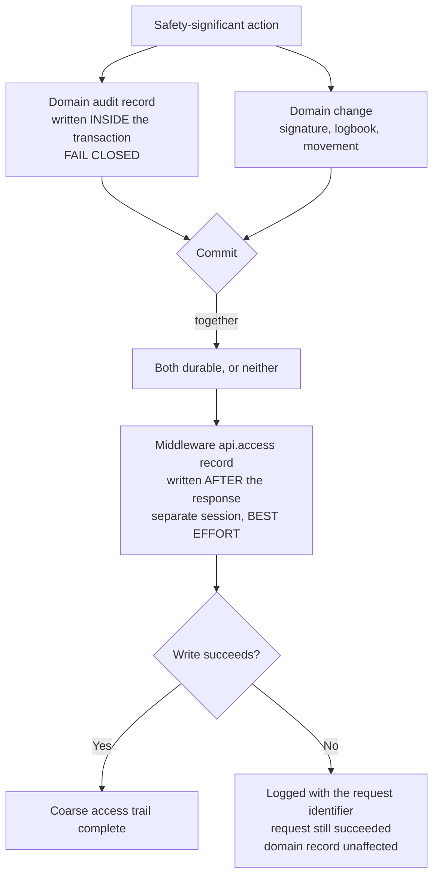
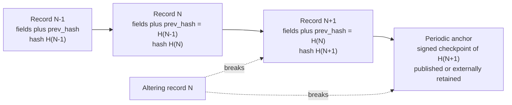
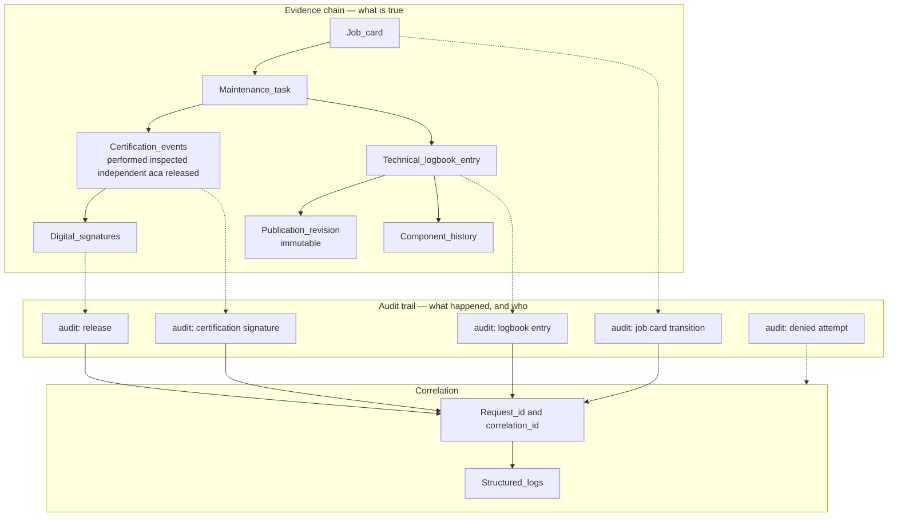

# Audit — Mercury Aviation Enterprise Operating System

| Field | Value |
|-------|-------|
| Document | Audit trail specification — record structure, action catalogue, fail-closed policy, provenance, retention |
| Product | Mercury Aviation Enterprise Operating System (AEOS) |
| Organization | Mercury Technologies |
| Layer | Security — establishing what happened, who did it, and in which organization |
| Audience | Security engineers, developers, quality managers, auditors, aviation authorities, customer compliance teams |
| Status | Living baseline — changes to the audit model require an ADR |
| Companion documents | [Identity](Identity.md) · [RBAC](RBAC.md) · [Digital Signatures](Digital_Signatures.md) |
| Upstream authority | [SECURITY.md](../../SECURITY.md) · [Technical Architecture](../02_Architecture/Technical_Architecture.md) |

---

## 1. Scope

### 1.1 In scope

This document specifies **audit** in Mercury: what an audit record contains, the canonical action catalogue, the provenance model that distinguishes operator-entered from system-generated from simulated data, which code paths are **fail-closed** so that an unaudited action cannot succeed, how audit interacts with evidence immutability, how audit is queried and scoped, and how retention is configured.

### 1.2 Audit is not logging

This distinction governs the whole document.

| | Logging | Audit |
|---|---------|-------|
| Purpose | Helps engineers diagnose behaviour | Protects the record of what happened |
| Audience | Developers, operations | Auditors, quality managers, authorities, investigators |
| Store | Structured log stream | Durable rows in the database, inside the business transaction |
| Content | Whatever is useful | Actor, role, organization, site, action, target, outcome, origin, time |
| If it fails | The engineer is inconvenienced | **On safety-significant paths, the business action must not succeed** |
| Retention | Operational window | The authority-required period for airworthiness records |
| Mutability | Rotated and discarded freely | Never updated, never deleted by any code path |

A platform that conflates the two will eventually discard evidence during a log rotation. Mercury keeps them separate, correlated by request and correlation identifiers.

### 1.3 Out of scope

| Concern | Authoritative location |
|---------|------------------------|
| Authentication, sessions, tenancy resolution | [Identity](Identity.md) |
| Roles, permissions, segregation of duties | [RBAC](RBAC.md) |
| Signature construction and cryptographic limits | [Digital Signatures](Digital_Signatures.md) |
| Threat model, disclosure policy, non-claims | [SECURITY.md](../../SECURITY.md) |
| Transaction boundaries and the middleware audit trade-off | [Technical Architecture §9.5](../02_Architecture/Technical_Architecture.md#95-audit-consistency) |
| Structured logging and metrics | [Technical Architecture §11](../02_Architecture/Technical_Architecture.md#11-cross-cutting-infrastructure) |
| Traceability edges between evidence records | [Digital Thread](../04_Data/Digital_Thread.md) |

### 1.4 Honesty markers

| Marker | Meaning |
|--------|---------|
| **Current** | In the runtime, exercised by tests |
| **Partial** | Present for a subset of the described scope |
| **Planned** | Designed here, not built |
| **Debt** | A known deviation from the target, tracked deliberately |

---

## 2. Design principles

| # | Principle | Consequence |
|---|-----------|-------------|
| 1 | **Audit everywhere.** | Authentication events, authority changes, administrative actions, configuration changes, and every safety-significant domain transition are audited. |
| 2 | **Fail closed where it matters.** | If the audit record for completion of work, inspection, certification, or release cannot be written, **the action does not succeed**. An unaudited release is worse than a refused one. |
| 3 | **Fail open where availability matters more.** | The middleware-level access audit is best-effort. A failing audit writer must not stop a technician from signing work. This trade-off is deliberate, is stated, and is the reason a durable at-least-once path is a roadmap item. |
| 4 | **Same transaction, same fate.** | Domain audit records are written inside the business transaction. They commit together or roll back together, so there is no window in which one exists without the other. |
| 5 | **Never update, never delete.** | No code path in the platform updates or deletes an audit record. Append-only is the whole point. |
| 6 | **Provenance is explicit.** | Every record declares whether its subject was operator-entered, system-generated, or **simulated**. Demonstration data must be indistinguishable from real data only in shape, never in labelling. |
| 7 | **Organization-scoped, like everything else.** | Audit reads are scoped to organization and site. The audit trail is not a hole in the isolation boundary. |
| 8 | **Actor, action, target, outcome, time — always.** | A record that omits any of these is not an audit record. Outcome in particular: denials are as informative as successes. |
| 9 | **Business context, never secrets.** | Detail fields carry business meaning. Passwords, PINs, credentials, tokens, and personal data beyond identity references never enter an audit record. |
| 10 | **Say what is not yet tamper-evident.** | Immutability today rests on code discipline, not on database enforcement or hash chaining. Both are named roadmap items and neither is implied to exist. |

---

## 3. The audit record

### 3.1 Structure

| Field | Meaning | Notes |
|-------|---------|-------|
| `action` | The canonical action name, `<subject>.<verb>` | Drawn from the catalogue in §4 |
| `actor` | The authenticated username that performed the act | The *user*, not the employee — employee attribution lives on signatures |
| `actor_role` | The effective session role at the moment of the act | Recorded because a role can change later; the record must state the authority in force **then** |
| `organization_id` | The organization the act belongs to | The isolation scope |
| `site_id` | The site in force | The operational scope, and part of the read filter |
| `target_type` | The kind of object acted on | For example `maintenance_task`, `job_card`, `organization`, `user` |
| `target_id` | The identifier of the object acted on | Enables a per-object history query |
| `source` | Where the act entered the platform | Defaults to `api` |
| `outcome` | `success` or a failure classification | **Denials are recorded, not only successes** |
| `origin` | `operator`, `system`, or `simulated` | Who or what originated the act |
| `details` | Free-text business context | Never credentials, never secrets |
| `occurred_at` | The timestamp of the act, in UTC | The ordering key for every audit query |

### 3.2 Why `actor_role` is stored rather than resolved later

A role is mutable. If the audit trail stored only the actor, then answering "did this person have the authority to do this at the time?" would require reconstructing historical role state — which is exactly the reconstruction an auditor should not have to trust. Storing the role in force at the moment of the act makes the record self-describing.

The same reasoning motivates the point-in-time authority projection listed in [RBAC §12](RBAC.md#12-future-enhancements): `actor_role` answers the question for session authority, and the projection will answer it for certification authority.

### 3.3 Why `outcome` matters as much as `action`

An audit trail of successes is a history. An audit trail that includes **denials** is a control. A pattern of denied context switches, denied permission checks, or failed logins is reconnaissance, and it is only visible if refusals are recorded with the same care as successes.

### 3.4 The provenance model

Mercury records provenance so that no consumer can mistake demonstration data for operational truth.

| Provenance value | Meaning | Typical use |
|-----------------|---------|-------------|
| `operator_entered` | A human entered or caused this | The default, and the correct value for shop-floor activity |
| `system_generated` | The platform derived or computed this | Forecast recalculation, status roll-up, scheduled evaluation |
| `simulated` | **Demonstration or test-origin data** | Seeded demonstration records, exercise scenarios |

| Origin value | Meaning |
|-------------|---------|
| `operator` | Originated by an authenticated human |
| `system` | Originated by the platform itself |
| `simulated` | Originated by demonstration or exercise machinery |

Two properties make this trustworthy rather than decorative:

1. **Validation is strict.** An unrecognized provenance value is rejected with `400`, not silently coerced to a default. There is no path by which a caller labels data with an invented provenance.
2. **The default is the honest one.** Absent input defaults to `operator_entered` — the value that claims the least about the platform and the most about the human. A default of `system_generated` would let responsibility drift away from a person.

**Why this exists at all:** an aviation platform that seeds demonstration fleets, publications, and work packages must never allow a lessor, an auditor, or a buyer to read a seeded record as an airworthiness fact. Provenance is the field that prevents it, and `simulated` is a first-class value rather than an embarrassment to be hidden.

---

## 4. The canonical action catalogue

### 4.1 Naming pattern

`<subject>.<verb>`, lower snake case, matching the permission naming convention in [RBAC §5.1](RBAC.md#51-the-naming-pattern). Audit actions and permissions are **different namespaces** with the same shape — `config.change` is an audited action, not a permission — and that is intentional: what is recorded is not always what is gated.

### 4.2 Platform-level canonical actions

| Action | Written when | Fail-closed |
|--------|-------------|-------------|
| `auth.login` | A session is established | Yes — authentication is not a safety path, but an unrecorded login is unacceptable |
| `auth.logout` | A session is terminated | Yes |
| `security.login_failure` | Authentication fails, including rate-limited attempts | Yes |
| `user.create` | An operator account is created | Yes |
| `user.password_change` | A credential is changed | Yes |
| `user.role_change` | A role is changed | Yes — an authority change without a record is indefensible |
| `config.change` | Platform configuration is changed | Yes |
| `security.event` | A security-relevant event, including denied organization access and denied context switches | Yes |
| `api.access` | An authenticated, mutating API call completes | **No — best effort.** See §5.3 |

### 4.3 Domain action families

Domain services write audit records at every safety-significant transition, using the same `<subject>.<verb>` pattern. The families and the transitions that must be recorded:

| Family | Recorded transitions |
|--------|---------------------|
| Organization and tenancy | Organization and site creation and change, membership grant and revocation, context switch, administrator cross-organization access |
| Fleet and components | Aircraft registration and status change, component installation and removal, life counter adjustment |
| Publications | Publication creation, revision issue, revision supersession, archival |
| Personnel | Employee creation and status change, qualification and authorization grant, change, and expiry, stamp issue and revocation |
| Maintenance and certification | Task creation, status transition, **every certification signature**, release, technical logbook entry creation, logbook amendment |
| Work orders | Package, order, and job card creation, assignment, execution transitions, inspection approval, release |
| Planning | Programme and revision change, AD/SB/EO applicability decision, MEL entry and closure, forecast recalculation, check generation |
| Logistics | Receipt, issue, transfer, adjustment, scrap, reservation and release, purchase request and order lifecycle, vendor change, tool calibration status change |
| Approvals, incidents, alerts | Approval request and review, incident lifecycle and evidence attachment, alert acknowledgement |
| Advisory decisions | Recommendation generation, selection, acknowledgement, and **advisory rejection**. See [AI Strategy](../07_AI/AI_Strategy.md) |

### 4.4 Adding an audited action — the checklist

1. Choose a subject matching an existing domain noun; choose a verb describing the transition, not the implementation.
2. Decide **fail-closed or best-effort**, using the test in §5.2. Write the decision down; do not leave it to the reader of the code.
3. Populate every field in §3.1. A record with an empty `target_id` on an object-level action is a defect.
4. Set `outcome` on the failure path too, not only the success path.
5. Set `origin` and provenance honestly. If a seed writes it, it is `simulated`.
6. Put business context in `details`. Re-read it once, asking whether a credential, a PIN, or unnecessary personal data has leaked in.
7. Write the record **inside the business transaction** for a fail-closed action.
8. Add a test asserting the record exists after the action, and — for fail-closed paths — that the action fails when the record cannot be written.
9. Add the action to §4.3 in the same change.

---

## 5. Fail-closed policy

### 5.1 The mechanism

A domain audit write adds the record to the **same database session** as the business change. There is no separate connection, no queue, and no best-effort wrapper. Therefore:

- The audit row commits **if and only if** the business change commits.
- A failure to write the audit row raises, and the whole transaction rolls back.
- There is no window in which the business change exists without its audit record — not milliseconds.

### 5.2 Which paths are fail-closed

The test: **would an unrecorded occurrence of this action damage the airworthiness record, the authority chain, or the isolation boundary?** If yes, fail closed.

| Path | Policy | Reason |
|------|--------|--------|
| Certification signature — any step | **Fail closed** | The signature *is* the evidence; an unattributed one is worthless |
| Inspection approval and independent inspection | **Fail closed** | Segregation of duties must be provable |
| ACA certification and aircraft release | **Fail closed** | The highest-consequence action in the platform |
| Technical logbook entry and amendment | **Fail closed** | The permanent airworthiness record |
| Job card completion and status transition | **Fail closed** | Establishes what was done and when |
| Component installation, removal, life adjustment | **Fail closed** | Configuration truth |
| Publication revision issue and supersession | **Fail closed** | Establishes what authorized a maintenance action |
| Personnel qualification and authorization change | **Fail closed** | Changes who may certify |
| Membership, role, and permission change | **Fail closed** | Changes who may do anything |
| Organization context switch, granted or denied | **Fail closed** | The isolation boundary |
| Stock movement — receive, issue, transfer, adjust, scrap, reserve, release | **Fail closed** | Part provenance and the append-only ledger |
| Purchase order lifecycle | **Fail closed** | Commercial and provenance record |
| Login, logout, login failure, configuration change | **Fail closed** | Platform accountability |
| **Middleware `api.access` record** | **Best effort** | Availability trade-off — see §5.3 |
| Read-only queries and dashboard aggregation | Not audited individually | Auditing every read would drown the trail; sensitive-read auditing is scoped in §10 |

### 5.3 The one deliberate exception

The middleware-level `api.access` record — written for authenticated mutating calls — is produced **after** the response, in its own session. A failure is logged and does not fail the request.

| Aspect | Position |
|--------|----------|
| Why | A failing audit writer must not stop a technician from signing work during a maintenance input. Availability of the safety-critical path outranks completeness of the coarse access log |
| What is actually at risk | Only the **coarse access record**. The domain audit record for the same action was already written inside the business transaction and is not affected |
| Residual risk | A persistent audit-writer failure could create a gap in the coarse access trail while domain records remain complete |
| Marker | **Debt**, deliberately taken |
| Resolution | A durable at-least-once audit path — an outbox written in the business transaction and drained asynchronously — removes the trade-off rather than mitigating it. Named in [SECURITY.md §9](../../SECURITY.md#9-security-roadmap) |

Stating this plainly is the point. A security document claiming an unconditional fail-closed audit while the middleware path is best-effort would be inaccurate in exactly the way an auditor is paid to find.

### 5.4 Read the two layers together

---

## 6. Evidence immutability

### 6.1 What is never mutated

| Record type | Rule |
|-------------|------|
| Audit records | Never updated, never deleted by any code path |
| Digital signatures | Immutable once recorded |
| Certification events | Immutable once recorded |
| Technical logbook entries | **Append-only.** Corrections are appended as amendments preserving the original |
| Publication revisions | Immutable once issued; a new revision supersedes rather than edits |
| Stock movements | Append-only ledger; balances are a maintained summary of it |
| Component history entries | Append-only |

### 6.2 Append-only amendment, not editing

The technical logbook is not edited. A correction is a **new entry** that references and preserves the original. This matters because the original entry is itself evidence: what was recorded at the time, by whom, is a fact about the maintenance organization's process, and an edit would destroy it. An auditor reading an amendment chain learns both what the truth is and that a correction was needed.

### 6.3 Terminal-state protection

| Protection | Behaviour |
|------------|-----------|
| A released job card cannot be mutated | `409 Conflict` |
| A released or finalized task cannot be signed | `409 Conflict` |
| Double release is refused | `409 Conflict` |
| A soft-deleted record remains referenceable | Evidence tables are never deleted at all |

### 6.4 Honest limitation — immutability is conventional, not structural

| Property | Status | Detail |
|----------|--------|--------|
| No service method updates or deletes an audit record, signature, certification event, logbook entry, or movement | **Current, by code discipline** | A strong convention, verified by review and tests |
| Database-enforced append-only | **Planned** | A trigger or permission-level control would make immutability structural rather than conventional. Until then, a sufficiently privileged database credential could alter history |
| Tamper-evident hash chaining across audit records | **Planned** | Each record carrying a hash of its predecessor would make undetected alteration or deletion of an interior record infeasible. This is the highest-value integrity upgrade available to the platform |
| Write-once archive tier | **Planned** | External immutable storage for the authority-required retention period |
| Independent verification of chain integrity | **Planned** | Depends on chaining |

**Read that first row carefully.** Mercury's audit trail resists tampering *through the application*. It does not currently prove, to a third party, that no one with database access altered it. The distinction is the difference between an audit trail and a tamper-evident audit trail, and Mercury does not claim the latter. This is also stated in [Technical Architecture §14](../02_Architecture/Technical_Architecture.md#14-security-considerations) and [SECURITY.md §8](../../SECURITY.md#8-what-mercury-does-not-claim).

### 6.5 What hash chaining would look like

The anchor is what makes the chain meaningful: a chain alone can be recomputed wholesale by anyone who can rewrite every row. A periodically externalized checkpoint cannot be. Designing the anchor is the harder half of the work and is why this is a roadmap item rather than an afternoon.

---

## 7. Querying the audit trail

### 7.1 Scoped read

| Property | Behaviour |
|----------|-----------|
| Permission required | `audit.read` — held by Reviewer, and by the inspector and quality assurance personas. **Not held by Operator** |
| Organization scope | Filtered to the caller's organization |
| Site scope | Filtered to the site in force |
| Filters | By action, by target identifier |
| Ordering | Most recent first, by occurrence time |
| Limit | Clamped server-side to a maximum, and to at least one. A client-supplied limit is never trusted |
| Retention window | Records older than the configured retention period are excluded from the query |

### 7.2 The retention window is a query filter

This behaviour is worth stating precisely because it is easy to misread:

- The configured retention period **filters what the query returns**.
- It does **not** delete data. Records older than the window remain in the database.

| Consequence | Detail |
|-------------|--------|
| Reducing the configured window does not destroy evidence | It hides it from the standard query surface |
| Retention as a **deletion** obligation is not satisfied by this setting | An operator with a regulatory maximum-retention obligation must implement archival and deletion at the data tier. Documented as an operator responsibility in [SECURITY.md §10](../../SECURITY.md#10-customer-and-operator-responsibilities) |
| Long-lived airworthiness evidence is safe from an over-aggressive setting | A misconfigured window is recoverable, which is the correct failure direction for an aviation record |
| Marker | **Partial** — retention is enforced on read, not as a lifecycle |

### 7.3 The administrator cross-site query

A separate administrator listing exists that filters by action and actor with the retention window applied, but **does not filter by organization or site**.

| Aspect | Position |
|--------|----------|
| Purpose | Platform-level investigation, which is impossible if the investigator is confined to one tenant |
| Who | The administrator role only, through an administrative surface |
| Risk | This is a legitimate, deliberate, and **narrow** hole in the isolation boundary. An administrator can read audit metadata across tenants |
| Mitigations today | Restricted to the administrator role; the retention window still applies; results carry no domain payload beyond action, actor, target reference, outcome, and time |
| Marker | **Current, with acknowledged risk** |
| Intended hardening | Audit the audit read itself, so that cross-tenant investigative access is recorded as a `security.event` with the query parameters; require a stated reason; consider four-eyes authorization for cross-tenant audit access |

Multi-tenant platforms need platform-level investigation. The honest position is not to pretend the capability does not exist, but to name it, restrict it, and make its use recorded — and the third of those three is not yet done.

### 7.4 Per-object history

Filtering by `target_id` yields the full history of one object: every transition, actor, role, outcome, and time. This is the query an auditor actually wants — "show me everything that happened to this job card" — and it is why `target_type` and `target_id` are mandatory fields rather than optional context.

---

## 8. Audit and the digital thread

An audit record is not an isolated log line. It is an edge in the traceability graph, and it links the *process* to the *evidence*.

The **denied attempt** node has no evidence counterpart, and that is exactly why the audit trail is not redundant with the evidence chain. Evidence records what succeeded. Audit records what was tried. An investigation almost always needs both.

Full edge catalogue: [Digital Thread](../04_Data/Digital_Thread.md).

---

## 9. Non-functional requirements

### 9.1 Completeness and correctness

| Requirement | Position |
|-------------|----------|
| Every safety-significant domain transition writes an audit record | **Current** |
| Domain audit records commit atomically with the business change | **Current** |
| Failure outcomes are audited, not only successes | **Current** |
| No code path updates or deletes an audit record | **Current, by code discipline** |
| Provenance is validated strictly, rejecting unknown values | **Current** |
| Coarse `api.access` completeness | **Partial** — best effort by design |
| Database-enforced append-only | **Planned** |
| Tamper-evident chaining and external anchoring | **Planned** |
| Independent third-party verification of trail integrity | **Planned** |

### 9.2 Performance

| Concern | Current baseline | Aspirational enterprise target |
|---------|-----------------|-------------------------------|
| Audit write cost | One row insert in the existing transaction; no extra round trip | Unchanged — a fail-closed audit must never become the reason to skip auditing |
| Added latency on a signing operation | A single insert within an already-open transaction | Under 10 ms of the operation's budget |
| Audit query latency | Time-ordered index with organization, site, and retention filters | 95th percentile under 500 ms over a 12-month window |
| Per-object history query | Filtered by target identifier | 95th percentile under 300 ms |
| Trail growth | The audit table is among the fastest-growing in the platform, alongside stock movements | Time partitioning keeps query cost bounded as history grows |

### 9.3 Durability and retention

| Concern | Current baseline | Aspirational enterprise target |
|---------|-----------------|-------------------------------|
| Audit durability | Durable in PostgreSQL, subject to the operator's backup regime | **RPO 0** with synchronous commit and replication, matching evidence tables |
| Recovery | Set by the operator's restore procedure | **RTO 1 hour** for read-only evidence and audit access |
| Retention enforcement | A **query filter**, not a lifecycle | Tiered lifecycle — hot, warm, and an immutable archive for the authority-required period |
| Archive integrity | Not applicable | Write-once storage with verifiable checksums and periodic verification |
| Export for an auditor | Query-based | Reproducible evidence pack with resolvable revision references, named in [SECURITY.md §9](../../SECURITY.md#9-security-roadmap) |
| Backup verification | Operator responsibility | Automated monthly restore rehearsal with a published result |

The RPO asymmetry is intentional and matches [Technical Architecture §13.4](../02_Architecture/Technical_Architecture.md#134-durability-and-recoverability): fifteen minutes of lost stock movements can be recovered by a physical count, while a lost release signature or its audit record cannot be recovered at all.

### 9.4 Regulatory support

Mercury supports audit-relevant regulatory expectations; it does not confer compliance. See [SECURITY.md §8](../../SECURITY.md#8-what-mercury-does-not-claim).

| Expectation | How Mercury supports it | Position |
|-------------|------------------------|----------|
| Maintenance actions are attributable to named, qualified individuals | Certification events plus signatures plus audit | **Current** |
| Records establish what authorized a maintenance action | Immutable publication revision binding, snapshotted into the logbook | **Current** |
| Independence of inspection is demonstrable | Distinct-signer enforcement, with each signer recorded separately | **Current** |
| Records are protected from unauthorized alteration | Permission-gated, append-only by discipline | **Partial** — structural enforcement is **Planned** |
| Records are retained for the required period | Retention configuration and operator-owned archival | **Partial** |
| Records are retrievable for oversight | Scoped query, per-object history | **Current**; reproducible evidence packs are **Planned** |
| Authority changes are traceable | `user.role_change` plus personnel authority audit | **Partial** — point-in-time authority projection is **Planned** |

---

## 10. Security considerations

**Fail-closed is the defining property, and its boundary is stated.** Domain audit records for safety-significant actions commit with the business change or the business change does not happen. The middleware access record is the one deliberate exception, and §5.3 states exactly what is at risk when it fails: the coarse access trail, never the domain record.

**Same-transaction writing removes a class of race entirely.** Because the audit row and the domain row share a transaction, there is no interleaving, no queue backlog, and no partial-failure state to reconcile. Any future move to asynchronous auditing must preserve this with a transactional outbox — the record enqueued in the business transaction — and not merely with a retry.

**The audit trail is inside the isolation boundary.** Audit reads are scoped by organization and site and gated by `audit.read`, which Operator does not hold. The administrator cross-site query in §7.3 is the single deliberate exception, and hardening it by auditing the audit read is a named enhancement rather than a claimed control.

**Denials are recorded, which turns the trail into a detection surface.** Failed logins, denied context switches, denied organization access, and refused signatures are all recorded with outcome. Aggregating them into alerting is **Planned**; the data to do it exists today.

**Secrets never enter audit records.** Passwords are hashed and never logged. Signing credentials are verified and discarded. Detail fields carry business context. This is a review obligation on every new audited action, and step 6 of the §4.4 checklist exists to make it a habit rather than a hope.

**Personal data in audit records is minimized but not absent.** Actor usernames, employee references, and role names are personal data. Access is permission-gated and audited; minimization and retention are deployment obligations documented for operators. Field-level encryption is **Planned**.

**Provenance prevents the worst kind of false confidence.** A seeded demonstration fleet that read as operational truth to a lessor or an auditor would be a serious integrity failure. Strict validation, a first-class `simulated` value, and an honest default are what stop it. Any code path that writes domain data without setting provenance honestly is a defect, regardless of whether it works.

**Immutability is conventional today.** Restated because it is the most important limitation in this document: Mercury's trail resists tampering through the application, not through the database. Hash chaining with external anchoring is the upgrade that would change the claim from "we do not alter records" to "alteration is detectable", and it is not yet built.

**Retention hides rather than deletes.** An operator who must *delete* records after a period cannot achieve that with the retention setting alone. Stated in §7.2 so that no one discovers it during an audit.

**Concurrency correctness depends on locking.** Audit records for state transitions are written inside transactions that hold a row lock on the aggregate. That lock is what makes the recorded sequence match the actual sequence.

**Known audit security debt**, tracked openly: no database-enforced append-only, no tamper-evident chaining or external anchoring, best-effort middleware access audit, retention as a read filter rather than a lifecycle, the un-audited administrator cross-site audit read, no anomaly detection over denials, no reproducible evidence-pack export, and no field-level encryption of personal data in audit rows.

---

## 11. Scalability

### 11.1 The audit table is a growth problem, not a latency problem

Writing is cheap — one insert inside a transaction that is already open. The scaling concerns are **volume** and **query cost over history**, and they arrive in that order.

| Concern | Characteristic |
|---------|---------------|
| Write throughput | One insert per audited action. Scales with the platform, adds no round trips |
| Table growth | Among the fastest-growing tables, alongside stock movements. Growth is proportional to activity, and aviation activity is steady rather than bursty |
| Query cost over a long history | The real problem. A twelve-month window over years of history needs partitioning, not a bigger index |
| Fan-out to external systems | Not present today. When it arrives, it must not become a synchronous dependency of a fail-closed path |

### 11.2 Scaling levers in dependency order

| # | Lever | Unlocks | Cost |
|---|-------|---------|------|
| 1 | Time partitioning of the audit table | Bounded query cost as history grows; cheap archival by dropping or detaching a partition | Migration and archival tooling |
| 2 | Database-enforced append-only | Structural immutability; also simplifies partition management, since no partition is ever updated | Migration plus a database permission model |
| 3 | Tamper-evident hash chaining | Detectable alteration. Note the ordering constraint: chaining requires a defined sequence, which interacts with partitioning and must be designed together | Item 2, plus a sequencing decision |
| 4 | External anchoring of chain checkpoints | Third-party-verifiable integrity | Item 3, plus an external retention arrangement |
| 5 | Transactional outbox for audit fan-out | Asynchronous delivery to a SIEM or archive without making a fail-closed path depend on an external system | Message bus, and consumer idempotency |
| 6 | Tiered storage — hot, warm, immutable archive | Long-term retention at sustainable cost | Items 1 and 4 |
| 7 | Read replicas for audit query load | Investigative and reporting queries off the primary | Replication lag, which is acceptable for audit reads |
| 8 | Purpose-built audit projections | Per-object history and authority-at-a-point-in-time served without scanning | Item 5 |
| 9 | Anomaly detection over denials | Turns a passive record into an active control | Item 5 |

Item 3's ordering constraint is the kind of thing that is cheap to notice now and expensive to discover later: a hash chain assumes a total order, and time-partitioned tables invite parallel insertion. Deciding the sequencing model before implementing either is the difference between a clean design and a migration.

### 11.3 What must survive any audit scaling change

- Fail-closed behaviour on every safety-significant path. **Asynchrony must never be introduced into a fail-closed write.** An outbox row written in the business transaction is acceptable; a fire-and-forget publish is not.
- Atomicity of the domain change and its audit record.
- Organization and site scoping on every read.
- Append-only semantics, with no update or delete path.
- Complete ordering fidelity for a single object's history, which is what an investigation actually traverses.
- Provenance honesty, including the `simulated` marker.

---

## 12. Future enhancements

| # | Enhancement | Value | Depends on |
|---|-------------|-------|------------|
| 1 | Time partitioning of the audit table | Bounded query cost as history grows | Migration tooling |
| 2 | Database-enforced append-only on audit and evidence tables | Immutability becomes structural rather than conventional | Migration plus a permission model |
| 3 | Tamper-evident hash chaining across audit records | Alteration or deletion of an interior record becomes detectable | Items 1 and 2, plus a sequencing decision |
| 4 | External anchoring of periodic chain checkpoints | Integrity verifiable by a third party, not only by Mercury | Item 3 |
| 5 | Transactional outbox for durable at-least-once audit fan-out | Removes the best-effort middleware trade-off rather than mitigating it | Message bus |
| 6 | Audit the audit read, including cross-tenant administrator queries | Closes the gap named in §7.3 | Audit extension only — the smallest high-value item on this list |
| 7 | Retention as a true lifecycle — hot, warm, immutable archive, deletion | Satisfies deletion obligations that a read filter cannot | Items 1 and 4 |
| 8 | Reproducible evidence-pack export with resolvable revision references | Auditor-acceptable bundles instead of query output | Publication revision resolution, already present |
| 9 | Point-in-time authority projection | Answers "what authority did this person hold then" without reconstruction | Personnel and audit projections |
| 10 | Anomaly detection and alerting over denial patterns | Reconnaissance becomes visible while it is happening | Item 5 |
| 11 | Sensitive-read auditing for personnel and commercial records | Records who read personal and commercially sensitive data, not only who changed it | Volume management, which item 1 provides |
| 12 | Field-level encryption of personal data in audit rows | Reduces exposure if the database is compromised | Key management |
| 13 | Standard export to customer SIEM platforms | Customer security operations gain Mercury visibility without database access | Item 5 |
| 14 | Independent integrity verification tooling published to customers | Lets a customer verify the trail themselves rather than trusting Mercury's assertion | Items 3 and 4 |
| 15 | Audit-derived compliance reporting per regulatory framework | Turns the trail into oversight-ready output | Items 8 and 9, plus [Regulations](../09_Regulations/) mapping |

---

## 13. Related documents

**Within the security set**
[Identity](Identity.md) · [RBAC](RBAC.md) · [Digital Signatures](Digital_Signatures.md) · [SECURITY.md](../../SECURITY.md)

**Architecture**
[Technical Architecture](../02_Architecture/Technical_Architecture.md) · [Domain Architecture](../02_Architecture/Domain_Architecture.md) · [Enterprise Architecture](../02_Architecture/Enterprise_Architecture.md) · [System Context](../02_Architecture/System_Context.md)

**Data and digital thread**
[Digital Thread](../04_Data/Digital_Thread.md) · [Data Model](../04_Data/Data_Model.md) · [Master Data](../04_Data/Master_Data.md)

**AI and twin**
[AI Strategy](../07_AI/AI_Strategy.md) · [Knowledge Graph](../07_AI/Knowledge_Graph.md) · [Digital Twin](../07_AI/Digital_Twin.md)

**Regulation and governance**
[Regulations documentation set](../09_Regulations/) · [ADR register](../08_Standards/ADR/) · [CONTRIBUTING](../../CONTRIBUTING.md) · [ROADMAP](../../ROADMAP.md) · [CODE_OF_CONDUCT](../../CODE_OF_CONDUCT.md)

---

*Mercury Technologies — One Digital Thread. One Digital Aircraft Passport. One Aviation Enterprise Operating System.*
