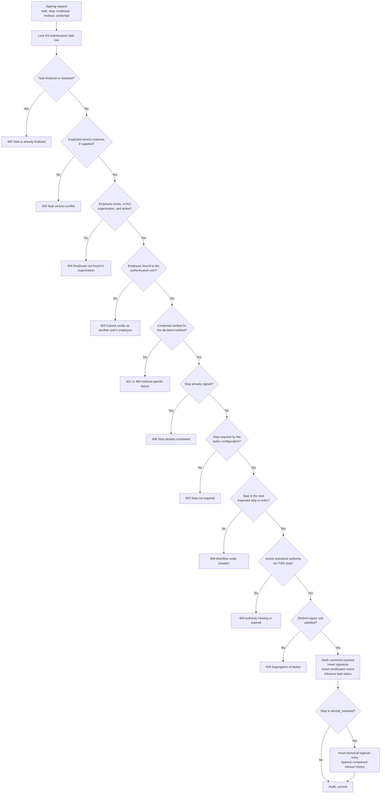
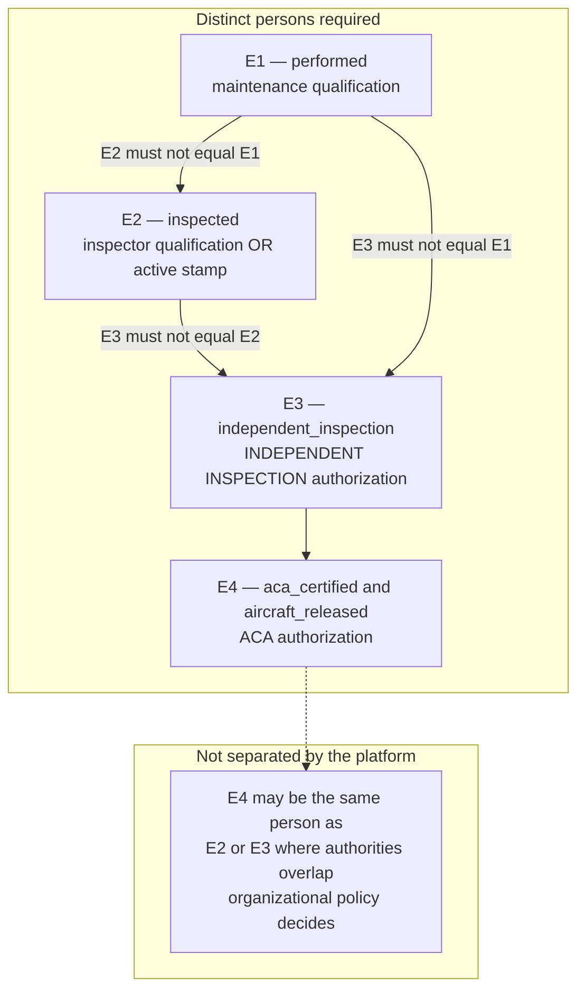
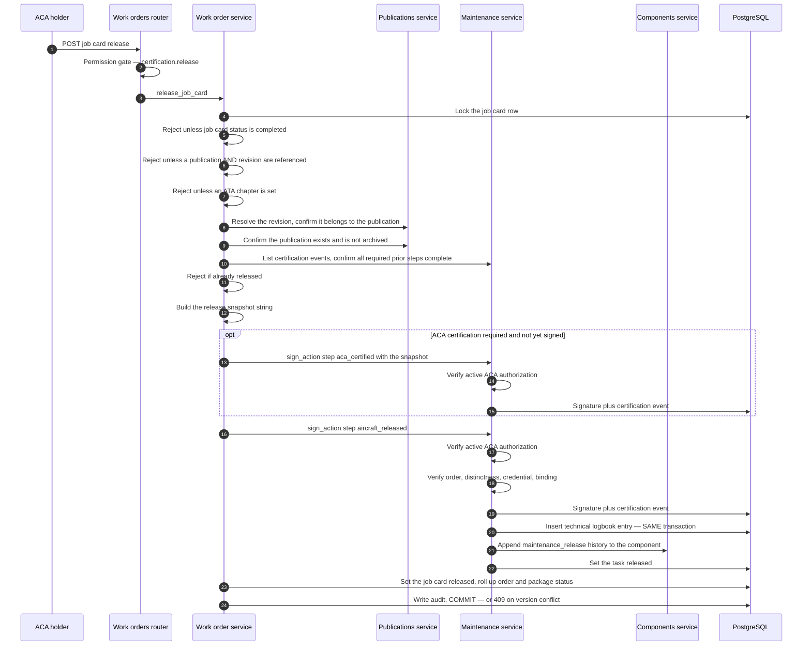
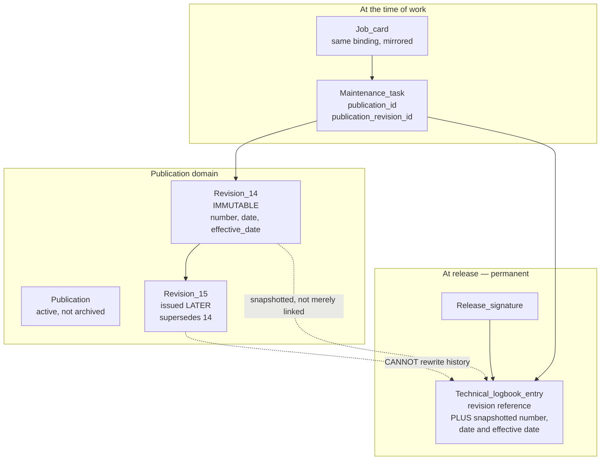
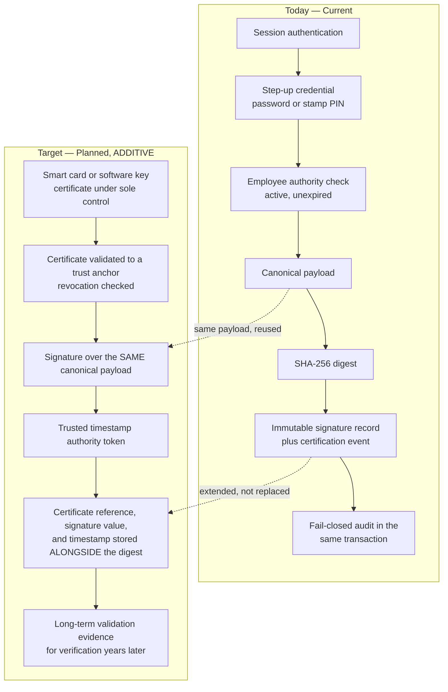

# Digital Signatures — Mercury Aviation Enterprise Operating System

| Field | Value |
|-------|-------|
| Document | Digital signature specification — certification chain, ACA release, double inspection, revision binding, and cryptographic limits |
| Product | Mercury Aviation Enterprise Operating System (AEOS) |
| Organization | Mercury Technologies |
| Layer | Security — attribution and integrity of airworthiness evidence |
| Audience | Security engineers, developers, quality managers, auditors, aviation authorities, ACA holders |
| Status | Living baseline — changes to the signature model require an ADR |
| Companion documents | [Identity](Identity.md) · [RBAC](RBAC.md) · [Audit](Audit.md) |
| Upstream authority | [SECURITY.md](../../SECURITY.md) · [Technical Architecture](../02_Architecture/Technical_Architecture.md) |

---

## 1. Scope

### 1.1 In scope

This document specifies **signatures** in Mercury: what a signature record contains, how the certification chain is ordered and enforced, how double inspection is guaranteed, how ACA certification and aircraft release work, how a release is bound to the immutable publication revision that authorized it, how an **advisory** output differs from a **certified** attestation, and — stated with deliberate prominence — **precisely what the current mechanism is not**.

Section 8 is the most important section in this document. It states, without softening, that Mercury's signatures are **not cryptographic public-key-infrastructure signatures today**. A reader who takes nothing else from this document should take that.

### 1.2 Out of scope

| Concern | Authoritative location |
|---------|------------------------|
| Authentication, sessions, employee-to-user binding | [Identity](Identity.md) |
| Permission catalogue, roles, personas | [RBAC](RBAC.md) |
| Audit record structure, fail-closed policy, retention | [Audit](Audit.md) |
| Threat model, disclosure policy, non-claims | [SECURITY.md](../../SECURITY.md) |
| Full certification data flow with layer detail | [Technical Architecture §5](../02_Architecture/Technical_Architecture.md#5-data-flow--job-card-certification-to-technical-logbook) |
| Evidence edges in the traceability graph | [Digital Thread](../04_Data/Digital_Thread.md) |
| Regulatory expectations on certification and release | [Regulations documentation set](../09_Regulations/) |

### 1.3 Honesty markers

| Marker | Meaning |
|--------|---------|
| **Current** | In the runtime, exercised by tests |
| **Partial** | Present for a subset of the described scope |
| **Planned** | Designed here, not built |
| **Debt** | A known deviation from the target, tracked deliberately |

---

## 2. Design principles

| # | Principle | Consequence |
|---|-----------|-------------|
| 1 | **A signature is evidence, not a status field.** | Signing creates immutable records — a signature and a certification event — never a boolean on a row. |
| 2 | **Attribution is to a named, qualified person.** | A signature names an employee whose authority was verified against active, unexpired qualifications at the moment of signing. |
| 3 | **Authority is verified at the time of the act.** | A qualification that lapsed yesterday does not sign today. Expiry is evaluated against the signing moment, never against an assignment date. |
| 4 | **Segregation of duties is structural.** | Performed ≠ inspected, and independent inspection ≠ both. Enforced in code, unconfigurable, and unavailable to an administrator. |
| 5 | **Order is enforced, not suggested.** | The required step sequence is computed from the task's configuration; anything out of order is refused. |
| 6 | **A release names its authority.** | Release requires an immutable publication revision, a matching publication, and an ATA reference. Instructions that authorized work cannot be identified retrospectively — they are bound at release. |
| 7 | **Release and its logbook entry are atomic.** | A release without a technical logbook entry is an unrecorded release. There is no acceptable window in which one exists without the other. |
| 8 | **Signatures are immutable.** | No code path updates or deletes a signature or a certification event. |
| 9 | **Refuse rather than simulate.** | A signature method without a real provider is **rejected**, not faked with a placeholder. This is the principle that produces the behaviour in §8.3. |
| 10 | **State the cryptographic limit loudly.** | The mechanism is integrity and attribution, not cryptographic non-repudiation. Section 8 says so in plain language, and no Mercury surface claims otherwise. |

---

## 3. What a signature record is

### 3.1 Fields

| Field | Content | Purpose |
|-------|---------|---------|
| Organization | The owning tenant | Isolation scope |
| Signer employee identifier | The named person whose authority was exercised | Legal attribution |
| Signer username | The authenticated account that performed the act | Ties the act to a session and to the audit trail |
| Method | `password`, `pin`, `pki`, `smart_card`, or `biometric_ready` | How the signer was verified |
| Purpose | `certification.<step>` | What the signature attests |
| Target type and identifier | The object signed — a maintenance task | What was signed |
| Signed at | UTC timestamp | When |
| Details | Signer notes | Business context |
| Signature hash | A SHA-256 digest over a canonical payload | Integrity of the recorded content |
| Attestation flags | `pin_verified`, `password_confirmed`, `pki_ready`, `smart_card_ready`, `biometric_ready` | Which verification actually occurred |

### 3.2 The canonical payload and hash

The hash is computed over a deterministic, delimiter-joined string of exactly these elements, in this order:

```text
organization | task | step | employee | username | method | signed_at_iso8601 | notes
```

| Property | Detail |
|----------|--------|
| Algorithm | SHA-256 |
| Determinism | The same inputs always produce the same digest, so verification is a recomputation |
| Coverage | Organization, task, step, employee, acting username, method, exact signing timestamp, and notes |
| What it proves | The recorded content of **this signature** has not been altered since it was written |
| What it does not prove | That a specific private key under the signer's sole control was used — see §8 |

**A named subtlety:** the payload contains the *acting* username, which may differ from the employee's bound username in the administrator-override case described in [Identity §7.4](Identity.md#74-the-administrator-override--stated-not-hidden). This is deliberate. Including the account that actually performed the act means a substitution is captured inside the hashed content rather than only in a separate audit row.

### 3.3 The attestation flags

The flags record **what verification actually happened**, not what was requested:

| Flag | Set when |
|------|----------|
| `password_confirmed` | A password credential was presented **and** verified against the operator directory |
| `pin_verified` | A PIN was presented **and** matched an active inspection stamp using a constant-time comparison |
| `pki_ready` | The method was declared as PKI — see §8.3 for why no such signature exists |
| `smart_card_ready` | The method was declared as smart card — same |
| `biometric_ready` | The method was declared as biometric-ready — same |

The `_ready` naming is intentional and honest: those three flags mark **readiness of the data model**, not the existence of a cryptographic act. The schema is shaped for real providers so that adding them is additive rather than a migration.

### 3.4 Signature and certification event — two records, two jobs

| Record | Answers |
|--------|---------|
| **Digital signature** | Who attested, how they were verified, over what content, with what integrity digest |
| **Certification event** | Which step of the task's lifecycle was completed, by whom, when, and referencing which signature |

The separation exists because the platform reasons about *workflow* over certification events — required steps, next expected step, distinct-signer comparisons — while it reasons about *attribution* over signatures. Collapsing them would tangle process state with evidence.

---

## 4. The certification chain

### 4.1 The five steps

| Step | Attests | Authority required on the employee record | Persona |
|------|---------|-------------------------------------------|---------|
| `performed` | The work was carried out | An active, unexpired maintenance qualification — licence, rating, type rating, or training | technician |
| `inspected` | The work was inspected | An active inspector qualification — licence, rating, or type rating — **or** an active inspection stamp authorization | inspector |
| `independent_inspection` | A second, independent inspection of a critical item | An active **independent inspection** authorization specifically | a *different* inspector |
| `aca_certified` | Certified by the airworthiness certification authority holder | An active **ACA** authorization | aca |
| `aircraft_released` | The aircraft is returned to service | An active **ACA** authorization | aca |

Which steps are **required** is a property of the individual task's configuration — whether it demands an inspector, an independent inspection, and ACA certification. The platform computes the required sequence, determines the next expected step, and refuses anything else.

### 4.2 The enforcement gate at every signature



### 4.3 The invariants, restated as a table

| # | Invariant | Failure |
|---|-----------|---------|
| 1 | A finalized or released task cannot be signed | `409` |
| 2 | A supplied expected version must match | `409` |
| 3 | The employee must exist, belong to the task's organization, and be active | `404` |
| 4 | The employee must be bound to the authenticated user | `403` |
| 5 | The credential must match and verify for the declared method | `401` or `400` |
| 6 | A step may be signed only once per task | `409` |
| 7 | Only a step required by the task's configuration may be signed | `400` |
| 8 | The step must be the next required step in order | `409` |
| 9 | The employee must hold active, unexpired authority for that specific step | `403` |
| 10 | The inspector must differ from the performer | `409` |
| 11 | The independent inspector must differ from the performer | `409` |
| 12 | The independent inspector must differ from the inspector | `409` |
| 13 | Release requires the job card to be inspection-complete | `409` |
| 14 | Release requires a referenced publication and a matching immutable revision | `409` |
| 15 | Release requires the publication to exist and not be archived | `409` |
| 16 | Release requires an ATA chapter | `409` |
| 17 | Release requires all prior required steps complete | `409` |
| 18 | An already-released task cannot be released again | `409` |

Every one is enforced **server-side in the service layer**, under a row lock, inside one transaction. None depends on the client behaving.

### 4.4 Why the row lock is a security control

The distinct-signer check reads prior certification events and then writes a new one. Without the lock, two simultaneous requests could each read an event list that lacks the other's signature, and both pass. The result would be one person satisfying two separated steps — the precise failure that independent inspection exists to prevent.

**Removing or weakening that lock for performance is a security change and must be reviewed as one.** This is also stated in [Technical Architecture §14](../02_Architecture/Technical_Architecture.md#14-security-considerations) and [RBAC §7.3](RBAC.md#73-the-enforced-separations).

---

## 5. Double inspection

### 5.1 What it is and why it exists

Independent — "double" — inspection is a second inspection of a critical item by a person who did **neither** the work nor the first inspection. It exists because a person who has just performed or inspected a task is the least able to see their own error, and because certain items have consequences that make a single check insufficient.

### 5.2 The three separations



| Separation | Enforcement | Failure |
|------------|-------------|---------|
| Inspector ≠ performer | The inspecting employee is compared against the recorded performer | `409` |
| Independent inspector ≠ performer | Compared against the recorded performer | `409` |
| Independent inspector ≠ inspector | Compared against the recorded inspector | `409` |

### 5.3 The authorization is specific, not inherited

The `independent_inspection` step requires an **`independent_inspection` authorization** on the employee record. It is not satisfied by an inspector qualification, by a stamp, or by an ACA authorization. A senior inspector without that specific authorization cannot sign it.

This is intentional: independent inspection authority is granted deliberately by a quality organization to named individuals for named scopes, and treating it as implied by seniority would defeat the control.

### 5.4 What the platform does not separate — stated honestly

| Not enforced | Detail |
|--------------|--------|
| ACA holder distinct from the inspector | If an employee holds both an inspector qualification and an ACA authorization, the platform permits them to sign `inspected` and then `aca_certified` on the same task. The three separations in §5.2 do not extend to the ACA steps |
| ACA holder distinct from the performer | Likewise not enforced. An employee holding both a maintenance qualification and an ACA authorization could sign `performed` and later `aircraft_released` on the same task |
| One person holding multiple authority types | Nothing prevents an employee from holding technician, inspector, independent inspection, and ACA authorizations simultaneously |

| Aspect | Position |
|--------|----------|
| Marker | **Debt** for the first two rows; the third is deliberately an organizational question |
| Why it is this way today | The three enforced separations cover the classic performed-versus-inspected control. Whether an ACA holder may certify work they performed or inspected is genuinely governed by the organization's approved exposition and the applicable authority's rules, which vary |
| Risk | A small organization where one person holds every authority could produce a task certified end to end by one individual, with the platform refusing only the `inspected` and `independent_inspection` overlaps |
| Intended resolution | A **critical-task policy engine** in which an organization declares required separations — including ACA independence — as configuration that the platform then enforces. Named in §12 and in [RBAC §12](RBAC.md#12-future-enhancements) |
| Interim control | Role-level separation helps: Operator cannot release, so an execution-role user cannot reach the release step at all. Organizations should not grant Reviewer role to personnel who also perform work |

Naming this gap is the responsible choice. An operator designing their exposition around Mercury needs to know exactly which separations the platform guarantees and which remain theirs to enforce procedurally.

---

## 6. ACA certification and aircraft release

### 6.1 What release means

`aircraft_released` is the return-to-service attestation: the aircraft or component is fit to be operated. It is the **highest-consequence action in the platform**, and it is gated accordingly.

### 6.2 The release sequence



### 6.3 The four release preconditions

| Precondition | Why it exists |
|--------------|---------------|
| **Inspection complete** | Release cannot precede the inspection it depends on |
| **A referenced publication and a matching immutable revision** | The release must name what authorized the work — see §7 |
| **An ATA chapter** | Locates the work in the standardized aircraft breakdown, without which the record is not retrievable in the way an authority expects |
| **All prior required steps complete** | The chain has no gaps |

### 6.4 Atomicity — release and logbook together

On `aircraft_released`, and only then, a technical logbook entry is written **in the same transaction** as the release signature, capturing organization, aircraft, registration, ATA chapter, task reference, publication and revision, component and serial number where implicated, and every signer as a separate identity field: performing mechanic, inspector, independent inspector where required, and ACA holder.

| Property | Position |
|----------|----------|
| Atomicity | **Non-negotiable.** A release without its logbook entry is an unrecorded release |
| Acceptable window | **None** — not milliseconds |
| Component history | A `maintenance_release` history entry is appended to the component's installation history in the same transaction |
| Future decomposition | Any decomposition that separates these must provide an **equivalent** guarantee, not an eventual one |

This is stated identically in [Technical Architecture §5.5](../02_Architecture/Technical_Architecture.md#55-the-logbook-entry) because it is the one place in the platform where a consistency property is a safety property.

### 6.5 Why every signer is a separate field on the logbook entry

Because segregation of duties must be **provable from the evidence record alone**, without replaying certification events or trusting a live session. An auditor holding one logbook entry can see four distinct names and confirm independence. That is the artefact the record exists to produce.

### 6.6 What release does not do

| Not done | Detail |
|----------|--------|
| It does not evaluate whether the aircraft is airworthy overall | It attests that *this* task is complete and certified. Fleet-level airworthiness is a continuing-airworthiness determination across many records |
| It does not clear open MEL items, other open tasks, or outstanding directives | Those are separate records with their own status |
| It is never automated | No AI, rule engine, forecast, or integration can produce a release. See [AI Strategy](../07_AI/AI_Strategy.md) |

The last row is a hard architectural commitment, not a current limitation.

### 6.7 Advisory output versus certified attestation

Mercury computes a great deal — forecasts, due lists, status traffic lights, shortage warnings, urgency ordering, and, in future, retrieval and prediction. None of it certifies anything. This subsection draws the line explicitly, because the distinction is what keeps every computed capability on the correct side of the authority boundary as the platform gains more of them.

| Dimension | **Advisory output** | **Certified attestation** |
|-----------|--------------------|--------------------------|
| Produced by | The platform — a computation, a rule, a projection, or in future a model | A named human being, exercising authority they hold |
| Asserts | "Given these records, this appears to be the case" | "I, holding this authority, attest that this is so" |
| Authority behind it | **None.** A computation holds no authority and cannot acquire one | An active, unexpired qualification or authorization, verified at the moment of the act — §4.1 |
| Record produced | A derived value, recomputable and typically not persisted as evidence | An **immutable** signature plus a certification event — §3.4 |
| Identity attached | The platform, plus provenance describing what informed it | A named employee, a bound user account, and a verified credential — [Identity §7](Identity.md#7-certification-identity--the-separation-that-must-not-collapse) |
| If it is wrong | A person reviewing it should catch it; correcting it is recomputation | An amendment appended to the record; the original is preserved because it is itself evidence — [Audit §6.2](Audit.md#62-append-only-amendment-not-editing) |
| Who is accountable | The organization's process for reviewing it | **The signer.** This is the whole point of attribution |
| May gate a release | **Never** | It *is* the release |

#### 6.7.1 The four rules that keep the boundary intact

| # | Rule | Consequence |
|---|------|-------------|
| 1 | **No advisory output may be a precondition for a certification step, a release, or a compliance determination.** | A release is refused for missing inspection, revision, ATA chapter, authority, or ordering — never because a computation approved or declined it. Nothing in §4.3 consults a derived value |
| 2 | **The human decision is what is recorded, not the recommendation.** | Where a person acts on advice, the evidence records their determination. A recommendation may be recorded alongside it as context; it never stands in place of it |
| 3 | **No inference sits in the synchronous path of a safety-critical transaction.** | The signing transaction takes a row lock and must stay short and deterministic. A model call inside it would make certification depend on the availability and latency of an advisory system |
| 4 | **Every advisory output carries provenance.** | Which records informed it, which version produced it, and when — so a reviewer can evaluate the advice rather than defer to it. [Knowledge Graph §6](../04_Data/Knowledge_Graph.md#6-provenance-and-confidence) |

#### 6.7.2 Where the boundary already applies

| Capability | Standing | Side of the line |
|-----------|----------|------------------|
| Forecast, due list, status traffic lights, urgency ordering | **Delivered**, computed on read | Advisory. A planner decides what to schedule; the platform computes what appears due |
| Applicability of an airworthiness directive, service bulletin, or engineering order | **Delivered** as a recorded human determination | The determination is a person's, recorded as theirs. Automated evaluation is Planned and would produce a **proposal**, not a determination |
| Deferred defect and MEL expiry alerting | **Delivered** | Advisory. The dispatch decision remains a person's |
| Material shortage warnings | **Delivered** | Advisory |
| Advisory decision engine in M1 Command | **Delivered**, in-memory | Advisory by construction — recommendations require human acceptance, and the review state is what persists. See [Product Family §5.1](../05_Product/Product_Family.md#51-m1--command--operations-heritage) |
| Retrieval, reliability analytics, predictive maintenance, digital twin | **Planned** | Advisory, and constrained by these rules before a line of it is written. [AI Strategy §3](../07_AI/AI_Strategy.md#3-the-advisory-only-principle) |

**Why this is stated in the signature document rather than only in the AI documents.** The rules above are easiest to hold while the platform has little advisory capability, and hardest to hold once it has a great deal — the pressure to let a confident computation short-circuit a human step arrives with the capability, not before it. Anchoring the boundary here, in the specification of the act that the boundary protects, is deliberate. **A change that lets any computed value influence the outcome of §4.3 is a safety change and must be reviewed as one**, regardless of how it is labelled in a pull request.

---

## 7. Publication revision binding

### 7.1 The requirement

A maintenance action must reference the **specific, immutable publication revision** that authorized it. "Per the maintenance manual" is not a record; "per revision 14 of AMM chapter 32, effective 2026-03-01" is.

### 7.2 What is enforced at release

| Check | Behaviour |
|-------|-----------|
| A publication is referenced | Missing → `409` |
| A revision is referenced | Missing → `409` |
| The revision **belongs to** the referenced publication | Mismatch → `409` |
| The publication exists | Missing → `409` |
| The publication is **not archived** | Archived → `409` |
| An ATA chapter is set | Missing → `409` |

The third check is the one that prevents the subtle error: a revision identifier that exists but belongs to a different publication would otherwise produce a record that looks complete and cites the wrong authority.

### 7.3 Snapshot, not only reference

At release, revision details are **snapshotted into the technical logbook entry** — the revision number, revision date, and the effective date in force — alongside the reference.



| Reason for snapshotting | Detail |
|------------------------|--------|
| **Later republication cannot rewrite history** | Issuing revision 15 does not change what a release performed under revision 14 says it was performed under |
| **The record is readable without a join** | An auditor reading a logbook entry sees the revision detail in the entry, not only a pointer |
| **Export survives** | An evidence pack remains meaningful outside the platform |
| **Deletion of a reference cannot orphan the meaning** | Even if a reference could not be resolved, the entry still states what authorized the work |

Revisions are themselves immutable and are superseded rather than edited, so the reference and the snapshot agree. The snapshot is defence in depth, and both mechanisms are **Current**.

### 7.4 What binding does not yet cover

| Gap | Marker | Detail |
|-----|--------|--------|
| No content-level hash of the revision | **Planned** | The revision's identity, number, date, and effective date are bound. The **content** — the actual instruction text or document bytes — is not hashed into the evidence. A managed object store with integrity verification would let a release bind to a content digest, so the exact document could be proven unchanged |
| No task-card-level or step-level granularity | **Partial** | Binding is at publication, revision, and ATA chapter. Deeper granularity — the specific task card or procedure step — is a planned refinement |
| Applicability not re-evaluated at release | **Planned** | The platform does not re-check at release that the cited revision was applicable to this aircraft's effective configuration on that date. Applicability is managed in planning; binding it into the release evidence is a future improvement |

---

## 8. What this is NOT — the cryptographic limit

### 8.1 The plain statement

**Mercury's digital signatures are not cryptographic public-key-infrastructure signatures.**

They are a **strong integrity and attribution mechanism**. They are not a cryptographic non-repudiation mechanism. The difference is not a detail, and it is not hidden anywhere in Mercury's documentation, product, or materials.

### 8.2 What the mechanism does and does not establish

| The mechanism **does** establish | The mechanism **does not** establish |
|----------------------------------|--------------------------------------|
| The recorded content of a signature has not been altered since it was written, verifiable by recomputing the digest | That a specific private key under the signer's **sole control** was used |
| Which named employee's authority was exercised, verified against active, unexpired qualifications at that moment | That the signer cannot later plausibly deny signing, to a third party, without Mercury's cooperation |
| Which authenticated account performed the act | Any assurance independent of trusting the Mercury platform and its database |
| **How** the signer was verified — password against the directory, or PIN against an active stamp | A signature verifiable by an external party using only public information |
| That the ordered chain of steps was satisfied by distinct, authorized persons | A certificate chain to a trusted authority, revocation status, or timestamp authority attestation |
| That the release cites an immutable revision, snapshotted into the record | That the cited document content is byte-for-byte the content the signer saw |
| That every act is audited, in the same transaction, on a fail-closed path | Long-term cryptographic validity independent of the platform's continued existence |

**The honest summary:** Mercury's signature is trustworthy **because Mercury's controls are trustworthy**. A cryptographic signature would be trustworthy **regardless**. That is the gap, and closing it is a named roadmap item.

### 8.3 PKI methods are refused, not simulated

This is the most important behavioural consequence of principle 9, and it deserves to be spelled out.

The signature method field accepts five values. Three of them — `pki`, `smart_card`, and `biometric_ready` — **cannot be used to sign**. Attempting to sign with any of them is rejected with `400` and a message stating that the method is **not production-enabled**.

| Aspect | Position |
|--------|----------|
| What happens | The signing request fails. No signature record is created. No certification event is created |
| What does **not** happen | No placeholder signature. No "PKI-style" hash presented as a certificate signature. No flag set to suggest a cryptographic act occurred |
| Why refuse rather than accept-and-mark | A signature record with `pki_ready` set and no certificate behind it would be a **lie in the evidence chain**. A downstream consumer, an auditor, or a future integration would reasonably read it as cryptographically signed. Refusing is the only defensible behaviour |
| What the flags are for then | They mark the **data model's readiness** for real providers. The schema is shaped so that adding a provider is additive |
| Marker | **Current** — the refusal is implemented and tested |

**This refusal is a feature.** It is the mechanism by which Mercury guarantees that no record in the evidence chain overstates its own strength. A platform that quietly accepted `pki` and stored a hash would have a more impressive-looking method field and a corrupt audit trail.

### 8.4 The two methods that do work

| Method | Verification | Strength |
|--------|-------------|----------|
| `password` | The presented credential is verified against the operator directory for the authenticated user | Proves the signer could re-present their account credential at the moment of signing — a meaningful step-up beyond an active session |
| `pin` | The presented PIN is matched against the employee's **active inspection stamps** using a constant-time comparison | Ties the act to a physical stamp code issued by the quality organization to that individual. Constant-time comparison prevents recovering a stamp code by timing |

Both are **shared-secret** mechanisms. Whoever knows the secret can produce the signature, which is precisely the limit that public-key cryptography removes.

### 8.5 Additional named limitations

| Limitation | Marker | Detail |
|------------|--------|--------|
| No certificate chain, revocation checking, or trusted timestamp authority | **Planned** | There is nothing to validate, no revocation state, and the timestamp is the platform's clock rather than an authority's attestation |
| Immutability is conventional, not structural | **Debt** | No code path updates or deletes a signature — a strong convention. Database-enforced append-only and tamper-evident chaining are **Planned**. A sufficiently privileged database credential could alter a signature row and recompute its digest, because the digest is over content the same actor controls |
| No hash chaining across signatures | **Planned** | Each digest protects one record. Deleting an entire signature and its certification event would leave a gap detectable by workflow reasoning but not by cryptography |
| Credential hashing for the `password` method uses Argon2id (legacy SHA-256 upgraded at login) | **Delivered** | Documented in [Identity §4.1](Identity.md). Offline resistance for stored login credentials is memory-hard; MFA at signing remains **Planned** |
| No multi-factor authentication at signing | **Planned** | A stolen password is sufficient for a `password`-method signature |
| The administrator signing override | **Debt** | Documented in [Identity §7.4](Identity.md#74-the-administrator-override--stated-not-hidden). It weakens attribution for administrator-performed signatures specifically, though the acting username is captured in the hashed payload |
| Attachments are reference-and-metadata based | **Planned** | Certificates and photographs supporting a signature are not stored in managed, integrity-checked binary storage |
| ACA independence from inspector and performer is not enforced | **Debt** | Documented in §5.4 |

Every one of these appears in [SECURITY.md §8](../../SECURITY.md#8-what-mercury-does-not-claim) or [SECURITY.md §9](../../SECURITY.md#9-security-roadmap). None is disguised.

### 8.6 What the PKI target looks like



| Property of the plan | Detail |
|---------------------|--------|
| **Additive, not a replacement** | Existing signatures remain valid records of what they were. New signatures carry cryptographic evidence in addition to the digest |
| **The canonical payload is reused** | Because the payload is already deterministic and complete, it becomes the signed content without redesign. This is why §3.2 defines it precisely |
| **The refusal becomes an acceptance** | The `pki` and `smart_card` methods stop being rejected once a real provider exists, and the `_ready` flags gain meaning |
| **Historical records are not retro-signed** | A signature made under the hash mechanism is never presented as cryptographic. Retroactively signing old evidence would be a fabrication |
| **Prerequisites** | Key management infrastructure, certificate lifecycle handling, revocation checking, a timestamp authority relationship, and long-term validation evidence retention |

The last row is why this is a roadmap item and not a sprint: the cryptography is easy, and the key management, revocation, and long-term-validation operations are not.

---

## 9. Non-functional requirements

### 9.1 Correctness

| Requirement | Position |
|-------------|----------|
| All eighteen invariants in §4.3 enforced server-side | **Current** |
| Signing takes a row lock on the task | **Current** |
| Signatures and certification events are immutable | **Current, by code discipline** |
| Release and technical logbook entry are atomic | **Current** |
| Release requires a matching immutable revision, publication, and ATA chapter | **Current** |
| Revision detail snapshotted into the logbook entry | **Current** |
| Unsupported signature methods are refused, never simulated | **Current** |
| Distinct-signer rules for performed, inspected, and independent inspection | **Current** |
| ACA independence from inspector and performer | **Not enforced** — see §5.4 |
| Database-enforced append-only | **Planned** |
| Cryptographic signature providers | **Planned** |

### 9.2 Performance

| Concern | Current baseline | Aspirational enterprise target |
|---------|-----------------|-------------------------------|
| Certification signing | One short transaction with a row lock | 95th percentile under 500 ms |
| Aircraft release | Adds logbook entry and component history to the same transaction | 95th percentile under 1 second |
| Authority evaluation | Qualification and authorization scan plus prior-event scan | Under 150 ms within the signing transaction |
| Hash computation | A single SHA-256 over a short string | Negligible, and unchanged |
| Cryptographic signing once available | Not applicable | Under 3 seconds including card interaction, revocation check, and timestamp token — **deliberately slower**, because the operations are external and worth waiting for |
| Signature verification | Recompute one digest | Under 10 ms; certificate-path validation under 500 ms once available |

### 9.3 Durability

| Concern | Current baseline | Aspirational enterprise target |
|---------|-----------------|-------------------------------|
| Signatures, certification events, logbook entries | Durable in PostgreSQL, subject to the operator's backup regime | **RPO 0** with synchronous commit and replication |
| Recovery of evidence access | Set by the operator's restore procedure | **RTO 1 hour** for read-only evidence access |
| Long-term retention | Retained for the life of the asset plus the authority-required period | Immutable archive tier |
| Long-term cryptographic validation evidence | Not applicable | Retained so a signature remains verifiable after certificate expiry — the hardest durability requirement on this list |

The last row is the durability requirement most often overlooked in PKI plans: a certificate that expires in three years must not invalidate a signature that must remain verifiable for thirty. Long-term validation evidence is what bridges that, and it must be designed in rather than added later.

### 9.4 Regulatory support

Mercury supports certification and release recordkeeping; it does not confer compliance, and it holds no aviation authority approval. See [SECURITY.md §8](../../SECURITY.md#8-what-mercury-does-not-claim).

| Expectation | Support | Position |
|-------------|---------|----------|
| Certification is by a named, qualified, authorized individual | Employee binding, authority verification at signing | **Current** |
| Authority is current at the time of the act | Expiry evaluated against the signing moment | **Current** |
| Independent inspection is demonstrably independent | Three enforced separations, each signer recorded separately | **Current** |
| Release is by an authorized ACA holder | ACA authorization required for both ACA steps | **Current** |
| The record states what authorized the work | Immutable revision binding plus snapshot | **Current** |
| The record is protected from alteration | Immutable by code discipline, permission-gated, audited | **Partial** |
| Signatures meet an electronic-signature standard | Attribution and integrity, **not** certificate-backed | **Partial — the gap is §8** |
| Records are retrievable for oversight | Scoped query, per-object history, logbook | **Current**; evidence-pack export is **Planned** |

---

## 10. Security considerations

**Three gates, and the third is not a permission.** Endpoint permission and organization access are necessary and insufficient for signing. Certification authority requires an employee record, a user binding, a verified credential, an active unexpired authority for the specific step, and satisfaction of the distinct-signer rule. A user holding every permission in the platform still cannot sign as an employee they are not bound to.

**Refusing beats simulating, every time.** The refusal of `pki`, `smart_card`, and `biometric_ready` is the single most important integrity decision in this document. It guarantees that no signature record overstates its own strength. Any future change that makes those methods succeed **must** be accompanied by a real provider — and reviewers should treat a change that merely stops refusing them as a critical defect.

**The hash protects content, not identity of key.** Restated because it is the most commonly misunderstood point: recomputing the digest proves the record was not edited. It proves nothing about a private key, because there is no private key. Section 8.2 is the authoritative statement.

**Immutability is conventional, and the digest does not fix that.** A privileged database actor could alter a signature row and recompute its digest, because the digest covers content that same actor controls. Only external anchoring — a chain with checkpoints held outside the database — changes this. It is **Planned**.

**Concurrency is a segregation-of-duties control.** The row lock is what makes the distinct-signer check correct under simultaneous requests. This bears repeating in a security document because it looks like a performance detail in code review.

**Atomicity is a safety property.** Release and logbook creation share a transaction. A future decomposition must provide an equivalent guarantee, not an eventual one. This is not open to performance negotiation.

**Revision binding closes a retrospective-authority hole.** Without it, a maintenance record could be read against whichever revision happens to be current when someone looks — which could be a revision issued *after* the work. Requiring an immutable revision at release, verifying it belongs to the cited publication, and snapshotting its detail into the logbook closes that hole in three independent ways.

**Credentials are verified and discarded.** No signing credential is stored, logged, echoed, or placed in an audit detail field. Stamp PIN comparison is constant-time so that a stamp code cannot be recovered by timing.

**The step-up credential is a real control, not ceremony.** Requiring the credential again at signing means a walked-away-from workstation with a live session cannot produce a signature. It is the closest thing the platform currently has to multi-factor authentication at the moment of highest consequence, and it is why removing it "for usability" would be a security regression.

**Personal data on signatures is minimized but present.** Signer identity, employee references, and qualification types are personal data. Access is permission-gated and audited. Field-level encryption is **Planned**.

**Known signature security debt**, tracked openly: no cryptographic providers, no certificate chain or revocation, no trusted timestamp, no hash chaining or external anchoring, no database-enforced append-only, fast credential hashing, no multi-factor authentication at signing, ACA independence from inspector and performer not enforced, the administrator signing override, no content-level revision hash, and reference-based rather than managed attachment storage.

---

## 11. Scalability

### 11.1 Signing scales per task, which is the right unit

| Concern | Characteristic |
|---------|---------------|
| Signature write | A short transaction: one lock, one hash, two inserts, one audit row. Independent of platform size |
| Contention | Serialized **per task**, because the lock is on the task row. Two technicians signing different tasks never contend |
| Release write | Adds a logbook entry and a component history row. Still one short transaction, still per task |
| Evidence table growth | Signatures, certification events, and logbook entries grow with maintenance activity — steady rather than bursty |
| Verification | Recomputing one digest is trivial. Bulk verification across history is a batch read, not a hot path |

The per-task locking granularity is what makes signing scale: contention is bounded by how many people can work on one task, which is bounded by physical reality.

### 11.2 Scaling levers in dependency order

| # | Lever | Unlocks | Cost |
|---|-------|---------|------|
| 1 | Time partitioning of signatures, certification events, and logbook entries | Bounded query cost as history grows | Migration and archival tooling |
| 2 | Database-enforced append-only on evidence tables | Structural immutability; also simplifies partitioning, since no partition is updated | Migration plus a permission model |
| 3 | Hash chaining with external anchoring | Detectable alteration or deletion of interior records | Item 2, plus a sequencing decision that interacts with item 1 |
| 4 | Managed object store with integrity verification | Content-hash binding for revisions and attachments | Storage locator abstraction, already present |
| 5 | Aircraft passport read model | Lessor, authority, and buyer views of the full evidence chain without cross-module fan-out | A projection mechanism |
| 6 | Evidence-pack export with resolvable revision references | Auditor-acceptable, reproducible bundles | Items 4 and 5 |
| 7 | Cryptographic signature providers | Certificate-backed non-repudiation | Key management, certificate lifecycle, revocation, timestamp authority |
| 8 | Long-term validation evidence retention | Signatures remain verifiable after certificate expiry | Item 7 |
| 9 | Read replicas for evidence and audit reads | Investigative and reporting load off the primary | Replication lag, acceptable for evidence reads |

### 11.3 What must survive any signature scaling change

- All eighteen invariants in §4.3.
- The three distinct-signer separations, and the locking that makes them correct under concurrency.
- **Atomicity of release, logbook entry, and component history.** Not negotiable.
- Immutable revision binding plus snapshot at release.
- Refusal of signature methods lacking a real provider.
- Fail-closed audit inside the signing transaction.
- Determinism of the canonical payload — because it is what a future cryptographic signature will sign, changing its construction would break verification of everything signed before the change. **Treat the payload format as a versioned contract.**

That last point is the one most likely to be violated by a well-intentioned refactor, and it is why §3.2 specifies the payload element by element.

---

## 12. Future enhancements

| # | Enhancement | Value | Depends on |
|---|-------------|-------|------------|
| 1 | Database-enforced append-only on signatures, certification events, and logbook entries | Immutability becomes structural rather than conventional | Migration plus a permission model |
| 2 | Hash chaining across signatures and certification events | Alteration or deletion of an interior record becomes detectable | Item 1, plus a sequencing decision |
| 3 | External anchoring of chain checkpoints | Integrity verifiable without trusting Mercury's database | Item 2 |
| 4 | Smart-card and software-key PKI signature providers | Cryptographic non-repudiation, additive to the existing digest | Key management, certificate lifecycle, revocation checking |
| 5 | Trusted timestamp authority integration | Signing time attested by a third party rather than by the platform clock | Item 4 |
| 6 | Long-term validation evidence retention | Signatures remain verifiable decades after certificate expiry | Items 4 and 5 |
| 7 | Multi-factor authentication at signing, mandatory for release | A stolen password stops being sufficient at the highest-consequence moment | Identity work — see [Identity §11](Identity.md#11-future-enhancements) |
| 8 | Critical-task policy engine declaring required separations, including ACA independence | Closes the gap in §5.4 with organization-declared, platform-enforced policy | Planning and maintenance extension |
| 9 | Enforced employee-to-user binding, removing the administrator signing override | Closes the attribution gap in [Identity §7.4](Identity.md#74-the-administrator-override--stated-not-hidden) | Personnel onboarding workflow |
| 10 | Content-level hash binding of publication revisions | A release proves the exact document content, not only its identity | Managed object store |
| 11 | Task-card and step-level revision binding | Finer-grained authority citation than publication, revision, and ATA chapter | Publication structure extension |
| 12 | Applicability re-verification at release | Confirms the cited revision applied to this aircraft's configuration on that date | Planning integration |
| 13 | Managed, integrity-verified attachment storage | Certificates and photographs supporting a signature become tamper-evident | Managed object store |
| 14 | Evidence-pack export with resolvable revision references | Auditor-acceptable, reproducible bundles instead of query output | Items 3 and 10 |
| 15 | Aircraft passport read model over the full evidence chain | Lessors, authorities, and buyers read one fast projection | A projection mechanism |
| 16 | Published verification tooling for customers | A customer verifies the evidence chain themselves rather than trusting an assertion | Items 2, 3, and 4 |
| 17 | Versioned canonical payload format with an explicit contract | Protects verification of historical signatures across future changes | A decision, and the discipline to keep it |
| 18 | Signature revocation and correction workflow | A wrongly-made signature is currently correctable only by an appended amendment; an explicit, audited invalidation workflow with mandatory reason would make the rare case first-class | Items 1 and 2, plus an ADR |

---

## 13. Related documents

**Within the security set**
[Identity](Identity.md) · [RBAC](RBAC.md) · [Audit](Audit.md) · [SECURITY.md](../../SECURITY.md)

**Architecture**
[Technical Architecture](../02_Architecture/Technical_Architecture.md) · [Domain Architecture](../02_Architecture/Domain_Architecture.md) · [Enterprise Architecture](../02_Architecture/Enterprise_Architecture.md) · [System Context](../02_Architecture/System_Context.md)

**Data and digital thread**
[Digital Thread](../04_Data/Digital_Thread.md) · [Data Model](../04_Data/Data_Model.md) · [Master Data](../04_Data/Master_Data.md)

**AI and twin**
[AI Strategy](../07_AI/AI_Strategy.md) · [Knowledge Graph](../07_AI/Knowledge_Graph.md) · [Digital Twin](../07_AI/Digital_Twin.md)

**Regulation and governance**
[Regulations documentation set](../09_Regulations/) · [ADR register](../08_Standards/ADR/) · [ROADMAP](../../ROADMAP.md) · [CONTRIBUTING](../../CONTRIBUTING.md) · [CODE_OF_CONDUCT](../../CODE_OF_CONDUCT.md)

---

*Mercury Technologies — One Digital Thread. One Digital Aircraft Passport. One Aviation Enterprise Operating System.*
