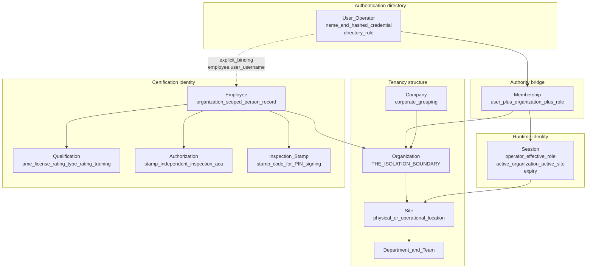
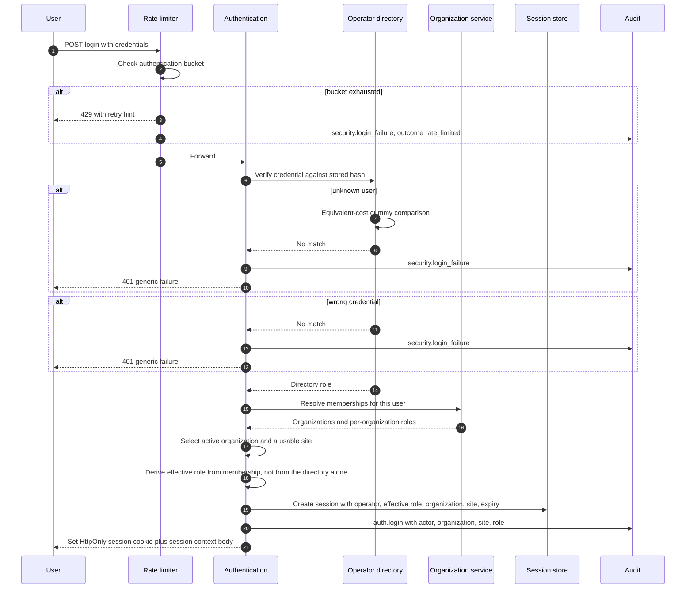
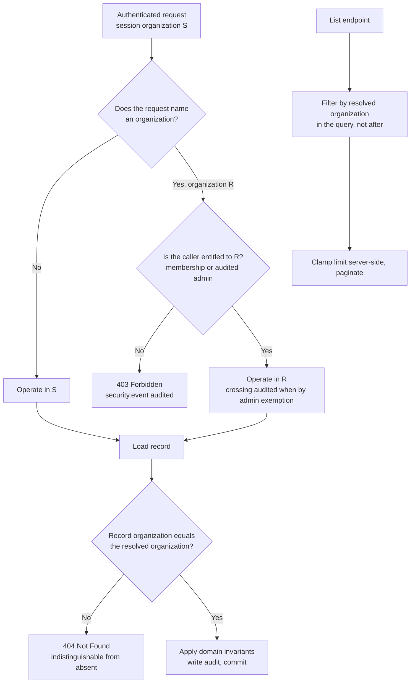
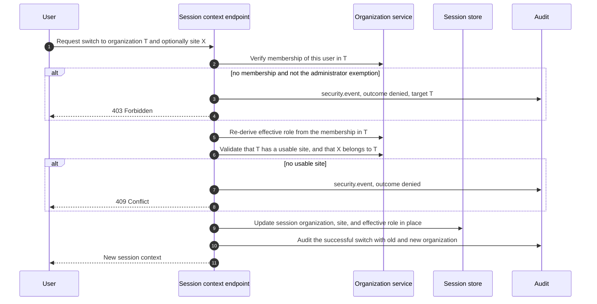
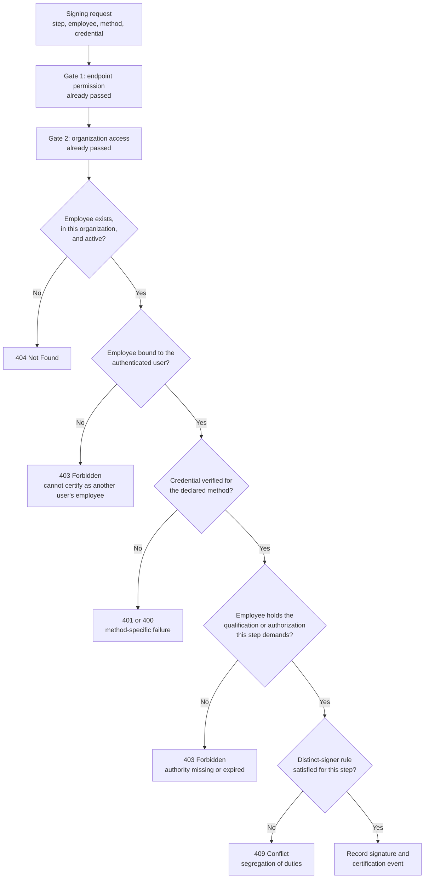
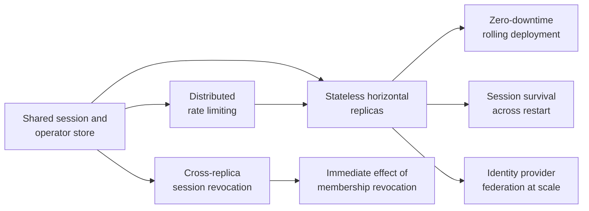

# Identity and Tenancy — Mercury Aviation Enterprise Operating System

| Field | Value |
|-------|-------|
| Document | Identity, authentication, session, and tenancy specification |
| Product | Mercury Aviation Enterprise Operating System (AEOS) |
| Organization | Mercury Technologies |
| Layer | Security — who the caller is, and which organization they are acting in |
| Audience | Security engineers, platform engineers, integrators, customer security teams, auditors |
| Status | Living baseline — changes to the identity model require an ADR |
| Companion documents | [RBAC](RBAC.md) · [Audit](Audit.md) · [Digital Signatures](Digital_Signatures.md) |
| Upstream authority | [SECURITY.md](../../SECURITY.md) · [Technical Architecture](../02_Architecture/Technical_Architecture.md) |

---

## 1. Scope

### 1.1 In scope

This document specifies **identity** in Mercury: how a caller proves who they are, what a session carries, how organization membership converts a login into an effective authority, how context switching is verified, and how identity binds to the **employee** record that certification and signature authority actually attach to.

It covers four distinct subjects that are routinely and dangerously conflated:

| Subject | Question it answers | Where it lives |
|---------|--------------------|----------------|
| **Authentication** | Who is calling? | Operator directory, session cookie |
| **Tenancy** | Which organization is this call acting in? | Membership plus session context |
| **Authorization** | May this caller perform this action? | [RBAC](RBAC.md) |
| **Certification identity** | May this human sign as this named employee? | Employee-to-user binding, [Digital Signatures](Digital_Signatures.md) |

The fourth is the one most often assumed to follow from the first. **It does not.** A caller with every permission in the platform still cannot sign as an employee they are not bound to. That separation is the subject of §7.

### 1.2 Out of scope

| Concern | Authoritative location |
|---------|------------------------|
| Permission catalogue, roles, personas, segregation of duties | [RBAC](RBAC.md) |
| Audit record schema, retention, fail-closed policy | [Audit](Audit.md) |
| Signature construction, methods, and cryptographic limits | [Digital Signatures](Digital_Signatures.md) |
| Threat model, disclosure policy, non-claims | [SECURITY.md](../../SECURITY.md) |
| Layering, middleware order, transaction boundaries | [Technical Architecture](../02_Architecture/Technical_Architecture.md) |
| Organization, site, and membership column definitions | [Data Model](../04_Data/Data_Model.md) |
| Identity edges in the traceability graph | [Digital Thread](../04_Data/Digital_Thread.md) |

### 1.3 Honesty markers

These markers are used throughout and mean exactly the same thing they mean in [Technical Architecture §1.3](../02_Architecture/Technical_Architecture.md#13-honesty-markers).

| Marker | Meaning |
|--------|---------|
| **Current** | In the runtime, exercised by tests |
| **Partial** | Present for a subset of the described scope |
| **Planned** | Designed here, not built |
| **Debt** | A known deviation from the target, tracked deliberately |

---

## 2. Design principles

| # | Principle | Consequence |
|---|-----------|-------------|
| 1 | **Identity is not authority.** | Authenticating establishes only who is calling. Every capability is a separate grant, resolved per organization. |
| 2 | **Authority is organization-scoped, never global.** | The same person may be an Operator in one organization and a Viewer in another. There is no platform-wide role except the audited administrator exemption. |
| 3 | **Membership is the only door.** | A user reaches an organization's data through a membership record or not at all. There is no implicit access because two organizations share a deployment. |
| 4 | **The session is a derived artefact, not a source of truth.** | Role and organization in a session are *derived* from membership at issue and re-derived on context switch. A session is never allowed to outlive the membership that justified it beyond its expiry. |
| 5 | **The server decides, always.** | The frontend hides what a user cannot do as a courtesy. Every restriction is enforced server-side, and no client-supplied organization identifier is trusted without verification. |
| 6 | **Employee identity is separate from user identity.** | Users log in; employees sign. The binding between them is explicit, verified at signing time, and cannot be inferred. |
| 7 | **Absence must not be informative.** | A record in another organization returns `404`, indistinguishable from a record that does not exist, so identifiers cannot be probed across tenants. |
| 8 | **Insecure configuration refuses to start.** | Production and HTTPS deployments will not boot without explicitly configured secrets. A weak default is a vulnerability, not a convenience. |
| 9 | **Every identity event is an audit event.** | Login, logout, failure, user creation, password change, role change, and context switch — successful or denied — are audited. See [Audit](Audit.md). |
| 10 | **State what is not built.** | Federation, single sign-on, and multi-factor authentication are **Planned**. They are never implied to exist. |

---

## 3. The identity model

### 3.1 Entities and their relationships

The dotted edge is the most important line in the diagram. **The binding from a user to an employee is explicit and narrow**, and it is the only path by which a login becomes a legally attributable signature.

### 3.2 What each entity is for

| Entity | Purpose | Not for |
|--------|---------|---------|
| **User (operator)** | Authenticating a human or service to the platform | Carrying domain authority; that comes from membership |
| **Company** | Corporate grouping for reporting and commercial structure | Isolation — a company is not a security boundary |
| **Organization** | **The isolation boundary.** Every tenant-owned record is owned by exactly one | Convenience grouping |
| **Site** | Operational location within an organization; scopes audit and operational context | A second isolation boundary; sites within an organization are not mutually isolated |
| **Membership** | Binding a user to an organization with a role, producing effective authority | Storing capability detail; that is the permission catalogue |
| **Session** | Carrying the resolved identity, effective role, active organization, active site, and expiry for the life of a request | Long-term storage of authority |
| **Employee** | The organization-scoped person record that qualifications, authorizations, and signatures attach to | Logging in |

### 3.3 Organization is the boundary; site is a scope

This distinction is load-bearing and is stated because getting it wrong is a plausible and serious mistake:

- **Organization** is a security boundary. Crossing it requires membership or the audited administrator exemption.
- **Site** is an operational scope. It narrows what a user sees and what audit records they read by default, and audit queries are filtered by organization **and** site. It is *not* a defence against a member of the same organization.

If a customer requires hard isolation between two locations, those locations must be modelled as **separate organizations**, not as two sites of one organization. Documenting this prevents a deployment decision that quietly produces less isolation than the customer expects.

---

## 4. Authentication

### 4.1 Current mechanism

**Status: Current, with named debt.**

| Aspect | Implementation |
|--------|---------------|
| Mechanism | Username and password against an operator directory, establishing a server-side session |
| Credential storage | **Argon2id** with a unique per-credential salt (OWASP-parameter defaults). New hashes are never SHA-256. Legacy SHA-256(pepper + password) hashes are verified once, then transparently rehashed to Argon2id at login. Never reversible, never logged, never returned in a response or snapshot. Production refuses the development pepper (`mercury-dev-pepper`) as `COOKIE_SECRET` / `JWT_SECRET`. |
| Password policy | Minimum length enforced, and an explicit deny-list rejects well-known weak values including the demonstration credential |
| Username policy | Constrained by a strict character pattern, so an operator name cannot carry separators or control characters that could confuse a downstream consumer |
| User enumeration | An authentication attempt against an unknown user performs an equivalent-cost comparison against a dummy hash, so response timing does not distinguish "no such user" from "wrong password" |
| Failure response | Generic. The response body does not state whether the user exists |
| Rate limiting | A dedicated authentication bucket, separate from the general API budget, returning `429` with a retry hint |
| Audit | Success writes `auth.login`; failure writes `security.login_failure`; logout writes `auth.logout` |
| Metrics | Login success and failure counters, rate-limit blocks, and active session count are exposed for alerting |

### 4.2 The session cookie

| Property | Value |
|----------|-------|
| Transport | Cookie, named by configuration |
| `HttpOnly` | **Always.** Script cannot read the session, which removes the most common cross-site scripting escalation path |
| `SameSite` | Configurable, defaulting to `Lax`; `Strict` and `None` are accepted, and an invalid value falls back to `Lax` rather than to something permissive |
| `Secure` | **Forced on** in production and HTTPS configurations. A production configuration that would emit a non-secure auth cookie is refused at startup |
| Lifetime | A configured time-to-live, applied to both the cookie `Max-Age` and the server-side session expiry, so the two cannot drift |
| Invalidation | Logout deletes the cookie with matching attributes and removes the server-side session, so a stolen cookie value is useless after logout |
| Content | An opaque session identifier. No role, organization, or permission is encoded in the cookie, so a client cannot tamper its way into authority |

**The last row matters more than it looks.** Because the cookie is an opaque handle rather than a self-describing token, privilege is resolved server-side on every request from state the client cannot reach. There is no signature to verify, and therefore no signature-verification bug to have.

### 4.3 Login and context establishment

### 4.4 Every request thereafter

| Step | Control |
|------|---------|
| 1 | Rate-limit bucket evaluated before any work is done |
| 2 | Request identifier and correlation identifier bound, and the user bound to the logging context |
| 3 | Session cookie resolved to a server-side session; a missing, unknown, or expired session yields `401` |
| 4 | **Gate 1** — the endpoint's declared permissions are checked against the session's effective role |
| 5 | **Gate 2** — the service resolves the effective organization and asserts access before any read or write |
| 6 | Domain invariants apply, including the certification checks of §7 where the call signs something |
| 7 | Audit written; mutating authenticated calls also produce an `api.access` record |

Gates 1 and 2 are independent and both mandatory. A permission grant is not organization access, and organization membership is not a permission. See [Technical Architecture §4.1](../02_Architecture/Technical_Architecture.md#41-the-two-independent-gates).

### 4.5 Honest limitations of the current authentication model

| Limitation | Marker | Consequence | Path forward |
|------------|--------|-------------|--------------|
| The operator directory role cache is process-local; durable credentials live on `org_users` | **Mitigated** | Passwords and platform roles persist in SQL; the in-memory map is a role cache hydrated at startup | Keep hydrating from `org_users`; shared session store remains the scaling path |
| Sessions default to process memory; Redis when `REDIS_URL` is set | **Mitigated / residual** | Without Redis, restart logs everyone out; multi-worker needs Redis | Set `REDIS_URL` / `REDIS_REQUIRED=true` in production Compose |
| Credential hashing uses Argon2id with per-credential salt and login-time upgrade from legacy SHA-256 | **Delivered** | Offline brute force resistance matches memory-hard baselines; legacy hashes upgrade transparently | Retire legacy SHA-256 verify path after a migration window |
| No multi-factor authentication | **Planned** | A stolen password is sufficient to authenticate | Delivered with identity provider federation |
| No identity provider federation or single sign-on | **Planned** | Customer joiner-mover-leaver processes are not centrally enforced; deprovisioning is a manual platform action | Federation with claim-to-membership translation |
| Machine API keys are optional when `MERCURY_API_KEY` is set | **Mitigated / residual** | Session cookies remain the browser path; scoped service principals are still roadmap | Expand to per-principal keys with independent audit identity |
| Rate limiting is per process unless shared infrastructure is added | **Debt** | Limits are per replica rather than per platform once replicas exist | Distributed rate limiting, which follows from a shared store |

None of these limitations is disguised elsewhere in Mercury documentation. They are also listed in [SECURITY.md §8](../../SECURITY.md#8-what-mercury-does-not-claim).

---

## 5. Tenancy enforcement

### 5.1 Resolve, then assert

Every tenant-aware service exposes the same two members, and they are the backbone of multi-tenancy:

| Member | Contract |
|--------|----------|
| `resolve_org_id(...)` | Determines the organization this call operates in: the requested organization **when the caller is entitled to it**, otherwise the session's active organization. A client-supplied organization identifier is never trusted without verification. |
| `assert_org_access(...)` | Raises a forbidden error unless the caller holds access to the resolved organization. Called **before** any read or write against tenant data. |

The pattern is deliberately duplicated per module rather than centralized into a single middleware. The reason is that a middleware cannot know which organization a domain operation is *about* — that requires loading the record. Enforcing in the service, after the record is loaded and before it is acted on, is the only placement that is correct for every operation shape.

### 5.2 Enforcement points

### 5.3 Why another organization's record returns 404

Returning `403` for a record that exists in another organization would confirm that the identifier exists somewhere on the platform. For a competitor sharing a deployment, that is a usable signal: work package numbering, fleet size, and activity levels can be inferred from which identifiers produce which status codes. Returning `404` closes the channel. The cost is a marginally less helpful error for a legitimate user who mistyped an identifier, and that is the correct trade.

### 5.4 Listing is filtered, not merely checked

A detail endpoint that checks ownership after loading is correct. A **list** endpoint that loads broadly and then filters in application code is a leak waiting for a pagination bug. Mercury's rule is that the organization filter is part of the **query**, and list limits are clamped server-side rather than trusted from the client.

### 5.5 The administrator exemption

One exemption exists, and it is deliberately narrow and noisy:

| Property | Rule |
|----------|------|
| Who | The platform administrator role only |
| What | May resolve to an organization without a membership record |
| Cost | Every crossing writes an audit record naming the actor, the target organization, and the action |
| Safety rail | Removal of the last administrator is refused, so a deployment cannot be locked out of its own administration |
| Not permitted | The exemption does **not** extend to signing. An administrator cannot sign as an employee they are not bound to — see §7.4 |

An exemption without an audit trail is a backdoor. This one is auditable by construction.

---

## 6. Session context and switching

### 6.1 What a session carries

| Field | Source | Why it is in the session |
|-------|--------|--------------------------|
| Operator identity | Authentication | The actor for every audit record |
| Effective role | Membership in the **active organization** | Authority is organization-scoped; the directory role alone is insufficient |
| Active organization | Selected at login, changed by an explicit switch | The tenancy scope for every query |
| Active site | Validated as usable within the active organization | Operational scope and audit filtering |
| Expiry | Configured time-to-live | Bounds the value of a stolen session |

### 6.2 Switching context

A context switch is a **privilege re-derivation**, not a preference change, and it is treated with the same suspicion as a login.

### 6.3 Rules that make switching safe

| # | Rule | Reason |
|---|------|--------|
| 1 | Membership is re-verified on every switch | A membership revoked after login must not remain usable by switching back and forth |
| 2 | The effective role is **re-derived**, never carried over | Otherwise an Operator in organization A would arrive as an Operator in organization B, where they may only be a Viewer |
| 3 | The target site is validated as belonging to the target organization | Prevents an organization-and-site pair that no query would ever satisfy, and prevents a site identifier from acting as a smuggled scope |
| 4 | Both success and denial are audited | A pattern of denied switches is a reconnaissance signal, and is exactly what a reviewer should be able to find |
| 5 | The session identifier is reused; authority is replaced | The switch is not a new authentication, and must not be presented as one |

### 6.4 Session lifecycle debt

Sessions live in process memory. The honest consequences, restated because they affect operators directly:

- A deployment or crash **logs every user out**. During a maintenance input, that is an operational cost, not merely an inconvenience.
- The platform cannot run more than one application instance without session affinity, so there is no zero-downtime deployment today.
- Session revocation across replicas is not a solved problem because there is only one replica.

This is tracked as the first item in the security roadmap in [SECURITY.md §9](../../SECURITY.md#9-security-roadmap) and as the binding constraint in [Technical Architecture §15.1](../02_Architecture/Technical_Architecture.md#151-the-binding-constraint).

---

## 7. Certification identity — the separation that must not collapse

### 7.1 Two different subjects

| Subject | Established by | Used for |
|---------|---------------|----------|
| **User** | Authentication | Calling the API; permission checks |
| **Employee** | An organization-scoped person record with qualifications and authorizations | Signing; legal attribution of maintenance actions |

A permission such as `certification.sign` says the caller may *attempt* a signing operation. It says nothing about **whose name** appears on the signature. That is decided by the employee record, and the platform will not let a user put a name on a signature that is not theirs.

### 7.2 The binding

The binding is a single explicit field on the employee record naming the user account that employee is allowed to act as. It is not inferred from name similarity, email, or department. **If the binding is absent, the employee cannot be signed as** — an unbound employee record is a personnel record, not a signing identity.

### 7.3 The certification identity gate

For signing operations only, a **third gate** applies, entirely independent of the endpoint permission and organization access gates:

| Check | What it verifies | Failure |
|-------|-----------------|---------|
| Employee validity | The employee exists, belongs to the task's organization, and is active | `404` |
| Signer binding | The employee is bound to the authenticated user | `403` |
| Credential verification | A credential appropriate to the declared method was presented and verified — a password against the operator directory, a PIN against the employee's active inspection stamps using a constant-time comparison | `401` or `400` |
| Step authority | The employee holds an **active, unexpired** qualification or authorization for the step: a maintenance qualification to perform, an inspector qualification or stamp to inspect, an independent-inspection authorization for a second inspection, an ACA authorization to certify or release | `403` |
| Distinct signer | The employee has not already signed a step that must be signed by someone else | `409` |

Expiry is evaluated at signing time against the moment of signing. A qualification that lapsed yesterday does not sign today, regardless of what a cached list shows.

### 7.4 The administrator override — stated, not hidden

There is one narrow deviation in the current runtime. Where an employee record has **no** user binding, an administrator may still sign as that employee, and where a binding exists to a different user, an administrator is not blocked by the binding check.

| Aspect | Position |
|--------|----------|
| Why it exists | Practical bootstrapping and correction of records during onboarding, where employee-to-user bindings are incomplete |
| Marker | **Debt** |
| Risk | It weakens non-repudiation for administrator-performed signatures specifically. An administrator signature is attributable to the administrator's user account in the audit trail and in the signature's own username field, but the *employee* name on the signature was not independently proven to belong to that user |
| Mitigation today | Administrator actions are audited; the signature record retains the acting username alongside the employee identity, so the substitution is visible rather than silent |
| Intended resolution | Require an explicit, separately audited "sign on behalf of" flow with a documented reason, or remove the override entirely once employee-to-user binding is enforced at onboarding. Tracked with the runtime persona enforcement work |

Documenting this is the point. An auditor who discovers it in the code and not in the specification would be right to distrust the rest of the specification.

### 7.5 Identity fields captured on evidence

Every signature and every technical logbook entry carries identity so that attribution survives without needing a live session:

| Field | Meaning |
|-------|---------|
| Signer employee identifier | The named person whose authority was exercised |
| Signer username | The authenticated account that performed the act |
| Organization | The tenant the act belongs to |
| Method and attestation flags | How the signer was verified |
| Timestamp | When, in UTC |

The logbook entry additionally records the performing mechanic, inspector, independent inspector where required, and ACA holder as **separate identity fields**, so segregation of duties is provable from the evidence record alone. See [Digital Signatures §7](Digital_Signatures.md#7-publication-revision-binding) and [Technical Architecture §5.5](../02_Architecture/Technical_Architecture.md#55-the-logbook-entry).

---

## 8. Non-functional requirements

### 8.1 Reading the targets

**Current baseline** is what the runtime demonstrably does. **Aspirational enterprise target** is a directional target for sizing and planning, not a service-level agreement. The same convention is used in [Technical Architecture §13](../02_Architecture/Technical_Architecture.md#13-non-functional-requirements).

### 8.2 Availability and correctness

| Concern | Current baseline | Aspirational enterprise target |
|---------|-----------------|-------------------------------|
| Authentication availability | Bound to the single application process | 99.95 percent monthly for the authentication path |
| Session survival across deployment | **None** — in-memory sessions are lost on restart | Sessions survive rolling deployment and replica loss |
| Session revocation propagation | Immediate, because there is one process | Under 5 seconds across all replicas |
| Membership change effect | Applies at next context switch or next login; within the session, the derived role persists until expiry | Applies within 60 seconds without requiring the user to act |
| Identity provider outage behaviour | Not applicable — no federation | Documented degraded mode with a bounded local grace period, never an open door |

The **membership change** row is a real gap worth naming: revoking a membership does not currently invalidate an active session in that organization until it expires. The session time-to-live is therefore also a security parameter, not only a usability one, and operators should set it accordingly.

### 8.3 Performance

| Concern | Current baseline | Aspirational enterprise target |
|---------|-----------------|-------------------------------|
| Credential verification | Argon2id verify (memory-hard; parameters via `MERCURY_ARGON2_*`) | Keep OWASP defaults in production; tune only under load evidence |
| Session resolution per request | In-memory lookup, effectively free | 95th percentile under 5 ms against a shared store |
| Permission check | Set membership test against the role's granted set | Unchanged |
| Context switch | Membership verification, role re-derivation, site validation, audit write | 95th percentile under 200 ms |
| Concurrent authenticated sessions | Single worker | 500 per tenant, 10,000 per deployment |
| Certification identity gate | Employee load, qualification and authorization evaluation, prior-event scan | 95th percentile under 150 ms, inside the signing transaction |

### 8.4 Durability

| Concern | Current baseline | Aspirational enterprise target |
|---------|-----------------|-------------------------------|
| Organizations, sites, memberships, employees, qualifications, authorizations | Durable in PostgreSQL | Managed service with point-in-time recovery |
| Runtime-created users | Durable on `org_users` (password Argon2id); role cache hydrated at startup | Change history / federation still Planned |
| Sessions | Lost on restart without Redis; Redis TTL sessions when configured; password reset revokes operator sessions | Explicit per-session revocation UI still Planned |
| Identity audit records — login, logout, failure, role change, context switch | Durable, retained per the configured retention window | Immutable archive for the authority-required period |

### 8.5 Compliance-relevant identity requirements

| Requirement | Position |
|-------------|----------|
| Every maintenance action is attributable to a named, qualified individual | **Current** — enforced by the certification identity gate |
| Authority is verified at the time of the act, not at the time of assignment | **Current** — qualification and authorization expiry is evaluated at signing |
| The performing and inspecting individuals are distinct and separately recorded | **Current** — enforced and persisted as separate fields |
| Personnel authority changes are traceable | **Partial** — role changes are audited; a full authority-history projection is **Planned** |
| Access to personal data is permission-gated and audited | **Current** |
| Personnel deprovisioning is centrally enforced | **Planned** — requires federation |

---

## 9. Security considerations

**The cookie is opaque, and that removes a whole class of bug.** Because no authority is encoded client-side, there is no token to forge, no algorithm-confusion attack, and no stale-claim problem within a request. Authority is resolved server-side from state the client cannot reach. Any future move to a self-describing token must re-answer all three questions rather than assume a library handles them.

**Two gates always, three when signing.** Endpoint permission and organization access are independent and both mandatory. Signing adds employee validity, signer binding, credential verification, step authority, and the distinct-signer rule. No gate substitutes for another, and cross-module calls carry the caller's username and session role so the peer service re-asserts rather than trusting its caller.

**Cross-tenant identifiers are not probeable.** Another organization's record is `404`. This is an information-disclosure control, not an error-handling preference, and changing it is a security change requiring an ADR.

**Enumeration is closed on the authentication path too.** Unknown users cost the same as wrong passwords, and failure responses do not distinguish them. Rate limiting is separate from the general API budget so that credential stuffing cannot be hidden inside normal traffic volume.

**Session fixation is addressed by construction.** A session identifier is issued by the server on successful authentication and never accepted from the client as a proposal. Logout removes both the server-side session and the cookie, using matching attributes so the deletion actually applies.

**Cross-site request forgery is mitigated by `SameSite` plus same-origin deployment.** The production topology serves the frontend and proxies the API on one origin, so the cookie is never sent cross-site in normal operation, and `SameSite` restricts it if attempted. Operators who deliberately configure `SameSite=None` for a cross-origin integration are weakening this control and should record the decision.

**Secrets never appear in identity surfaces.** Passwords are hashed. Signing credentials are verified and discarded. The directory snapshot deliberately excludes credential hashes. Audit detail fields carry business context, never authentication material.

**The administrator exemption is auditable, and the signing override is named.** Cross-organization access by an administrator writes an audit record. The signing override in §7.4 is the one place where identity separation is weaker than the design intends, and it is stated rather than buried.

**Membership revocation is not immediate.** Until a shared session store with revocation exists, an active session outlives a revoked membership until expiry. Operators with strict deprovisioning requirements must set a short session time-to-live and understand that platform-level user removal, not membership removal alone, is the immediate control.

**Site is not an isolation boundary.** Restated because a deployment decision depends on it: hard separation requires separate organizations.

**Known identity security debt**, tracked openly: sessions without Redis remain process-local, legacy SHA-256 verify path retained only for upgrade, no multi-factor authentication, no federation, service-principal model incomplete, per-process rate limiting, delayed membership-revocation effect (except password reset which revokes operator sessions), and the administrator signing override.

---

## 10. Scalability

### 10.1 The binding constraint is an identity problem

The platform's inability to scale horizontally is, at root, an **identity state** problem. Sessions without Redis, rate-limit counters, and WebSocket registrations remain process-local. Approvals are durable SQL (`approval_requests`). Every other scaling improvement is downstream of externalizing the remaining in-process identity state.

### 10.2 Scaling levers in dependency order

| # | Lever | Unlocks | Cost |
|---|-------|---------|------|
| 1 | Persisted user store | Durable runtime user management; prerequisite for everything else | A schema and a migration |
| 2 | Shared session store | Stateless replicas, session survival, cross-replica revocation | A new low-latency infrastructure dependency |
| 3 | Distributed rate limiting | Accurate authentication limits at any replica count | Follows from item 2 |
| 4 | Horizontal replicas | Concurrency, availability, zero-downtime deployment | Load balancing and health checking, both already present |
| 5 | Membership and permission resolution cache with explicit invalidation | Removes a per-request membership read at high concurrency | Invalidation correctness — a cache that outlives a revocation is a vulnerability, so short bounded lifetimes only |
| 6 | Federation with claim-to-membership translation | Enterprise single sign-on and centralized deprovisioning | An identity translation layer, and a decision about which claims Mercury trusts |
| 7 | Scoped service principals | Machine integrations with their own credentials, permissions, and audit identity | A principal model distinct from human users |

### 10.3 What must survive any identity scaling change

- Organization isolation on every call, on every replica.
- Effective role derived from **membership in the active organization**, never from a directory role alone.
- The certification identity gate, in full, including expiry evaluated at the moment of signing.
- Distinct-signer enforcement, which depends on a consistent view of prior certification events — this is why signing takes a row lock and why that lock is a security control, not a performance detail.
- A complete identity audit trail, with no gap introduced by asynchrony.

### 10.4 Federation without surrendering certification authority

The intended federation model is deliberately asymmetric, and this is a design position rather than a limitation:

| Concern | Owner after federation |
|---------|------------------------|
| Proving who the human is | The customer's identity provider |
| Which organizations they belong to and with what role | **Mercury**, from membership records — optionally provisioned from provider claims, never trusted directly per-request |
| Whether they may sign as a named employee | **Mercury**, from the employee binding, qualifications, and authorizations |

Mercury will accept an external assertion of **identity**. It will not accept an external assertion of **certification authority**, because the qualification and authorization state that authority depends on is aviation-domain state that Mercury holds and audits. Delegating that would move the airworthiness authority decision outside the system of record.

---

## 11. Future enhancements

| # | Enhancement | Value | Depends on |
|---|-------------|-------|------------|
| 1 | User change history and soft-delete for directory identities | Auditable joiner-mover-leaver beyond current durable `org_users` rows | Schema and migration |
| 2 | Retire legacy SHA-256 password verify after migration window | Remove dual-path verify once all hashes are Argon2id | Item 1 / operational rehash |
| 3 | Shared session store with explicit per-session revocation UI | Session survival, stateless replicas, operator-visible revocation (password reset already revokes) | Shared low-latency store (Redis path exists) |
| 4 | Distributed rate limiting | Accurate limits across replicas | Item 3 |
| 5 | Multi-factor authentication, mandatory for signing-capable personas | Raises the cost of a stolen password from trivial to substantial | Items 1 and 3 |
| 6 | Identity provider federation with single sign-on | Enterprise authentication and centralized deprovisioning | Items 3 and 5, plus a claim-translation layer |
| 7 | Scoped service principals replacing session reuse for integrations | Machine access with its own credential, permission set, and audit identity | Item 1 |
| 8 | Step-up authentication for release actions | Re-proving identity at the highest-consequence moment, not only at login | Item 5 |
| 9 | Enforced employee-to-user binding at onboarding, removing the administrator signing override | Closes the non-repudiation gap in §7.4 | Personnel onboarding workflow |
| 10 | Explicit, separately audited sign-on-behalf-of flow with mandatory reason | Makes the rare legitimate case visible instead of implicit | Item 9 |
| 11 | Immediate membership-revocation propagation to active sessions | Deprovisioning takes effect in seconds rather than at expiry | Item 3 |
| 12 | Personnel authority history projection | Answers "what authority did this person hold on the date of this signature" without reconstruction | Audit and personnel projections |
| 13 | Personas as enforced principals | Aviation job roles become real authorization subjects rather than recommended profiles | Permission model extension — see [RBAC](RBAC.md) |
| 14 | Cross-organization delegated access grants — lessor, MRO, authority oversight | Makes legitimate cross-tenant access explicit, scoped, time-boxed, and audited instead of an administrator action | Grant model and audit extension |
| 15 | Field-level encryption for personal identity data | Reduces exposure of personnel data if the database is compromised | Key management |
| 16 | Session and device inventory visible to the user and to security reviewers | Lets a real person notice a session they did not start | Item 3 |

---

## 12. Related documents

**Within the security set**
[RBAC](RBAC.md) · [Audit](Audit.md) · [Digital Signatures](Digital_Signatures.md) · [SECURITY.md](../../SECURITY.md)

**Architecture**
[Technical Architecture](../02_Architecture/Technical_Architecture.md) · [Enterprise Architecture](../02_Architecture/Enterprise_Architecture.md) · [Domain Architecture](../02_Architecture/Domain_Architecture.md) · [System Context](../02_Architecture/System_Context.md)

**Data and digital thread**
[Digital Thread](../04_Data/Digital_Thread.md) · [Data Model](../04_Data/Data_Model.md) · [Master Data](../04_Data/Master_Data.md)

**AI and twin**
[AI Strategy](../07_AI/AI_Strategy.md) · [Knowledge Graph](../07_AI/Knowledge_Graph.md) · [Digital Twin](../07_AI/Digital_Twin.md)

**Governance**
[README](../../README.md) · [ROADMAP](../../ROADMAP.md) · [CONTRIBUTING](../../CONTRIBUTING.md) · [CODE_OF_CONDUCT](../../CODE_OF_CONDUCT.md) · [ADR register](../08_Standards/ADR/)

---

*Mercury Technologies — One Digital Thread. One Digital Aircraft Passport. One Aviation Enterprise Operating System.*
