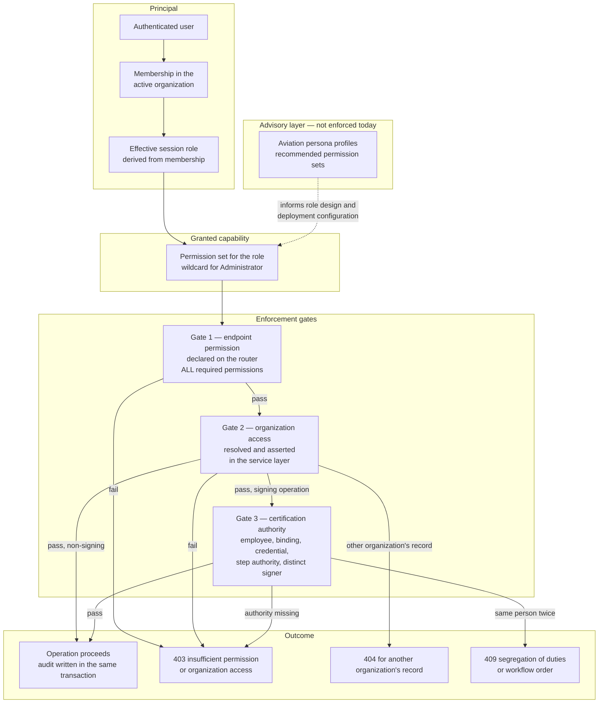
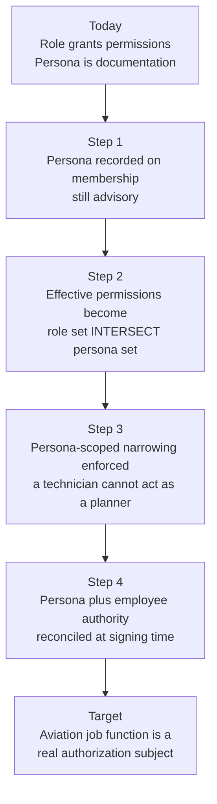
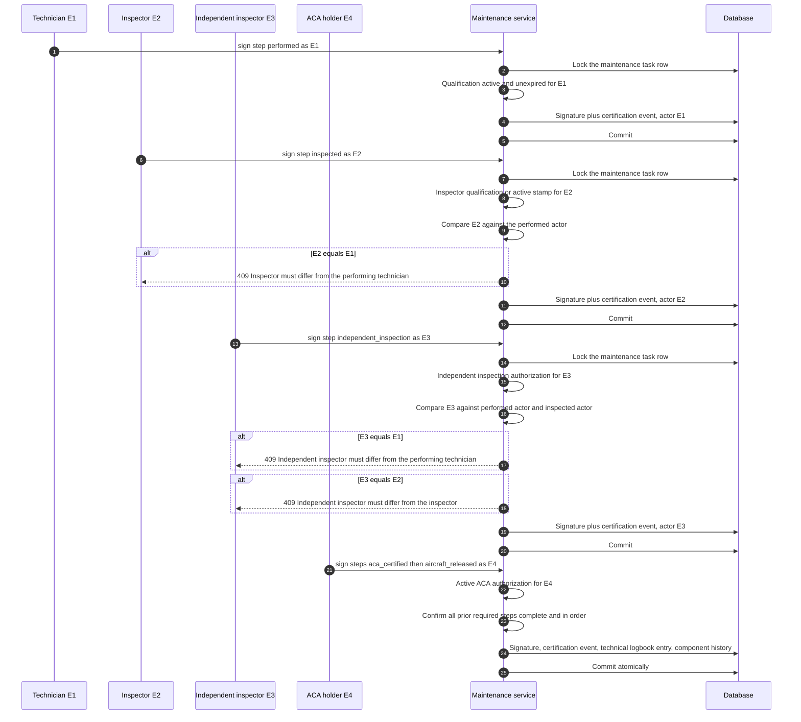
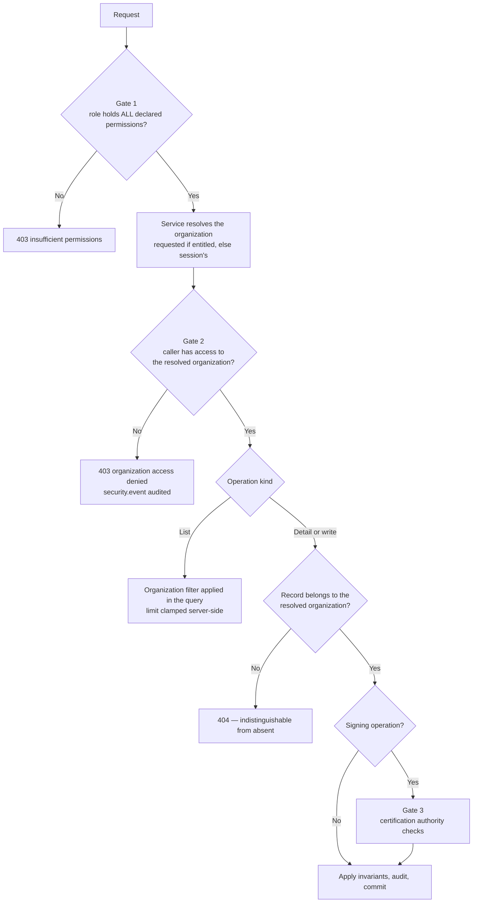

# Role-Based Access Control — Mercury Aviation Enterprise Operating System

| Field | Value |
|-------|-------|
| Document | Roles, personas, permission catalogue, segregation of duties, organization isolation |
| Product | Mercury Aviation Enterprise Operating System (AEOS) |
| Organization | Mercury Technologies |
| Layer | Security — what an authenticated caller is permitted to do |
| Audience | Security engineers, developers, implementation consultants, auditors, quality managers |
| Status | Living baseline — changes to the permission model require an ADR |
| Companion documents | [Identity](Identity.md) · [Audit](Audit.md) · [Digital Signatures](Digital_Signatures.md) |
| Upstream authority | [SECURITY.md](../../SECURITY.md) · [Technical Architecture](../02_Architecture/Technical_Architecture.md) |

---

## 1. Scope

### 1.1 In scope

This document specifies **authorization** in Mercury: the four session roles, the aviation persona profiles, the naming and grouping pattern of the permission catalogue, how permissions are declared and checked, how segregation of duties is enforced so that the person who performed work is never the person who inspected it, and how authorization composes with organization isolation.

It answers, precisely:

1. What roles exist and what each is genuinely for.
2. What the aviation personas are, what they map to, and — critically — **what they are not yet**.
3. How permissions are named, so a new capability is named consistently rather than inventively.
4. Which authority separations are structural invariants rather than configurable policy.
5. Where the current model is weaker than the target, and why.

### 1.2 Out of scope

| Concern | Authoritative location |
|---------|------------------------|
| Authentication, sessions, tenancy resolution, employee binding | [Identity](Identity.md) |
| Audit record schema, retention, fail-closed policy | [Audit](Audit.md) |
| Signature construction and cryptographic limits | [Digital Signatures](Digital_Signatures.md) |
| Threat model, disclosure policy, non-claims | [SECURITY.md](../../SECURITY.md) |
| Where checks sit in the layering, and the two-gate model | [Technical Architecture §4](../02_Architecture/Technical_Architecture.md#4-tenancy-and-authorization-enforcement) |
| Regulatory expectations on authority and independence | [Regulations documentation set](../09_Regulations/) |

### 1.3 Honesty markers

| Marker | Meaning |
|--------|---------|
| **Current** | In the runtime, exercised by tests |
| **Partial** | Present for a subset of the described scope |
| **Planned** | Designed here, not built |
| **Debt** | A known deviation from the target, tracked deliberately |

---

## 2. Design principles

| # | Principle | Consequence |
|---|-----------|-------------|
| 1 | **Permissions, not job titles.** | Endpoints require named permissions such as `work_order.execute`. No endpoint asks "is this user an inspector?" — it asks whether the caller holds the permission the operation needs. |
| 2 | **Authorization is server-side and central.** | Checks resolve through one authorization module. Domain services do not implement local, divergent permission logic, so a security review reads one file to know the model. |
| 3 | **Deny by default.** | A capability that is not granted is denied. New capability ships closed, and a new permission must be added to a role deliberately. |
| 4 | **Conjunctive requirements.** | When an endpoint declares several permissions, the caller must hold **all** of them. There is no implicit "any of" semantics, because an accidental disjunction is a silent privilege grant. |
| 5 | **Authorization never substitutes for isolation.** | Holding `fleet.manage` says nothing about *whose* fleet. Organization access is a separate, always-evaluated gate. |
| 6 | **Segregation of duties is an invariant, not a setting.** | Performed ≠ inspected is enforced in code and cannot be configured away by a customer, a role grant, or an administrator. |
| 7 | **Signing authority is not a permission.** | Permissions gate the *attempt*; qualifications and authorizations on the employee record gate the *act*. See [Identity §7](Identity.md#7-certification-identity--the-separation-that-must-not-collapse). |
| 8 | **The UI is not a control.** | Hiding a button is courtesy. Every restriction is enforced at the API. |
| 9 | **Administrative wildcard is audited, not silent.** | The administrator role holds a wildcard. Its cost is that its actions, especially cross-organization ones, are audited. |
| 10 | **State what is enforced and what is advisory.** | Roles are enforced. Personas are, today, a documented mapping. That distinction is stated everywhere personas appear. |

---

## 3. The authorization model in one picture

The dotted line is deliberate. Personas shape how roles are designed and how a deployment is configured; they are **not** a runtime principal today.

---

## 4. Session roles

### 4.1 The four roles

Four roles carry permission sets. The role that applies is the **effective role derived from membership in the active organization**, never the login directory role alone — so the same person can be an Operator in one organization and a Viewer in another.

| Role | Character | Signing capability | Cross-organization |
|------|-----------|--------------------|--------------------|
| **Administrator** | Wildcard. Platform and tenant administration, user and membership management, configuration | Holds every permission, but still subject to Gate 3 | **Yes**, by audited exemption |
| **Operator** | The working role. Creates and manages across fleet, components, publications, personnel, maintenance, work orders, planning, and logistics. Executes work and signs certification steps | `certification.sign` — may sign, but **not** `certification.release` | No |
| **Reviewer** | Oversight and acceptance. Reads broadly, approves, inspects, signs certification **and** release steps, and reads the audit trail | `certification.sign` **and** `certification.release` | No |
| **Viewer** | Read-only across the domains. No write, no signing, no approval | None | No |

### 4.2 The deliberate asymmetry between Operator and Reviewer

This is the most important design decision in the role model, and it is easy to miss:

- **Operator** can sign, but cannot release. It is the execution role.
- **Reviewer** can sign **and** release, and can read the audit trail. It is the oversight role.

Release — returning an aircraft to service — is therefore not reachable by the role that performs the work. That is segregation of duties expressed at the role level, reinforcing the employee-level enforcement in §7. A deployment that grants Operator role to everyone including inspectors has weakened this, which is why role assignment is an operator responsibility documented in [SECURITY.md §10](../../SECURITY.md#10-customer-and-operator-responsibilities).

Note also that Reviewer holds `work_order.execute` and `inspector.approve` but **not** `work_order.manage`: a reviewer can act on the execution path to inspect and approve, without being able to create or restructure the work they are reviewing.

### 4.3 What the roles are not

| Misreading | Correction |
|------------|------------|
| "Operator means a fleet operator company" | No. `Operator` here is a **session role name**, unrelated to the aviation sense of "operator" as an airline. The naming collision is unfortunate and is why aviation job function is expressed through personas, not roles |
| "Administrator can do anything" | Administrator holds every *permission*. It cannot bypass the certification identity gate's qualification and authorization requirements, cannot re-release a released job card, cannot mutate a signature, and cannot delete an audit record |
| "Viewer is safe to hand out freely" | Viewer reads personnel records, publications, and maintenance history — commercially sensitive and personal data. Least privilege applies to read access too |
| "Reviewer is a lesser Operator" | Reviewer holds *more* authority on the release path and *less* on the creation path. Neither is a subset of the other |

---

## 5. Permission catalogue

### 5.1 The naming pattern

Every permission is `<subject>.<action>`, lower snake case on both sides.

| Element | Rule | Examples |
|---------|------|----------|
| **Subject** | The domain noun or capability family, singular, matching the module or the business concept it governs | `work_order`, `planning`, `logistics`, `certification`, `publication`, `component` |
| **Action** | The verb tier, drawn from a **closed set** wherever possible | `read`, `manage`, `execute`, `sign`, `release`, `create`, `update`, `review`, `ack` |
| Separator | A single dot. Never a colon, slash, or double dot | `logistics.stores` |
| Wildcard | `*` only, held only by the administrator role and the administrator persona. There is no `logistics.*` style partial wildcard | `*` |

### 5.2 The action tiers

Using a small closed set of actions is what makes the catalogue predictable. A developer adding a capability should almost always be choosing from this list rather than inventing a verb.

| Tier | Meaning | Grants |
|------|---------|--------|
| `read` | View records in the caller's organization | Never implies write |
| `manage` | Create, update, and soft-delete within the domain | Implies the write surface, **not** the execution or signing surface |
| `execute` | Act on the shop-floor lifecycle — accept, start, pause, complete, inspect-approve a job card | Distinct from `manage`, because scheduling work and doing work are different authorities |
| `sign` | Attempt a certification signature | Gate 3 still decides whose name may appear |
| `release` | Attempt a return-to-service release | The highest-consequence action in the platform |
| `review` / `approve` / `ack` | Oversight actions — approve a request, acknowledge an alert, review a decision | Deliberately separate from `manage` |
| Named sub-capabilities | A narrower slice of a domain where a real job function needs only that slice | `logistics.stores`, `logistics.purchase`, `logistics.tools`, `logistics.finance` |

### 5.3 The catalogue by family

The catalogue below is the current runtime set. It is a **pattern to extend**, not a fixed ceiling.

#### Organization, platform, and oversight

| Permission | Grants |
|------------|--------|
| `org.read` | Read organizations, sites, and structure the caller has membership for |
| `platform.read` | Read platform-level status surfaces |
| `dashboard.read` | Read aggregated dashboards |
| `reports.read` | Read reporting surfaces |
| `audit.read` | **Read the audit trail.** Held by Reviewer, and by the inspector and quality assurance personas — not by Operator |
| `config.change` is an audited **action**, not a permission — see [Audit §4](Audit.md#4-the-canonical-action-catalogue) | — |

#### Fleet, components, and configuration

| Permission | Grants |
|------------|--------|
| `fleet.read` / `fleet.manage` | Aircraft registry and fleet structure |
| `component.read` / `component.manage` | Serialized components, installation and removal, life counters |
| `configuration.read` / `configuration.manage` | Aircraft configuration and effective build state |

#### Publications and technical library

| Permission | Grants |
|------------|--------|
| `publication.read` | Read publications and their immutable revisions. Held by **every** persona without exception, because no maintenance action is legitimate without access to the instructions authorizing it |
| `publication.manage` | Create publications and issue revisions |

#### Personnel

| Permission | Grants |
|------------|--------|
| `personnel.read` / `personnel.manage` | Employees, qualifications, authorizations, and stamps. Personal data — permission-gated and audited |

#### Maintenance, tasks, and certification

| Permission | Grants |
|------------|--------|
| `maintenance.read` / `maintenance.manage` | Maintenance tasks and the maintenance engine |
| `task.read` / `task.manage` | Task-level read and management |
| `certification.sign` | Attempt any certification step signature |
| `certification.release` | Attempt the return-to-service release |
| `signature.create` | Create a signature record |
| `logbook.read` | Read the technical logbook |
| `inspector.approve` | Perform the inspection approval action |

#### Work orders and execution

| Permission | Grants |
|------------|--------|
| `work_order.read` | Read work packages, work orders, and job cards |
| `work_order.manage` | Create and restructure packages, orders, and job cards |
| `work_order.execute` | Act on the job card lifecycle on the shop floor |

#### Planning

| Permission | Grants |
|------------|--------|
| `planning.read` / `planning.manage` | Maintenance programmes, MPD, AD/SB/EO, MEL, forecast, checks, package generation |
| `planner.read` | Planner-oriented read surface |

#### Logistics and procurement

| Permission | Grants |
|------------|--------|
| `logistics.read` | Read parts, stock, balances, movements, tools, vendors, orders |
| `logistics.manage` | Manage logistics master data and operations |
| `logistics.stores` | Warehouse execution — receive, issue, transfer, adjust, scrap |
| `logistics.purchase` | Purchase requests, RFQs, quotes, purchase orders |
| `logistics.tools` | Tool control and calibration |
| `logistics.finance` | Cost and financial views of logistics |
| `store.read` | Stores-oriented read surface |

#### Engineering, quality, and reliability

| Permission | Grants |
|------------|--------|
| `engineering.read` | Engineering read surface |
| `qa.read` | Quality assurance read surface |

#### Operations, incidents, alerts, decisions, connectors

| Permission | Grants |
|------------|--------|
| `ops.read` / `ops.coordinate` | Operational coordination surfaces |
| `incident.read` / `incident.create` / `incident.update` / `incident.event` / `incident.evidence` | Incident lifecycle and evidence attachment |
| `alerts.read` / `alerts.ack` | Alert reading and acknowledgement |
| `approval.request` / `approval.review` | Approval workflow. **`request` and `review` are separate permissions held by different roles** — Operator requests, Reviewer reviews |
| `decisions.read` / `decisions.review` | Read and review **advisory** decision recommendations. See [AI Strategy](../07_AI/AI_Strategy.md) |
| `connectors.read` / `connectors.manage` | Integration connector status and configuration |

### 5.4 The role-to-permission matrix

`●` granted · `—` not granted · `*` wildcard

| Permission | Administrator | Operator | Reviewer | Viewer |
|------------|:---:|:---:|:---:|:---:|
| `org.read` | `*` | ● | ● | ● |
| `platform.read` | `*` | ● | ● | ● |
| `dashboard.read` | `*` | ● | ● | ● |
| `reports.read` | `*` | ● | ● | ● |
| `audit.read` | `*` | — | ● | — |
| `fleet.read` | `*` | ● | ● | ● |
| `fleet.manage` | `*` | ● | — | — |
| `component.read` | `*` | ● | ● | ● |
| `component.manage` | `*` | ● | — | — |
| `configuration.read` | `*` | ● | ● | ● |
| `configuration.manage` | `*` | ● | — | — |
| `publication.read` | `*` | ● | ● | ● |
| `publication.manage` | `*` | ● | — | — |
| `personnel.read` | `*` | ● | ● | ● |
| `personnel.manage` | `*` | ● | — | — |
| `maintenance.read` | `*` | ● | ● | ● |
| `maintenance.manage` | `*` | ● | — | — |
| `task.read` | `*` | ● | ● | ● |
| `task.manage` | `*` | ● | — | — |
| `certification.sign` | `*` | ● | ● | — |
| `certification.release` | `*` | **—** | ● | — |
| `signature.create` | `*` | ● | ● | — |
| `logbook.read` | `*` | ● | ● | ● |
| `inspector.approve` | `*` | — | ● | — |
| `work_order.read` | `*` | ● | ● | ● |
| `work_order.manage` | `*` | ● | — | — |
| `work_order.execute` | `*` | ● | ● | — |
| `planning.read` | `*` | ● | ● | ● |
| `planning.manage` | `*` | ● | — | — |
| `planner.read` | `*` | ● | — | ● |
| `logistics.read` | `*` | ● | ● | ● |
| `logistics.manage` | `*` | ● | — | — |
| `logistics.stores` | `*` | ● | — | — |
| `logistics.purchase` | `*` | ● | — | — |
| `logistics.tools` | `*` | ● | ● | — |
| `logistics.finance` | `*` | ● | — | — |
| `store.read` | `*` | ● | — | ● |
| `engineering.read` | `*` | — | ● | ● |
| `qa.read` | `*` | — | ● | — |
| `ops.read` | `*` | ● | — | — |
| `ops.coordinate` | `*` | ● | — | — |
| `incident.read` | `*` | ● | ● | ● |
| `incident.create` / `update` / `event` / `evidence` | `*` | ● | — | — |
| `alerts.read` | `*` | ● | ● | ● |
| `alerts.ack` | `*` | ● | ● | — |
| `approval.request` | `*` | ● | — | — |
| `approval.review` | `*` | **—** | ● | — |
| `decisions.read` | `*` | ● | ● | ● |
| `decisions.review` | `*` | ● | ● | — |
| `connectors.read` | `*` | ● | ● | ● |
| `connectors.manage` | `*` | ● | — | — |

The two bold cells are the model's segregation-of-duties spine at the role level: **Operator cannot release, and Operator cannot review its own approval requests.**

### 5.5 Declaring and checking a permission

| Step | Where | Rule |
|------|-------|------|
| Declare | Router, as a dependency on the endpoint | Permissions are declared next to the route so the contract is readable from the router alone |
| Resolve | Authorization module | The effective role's granted set is looked up; a wildcard short-circuits to allow |
| Check | Authorization module | **All** declared permissions must be present. Conjunctive, never disjunctive |
| Unknown role | Authorization module | An unparseable or absent role value resolves to **Viewer**, the least-privileged role. Failing closed on a malformed role is deliberate |
| Failure | Router | `403` with an insufficient-permission message that does not enumerate what was required |

### 5.6 Adding a permission — the checklist

1. Choose a subject that matches an existing domain noun. If none fits, the capability may belong in a new module — check [Domain Architecture](../02_Architecture/Domain_Architecture.md) first.
2. Choose an action from the closed set in §5.2. Inventing a verb requires justification in review.
3. Add the permission to the roles that need it. **Adding to Administrator is unnecessary** — the wildcard covers it.
4. Decide deliberately whether Reviewer gets it. Read and oversight, usually yes; creation and restructuring, usually no.
5. Add it to the persona profiles that correspond to real aviation job functions, so the advisory mapping stays truthful.
6. Declare it on the endpoint.
7. Write a **permission-boundary test** proving a role without it receives `403` — not only that a role with it succeeds.
8. Update this document's catalogue and matrix in the same change. A permission that exists in code but not here is a divergence, and divergence is what this blueprint exists to prevent.

---

## 6. Aviation personas

### 6.1 What a persona is, and what it is not

A **persona** is an aviation job function expressed as a recommended permission profile: technician, stores keeper, planner, inspector, ACA holder, engineer, reliability analyst, quality assurance, purchasing, finance, supervisor, manager, administrator.

| Question | Answer |
|----------|--------|
| Are personas a documented mapping? | **Yes — Current.** Defined in the runtime authorization module and queryable |
| Are personas enforced principals? | **No — Partial/Planned.** A session carries a role, not a persona. Endpoint checks resolve against the **role's** permission set |
| What are they used for today? | Designing role assignments, configuring deployments, driving UI presentation, and specifying the target model that enforcement will implement |
| Why document them so prominently then? | Because "Operator" and "Reviewer" are not how an aviation organization thinks. A hangar has technicians, inspectors, and ACA holders. The persona layer is how the platform speaks the customer's language, and it is the specification enforcement will be built against |

**This distinction is stated wherever personas appear**, including [Technical Architecture §4.2](../02_Architecture/Technical_Architecture.md#42-roles-and-permissions) and [SECURITY.md §5](../../SECURITY.md#5-authorization-and-role-based-access-control). Presenting personas as enforced today would be a false security claim.

### 6.2 Persona to permission profiles

| Persona | Recommended permissions | Nearest role today |
|---------|------------------------|--------------------|
| **technician** | `publication.read`, `fleet.read`, `component.read`, `configuration.read`, `task.read`, `task.manage`, `maintenance.read`, `maintenance.manage`, `work_order.read`, `work_order.execute`, `certification.sign`, `signature.create`, `logbook.read`, `logistics.read` | Operator |
| **store** | `publication.read`, `fleet.read`, `component.read`, `store.read`, `work_order.read`, `logistics.read`, `logistics.stores`, `logistics.tools` | Operator, narrowed |
| **planner** | `publication.read`, `planner.read`, `planning.read`, `planning.manage`, `fleet.read`, `maintenance.read`, `task.read`, `work_order.read`, `work_order.manage`, `logistics.read` | Operator, narrowed |
| **inspector** | `publication.read`, `maintenance.read`, `task.read`, `work_order.read`, `work_order.execute`, `certification.sign`, `inspector.approve`, `signature.create`, `logbook.read`, `audit.read` | Reviewer |
| **aca** | `publication.read`, `maintenance.read`, `task.read`, `work_order.read`, `work_order.execute`, `certification.sign`, **`certification.release`**, `signature.create`, `logbook.read` | Reviewer |
| **engineering** | `publication.read`, `engineering.read`, `configuration.read`, `component.read`, `fleet.read`, `logistics.read` | Reviewer or Viewer |
| **reliability** | `publication.read`, `fleet.read`, `component.read`, `maintenance.read`, `qa.read`, `logistics.read` | Reviewer or Viewer |
| **qa** | `qa.read`, `audit.read`, `publication.read`, `maintenance.read`, `logbook.read`, `certification.sign`, `logistics.read` | Reviewer |
| **purchasing** | `publication.read`, `fleet.read`, `logistics.read`, `logistics.purchase` | Operator, narrowed |
| **finance** | `publication.read`, `logistics.read`, `logistics.finance`, `logistics.purchase` | Operator, narrowed |
| **supervisor** | `publication.read`, `fleet.read`, `maintenance.read`, `work_order.read`, `work_order.manage`, `logistics.read`, `logistics.manage`, `logistics.stores` | Operator |
| **manager** | `publication.read`, `fleet.read`, `planning.read`, `work_order.read`, `logistics.read`, `logistics.manage`, `logistics.purchase`, `logistics.finance` | Operator |
| **administrator** | `*` | Administrator |

### 6.3 Observations that the profiles make visible

| Observation | Why it matters |
|-------------|----------------|
| **Only `aca` holds `certification.release`** among the non-administrator personas | Return to service is the authority of the airworthiness certification authority holder, and the profile says so |
| **`inspector` and `qa` hold `audit.read`; `technician` and `supervisor` do not** | Oversight functions read the trail; execution functions do not need it, and least privilege applies |
| **`technician` holds `maintenance.manage` but not `work_order.manage`** | A technician updates the task they are working; they do not restructure the work package |
| **`supervisor` holds `work_order.manage` but not `certification.sign`** | Supervising work is not certifying it. A supervisor who must also certify holds that authority as an inspector or ACA holder through their employee qualifications, not through supervision |
| **`manager` and `finance` hold no signing permission at all** | Commercial authority is not airworthiness authority |
| **Every persona holds `publication.read`** | No aviation task is legitimate without access to the instructions authorizing it |
| **`store` cannot read personnel** | Warehouse work does not require personal data |

### 6.4 A named inconsistency

The runtime persona profile map contains a `maintenance_control` profile — planning, fleet, maintenance, work order management, and publication read — that is **not** present in the canonical persona list.

| Aspect | Position |
|--------|----------|
| Marker | **Debt** |
| Effect today | None on enforcement, because personas are not enforced. Querying the profile for `maintenance_control` returns a permission set; querying the canonical persona list does not include it |
| Why it exists | Maintenance control is a genuine aviation function, added to the profile map before the canonical list was revised |
| Resolution | Either add `maintenance_control` to the canonical persona list, making it fourteen personas, or fold it into `planner`. This requires a decision, not a silent code change, and is therefore an ADR item |

This is recorded because a reader comparing the code to this document would otherwise find a discrepancy and reasonably conclude the document was not maintained.

### 6.5 Persona resolution behaviour

| Input | Result |
|-------|--------|
| A known persona name, in any case, with surrounding whitespace | The recommended permission set |
| An unknown persona name | An **empty set** — never a default profile, never a fallback to a broader one |
| Absent or empty | An empty set |

Returning an empty set for an unknown persona is the correct failure mode: an unrecognized job function grants nothing.

### 6.6 The path to enforced personas

The intersection semantics in Step 2 are the safe direction of travel: a persona can only ever **narrow** what a role grants, never widen it. That way, introducing enforcement cannot accidentally grant anyone anything, and the change is auditable as a strict reduction in effective authority.

---

## 7. Segregation of duties

### 7.1 Why this section is not configurable

Segregation of duties in aviation maintenance is not an internal-controls preference. Independent inspection exists because a person who has just performed a task is the least able to see their own error. Mercury therefore enforces separation **in code, as an invariant**, and there is no role, permission, configuration flag, or administrator action that switches it off.

### 7.2 The certification step sequence

| Step | Meaning | Authority required on the employee record | Typical persona |
|------|---------|-------------------------------------------|-----------------|
| `performed` | The work was carried out | An active, unexpired maintenance qualification — licence, rating, type rating, or training | technician |
| `inspected` | The work was inspected | An active inspector qualification — licence, rating, or type rating — **or** an active inspection stamp authorization | inspector |
| `independent_inspection` | A second, independent inspection of a critical item | An active **independent inspection** authorization specifically | a *different* inspector |
| `aca_certified` | Certified by the airworthiness certification authority holder | An active **ACA** authorization | aca |
| `aircraft_released` | The aircraft is returned to service | An active **ACA** authorization | aca |

Which steps are **required** depends on the individual task's configuration — whether it demands an inspector, an independent inspection, and ACA certification. Signing computes the required sequence, determines the next expected step, and rejects anything else.

### 7.3 The enforced separations

| # | Separation | Enforcement | Failure |
|---|-----------|-------------|---------|
| 1 | **Performed ≠ inspected** | The inspecting employee is compared against the recorded performer | `409 Conflict` |
| 2 | **Independent inspector ≠ performer** | Compared against the recorded performer | `409 Conflict` |
| 3 | **Independent inspector ≠ inspector** | Compared against the recorded inspector | `409 Conflict` |
| 4 | **A step is signed once** | The step is rejected if a certification event for it already exists | `409 Conflict` |
| 5 | **Steps occur in the required order** | The next expected step is computed from the task's required sequence | `409 Conflict` |
| 6 | **Only required steps may be signed** | A step not required by the task's configuration is refused | `400 Bad Request` |
| 7 | **A finalized task cannot be signed** | Terminal and released tasks refuse further signatures | `409 Conflict` |
| 8 | **Release requires an ACA authorization** | Evaluated on the employee record, not on the role | `403 Forbidden` |
| 9 | **Double release is refused** | An already-released task cannot be released again | `409 Conflict` |
| 10 | **Concurrent signing cannot race the check** | The task row is locked for the duration of the signing transaction | Serialized, or `409` on version conflict |

Item 10 is a security control, not a performance detail. Without the row lock, two simultaneous requests could both read a prior-event list that lacks the other's signature and both pass the distinct-signer check. **Removing that lock is a security change and must be reviewed as one.**

### 7.4 The separations that are role-level rather than employee-level

| Separation | Mechanism |
|------------|-----------|
| Operator cannot release | `certification.release` is not in the Operator permission set |
| Requester cannot review their own approval | `approval.request` and `approval.review` are separate permissions in separate roles |
| Execution cannot read the audit trail | `audit.read` is held by Reviewer, inspector, and quality assurance, not by Operator |

### 7.5 Honest gaps in segregation of duties

| Gap | Marker | Detail |
|-----|--------|--------|
| The administrator signing override | **Debt** | An administrator may sign as an unbound employee, or as an employee bound to a different user. The step's qualification and distinct-signer rules **still apply**, so the administrator cannot be two people on one task — but the *identity* of the employee signed as was not independently proven. Documented fully in [Identity §7.4](Identity.md#74-the-administrator-override--stated-not-hidden) |
| Personas are not enforced | **Partial** | A user holding the Operator role has the full Operator permission set regardless of whether their job function is technician or stores keeper. Narrowing is achieved by role assignment and deployment configuration, not by the platform |
| No four-eyes requirement on permission or membership changes | **Planned** | An administrator can grant themselves or others authority unilaterally. The action is audited, but not gated by a second approver |
| No enforced maximum on concurrent authority | **Planned** | Nothing prevents one employee holding technician, inspector, and ACA authorizations simultaneously. Whether that is acceptable is a regulatory and organizational question, and today it is the operator's to answer. The platform still prevents that person from signing two separated steps on the *same* task |

The fourth row deserves emphasis because it is a common misunderstanding: Mercury does **not** prevent one person from holding multiple authorities. It prevents one person from exercising two separated authorities **on the same task**. That is the correct scope for a platform control; whether an individual should hold both authorities at all is a matter for the organization's approved exposition.

---

## 8. Organization isolation and authorization together

### 8.1 The two questions are orthogonal

| | Holds `fleet.manage` | Does not hold `fleet.manage` |
|---|---|---|
| **Member of organization A** | May manage organization A's fleet | `403` — authenticated, not entitled |
| **Not a member of organization A** | `404` on a specific record; filtered out of listings | `403` or `404`, and never any data |

Permission without membership yields nothing. Membership without permission yields nothing. Both gates always run, and neither substitutes for the other.

### 8.2 How isolation composes with each check

### 8.3 Isolation rules that authorization must never weaken

| # | Rule |
|---|------|
| 1 | Roles are **organization-scoped**. There is no global role except the audited administrator exemption |
| 2 | A client-supplied organization identifier is verified before use, never trusted |
| 3 | Listings are filtered in the query, so absence of a record is not itself a signal |
| 4 | Another organization's record returns `404`, not `403` |
| 5 | Cross-organization access is an explicit, scoped, audited grant — never an implicit consequence of a shared platform |
| 6 | A permission grant in one organization confers nothing in another |
| 7 | The administrator exemption applies to organization resolution only, and every crossing is audited |

Full isolation specification: [Identity §5](Identity.md#5-tenancy-enforcement) and [SECURITY.md §4](../../SECURITY.md#4-multi-tenant-isolation).

---

## 9. Non-functional requirements

### 9.1 Correctness

| Requirement | Position |
|-------------|----------|
| Every mutating endpoint declares at least one permission | **Current** |
| Permission requirements are conjunctive | **Current** |
| An unparseable role resolves to the least-privileged role | **Current** |
| Every module implements organization resolution and assertion independently | **Current** |
| Segregation-of-duties invariants are enforced in the service layer under a row lock | **Current** |
| Permission-boundary tests exist per module, proving denial and not only success | **Current** |
| The permission catalogue in this document matches the runtime | **Current, maintained by review discipline** — a mismatch is a documentation defect |
| Persona narrowing is enforced | **Planned** |
| Four-eyes control on authority changes | **Planned** |

### 9.2 Performance

| Concern | Current baseline | Aspirational enterprise target |
|---------|-----------------|-------------------------------|
| Permission check | An in-memory set membership test, with a wildcard short-circuit; effectively free | Unchanged — authorization must never become a latency concern, because a slow check invites caching, and a stale authorization cache is a vulnerability |
| Organization assertion | One membership evaluation per call | 95th percentile under 10 ms, including a shared-store lookup |
| Certification authority evaluation | Employee load, qualification and authorization scan, prior-event scan | 95th percentile under 150 ms inside the signing transaction |
| Persona resolution | Dictionary lookup | Unchanged |
| Effective permission computation once personas are enforced | Not applicable | Under 20 ms, computed per request rather than cached across requests unless invalidation is provably immediate |

### 9.3 Auditability

| Requirement | Position |
|-------------|----------|
| Role changes are audited | **Current** — `user.role_change` |
| Denied organization access is audited | **Current** — `security.event` |
| Administrator cross-organization access is audited | **Current** |
| Every certification signature produces a durable, attributable event | **Current** |
| Authority state at the time of a past signature is reconstructable | **Partial** — the signature and logbook record who signed and with what authority type; a full point-in-time authority projection is **Planned** |
| Permission-denied events are aggregated for anomaly detection | **Planned** |

### 9.4 Maintainability

| Requirement | Position |
|-------------|----------|
| One authorization module; no divergent local permission logic | **Current** |
| Permission names follow `<subject>.<action>` with a closed action set | **Current** |
| No partial wildcards | **Current** — only the full `*`, only for administrators |
| Adding a permission requires updating this document in the same change | **Current, by contribution rule** — see [CONTRIBUTING](../../CONTRIBUTING.md) |

---

## 10. Security considerations

**Deny by default, and fail closed on malformed input.** An unrecognized role resolves to Viewer; an unrecognized persona resolves to an empty set. Both failure paths reduce authority rather than expand it, which is the only acceptable direction for an authorization failure mode.

**Conjunctive requirements prevent accidental grants.** Because multiple declared permissions must **all** be held, a developer adding a second permission to an endpoint tightens it. Had the semantics been disjunctive, the same edit would have loosened it — and the diff would look identical. This is a small design decision with a large safety margin.

**No partial wildcards.** There is no `logistics.*`. A grant that reads as "everything in this family" silently absorbs every future permission added to that family, including ones with consequences nobody evaluated when the grant was made. The only wildcard is `*`, held only by administrators, where the breadth is explicit rather than emergent.

**Authorization is not isolation, and the model never lets one stand in for the other.** This is the single most consequential property of the design, because the highest-impact failure available to a multi-tenant airworthiness platform is cross-organization disclosure.

**Signing authority deliberately does not live in the permission system.** `certification.sign` is necessary and insufficient. Sufficiency requires an employee record, a user binding, a verified credential, an active unexpired authority for the specific step, and satisfaction of the distinct-signer rule. Collapsing this into a permission would make aviation authority grantable by an administrator with a checkbox, and it must not be.

**Row locking is part of the authorization model.** The distinct-signer check reads prior certification events and then writes a new one. Correctness under concurrency depends on the lock taken at the start of the signing transaction. Treat it as a security control.

**The administrator wildcard is bounded by invariants, not only by audit.** An administrator holds every permission but still cannot re-release a released job card, sign a step out of order, sign two separated steps on one task, mutate a signature, or delete an audit record. Domain invariants are not permission-gated, so they apply to everyone.

**Personas are advisory, and pretending otherwise would be a false security claim.** A customer who believes a technician is technically prevented from acting as a planner would be wrong today. The narrowing must be achieved by role assignment and deployment configuration until enforcement ships, and the enforcement path is deliberately intersection-only so it can never widen anyone's authority.

**Least privilege applies to read access.** Personnel records are personal data; publications and logistics records are commercially sensitive. `Viewer` is not a harmless role, and `personnel.read` should not be handed out because it is only a read.

**Known authorization security debt**, tracked openly: personas not enforced as principals, the `maintenance_control` profile inconsistency, the administrator signing override, no four-eyes control on authority changes, no automated anomaly detection over permission denials, and no time-boxed or delegated cross-organization grant model.

---

## 11. Scalability

### 11.1 The model scales because the check is trivial

Authorization itself is not a scaling problem: a set membership test against an in-memory permission set costs nothing and will continue to cost nothing at any replica count. What scales is everything around it.

| Concern | Scaling characteristic |
|---------|-----------------------|
| Permission check | Constant time, no input or output. Scales indefinitely |
| Role resolution | Requires the session, which today is in-process. **This is the constraint** — see [Identity §10](Identity.md#10-scalability) |
| Organization assertion | Requires membership state, read per call. A candidate for a short-lived cache, with invalidation as the only hard part |
| Certification authority evaluation | Reads employee qualifications and authorizations, and prior certification events, inside a locked transaction. Bounded by the number of steps on one task, so it does not degrade with platform growth |
| Distinct-signer enforcement | Depends on a consistent view of one task's events. Serialized per task, unaffected by platform-wide load |

### 11.2 Catalogue growth

The catalogue grows with capability, and two properties keep that growth safe:

1. **The closed action set** means a new subject produces predictable permissions rather than a new vocabulary. Fifty subjects with seven actions is comprehensible; fifty subjects with fifty invented verbs is not.
2. **No partial wildcards** means a new permission in an existing family is granted deliberately rather than absorbed silently by an existing grant. Catalogue growth therefore cannot quietly expand anyone's authority.

The cost is that adding a permission touches the role map, the persona profiles, and this document. That cost is the control.

### 11.3 What must survive any authorization scaling change

- Both gates on every call, on every replica.
- Effective role derived from membership in the active organization.
- Conjunctive permission semantics.
- Deny-by-default on malformed role or persona input.
- All ten segregation-of-duties invariants in §7.3, including the locking behaviour that makes item 10 true.
- Complete audit of role changes, denied access, and administrator crossings.

### 11.4 Caching, and why it is treated with suspicion

A permission or membership cache is the obvious optimization and the obvious hazard: a cache that outlives a revocation is a privilege-escalation window with a time limit. If introduced, the constraints are non-negotiable — a bounded lifetime measured in seconds, explicit invalidation on membership and role change, and **no caching of certification authority at all**, because qualification and authorization expiry must be evaluated against the actual moment of signing.

---

## 12. Future enhancements

| # | Enhancement | Value | Depends on |
|---|-------------|-------|------------|
| 1 | Persona recorded on membership, still advisory | Captures aviation job function as data before enforcing it | Membership schema extension |
| 2 | Persona narrowing enforced as role set intersected with persona set | Aviation job function becomes a real authorization subject, and can only ever reduce authority | Item 1 |
| 3 | Resolve the `maintenance_control` profile inconsistency by ADR | Removes a documented divergence between code and specification | A decision |
| 4 | Four-eyes control on permission, role, and membership changes | Removes unilateral self-grant of authority | Approval workflow, already present for other objects |
| 5 | Time-boxed cross-organization grants for lessor, MRO, and authority oversight | Makes legitimate cross-tenant access explicit, scoped, expiring, and audited instead of an administrator action | Grant model plus audit extension |
| 6 | Point-in-time authority projection | Answers "what authority did this person hold on the date of this signature" without reconstruction | Personnel and audit projections |
| 7 | Permission-denial anomaly detection | Turns the audit trail into an active control rather than a passive record | Audit aggregation |
| 8 | Enforced employee-to-user binding, removing the administrator signing override | Closes the non-repudiation gap in §7.5 | Personnel onboarding workflow |
| 9 | Explicit sign-on-behalf-of flow with a mandatory reason and separate audit action | Makes the rare legitimate case visible rather than implicit | Item 8 |
| 10 | Declarative endpoint permission inventory generated from the routers | A reviewable, machine-checkable map of which permission guards which endpoint, and a test that no endpoint is undeclared | Router introspection |
| 11 | Machine-checked consistency between the runtime catalogue and this document | Makes documentation drift a build failure rather than a review miss | Item 10 |
| 12 | Scoped service principals with their own permission sets | Integrations stop reusing human session authority | Identity work — see [Identity §11](Identity.md#11-future-enhancements) |
| 13 | Organization-configurable role definitions within platform-fixed invariants | Customers express their own exposition while segregation of duties stays non-negotiable | Items 2 and 10 |
| 14 | Critical-task policy engine driving required certification steps from configuration | Independent inspection requirements become a maintained policy rather than per-task flags | Planning and maintenance extension |

---

## 13. Related documents

**Within the security set**
[Identity](Identity.md) · [Audit](Audit.md) · [Digital Signatures](Digital_Signatures.md) · [SECURITY.md](../../SECURITY.md)

**Architecture**
[Technical Architecture](../02_Architecture/Technical_Architecture.md) · [Domain Architecture](../02_Architecture/Domain_Architecture.md) · [Enterprise Architecture](../02_Architecture/Enterprise_Architecture.md) · [System Context](../02_Architecture/System_Context.md)

**Data and digital thread**
[Digital Thread](../04_Data/Digital_Thread.md) · [Data Model](../04_Data/Data_Model.md) · [Master Data](../04_Data/Master_Data.md)

**AI and twin**
[AI Strategy](../07_AI/AI_Strategy.md) · [Knowledge Graph](../07_AI/Knowledge_Graph.md) · [Digital Twin](../07_AI/Digital_Twin.md)

**Standards, regulation, governance**
[API Standards](../08_Standards/API_Standards.md) · [Coding Standards](../08_Standards/Coding_Standards.md) · [ADR register](../08_Standards/ADR/) · [Regulations documentation set](../09_Regulations/) · [CONTRIBUTING](../../CONTRIBUTING.md) · [ROADMAP](../../ROADMAP.md)

---

*Mercury Technologies — One Digital Thread. One Digital Aircraft Passport. One Aviation Enterprise Operating System.*
