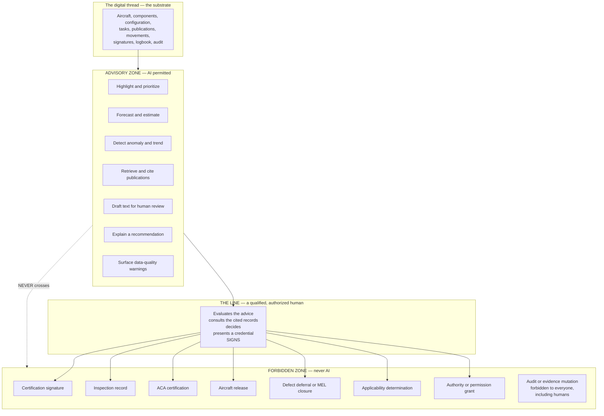
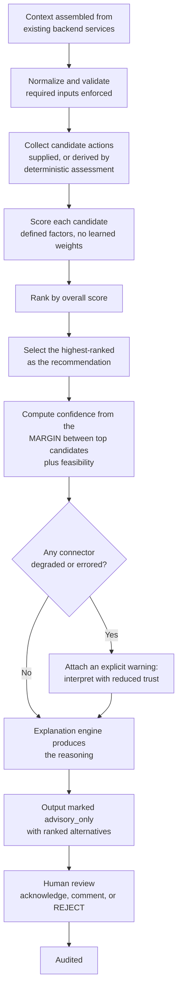
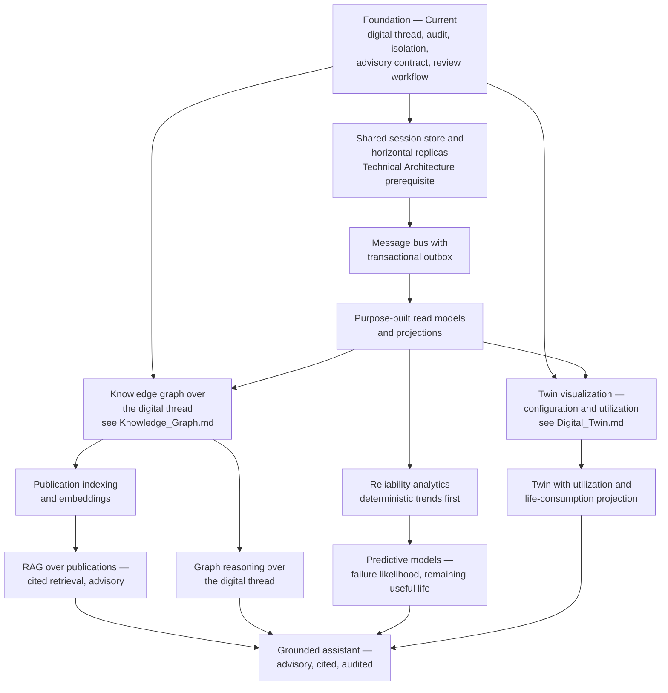
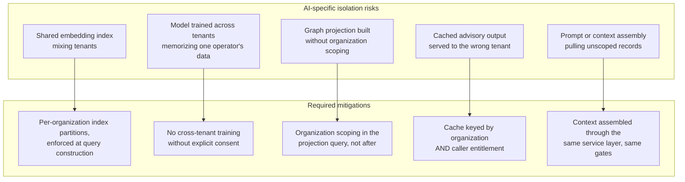

# AI Strategy — Mercury Aviation Enterprise Operating System

| Field | Value |
|-------|-------|
| Document | AI strategy — advisory-only principle, capability roadmap, governance, and honest current state |
| Product | Mercury Aviation Enterprise Operating System (AEOS) |
| Organization | Mercury Technologies |
| Layer | AI and analytics — advisory intelligence over the digital thread |
| Audience | Architects, product, engineering, quality managers, auditors, customers, investors |
| Status | Living baseline — **blueprint and stubs, not production AI** |
| Companion documents | [Knowledge Graph](Knowledge_Graph.md) · [Digital Twin](Digital_Twin.md) |
| Upstream authority | [SECURITY.md](../../SECURITY.md) · [Technical Architecture](../02_Architecture/Technical_Architecture.md) · [Digital Thread](../04_Data/Digital_Thread.md) |

---

## 0. Read this first

**Mercury does not ship production artificial intelligence today.**

What exists in the runtime is a **deterministic, explainable advisory decision engine** and the indexing and cross-reference structures that make the platform AI-ready. There is no machine-learning model in production, no large language model integration, no embedding store, no retrieval-augmented generation, and no predictive maintenance model.

**No artificial intelligence in Mercury approves, certifies, inspects, or releases work — and none ever will.** That is an architectural commitment, not a current limitation. Section 3 states it in full.

Everything in this document is marked so that intent is never mistaken for implementation.

---

## 1. Scope

### 1.1 In scope

This document specifies Mercury's approach to AI: the advisory-only principle and why it is absolute, what the current advisory engine actually does, the capability roadmap in dependency order, the governance model that any AI capability must satisfy before it ships, how AI composes with security and audit, and where the honest boundaries lie.

### 1.2 Out of scope

| Concern | Authoritative location |
|---------|------------------------|
| Graph structure over the digital thread, and reasoning patterns | [Knowledge Graph](Knowledge_Graph.md) |
| Configuration and utilization visualization, twin scope | [Digital Twin](Digital_Twin.md) |
| Traceability edges and the data foundation | [Digital Thread](../04_Data/Digital_Thread.md) |
| Authorization of AI-adjacent surfaces | [RBAC](../06_Security/RBAC.md) |
| Audit of advisory actions | [Audit](../06_Security/Audit.md) |
| Why release cannot be automated | [Digital Signatures](../06_Security/Digital_Signatures.md) |
| Layering, persistence, and runtime mechanics | [Technical Architecture](../02_Architecture/Technical_Architecture.md) |

### 1.3 Honesty markers

Used throughout, and used strictly.

| Marker | Meaning |
|--------|---------|
| **Current** | In the runtime, exercised by tests |
| **Stub** | A working, deliberately deterministic placeholder with the right shape and no model behind it |
| **Partial** | Present for a subset of the described scope |
| **Planned** | Designed here, not built |
| **Never** | Deliberately excluded by architectural commitment |

The **Never** marker exists only in this documentation set. It matters more than the others.

---

## 2. Design principles

| # | Principle | Consequence |
|---|-----------|-------------|
| 1 | **Advisory only. Always.** | AI proposes; a qualified, authorized human decides and signs. No exception, no configuration flag, no "trusted mode". |
| 2 | **Never autonomous release.** | No AI output can produce a certification signature or a return-to-service release. See §3. |
| 3 | **Explainability is a precondition, not a feature.** | An advisory output a human cannot interrogate is worthless in aviation, because the human carries the accountability. Unexplainable output is not shipped. |
| 4 | **Deterministic before probabilistic.** | Where a rule is correct and auditable, a rule is used. Probabilistic methods are introduced only where determinism genuinely cannot answer the question. |
| 5 | **Grounded in the record, cited to the record.** | An advisory output must cite the platform records it derives from — task, revision, component, movement, signature. Ungrounded generation is not an aviation capability. |
| 6 | **Data quality is visible, not assumed.** | Degraded or missing inputs reduce stated confidence and say so. Silent confidence over bad data is the most dangerous failure mode available. |
| 7 | **The same security model applies.** | AI reads through the same organization isolation and permission gates as any other consumer. There is no privileged AI service account with broad read access. |
| 8 | **Every advisory interaction is audited.** | Generation, selection, acknowledgement, and **rejection** are recorded. Rejection especially: an advisory system nobody overrides is not being reviewed. |
| 9 | **Provenance is carried forward.** | An advisory output derived from `simulated` data is itself marked. See [Audit §3.4](../06_Security/Audit.md#34-the-provenance-model). |
| 10 | **State the current reality plainly.** | "AI-ready" describes the data foundation. It is never used to imply delivered AI. |

---

## 3. The advisory-only principle

### 3.1 The commitment

| Question | Answer |
|----------|--------|
| May AI recommend a maintenance action? | **Yes**, as an advisory recommendation a human evaluates |
| May AI prioritize, forecast, or highlight? | **Yes**, with explanation and stated confidence |
| May AI draft text a human reviews and owns? | **Yes**, with citations to source records |
| May AI sign a certification step? | **Never** |
| May AI perform or record an inspection? | **Never** |
| May AI issue an ACA certification? | **Never** |
| May AI release an aircraft to service? | **Never** |
| May AI defer a defect or close an MEL item? | **Never** |
| May AI approve a publication revision or declare applicability? | **Never** |
| May AI grant a permission, membership, or authority? | **Never** |
| May AI write, alter, or delete an audit record or a signature? | **Never** |

### 3.2 Why this is architectural rather than cautious

The certification chain is enforced by five checks that are structurally impossible for a non-human to satisfy — and this is worth understanding precisely, because it means the commitment is enforced by the platform's existing design rather than by policy alone.

| Check | Why AI cannot satisfy it |
|-------|--------------------------|
| Employee validity | A signature names an **employee** — a person in an organization with a personnel record. There is no employee record for a model |
| Signer binding | The employee must be bound to the **authenticated user** making the request. A model has no user account, and creating one would be a deliberate, reviewable act of subversion |
| Credential verification | A password or a physical stamp PIN must be presented and verified. A model holding a human's stamp code is a stolen credential, not an AI capability |
| Step authority | An active, unexpired **qualification or authorization** issued by a quality organization to a named person is required. Authorities are not issued to software |
| Accountability | A release is a legal attestation by a person who can be questioned, retrained, or have their authority withdrawn. There is nobody to hold accountable for a model's release |

See [Digital Signatures §4](../06_Security/Digital_Signatures.md#4-the-certification-chain) and [Identity §7](../06_Security/Identity.md#7-certification-identity--the-separation-that-must-not-collapse).

### 3.3 Where the line sits

The line is a **human with a credential and an authority**. Advisory output arrives on one side; evidence is created on the other; and the crossing requires an act only a qualified person can perform.

### 3.4 What advisory actually means in practice

| Property | Requirement |
|----------|-------------|
| Labelled | Advisory output is visibly marked as advisory wherever it appears |
| Attributable to its inputs | It cites the records it derives from, resolvable by the reviewer |
| Confidence-bearing | It states how confident it is, and why |
| Overridable without friction | Rejecting advice is a first-class action, not a workaround |
| Audited both ways | Acceptance and rejection are both recorded |
| Non-blocking | A human can always proceed without it. **An advisory system that becomes a prerequisite has stopped being advisory** |
| Degradation-honest | When inputs are stale, missing, or `simulated`, the output says so |

The non-blocking row is the one most easily lost. A recommendation engine that a workflow cannot proceed without has become a controller regardless of what it is called.

---

## 4. Current state

### 4.1 What exists today

| Capability | Marker | What it actually is |
|------------|--------|--------------------|
| Advisory decision engine | **Current, deterministic** | Produces ranked, explainable recommendations from existing backend services. Rule-based and scored, with **no machine-learning model** |
| Explanation engine | **Current** | Generates the reasoning behind a ranking, so a reviewer can interrogate rather than accept |
| Scoring and ranking | **Current, deterministic** | Candidate actions scored on defined factors and ordered by overall score |
| Explicit `advisory_only` marking on output | **Current** | The output carries the flag. This is a contract, not a comment |
| Advisory rejection as a first-class review state | **Current** | A reviewer can reject advice, and the rejection is a recorded terminal state |
| Data-quality degradation warnings | **Current** | Degraded or errored connectors reduce stated trust, and the output says so explicitly |
| Deterministic threat and assessment stubs | **Stub** | Working placeholders with the right shape, no model behind them |
| Indexing and cross-reference structures over publications, configuration, and the digital thread | **Current** | The data foundation that makes retrieval and reasoning tractable later |
| Machine-learning models in production | **None** | — |
| Large language model integration | **None** | — |
| Embedding or vector store | **None** | — |
| Retrieval-augmented generation over publications | **Planned** | See §6.2 |
| Predictive maintenance and remaining-useful-life models | **Planned** | See §6.3 |
| Knowledge graph store and reasoning | **Planned** | See [Knowledge Graph](Knowledge_Graph.md) |
| Digital twin | **Planned, visualization-first** | See [Digital Twin](Digital_Twin.md) |

### 4.2 The advisory engine, honestly described

Two design details are worth naming because they are more honest than most advisory systems manage:

1. **Confidence is derived from the margin between the top candidates**, not asserted. When two options score nearly equally, confidence is low — which is the correct signal, because it means the engine genuinely cannot distinguish them. An engine that reported high confidence on a coin-flip would be actively misleading.
2. **Connector degradation is surfaced, not absorbed.** When an upstream integration is unhealthy, the output says so rather than quietly producing a recommendation over stale inputs.

### 4.3 What the engine is not

| Not | Detail |
|-----|--------|
| Not machine learning | Rules and scoring. No training data, no learned weights, no model artefact |
| Not a maintenance decision-maker | It ranks candidate actions in an operational context. It does not decide airworthiness |
| Not certified or approved | No aviation authority has certified, approved, or accepted it. See [SECURITY.md §8](../../SECURITY.md#8-what-mercury-does-not-claim) |
| Not a substitute for the certification chain | Its output cannot become a signature, a logbook entry, or a release |
| Not permitted to write domain evidence | It reads context and produces recommendations |

### 4.4 Why deterministic first is the right choice, not a placeholder excuse

| Reason | Detail |
|--------|--------|
| **A rule is explainable by construction** | The explanation is the rule. There is no post-hoc rationalization to be suspicious of |
| **A rule is auditable** | A reviewer can confirm the logic was correct, not merely that the output looked reasonable |
| **A rule is testable** | Deterministic output means a test asserts an exact expectation |
| **A rule is stable** | It does not drift, and it does not change behaviour because an upstream model was updated |
| **It establishes the contract first** | The advisory interface, review workflow, audit trail, and rejection path all exist and are exercised. When a model is introduced, it plugs into a proven contract rather than requiring one to be invented alongside it |

The last row is the strategic point. The **hard** part of aviation AI is not the model — it is the governance, explainability, audit, and human-review contract around it. Mercury has built that first, deliberately.

---

## 5. Governance — the gate every AI capability must pass

### 5.1 The eight questions

No AI capability ships in Mercury without answering all eight in an ADR.

| # | Question | Unacceptable answer |
|---|----------|--------------------|
| 1 | **What decision does this inform, and who is accountable for that decision?** | "The system decides" |
| 2 | **How does a reviewer interrogate the output?** | "The model is complex" |
| 3 | **What records does it cite, and are they resolvable?** | "It draws on general knowledge" |
| 4 | **What does it do when inputs are missing, stale, or `simulated`?** | "It produces the best estimate available" without saying so |
| 5 | **How is confidence computed, and is it honest at the low end?** | A confidence that is never low |
| 6 | **What is the failure mode, and does it fail safe?** | "It degrades gracefully" without specifics |
| 7 | **How is it audited — generation, selection, acceptance, and rejection?** | "Outputs are logged" |
| 8 | **What is the evidence it never crosses into the forbidden zone in §3.1?** | "It is not designed to" |

Question 8 requires a **structural** argument, not a statement of intent. For the current engine, the structural argument is that it has no path to the signing service, no employee record, no credential, and no authority — the same five reasons in §3.2.

### 5.2 Model governance for probabilistic capabilities

Additional requirements once a genuine model is introduced:

| Requirement | Detail |
|-------------|--------|
| Documented training data provenance | Including whether customer data was used, under what agreement, and with what isolation |
| **No cross-tenant training without explicit consent** | A model learned from one operator's data must not be inferable by a competitor sharing the platform. This is the highest-consequence AI-specific risk Mercury faces, and it is an isolation problem before it is a model problem |
| Versioned and pinned models | An advisory output records which model version produced it, so a past recommendation remains explainable |
| Documented drift monitoring | Including what triggers retraining and who approves it |
| Evaluation against a held-out aviation-relevant benchmark | Not general-purpose accuracy |
| Bias and failure analysis | Especially where output could disadvantage an aircraft type, fleet, or site |
| Human-review rate monitoring | An advisory system with a near-100 percent acceptance rate is not being reviewed, and that is a governance finding rather than a success metric |
| Rollback capability | A model can be withdrawn without withdrawing the surface it feeds |

### 5.3 The acceptance-rate insight

Worth stating separately because it inverts the obvious metric: a high acceptance rate is usually presented as evidence that an advisory system works. In aviation it is closer to the opposite. If reviewers accept essentially everything, either the advice is trivial or the review has become a rubber stamp — and a rubber-stamped advisory system has quietly become an autonomous one.

Mercury therefore treats **rejection as a first-class recorded state**, and treats the rejection rate as a health metric of the *review process*, not a defect rate of the engine.

---

## 6. Capability roadmap

### 6.1 Dependency order

Every arrow is a real dependency. The consistent theme: **the data foundation and the review contract come before the models**, and the platform prerequisites — a shared session store, a message bus, projections — come before either.

### 6.2 Retrieval-augmented generation over publications

**Status: Planned.** The highest-value near-term AI capability, and the one where advisory-only is easiest to honour because the output is *always* a pointer into an authoritative document.

| Aspect | Design position |
|--------|----------------|
| Purpose | A technician asks a question in their own words and receives the relevant passage from the correct publication, at the correct revision, with a resolvable citation |
| Grounding | Retrieval only over publications the caller's organization holds and the caller may read. Organization isolation and `publication.read` apply without exception |
| Revision correctness | Retrieval is scoped to the revision **in force for the aircraft and date in question** — not merely the newest. This is the hardest correctness requirement in the feature, and getting it wrong would surface superseded instructions as current |
| Citation | Every answer cites publication, revision, and ATA reference, resolvable to the record. An uncitable answer is not returned |
| Generation limits | Summarizes and locates. **It does not paraphrase a procedure into instructions to follow.** The technician works from the publication, not from the summary |
| Refusal | When no sufficiently relevant passage is found, it says so. **A confident answer with no source is the worst possible output**, and returning nothing is strictly better |
| Isolation of the index | Embeddings are organization-scoped. A vector index that mixes tenants is a cross-organization disclosure channel that is harder to audit than a database query |
| Audit | Query, retrieved citations, and whether the user opened them |
| What it never does | Determine applicability, authorize an action, or become the cited authority in a logbook entry. **The logbook cites the revision. It never cites the assistant** |

The "does not paraphrase a procedure" boundary is the most important one. The regulatory value of a publication is that it is a controlled document with a revision history. A paraphrase is an uncontrolled derivative, and a maintenance action performed against a paraphrase is performed against nothing.

### 6.3 Predictive and reliability analytics

**Status: Planned. Deterministic analytics first.**

| Stage | Content | Marker |
|-------|---------|--------|
| 1 | Deterministic reliability analytics — removal rates, mean time between unscheduled removals, defect recurrence, delay attribution. **Explainable arithmetic over the digital thread** | **Planned** |
| 2 | Trend detection and threshold alerting with stated methodology | **Planned** |
| 3 | Failure-likelihood and remaining-useful-life estimation, per component type and operating environment | **Planned** |
| 4 | Maintenance-programme optimization proposals — escalation and de-escalation candidates | **Planned** |

| Constraint | Detail |
|------------|--------|
| Never shortens a life limit or an inspection interval automatically | A hard life limit is a certification requirement, not a model output |
| Never defers a defect or closes an MEL item | Both are human determinations with authority attached |
| Programme changes remain engineering decisions with approval workflow | A model proposes; engineering evaluates; the authority-approved process decides |
| Confidence intervals reported, not point estimates | A remaining-useful-life estimate without an interval invites false precision |
| Small-fleet honesty | Most operators have too little data for a confident per-component model. **The correct output for a small fleet is a wide interval or an explicit refusal**, not a confident number |
| Cross-tenant learning requires explicit consent | See §5.2 |

The small-fleet row deserves emphasis: aviation predictive maintenance marketing routinely ignores it. A model trained on three aircraft over two years cannot make a confident claim about a component's remaining life, and saying so is the difference between a useful tool and an expensive guess.

### 6.4 Other planned capabilities

| Capability | Purpose | Marker |
|------------|---------|--------|
| Planning optimization advisory | Proposes check scheduling, hangar bay allocation, and workforce assignment respecting real constraints | **Planned** |
| Material demand forecasting | Anticipates part demand from the forecast and consumption history, feeding purchase advisories | **Planned** |
| Defect similarity and prior-resolution retrieval | Surfaces how a comparable defect was resolved before, cited to the actual job cards | **Planned** |
| Anomaly detection over the audit trail | Turns the audit trail into an active control. See [Audit §12](../06_Security/Audit.md#12-future-enhancements) | **Planned** |
| Data-quality scoring across the digital thread | Makes gaps visible before they are inherited by a model | **Planned** |
| Grounded operator assistant | Natural-language access to the platform's own records, advisory and cited | **Planned** |
| Autonomous anything | — | **Never** |

---

## 7. AI and the security model

### 7.1 No privileged AI path

| Rule | Detail |
|------|--------|
| AI reads through the same gates | Endpoint permission and organization access, exactly as any other consumer |
| No broad-read service account | An AI component with cross-tenant read access would be a cross-organization disclosure channel with a friendly name |
| Advisory surfaces are permission-gated | `decisions.read` and `decisions.review` — see [RBAC §5.3](../06_Security/RBAC.md#53-the-catalogue-by-family) |
| No write access to evidence | AI components do not write signatures, certification events, logbook entries, movements, or audit records |
| Derived indexes inherit isolation | An embedding index, graph projection, or feature store is organization-scoped, or it is a leak |

### 7.2 The isolation risk unique to AI

**Why AI isolation is harder than database isolation:** a leaky database query returns a row that is obviously from the wrong tenant, and a test can catch it. A model that has memorized a competitor's fleet data leaks through *inference*, with no row to point at and no obvious test. This is why §5.2 forbids cross-tenant training without explicit consent rather than treating it as an optimization to evaluate later.

### 7.3 Audit of advisory interactions

| Recorded | Why |
|----------|-----|
| Recommendation generated, with inputs and version | Reconstructing what was advised, and on what basis |
| Recommendation selected | What was put in front of the human |
| Acknowledged | The human saw it |
| Commented | The human engaged with it |
| **Rejected as advisory** | The human overrode it — the most valuable record of the four |
| Degradation warning attached | The advice was produced over questionable inputs |

Detail in [Audit §4.3](../06_Security/Audit.md#43-domain-action-families).

### 7.4 Provenance flows through AI

An advisory output derived from `simulated` records is itself marked `simulated`. A demonstration environment must never produce advice that reads as operational, and provenance is the mechanism that prevents it. See [Audit §3.4](../06_Security/Audit.md#34-the-provenance-model).

---

## 8. Non-functional requirements

### 8.1 Correctness and trustworthiness

| Requirement | Position |
|-------------|----------|
| Advisory output is explicitly marked advisory | **Current** |
| Output is explainable | **Current** — the explanation engine produces reasoning |
| Confidence is derived rather than asserted | **Current** — from the margin between candidates and feasibility |
| Degraded inputs produce an explicit warning | **Current** |
| Rejection is a first-class recorded state | **Current** |
| Advisory interactions are audited | **Current** |
| Output cites resolvable platform records | **Partial** — inputs are recorded; full citation resolution arrives with the knowledge graph and RAG |
| No AI writes evidence | **Current** |
| Model versioning recorded on output | **Planned** — no models exist yet |
| Cross-tenant training prohibited without consent | **Planned as a governance control** |
| Refusal when no grounded answer exists | **Planned** — a RAG requirement |

### 8.2 Performance

| Concern | Current baseline | Aspirational enterprise target |
|---------|-----------------|-------------------------------|
| Advisory recommendation generation | Deterministic scoring over assembled context, synchronous | 95th percentile under 1 second |
| Explanation generation | Deterministic, alongside ranking | Under 500 ms |
| Publication retrieval with citation | Not applicable | 95th percentile under 2 seconds |
| Reliability analytics over a fleet | Not applicable | Under 5 seconds from projections, not from live cross-module queries |
| Predictive scoring for one component | Not applicable | Under 200 ms from precomputed features |
| Graph traversal for a reasoning query | Not applicable | See [Knowledge Graph](Knowledge_Graph.md) |
| **Effect of AI unavailability on core workflows** | **None — nothing depends on it** | **Unchanged. This is a requirement, not a happy accident** |

The last row is the most important performance requirement in the document: an AI component being slow or down must never delay a technician signing work. That is what "non-blocking" in §3.4 means operationally, and it must survive every future capability.

### 8.3 Data foundation requirements

Every AI capability depends on the digital thread being complete and honest. The dependency runs one way, and it is unforgiving.

| Requirement | Position |
|-------------|----------|
| Every configuration, task, part, signature, and shipment links to a coherent narrative | **Current** — see [Digital Thread](../04_Data/Digital_Thread.md) |
| Immutable publication revisions with effective dates | **Current** — the precondition for revision-correct retrieval |
| Append-only movement ledger | **Current** — the precondition for consumption analytics |
| Certification events with distinct, recorded signers | **Current** — the precondition for process analytics |
| Provenance on all records | **Current** |
| Consistent organization scoping on every table | **Current** |
| Purpose-built read models and projections | **Planned** — AI over live cross-module queries will not scale |
| Data-quality scoring | **Planned** |
| Message bus for projection maintenance | **Planned** |

### 8.4 Explainability requirements

| Requirement | Standard |
|-------------|----------|
| A reviewer can see **why** | Not merely what was recommended |
| A reviewer can see **what it read** | With resolvable references |
| A reviewer can see **how confident** and why | Including honest low confidence |
| A reviewer can see **what it could not see** | Missing or degraded inputs stated |
| A reviewer can **reject without friction** | And the rejection is recorded |
| A reviewer can reconstruct a **past** recommendation | Inputs and version retained |

---

## 9. Security considerations

**Advisory-only is enforced by the certification chain, not by policy alone.** The five checks in §3.2 are structural. An AI component cannot satisfy them without someone deliberately creating an employee record, binding it to a service account, issuing it a credential, and granting it an authority — four separate, auditable, reviewable acts of subversion. Any change that moves in that direction is a critical finding.

**AI has no privileged read path.** Same gates, same isolation. An "AI service account" with broad read access would defeat the isolation model, and no such account exists or is planned.

**Derived indexes are the newest isolation surface.** Embedding stores, graph projections, and feature stores are copies of tenant data in a new shape, and a copy that loses its organization scoping is a disclosure channel that a database-focused review will not catch. Per-organization partitioning enforced at query construction is the requirement.

**Cross-tenant model training is the highest-consequence AI-specific risk.** Mercury may host competing operators, lessors and their lessees, and MROs serving rivals. A model that memorizes one tenant's data leaks through inference, with no row to point at. Prohibited without explicit consent, and treated as an isolation control rather than a data-science choice.

**Prompt and context assembly is an authorization surface.** If a future assistant assembles context by querying records, that assembly must go through the same service layer and the same gates. Context assembly that bypasses the service layer "for efficiency" is a privilege escalation wearing a performance justification.

**Ungrounded output is a safety risk, not merely a quality problem.** A confidently-worded maintenance suggestion with no source, acted on by a technician under time pressure, is the realistic harm scenario. This is why citation is a precondition, why refusal is a required behaviour, and why paraphrasing procedures is forbidden.

**Automation bias is a real failure mode and is designed against.** Humans defer to confident machine output, particularly under time pressure. Mercury's countermeasures are structural: honest low confidence derived from candidate margin, explicit degradation warnings, rejection as a first-class recorded state, and monitoring the acceptance rate as a **review-health** metric rather than a success metric.

**An advisory system that becomes a prerequisite has become a controller.** If a workflow cannot proceed without AI output, the human review has become nominal. Non-blocking is therefore a security property, and it is why §8.2 requires that AI unavailability has no effect on core workflows.

**Provenance must not be lost in derivation.** Advice from `simulated` data is `simulated` advice. A pipeline that drops provenance while transforming data has manufactured false confidence.

**Every advisory interaction is audited, including rejection.** Without rejection records there is no evidence that review is occurring, and no way to detect a rubber stamp.

**Known AI security debt**, tracked openly: no model governance framework in force because no models exist, no per-organization index partitioning built because no index exists, no data-quality scoring, no automated verification that advisory surfaces cannot reach signing paths, and no monitoring of human-review rates.

---

## 10. Scalability

### 10.1 AI scaling depends on platform scaling

Every AI capability is downstream of platform work that has nothing to do with AI:

| Prerequisite | Why AI needs it |
|--------------|-----------------|
| Shared session store and horizontal replicas | AI workloads must not compete with the certification path in a single process. **This is the binding constraint** — see [Technical Architecture §15.1](../02_Architecture/Technical_Architecture.md#151-the-binding-constraint) |
| Message bus with a transactional outbox | Keeping projections, indexes, and graphs current without coupling them to the write path |
| Purpose-built read models | AI over live cross-module queries will not scale, and would put analytical load on the transactional primary |
| Read replicas | Analytical load off the primary |
| Object store | Publication content for indexing |
| Time partitioning | Bounded query cost over the history that analytics needs most |

**No AI capability should be built before these exist.** Doing so would place analytical load on the transactional path that carries certification and release — trading the platform's most important property for a feature.

### 10.2 AI-specific scaling levers

| # | Lever | Unlocks | Cost |
|---|-------|---------|------|
| 1 | Organization-partitioned publication index | Revision-correct retrieval with isolation intact | Index maintenance on revision issue |
| 2 | Incremental index maintenance driven by domain events | Retrieval stays current without full rebuilds | Message bus |
| 3 | Graph projection over the digital thread | Multi-hop reasoning without recursive transactional queries | See [Knowledge Graph](Knowledge_Graph.md) |
| 4 | Precomputed feature store per component and aircraft | Predictive scoring in milliseconds instead of on-demand aggregation | Feature freshness management |
| 5 | Asynchronous advisory generation with notification | Long-running analysis without blocking a request | Message bus plus real-time delivery |
| 6 | Model serving isolated from the application process | AI resource consumption cannot degrade the certification path | Deployment complexity |
| 7 | Result caching keyed by organization **and** caller entitlement | Repeated queries cost once | Cache invalidation, and the isolation hazard in §7.2 |
| 8 | Batch analytics on replicas | Fleet-wide reliability analysis off the primary | Replication lag, acceptable here |

### 10.3 What must survive any AI scaling change

- **Advisory-only.** No autonomous release, ever, at any scale.
- Organization isolation across every derived index, projection, cache, and model.
- Permission gating on every advisory surface.
- Explainability and resolvable citation.
- Honest confidence, including low confidence.
- Complete audit of generation, selection, acceptance, and rejection.
- **Non-blocking behaviour: AI unavailability must never delay a technician signing work.**

---

## 11. Future enhancements

| # | Enhancement | Value | Depends on |
|---|-------------|-------|------------|
| 1 | Data-quality scoring across the digital thread | Makes gaps visible before a model inherits them | Projections |
| 2 | Organization-partitioned publication index with revision awareness | Foundation for revision-correct retrieval | Object store, message bus |
| 3 | RAG over publications with resolvable citation and explicit refusal | The highest-value near-term capability | Item 2 |
| 4 | Knowledge graph over the digital thread | Multi-hop reasoning across configuration, work, parts, and evidence | Projections — see [Knowledge Graph](Knowledge_Graph.md) |
| 5 | Deterministic reliability analytics | Explainable arithmetic before any probabilistic model | Projections, read replicas |
| 6 | Trend detection with stated methodology | Early warning without a black box | Item 5 |
| 7 | Predictive failure-likelihood and remaining-useful-life models with confidence intervals | Genuine predictive maintenance, honestly bounded | Items 4, 5, plus model governance |
| 8 | Digital twin visualization of configuration and utilization | Makes the passport comprehensible at a glance | See [Digital Twin](Digital_Twin.md) |
| 9 | Planning optimization advisory | Better checks, bays, and workforce plans respecting real constraints | Projections |
| 10 | Material demand forecasting | Fewer shortages, less excess stock | Items 5 and 9 |
| 11 | Defect similarity and prior-resolution retrieval | Institutional knowledge becomes searchable and cited | Items 3 and 4 |
| 12 | Anomaly detection over the audit trail | The audit trail becomes an active control | [Audit §12](../06_Security/Audit.md#12-future-enhancements) |
| 13 | Grounded operator assistant over the platform's own records | Natural-language access, advisory and cited | Items 3, 4, and 8 |
| 14 | Model governance framework in force — versioning, drift, rollback, evaluation | Prerequisite for shipping any probabilistic capability | A decision and an ADR |
| 15 | Automated verification that advisory surfaces cannot reach signing paths | Makes the §3.1 commitment a build-time check rather than a review obligation | Test infrastructure |
| 16 | Human-review-rate monitoring with rubber-stamp detection | Detects automation bias before it causes harm | Item 12 |
| 17 | Per-tenant model isolation with explicit consent for any shared learning | Removes the highest-consequence AI-specific isolation risk | Item 14 |
| 18 | Published AI transparency statement per capability | Customers and authorities see exactly what each capability does and does not do | Item 14 |

---

## 12. What Mercury does not claim about AI

Restated here so it cannot be missed by a reader who starts in the middle. This section is consistent with [SECURITY.md §8](../../SECURITY.md#8-what-mercury-does-not-claim).

- **No artificial intelligence that approves, certifies, inspects, or releases work.** Not now, not planned, not configurable.
- **No production machine-learning model.** The advisory engine is deterministic and rule-based.
- **No large language model integration, embedding store, or retrieval-augmented generation today.**
- **No predictive maintenance model, remaining-useful-life estimation, or failure prediction today.**
- **No knowledge graph store or graph reasoning engine today** — see [Knowledge Graph](Knowledge_Graph.md).
- **No digital twin today** — see [Digital Twin](Digital_Twin.md).
- **No aviation authority certification, approval, or acceptance of any Mercury AI capability.**
- **No claim that AI output constitutes a maintenance determination, an airworthiness determination, or a certification.**
- **No autonomous operation of any kind.**

"AI-ready" in Mercury materials describes the **data foundation** — indexing, cross-references, immutable revisions, an append-only ledger, and a complete digital thread. It is never used to imply delivered AI. If you find a Mercury document, screen, or communication that implies otherwise, treat it as a defect and report it under [SECURITY.md §2](../../SECURITY.md#2-reporting-a-vulnerability) or under the integrity obligations in [CODE_OF_CONDUCT.md](../../CODE_OF_CONDUCT.md).

---

## 13. Related documents

**Within the AI set**
[Knowledge Graph](Knowledge_Graph.md) · [Digital Twin](Digital_Twin.md)

**Security**
[SECURITY.md](../../SECURITY.md) · [Identity](../06_Security/Identity.md) · [RBAC](../06_Security/RBAC.md) · [Audit](../06_Security/Audit.md) · [Digital Signatures](../06_Security/Digital_Signatures.md)

**Architecture**
[Technical Architecture](../02_Architecture/Technical_Architecture.md) · [Enterprise Architecture](../02_Architecture/Enterprise_Architecture.md) · [Domain Architecture](../02_Architecture/Domain_Architecture.md) · [System Context](../02_Architecture/System_Context.md)

**Data and digital thread**
[Digital Thread](../04_Data/Digital_Thread.md) · [Data Model](../04_Data/Data_Model.md) · [Master Data](../04_Data/Master_Data.md) · [Knowledge Graph — data view](../04_Data/Knowledge_Graph.md)

**Governance**
[README](../../README.md) · [VISION](../../VISION.md) · [ROADMAP](../../ROADMAP.md) · [ADR register](../08_Standards/ADR/) · [Regulations documentation set](../09_Regulations/)

---

*Mercury Technologies — One Digital Thread. One Digital Aircraft Passport. One Aviation Enterprise Operating System.*
