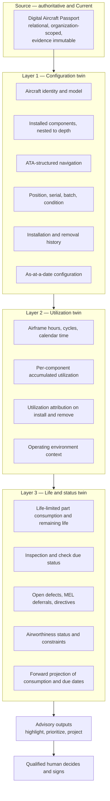
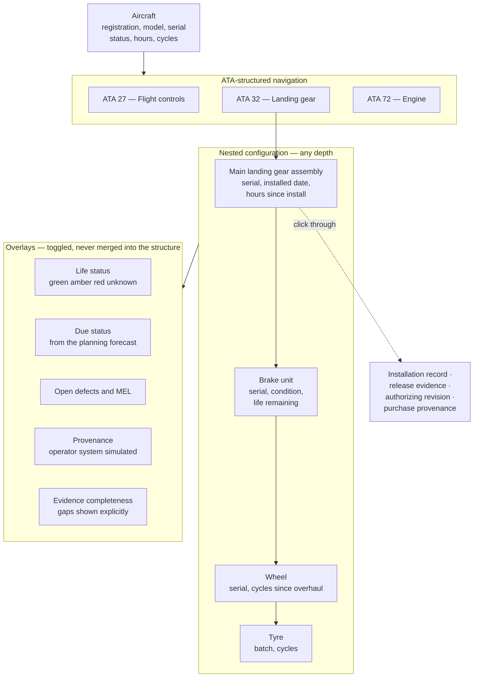
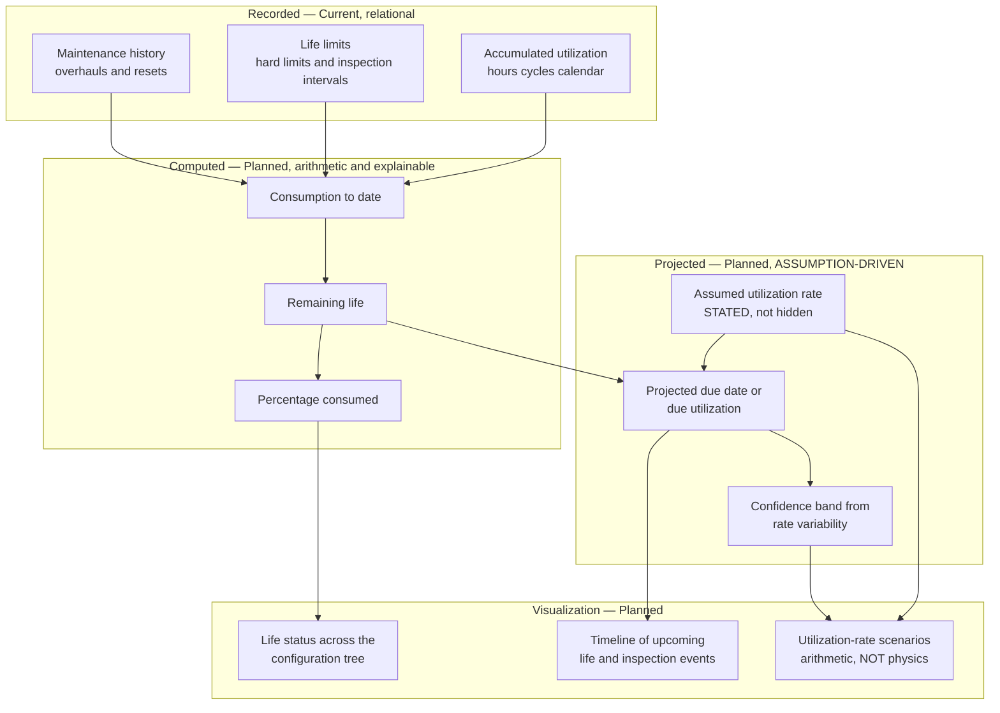
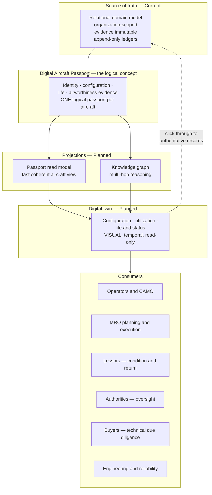
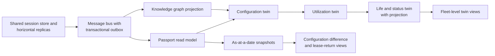

# Digital Twin — Mercury Aviation Enterprise Operating System

| Field | Value |
|-------|-------|
| Document | Digital twin — configuration and utilization visualization over the Digital Aircraft Passport |
| Product | Mercury Aviation Enterprise Operating System (AEOS) |
| Organization | Mercury Technologies |
| Layer | AI and analytics — visualization and projection of recorded state |
| Audience | Architects, product, engineering and reliability teams, lessors, CAMO and MRO leadership, auditors |
| Status | Living baseline — **blueprint. No twin exists in the runtime** |
| Companion documents | [AI Strategy](AI_Strategy.md) · [Knowledge Graph](Knowledge_Graph.md) |
| Upstream authority | [Digital Thread](../04_Data/Digital_Thread.md) · [Technical Architecture](../02_Architecture/Technical_Architecture.md) · [SECURITY.md](../../SECURITY.md) |

---

## 0. Read this first

**Mercury has no digital twin today.**

There is no three-dimensional model, no physics simulation, no sensor telemetry ingestion, no real-time state mirror, and no predictive simulation engine. What exists is the **Digital Aircraft Passport**: an authoritative relational record of aircraft identity, configuration, component installation history, life counters, maintenance evidence, and airworthiness status.

This document specifies what Mercury means by "digital twin", which is deliberately narrower than the industry's usual usage. Mercury's twin is a **visualization and projection layer over recorded truth** — configuration made visible, utilization made comprehensible, life consumption projected forward. It is not a physics simulation of an aircraft, and Mercury will not describe it as one.

Section 3 defines the scope precisely. Section 4 states what is deliberately excluded. Both matter more than the roadmap.

---

## 1. Scope

### 1.1 In scope

What a Mercury twin is and is not; the configuration visualization model; the utilization and life-consumption model; the projection architecture that feeds it; how the twin composes with the passport, the digital thread, and the knowledge graph; the advisory-only constraint; and the honest current state.

### 1.2 Out of scope

| Concern | Authoritative location |
|---------|------------------------|
| Advisory-only principle and AI governance | [AI Strategy](AI_Strategy.md) |
| Graph reasoning model and traversal patterns | [Knowledge Graph](Knowledge_Graph.md) |
| The authoritative record structure and edge catalogue | [Digital Thread](../04_Data/Digital_Thread.md) · [Data Model](../04_Data/Data_Model.md) |
| Configuration, component, and life-counter domain rules | [Domain Architecture](../02_Architecture/Domain_Architecture.md) |
| Isolation, permissions, audit | [Identity](../06_Security/Identity.md) · [RBAC](../06_Security/RBAC.md) · [Audit](../06_Security/Audit.md) |
| Evidence immutability and release semantics | [Digital Signatures](../06_Security/Digital_Signatures.md) |
| Projection, message bus, and read-model mechanics | [Technical Architecture](../02_Architecture/Technical_Architecture.md) |
| UI conventions and the no-framework constraint | [UI Standards](../08_Standards/UI_Standards.md) |

### 1.3 Honesty markers

| Marker | Meaning |
|--------|---------|
| **Current** | In the runtime, exercised by tests |
| **Current, relational** | The underlying data exists and is queryable; the visualization does not |
| **Planned** | Designed here, not built |
| **Never** | Deliberately excluded by architectural commitment |

---

## 2. Design principles

| # | Principle | Consequence |
|---|-----------|-------------|
| 1 | **The twin visualizes recorded truth. It does not create truth.** | Every element traces to a persisted record. Nothing is inferred into the configuration view. |
| 2 | **Read-only, always.** | No write path exists through the twin. Configuration changes happen through component install and removal operations that enforce their own invariants. |
| 3 | **Visualization before simulation.** | Making the passport comprehensible is achievable, valuable, and honest. Physics simulation is a different product and is not Mercury's. |
| 4 | **Advisory only.** | A twin projection never certifies, releases, or determines airworthiness. See [AI Strategy §3](AI_Strategy.md#3-the-advisory-only-principle). |
| 5 | **Gaps are shown, never smoothed.** | Missing installation history, absent utilization data, and unknown life counters are displayed as **unknown**, not interpolated. A twin that quietly fills gaps is a fabrication with a friendly interface. |
| 6 | **Provenance is visible.** | Operator-entered, system-derived, and `simulated` data are distinguishable in the view. See [Audit §3.4](../06_Security/Audit.md#34-the-provenance-model). |
| 7 | **Temporal by default.** | "As at a date" is the normal question. A twin that only shows the present cannot support a lease return, an audit, or an investigation. |
| 8 | **Organization isolation, structurally.** | A twin is a projection of tenant data. Scoping is enforced at construction, not applied to the rendered output. |
| 9 | **Non-blocking.** | The twin being stale or unavailable must never delay a technician signing work. |
| 10 | **Say plainly what it is not.** | "Digital twin" is among the most over-claimed terms in aviation software. Section 4 exists so Mercury is not part of the problem. |

---

## 3. What a Mercury twin is

### 3.1 The definition

A Mercury digital twin is a **coherent, temporal, visual projection of an aircraft's recorded state**, assembled from the Digital Aircraft Passport and the digital thread, covering three things:

| Dimension | Content | Question it answers |
|-----------|---------|--------------------|
| **Configuration** | The as-built and as-maintained structure — which components are installed where, to any nesting depth, with their identity, condition, and installation history | *What is this aircraft made of, and what has it been made of?* |
| **Utilization** | Accumulated flight hours, cycles, calendar time, and their distribution across the airframe and components | *How hard has it been used, and where has that use landed?* |
| **Life and status** | Life-limited part consumption, remaining life, inspection due status, open defects and deferrals, and current airworthiness status | *What is due, what is close, and what is constraining it?* |

### 3.2 The three layers

The layering is a dependency order, not a presentation preference: utilization is meaningless without knowing what was installed when, and life consumption is meaningless without utilization attributed correctly.

### 3.3 What each layer needs from the record

| Layer | Data requirement | Position |
|-------|-----------------|----------|
| Configuration | Component installation and removal with position, serial, and timestamps | **Current, relational** |
| Configuration | Nested component structure to arbitrary depth | **Current, relational** |
| Configuration | ATA classification | **Current, relational** |
| Configuration | As-at-a-date reconstruction | **Current, relational** — reconstructable; **Planned** as a projection |
| Utilization | Airframe hours, cycles, calendar time | **Current, relational** |
| Utilization | Per-component life counters | **Current, relational** |
| Utilization | Correct attribution across install and removal boundaries | **Partial** — the hardest correctness requirement in the twin, discussed in §6.3 |
| Life and status | Life limits and remaining life | **Current, relational** |
| Life and status | Due status from the planning forecast | **Current, relational** |
| Life and status | Open defects, MEL items, directives | **Current, relational** |
| Life and status | Forward projection under assumed utilization | **Planned** |
| All layers | Organization scoping | **Current** |
| All layers | Provenance | **Current** |
| All layers | Visualization | **Planned** — none of it is rendered as a twin today |

**Every row marked "Current, relational" means the data is real and queryable, and the twin view over it is not built.** That distinction is the whole honesty position of this document.

---

## 4. What a Mercury twin is NOT

### 4.1 The exclusions

| Not | Marker | Why |
|-----|--------|-----|
| **A three-dimensional geometric model** | **Never** as a Mercury deliverable | Geometry belongs to the OEM's type design. Mercury records configuration, not shape. A geometric view could be **rendered from an OEM-supplied model** as an integration, but Mercury does not author or own geometry |
| **A physics simulation** | **Never** | Structural, aerodynamic, thermal, and fatigue simulation are OEM and specialist engineering domains requiring type-design data Mercury does not hold and should not claim |
| **A real-time state mirror** | **Not planned** | Mercury is a system of record updated by operational events, not a millisecond-latency shadow of a flying aircraft |
| **A sensor telemetry platform** | **Planned only as bounded ingestion** | Mercury may **ingest** utilization and condition data from flight data or health-monitoring systems as an integration. It is not a telemetry store, and it does not become one |
| **A predictive simulation engine** | **Never** | Simulating "what would happen if" requires physics. Mercury projects **recorded** consumption forward arithmetically, which is a different and honest claim |
| **An airworthiness determination** | **Never** | The twin displays status derived from records. Airworthiness is a human determination by qualified people. See [Digital Signatures §6.6](../06_Security/Digital_Signatures.md#66-what-release-does-not-do) |
| **A source of truth** | **Never** | It is a projection. The relational record is authoritative, and if they disagree the twin is stale |
| **A write path** | **Never** | Configuration changes through domain operations that enforce invariants |
| **An autonomous decision-maker** | **Never** | See [AI Strategy §3](AI_Strategy.md#3-the-advisory-only-principle) |

### 4.2 Why the narrow definition is the right one

| Reason | Detail |
|--------|--------|
| **It is achievable** | A configuration and utilization projection over a complete digital thread is real engineering with a defined finish line. A physics twin is a decade-long programme requiring data Mercury will never hold |
| **It is what customers actually lack** | Operators, lessors, and CAMOs do not need a simulation. They need to see what an aircraft is made of, how it has been used, what is due, and what evidence supports it — coherently, in one place, as at a date |
| **It is honest** | Mercury can defend every element of this definition. It could not defend a physics claim |
| **It composes** | A narrow, correct twin over an authoritative record is a foundation an OEM geometric model or a health-monitoring feed can plug into. An over-claimed twin has nowhere to go |
| **It is the highest-leverage use of the passport** | The passport already holds the data. The twin makes it comprehensible, which is where most of the unrealized value sits |

**The most valuable thing Mercury can build here is a lease-return-grade, audit-grade, buyer-grade view of an aircraft's recorded life.** That is a narrower claim than "digital twin" usually implies, and a far more useful one than a simulation nobody can validate.

---

## 5. Configuration visualization

### 5.1 The as-maintained configuration view

**Status: Planned. Underlying data Current, relational.**

### 5.2 Required properties

| # | Property | Detail |
|---|----------|--------|
| 1 | **Any nesting depth** | Assemblies contain sub-assemblies contain parts. Depth is a property of the aircraft, not a limit of the view |
| 2 | **ATA-structured navigation** | The standardized breakdown every aviation professional already thinks in |
| 3 | **As at a date** | The configuration on any past date, reconstructed from installation history |
| 4 | **Click-through to evidence** | Every element resolves to its records — installation, release evidence, authorizing revision, purchase provenance. **The twin is a navigation surface into evidence, not a replacement for it** |
| 5 | **Gaps shown as unknown** | A component with no recorded installation date shows unknown. It is never interpolated, and it is never omitted from the count |
| 6 | **Provenance visible** | `simulated` configuration is unmistakable |
| 7 | **Read-only** | No configuration change through the view |
| 8 | **Overlays are toggled, not merged** | Life, due, and defect status are layers over the structure. Merging them would make the structure itself uncertain |

Property 4 is what distinguishes a useful twin from a dashboard: the value is not the picture, it is that the picture is a **door into the evidence chain**.

### 5.3 Configuration history and lineage

| Capability | Value | Position |
|------------|-------|----------|
| Full installation and removal timeline per position | What has occupied this position over the aircraft's life | **Current, relational** |
| Component lineage across aircraft | Where this serialized component has been installed before, and for how long | **Current, relational** |
| Rotable circulation view | A component's movement between aircraft, shops, and stores | **Planned** |
| As-at-a-date configuration snapshot | Lease return, audit, and investigation baseline | **Planned as a projection** |
| Configuration difference between two dates | What changed during a check or a lease period | **Planned** |

The difference view is quietly one of the most valuable: "what changed on this aircraft during this lease" is a question that currently takes an analyst days.

---

## 6. Utilization and life consumption

### 6.1 The utilization model

**Status: Planned. Underlying counters Current, relational.**

| Measure | Applies to | Source |
|---------|-----------|--------|
| Flight hours | Airframe, engines, components | Recorded utilization |
| Flight cycles | Airframe, engines, landing gear, brakes, tyres | Recorded utilization |
| Calendar time | Everything with a calendar limit | Derived from dates |
| Shop visits and overhauls | Rotables | Maintenance history |
| Operating environment | Contextual — coastal, desert, short-haul cycle-heavy | Operational context |

### 6.2 Life consumption visualization

| Requirement | Detail |
|-------------|--------|
| Consumption arithmetic is explainable | Utilization minus resets, against the limit. A reviewer can verify it by hand |
| Projection assumptions are **stated** | "At 250 hours per month" appears in the output. A projection whose assumptions are hidden is a guess wearing a number |
| Confidence bands reflect rate variability | An operator with erratic utilization gets a wide band, honestly |
| Scenarios are arithmetic, not simulation | Changing the assumed rate re-runs the arithmetic. It does not simulate anything, and the interface must not imply that it does |
| **Hard life limits are never projected past** | A hard limit is a certification requirement. The twin shows it being reached; it never suggests exceeding it, and no scenario can move it |
| Unknown counters show unknown | Not zero, and not an estimate. Zero and unknown are different facts, and conflating them understates consumption |

The zero-versus-unknown distinction is a real hazard: a component with an unrecorded counter displayed as zero looks brand new.

### 6.3 The hardest correctness problem — utilization attribution

When a component moves between aircraft, its accumulated utilization must follow it correctly. This is the twin's most demanding requirement and the one most likely to be quietly wrong.

| Problem | Detail |
|---------|--------|
| Attribution on removal | Utilization accrued while installed must be added to the component's own counters at removal, using the aircraft's utilization over exactly that period |
| Attribution on installation | A component installed mid-period must accrue only from installation forward |
| Aircraft-versus-component divergence | An aircraft's hours and a component's time-since-install are different measures and must never be conflated |
| Retroactive utilization correction | When aircraft utilization is corrected after the fact, every component installed during the corrected period is affected |
| Missing utilization periods | A gap in aircraft utilization records creates a gap in every installed component's accrual, and it must be **shown**, not bridged |
| Overhaul resets | An overhaul resets time-since-overhaul but not total time since new. Both must be tracked separately and displayed distinctly |

| Aspect | Position |
|--------|----------|
| Marker | **Partial** in the runtime; **Planned** as a rigorous, verifiable model |
| Why it is hard | Correctness depends on temporal alignment between two independently recorded series — aircraft utilization and component installation periods |
| Consequence of getting it wrong | Understated consumption on a life-limited part. **This is the most safety-relevant error a twin can make**, because it makes something look further from its limit than it is |
| Required control | Reconciliation that recomputes component accrual from aircraft utilization and installation history, and flags divergence — the direct analogue of the balance-versus-movement reconciliation in [Technical Architecture §6.6](../02_Architecture/Technical_Architecture.md#66-ledger-properties) |
| Display rule | Where attribution cannot be computed confidently, display **unknown with the reason**, never a computed-looking number |

This section is deliberately blunt. A twin that displays a confident remaining-life figure built on misattributed utilization is more dangerous than no twin at all, because it will be believed.

---

## 7. The twin, the passport, and the graph

### 7.1 How the three relate

| Concept | Role |
|---------|------|
| **Relational model** | The record. Authoritative, transactional, immutable where it must be |
| **Digital Aircraft Passport** | The logical concept — one coherent airworthiness identity per aircraft. See [VISION](../../VISION.md) |
| **Passport read model** | A fast, coherent projection serving the passport without cross-module fan-out. Named in [Technical Architecture §16](../02_Architecture/Technical_Architecture.md#16-future-enhancements) |
| **Knowledge graph** | Multi-hop reasoning, temporal traversal, path explanation. See [Knowledge Graph](Knowledge_Graph.md) |
| **Digital twin** | The **visual, temporal presentation** of the passport, made navigable |

### 7.2 Why the twin needs both projections

| Need | Served by |
|------|-----------|
| Fast coherent current state for one aircraft | Passport read model |
| Configuration nested to arbitrary depth | Knowledge graph traversal |
| As-at-a-date reconstruction | Graph temporal edges |
| Component lineage across aircraft | Graph traversal |
| Click-through to evidence with the full path | Graph path explanation |
| Life and due status | Passport read model over planning forecast |

The twin is therefore **downstream of both**, which places it late in the dependency chain — and saying so is more useful than an earlier promise.

### 7.3 Consumer value

| Consumer | What the twin gives them | Permission gating |
|----------|-------------------------|-------------------|
| **Operators and CAMO** | One coherent view of configuration, utilization, and what is due, instead of several screens and a spreadsheet | `fleet.read`, `component.read`, `configuration.read`, `planning.read` |
| **MRO planning and execution** | What is on the aircraft before it arrives, and what will be due during the visit | Same, plus `work_order.read` |
| **Lessors** | Asset condition and return-standard evidence without a bespoke data request | Scoped cross-organization grant — see [RBAC §12](../06_Security/RBAC.md#12-future-enhancements) |
| **Authorities** | Oversight-ready configuration and evidence navigation | Scoped, audited grant |
| **Buyers in technical due diligence** | Recorded life and evidence completeness, including **honestly displayed gaps** | Scoped, time-boxed grant |
| **Engineering and reliability** | Configuration and utilization context for trend analysis | `engineering.read`, `qa.read` |

The buyer row is where honest gap display becomes a commercial feature rather than a limitation. A twin that shows exactly where records are incomplete is more valuable in due diligence than one that looks complete and cannot be trusted — because the buyer will discover the gaps either way, and only one version preserves the seller's credibility.

---

## 8. Non-functional requirements

### 8.1 Correctness

| Requirement | Position |
|-------------|----------|
| Underlying configuration, utilization, and life data exists and is authoritative | **Current, relational** |
| Component installation and removal history recorded | **Current** |
| Life counters and limits recorded | **Current** |
| Provenance recorded on all data | **Current** |
| Organization scoping on all data | **Current** |
| Utilization attribution across install and removal boundaries | **Partial** — see §6.3 |
| Twin visualization | **Planned** |
| As-at-a-date reconstruction as a projection | **Planned** |
| Gaps displayed as unknown with a reason | **Planned as a hard requirement** |
| Projection assumptions displayed | **Planned as a hard requirement** |
| Attribution reconciliation with divergence flagging | **Planned** |
| Click-through to authoritative records | **Planned** |
| Hard life limits never projected past | **Planned as a hard constraint** |

### 8.2 Performance

| Concern | Current baseline | Aspirational enterprise target |
|---------|-----------------|-------------------------------|
| Current configuration for one aircraft | Cross-module queries on demand | Under 1 second from the passport read model |
| Full nested configuration, 5,000 components | Recursive query | Under 2 seconds |
| As-at-a-date reconstruction | Reconstructable, not projected | Under 3 seconds |
| Configuration difference between two dates | Not applicable | Under 5 seconds |
| Life and due status overlay | Forecast query | Under 1 second |
| Forward projection with an assumed rate | Not applicable | Under 500 ms — arithmetic, not simulation |
| Component lineage across aircraft | Query | Under 2 seconds |
| Fleet-level twin summary, 200 aircraft | Aggregate query | Under 5 seconds from projections |
| Projection lag | Not applicable | Under 60 seconds at the 95th percentile; **degraded state declared beyond 15 minutes** |
| **Effect of twin unavailability on core workflows** | **None** | **Unchanged — a hard requirement** |

### 8.3 Durability

| Concern | Position |
|---------|----------|
| Twin durability requirement | **Low, deliberately.** It is a projection; losing it costs a rebuild, not evidence |
| RPO and RTO for the twin | Not applicable — rebuildable from the relational source |
| The relational source | **RPO 0** for evidence — see [Technical Architecture §13.4](../02_Architecture/Technical_Architecture.md#134-durability-and-recoverability) |
| Rebuild requirement | Full rebuild always available and periodically exercised |

### 8.4 Usability

The twin is a visualization, so usability is a functional requirement rather than a nicety.

| Requirement | Detail |
|-------------|--------|
| Speaks aviation, not software | ATA structure, position identifiers, and the terminology in [Master Data](../04_Data/Master_Data.md) |
| Legible at fleet and at part level | Both without changing tools |
| Overlays are toggled, not merged | So the structure itself never becomes uncertain |
| Unknown is visually distinct from zero and from healthy | The most important visual distinction in the entire twin |
| Every element is a door into evidence | Click-through is the point |
| Works within the platform's frontend constraints | Vanilla JavaScript, HTML, and CSS, no build step, no SPA framework — an architectural constraint, not a temporary state. See [UI Standards](../08_Standards/UI_Standards.md) and [Technical Architecture §10.1](../02_Architecture/Technical_Architecture.md#101-constraints) |

The last row shapes the design materially: the twin will be built with the platform's existing frontend approach, so its visualization must be achievable without a framework. That is a real constraint on ambition and is stated deliberately rather than discovered during implementation.

---

## 9. Security considerations

**The twin is read-only, which removes most of the risk surface.** No configuration change, no life-counter adjustment, no status change. Configuration changes go through component operations that enforce their invariants. A twin that could write would bypass every check in the configuration domain.

**It is a projection of tenant data, so isolation is enforced at construction.** Every element carries its organization; scoping happens in the projection query, not as a filter over rendered output. A twin assembled without scoping and filtered afterwards is one pagination bug away from a cross-tenant disclosure.

**Cross-organization twin access must be an explicit, scoped, audited grant.** Lessor, authority, and buyer access is the twin's most valuable use and its largest isolation risk, because it is legitimately cross-tenant. It must be an explicit grant — ideally time-boxed — never an administrator action and never an implicit consequence of a shared platform. See [SECURITY.md §4.1](../../SECURITY.md#41-the-isolation-model) and [RBAC §12](../06_Security/RBAC.md#12-future-enhancements).

**Permission filtering applies to overlays, not only to the aircraft.** A caller entitled to see configuration is not automatically entitled to see cost, personnel attribution, or audit detail. Each overlay is separately gated.

**A twin is a commercially sensitive aggregate.** Individually mundane records combine into a competitively valuable picture: fleet condition, maintenance spend patterns, reliability, and operational tempo. Aggregation raises sensitivity even when every underlying record is already permitted, and access decisions should be made about the twin as a whole rather than only about its parts.

**Projection lag must never be mistaken for fact.** The twin is eventually consistent. Acceptable for planning, review, and investigation; **never** acceptable as the basis for a certification or release decision. Certification reads the relational record, always.

**Displayed gaps are a security and safety property, not a cosmetic one.** A twin that interpolates missing utilization or omits components with unknown installation dates fabricates confidence. The most dangerous specific case is a life-limited part whose unknown counter displays as zero — it looks new. Unknown must be visually unmistakable.

**Understated consumption is the twin's worst failure mode.** Section 6.3 exists because misattributed utilization makes a component look further from its limit than it is. Attribution reconciliation with divergence flagging is a required control, not an enhancement.

**The twin creates no authority.** However complete the picture, it cannot certify, release, or determine airworthiness. See [AI Strategy §3](AI_Strategy.md#3-the-advisory-only-principle) and [Digital Signatures §6.6](../06_Security/Digital_Signatures.md#66-what-release-does-not-do).

**Over-claiming is itself a risk.** A customer who believes Mercury's twin simulates structural fatigue would make decisions it cannot support. Section 4 exists to prevent that, and any Mercury surface implying simulation is a defect reportable under [SECURITY.md §2](../../SECURITY.md#2-reporting-a-vulnerability) or the integrity obligations in [CODE_OF_CONDUCT.md](../../CODE_OF_CONDUCT.md).

**Known digital-twin security debt**, tracked openly: no twin exists so no controls are implemented; utilization attribution is only partially rigorous; no attribution reconciliation; no scoped cross-organization grant model for lessor, authority, and buyer access; and no gap-display standard defined in the UI.

---

## 10. Scalability

### 10.1 Dependency chain

**Every prerequisite is platform work**, and the twin sits late in the chain. That is the honest sequence: the twin is the payoff for the projection infrastructure, not a shortcut past it.

### 10.2 Twin-specific scaling levers

| # | Lever | Unlocks | Cost |
|---|-------|---------|------|
| 1 | Passport read model per aircraft | Fast coherent current state without cross-module fan-out | Projection maintenance |
| 2 | Incremental projection from domain events | Currency without rebuilds | Message bus, idempotent projector |
| 3 | Precomputed as-at-a-date snapshots at meaningful boundaries — check completion, lease events | Instant historical baselines instead of reconstruction | Storage, and choosing the boundaries well |
| 4 | Lazy depth loading in the configuration view | A large aircraft renders progressively rather than all at once | Interaction design |
| 5 | Precomputed life and due status | Overlays render without recomputing the forecast | Recompute on utilization change, not on read |
| 6 | Fleet-level aggregate projections | Fleet views without per-aircraft fan-out | Aggregate maintenance |
| 7 | Read replicas for twin queries | Analytical load off the transactional primary | Replication lag, acceptable here |
| 8 | Cold-history archival with rehydration | Decades of configuration history remain reachable at sustainable cost | Archival tooling |
| 9 | Client-side rendering within the no-framework constraint | Interactive views without a build step | Deliberate, disciplined vanilla JavaScript |

### 10.3 What must survive any twin scaling change

- Organization scoping enforced at projection construction, on every replica.
- Permission gating per overlay.
- Read-only semantics — no write path, ever.
- Rebuildability from the relational source.
- Temporal correctness, including as-at-a-date reconstruction.
- **Gaps displayed as unknown, never interpolated.**
- Utilization attribution correctness, with divergence flagged.
- **Twin unavailability having no effect on core workflows.**
- Advisory only. The twin creates no authority.

---

## 11. Future enhancements

| # | Enhancement | Value | Depends on |
|---|-------------|-------|------------|
| 1 | Message bus with a transactional outbox | The prerequisite for every projection | Platform scaling work |
| 2 | Passport read model per aircraft | Fast coherent current state | Item 1 |
| 3 | Utilization attribution reconciliation with divergence flagging | Closes the correctness risk in §6.3 — **the highest-priority item on this list** | Item 1 |
| 4 | Configuration twin — nested, ATA-structured, click-through to evidence | Makes the passport comprehensible | Items 2 and 3, plus the graph |
| 5 | Gap-display standard defined in the UI — unknown visually distinct from zero and healthy | Prevents fabricated confidence | [UI Standards](../08_Standards/UI_Standards.md) |
| 6 | As-at-a-date configuration reconstruction | Lease return, audit, and investigation baselines | Item 4 |
| 7 | Configuration difference between two dates | Answers "what changed during this check or lease" | Item 6 |
| 8 | Utilization twin — accumulated use across the configuration | Shows where use has landed | Items 3 and 4 |
| 9 | Life and status overlay — consumption, remaining life, due status, defects | The operational view operators need daily | Items 5 and 8 |
| 10 | Forward projection with **stated** assumptions and confidence bands | Planning support without false precision | Item 9 |
| 11 | Utilization-rate scenario comparison — arithmetic, clearly not simulation | Fleet planning under different tempos | Item 10 |
| 12 | Component lineage and rotable circulation view | A component's life across aircraft, shops, and stores | Knowledge graph |
| 13 | Fleet-level twin summary with condition ranking | Portfolio view for operators and lessors | Item 9 |
| 14 | Scoped, time-boxed cross-organization twin grants for lessors, authorities, and buyers | The twin's highest-value external use, safely | [RBAC §12](../06_Security/RBAC.md#12-future-enhancements) |
| 15 | Lease-return and due-diligence evidence pack generated from the twin | Turns a weeks-long analyst exercise into a generated artefact | Items 6, 7, and 14 |
| 16 | Bounded ingestion of utilization from flight data or health-monitoring systems | Accurate utilization without manual entry — **ingestion only, not a telemetry platform** | Connector framework |
| 17 | Condition-monitoring overlay from ingested health data, advisory only | Earlier visibility of degradation | Item 16, plus AI governance |
| 18 | Optional rendering of an OEM-supplied geometric model | Spatial navigation of configuration, **using OEM geometry, never Mercury-authored** | OEM data agreement |
| 19 | Reliability and trend overlay on the configuration tree | Engineering sees where problems concentrate | [AI Strategy §6.3](AI_Strategy.md#63-predictive-and-reliability-analytics) |
| 20 | Physics simulation | — | **Never a Mercury deliverable** |

---

## 12. What Mercury does not claim about the digital twin

Restated so it cannot be missed. Consistent with [SECURITY.md §8](../../SECURITY.md#8-what-mercury-does-not-claim) and [AI Strategy §12](AI_Strategy.md#12-what-mercury-does-not-claim-about-ai).

- **No digital twin exists in the runtime today.** No configuration visualization, no utilization view, no life-consumption projection.
- **No three-dimensional geometric model, and none authored by Mercury.** Geometry belongs to OEM type design.
- **No physics simulation** — structural, aerodynamic, thermal, or fatigue. Not now, not planned.
- **No real-time state mirror and no sensor telemetry platform.** Bounded ingestion of utilization and condition data is a planned integration, not a telemetry store.
- **No predictive simulation.** Forward projection is arithmetic over recorded consumption with stated assumptions.
- **No airworthiness determination.** Status displayed is derived from records; airworthiness is a human determination.
- **No aviation authority certification, approval, or acceptance** of any Mercury twin capability.
- **No autonomous action of any kind.** The twin is read-only and advisory.

"Digital twin" in Mercury materials means **configuration and utilization visualization over an authoritative record**, as defined in §3 and bounded in §4. It is never used to imply simulation. If you find a Mercury document, screen, or communication implying otherwise, treat it as a defect and report it under [SECURITY.md §2](../../SECURITY.md#2-reporting-a-vulnerability) or under the integrity obligations in [CODE_OF_CONDUCT.md](../../CODE_OF_CONDUCT.md).

---

## 13. Related documents

**Within the AI set**
[AI Strategy](AI_Strategy.md) · [Knowledge Graph](Knowledge_Graph.md)

**Data and digital thread**
[Digital Thread](../04_Data/Digital_Thread.md) · [Data Model](../04_Data/Data_Model.md) · [Master Data](../04_Data/Master_Data.md) · [Knowledge Graph — data view](../04_Data/Knowledge_Graph.md)

**Security**
[SECURITY.md](../../SECURITY.md) · [Identity](../06_Security/Identity.md) · [RBAC](../06_Security/RBAC.md) · [Audit](../06_Security/Audit.md) · [Digital Signatures](../06_Security/Digital_Signatures.md)

**Architecture and standards**
[Technical Architecture](../02_Architecture/Technical_Architecture.md) · [Domain Architecture](../02_Architecture/Domain_Architecture.md) · [Enterprise Architecture](../02_Architecture/Enterprise_Architecture.md) · [System Context](../02_Architecture/System_Context.md) · [UI Standards](../08_Standards/UI_Standards.md)

**Business and governance**
[Business documentation set](../03_Business/) · [VISION](../../VISION.md) · [ROADMAP](../../ROADMAP.md) · [ADR register](../08_Standards/ADR/) · [Regulations documentation set](../09_Regulations/)

---

*Mercury Technologies — One Digital Thread. One Digital Aircraft Passport. One Aviation Enterprise Operating System.*
