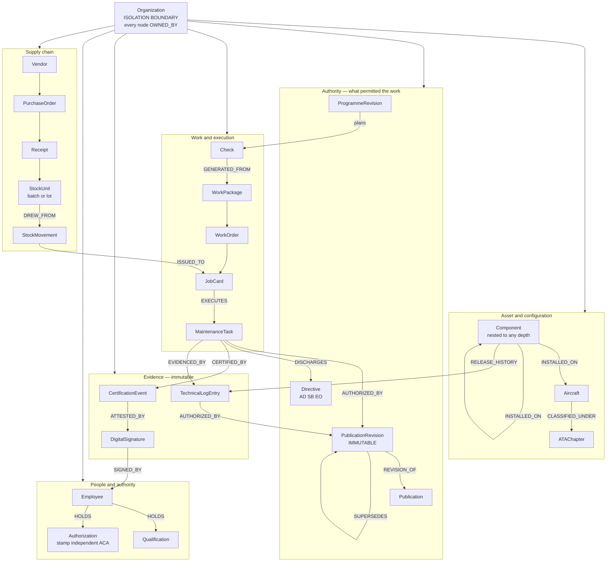
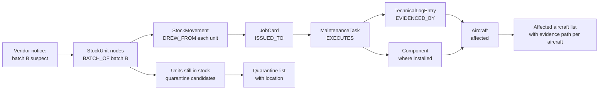
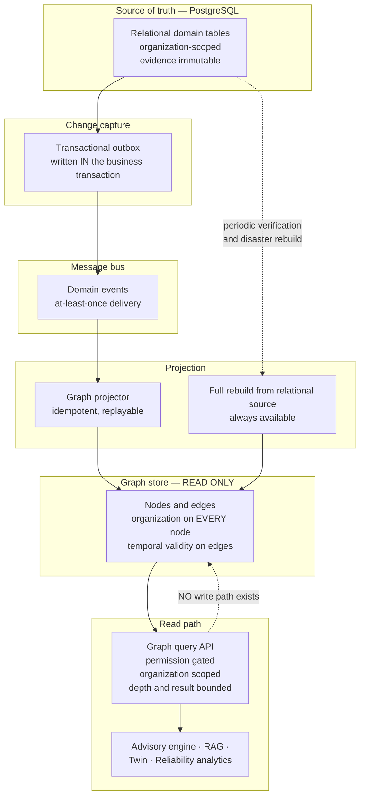
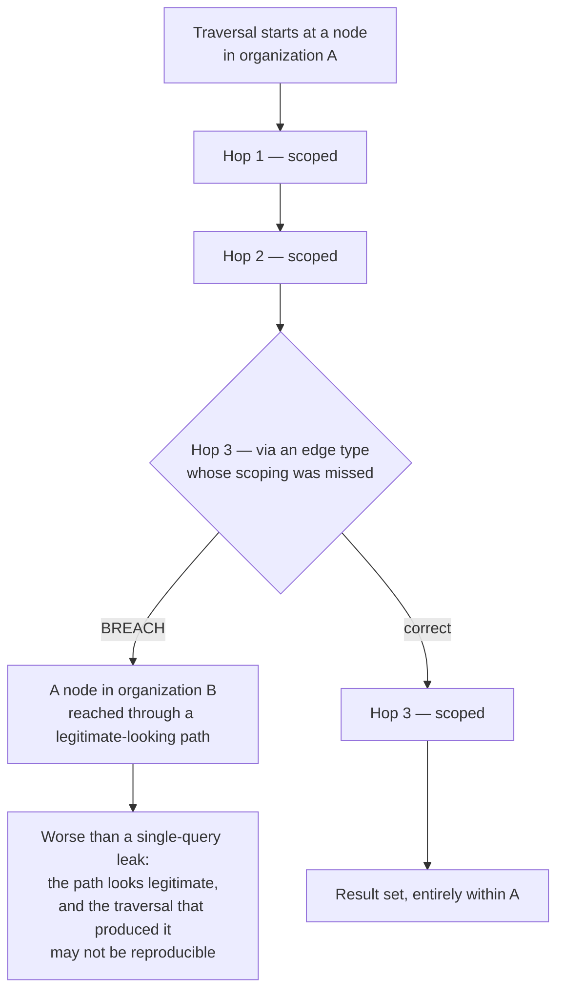
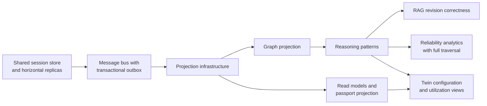

# Knowledge Graph — Mercury Aviation Enterprise Operating System

| Field | Value |
|-------|-------|
| Document | Knowledge graph — reasoning model over the digital thread |
| Product | Mercury Aviation Enterprise Operating System (AEOS) |
| Organization | Mercury Technologies |
| Layer | AI and analytics — the reasoning view of the digital thread |
| Audience | Architects, data engineers, engineering and reliability teams, auditors, integrators |
| Status | Living baseline — **blueprint. No graph store exists in the runtime** |
| Companion documents | [AI Strategy](AI_Strategy.md) · [Digital Twin](Digital_Twin.md) |
| Upstream authority | [Digital Thread](../04_Data/Digital_Thread.md) · [Technical Architecture](../02_Architecture/Technical_Architecture.md) · [SECURITY.md](../../SECURITY.md) |

---

## 0. Read this first

**There is no graph database, no triple store, and no graph query engine in Mercury today.**

What exists is the **relational digital thread**: every configuration, task, part, signature, publication revision, movement, and shipment linked by persisted foreign keys, organization-scoped, indexed for traversal. That is a real graph in the mathematical sense, stored relationally, and it is genuinely queryable today by joins.

This document specifies the **reasoning layer** Mercury intends to build over it: the node and edge model, the reasoning patterns it enables, and how it must be projected without compromising isolation or evidence integrity. Everything beyond §4 is **Planned**.

### Relationship to the data-layer document

| Document | Owns |
|----------|------|
| [Digital Thread](../04_Data/Digital_Thread.md) | The **authoritative edge catalogue** — which records reference which, in the relational model |
| [Knowledge Graph — data view](../04_Data/Knowledge_Graph.md) | The **data-layer** graph representation: entity and relationship modelling as a data concern |
| **This document** | The **reasoning view**: what questions the graph answers, the traversal patterns, projection design, and the AI capabilities that depend on it |

Where this document and the data-layer documents appear to disagree, **the data-layer documents win** and this one is the defect. Terminology follows [Master Data](../04_Data/Master_Data.md). Raise an ADR rather than creating a second truth — the rule stated in the [Blueprint README](../../README.md).

---

## 1. Scope

### 1.1 In scope

The node and edge model over Mercury's digital thread; the reasoning questions a graph answers that relational joins answer badly; projection architecture and how the graph is kept current; isolation and permission enforcement in a graph context; how the graph supports retrieval and advisory capabilities; and the honest current state.

### 1.2 Out of scope

| Concern | Authoritative location |
|---------|------------------------|
| The authoritative edge catalogue | [Digital Thread](../04_Data/Digital_Thread.md) |
| Data-layer entity and relationship modelling | [Knowledge Graph — data view](../04_Data/Knowledge_Graph.md) · [Data Model](../04_Data/Data_Model.md) |
| Advisory-only principle and AI governance | [AI Strategy](AI_Strategy.md) |
| Configuration and utilization visualization | [Digital Twin](Digital_Twin.md) |
| Isolation, permissions, audit specifications | [Identity](../06_Security/Identity.md) · [RBAC](../06_Security/RBAC.md) · [Audit](../06_Security/Audit.md) |
| Evidence immutability and signature semantics | [Digital Signatures](../06_Security/Digital_Signatures.md) |
| Projection and message bus mechanics | [Technical Architecture](../02_Architecture/Technical_Architecture.md) |

### 1.3 Honesty markers

| Marker | Meaning |
|--------|---------|
| **Current** | In the runtime, exercised by tests |
| **Current, relational** | Real and queryable today, by joins over the relational model |
| **Planned** | Designed here, not built |
| **Never** | Deliberately excluded by architectural commitment |

---

## 2. Design principles

| # | Principle | Consequence |
|---|-----------|-------------|
| 1 | **The graph is a projection, never the source of truth.** | The relational database holds the record. The graph is derived, rebuildable, and disposable. If they disagree, the relational store is right and the graph is stale. |
| 2 | **The graph is read-only.** | No write path exists through the graph. Evidence, signatures, logbook entries, and movements are written only through the domain services that enforce their invariants. |
| 3 | **Organization scoping is structural, not filtered.** | Every node carries its organization, and every traversal is confined to it. A multi-hop path that leaves the organization is not a query result — it is an isolation breach. |
| 4 | **Permissions apply to graph reads.** | A traversal returns only what the caller could have read through the API. The graph is not a bypass. |
| 5 | **Edges mirror persisted references.** | Every edge corresponds to a real foreign-key relationship. **No inferred edges in the evidence layer.** |
| 6 | **Inference is separated and labelled.** | Derived or probabilistic edges, if introduced, live in a distinct layer and are never presented as evidence. |
| 7 | **Temporal correctness is mandatory.** | Aviation questions are almost always "as at a date". A graph that only knows the present cannot answer what authorized work performed two years ago. |
| 8 | **Traversal is bounded.** | Depth and result limits are enforced server-side. An unbounded traversal over an aircraft's history is a denial-of-service vector. |
| 9 | **Advisory only.** | Graph reasoning informs humans. It never certifies, releases, or determines applicability. See [AI Strategy §3](AI_Strategy.md#3-the-advisory-only-principle). |
| 10 | **Build only when the relational model genuinely cannot answer.** | A graph store is infrastructure with real cost. It is justified by traversal depth and shape, not by the appeal of the idea. |

---

## 3. Why a graph, and why not yet

### 3.1 What relational joins do well

Mercury's digital thread is already traversable, and most questions operators actually ask are answered well by joins:

| Question | Relational answer |
|----------|------------------|
| What components are installed on this aircraft? | An indexed query on the components table |
| What authorized this maintenance action? | A join from the logbook entry to the publication revision, plus the snapshot in the entry itself |
| Who signed each step of this task? | A query on certification events, joined to signatures |
| Which purchase order bought this installed part? | A fixed-length chain of joins — see [Technical Architecture §6.7](../02_Architecture/Technical_Architecture.md#67-traceability-chain) |
| What is due on this aircraft in the next 30 days? | A planning forecast query |

**"Given a part installed on an aircraft, the chain back to the purchase order that bought it is a series of joins, not an investigation."** That is a **Current, relational** property, and it is why Mercury has not needed a graph store to be useful.

### 3.2 What relational joins do badly

Graphs earn their cost on queries with **variable-depth** or **path-shaped** answers:

| Question | Why joins struggle |
|----------|-------------------|
| Every component that has ever been installed on this aircraft, including sub-assemblies at any nesting depth, with each installation period | Recursive traversal of unknown depth, with temporal validity on every hop |
| Every aircraft in the fleet affected by a vendor batch, reached through any assembly path | Variable-depth reverse traversal from a batch to many aircraft |
| The complete evidence path from a directive to every task, signature, and logbook entry that discharged it | Path enumeration, not row retrieval |
| Every person who touched any part of a specific assembly over its life, in any role | Fan-out across tasks, roles, and time, with the assembly boundary itself moving |
| Which publication revisions were in force for this aircraft's configuration on a given date | Intersection of configuration validity and revision effectivity, both time-varying |
| If this component is found defective, what else shares its failure-relevant context — same batch, same shop visit, same technician, same tooling | Multi-hop similarity across several relationship types at once |
| Explaining **how** two records are connected, when the path is not known in advance | The answer *is* the path; SQL is poor at returning paths |

The last row is the strategic one. An advisory system must show its reasoning, and reasoning is a **path**. A graph returns paths natively; a relational query returns rows and leaves path reconstruction to the application.

### 3.3 The honest cost assessment

| Cost | Detail |
|------|--------|
| New infrastructure | A graph store to operate, back up, secure, and patch |
| A second isolation surface | Organization scoping must be enforced again, in a different technology, correctly |
| Projection lag | The graph is eventually consistent with the record. Acceptable for reasoning, **never** acceptable for certification decisions |
| Rebuild capability required | A projection that cannot be rebuilt from the relational source is a liability, not an asset |
| Skills | Graph modelling and query tuning are distinct disciplines |
| Duplication of the model | The graph model and the relational model must be kept consistent, or they diverge |

**Therefore: the graph is built when a demonstrated need exists**, recorded in an ADR, following the same discipline Mercury applies to service extraction — see [Technical Architecture §12.6](../02_Architecture/Technical_Architecture.md#126-when-and-how-extraction-would-happen). Not because graphs are fashionable.

### 3.4 The prerequisite that is not about graphs at all

A graph projection must be kept current, which requires a **message bus with a transactional outbox** — because polling the entire relational model to refresh a graph does not scale, and coupling graph updates synchronously to the write path would put projection failures on the certification transaction.

That bus is itself downstream of the shared session store and horizontal replicas described in [Technical Architecture §15.2](../02_Architecture/Technical_Architecture.md#152-scaling-levers-in-dependency-order). **The knowledge graph is therefore several platform milestones away, and saying so is more useful than a roadmap that pretends otherwise.**

---

## 4. The node and edge model

### 4.1 Node types

Every node is organization-scoped. Node types mirror domain aggregates, so the graph speaks the same ubiquitous language as [Domain Architecture](../02_Architecture/Domain_Architecture.md).

| Domain | Node types |
|--------|-----------|
| **Tenancy** | Company, Organization, Site, Department, Team |
| **People** | User, Employee, Qualification, Authorization, InspectionStamp |
| **Fleet** | Aircraft, AircraftModel, Manufacturer, Fleet |
| **Configuration** | Component, ComponentType, ATAChapter, ConfigurationPosition |
| **Publications** | PublicationType, Publication, PublicationRevision |
| **Maintenance** | MaintenanceTask, CertificationEvent, DigitalSignature, TechnicalLogEntry |
| **Execution** | WorkPackage, WorkOrder, JobCard |
| **Planning** | MaintenanceProgramme, ProgrammeRevision, MPDTask, Directive, MELItem, Check, Forecast, HangarPlan, WorkforcePlanLine |
| **Logistics** | PartMaster, StockUnit, StockBalance, StockMovement, Location, Warehouse, Tool, Vendor, PurchaseRequest, RFQ, Quote, PurchaseOrder, Receipt, Shipment, Reservation |
| **Accountability** | AuditEvent, Approval, Incident, Alert |

### 4.2 Edge types

Edges mirror persisted references. The authoritative catalogue is [Digital Thread](../04_Data/Digital_Thread.md); this is the reasoning-relevant summary.

| Edge | From → To | Reasoning value |
|------|-----------|-----------------|
| `OWNED_BY` | Any tenant-owned node → Organization | **The isolation edge. Present on every node without exception** |
| `INSTALLED_ON` | Component → Aircraft or parent Component | Configuration, with validity period |
| `REMOVED_FROM` | Component → Aircraft or parent Component | Configuration history |
| `OF_TYPE` | Component → ComponentType; Aircraft → AircraftModel | Type-level reasoning and applicability |
| `CLASSIFIED_UNDER` | Task, Publication, Component → ATAChapter | The standardized navigation axis of aviation |
| `AUTHORIZED_BY` | MaintenanceTask, TechnicalLogEntry → PublicationRevision | **What authorized the work. The most important evidence edge** |
| `REVISION_OF` | PublicationRevision → Publication | Document identity |
| `SUPERSEDES` | PublicationRevision → PublicationRevision | Revision history and temporal validity |
| `EXECUTES` | JobCard → MaintenanceTask | Shop floor bound to certification lifecycle |
| `PART_OF` | JobCard → WorkOrder → WorkPackage | Execution hierarchy |
| `CERTIFIED_BY` | MaintenanceTask → CertificationEvent | The ordered record of who did what |
| `ATTESTED_BY` | CertificationEvent → DigitalSignature | The act bound to its attribution |
| `SIGNED_BY` | DigitalSignature → Employee | **Attribution to a named person** |
| `HOLDS` | Employee → Qualification, Authorization, InspectionStamp | Authority, with validity period |
| `BOUND_TO` | Employee → User | The certification identity binding |
| `EVIDENCED_BY` | MaintenanceTask → TechnicalLogEntry | The permanent record |
| `AMENDS` | TechnicalLogEntry → TechnicalLogEntry | Append-only correction chain |
| `RELEASE_HISTORY` | Component → TechnicalLogEntry | The component's own life record |
| `GENERATED_FROM` | WorkPackage → Check | Planning to execution |
| `PLANNED_UNDER` | Check → ProgrammeRevision | Programme compliance |
| `DISCHARGES` | MaintenanceTask → Directive | AD, SB, or EO compliance |
| `APPLIES_TO` | Directive, MPDTask → AircraftModel, ComponentType | Applicability |
| `DEFERRED_UNDER` | MaintenanceTask → MELItem | Deferral chain |
| `RESERVED_FOR` | Reservation → JobCard, WorkPackage, plan line | Material commitment |
| `ISSUED_TO` | StockMovement → JobCard | **Part consumption — where supply meets maintenance** |
| `DREW_FROM` | StockMovement → StockUnit | Physical unit traceability |
| `RECEIVED_UNDER` | StockUnit → Receipt → PurchaseOrder | Part provenance |
| `SUPPLIED_BY` | PurchaseOrder → Vendor | Vendor traceability |
| `BATCH_OF` | StockUnit → batch or lot identity | **Batch recall traversal** |
| `AUDITED_BY` | Any node → AuditEvent | What happened, and who tried |

### 4.3 The shape of the graph

### 4.4 Temporal edges

Aviation questions are "as at a date", so validity is a first-class property of an edge rather than an afterthought.

| Edge | Temporal property | Why it matters |
|------|------------------|----------------|
| `INSTALLED_ON` | Installed at, removed at | A component's position changes; history is the record |
| `HOLDS` | Granted at, expires at, status | **Authority must be evaluated at the moment of signing**, not now |
| `SUPERSEDES` | Effective date | Which revision was in force on a given date |
| `RESERVED_FOR` | Reserved at, consumed or released at | Material commitment over time |
| `APPLIES_TO` | Applicability window | Directives apply to configuration ranges over time |

**A graph that only knows the present cannot answer the questions an auditor asks.** "What authorized this work?" and "did this person hold that authority then?" are both temporal, and both are exactly what an investigation turns on. Temporal edges are therefore not an enhancement to add later — they are a modelling requirement from the first version.

---

## 5. Reasoning patterns

All patterns are **Planned**. Each states the question, the traversal, and the honest limit.

### 5.1 Full configuration history at any depth

| Aspect | Detail |
|--------|--------|
| Question | Every component ever installed on this aircraft, at any nesting depth, with each installation period |
| Traversal | Recursive reverse `INSTALLED_ON` from the aircraft, retaining temporal validity on each hop |
| Relational difficulty | Recursion of unknown depth with temporal filtering at every level |
| Advisory only? | Not advisory — this is **retrieval of recorded fact**. No inference, so it is evidence-grade if the projection is current |
| Honest limit | Only as complete as recorded installation history. A component installed before the organization adopted Mercury has no edge, and the graph must **show the gap** rather than imply continuity |

That last point generalizes: a graph over incomplete history must make incompleteness visible. A traversal that silently returns a partial answer is worse than one that refuses.

### 5.2 Batch and vendor recall traversal

| Aspect | Detail |
|--------|--------|
| Question | Which aircraft have parts from a suspect batch, and which units remain in stock? |
| Value | The clearest justification for a graph. Today this is a multi-step investigation; with a graph it is one traversal returning **both** the affected aircraft and the evidence path to each |
| Advisory | The **list** is factual. The **decision** to ground an aircraft or quarantine stock is a human airworthiness determination |
| Honest limit | Depends on batch and lot identity being recorded at receipt. Where a part was received without batch identity, the traversal cannot reach it, and **must report that blind spot explicitly** |

### 5.3 Directive compliance path

| Aspect | Detail |
|--------|--------|
| Question | Show every task, signature, and logbook entry that discharged this directive across the fleet, and what remains open |
| Traversal | `DISCHARGES` from the directive to tasks, then to certification events, signatures, and logbook entries; `APPLIES_TO` to determine the applicable population |
| Value | Compliance status with its evidence attached, rather than a status field asserting compliance |
| Advisory | The **evidence path** is factual. **Applicability determination is never AI** — it is an engineering decision. See [AI Strategy §3.1](AI_Strategy.md#31-the-commitment) |

### 5.4 Authority at a point in time

| Aspect | Detail |
|--------|--------|
| Question | Did this person hold the authority this signature required, on the date they signed? |
| Traversal | From signature to employee, then temporal `HOLDS` edges filtered to the signing date |
| Value | Answers an audit question directly. Today it requires reconstruction — see [RBAC §9.3](../06_Security/RBAC.md#93-auditability) |
| Honest limit | Requires authority history to be retained, not merely current state. This is the **point-in-time authority projection** listed in [Audit §12](../06_Security/Audit.md#12-future-enhancements) and it must be built before this pattern can be trusted |

### 5.5 Revision-correct publication retrieval

| Aspect | Detail |
|--------|--------|
| Question | Which revision was in force for this aircraft's configuration on this date? |
| Traversal | `SUPERSEDES` chain filtered by effective date, intersected with configuration validity via `OF_TYPE` and `INSTALLED_ON` |
| Value | **The correctness backbone of RAG over publications.** Retrieving the newest revision when a superseded one was in force would surface wrong instructions — the single worst failure available to a publication assistant |
| Dependency | [AI Strategy §6.2](AI_Strategy.md#62-retrieval-augmented-generation-over-publications) depends on this pattern |

### 5.6 Defect similarity and prior resolution

| Aspect | Detail |
|--------|--------|
| Question | Has a comparable defect occurred before, and how was it resolved? |
| Traversal | Multi-hop similarity across ATA classification, component type, aircraft model, batch, shop visit, and operating context, returning prior tasks with their evidence |
| Value | Institutional knowledge becomes searchable and **cited to the actual job cards**, rather than remembered by whoever is on shift |
| Advisory | **Strictly advisory.** A prior resolution is a starting point, not an authorization. The technician works from the publication |
| Honest limit | Similarity is a heuristic. A superficially similar defect can have a different root cause, and the output must present prior cases as *cases*, never as a diagnosis |

### 5.7 Explaining a connection

| Aspect | Detail |
|--------|--------|
| Question | How is this record connected to that one? |
| Traversal | Shortest or all bounded paths between two nodes |
| Value | This is what makes graph reasoning **explainable by construction**: the answer *is* the path, and a reviewer can walk it hop by hop |
| Why it matters | [AI Strategy §2](AI_Strategy.md#2-design-principles) requires explainability as a precondition. A graph path is the most auditable explanation format available — it is a chain of persisted facts, not a generated rationale |

### 5.8 Patterns deliberately excluded

| Excluded | Reason |
|----------|--------|
| Inferred edges in the evidence layer | An edge that does not correspond to a persisted reference is not evidence. Inference belongs in a separate, labelled layer |
| Graph-derived applicability determination | An engineering decision with regulatory weight |
| Graph-driven automatic status change | The graph is read-only |
| Graph-derived certification or release | **Never** — see [AI Strategy §3](AI_Strategy.md#3-the-advisory-only-principle) |
| Cross-organization traversal | An isolation breach, not a feature. Legitimate cross-organization visibility is an explicit, scoped, audited grant |

---

## 6. Projection architecture

### 6.1 How the graph would be built and kept current

### 6.2 Projection requirements

| # | Requirement | Reason |
|---|-------------|--------|
| 1 | The outbox row is written **inside the business transaction** | A fire-and-forget publish can lose an event and silently corrupt the projection. This mirrors the audit rule in [Audit §11.3](../06_Security/Audit.md#113-what-must-survive-any-audit-scaling-change) |
| 2 | The projector is **idempotent** | At-least-once delivery means duplicates are normal, not exceptional |
| 3 | Full rebuild from the relational source is **always available and periodically exercised** | A projection that has never been rebuilt is a projection nobody knows how to rebuild |
| 4 | Projection lag is **measured and exposed** | A consumer must be able to know how stale the answer is |
| 5 | Every node carries its organization at creation | Retrofitting isolation is how isolation bugs are made — the same rule as [SECURITY.md §4.1](../../SECURITY.md#41-the-isolation-model) |
| 6 | Projection failure must **not** fail the business transaction | A graph problem must never stop a technician signing work |
| 7 | Stale-projection detection with an explicit degraded state | Consumers should refuse to answer confidently over a badly lagged graph, consistent with the degradation honesty in [AI Strategy §4.2](AI_Strategy.md#42-the-advisory-engine-honestly-described) |
| 8 | Periodic verification against the relational source | The graph equivalent of the balance-versus-movement reconciliation in [Technical Architecture §6.6](../02_Architecture/Technical_Architecture.md#66-ledger-properties) |

Requirements 1 and 6 together are the crux: the graph must be **reliably** fed without becoming a dependency of the write path. The outbox is what makes both true simultaneously.

### 6.3 Why not a graph-native primary store

| Reason | Detail |
|--------|--------|
| Transactional integrity of the release chain | Release plus logbook plus component history is atomic in one relational transaction. That atomicity is a **safety** property — see [Digital Signatures §6.4](../06_Security/Digital_Signatures.md#64-atomicity--release-and-logbook-together) |
| Immutability guarantees | Append-only evidence and ledger semantics are well understood relationally, and database-enforced append-only is the planned hardening |
| Isolation maturity | Organization scoping is enforced, tested, and reviewed relationally today |
| Operational simplicity | Fewer moving parts means fewer ways to be down when a technician needs to sign a release |
| Reversibility | A derived graph can be dropped and rebuilt. A primary graph cannot be un-chosen |

**The relational store keeps the record; the graph makes it navigable.** That division is deliberate and is not expected to change.

---

## 7. Isolation and permissions in a graph context

### 7.1 The isolation problem is genuinely harder here

A relational query has one `WHERE organization_id = ...` clause and a test that proves it. A **multi-hop traversal** must remain within the organization at **every** hop, and a single unscoped edge type is enough to walk out of the tenant.

### 7.2 Required controls

| # | Control | Detail |
|---|---------|--------|
| 1 | Organization on **every** node, without exception | Including reference and master-data nodes where tenant-owned |
| 2 | Organization predicate on **every** hop | Not only at the entry point |
| 3 | Per-organization partitioning or labelling in the store | Structural separation, so a scoping omission cannot silently succeed |
| 4 | Permission filtering on node types | A caller without `personnel.read` does not traverse to Employee nodes, and without `audit.read` does not traverse to AuditEvent nodes |
| 5 | Bounded depth and result size, enforced server-side | An unbounded traversal is a denial-of-service vector, and a client-supplied limit is not trusted |
| 6 | Absence is not informative | A node in another organization is **not found**, matching the `404` rule in [Identity §5.3](../06_Security/Identity.md#53-why-another-organizations-record-returns-404) |
| 7 | Graph queries are audited | Especially broad traversals, which are the reconnaissance shape |
| 8 | Isolation tests per **edge type**, not per query | The unit of risk is the edge, because one unscoped edge type compromises every traversal that uses it |

Control 8 is the one that would actually prevent the failure in §7.1, and it is the kind of requirement that is cheap to state now and expensive to retrofit.

### 7.3 Shared reference data

Some reference data is legitimately global: ATA chapters, manufacturers, aircraft models, standard part classifications.

| Rule | Detail |
|------|--------|
| Global reference nodes are explicitly marked as such | Their globality is a declared property, never an accident of a missing organization value |
| A traversal may pass **through** a global node | Reaching an ATA chapter is fine |
| A traversal must **not** exit a global node into another organization | Arriving at ATA 32 must not lead to another operator's brake components. **This is the single most likely graph isolation bug in Mercury**, because global nodes are high-degree hubs |
| Global nodes are read-only in the graph | As is everything else |

---

## 8. Non-functional requirements

### 8.1 Correctness

| Requirement | Position |
|-------------|----------|
| The digital thread is complete and traversable relationally | **Current, relational** |
| Every edge corresponds to a persisted reference | **Current, relational** |
| Evidence records are immutable | **Current** — see [Audit §6](../06_Security/Audit.md#6-evidence-immutability) |
| Immutable revisions with effective dates support temporal queries | **Current** |
| Graph store | **Planned** |
| Temporal edge validity | **Planned** |
| Idempotent, replayable projection with full rebuild | **Planned** |
| Projection lag measured and exposed | **Planned** |
| Per-edge-type isolation tests | **Planned** |
| Periodic graph-versus-relational verification | **Planned** |
| Inferred edges kept out of the evidence layer | **Planned as a design constraint** |

### 8.2 Performance

| Concern | Current baseline | Aspirational enterprise target |
|---------|-----------------|-------------------------------|
| Fixed-depth traceability query | Indexed relational joins | Unchanged — relational stays the right tool for fixed-shape queries |
| Configuration history to full depth | Recursive relational query, cost grows with depth | Under 1 second for an aircraft with 5,000 component-history records |
| Batch recall traversal across a fleet | A multi-step investigation today | Under 3 seconds for a 200-aircraft fleet |
| Directive compliance path across a fleet | Aggregate query | Under 2 seconds |
| Authority-at-a-point-in-time | Requires reconstruction | Under 200 ms |
| Revision-correct retrieval scoping | Not applicable | Under 500 ms |
| Path explanation between two nodes | Not applicable | Under 1 second, bounded depth |
| Projection lag | Not applicable | Under 30 seconds at the 95th percentile; **degraded state declared beyond 5 minutes** |
| Full rebuild | Not applicable | Under 4 hours for a large tenant, exercised quarterly |
| **Effect of graph unavailability on core workflows** | **None** | **Unchanged — a hard requirement** |

### 8.3 Durability

| Concern | Position |
|---------|----------|
| Graph durability requirement | **Low, deliberately.** It is a projection. Losing it entirely costs a rebuild, not evidence |
| RPO for the graph | Not applicable — rebuildable from the relational source |
| RTO for the graph | Bounded by rebuild time, and no core workflow waits on it |
| The relational source | **RPO 0** for evidence — see [Technical Architecture §13.4](../02_Architecture/Technical_Architecture.md#134-durability-and-recoverability) |
| Backup of the graph | Optional. **A backup that is slower to restore than a rebuild is not worth keeping** |

Stating the graph's durability requirement as *low* is the correct engineering position and a useful signal: a derived store that is treated as precious has quietly become a source of truth.

---

## 9. Security considerations

**The graph is read-only, and that removes most of the risk surface.** No write path exists. Evidence, signatures, logbook entries, and movements are written only through domain services that enforce their invariants. A graph that could write would be a route around every check in [Digital Signatures §4.3](../06_Security/Digital_Signatures.md#43-the-invariants-restated-as-a-table).

**Multi-hop isolation is the central risk, and it is worse than a relational leak.** One unscoped edge type compromises every traversal that uses it, the resulting path looks legitimate, and the query that produced it may not be reproducible. This is why scoping is required at every hop, why the store must partition by organization structurally, and why isolation tests are specified per edge type rather than per query.

**Global reference nodes are the most likely breach vector.** They are high-degree hubs — an ATA chapter connects to work across every tenant. Passing through is fine; exiting into another organization is a breach. Any traversal that reaches a global node must re-apply the originating organization constraint on exit.

**Permission filtering must apply to node types, not only to entry points.** A caller without `personnel.read` must not reach Employee nodes even when the traversal started somewhere they are entitled to. Otherwise the graph becomes a permission-bypass with extra steps.

**Unbounded traversal is a denial-of-service vector.** An aircraft's full history over decades is a large object. Depth and result limits are enforced server-side, and a client-supplied limit is clamped — the same discipline as list endpoints in [Technical Architecture §15.3](../02_Architecture/Technical_Architecture.md#153-query-level-scaling).

**Broad traversals are the reconnaissance shape and must be audited.** An unusually wide or deep query is what data exfiltration looks like in a graph, and it is only visible if graph reads are recorded.

**Projection lag must never be mistaken for fact.** A graph is eventually consistent. Acceptable for reasoning and investigation; **never** acceptable as the basis for a certification decision. Certification reads the relational record, always. A consumer must be able to see the lag and must refuse to answer confidently over a stale graph.

**Inferred edges must never enter the evidence layer.** An edge that does not correspond to a persisted reference is a hypothesis. Presenting one as evidence would corrupt the airworthiness record with a guess.

**The graph does not weaken the advisory-only commitment.** Better reasoning does not create authority. No traversal, however conclusive, can certify, release, or determine applicability. See [AI Strategy §3](AI_Strategy.md#3-the-advisory-only-principle).

**Incompleteness must be visible.** A traversal over history that predates Mercury adoption, or over units received without batch identity, must **state the gap**. A partial answer presented as complete is the most dangerous output a recall traversal can produce.

**Known knowledge-graph security debt**, tracked openly: no graph exists, so no controls are implemented; per-edge-type isolation testing is unproven; global reference node exit scoping is designed but unbuilt; graph read auditing is unbuilt; and projection lag exposure is unbuilt.

---

## 10. Scalability

### 10.1 Dependency chain

**The graph is several platform milestones away.** Every prerequisite is platform work that benefits the whole system, which is the honest way to sequence it.

### 10.2 Graph-specific scaling levers

| # | Lever | Unlocks | Cost |
|---|-------|---------|------|
| 1 | Per-organization partitioning | Isolation plus locality — a tenant's traversal touches only its own partition | Partition management |
| 2 | Incremental projection from domain events | Currency without full rebuilds | Message bus, idempotent projector |
| 3 | Materialized common paths | Frequent traversals answered without walking | Staleness management |
| 4 | Temporal snapshot indexes | "As at a date" queries without scanning validity ranges | Index maintenance |
| 5 | Bounded traversal with early termination | Predictable cost per query | Query planning |
| 6 | Graph read replicas | Analytical traversal load isolated from interactive queries | Replication lag, acceptable |
| 7 | Cold-history archival with on-demand rehydration | The hot graph stays small while decades of history remain reachable | Archival tooling |
| 8 | Query result caching keyed by organization and entitlement | Repeated traversals cost once | Invalidation, plus the isolation hazard in [AI Strategy §7.2](AI_Strategy.md#72-the-isolation-risk-unique-to-ai) |

### 10.3 What must survive any graph scaling change

- Organization scoping at **every** hop, on every replica and partition.
- Permission filtering by node type.
- Read-only semantics — no write path, ever.
- Bounded depth and result size.
- Rebuildability from the relational source.
- Temporal correctness, including authority as at a date.
- **Graph unavailability having no effect on core workflows.**
- Advisory-only. No traversal creates authority.

---

## 11. Future enhancements

| # | Enhancement | Value | Depends on |
|---|-------------|-------|------------|
| 1 | Message bus with a transactional outbox | The prerequisite for any projection | Platform scaling work |
| 2 | Graph projection with organization partitioning and temporal edges | The foundation | Item 1, plus an ADR justifying the store |
| 3 | Idempotent, replayable projector with exercised full rebuild | A projection that can always be recovered | Item 2 |
| 4 | Projection lag measurement and an explicit degraded state | Consumers know how stale the answer is, and refuse when it is too stale | Item 2 |
| 5 | Per-edge-type isolation test suite | Prevents the multi-hop breach in §7.1 | Item 2 |
| 6 | Bounded traversal query API, permission-gated and audited | Safe access | Items 2 and 5 |
| 7 | Full configuration history traversal | Complete asset history at any depth, with gaps shown | Item 6 |
| 8 | Batch and vendor recall traversal | The clearest operational win, with blind spots reported | Item 6 |
| 9 | Directive compliance path with attached evidence | Compliance status backed by evidence rather than asserted | Item 6 |
| 10 | Point-in-time authority projection | Answers the core audit question directly | Item 6, plus [Audit §12](../06_Security/Audit.md#12-future-enhancements) |
| 11 | Revision-correct retrieval scoping | The correctness backbone of RAG over publications | Item 6 |
| 12 | Path explanation between any two nodes | Explainability as a first-class output | Item 6 |
| 13 | Defect similarity and prior-resolution retrieval | Institutional knowledge, searchable and cited | Items 7 and 11 |
| 14 | Aircraft passport projection over the graph | Lessors, authorities, and buyers read one coherent view | Items 7 and 9 |
| 15 | Separate, labelled inference layer for derived edges | Probabilistic reasoning without contaminating evidence | Items 2 and 12 |
| 16 | Periodic graph-versus-relational verification | Detects silent projection drift | Item 3 |
| 17 | Cold-history archival with rehydration | Decades of history stay reachable at sustainable cost | Item 2 |
| 18 | Graph read auditing with broad-traversal alerting | Exfiltration-shaped queries become visible | Item 6 |

---

## 12. Related documents

**Within the AI set**
[AI Strategy](AI_Strategy.md) · [Digital Twin](Digital_Twin.md)

**Data and digital thread — authoritative for structure**
[Digital Thread](../04_Data/Digital_Thread.md) · [Knowledge Graph — data view](../04_Data/Knowledge_Graph.md) · [Data Model](../04_Data/Data_Model.md) · [Master Data](../04_Data/Master_Data.md)

**Security**
[SECURITY.md](../../SECURITY.md) · [Identity](../06_Security/Identity.md) · [RBAC](../06_Security/RBAC.md) · [Audit](../06_Security/Audit.md) · [Digital Signatures](../06_Security/Digital_Signatures.md)

**Architecture**
[Technical Architecture](../02_Architecture/Technical_Architecture.md) · [Domain Architecture](../02_Architecture/Domain_Architecture.md) · [Enterprise Architecture](../02_Architecture/Enterprise_Architecture.md) · [System Context](../02_Architecture/System_Context.md)

**Governance**
[README](../../README.md) · [ROADMAP](../../ROADMAP.md) · [ADR register](../08_Standards/ADR/) · [Regulations documentation set](../09_Regulations/)

---

*Mercury Technologies — One Digital Thread. One Digital Aircraft Passport. One Aviation Enterprise Operating System.*
