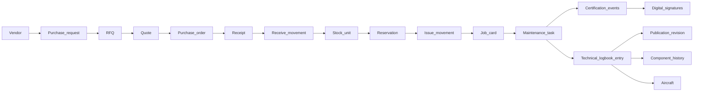

# ADR-0002 — Adopt the Digital Thread as the data and architecture spine

| Field | Value |
|-------|-------|
| Status | **Accepted** |
| Date | 2026-08-14 |
| Deciders | Lead architect, data architect, domain specialists (MRO, CAMO, OEM, lessor) |
| Affects | [Digital Thread](../../04_Data/Digital_Thread.md) · [Data Model](../../04_Data/Data_Model.md) · [Master Data](../../04_Data/Master_Data.md) · [Knowledge Graph](../../04_Data/Knowledge_Graph.md) · [Domain Architecture](../../02_Architecture/Domain_Architecture.md) · [Technical Architecture](../../02_Architecture/Technical_Architecture.md) · [API Standards](../API_Standards.md) |
| Supersedes | — |
| Superseded by | — |

---

## Context

Aviation maintenance software has a characteristic failure mode: it stores the right facts in the wrong relationship to each other. A work order exists, a part issue exists, a signature exists, a logbook entry exists — but the links between them are implied by timestamps, free-text references, and institutional memory rather than persisted as data. The consequences are familiar to anyone who has supported an audit, a lease return, or an aircraft sale:

- Establishing which publication revision authorised a specific task requires finding a person who remembers.
- Tracing an installed part back to the purchase order that bought it is a research project involving spreadsheets.
- Demonstrating that an inspection was genuinely independent requires reading signatures and reasoning about who is who.
- Producing a lease-return evidence pack takes weeks and produces a document set nobody can fully verify.
- An aircraft's configuration history is reconstructed rather than read.

Each of these is the same defect: **the connections between records were never first-class data.** They were narrative, and narrative does not survive staff turnover, system migration, or a determined auditor.

The alternative that Mercury adopts is the **Digital Thread**: the principle that every record which participates in an aircraft's life carries **persisted, queryable references** to the records it depends on, such that any question about provenance is answered by traversing links rather than by investigation. The corollary is the **Digital Aircraft Passport** — the single logical record of an aircraft's identity, configuration, life, and airworthiness evidence, which is not a separate document but a **view over a complete thread**.

The forces requiring an explicit architectural decision rather than an aspiration:

1. **A thread cannot be retrofitted.** If a module ships without persisting the reference that binds its records to the thread, the information is gone; it cannot be inferred later. Every module must therefore be built to thread from the start.

2. **The thread constrains the data model, the API, and the transaction boundary simultaneously.** It dictates that references are persisted rather than derived, that evidence is written atomically with the act it evidences, and that no record which participates in airworthiness may be created without its links.

3. **It is the platform's principal commercial differentiator.** [VISION.md](../../../VISION.md) leads with "One Digital Thread. One Digital Aircraft Passport." An OEM, an airline, a lessor, and an authority each buy the same underlying property: provenance that is queryable rather than assembled.

4. **It has direct regulatory value.** Records that establish what authorised a maintenance action, who performed it, who inspected it, and what was in force at the time are precisely what continuing-airworthiness oversight examines. See [Audit](../../06_Security/Audit.md) and [Digital Signatures](../../06_Security/Digital_Signatures.md).

---

## Decision

**Adopt the Digital Thread as the organising spine of Mercury's data model, architecture, and API contracts. Every record that participates in an aircraft's configuration, maintenance, supply, or airworthiness lifecycle persists explicit, queryable references to the records it depends on. Links are data, never narrative.**

The decision imposes six binding rules:

| # | Rule | Practical effect |
|---|------|-----------------|
| 1 | **Every domain record that participates in the lifecycle carries its provenance references as persisted columns** | A job card references its maintenance task; a movement references its demand source; a logbook entry references its publication revision, its component, and every signer |
| 2 | **A reference is never inferred from a timestamp, a code, or a free-text field** | "The revision current at that date" is not a link. The revision identifier is |
| 3 | **Evidence is written in the same transaction as the act it evidences** | A release without its logbook entry is an unrecorded release; there is no acceptable window in which one exists without the other |
| 4 | **Immutable anchors exist where the thread must not shift underneath history** | Publication revisions are immutable and superseded rather than edited, so a citation from 2019 still resolves to what the signer actually read |
| 5 | **A new module must state which thread edges it creates before it is built** | Part of the module checklist in [Coding Standards §4.2](../Coding_Standards.md#42-adding-a-module) and the [Domain Architecture](../../02_Architecture/Domain_Architecture.md) update obligation |
| 6 | **No module may own a link that crosses a boundary without the owning module knowing** | Cross-domain references are created through the owning service, which is what [ADR-0004](ADR-0004-repository-service-router.md) enforces |

The two arms of the thread that the platform maintains today:

Every hop above is a persisted reference. Given a part installed on an aircraft, the chain back to the purchase order that bought it is a series of joins, not an investigation.

The **Digital Aircraft Passport is a projection over this thread, not a separate record.** It is authoritative because the thread is complete, not because a document was assembled. A purpose-built read model for the passport is a performance optimisation, not a new source of truth.

---

## Consequences

### Positive

| Consequence | Detail |
|-------------|--------|
| **Provenance is a query** | "Which revision authorised this task", "who inspected this item", "which purchase order bought this part" are all joins |
| **Audit and oversight are served by design** | An authority's questions map onto traversals rather than onto document requests |
| **Lease return and aircraft sale become tractable** | Asset condition and evidence completeness are computable, which is a commercial capability, not a report |
| **Independence of inspection is demonstrable** | Each signer is a separate reference on the logbook entry, so distinctness is data rather than inference |
| **The knowledge graph and AI work has real substrate** | Every capability in [Knowledge Graph](../../04_Data/Knowledge_Graph.md) and [Digital Twin](../../07_AI/Digital_Twin.md) depends on the thread existing; a graph over incomplete links produces confident wrong answers |
| **Cross-domain reasoning is possible without integration** | Planning can see logistics reservations, and reliability can see the whole history of a component, because both are traversals of one thread |
| **The differentiator is structural** | A competitor can add a feature quickly; a competitor cannot retroactively create links their historic data never captured |

### Negative

| Consequence | Mitigation |
|-------------|-----------|
| **More columns, more foreign keys, more indexes** | Accepted deliberately. Every foreign key is indexed, because traversal is the platform's most common read shape |
| **Cross-aggregate transactions are unavoidable** | Two are deliberate and documented: certification release and package generation. See [Technical Architecture §12.4](../../02_Architecture/Technical_Architecture.md#124-where-the-monolith-shows) |
| **Service extraction is constrained** | A distributed architecture would have to provide an equivalent guarantee for the release chain, not an eventual one. This is a real cost of the decision and it is accepted — see [ADR-0009](ADR-0009-modular-monolith-before-services.md) |
| **Deletion becomes almost impossible** | A record another record references cannot simply disappear. This drives the soft-delete and immutability model in [ADR-0005](ADR-0005-immutable-audit-and-history.md) |
| **Data volume grows and never shrinks** | Time partitioning and an archive tier are planned; the ledgers are the fastest-growing tables in the platform |
| **A missing link is a permanent defect** | A module that ships without persisting a reference cannot be repaired later. This is why rule 5 exists, and why it is on the module checklist |
| **Write paths are slower than they would be otherwise** | Accepted. A release that writes a signature, a certification event, a logbook entry, and component history is doing necessary work |

### Operational

- Onboarding a customer's historic data requires deciding, per record, whether a link can be established honestly. Where it cannot, the record is loaded with its provenance marked as unknown rather than guessed — a guessed link is worse than an absent one.
- Data migration between Mercury versions must preserve every reference; a migration that drops a link destroys evidence.
- Reporting and dashboard queries fan out across modules today; purpose-built read models are the planned answer, and they are projections rather than alternative truths.

---

## Alternatives considered

### 1. Document-centric records — store scanned or generated documents as the evidence

**Rejected.** It is how much of the industry still operates, and it is exactly the failure mode described in the context. A document is not queryable, its internal references are not resolvable, and its integrity is not verifiable. Mercury stores structured records **and** can produce documents from them; the reverse is not possible.

### 2. Event sourcing as the primary model

**Considered seriously, rejected for now.** An append-only event log with projections would give complete history by construction, and it is philosophically close to what the thread wants. It was rejected because: the domain's read patterns are overwhelmingly relational and current-state oriented; projection rebuild complexity is a poor trade for a platform whose evidence must be available immediately and correctly; and aviation reviewers understand relational records with foreign keys far better than they understand an event log and its projections. Mercury takes the valuable part of the idea — **append-only ledgers and immutable evidence for the records where history is the point** — without adopting event sourcing wholesale.

### 3. A graph database as the primary store

**Rejected as the primary store, retained as a future read model.** The thread is a graph, so the fit is genuine. It was rejected because Mercury also needs transactional integrity across aggregates, fixed-precision decimal arithmetic, mature migration tooling, and operational familiarity — all of which PostgreSQL provides and a graph store provides less well. [Knowledge Graph](../../04_Data/Knowledge_Graph.md) describes graph capability as a projection over the relational thread, which is the correct layering.

### 4. Derive relationships at query time from timestamps and business codes

**Rejected, emphatically.** This is the cheapest option and the one that produces the failure mode Mercury exists to eliminate. "The revision in force on that date" is a reconstruction, and it is wrong whenever a revision was superseded mid-task, whenever a date is recorded in the wrong time zone, and whenever a code was reused. An auditor asking "how do you know" would receive an argument rather than a record.

### 5. Persist links only for the safety-critical chain, leaving supply and planning loosely coupled

**Rejected.** It is a defensible scoping decision and it was genuinely considered, because the supply arm is the more expensive half to build. It was rejected because the questions that matter commercially cross the boundary: a lessor asks whether the part installed on their asset was traceably sourced; a reliability engineer asks whether a repeat failure correlates with a vendor or a batch. Cutting the thread at the hangar door removes precisely the answers that distinguish Mercury from a maintenance tracker. See [ADR-0007](ADR-0007-logistics-as-integrated-program.md), which is the same decision applied to logistics.

### 6. A separate data warehouse holding the relationships for analysis

**Rejected as a substitute, retained as a complement.** A warehouse can answer analytical questions, but it is a copy: it is behind, it is not the record, and no authority accepts a derived analytical store as airworthiness evidence. The thread must exist in the operational store. A warehouse fed from it is legitimate for analytics.

---

## Compliance and security impact

| Concern | Impact |
|---------|--------|
| **Isolation** | Every thread edge is within one organization, and every traversal is organization-scoped. A reference that crossed a tenancy boundary would be an isolation defect; cross-organization visibility is a deliberate, audited, administrator-only act. See [ADR-0003](ADR-0003-org-isolation-multitenancy.md) |
| **RBAC** | Traversal does not confer access. A user who may read a job card does not thereby gain access to the purchase order it links to; each read is permission-gated on its own module. This must remain true as passport read models are built — a projection must not become an authorization bypass |
| **Audit** | **Strongly positive.** The thread and the audit trail are complementary: audit records who did what and when; the thread records what depends on what. Together they answer both "who" and "on what basis" |
| **Signatures** | The thread is what gives a signature its meaning. A signature that did not reference a task, a step, an employee, and — through the release chain — a publication revision would attest to very little. See [Digital Signatures](../../06_Security/Digital_Signatures.md) |
| **Evidence integrity** | The thread makes gaps visible: a logbook entry without a revision reference, or a task without a certification chain, is detectable by query. This is a genuine integrity control, and it is stronger than any inspection of individual records |
| **Regulatory evidence** | Directly supports the continuing-airworthiness expectations that records establish what authorised an action, who performed it, and that inspection was independent. Stated with its current limits in [Audit §8](../../06_Security/Audit.md) |
| **Data protection** | The thread links people to acts, permanently and by design. That is a regulatory requirement for maintenance attribution, and it means personal identifiers cannot simply be erased on request. Any data-protection response must reconcile erasure obligations with airworthiness retention obligations — the retention rules are documented, and field-level encryption for personal data is a named roadmap item |
| **Honest limitation** | Thread completeness is enforced by **code discipline and review**, not by database constraints. A module could ship without a required reference and nothing structural would prevent it. Completeness checks and referential enforcement are named enhancements |

---

## Related documents

**Data**
[Digital Thread](../../04_Data/Digital_Thread.md) · [Data Model](../../04_Data/Data_Model.md) · [Master Data](../../04_Data/Master_Data.md) · [Knowledge Graph](../../04_Data/Knowledge_Graph.md)

**Architecture**
[Domain Architecture](../../02_Architecture/Domain_Architecture.md) · [Technical Architecture](../../02_Architecture/Technical_Architecture.md) · [Enterprise Architecture](../../02_Architecture/Enterprise_Architecture.md) · [System Context](../../02_Architecture/System_Context.md)

**Security and evidence**
[Audit](../../06_Security/Audit.md) · [Digital Signatures](../../06_Security/Digital_Signatures.md) · [RBAC](../../06_Security/RBAC.md)

**AI**
[AI Strategy](../../07_AI/AI_Strategy.md) · [Digital Twin](../../07_AI/Digital_Twin.md) · [Knowledge Graph](../../07_AI/Knowledge_Graph.md)

**Business value**
[MRO](../../03_Business/MRO.md) · [CAMO](../../03_Business/CAMO.md) · [Leasing](../../03_Business/Leasing.md) · [Authority](../../03_Business/Authority.md) · [OEM](../../03_Business/OEM.md)

**Related decisions**
[ADR-0003 — Organization isolation](ADR-0003-org-isolation-multitenancy.md) · [ADR-0005 — Immutable audit and history](ADR-0005-immutable-audit-and-history.md) · [ADR-0007 — Logistics as an integrated program](ADR-0007-logistics-as-integrated-program.md) · [ADR-0009 — Modular monolith first](ADR-0009-modular-monolith-before-services.md)

**Repository root**
[README](../../../README.md) · [VISION](../../../VISION.md) · [ROADMAP](../../../ROADMAP.md)

---

*Mercury Technologies — One Digital Thread. One Digital Aircraft Passport. One Aviation Enterprise Operating System.*
