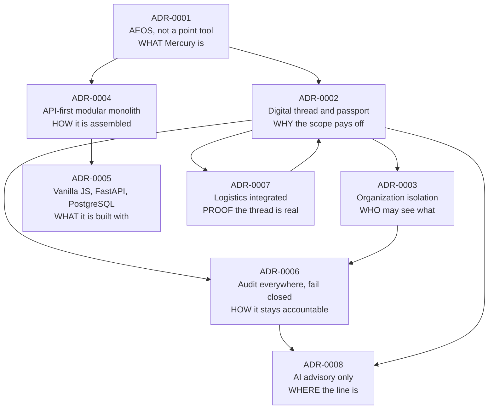
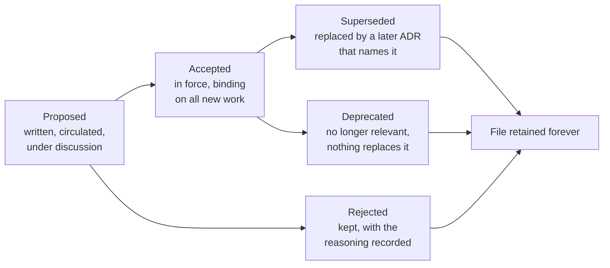

# Architecture Decision Records — Mercury Aviation Enterprise Operating System

| Field | Value |
|-------|-------|
| Document | ADR register — index, process, and numbering policy |
| Product | Mercury Aviation Enterprise Operating System (AEOS) |
| Organization | Mercury Technologies |
| Layer | Standards — architectural governance |
| Audience | Architects, engineers, reviewers, contributors, technical due-diligence reviewers, auditors |
| Status | Living register |
| Companion documents | [API Standards](../API_Standards.md) · [UI Standards](../UI_Standards.md) · [Coding Standards](../Coding_Standards.md) |
| Upstream authority | [Blueprint README](../../../README.md) · [CONTRIBUTING](../../../CONTRIBUTING.md) · [Technical Architecture](../../02_Architecture/Technical_Architecture.md) |

---

## 1. What an ADR is, and why Mercury keeps them

An Architecture Decision Record captures **one decision, the situation that forced it, and what the organization accepted in consequence.** It is written once, at the moment the decision is taken, and thereafter it is not edited to look better in hindsight.

Mercury keeps ADRs for a reason specific to its domain. The platform holds airworthiness evidence, and its most valuable property is that a certification signature written years ago still resolves to the employee, the authority they held at that moment, and the immutable publication revision that governed the work. Properties like that survive only if the reasoning behind them is written down. A constraint whose rationale has been forgotten is a constraint someone will remove during a refactor, in good faith, with no idea what it was protecting.

| An ADR is | An ADR is not |
|-----------|---------------|
| A record of one decision and its cost | A design document, a specification, or a tutorial |
| Written at the time of the decision | Retrofitted to justify what was built |
| Honest about what was given up | A statement that the choice was obviously correct |
| Immutable once accepted | Updated as the system evolves — a new ADR supersedes it instead |
| A constraint on future work | A suggestion |

---

## 2. The register

Eight accepted decisions. Together they define what Mercury is, and any change that contradicts one of them requires a superseding ADR rather than a code review.

| ADR | Decision | Status | Governs |
|-----|----------|--------|---------|
| [ADR-0001](ADR-0001-aeos-not-point-mro.md) | **Mercury is an Aviation Enterprise Operating System, not a point MRO tool** | Accepted | Product scope, module boundaries, what Mercury will and will not become |
| [ADR-0002](ADR-0002-digital-thread-passport.md) | **One digital thread, one Digital Aircraft Passport** | Accepted | Data model, traceability edges, evidence resolvability |
| [ADR-0003](ADR-0003-multi-tenant-org-isolation.md) | **Multi-tenant with organization isolation enforced in the service layer** | Accepted | Tenancy, authorization, every query against tenant data |
| [ADR-0004](ADR-0004-api-first-modular-monolith.md) | **API-first modular monolith, services only when justified** | Accepted | Deployment shape, module coupling, extraction policy |
| [ADR-0005](ADR-0005-vanilla-js-fastapi-stack.md) | **Vanilla JavaScript frontend, FastAPI and PostgreSQL backend** | Accepted | Technology stack, the no-framework and no-build-step constraint |
| [ADR-0006](ADR-0006-audit-everywhere-fail-closed.md) | **Audit everywhere, fail closed, evidence append-only** | Accepted | Accountability, immutability, what a failed audit does |
| [ADR-0007](ADR-0007-logistics-as-integrated-program.md) | **Logistics is an integrated program, not a bolt-on inventory module** | Accepted | Material, tooling, procurement, and their binding to maintenance |
| [ADR-0008](ADR-0008-ai-advisory-only.md) | **AI is advisory only, and never certifies or releases** | Accepted | Every current and future AI capability |
| [ADR-0009](ADR-0009-platform-foundation-shared-substrate.md) | **Platform Foundation is the shared AEOS substrate** | Accepted | Identity, org extensions, RBAC extensions, workflow, notifications, files, search, configuration |
| [ADR-0010](ADR-0010-aeos-structure-standardization.md) | **AEOS structure standardized without big-bang moves** | Accepted | Logical architecture, facades, readiness domains, workflow bridge |
| [ADR-0011](ADR-0011-universal-data-fabric.md) | **Universal Data Fabric is the Digital Thread substrate** | Accepted | Passports, relationships, events, governance, knowledge-graph projection |
| [ADR-0012](ADR-0012-aviation-digital-ecosystem.md) | **Aviation Digital Ecosystem + Mercury Connect** | Accepted | Stakeholder ecosystems, enrollments, Connect connectors, authority non-claim |
| [ADR-0013](ADR-0013-digital-marketplace.md) | **Mercury Digital Marketplace** | Accepted | B2B aviation commerce, seller-owned inventory, badge/payment non-claims |
| [ADR-0014](ADR-0014-aviation-network.md) | **Mercury Aviation Network** | Accepted | Secure collaboration; isolation by default; partnership-gated cross-org |
| [ADR-0015](ADR-0015-digital-twin.md) | **Mercury Digital Twin** | Accepted | Lifecycle registry over Fabric passports; not 3D; immutable history |
| [ADR-0016](ADR-0016-plugin-platform.md) | **Mercury Plugin Platform** | Accepted | OEM/ops plugins via Connect; SMS = Safety Management System |
| [ADR-0017](ADR-0017-enterprise-event-fabric.md) | **Mercury Enterprise Event Fabric** | Accepted | Durable versioned events; distinct from fabric_events + in-memory bus |

### 2.1 How the eight relate



Read the graph as a dependency of reasoning rather than of implementation. ADR-0001 establishes the scope; ADR-0002 explains why that scope is worth its cost; ADR-0003 and ADR-0006 make the resulting evidence trustworthy; ADR-0004 and ADR-0005 keep it buildable by a small team; ADR-0007 demonstrates the thread on the domain where most platforms give up; and ADR-0008 draws the line that no amount of capability is permitted to cross.

### 2.2 The five properties the register protects

Every ADR in the register exists, ultimately, to protect one or more of these. If a proposed change threatens any of them, the change needs an ADR:

1. **Evidence resolves.** From a release, a reviewer reaches every certification step, signer, authority, publication revision, part, and tool without leaving the platform.
2. **Tenants cannot see each other.** Isolation is structural, enforced at every read and write, and identical on every replica.
3. **Evidence cannot be altered.** Signatures, certification events, logbook entries, configuration history, ledgers, and audit records are append-only.
4. **Accountability has no gaps.** Every mutation is attributable, and a critical operation that cannot be audited does not commit.
5. **Only a qualified human certifies or releases.** No automation, however capable, crosses that line.

---

## 3. The process

### 3.1 When an ADR is required

An ADR is required when a change would **alter what the system guarantees**. It is not required when a change only alters how legibly the same guarantee is expressed.

| Requires an ADR | Does not require an ADR |
|-----------------|-------------------------|
| Introducing a frontend framework or a build step | Adding a screen, a workspace tab, or a rendering helper |
| Extracting a module into a separate deployable service | Adding a module that follows the six-file pattern |
| Adding a second persistence technology, a graph store, or a vector store | Adding a table, a column, or an index |
| Changing the repository, service, router split | Extracting a private helper within a layer |
| Making organization scoping optional anywhere | Adding an endpoint that resolves the organization correctly |
| Weakening, bypassing, or making configurable any certification gate | Adding a certification-adjacent report that reads evidence |
| Adding a write path to an evidence or ledger table | Adding an append-only record type |
| Making an audit write best-effort | Adding an audit action to the catalogue |
| Giving any automated component signing or release capability | Adding an advisory surface that is marked, cited, and rejectable |
| Removing or renaming an API field, parameter, or status code | Adding a field, an optional parameter, or an endpoint |
| Changing the meaning of an existing value | Extending an enumerated vocabulary |
| Adopting a message bus, an object store, or a shared session store | Adding configuration for an existing dependency |

When in doubt, the test in [CONTRIBUTING](../../../CONTRIBUTING.md) applies: **if a future reader would be surprised that this was decided without discussion, write the ADR.**

### 3.2 The lifecycle



| Status | Meaning |
|--------|---------|
| **Proposed** | Written and under discussion. Not yet binding |
| **Accepted** | In force. Binding on all new and modified work |
| **Rejected** | Considered and declined. **The file is kept**, because knowing what was rejected and why prevents the same proposal arriving every year |
| **Superseded** | Replaced by a later ADR, which is named in this one's Links section. The original text is not edited |
| **Deprecated** | No longer relevant because the context disappeared, with nothing replacing it |

**No ADR is ever deleted, and an accepted ADR's Context, Decision, and Consequences are never rewritten.** A decision that turned out badly is more useful as a record than as an embarrassment removed from the history. The only permitted edit to an accepted ADR is an addition to its Links section pointing at the ADR that superseded it.

### 3.3 Writing one

1. Take the next unused number. Numbers are never reused, including for rejected ADRs.
2. Create `ADR-NNNN-short-kebab-slug.md`. The slug states the decision, not the topic: `ai-advisory-only`, not `ai-strategy`.
3. Use the template in §3.4. Every section is mandatory.
4. Set the status to **Proposed** and circulate it.
5. On acceptance, change the status to **Accepted**, add the date, and add it to the register in §2.
6. Update the affected standards and architecture documents to cite it.

### 3.4 The template

Every ADR in this register uses exactly these sections, in this order.

```markdown
# ADR-NNNN — <Decision stated as an assertion>

| Field | Value |
|-------|-------|
| Status | Accepted |
| Date | YYYY-MM-DD |
| Deciders | <roles, not names> |
| Supersedes | <ADR or None> |
| Superseded by | <ADR or None> |

## Context
The situation, the forces, the constraints, and what would happen if nothing were decided.

## Decision
The decision, stated as an assertion in the present tense. What is now true.

## Consequences
### Positive
### Negative
### Neutral

## Links
```

| Section | What good looks like |
|---------|---------------------|
| **Context** | The forces that made a decision necessary, including the ones that pointed the other way. A context that only supports the decision is advocacy, not a record |
| **Decision** | One assertion in the present tense. "Mercury enforces organization isolation in the service layer." Not "we should" or "we will" |
| **Consequences — Negative** | **The section that determines whether the ADR is worth keeping.** A decision with no recorded cost was not a decision; it was a preference. A future reader needs to know what was traded away in order to judge whether the trade still holds |
| **Consequences — Neutral** | The consequences that are simply facts of the choice — new obligations, new conventions, things that must now be remembered |
| **Links** | The documents this decision governs, the documents that explain it in depth, and the related ADRs |

### 3.5 Reviewing a change against the register

A reviewer's obligation is narrow and specific: **confirm the change does not contradict an accepted ADR.** The review checklists that operationalize this are:

- [API Standards §16](../API_Standards.md#16-endpoint-review-checklist) for HTTP surfaces.
- [Coding Standards §15](../Coding_Standards.md#15-code-review-checklist) for backend code.
- [UI Standards §15](../UI_Standards.md#15-screen-review-checklist) for screens.

A change that contradicts an ADR is not blocked permanently. It is blocked until the superseding ADR exists — which is the point, because it moves the conversation from a pull request comment to a recorded decision.

---

## 4. Numbering policy and stale references

### 4.1 The policy

| Rule | Detail |
|------|--------|
| Numbers are sequential and permanent | `ADR-0001` through `ADR-0009` are the accepted register; the next ADR is `ADR-0010` |
| Numbers are never reused | Including for rejected and superseded ADRs |
| The filename is `ADR-NNNN-<slug>.md` | The slug may not change after acceptance, because links to it exist |
| A superseding ADR takes a new number | It does not inherit the number of the ADR it replaces |

### 4.2 Stale links in earlier documents

Two standards documents were written before this register was finalized and cite a **provisional numbering** that does not match §2. This is recorded here rather than silently corrected, because a reader following one of those links needs to know where the decision actually lives.

| Provisional reference in an earlier document | Current authority |
|---------------------------------------------|-------------------|
| `ADR-0001-vanilla-js-fastapi-aeos.md` | [ADR-0005 — Vanilla JS and FastAPI](ADR-0005-vanilla-js-fastapi-stack.md), with the product-scope half in [ADR-0001](ADR-0001-aeos-not-point-mro.md) |
| `ADR-0003-org-isolation-multitenancy.md` | [ADR-0003 — Multi-tenant organization isolation](ADR-0003-multi-tenant-org-isolation.md) — same decision, current slug |
| `ADR-0004-repository-service-router.md` | [ADR-0004 — API-first modular monolith](ADR-0004-api-first-modular-monolith.md), with the layer contract specified in [Coding Standards §4](../Coding_Standards.md#4-repository-layout-and-the-module-pattern) |
| `ADR-0005-immutable-audit-and-history.md` | [ADR-0006 — Audit everywhere, fail closed](ADR-0006-audit-everywhere-fail-closed.md) |
| `ADR-0006-hash-signatures-before-pki.md` | **Not an ADR.** The signature-mechanism decision and its limits are authoritative in [Digital Signatures §8](../../06_Security/Digital_Signatures.md#8-what-this-is-not--the-cryptographic-limit). Moving to certificate-backed signing would be a new ADR |
| `ADR-0008-advisory-ai-never-auto-release.md` | [ADR-0008 — AI advisory only](ADR-0008-ai-advisory-only.md) — same decision, current slug |
| `ADR-0009-modular-monolith-before-services.md` | [ADR-0004 — API-first modular monolith](ADR-0004-api-first-modular-monolith.md) |

The affected documents are [API Standards](../API_Standards.md) and [UI Standards](../UI_Standards.md). Their **substance is unaffected** — every rule they state is consistent with the register in §2 — and reconciling their link text is a documentation task tracked in [CHANGELOG.md](../../../CHANGELOG.md) rather than a change to any decision.

---

## 5. Non-functional requirements for the register

These read oddly for a documentation artefact until you consider that the register's whole value is being trustworthy years after it was written.

| Requirement | Position |
|-------------|----------|
| Every accepted ADR has a Context, Decision, Consequences, and Links section | **Current** — all eight |
| Every ADR records at least one negative consequence | **Current** — an ADR without one is not accepted |
| No accepted ADR's Context, Decision, or Consequences is edited after acceptance | **Normative, permanent** |
| No ADR file is deleted | **Normative, permanent** |
| Every ADR is reachable from this register | **Current** |
| Every ADR is cited by at least one standards or architecture document | **Current** |
| Numbers are unique and never reused | **Current** |
| Stale provisional references are reconciled in §4.2 rather than left to be discovered | **Current** |
| A superseded ADR names its successor in Links | **Normative** — no ADR is superseded today |
| Automated link checking across the documentation set | **Planned** |

---

## 6. Security considerations

**The register is a security artefact, not only a design one.** Four of the eight accepted decisions are directly security-bearing — isolation, append-only audit, the certification gates, and the advisory-only line — and the reason they are recorded as decisions rather than as code comments is that a future engineer must be able to discover *why* a check exists before deciding to remove it.

**Contradicting an ADR is a review finding with a severity.** A change that makes organization scoping optional, adds a write path to an evidence table, makes an audit write best-effort, or gives an automated component signing capability is a **critical** finding, not a discussion. Each is prohibited by an accepted ADR, and each removes a control the platform's evidence value depends on.

**An ADR that is edited after acceptance loses its evidential value.** If Context and Consequences can be rewritten, the register stops being a record of what was known at the time and becomes a description of what is currently convenient. That is why §3.2 permits only additions to Links.

**Rejected ADRs are retained deliberately.** A rejected proposal to relax a control is exactly the document a reviewer needs when the same proposal returns, and deleting it would mean re-litigating the same risk from scratch every few years.

**The register discloses architecture, and that is acceptable.** These documents describe how Mercury enforces isolation, immutability, and certification authority. Mercury's security does not depend on that being secret; it depends on the enforcement being correct. The register is nonetheless treated as commercial material and shared with partners rather than published indiscriminately — the same posture as the OpenAPI specification in [API Standards §10.3](../API_Standards.md#103-exposure-policy).

**Known governance debt**, tracked openly: link checking across the documentation set is manual; the provisional references in §4.2 remain in two documents; and there is no automated check that a pull request touching a governed area cites the relevant ADR.

---

## 7. Scalability considerations

| Concern as the register grows | Position |
|-------------------------------|----------|
| Finding the relevant decision among many | The register in §2 is the single index, with the reasoning graph in §2.1. Every ADR is one page |
| Decisions accumulating contradictions | Prevented structurally: a new decision that conflicts with an old one must supersede it explicitly and name it |
| Superseded records cluttering the index | Superseded and rejected ADRs remain as files and move to a clearly separated section of §2 when the first one appears. They are never removed |
| ADRs drifting from the code | Each ADR names the documents and code areas it governs; each standards document cites the ADRs that constrain it. Both directions are maintained |
| Contributors not knowing an ADR applies | The three review checklists in §3.5 name the ADRs explicitly, so the register is enforced at review time rather than remembered |
| The register becoming a formality | The negative-consequence requirement in §3.4 is the guard. An ADR that cannot name what it gave up is not describing a real decision |

**What must survive any growth of the register:** the five properties in §2.2, the immutability of accepted records, and the rule that no decision governing them changes without a superseding ADR.

---

## 8. Future enhancements

| # | Enhancement | Value | Depends on |
|---|-------------|-------|------------|
| 1 | Automated link checking across the documentation set | Broken cross-references are caught mechanically rather than by a reader | Build pipeline |
| 2 | Reconcile the provisional references in §4.2 within [API Standards](../API_Standards.md) and [UI Standards](../UI_Standards.md) | One consistent set of ADR links across the blueprint | Item 1 |
| 3 | A pull-request check that flags changes to governed areas without an ADR citation | Moves ADR enforcement from reviewer memory to tooling | Path-to-ADR mapping |
| 4 | ADR for the message bus and transactional outbox decision | The prerequisite for projections, read models, and the knowledge graph | An architectural decision |
| 5 | ADR for the shared session store, unblocking horizontal replicas | Mercury's binding scalability constraint — see [Technical Architecture §15.1](../../02_Architecture/Technical_Architecture.md#151-the-binding-constraint) | An architectural decision |
| 6 | ADR for certificate-backed signing, superseding the hash-attested position | The substance of the electronic-signature conversation an operator has with its authority | Key management, certificate lifecycle, revocation, timestamping |
| 7 | ADR for database-enforced append-only and tamper-evident chaining | Turns immutability from conventional into structural | A migration and a sequencing decision |
| 8 | ADR for the pagination envelope introduction path | Resolves the open question in [API Standards §5.1](../API_Standards.md#51-pagination) | An error-taxonomy decision |
| 9 | ADR for vector or graph infrastructure, if and when depth limits are demonstrated | Prevents adopting a store because it is fashionable rather than because it is needed | Evidence from a first-generation overlay |
| 10 | ADR for scoped cross-organization evidence grants for lessors, authorities, and buyers | The highest-value external use of the passport, and its largest isolation risk | An isolation design |

Sequencing is tracked in [ROADMAP.md](../../../ROADMAP.md).

---

## 9. Related documents

**Standards set**
[API Standards](../API_Standards.md) · [UI Standards](../UI_Standards.md) · [Coding Standards](../Coding_Standards.md)

**The register**
[ADR-0001](ADR-0001-aeos-not-point-mro.md) · [ADR-0002](ADR-0002-digital-thread-passport.md) · [ADR-0003](ADR-0003-multi-tenant-org-isolation.md) · [ADR-0004](ADR-0004-api-first-modular-monolith.md) · [ADR-0005](ADR-0005-vanilla-js-fastapi-stack.md) · [ADR-0006](ADR-0006-audit-everywhere-fail-closed.md) · [ADR-0007](ADR-0007-logistics-as-integrated-program.md) · [ADR-0008](ADR-0008-ai-advisory-only.md) · [ADR-0009](ADR-0009-platform-foundation-shared-substrate.md)

**Architecture**
[Technical Architecture](../../02_Architecture/Technical_Architecture.md) · [Enterprise Architecture](../../02_Architecture/Enterprise_Architecture.md) · [Domain Architecture](../../02_Architecture/Domain_Architecture.md) · [System Context](../../02_Architecture/System_Context.md)

**Security**
[SECURITY.md](../../../SECURITY.md) · [Identity](../../06_Security/Identity.md) · [RBAC](../../06_Security/RBAC.md) · [Audit](../../06_Security/Audit.md) · [Digital Signatures](../../06_Security/Digital_Signatures.md)

**Repository root**
[README](../../../README.md) · [VISION](../../../VISION.md) · [ROADMAP](../../../ROADMAP.md) · [CONTRIBUTING](../../../CONTRIBUTING.md) · [CHANGELOG](../../../CHANGELOG.md)

---

*Mercury Technologies — One Digital Thread. One Digital Aircraft Passport. One Aviation Enterprise Operating System.*
