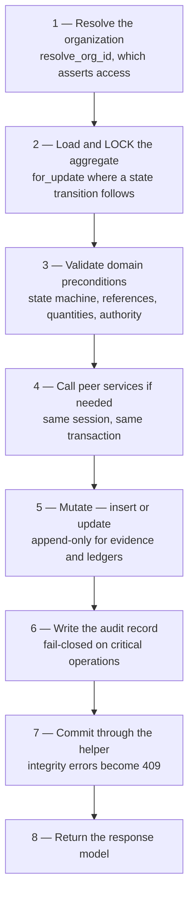

# Coding Standards — Mercury Aviation Enterprise Operating System

| Field | Value |
|-------|-------|
| Document | Coding Standards — backend module pattern, persistence, migrations, testing, and the additive-change rule |
| Product | Mercury Aviation Enterprise Operating System (AEOS) |
| Organization | Mercury Technologies |
| Layer | Standards (Python, FastAPI, SQLAlchemy, Pydantic, Alembic, pytest) |
| Audience | Backend developers, reviewers, contributors, integrators reading the source, technical due-diligence reviewers |
| Status | Living baseline |
| Companion documents | [API Standards](API_Standards.md) · [UI Standards](UI_Standards.md) · [ADR register](ADR/README.md) |
| Upstream authority | [Technical Architecture](../02_Architecture/Technical_Architecture.md) · [CONTRIBUTING](../../CONTRIBUTING.md) · [Blueprint README](../../README.md) |

---

## 1. Scope

### 1.1 In scope

This document is the **normative code-level contract for Mercury's Python backend**. It governs:

- The six-file module package pattern, and what each file may and may not contain.
- The repository, service, and router split — including the rules that make the split enforceable rather than aspirational.
- Organization resolution, invariant enforcement, locking, error raising, and the commit helper.
- Persistence conventions: identifiers, timestamps, version counters, indexes, decimals, and the string-flag legacy.
- Pydantic schema conventions, and why validation belongs at the boundary.
- Alembic migration policy — forward-only, additive, one revision per change.
- Testing obligations, including the four tests every endpoint owes.
- The **additive-change rule**: what a contributor is permitted to change, and what requires an [ADR](ADR/README.md).

It applies to all nine domain modules — `org`, `fleet`, `components`, `publications`, `personnel`, `maintenance`, `work_orders`, `planning`, `logistics` — to the supporting packages under `backend/app/`, and to any module added later.

### 1.2 Out of scope

| Concern | Authoritative location |
|---------|------------------------|
| Layering rationale, data flows, transaction boundaries | [Technical Architecture](../02_Architecture/Technical_Architecture.md) |
| Bounded contexts, aggregates, ubiquitous language | [Domain Architecture](../02_Architecture/Domain_Architecture.md) |
| HTTP contract — URLs, status codes, pagination, errors on the wire | [API Standards](API_Standards.md) |
| Frontend conventions, accessibility, workspace structure | [UI Standards](UI_Standards.md) |
| Column-level schema, identifier formats, enumerated vocabularies | [Data Model](../04_Data/Data_Model.md) · [Master Data](../04_Data/Master_Data.md) |
| Permission catalogue and role mappings | [RBAC](../06_Security/RBAC.md) |
| Session lifecycle and credential handling | [Identity](../06_Security/Identity.md) |
| Audit record content and the action catalogue | [Audit](../06_Security/Audit.md) |
| Signature construction and certification gates | [Digital Signatures](../06_Security/Digital_Signatures.md) |
| Branching, review, and release process | [CONTRIBUTING](../../CONTRIBUTING.md) |

### 1.3 Honesty markers

Markers are used identically across the blueprint.

| Marker | Meaning |
|--------|---------|
| **Current** | Implemented in the runtime and exercised by tests |
| **Partial** | Present for a subset of the described scope |
| **Planned** | Specified here, not built |
| **Debt** | A known deviation from the target convention, tracked deliberately |

A rule written without a marker is **normative for all new and modified code**, whether or not every existing file already satisfies it. Where a rule and the existing code disagree, the rule governs new work and the deviation is named as **Debt** rather than quietly tolerated.

---

## 2. Design principles

| # | Principle | Consequence |
|---|-----------|-------------|
| 1 | **Uniformity beats cleverness.** Every module has the same shape. | A developer who has read one module can navigate all nine. A locally elegant departure costs every future reader more than it saved its author. |
| 2 | **Additive change, always.** Mercury grows by adding; it does not grow by replacing. | See §3. A rewrite is an architectural decision requiring an [ADR](ADR/README.md), not a refactoring preference. |
| 3 | **The service layer is where decisions live.** Routers are thin, repositories are dumb. | A rule in a router or a decision in a repository has escaped its layer. See [Technical Architecture §2.3](../02_Architecture/Technical_Architecture.md#23-the-one-rule-that-keeps-this-honest). |
| 4 | **Tenancy is resolved, never assumed.** Every tenant-aware service method resolves the organization before it touches data. | See §5.2. A method that reads `actor.organization_id` directly is a tenancy defect. |
| 5 | **Invariants are enforced in code, under a lock, in one transaction.** | A rule enforced only by the frontend, or only by a database constraint that the service does not understand, is not enforced. |
| 6 | **Evidence is append-only in code, because it must be.** No code path updates or deletes a signature, certification event, logbook entry, component history row, stock movement, or audit record. | See §6.6 and [Audit §6](../06_Security/Audit.md#6-evidence-immutability). |
| 7 | **Validation happens at the boundary.** Pydantic validates before a service is reached. | A service operates on well-formed data and is therefore free to concern itself with domain truth rather than parsing. |
| 8 | **Fail loudly, fail closed.** An operation that cannot write its audit record does not commit. | See §5.5. |
| 9 | **Types are documentation that the tooling checks.** Annotations are mandatory on every function signature. | An untyped signature makes the contract a comment. |
| 10 | **Tests encode the invariant, not the implementation.** | A test that would pass after the invariant was removed is not a test of the invariant. |
| 11 | **Never claim more than the mechanism delivers.** | A helper named `verify_signature` that compares a hash is misnamed. See [Digital Signatures §8](../06_Security/Digital_Signatures.md#8-what-this-is-not--the-cryptographic-limit). |
| 12 | **No placeholders in the runtime.** A stub is permitted only where it is deliberately deterministic, documented as a stub, and honest about having no model behind it. | See [AI Strategy §4.1](../07_AI/AI_Strategy.md#41-what-exists-today). |

---

## 3. The additive-change rule

### 3.1 The rule

**Mercury is extended, not redesigned.** Every change is additive to a working system unless an [ADR](ADR/README.md) records a decision to do otherwise.

This is not conservatism for its own sake. Mercury holds airworthiness evidence, and the platform's most valuable property is that a certification signature written two years ago still resolves to the employee, the authority, and the immutable publication revision that governed it. A rewrite that loses or reshapes that chain destroys value that no feature can replace.

### 3.2 What is routine

| Change | Position |
|--------|----------|
| Add a module following the six-file pattern | Routine — follow [Technical Architecture §3.5](../02_Architecture/Technical_Architecture.md#35-adding-a-module--the-checklist) |
| Add an endpoint, a service method, a repository query | Routine |
| Add a nullable column, a table, or an index | Routine — one forward-only migration, see §8 |
| Add an optional request field or a response field | Routine — see [API Standards §3.4](API_Standards.md#34-what-may-change-inside-v1) |
| Add a permission and map it to roles | Routine — coordinate with [RBAC](../06_Security/RBAC.md) |
| Add a test | Always welcome, never gated |
| Extend an enumerated vocabulary | Routine, with the client-tolerance rule in [API Standards §3.6](API_Standards.md#36-client-obligations) |

### 3.3 What requires an ADR

| Change | Why it is not a refactor |
|--------|--------------------------|
| Introducing a frontend framework or a build step | Contradicts [ADR-0005](ADR/ADR-0005-vanilla-js-fastapi-stack.md) |
| Extracting a module into a separate service | Contradicts [ADR-0004](ADR/ADR-0004-api-first-modular-monolith.md); see [Technical Architecture §12.6](../02_Architecture/Technical_Architecture.md#126-when-and-how-extraction-would-happen) |
| Changing the repository, service, router split | The split is the reason invariants are enforceable in one reviewable place |
| Weakening, bypassing, or making configurable any certification gate | Contradicts [ADR-0006](ADR/ADR-0006-audit-everywhere-fail-closed.md) and [Digital Signatures §4.3](../06_Security/Digital_Signatures.md#43-the-invariants-restated-as-a-table) |
| Making organization scoping optional anywhere | Contradicts [ADR-0003](ADR/ADR-0003-multi-tenant-org-isolation.md) |
| Adding a write path to an evidence table | Contradicts [ADR-0006](ADR/ADR-0006-audit-everywhere-fail-closed.md) |
| Adding a second persistence technology | An operational commitment, not a library choice |
| Making an audit write best-effort | Contradicts fail-closed; see §5.5 |
| Giving any automated component signing capability | Contradicts [ADR-0008](ADR/ADR-0008-ai-advisory-only.md) |
| Removing or renaming an API field, parameter, or status code | A version event; see [API Standards §3.4](API_Standards.md#34-what-may-change-inside-v1) |

### 3.4 The refactoring that is encouraged

The rule is not a prohibition on improving code. These are welcome and need no ADR:

- Extracting a repeated block into a private helper **within the same layer**.
- Adding type annotations to an under-annotated function.
- Splitting an over-long service method into private methods that preserve the same transaction boundary and the same invariants.
- Adding an index that an existing query needs.
- Naming a magic value as a module-level constant.
- Adding a docstring that states an invariant the code enforces.

The test is simple: **if the change alters what the system guarantees, it is a decision. If it only alters how legibly the same guarantee is expressed, it is a refactor.**

---

## 4. Repository layout and the module pattern

### 4.1 The canonical shape

Every domain module is a package under `backend/app/` with the same six files. **Current.**

```text
backend/app/<domain>/
├── __init__.py      Lazy export of the service class; avoids import cycles
├── models.py        SQLAlchemy models — tables, columns, indexes, relationships
├── schemas.py       Pydantic request and response contracts
├── repository.py    Query and persistence access; no business rules
├── service.py       Domain logic, invariants, tenancy assertion, transactions
└── router.py        APIRouter with prefix, tags, permission dependencies
```

Supporting packages and their responsibilities:

| Path | Owns |
|------|------|
| `backend/app/main.py` | Application assembly, middleware order, router registration, startup seeding |
| `backend/app/database.py` | Engine, session factory, schema bootstrap, the `get_db` dependency |
| `backend/app/audit.py` | Audit record writing and querying |
| `backend/app/security/` | Roles, permissions, permission dependencies, operator directory, rate limiting |
| `backend/app/core/` | Configuration, structured logging, health, metrics |
| `backend/app/websocket/` | Connection registry and broadcast |
| `backend/alembic/` | Forward-only migrations |
| `backend/tests/` | pytest suite, one or more files per domain or capability |

### 4.2 File-by-file contract

| File | Must contain | Must never contain |
|------|--------------|--------------------|
| `__init__.py` | `__all__` and a module-level `__getattr__` that lazily resolves the service class | An eager import of the service, which reintroduces the import cycles the lazy export exists to break |
| `models.py` | One SQLAlchemy model per table; columns, indexes, constraints, relationships | Business logic, HTTP concepts, service calls |
| `schemas.py` | Separate `Create`, `Update`, and `Out` models with `Field` constraints | Database access, business rules, cross-module imports of models |
| `repository.py` | Query construction, filtering, ordering, clamped pagination, `for_update` locking, `flush`, `refresh`, `commit`, `rollback` | Any decision. A repository answers questions; it does not choose |
| `service.py` | Organization resolution, invariant enforcement, cross-module service calls, audit writes, the commit | Direct HTTP handling beyond raising `HTTPException`; reaching into another module's models or tables |
| `router.py` | `APIRouter` with prefix and tag, permission dependencies, request and response models, immediate delegation | Business rules, database sessions used for queries, model construction |

### 4.3 Import discipline

| Rule | Detail |
|------|--------|
| A module imports another module's **service**, never its repository or models | The service is the module's public surface. Importing a peer's models bypasses its invariants and couples to its schema |
| Cross-module service instantiation shares the **same session** | `OrganizationService(self.db)` — this is what keeps a multi-module operation in one transaction. **Current** |
| Layer imports flow one way | `router → service → repository → models`. A repository importing a service is a cycle and a design error |
| `schemas.py` imports nothing from `service.py` or `repository.py` | Contracts do not depend on behaviour |
| Lazy service export in `__init__.py` | The established mechanism for breaking legitimate mutual dependencies — planning calls work orders and logistics; work orders calls maintenance, publications, and personnel |

### 4.4 Router conventions

Routers are thin by construction. A router endpoint does four things and stops.

```python
@router.post("/warehouses", response_model=WarehouseOut, status_code=201)
def create_warehouse(
    payload: WarehouseCreate,
    db: Session = Depends(get_db),
    session: Session_ = Depends(require_logistics_manage),
) -> WarehouseOut:
    """Create a warehouse. Requires logistics manage permission."""
    return _svc(db).create_warehouse(payload, _actor(session))
```

| Obligation | Detail |
|------------|--------|
| Declare `response_model` | Without it the response is unfiltered and the OpenAPI schema is untyped |
| Declare `status_code` where it is not `200` | So `201` appears in the generated specification |
| Attach a permission dependency named `require_<domain>_<capability>` | An endpoint with no permission dependency is a defect caught in review |
| Build the actor from the session and delegate | One expression. If the router needs a second statement of logic, that logic belongs in the service |
| Write the first docstring line for an integrator | It becomes the OpenAPI summary |

Prefixes and tags per module are enumerated in [Technical Architecture §3.3](../02_Architecture/Technical_Architecture.md#33-router-conventions). Path and payload conventions are normative in [API Standards](API_Standards.md).

### 4.5 Naming

| Subject | Convention | Example |
|---------|-----------|---------|
| Modules and packages | `snake_case`, singular domain noun or established plural | `work_orders`, `logistics` |
| Classes | `PascalCase` | `LogisticsService`, `PartMasterOut` |
| Functions and methods | `snake_case`, verb-first | `create_warehouse`, `resolve_org_id` |
| Private helpers | Leading underscore, module- or class-private | `_dec`, `_commit_or_conflict`, `_audit_required` |
| Constants | `UPPER_SNAKE_CASE` at module level | `MAX_PAGE`, `ZERO` |
| Repository methods | Named for **what** they fetch | `list_stock_balances`, `get_job_card_for_update` |
| Service methods | Named for the **business act** | `issue_stock`, `release_job_card`, `complete_job_card_work` |
| Schema models | `<Entity>Create`, `<Entity>Update`, `<Entity>Out`, `<Entity>DetailOut` | `PurchaseOrderDetailOut` |
| Permission dependencies | `require_<domain>_<capability>` | `require_logistics_stores` |
| Filter parameters | `status_filter`, never `status` | See [API Standards §5.2](API_Standards.md#52-filtering) |

The `status_filter` convention is worth restating because it looks arbitrary: in a FastAPI router, `status` is the imported `fastapi.status` module, and a parameter of that name shadows it in exactly the code that raises HTTP errors. The name is `status_filter` platform-wide, including where shadowing could not occur, because consistency is worth more than the nicer name.

---

## 5. The service layer

### 5.1 What a service owns

A service method is the only place where all of the following are true at once: the caller's identity is known, the organization is resolved, the domain rules are visible, the peer modules are reachable, and the transaction is owned. That is why it is the layer a safety review reads.

The canonical order of operations inside a mutating service method:



Skipping step 1 is a tenancy defect. Skipping step 2 where a state transition follows is a concurrency defect. Skipping step 6 on a critical operation is an accountability defect. None of the three necessarily fails a test that was written only for the happy path, which is why §9.3 requires the other three tests.

### 5.2 Organization resolution

**Current, and the single most important convention in this document.**

```python
def resolve_org_id(self, actor: ActorContext, requested_org_id: str | None = None) -> str:
    org_id = (requested_org_id or actor.organization_id or "").strip()
    if not org_id:
        raise HTTPException(status_code=400, detail="Organization is required")
    self.org.assert_org_access(
        username=actor.username,
        session_role=actor.role,
        organization_id=org_id,
    )
    return org_id
```

| Rule | Detail |
|------|--------|
| Every tenant-aware service method resolves the organization **first** | Before any query, any peer call, any validation that touches data |
| The resolved value is what the repository filters on | Using `actor.organization_id` after resolving is a defect, because it discards the entitlement check's result |
| A client-supplied organization is an **intent**, never a trust | It is honoured only after `assert_org_access` |
| An empty or whitespace organization is `400` | Not a silent fallback to the session organization |
| A record in another organization is **not found** | `404`, never `403`. See [Identity §5.3](../06_Security/Identity.md#53-why-another-organizations-record-returns-404) |
| Cross-organization access is administrator-only and audited | Not a side effect of a broad permission |

Every repository query for tenant data filters on the resolved organization. This is enforced in the repository so that no caller — including another service — can forget it. See [ADR-0003](ADR/ADR-0003-multi-tenant-org-isolation.md).

### 5.3 Locking and concurrency

| Situation | Mechanism | Position |
|-----------|-----------|----------|
| A state transition on an aggregate | `SELECT … FOR UPDATE` on the aggregate row before validating its state | **Current** |
| Certification signing | Row lock on the maintenance task, so ordered-step and distinct-signer checks are correct under concurrency | **Current** — see [Digital Signatures §4.2](../06_Security/Digital_Signatures.md#42-the-enforcement-gate-at-every-signature) |
| Stock reservation and issue | Lock on the balance row, so quantity checks cannot race | **Current** |
| A concurrent update to a mutable aggregate | Optimistic `version` counter; a mismatch is `409` | **Current** |
| A long-running read | No lock | **Current** |

Two rules follow, and both are easy to violate without noticing:

1. **Validate after locking, not before.** A precondition checked before the lock is a precondition checked against a state that may already have changed.
2. **Lock in a consistent order** where a method touches more than one lockable row, to avoid deadlock. Where the order is not obvious from the code, state it in a comment — this is one of the few cases where a comment carries information the code cannot.

### 5.4 Error raising and the commit helper

Services raise `HTTPException` with the status codes in [API Standards §4.2](API_Standards.md#42-status-codes). **Routers never translate service errors.** A router that catches a service error and re-raises it with a different code has hidden a decision from the layer that owns it.

Integrity errors are translated to `409` by a single commit helper per service. **Current:**

```python
def _commit_or_conflict(self, *, detail: str) -> None:
    try:
        self.repo.commit()
    except IntegrityError as exc:
        self.repo.rollback()
        raise HTTPException(status_code=409, detail=detail) from exc
```

| Rule | Detail |
|------|--------|
| One commit helper per service, used by every mutating method | Duplicated `try/except IntegrityError` blocks drift; one helper cannot |
| The `detail` names the operation | `"Stock adjust conflict"`, `"Certification conflict"`, `"Purchase order close conflict"` — an operator reading a toast learns which operation failed |
| `rollback()` before raising | A session left in a failed state poisons the request |
| `from exc` is mandatory | The original integrity error belongs in the log, and the chained cause is how it gets there |
| The `409`-versus-`422` boundary | If the answer depends on data in the database it is `409`; if it depends only on the request it is `422`. See [API Standards §4.3](API_Standards.md#43-the-409-versus-422-boundary) |
| A `detail` never leaks | No credential, token, hash, stack trace, SQL fragment, file path, or another organization's data. See [API Standards §6.2](API_Standards.md#62-writing-a-good-detail) |

Uniqueness collisions are deliberately allowed to reach the database rather than being pre-checked with a `SELECT`. A pre-check is a race: two concurrent creates both see no existing row, and both proceed. The unique constraint is the authority, and translating its violation to `409` is both correct and cheaper.

### 5.5 Audit writing and fail-closed behaviour

| Rule | Detail |
|------|--------|
| Every mutating service method writes an audit record | Actor, actor role, organization, site, action, target type, target identifier, source, outcome, origin, business detail |
| The audit write happens **inside the business transaction** | A record written afterwards can be lost precisely when it matters |
| Critical operations are **fail-closed** | If the audit record cannot be written, the operation does not commit. **Current** — see [ADR-0006](ADR/ADR-0006-audit-everywhere-fail-closed.md) |
| Bulk operations audit **once**, with counts and a mandatory reason | Per-line detail lives in the ledger. Forty audit rows for one cycle count would bury the signal. See [API Standards §9.2](API_Standards.md#92-the-per-line-result-contract) |
| Denials are audited | A refused organization switch or a refused signature is a security event worth keeping |
| No audit record is ever updated or deleted | See §6.6 |

The fail-closed rule is the one most often argued with, so the reasoning is stated plainly: an unaudited certification act is worse than a failed one. A failed act is retried; an unaudited one is invisible.

### 5.6 Cross-module calls

**Current.** A service that needs another domain's behaviour instantiates the peer service with the same session and calls its public method.

```python
class WorkOrderService:
    def __init__(self, db: Session) -> None:
        self.db = db
        self.repo = WorkOrderRepository(db)
        self.org = OrganizationService(db)
        self.maintenance = MaintenanceService(db)
```

| Rule | Detail |
|------|--------|
| Share the session | One transaction across the whole operation, so a partial multi-module result cannot commit |
| Call the public method, never the peer's repository | The peer's invariants stay in force. This is the whole point |
| Pass the caller's identity through | The peer re-asserts organization access; it does not trust the caller's assertion |
| Do not import the peer's models | Coupling to a schema you do not own is how a module boundary dissolves |
| Accept the coupling honestly | These call sites are the seams a future extraction would cut: today's method call becomes tomorrow's API call. See [ADR-0004](ADR/ADR-0004-api-first-modular-monolith.md) |

### 5.7 Service method size

There is no line limit, and imposing one would be counterproductive: work package generation and material planning are genuinely long because the orchestration they perform is genuinely long, and splitting them across methods that share mutable state would make the transaction boundary harder to see rather than easier.

The real rule is **one transaction, one method, one visible boundary.** Extract private helpers freely for readability, but the method that owns the commit owns the whole operation and must be readable end to end.

---

## 6. Persistence and data types

### 6.1 Model conventions

| Concern | Convention | Position |
|---------|-----------|----------|
| One model per table | No multi-table models, no table-per-class inheritance | **Current** |
| Tenant-owned tables carry `organization_id` | Indexed, and usually part of a composite index with the most common filter | **Current** |
| Composite indexes match real filter combinations | `(organization_id, status)`, `(organization_id, code)`, `(organization_id, created_at)` — not speculative ones | **Current** |
| Uniqueness is scoped to the organization | `UniqueConstraint(organization_id, code)`. A globally unique business code across tenants would be a cross-tenant coupling and an enumeration channel | **Current** |
| Mutable aggregates carry `version` | Integer, incremented on update, used for optimistic concurrency | **Current** |
| Timestamps | `created_at` and `updated_at` on mutable records; `occurred_at` on events | **Current** |
| Relationships | Declared where they are traversed; lazy by default; never used to write across a module boundary | **Current** |
| Cascade deletes | **Never on evidence.** Prefer no cascade and explicit handling | **Current** |
| Naming | Table names prefixed by domain where collision is plausible — `logistics_part_masters`, `personnel_employees` | **Current** |

### 6.2 Identifiers, timestamps, and versions

| Subject | Rule |
|---------|------|
| Primary keys | Application-generated opaque strings. **Never** a database sequence exposed to a client, never guessable, never carrying meaning |
| Business numbers | Generated with a domain prefix and a random suffix — `PO-3F9A1C22` — and unique within the organization |
| Timestamps | Stored naive-UTC by platform convention. **Every** timestamp written by application code is UTC; local presentation is the client's job |
| Dates | Stored as dates where no meaningful time exists — certificate expiry, calibration due |
| Version counters | Read by the client, echoed on update, compared server-side; a mismatch is `409` |
| Point-in-time correctness | An authority or a revision is evaluated **at the moment of the act**, never against "now". This is a correctness requirement, not an optimization — see [Digital Signatures §4](../06_Security/Digital_Signatures.md#4-the-certification-chain) |

### 6.3 Decimals, quantities, and money

**Never floating point in persistence or arithmetic. Current.**

| Rule | Detail |
|------|--------|
| Quantities and money are `Numeric` in the model | `Numeric(14, 3)` for quantities, with scale chosen for the measure |
| Arithmetic uses `decimal.Decimal` | Not `float`, at any point in the chain |
| Conversion is centralized in one helper | The established shape, **Current**: `_dec(value)` returns a `Decimal`, converting via `str()` and treating `None` as zero |
| A module-level `ZERO = Decimal("0")` constant | So a zero literal is never `0.0` |
| The wire contract carries JSON numbers | Serialized from the decimal; see [API Standards §4.4](API_Standards.md#44-payload-conventions) |
| Comparison is decimal-to-decimal | Comparing a `Decimal` to a `float` reintroduces the representation error the `Decimal` existed to avoid |

```python
ZERO = Decimal("0")


def _dec(value: object) -> Decimal:
    if isinstance(value, Decimal):
        return value
    if value is None:
        return ZERO
    return Decimal(str(value))
```

Converting through `str()` rather than passing a `float` to `Decimal` is deliberate: `Decimal(0.1)` captures the binary approximation, while `Decimal("0.1")` captures the value intended. In an inventory ledger whose balances must reconcile against the sum of its movements, that difference accumulates into a discrepancy nobody can explain.

### 6.4 Boolean flags and the string-flag legacy

**Debt, contained and stated.**

Some existing tables persist boolean flags as the strings `"true"` and `"false"` rather than as a native boolean column. Two helpers contain it, and they are the only sanctioned interface to those columns:

```python
def _flag(value: bool) -> str:
    return "true" if value else "false"


def _truthy(value: str | bool | None) -> bool:
    if isinstance(value, bool):
        return value
    if value is None:
        return False
    return str(value).lower() in {"1", "true", "yes", "on"}
```

| Rule | Detail |
|------|--------|
| **New columns use a native boolean type.** No exceptions | The legacy is contained, not extended |
| Reads of legacy columns go through `_truthy` | Never a bare truthiness test on the string. `bool("false")` is `True`, and that is exactly the bug this helper prevents |
| Writes to legacy columns go through `_flag` | So the stored vocabulary stays consistent |
| **The wire contract is never polluted** | Schemas expose `true` / `false` JSON literals. A storage compromise does not become an API compromise. See [API Standards §4.4](API_Standards.md#44-payload-conventions) |
| Migration of legacy columns to native booleans | **Planned** — additive and mechanical, but it touches live data and therefore needs its own migration and test pass |

The reason this deserves its own section rather than a footnote: `if row.some_flag:` on a string column is a silent, plausible-looking defect that a test written against the happy path will not catch, because the happy path usually stores `"true"`.

### 6.5 Enumerations

| Rule | Detail |
|------|--------|
| Stored as short lower-case strings | Not database enum types, which make additive vocabulary growth a migration |
| Validated in the schema layer by `pattern` | So the rule appears in the OpenAPI specification and a caller learns it from the document rather than from a `422` |
| Validated again in the service where a transition depends on it | The state machine is a domain rule, not a string check |
| Vocabularies are governed | New values are coordinated with [Master Data](../04_Data/Master_Data.md) rather than invented at a call site |
| Clients treat them as open sets | See [API Standards §3.6](API_Standards.md#36-client-obligations) |

### 6.6 Append-only tables

**No code path updates or deletes a row in any of these. Current.**

| Table class | Examples |
|-------------|----------|
| Signatures | `digital_signatures` |
| Certification events | `certification_events` |
| Logbook | `technical_log_entries` — corrected by **amendment**, which appends a new entry and never overwrites |
| Configuration history | `component_installation_history` |
| Ledgers | `logistics_stock_movements` |
| Audit | `audit_events` |

| Rule | Detail |
|------|--------|
| Insert only | No `UPDATE`, no `DELETE`, no soft-delete column, no cascade path |
| Corrections append | A correcting record references the record it corrects. The original remains |
| Balances are derived and reconcilable | A balance row is a cached projection of its movements and must reconcile against their sum. See [Technical Architecture §6.6](../02_Architecture/Technical_Architecture.md#66-ledger-properties) |
| Retirement is a status transition | `cancelled`, `closed`, `scrapped`, `returned`, `archived` — never a delete. See [API Standards §5.5](API_Standards.md#55-soft-deleted-records) |
| **Honest limitation** | Immutability today rests on code discipline, not on database enforcement or hash chaining. Stated as **Debt** in [Audit §6.4](../06_Security/Audit.md#64-honest-limitation--immutability-is-conventional-not-structural), and it is why a code review that adds an update path to one of these tables is a critical finding rather than a style comment |

### 6.7 Repository conventions

| Rule | Detail |
|------|--------|
| Pagination is clamped **in the repository** | So no caller can request an unbounded page. **Current** |
| Every tenant query filters on the resolved organization | In the repository, so it cannot be forgotten at a call site |
| Soft-delete filtering is in the repository | `deleted_at IS NULL` on tables that carry the column, applied in the query rather than remembered by callers |
| A documented, stable default order per collection | Ledgers and evidence newest-first; catalogues by business code; plans by scheduled date |
| `for_update` variants are named for it | `get_job_card_for_update`, so a caller cannot take a lock by accident or miss taking one |
| No decisions | A repository never raises `HTTPException`, never checks a permission, and never chooses between two business outcomes |

```python
MAX_PAGE = 500


def _page(limit: int, offset: int) -> tuple[int, int]:
    return min(max(int(limit), 1), MAX_PAGE), max(int(offset), 0)
```

---

## 7. Schemas and validation

### 7.1 The three-model rule

Every entity with a write surface has **separate** create, update, and output models. **Current.**

| Model | Purpose | Rule |
|-------|---------|------|
| `<Entity>Create` | Request body for creation | Required fields are required. Server-assigned fields — identifier, timestamps, version — are absent |
| `<Entity>Update` | Request body for a partial update | **Every field optional.** Omitted means "do not change"; explicit `null` means "clear it". These are different requests |
| `<Entity>Out` | Collection and single-read response | Only fields that carry contract meaning. Internal columns stay internal |
| `<Entity>DetailOut` | Single-read response with children | Used where a detail view needs nested lines. A collection endpoint **never** returns the detail model |

One model doing all three jobs is the most common shortcut and the most expensive: it forces every field to be optional, which means the schema layer stops validating creation at all.

### 7.2 Validation belongs in the schema

| Rule | Detail |
|------|--------|
| Constraints are expressed with `Field` | `min_length`, `max_length`, `ge`, `le`, `pattern` |
| Enumerations are validated by `pattern` | `pattern=r"^(serviceable\|unserviceable\|quarantine\|scrap)$"` |
| Validation runs before the service | So a service operates on well-formed data and never re-parses |
| Every constraint appears in the OpenAPI specification | Which is why "the schema is the documentation" is a security property, not only a convenience. See [API Standards §10.2](API_Standards.md#102-obligations-that-make-generation-sufficient) |
| Cross-field rules that depend only on the request | A model validator in the schema |
| Cross-field rules that depend on stored data | The **service**, because they are domain rules and produce `409`, not `422` |

### 7.3 Response shaping

| Rule | Detail |
|------|--------|
| `response_model` is declared on every endpoint | It is the mechanism that stops an internal column leaking into a contract |
| Empty collections serialize as `[]` | Never `null` |
| Decimals serialize as JSON numbers | With the scale the model defines |
| Timestamps serialize as ISO 8601 UTC | Unambiguously |
| No field is added to an `Out` model without asking whether every caller may see it | An output model is an authorization surface: adding a cost field to a component response grants cost visibility to everyone who could read components |

---

## 8. Migrations — Alembic

### 8.1 Policy

| Rule | Detail | Position |
|------|--------|----------|
| **Forward-only** | Mercury does not rely on downgrade paths in production. A `downgrade` is written where it is honest and cheap, and is never the recovery plan | **Current** |
| One revision per logical change | A revision that does three unrelated things cannot be reasoned about or partially deployed | **Current** |
| **Additive** | Add tables, add nullable columns, add indexes, add constraints that existing data satisfies | **Current** |
| Revision identifiers are date-and-sequence | `20260813_0011`, with `down_revision` naming its predecessor, producing a single linear chain | **Current** |
| Filenames match the revision plus a slug | `20260813_0011_enterprise_logistics.py` | **Current** |
| A migration is reviewed as carefully as a service | It is the only code that runs against customer data with no user in the loop | Normative |

### 8.2 What a migration may do

| Operation | Position |
|-----------|----------|
| Create a table | Routine |
| Add a nullable column | Routine |
| Add an index | Routine — and required when a new query filters on a column that is not indexed |
| Add a unique constraint that existing data satisfies | Routine, with verification against real data first |
| Add a non-nullable column | **Three steps**: add nullable, backfill, then set not-null. Never in one step against a populated table |
| Widen a column | Routine |
| Rename a column | **Requires an ADR** — it is a breaking change for anything reading the table, and the additive path is add-and-migrate |
| Drop a column or table | **Requires an ADR** — and never on an evidence table |
| Data migration | Permitted, idempotent, and bounded. A data migration that cannot be re-run safely is a single-attempt operation against production data |
| Alter an evidence table's write semantics | **Prohibited** — see §6.6 |

### 8.3 The two-path reality, stated honestly

**Debt.** The runtime has both a schema bootstrap (`ensure_schema`) used for development and the test suite, and the Alembic chain used for managed deployment. They must agree, and nothing currently proves that they do.

| Obligation | Detail |
|------------|--------|
| A new model is registered in the bootstrap import list | Or table creation will not see it, and tests will fail in a confusing way |
| A new model also gets an Alembic revision | Or a deployed environment will not have the table |
| **Both** are part of the same change | A change that does one and not the other passes locally and fails in deployment, which is the worst place to discover it |
| Automated drift detection between the bootstrap and the migration chain | **Planned** — named in §14 |

Stating this as debt rather than describing a single clean path is deliberate: a contributor who believes there is one path will forget the other.

---

## 9. Testing

### 9.1 The suite

**Current.** pytest under `backend/tests/`, with `conftest.py` setting environment variables **before** the application is imported — configuration is read at import time, so ordering here is load-bearing — then bootstrapping the schema and running the idempotent seed functions for every domain.

| Property | Detail |
|----------|--------|
| Test-time configuration | Rate limits disabled by default, metrics enabled, API-access audit disabled, a test password set explicitly |
| Schema | `ensure_schema()` at collection time |
| Seed data | Per-domain idempotent seeds — organizations, fleet, components, publications, personnel, maintenance, work orders, planning, logistics, demonstration |
| Client | FastAPI test client exercising real routers, real services, real repositories, and a real database |
| Naming | `backend/tests/test_<domain_or_capability>.py` |

Tests exercise the **full stack** rather than mocking the service layer. For a platform whose most important properties are tenancy isolation, ordered certification, and ledger correctness, a test that mocks the database is a test of the mock.

### 9.2 Seeds must be idempotent

| Rule | Detail |
|------|--------|
| A seed checks for existing data and returns without creating duplicates | The suite runs them on every collection, and the application runs them at startup |
| Seeded data is marked `simulated` where provenance applies | So demonstration data can never read as an airworthiness fact. See [Audit §3.4](../06_Security/Audit.md#34-the-provenance-model) |
| A seed never writes evidence that implies a real certification | Seeded signatures and releases carry simulated provenance |

### 9.3 The four tests every endpoint owes

A new or modified endpoint is not complete until all four exist. This is the single most enforceable quality rule in this document.

| # | Test | What it proves | Why the happy path does not cover it |
|---|------|----------------|--------------------------------------|
| 1 | **Happy path** | The endpoint does what it says with valid input from an entitled caller | — |
| 2 | **Tenancy boundary** | A caller in organization A cannot read or write organization B's record, and receives `404` rather than `403` | A missing `resolve_org_id` passes every happy-path test |
| 3 | **Permission boundary** | A caller without the required permission receives `403` | A missing permission dependency passes every happy-path test |
| 4 | **Every invariant** | Each domain rule the endpoint enforces refuses the input that violates it | An invariant that is never tested against a violation is an invariant nobody has confirmed exists |

### 9.4 What must be tested wherever it applies

| Area | Required coverage |
|------|-------------------|
| Certification chain | Ordered steps enforced; out-of-order refused; duplicate step refused; **all three distinct-signer separations** refused when violated; signer binding to the authenticated user enforced; credential required |
| Release | Refused without a live publication and a matching immutable revision; logbook entry and component history written in the **same** transaction; all signers named |
| Ledgers | Balance reconciles against the sum of movements; insufficient quantity refused; no silent split across locations; reservation lifecycle correct under concurrency |
| Optimistic concurrency | A stale `version` produces `409` |
| Bulk operations | `200` with root counts; every submitted line present in submission order; a rejected line changes nothing; mandatory reason enforced; line-count bounds enforced |
| Audit | A record is written for each mutation; a **failed** audit on a critical operation rolls the operation back |
| Errors | `409`-versus-`422` boundary; `404` for another organization's record; no `detail` leaks a credential, path, or another tenant's data |
| Pagination | Server-side clamping cannot be bypassed by a large or zero `limit` |
| Startup validation | A production configuration that would emit an insecure session cookie refuses to boot |
| Advisory surfaces | Output is marked advisory; rejection is recordable; no path reaches a signing service. See [ADR-0008](ADR/ADR-0008-ai-advisory-only.md) |

### 9.5 Writing a good test

| Rule | Detail |
|------|--------|
| Assert the **invariant**, not the implementation | A test asserting that a private helper was called breaks on every refactor and proves nothing |
| Assert the status code **and** the meaningful part of `detail` | `409` alone does not distinguish an insufficient quantity from a state-machine violation |
| One behaviour per test | A test asserting six things reports one failure and hides five |
| Deterministic | No dependence on wall-clock time, ordering between tests, or data another test created |
| Name the behaviour | `test_release_requires_publication_revision`, not `test_release_2` |
| Test the refusal | For every rule, the negative case is the test that matters. The happy path proves the feature works; the negative case proves the rule exists |

### 9.6 Coverage position, honestly

**Partial.** The suite covers the certification chain, tenancy boundaries, permission boundaries, ledger correctness, bulk semantics, audit behaviour, observability, and production security validation, and it is run before merge. There is no enforced coverage threshold, no automated dependency-vulnerability gate, and no mechanically generated contract test per module boundary. Those are **Planned** and named in §14 — see also [Technical Architecture §13.6](../02_Architecture/Technical_Architecture.md#136-testability).

---

## 10. Frontend code

The frontend contract is normative in [UI Standards](UI_Standards.md). Only the rules a backend contributor must know are restated here, because they are the ones broken by well-intentioned backend changes.

| Rule | Detail |
|------|--------|
| Vanilla JavaScript, HTML, and CSS. No framework, no build step | An architectural constraint, not a temporary state. See [ADR-0005](ADR/ADR-0005-vanilla-js-fastapi-stack.md) and [UI Standards §2](UI_Standards.md#2-the-framework-constraint) |
| All server access goes through the single API module | See [UI Standards §5.1](UI_Standards.md#51-the-rule). A `fetch` elsewhere bypasses error handling, credentials, and base resolution |
| The client enforces nothing | Hiding a control is a courtesy; the server is the control. See [UI Standards §7.4](UI_Standards.md#74-permission-aware-rendering-is-a-courtesy-never-a-control) |
| Escaping is mandatory | See [UI Standards §6.1](UI_Standards.md#61-escaping-is-mandatory) |
| Clients tolerate unknown response fields and unrecognised enumerated values | Which is what makes additive API growth safe. See [API Standards §3.6](API_Standards.md#36-client-obligations) |

A backend change that requires a coordinated frontend change is normal. A backend change that **breaks** an existing screen without a frontend change is a contract violation — see [API Standards §3.4](API_Standards.md#34-what-may-change-inside-v1).

---

## 11. Non-functional requirements

### 11.1 Reading the targets

**Current baseline** is what the runtime demonstrably does. **Aspirational enterprise target** is a directional target for planning, not a service-level agreement. Figures align with [Technical Architecture §13](../02_Architecture/Technical_Architecture.md#13-non-functional-requirements) and [API Standards §12](API_Standards.md#12-non-functional-requirements).

### 11.2 Correctness

| Requirement | Position |
|-------------|----------|
| Every tenant-aware service method resolves the organization before touching data | **Current** |
| Every repository query for tenant data filters on the resolved organization | **Current** |
| Every endpoint declares a permission dependency and a `response_model` | **Current** |
| State transitions validate after taking a row lock | **Current** |
| Mutable aggregates use optimistic version checking | **Current** |
| Decimal arithmetic throughout; no floating point in persistence | **Current** |
| Evidence and ledger tables have no update or delete path | **Current** — conventional, not database-enforced |
| Critical operations are fail-closed on audit | **Current** |
| Integrity errors are translated to `409` by one helper per service | **Current** |
| Database-enforced append-only | **Planned** |
| Automated verification that no advisory surface reaches a signing path | **Planned** |

### 11.3 Maintainability

| Requirement | Position |
|-------------|----------|
| Nine modules follow the identical six-file pattern | **Current** |
| Type annotations on public function signatures | **Current, Partial** — universal in newer modules, incomplete in the earliest |
| Cross-module access only through peer services | **Current** |
| Layer import direction respected | **Current** |
| Formatting and linting enforced in the build | **Planned** — conventions are consistent by review today, not by tooling |
| Static type checking enforced in the build | **Planned** |
| Migration-versus-bootstrap drift detection | **Planned** — see §8.3 |

### 11.4 Testability

| Requirement | Position |
|-------------|----------|
| Full-stack tests over real routers, services, repositories, and a real database | **Current** |
| Idempotent per-domain seeds | **Current** |
| Tenancy, permission, and invariant tests on covered endpoints | **Current, Partial** — the standard in §9.3 is normative for new work |
| Deterministic suite | **Current** |
| Enforced coverage threshold | **Planned** |
| Contract tests generated per module boundary | **Planned** — a prerequisite for any extraction under [ADR-0004](ADR/ADR-0004-api-first-modular-monolith.md) |
| Automated dependency-vulnerability gate | **Planned** |

---

## 12. Security considerations

**The two authorization gates are code conventions before they are policy.** Gate 1 is a router dependency; Gate 2 is the first statement of a service method. A missing dependency and a missing `resolve_org_id` are both invisible to a happy-path test, which is why §9.3 requires the boundary tests and why a reviewer checks for both explicitly rather than trusting the suite.

**The third gate must never be collapsed into a permission check.** Employee validity, signer binding to the authenticated user, credential verification, step authority, and distinct-signer enforcement are separate from permissions by design. A caller holding every permission in the system still cannot sign as an employee they are not bound to. Any change that makes a signing check configurable, skippable, or administrator-overridable is a critical finding — see [Digital Signatures §4.3](../06_Security/Digital_Signatures.md#43-the-invariants-restated-as-a-table).

**Validation at the boundary is a security control.** Pydantic rejects malformed input before a service sees it, which means a service can enforce domain truth without also defending against type confusion. It also means every validation rule is in the generated OpenAPI specification, so a caller learns the constraint from the document rather than by probing.

**Error messages are an information-disclosure surface.** No `detail` carries a credential, token, hash, stack trace, SQL fragment, internal path, or another organization's data. A record in another organization returns `404`, identical to a record that does not exist, because `403` would confirm the identifier exists somewhere in the platform. Both behaviours are deliberate and tested; do not "improve" the second.

**Append-only is enforced by code discipline today, and that is a stated limitation.** Mercury's evidence resists tampering *through the application*. It does not currently prove to a third party that nobody with database credentials altered a row. A code change that introduces an update path to an evidence table therefore removes the only control that exists, which is why it is reviewed as a security change rather than a data change.

**Fail-closed audit is an accountability control, not a logging preference.** An unaudited certification act is worse than a failed one, because a failed act is retried and an unaudited one is invisible. Making an audit write best-effort "for performance" trades the platform's accountability property for latency that has never been measured as a problem.

**Locking is a correctness control with a security consequence.** The distinct-signer rules are only correct under a row lock. Without the lock, two concurrent signatures can each observe a state in which the other has not yet signed, and the double-inspection requirement silently fails — producing evidence that looks complete and is not.

**Provenance must survive every transformation.** A record derived from `simulated` data is `simulated`. A helper that copies fields between records and drops the provenance marker has manufactured false confidence in a demonstration environment.

**No component gets a privileged path.** There is no service account with cross-tenant read access, no internal call path that skips the gates, and no AI or reporting component that reads outside the permission model. Cross-module calls carry the caller's identity and the peer re-asserts. See [ADR-0003](ADR/ADR-0003-multi-tenant-org-isolation.md) and [ADR-0008](ADR/ADR-0008-ai-advisory-only.md).

**Configuration is validated at startup, not trusted.** A production configuration that would emit an insecure session cookie refuses to boot. New security-relevant settings follow the same pattern: validate at startup and fail, rather than warn and continue.

**Known code-level security debt**, tracked openly: immutability is conventional rather than database-enforced; no hash chaining or external anchoring of evidence; no enforced static type checking or dependency-vulnerability gate in the build; type annotations are incomplete in the earliest modules; the string-flag legacy in §6.4 remains; and the bootstrap-versus-migration drift in §8.3 is undetected. Full posture: [SECURITY.md](../../SECURITY.md).

---

## 13. Scalability considerations

### 13.1 What the code conventions already get right

| Property | How the conventions preserve it |
|----------|--------------------------------|
| Stateless request handling | No service holds per-request state beyond the session, which is externalizable |
| Bounded queries | Pagination clamped in the repository; list endpoints cannot be asked for an unbounded page |
| Indexed tenancy | Organization filter on every tenant query, backed by an index, with composite indexes matching real filter combinations |
| Short transactions | One transaction per service method, with the two deliberately long ones documented in [Technical Architecture §15.4](../02_Architecture/Technical_Architecture.md#154-the-two-long-transactions) |
| Summary versus detail models | A collection endpoint cannot accidentally become a hundred-query page load |
| Append-only ledgers | Naturally partitionable by time, which is the first scaling lever available |
| Extraction seams | Cross-module calls are explicit service calls, so a boundary can be cut without unpicking shared tables |

### 13.2 Where code choices will bite first

| Pattern | Consequence at scale | Mitigation |
|---------|---------------------|------------|
| Offset pagination over append-only ledgers | Pages can skip or repeat rows as the table is appended to | Cursor pagination over `(created_at, id)`. **Planned** |
| Dashboard endpoints aggregating across modules on demand | Cost grows with fleet size and history | Purpose-built read models. **Planned** |
| Cross-module service calls in one transaction | Holds a transaction open across more work than a single-module call | Already bounded; the orchestrations are deliberate. See [Technical Architecture §7.2](../02_Architecture/Technical_Architecture.md#72-why-this-is-one-transaction) |
| In-process session, approval, rate-limit, and WebSocket state | The platform's binding constraint on horizontal replicas | Externalize state. See [Technical Architecture §15.1](../02_Architecture/Technical_Architecture.md#151-the-binding-constraint) |
| Unbounded generation loops | An unbounded transaction | Caller-supplied ceilings with server-side clamps, as package generation already does |

### 13.3 What must survive any scaling change

- Organization resolution as the first act of every tenant-aware service method, on every replica.
- Two gates always, three when signing.
- Row locking on state transitions, and the distinct-signer correctness that depends on it.
- Atomicity of release with the logbook entry and component history.
- Append-only semantics on evidence and ledgers, with no update or delete path introduced by an optimization.
- Fail-closed audit on critical operations — **asynchrony must never enter a fail-closed write.**
- Decimal arithmetic in every quantity and money calculation.
- Provenance carried through every derivation.

---

## 14. Future enhancements

| # | Enhancement | Value | Depends on |
|---|-------------|-------|------------|
| 1 | Formatter and linter enforced in the build | Conventions stop depending on reviewer attention | Build pipeline |
| 2 | Static type checking enforced in the build | The annotations in §2 principle 9 become a checked contract | Item 1, plus completing annotations in the earliest modules |
| 3 | Automated dependency-vulnerability gate | A known-vulnerable dependency fails the build rather than waiting for a review | Build pipeline |
| 4 | Enforced test-coverage threshold with per-module reporting | Makes §9.3 mechanically verifiable | Coverage tooling |
| 5 | Migration-versus-bootstrap drift detection | Closes the two-path debt in §8.3 before it causes a deployment surprise | Alembic autogenerate comparison |
| 6 | Migration of legacy string flags to native boolean columns | Removes the §6.4 footgun entirely | Data migration plus a test pass |
| 7 | Database-enforced append-only on evidence and audit tables | Immutability becomes structural rather than conventional | Migration plus a database permission model |
| 8 | Tamper-evident hash chaining with external anchoring | Changes the claim from "we do not alter records" to "alteration is detectable" | Item 7, plus a sequencing decision |
| 9 | Automated test that no advisory or reporting surface can reach a signing path | Makes the [ADR-0008](ADR/ADR-0008-ai-advisory-only.md) commitment a build-time check | Test infrastructure |
| 10 | Contract tests generated from the OpenAPI specification, per module boundary | Boundaries verified mechanically; prerequisite for any extraction | Structured error codes, see [API Standards §6.1](API_Standards.md#61-the-error-body) |
| 11 | A shared repository base class carrying tenancy and soft-delete filtering | Makes forgetting the organization filter structurally harder, not merely reviewable | Careful design — a base class that hides the filter is worse than one that enforces it |
| 12 | Cursor pagination helpers in the repository layer | Correct paging over growing ledgers, implemented once | Item 10 |
| 13 | Idempotency-key storage and a service-layer replay helper | Safe retries for stock movements, procurement documents, and signing | Durable shared storage, see [API Standards §8.4](API_Standards.md#84-the-planned-mechanism) |
| 14 | Transactional outbox helper for domain events | The prerequisite for projections, read models, and the knowledge graph | Message bus |
| 15 | Structured error taxonomy shared by services and schemas | Clients branch on codes rather than message text | An error-code register |
| 16 | Property-based tests for ledger arithmetic and life-counter attribution | Finds the arithmetic edge cases that example-based tests miss | Test tooling |

Sequencing is tracked in [ROADMAP.md](../../ROADMAP.md). Any item that changes an existing contract or an architectural property requires an [ADR](ADR/README.md) before implementation.

---

## 15. Code review checklist

Before merging any backend change, confirm every line:

- [ ] The change is **additive**; nothing working was replaced. If it was not additive, an [ADR](ADR/README.md) exists.
- [ ] New modules have all six files; no file's responsibility has leaked into another.
- [ ] The router is thin: permission dependency, `response_model`, `status_code`, delegate. No business rule, no query.
- [ ] The service method's first act on tenant data is `resolve_org_id`, and the **resolved** value is used everywhere after.
- [ ] Every repository query for tenant data filters on the organization; pagination is clamped in the repository.
- [ ] A row lock is taken before validating any state transition, and locks are taken in a consistent order.
- [ ] Invariants are enforced in the service, not in the router and not only in the frontend.
- [ ] The commit goes through the service's commit helper, with a `detail` that names the operation.
- [ ] The `409`-versus-`422` boundary is respected; another organization's record returns `404`.
- [ ] An audit record is written inside the transaction, with fail-closed behaviour on critical operations; bulk operations audit once with counts and a mandatory reason.
- [ ] No `detail` message leaks a credential, hash, stack trace, SQL fragment, path, or another tenant's data.
- [ ] Quantities and money are `Decimal` end to end; no `float` appears in persistence or arithmetic.
- [ ] Legacy string flags are read through `_truthy` and written through `_flag`; new columns are native booleans.
- [ ] No update or delete path was added to a signature, certification event, logbook entry, component history row, stock movement, or audit record.
- [ ] Separate `Create`, `Update`, and `Out` schemas; constraints expressed with `Field`; `Update` fields all optional.
- [ ] New models are registered in the schema bootstrap **and** have a forward-only Alembic revision with a correct `down_revision`.
- [ ] A non-nullable column was added as three steps, not one.
- [ ] Tests cover the happy path, the tenancy boundary, the permission boundary, and every invariant — including the refusal case for each rule.
- [ ] Any new seed is idempotent and marks its data `simulated` where provenance applies.
- [ ] Nothing contradicts [ADR-0003](ADR/ADR-0003-multi-tenant-org-isolation.md), [ADR-0004](ADR/ADR-0004-api-first-modular-monolith.md), [ADR-0005](ADR/ADR-0005-vanilla-js-fastapi-stack.md), [ADR-0006](ADR/ADR-0006-audit-everywhere-fail-closed.md), or [ADR-0008](ADR/ADR-0008-ai-advisory-only.md).

---

## 16. Related documents

**Standards set**
[API Standards](API_Standards.md) · [UI Standards](UI_Standards.md) · [ADR register](ADR/README.md)

**Governing decisions**
[ADR-0001 — AEOS, not a point MRO tool](ADR/ADR-0001-aeos-not-point-mro.md) · [ADR-0002 — Digital thread and passport](ADR/ADR-0002-digital-thread-passport.md) · [ADR-0003 — Multi-tenant organization isolation](ADR/ADR-0003-multi-tenant-org-isolation.md) · [ADR-0004 — API-first modular monolith](ADR/ADR-0004-api-first-modular-monolith.md) · [ADR-0005 — Vanilla JS and FastAPI](ADR/ADR-0005-vanilla-js-fastapi-stack.md) · [ADR-0006 — Audit everywhere, fail closed](ADR/ADR-0006-audit-everywhere-fail-closed.md) · [ADR-0007 — Logistics as an integrated program](ADR/ADR-0007-logistics-as-integrated-program.md) · [ADR-0008 — AI advisory only](ADR/ADR-0008-ai-advisory-only.md)

**Architecture**
[Technical Architecture](../02_Architecture/Technical_Architecture.md) · [Domain Architecture](../02_Architecture/Domain_Architecture.md) · [Enterprise Architecture](../02_Architecture/Enterprise_Architecture.md) · [System Context](../02_Architecture/System_Context.md)

**Data**
[Data Model](../04_Data/Data_Model.md) · [Master Data](../04_Data/Master_Data.md) · [Digital Thread](../04_Data/Digital_Thread.md) · [Knowledge Graph](../04_Data/Knowledge_Graph.md)

**Security**
[Identity](../06_Security/Identity.md) · [RBAC](../06_Security/RBAC.md) · [Audit](../06_Security/Audit.md) · [Digital Signatures](../06_Security/Digital_Signatures.md) · [SECURITY.md](../../SECURITY.md)

**AI**
[AI Strategy](../07_AI/AI_Strategy.md) · [Knowledge Graph — AI view](../07_AI/Knowledge_Graph.md) · [Digital Twin](../07_AI/Digital_Twin.md)

**Repository root**
[README](../../README.md) · [VISION](../../VISION.md) · [ROADMAP](../../ROADMAP.md) · [CONTRIBUTING](../../CONTRIBUTING.md) · [CHANGELOG](../../CHANGELOG.md)

---

*Mercury Technologies — One Digital Thread. One Digital Aircraft Passport. One Aviation Enterprise Operating System.*
