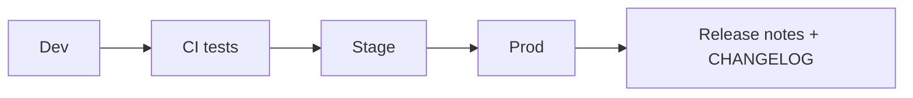

# Release Strategy

| Field | Value |
|-------|--------|
| Document | Release Strategy |
| Status | Normative |
| Layer | Standards |

---

## 1. Scope

This standard governs Release Strategy for the Mercury AEOS blueprint and conforming runtime implementations.

## 2. Design principles
Separate **blueprint versions** from **runtime package versions**. Prefer additive API changes. Program tags (Sprint N, Program B) communicate capability waves.

## 3. Normative requirements
- Runtime: semantic versioning for published APIs; OpenAPI diff in review.
- Blueprint: dated baselines in CHANGELOG (e.g., Baseline 1.0.0).
- Releases require: tests green, migrations forward-only, docs honesty updated.
- Hotfixes cannot skip audit or org isolation tests.

## 4. Release train

## 5. Future
Signed release artifacts; customer release channels for Enterprise edition.

---

## 6. Non-functional requirements

Traceability, reviewability, and operability appropriate to safety-adjacent enterprise software. Changes that alter normative rules require ADR or standards PR with CHANGELOG entry.

---

## 7. Security considerations

No standard may weaken organization isolation, RBAC, or fail-closed audit without an explicit superseding ADR.

---

## 8. Scalability considerations

Standards must remain implementable on the modular monolith and remain valid when contexts are extracted.

---

## 9. Related documents

[ADR Index](ADR/README.md) · [Coding Standards](Coding_Standards.md) · [API Standards](API_Standards.md) · [Technical Architecture](../02_Architecture/Technical_Architecture.md)
