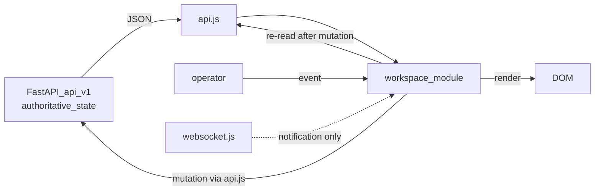

# UI Standards — Mercury Aviation Enterprise Operating System

| Field | Value |
|-------|-------|
| Document | UI Standards |
| Product | Mercury Aviation Enterprise Operating System (AEOS) |
| Organization | Mercury Technologies |
| Layer | Standards (frontend structure, module conventions, workspace navigation, accessibility, operational user experience) |
| Audience | Frontend developers, full-stack developers, designers, reviewers, accessibility and quality assessors |
| Status | Living baseline |
| Companion documents | [API Standards](API_Standards.md) · [Coding Standards](Coding_Standards.md) · [ADR register](ADR/README.md) |
| Upstream authority | [Technical Architecture §10](../02_Architecture/Technical_Architecture.md#10-frontend-architecture) · [ADR-0001](ADR/ADR-0001-vanilla-js-fastapi-aeos.md) |

---

## 1. Scope

### 1.1 In scope

This document governs **everything a developer does inside `frontend/`**:

- The vanilla JavaScript ES module structure, the file layout, and what each module may and may not do.
- The workspace and tab navigation model — how a product area is added without touching a central state container.
- The single API access path, error surfacing, and the rule that no screen calls `fetch` directly.
- Rendering conventions: escaping, empty states, loading and failure states, toasts, tables, and lists.
- Accessibility requirements and the honest current position against them.
- **Hangar and operations user-experience principles** — the design rules that come from the fact that Mercury's users wear gloves, stand under fluorescent light, and sign legal airworthiness records.
- **Brand and visual guidance that is additive**: how to extend the runtime's existing chrome, theme, and component vocabulary without redesigning it.
- The security obligations of a client that holds an authenticated session.

### 1.2 Out of scope

| Concern | Authoritative location |
|---------|------------------------|
| HTTP contract, pagination, errors, authentication mechanics | [API Standards](API_Standards.md) |
| Backend layering, transactions, tenancy enforcement | [Technical Architecture](../02_Architecture/Technical_Architecture.md) |
| Python, SQLAlchemy, Pydantic, and test conventions | [Coding Standards](Coding_Standards.md) |
| Permission and role definitions | [RBAC](../06_Security/RBAC.md) |
| Session lifecycle and credential handling | [Identity](../06_Security/Identity.md) |
| Signature semantics and what a signature legally is | [Digital Signatures](../06_Security/Digital_Signatures.md) |
| Domain workflows the screens express | [Business documentation set](../03_Business/) |
| Edition-based feature availability | [Editions](../05_Product/Editions.md) |

### 1.3 Honesty markers

| Marker | Meaning |
|--------|---------|
| **Current** | Implemented in the runtime frontend |
| **Partial** | Present on some screens, not all |
| **Planned** | Specified here, not built |
| **Debt** | A known deviation from these standards, tracked deliberately |

A rule without a marker is **normative for all new and modified screens**, whether or not every existing screen already satisfies it.

---

## 2. The framework constraint

### 2.1 The rule

**The Mercury operator interface is vanilla JavaScript, HTML, and CSS. There is no build step, no bundler, no transpiler, and no single-page-application framework. React, Vue, Angular, Svelte, and Next.js will not be introduced.**

This is a founding architectural constraint, recorded in [ADR-0001](ADR/ADR-0001-vanilla-js-fastapi-aeos.md), stated in the [Blueprint README](../../README.md), and listed among the [ROADMAP.md](../../ROADMAP.md) non-goals. It is not a temporary state, not a resource constraint, and not open to revisiting through incremental adoption.

### 2.2 What is prohibited, specifically

| Prohibited | Why |
|------------|-----|
| Any SPA framework or its runtime | The constraint exists precisely to avoid a framework's lifecycle, reconciliation model, and upgrade treadmill |
| A bundler, transpiler, or compile step | The deployed frontend is the authored frontend. What a reviewer reads is what a technician runs |
| A `package.json` for the operator interface, or an `npm install` in the deployment path | A frontend with no dependency tree has no frontend supply-chain surface |
| A virtual DOM, a reactive store, a template compiler, or a client-side router | Each of these is a framework in a small package, and none survives one release without growing |
| A CSS framework or utility-class system that replaces the existing component classes | The existing class vocabulary *is* the design system |
| A new third-party asset loaded from a content delivery network | See §12.5 — the deployed content security policy is `script-src 'self'` |
| Web Components with a heavy runtime, or a JSX-like syntax requiring compilation | Same reason as a bundler |

### 2.3 What is encouraged

Native platform capability is not a workaround for the absence of a framework; it is the point.

| Use | For |
|-----|-----|
| ES modules with static `import`, and dynamic `import()` for lazy workspace loading | Structure and code splitting, natively |
| `fetch` with `AbortController` | Requests with timeouts, in the API module only |
| Template literals plus a mandatory escape helper | Rendering |
| `URLSearchParams` | Query string construction |
| `classList.toggle(name, condition)` | Show, hide, and active-state management |
| Optional chaining and nullish coalescing | Defensive access to elements that may not be on the current screen |
| `Promise.all` and `Promise.allSettled` | Concurrent loads — `all` when the screen is meaningless without every part, `allSettled` when sections degrade independently |
| CSS custom properties, grid, flexbox, container queries | Theming and layout |
| `<dialog>`, `<details>`, native form validation, `aria-live` | Behaviour that would otherwise be re-implemented badly |

**The standing test for any proposed abstraction:** would a developer joining next month understand this by reading the file, without learning a Mercury-specific concept? If not, do not add it.

---

## 3. File and module organization

### 3.1 Layout

**Current.**

```text
frontend/
├── index.html              All screen markup and layout for every workspace
├── nginx.conf              Static delivery, same-origin /api and WebSocket proxy, security headers
├── css/
│   ├── base.css            Resets, typography, colour and spacing custom properties
│   ├── layout.css          Page, workspace, and grid structure
│   ├── components.css      The component class vocabulary — cards, tables, rows, tabs, badges
│   └── responsive.css      Breakpoints, including tablet use in the hangar
└── js/
    ├── config.js           API base and WebSocket URL resolution, static reference constants
    ├── api.js              THE ONLY module that talks to /api/v1
    ├── utils.js            el, esc, fmt, download, toast — shared primitives
    ├── state.js            Shared in-page view state
    ├── app.js              Application shell: session, navigation binding, status, health
    ├── enterprise.js       Enterprise workspaces and the workspace switcher
    ├── fleet.js · maintenance.js · planning.js · logistics.js   Domain workspaces
    └── websocket.js        Notification connection and reconnection
```

### 3.2 Module contract

| Module class | Responsibility | Must never |
|--------------|----------------|-----------|
| `config.js` | Resolve the API base and WebSocket URL; hold static reference constants | Call the network; hold mutable state |
| `api.js` | Every HTTP call, timeout handling, error message extraction, credential inclusion | Touch the DOM; contain domain logic |
| `utils.js` | Small, pure, dependency-free primitives | Import a domain module; call the network |
| `app.js` | Session establishment, global event binding, platform status | Contain a domain workspace's rendering |
| Domain workspace module | Load its own data, render its own DOM, bind its own events | Call `fetch`; render another workspace's DOM; enforce a permission |
| `websocket.js` | Connect, authenticate implicitly by cookie, reconnect, dispatch notifications | Carry authoritative state |

### 3.3 The exported shape of a domain workspace

Every domain module exports exactly two public functions. **Current** — established by `logistics.js` and `planning.js`.

```javascript
import { el, esc } from "./utils.js";
import { request } from "./api.js";

function qs(params = {}) {
  const sp = new URLSearchParams();
  Object.entries(params).forEach(([k, v]) => {
    if (v !== undefined && v !== null && v !== "") sp.set(k, String(v));
  });
  const s = sp.toString();
  return s ? `?${s}` : "";
}

async function getJson(path) {
  return (await request(path)).json();
}

/** Load and render everything this workspace shows. Safe to call repeatedly. */
export async function refreshLogisticsWorkspace() { /* ... */ }

/** Bind this workspace's event listeners exactly once, at startup. */
export function initializeLogistics() { /* ... */ }
```

| Export | Contract |
|--------|----------|
| `refresh<Domain>Workspace()` | Idempotent. Loads current data and re-renders. Catches its own failures and surfaces them through a toast. Never throws to the caller |
| `initialize<Domain>()` | Called once. Binds listeners with optional chaining so a missing element is not a crash. Does not fetch |

### 3.4 Module rules

1. **Import only what you use, by name.** No wildcard imports, no default exports.
2. **Never reach into another domain module's DOM.** If two workspaces need the same rendering, the helper moves to `utils.js`.
3. **Never duplicate a primitive.** `esc`, `el`, `fmt`, `download`, and `toast` live in `utils.js` and are imported. **Debt:** duplicate `esc` and `download` helpers exist in older modules; new code imports rather than re-declaring, and duplicates are consolidated when the surrounding file is touched.
4. **Keep functions small enough to read in one screen.** A render function that exceeds roughly fifty lines is doing more than one job.
5. **`const` by default, `let` when reassigned, `var` never.**
6. **A module that grows past roughly six hundred lines is split by feature area**, not by arbitrary line count.

---

## 4. Workspaces and tabs

### 4.1 The product navigation model

**Current.** The application is a set of **workspaces**, selected by a top-level product tab bar, plus **tabs** within a workspace for sub-views.

```html
<nav class="product-nav" aria-label="Mercury workspaces">
  <button class="product-tab active" data-workspace="command">Command</button>
  <button class="product-tab" data-workspace="maintenance">Maintenance</button>
  <button class="product-tab" data-workspace="planning">Planning</button>
  <button class="product-tab" data-workspace="logistics">Logistics</button>
</nav>

<section id="logisticsWorkspace" class="workspace-page enterprise-page hidden">
  <!-- workspace content -->
</section>
```

```javascript
function showWorkspace(name) {
  workspaces.forEach((x) => {
    el(`${x}Workspace`)?.classList.toggle("hidden", x !== name);
    el(`${x}Workspace`)?.classList.toggle("active", x === name);
  });
  document.querySelectorAll(".product-tab")
    .forEach((b) => b.classList.toggle("active", b.dataset.workspace === name));
  if (name === "logistics") {
    import("./logistics.js").then((m) => m.refreshLogisticsWorkspace()).catch(() => {});
  }
}
```

### 4.2 The naming contract

| Element | Convention |
|---------|-----------|
| Product tab | `<button class="product-tab" data-workspace="<name>">` |
| Workspace section | `<section id="<name>Workspace" class="workspace-page hidden">` |
| Active workspace | `.active` present, `.hidden` absent |
| Inner tab | `<button class="tab" data-tab="<name>">` |
| Inner panel | `<div id="<name>Tab" class="tab-panel hidden">` |
| Workspace name | `camelCase` in the `data-workspace` attribute, matching the element identifier prefix exactly — `digitalTwin` and `digitalTwinWorkspace` |

The identifier convention is load-bearing: the switcher derives element identifiers from the workspace name by string concatenation. A name that does not follow it produces a tab that appears to do nothing.

### 4.3 Adding a workspace — the checklist

1. Add a `.product-tab` button with a `data-workspace` name to the product navigation in `index.html`.
2. Add a `<section id="<name>Workspace" class="workspace-page hidden">` with the screen's markup, reusing existing component classes.
3. Add the name to the `workspaces` list used by the switcher.
4. Create `frontend/js/<name>.js` exporting `refresh<Name>Workspace()` and `initialize<Name>()`.
5. Call `initialize<Name>()` once at startup; call the refresh from the switcher, lazily via dynamic `import()` if the workspace is heavy.
6. Reuse existing CSS classes. Add new component classes only for a genuinely new component — see §11.
7. Verify the accessibility requirements in §10, including keyboard reachability.
8. Verify the workspace renders correctly with no data, with a backend that is offline, and for a viewer-role user with no write permissions.

**Adding a workspace must not require editing another workspace's module.** If it does, the coupling is a defect.

### 4.4 Deep linking

**Planned.** There is no client-side router today; a workspace selection is not reflected in the URL, so it cannot be bookmarked or shared. When added it will be a hash fragment read at startup and updated on switch — approximately fifteen lines, no router library, no history abstraction. It is genuinely useful for support ("open this URL and tell me what you see") and it is on the list in §14.

### 4.5 Lazy loading

Heavy workspaces are loaded with dynamic `import()` on first activation, as planning and logistics already are. Rules:

- The `import()` failure path must degrade visibly, not silently. **Debt:** current call sites use an empty `catch`, so a failed module load leaves an empty workspace with no explanation. New call sites surface a toast.
- The imported module's refresh is called after the workspace becomes visible, so measurement-dependent rendering has real dimensions.
- Never lazy-load `api.js`, `utils.js`, or `config.js`. They are needed immediately and are small.

---

## 5. The API module is the only door

### 5.1 The rule

**Every network call goes through `api.js`. A screen that calls `fetch` directly has bypassed the platform's timeout, error extraction, and credential handling.** **Current.**

```javascript
async function request(path, options = {}) {
  const controller = new AbortController();
  const timeoutId = setTimeout(() => controller.abort(), DEFAULT_TIMEOUT_MS);
  try {
    const response = await fetch(`${API_BASE}${path}`, {
      credentials: "include",
      ...options,
      signal: controller.signal,
    });
    if (!response.ok) {
      let detail = `Request failed (${response.status})`;
      try {
        const body = await response.json();
        detail = body.detail || detail;
      } catch {
        // Response did not contain JSON error details.
      }
      throw new Error(detail);
    }
    return response;
  } catch (error) {
    if (error.name === "AbortError") throw new Error("Backend request timed out");
    throw error;
  } finally {
    clearTimeout(timeoutId);
  }
}
```

### 5.2 What this centralisation guarantees

| Guarantee | Mechanism |
|-----------|-----------|
| The session cookie is always sent | `credentials: "include"` in one place |
| No request hangs indefinitely | `AbortController` with a default eight-second timeout |
| Server error messages reach the user | `detail` extraction, with a status-derived fallback |
| A timeout is distinguishable from a rejection | `AbortError` is translated to an explicit message |
| Paths are relative to one configured base | `API_BASE`, resolved in `config.js` |
| A new cross-cutting need has one place to be added | Retry policy, correlation identifiers, telemetry |

### 5.3 API base resolution

**Current.** `config.js` resolves the base in priority order: `window.__MERCURY_API_BASE__`, then `<meta name="mercury-api-base">`, then the default `/api/v1`.

The default is **relative and same-origin**, which is what makes production deployment simple: the web tier proxies `/api` and the WebSocket path, so the browser sees one origin and no cross-origin configuration exists to misconfigure. The override exists for dual-process local development, where the API runs on a separate port. Never hard-code an absolute API URL in a module.

### 5.4 Timeouts and long operations

The default timeout is eight seconds, which is correct for the reads and writes that make up almost all traffic. Genuinely long operations — work package generation across two hundred job cards, bulk adjustments, large exports — pass an explicit longer timeout rather than raising the default for everything. A raised global timeout converts a fast failure into a frozen screen.

### 5.5 Error presentation

| Situation | Presentation |
|-----------|-------------|
| A failed action the user initiated | A toast carrying the server's `detail`, verbatim where it is user-appropriate |
| A failed background refresh | A toast plus the affected section showing its previous content or an explicit failure state — never a blank panel with no explanation |
| A `401` | Re-authentication, not an error message. The session expired; that is a normal event |
| A `403` | An explanation that the action requires a permission the user lacks. Never "something went wrong" |
| A `409` | The server's message, which names the conflict, plus a refresh so the user sees current state |
| A timeout | "Backend request timed out", plus a retry affordance |

**Never swallow an error into a silent no-op.** An empty `catch {}` around a user-initiated action is a defect: the operator concludes the system accepted the work.

---

## 6. Rendering

### 6.1 Escaping is mandatory

**Every value that originates outside the module — from the API, from a form field, from a scan — is escaped before it enters `innerHTML`.**

```javascript
import { esc } from "./utils.js";

const row = `<div class="contact-row">
  <b>${esc(part.oem_part_number)}</b>
  <span>${esc(part.description)} · ${esc(part.part_class)}</span>
  <em>${esc(part.issue_policy || "")}</em>
</div>`;
```

| Rule | Detail |
|------|--------|
| Use `esc` from `utils.js` | It escapes `&`, `<`, `>`, `"`, and `'`, and coerces `null` and `undefined` to an empty string |
| Escape at interpolation, not at storage | A value escaped early and interpolated twice is double-escaped and displays wrongly |
| Numbers are escaped too | Uniformity removes the judgement call about whether a field is "really" numeric |
| `textContent` for a plain string | Cheaper and inherently safe; use it when there is no markup |
| Never interpolate an unescaped value into an attribute | `esc` covers quotes for exactly this reason |
| Never build an `onclick=` handler in a template | Bind with `addEventListener` after insertion, or use a delegated listener with a `data-` attribute |

**Debt:** unescaped `innerHTML` interpolation exists on some older enterprise, audit, history, and timeline surfaces. It is recorded in the runtime release audit, it is a genuine cross-site scripting risk, and it is fixed when a surface is touched. New code has no exceptions.

### 6.2 Rendering helpers

The established list-rendering shape, reusable across workspaces:

```javascript
function renderRows(hostId, rows, empty) {
  const host = el(hostId);
  if (!host) return;
  host.innerHTML = rows.length ? rows.join("") : `<div class="empty">${esc(empty)}</div>`;
}
```

| Rule | Detail |
|------|--------|
| One `innerHTML` assignment per container | Not one per row. Repeated assignment forces repeated layout |
| A missing container is a no-op, not a crash | `if (!host) return;` — the workspace may not be on screen |
| Every collection has an explicit empty state with real text | "No warehouses." beats an empty box, which is indistinguishable from a failure |
| Empty-state text says what is absent, and how to add it where relevant | "No job cards in this package. Generate a package from a check to create them." |

### 6.3 Loading and failure states

Every region that loads data has four visually distinct states, and a screen that cannot distinguish them is not finished:

| State | Requirement |
|-------|-------------|
| Loading | A skeleton or an explicit "Loading…". Never a blank container |
| Loaded with data | The content |
| Loaded and genuinely empty | The empty state from §6.2 |
| Failed | An explicit failure message with a retry affordance. Never indistinguishable from empty |

**Empty and failed being confusable is a safety issue, not a polish issue.** A technician who sees an empty deferred-defect list concludes the aircraft has no open defects. If that list actually failed to load, the conclusion is wrong and the consequence is operational.

### 6.4 Numbers, units, and time

| Rule | Rationale |
|------|-----------|
| Always show the unit: hours, cycles, days, each, kilograms, currency | An unlabelled quantity in aviation maintenance is an invitation to a unit error |
| Show quantities at the precision the API returned | Trimming `42.000` to `42` hides that this part is tracked to three decimal places |
| Never round a life-limit, life remaining, or a quantity in a decision-supporting display | Rounding a remaining-life figure downward is misleading; upward is dangerous |
| Format timestamps with `fmt` from `utils.js`; show the absolute time, and a relative time only in addition | "2 hours ago" is unusable in a handover across a shift boundary |
| State the time zone, or use the operator's local time consistently and label it | Maintenance records cross time zones by nature |
| A missing time reads "Unknown time", never an empty cell or the epoch | An empty cell reads as "no event"; "Unknown time" reads as "we do not know" |

### 6.5 Tables and lists

| Rule | Detail |
|------|--------|
| Use a real `<table>` with `<thead>` and `<th>` for tabular data | Screen readers, and correct column semantics |
| Reuse `.data-table`, `.contact-row`, `.card`, and the existing component classes | See §11 |
| Wrap wide tables in `.table-wrap` for horizontal scrolling on a tablet | A cut-off column is lost data |
| Server-side pagination, never client-side over a fetched-everything list | See [API Standards §5.1](API_Standards.md#51-pagination) |
| Order stably | A list that reorders between refreshes makes a user lose their place mid-task |
| Do not truncate a part number, serial number, or task number | These are identifiers a human will read aloud or type. Truncate descriptions instead |

### 6.6 Forms

| Rule | Detail |
|------|--------|
| Every control has an associated `<label>` | Not a placeholder pretending to be a label; a placeholder disappears as soon as typing begins |
| Use native validation attributes plus server validation | The client is a courtesy; the server is the control |
| Show server field errors next to the field where the error path identifies one | The `422` `loc` array names the field — use it |
| Disable a submit button while its request is in flight, and restore it in a `finally` | Double submission on an endpoint without replay protection creates duplicate records. See [API Standards §8](API_Standards.md#8-idempotency-and-safe-retries) |
| Never clear a form on failure | Retyping fourteen fields after one validation error is how operators learn to distrust a system |
| Preserve entered values across a refresh where the entry is long | Losing a partially written finding is losing evidence |
| Ask for confirmation on irreversible actions, naming the object and the effect | "Scrap 4 × MS21042L3 from A-12-3? This cannot be undone." |

---

## 7. State and data flow

### 7.1 The server is the truth



Solid edges are the authoritative path. The dotted edge is a notification: it says something changed and prompts a re-read. It never carries state the client trusts.

### 7.2 Rules

1. **No client-side cache of domain data beyond the current render.** A cache invalidated wrongly shows a technician a stale airworthiness status.
2. **After a mutation, re-read.** Do not patch the local rendering to what you assume the server did. The server may have applied a rule you did not model — a status roll-up, a reservation promotion, a version increment.
3. **No global mutable store as an application backbone.** `state.js` holds view state — the selected incident, the active filter — not a shadow copy of the domain.
4. **Derive, do not duplicate.** If a value can be computed from what the API returned, compute it at render time.
5. **A workspace's refresh is idempotent and safe to call at any time**, including while another refresh is in flight.
6. **Concurrency shape:** `Promise.all` when the screen is meaningless without every part; `Promise.allSettled` when sections degrade independently. Choose deliberately — `all` means one failed panel blanks the workspace.

### 7.3 Real-time is additive

**Every screen must be fully correct and usable if the WebSocket never connects.** The socket reduces the need to press refresh; it is never the only way to learn something. A notification triggers a re-read through `api.js`. A client that reconstructs state from a message stream will drift, and in this domain drift means showing an aircraft as serviceable when it is not.

On reconnect, perform a full refresh: messages missed while disconnected are gone, and there is no replay.

### 7.4 Permission-aware rendering is a courtesy, never a control

Hiding a button the user cannot use is good design. It is **not** authorization: the server enforces every permission, and a hidden control is still callable by anyone with a browser console. Two consequences:

- Never treat a hidden control as a security measure. See [API Standards §7](API_Standards.md#7-authentication-authorization-and-organization-scoping).
- Prefer **disabled with an explanation** over hidden where the user might reasonably expect the control to exist. A missing button reads as a broken screen; a disabled button reading "Requires ACA authority" teaches the user how the organization works.

### 7.5 Provenance and simulated data

Mercury distinguishes operator-entered, system-generated, and **simulated** data. Where a surface displays simulated or demonstration data, **the UI says so, visibly, on that surface.** A seeded demonstration fleet that read as operational truth to a lessor or an auditor would be a serious integrity failure, and the interface is the last place that distinction can be lost. See [Audit](../06_Security/Audit.md) on the provenance model.

**Debt:** some legacy surfaces present simulated values with insufficient labelling. Marking them is required work, not a refinement.

---

## 8. Hangar and operations user experience

### 8.1 Who the user actually is

These principles are not general web usability advice. They follow from the specific conditions in which Mercury is used.

| Condition | Design consequence |
|-----------|-------------------|
| The user wears gloves and may be holding a tool | Large hit targets, generous spacing, no hover-only affordances, no drag-and-drop as the only path |
| Lighting is fluorescent, or daylight through a hangar door | High contrast, no thin light-grey text, no colour-only encoding |
| The device is a tablet on a stand, or a shared shop-floor terminal | Touch-first sizing, readable at arm's length, no dependence on a mouse or a hover state |
| The user is standing, interrupted, and may be mid-task for an hour | Explicit save points, preserved input, no timeout that silently discards work |
| The user is legally signing a maintenance release | Deliberate, unmistakable confirmation before any signing action |
| A shift handover happens mid-task | State visible to the next person: who did what, when, and what remains |
| Network coverage in a hangar is imperfect | Honest offline and timeout states, never a spinner that never resolves |
| The consequence of a misread is an airworthiness error | Clarity over density; never a clever compression of a safety-relevant fact |

### 8.2 The operational principles

| # | Principle | Practice |
|---|-----------|----------|
| 1 | **Status is never ambiguous.** | Aircraft, task, job card, and stock status is shown with a word, not only a colour. `AOG` reads as `AOG`, not as a red dot |
| 2 | **Safety-relevant state is never behind a tab.** | Open MEL items, deferred defects, expired calibration, and life-limited-part alerts are visible on the workspace's primary view |
| 3 | **The next action is obvious.** | A job card shows the step that is next and who may perform it. A technician should not have to know the state machine |
| 4 | **Irreversible actions are confirmed and named.** | Signing, releasing, scrapping, and issuing state the object and the effect in the confirmation |
| 5 | **Signing is deliberate and never batched by accident.** | A signature is one explicit act per step, with the credential requested at the moment of signing |
| 6 | **Nothing implies more authority than it has.** | A hash-attested signature is never presented as a cryptographic certificate signature. See [ADR-0006](ADR/ADR-0006-hash-signatures-before-pki.md) |
| 7 | **Scan-first where a scan exists.** | Part, tool, and location entry accepts a barcode or radio-frequency identifier scan into the same field as typing, with the scan resolving to the record |
| 8 | **Shortages are shown as shortages.** | A parts plan line that is short says short, with the expected delivery. Never a comfortable default that implies availability |
| 9 | **Quantities show their unit and their precision.** | See §6.4 |
| 10 | **Feedback is immediate, and honest about duration.** | A long operation shows progress and what it is doing, not an indefinite spinner |
| 11 | **The user is told what they cannot do, and why.** | See §7.4 |
| 12 | **A failure never looks like a success or like emptiness.** | See §6.3 |
| 13 | **Handover context is preserved.** | Who last touched a record, when, and what state it is in, on the record itself |
| 14 | **Density serves the task.** | A stores keeper picking forty lines wants a dense table. An inspector signing one item wants a large, unambiguous panel. Both are correct in their place |
| 15 | **The workspace remembers where the user was** within a session, so an interrupted task is resumable. |

### 8.3 Confirmation patterns

| Action class | Pattern |
|--------------|---------|
| Reversible edit | No confirmation. Save, then show what was saved |
| Soft delete | Confirm, naming the object |
| Stock issue, transfer, adjust | Confirm with quantity, part, and location stated |
| Scrap | Confirm with an explicit "cannot be undone", plus a mandatory reason |
| Bulk operation | Show the line count and the reason field before submitting; show the per-line result afterwards, with rejections first. See [API Standards §9.2](API_Standards.md#92-the-per-line-result-contract) |
| Certification signing | A distinct, unmistakable signing panel: the step being signed, the employee signing, the credential prompt, and the consequence |
| Aircraft release | The strongest confirmation in the product. State the aircraft, the task, the publication revision cited, and that a technical logbook entry will be created |

### 8.4 What must never be done

- Never place a destructive action adjacent to a routine one with identical styling.
- Never make a signing action the default focus of a form.
- Never auto-submit on scan where the scan completes a destructive operation.
- Never use a toast alone to report a failure the user must act on.
- Never rely on colour alone to distinguish serviceable from unserviceable.
- Never show a countdown or an auto-dismiss on a safety-relevant warning.
- Never silently drop a field the server rejected.

---

## 9. Visual language and brand-safe extension

### 9.1 The governing rule

**The runtime's existing chrome, layout, theme, and component vocabulary are the design system. Extend them; do not redesign them.**

This is the direct application of the blueprint's additive-over-rewrite rule from [CONTRIBUTING.md §2](../../CONTRIBUTING.md#2-ground-rules) to the interface. A redesign of working chrome delivers no capability, invalidates every operator's learned muscle memory, and consumes review capacity that belongs to safety-relevant work.

### 9.2 What is fixed

| Fixed | Meaning |
|-------|---------|
| The product tab bar and the workspace model | New areas become workspaces; they do not introduce a second navigation paradigm |
| The header, status indicator, and session and context controls | Extended in place; not relocated or re-styled |
| The existing component classes — `card`, `data-table`, `contact-row`, `tabs`, `tab-panel`, `empty`, `panel-title`, `stats`, `table-wrap` | The vocabulary a new screen composes from |
| The colour, spacing, and typography tokens in `base.css` | Referenced, never bypassed with hard-coded values |
| The four-file CSS structure | New rules go in the file that owns that concern |
| No icon font, no illustration library, no external font | Consistent with §12.5 |

### 9.3 What is open

| Open | Constraint |
|------|-----------|
| A new component class for a genuinely new component | Named in the existing style, defined in `components.css`, built from existing tokens |
| A new workspace | Composed from existing classes, following §4.3 |
| A new density variant of an existing component | A modifier class, not a fork of the component |
| Additional responsive behaviour | In `responsive.css`, extending existing breakpoints |
| A new theme | Delivered as a set of custom-property overrides, never as a parallel stylesheet |

### 9.4 CSS rules

1. **Use the custom properties.** No hard-coded hex colours, and no magic pixel values where a spacing token exists.
2. **Never restyle a bare element selector globally** from a workspace's rules. `button { … }` in a domain context is a platform-wide change disguised as a local one.
3. **Class selectors, single level of nesting, no identifier selectors for styling.** Identifiers are for JavaScript.
4. **No `!important`** outside a documented, commented override of a third-party style.
5. **Additive changes only to shared files.** Changing an existing component class means auditing every screen that uses it, and saying so in the change description.
6. **Contrast is verified, not assumed.** See §10.4.
7. **Respect `prefers-reduced-motion`.** Animation in an operational interface is decoration, and decoration is optional.

### 9.5 Content and tone

| Rule | Example |
|------|---------|
| Use the controlled terminology exactly | "work package", "work order", "job card", "ACA release", "publication revision" — see [CONTRIBUTING.md §4](../../CONTRIBUTING.md#4-controlled-terminology) |
| Name the actor in a message | "The ACA holder must certify this task before release" |
| No marketing language, no exclamation marks, no emoji in operational text | An interface that celebrates is an interface that is not trusted |
| Sentence case for labels and buttons | Consistent with the existing chrome |
| Describe the state, not the person | "Insufficient stock to reserve: requested 12, available 4", not "You asked for too many" |
| Spell out an acronym on first use in a screen | Then use the acronym |

---

## 10. Accessibility

### 10.1 The target

**Mercury targets WCAG 2.1 Level AA.** **Partial** today, honestly. This section states the requirements as normative for new and modified screens, and names the current gaps rather than implying compliance.

Accessibility here is not only a legal or ethical obligation. It overlaps almost entirely with hangar usability: contrast, target size, keyboard operation, and not encoding meaning in colour alone are the same requirements that make the interface work under a hangar door in daylight.

### 10.2 Semantics and landmarks

| Requirement | Position |
|-------------|----------|
| Landmark elements — `<nav>`, `<main>`, `<section>` with an accessible name | **Current** for the primary navigation and several sections, including `aria-label="Mercury workspaces"` |
| Every section has an accessible name | **Partial** — required on new sections |
| Headings form a correct, sequential outline with no skipped levels | **Partial** |
| Real `<button>` for actions, real `<a>` for navigation | **Current** — the product tabs are buttons, which is correct |
| Tabular data in a `<table>` with `<th>` and scope | **Current** on the principal tables |
| Every form control has a programmatically associated label | **Partial** — required on new forms |

### 10.3 Tabs, keyboard, and focus

**The most significant accessibility gap in the current frontend is that the workspace and tab bars are button groups without tab semantics or arrow-key navigation.** They are keyboard reachable — they are real buttons — but they do not announce as a tab set. **Debt.**

Requirements for new and modified tab bars:

| Requirement | Detail |
|-------------|--------|
| `role="tablist"` on the container, `role="tab"` on each control | Announces the relationship |
| `aria-selected="true"` on the active tab, `false` on the others | Announces the current state |
| `aria-controls` on each tab, pointing at its panel; `role="tabpanel"` and `aria-labelledby` on each panel | Binds tab to content |
| Arrow-key movement within the tab set, `Home` and `End` to the ends | The expected interaction for a tab set |
| One tab stop for the whole tab set, using `tabindex="-1"` on inactive tabs | A twelve-workspace bar should not be twelve tab stops |
| Visible focus indicator, never removed | An operator navigating by keyboard must always know where they are |
| Focus moves into a newly revealed panel or dialog, and returns on close | Otherwise focus is stranded on a hidden element |
| A hidden panel is hidden from assistive technology, not merely visually | `.hidden` must set `display: none` or `hidden`, not only opacity |

### 10.4 Colour, contrast, and non-colour encoding

| Requirement | Detail |
|-------------|--------|
| Text contrast at least 4.5:1; large text at least 3:1 | Verified with a contrast tool, not by eye |
| Non-text indicators — status dots, borders, chart series — at least 3:1 | A status dot is information |
| **No meaning conveyed by colour alone** | Every status has a text label. This is both a WCAG requirement and a hangar requirement |
| Status indicators pair colour with a word and, where useful, a shape | `online` / `degraded` / `offline` are announced as words |
| Focus indicators meet contrast against both the control and the background | — |

### 10.5 Motion, timing, and announcements

| Requirement | Detail |
|-------------|--------|
| Honour `prefers-reduced-motion` | **Planned** |
| No content flashing more than three times per second | — |
| Toasts have a minimum readable duration and do not carry information available nowhere else | A 2.2-second toast is the only notice of a failure is not acceptable for anything the user must act on |
| Asynchronous outcomes announced in an `aria-live="polite"` region | **Planned** — currently a toast is visual only, so a screen-reader user is not told the save succeeded |
| Errors announced with `aria-live="assertive"` and associated with the field via `aria-describedby` | **Planned** |
| No time-based session expiry that discards work without warning | Warn before expiry and preserve input |

### 10.6 Touch and target size

| Requirement | Detail |
|-------------|--------|
| Interactive targets at least 44 by 44 CSS pixels | The gloved-hand requirement and the WCAG target-size guidance coincide |
| At least 8 pixels between adjacent interactive targets | Mis-taps in a stock transaction have physical consequences |
| No hover-only affordance | There is no hover on a tablet |
| No gesture that has no button equivalent | — |
| Usable at 200 percent zoom without horizontal scrolling of the page | Wide tables scroll within `.table-wrap`; the page does not |

### 10.7 Verification

| Check | How | Position |
|-------|-----|----------|
| Keyboard-only traversal of every workspace | Manual, per screen change | Normative in review |
| Screen-reader pass on new screens | Manual, with a common screen reader | Normative for new screens |
| Automated accessibility linting in continuous integration | Tooling | **Planned** |
| Contrast verification of theme tokens | Tooling | **Planned** |
| Documented conformance statement | Assessment | **Planned** |

---

## 11. Non-functional requirements

### 11.1 Performance

| Concern | Current baseline | Aspirational enterprise target |
|---------|------------------|-------------------------------|
| Initial load | No build step, no framework runtime, four stylesheets, ES modules loaded natively | Under 1.5 seconds to interactive on hangar-grade hardware and network |
| Workspace switch | Show or hide plus a data refresh; heavy workspaces lazily imported | Under 200 milliseconds to visible, data arriving progressively |
| Workspace refresh | Concurrent requests via `Promise.all` | Under 1 second for a workspace of ten collections |
| Render cost | One `innerHTML` assignment per container | Unchanged |
| Request timeout | Eight seconds by default | Unchanged, with explicit longer timeouts for known-long operations |
| Payload size | Server-clamped list limits; summary models on collections | Unchanged, plus field selection |
| Frontend dependency weight | **Zero framework dependencies** | Unchanged — this is a permanent property, not a current state |

### 11.2 Reliability

| Requirement | Position |
|-------------|----------|
| A missing DOM element never throws | **Current** — optional chaining and `if (!host) return` guards |
| A failed refresh surfaces an error and does not blank the workspace | **Partial** — required on new screens |
| A failed lazy import degrades visibly | **Debt** — empty `catch` at current call sites |
| Every screen works with the WebSocket disconnected | **Current** |
| Every screen works with no data | **Normative**, verified per §4.3 |
| Every screen works for a read-only role | **Normative**, verified per §4.3 |

### 11.3 Maintainability

| Requirement | Position |
|-------------|----------|
| One module per workspace, two public exports | **Current** |
| No workspace imports another workspace | **Current** |
| Shared primitives live in `utils.js` | **Partial** — duplicates being consolidated |
| All network access through `api.js` | **Current** |
| No framework, no build step | **Current, permanent** |
| Adding a workspace touches only `index.html`, the workspace list, and the new module | **Current** |

### 11.4 Compatibility

| Requirement | Position |
|-------------|----------|
| Current versions of Chrome, Edge, Firefox, and Safari | **Current** |
| Tablet form factors, touch-first | **Current** via `responsive.css` |
| No transpilation, so language features must be broadly supported | **Current** — ES modules, optional chaining, and `URLSearchParams` all qualify |
| Offline operation | **Not supported, and not claimed.** A maintenance record created against stale data is worse than a record not created. Any future offline capability requires an ADR addressing conflict resolution for evidence |

---

## 12. Security considerations

**The client enforces nothing.** Every permission, tenancy rule, and invariant is enforced server-side. Hiding a control is a courtesy; the server is the control. See [API Standards §7](API_Standards.md#7-authentication-authorization-and-organization-scoping) and [ADR-0003](ADR/ADR-0003-org-isolation-multitenancy.md).

**Cross-site scripting is the frontend's primary risk, and escaping is the control.** Mercury renders with template literals and `innerHTML`, which makes `esc` mandatory rather than advisory. The known unescaped surfaces are listed as **Debt** in §6.1; they are defects, not style preferences. Never build inline event handlers from data.

**The session is not reachable by script.** The cookie is `HttpOnly`, so a cross-site scripting defect cannot exfiltrate the session. Correspondingly: **never** copy a session identifier, a credential, or a signing PIN into `localStorage`, `sessionStorage`, a global variable, the URL, or a log line. The frontend holds no secrets, and that is a design property worth protecting.

**No authorization state is trusted from the client.** The context switcher requests a change; the server re-verifies membership, re-derives the effective role, and audits the switch.

**Signing credentials are transient.** A PIN or password entered for a signature is sent once, never stored, never retained in a field after submission, and never echoed. Clear the input in a `finally`.

**Content Security Policy is deployed and is `script-src 'self'`.** The web tier sets `default-src 'self'`, `script-src 'self'`, `style-src 'self' 'unsafe-inline'`, `img-src 'self' data:`, `connect-src 'self' wss: ws:`, `frame-ancestors 'self'`, `base-uri 'self'`, and `form-action 'self'`, alongside `X-Frame-Options: SAMEORIGIN`. Two normative consequences:

1. **No inline `<script>`, no `eval`, no `new Function`, no string-bodied `setTimeout`.** These will not execute in a deployed environment, and code that depends on them will pass in development and fail in production.
2. **No new third-party asset from a content delivery network.** **Debt:** the mapping library is currently loaded from a public content delivery network without subresource integrity, which conflicts with the deployed script policy and introduces a third-party supply-chain dependency into an otherwise dependency-free frontend. The remediation is to vendor and pin it locally; until then it is recorded here rather than ignored. New third-party assets are vendored, pinned, and reviewed — never linked.

**`style-src` permits inline styles**, which is why dynamic inline `style` attributes are used sparingly and never to inject untrusted values. A value interpolated into a `style` attribute is escaped like any other.

**External links carry `rel="noopener noreferrer"`** where a `target` is set.

**Errors shown to a user never expose internals.** The server's `detail` is written for an operator; the frontend does not add stack traces, internal paths, or raw response bodies to the interface.

**Simulated data is labelled.** An unlabelled simulated value presented to a lessor, an auditor, or an inspector is an integrity failure that originates entirely in the interface. See §7.5.

Full platform posture: [SECURITY.md](../../SECURITY.md), [Identity](../06_Security/Identity.md), [RBAC](../06_Security/RBAC.md), [Audit](../06_Security/Audit.md).

---

## 13. Scalability considerations

### 13.1 What scales well already

| Property | Why |
|----------|-----|
| No framework runtime and no bundle | Load cost does not grow with the number of workspaces |
| Lazy workspace imports | A twenty-workspace product loads like a three-workspace one |
| Server-side pagination with clamped limits | A screen's cost does not grow with a tenant's data volume |
| Independent workspace modules | Frontend work parallelises across developers without merge contention in a central store |
| One `innerHTML` assignment per container | Render cost is linear in visible rows, not in total rows |

### 13.2 Where growth needs attention

| Concern | Response |
|---------|----------|
| `index.html` holding every workspace's markup | Split into server-included fragments, or generate the shell — **Planned**, and it must not introduce a build step |
| Large tables rendered in full | Server pagination first; row virtualisation only if a genuine case survives pagination |
| Many concurrent requests per workspace | Keep collections narrow and add purpose-built dashboard endpoints rather than compound reads. See [API Standards §9.5](API_Standards.md#95-bulk-read) |
| Real-time fan-out at replica count above one | Blocked on broker-backed fan-out; the frontend already tolerates a disconnected socket, so no client change is needed |
| Growth in shared component classes | Periodic consolidation; a modifier class rather than a new component wherever possible |
| Deep linking and shareable state | §4.4 |

### 13.3 What must survive any frontend change

- All network access through `api.js`.
- Mandatory escaping of every interpolated value.
- No framework, no build step, no client-side authorization.
- The workspace and tab naming contract.
- Empty, loading, and failure states remaining visually distinct.
- Every screen correct with the WebSocket disconnected.
- Simulated data visibly labelled.

---

## 14. Future enhancements

| # | Enhancement | Value | Depends on |
|---|-------------|-------|------------|
| 1 | Full tab semantics — `role="tablist"`, `aria-selected`, `aria-controls`, arrow-key navigation | Closes the largest accessibility gap in the product | Markup and switcher change only |
| 2 | `aria-live` regions for asynchronous outcomes and errors | Screen-reader users learn that a save succeeded or failed | Toast helper extension |
| 3 | Eliminate the remaining unescaped `innerHTML` surfaces | Removes a real cross-site scripting risk | Per-surface remediation |
| 4 | Vendor and pin the mapping library locally | Removes the third-party content-delivery dependency and the policy conflict | Asset vendoring |
| 5 | Consolidate duplicated `esc` and `download` helpers into `utils.js` | One escape implementation to audit | Refactor of legacy modules |
| 6 | Visible degradation on failed lazy import | A failed workspace load explains itself | Call-site change |
| 7 | Hash-fragment deep linking for workspaces and tabs | Shareable, bookmarkable, support-friendly URLs | No router library |
| 8 | Automated accessibility and contrast checks in continuous integration | Regressions caught mechanically | Build pipeline |
| 9 | Consistent skeleton loading states across all workspaces | Removes the empty-versus-loading ambiguity everywhere | Component addition |
| 10 | Label every simulated surface | Closes an integrity gap | Per-surface work |
| 11 | Split `index.html` into includable fragments without a build step | Maintainability at twenty-plus workspaces | Server-side include or template |
| 12 | High-contrast and outdoor-readable theme variant | Genuine hangar and ramp usability | Token overrides only |
| 13 | Keyboard shortcuts for high-frequency stores and technician actions | Throughput for expert users | Shortcut registry |
| 14 | Scan-first entry on every part, tool, and location field | Fewer typing errors on identifiers | Existing scan endpoint |
| 15 | Reduced-motion support | Accessibility requirement and an operational preference | CSS only |
| 16 | Documented WCAG 2.1 AA conformance statement | Procurement and public-sector requirement | Items 1, 2, 8, 15 |
| 17 | Print and export layouts for job cards, work packages, and logbook entries | Hangars and auditors still use paper | Print stylesheet |
| 18 | Per-workspace density preference | Serves both the picking table and the signing panel | Preference storage |

Sequencing is tracked in [ROADMAP.md](../../ROADMAP.md). Nothing on this list introduces a framework or a build step; if a proposed enhancement appears to require one, it needs an ADR that supersedes [ADR-0001](ADR/ADR-0001-vanilla-js-fastapi-aeos.md) — and that ADR would have to be extraordinarily persuasive.

---

## 15. Screen review checklist

Before merging any frontend change, confirm every line:

- [ ] No framework, no bundler, no build step, no new `package.json`, no new third-party CDN asset.
- [ ] All network access through `api.js`; no direct `fetch` in a workspace module.
- [ ] Every interpolated value passed through `esc`, or set with `textContent`.
- [ ] No inline event handler built from data; no `eval`, no inline `<script>`.
- [ ] Workspace and tab naming follows §4.2 exactly.
- [ ] Module exports exactly `refresh<Name>Workspace()` and `initialize<Name>()`; the refresh is idempotent and catches its own failures.
- [ ] Loading, loaded-with-data, empty, and failed states are visually distinct, with real empty-state text.
- [ ] After a mutation, the screen re-reads from the API rather than patching local state.
- [ ] Quantities show units and server precision; timestamps are absolute and formatted with `fmt`.
- [ ] Irreversible actions are confirmed, naming the object and the effect; submit buttons disable while in flight and restore in a `finally`.
- [ ] Hidden or disabled controls are a courtesy, not relied upon as authorization.
- [ ] Simulated or demonstration data is visibly labelled.
- [ ] Reused existing component classes and tokens; no hard-coded colours; no global element restyling; no `!important`.
- [ ] Keyboard reachable end to end, with a visible focus indicator; new tab sets carry full tab semantics per §10.3.
- [ ] No meaning conveyed by colour alone; contrast verified; targets at least 44 by 44 pixels.
- [ ] Every form control has an associated label; server field errors are shown next to the field.
- [ ] Verified with no data, with the backend offline, with the WebSocket disconnected, and as a read-only role.
- [ ] Controlled terminology used exactly, per [CONTRIBUTING.md §4](../../CONTRIBUTING.md#4-controlled-terminology).
- [ ] Nothing contradicts [ADR-0001](ADR/ADR-0001-vanilla-js-fastapi-aeos.md) or [ADR-0008](ADR/ADR-0008-advisory-ai-never-auto-release.md).

---

## 16. Related documents

**Standards set**
[API Standards](API_Standards.md) · [Coding Standards](Coding_Standards.md) · [ADR register](ADR/README.md)

**Architecture**
[Technical Architecture §10](../02_Architecture/Technical_Architecture.md#10-frontend-architecture) · [Enterprise Architecture](../02_Architecture/Enterprise_Architecture.md) · [Domain Architecture](../02_Architecture/Domain_Architecture.md) · [System Context](../02_Architecture/System_Context.md)

**Security**
[Identity](../06_Security/Identity.md) · [RBAC](../06_Security/RBAC.md) · [Audit](../06_Security/Audit.md) · [Digital Signatures](../06_Security/Digital_Signatures.md) · [SECURITY.md](../../SECURITY.md)

**Domain context for screens**
[MRO](../03_Business/MRO.md) · [CAMO](../03_Business/CAMO.md) · [Airline](../03_Business/Airline.md) · [OEM](../03_Business/OEM.md) · [Leasing](../03_Business/Leasing.md) · [Authority](../03_Business/Authority.md)

**Product**
[Product Family](../05_Product/Product_Family.md) · [Editions](../05_Product/Editions.md)

**Governing decisions**
[ADR-0001 — Vanilla JS and FastAPI](ADR/ADR-0001-vanilla-js-fastapi-aeos.md) · [ADR-0003 — Organization isolation](ADR/ADR-0003-org-isolation-multitenancy.md) · [ADR-0006 — Hash signatures before PKI](ADR/ADR-0006-hash-signatures-before-pki.md) · [ADR-0008 — Advisory AI](ADR/ADR-0008-advisory-ai-never-auto-release.md)

**Repository root**
[README](../../README.md) · [VISION](../../VISION.md) · [ROADMAP](../../ROADMAP.md) · [CONTRIBUTING](../../CONTRIBUTING.md) · [CHANGELOG](../../CHANGELOG.md)

---

*Mercury Technologies — One Digital Thread. One Digital Aircraft Passport. One Aviation Enterprise Operating System.*
