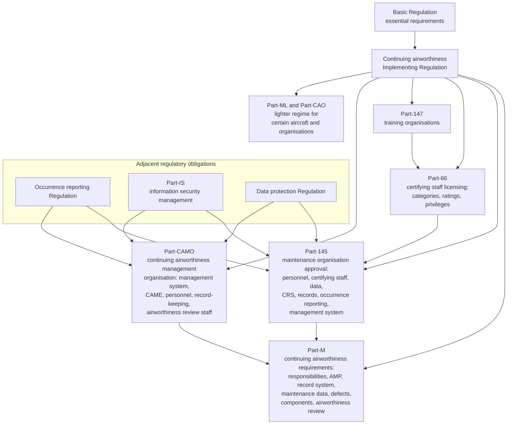
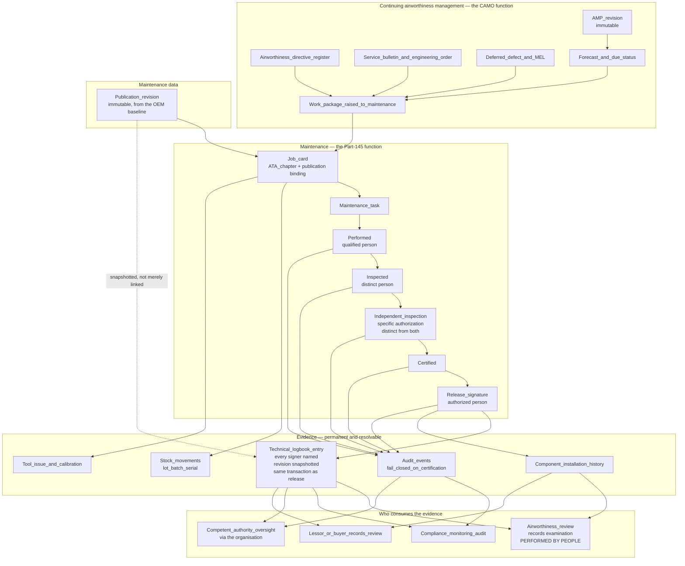

# EASA — Conceptual Mapping of Mercury Capability to European Regulatory Concepts

| Field | Value |
|-------|-------|
| Document | EASA conceptual mapping — Part-M, Part-CAMO, Part-145, Part-66 concepts; CRS and Form 1 at capability level; dual-release context |
| Product | Mercury Aviation Enterprise Operating System (AEOS) |
| Organization | Mercury Technologies |
| Layer | Regulations — descriptive mapping of platform capability to framework concepts |
| Audience | Compliance monitoring managers, safety managers, accountable managers, CAMO and Part-145 quality functions, airworthiness review staff, enterprise architects |
| Status | Living baseline |
| Posture | **Descriptive and advisory. Mercury holds no EASA or national aviation authority approval, certificate, design approval, or delegation of any kind.** |
| Companion documents | [FAA](FAA.md) · [Transport Canada](Transport_Canada.md) · [ICAO](ICAO.md) |
| Upstream authority | [Authority domain](../03_Business/Authority.md) · [SECURITY.md](../../SECURITY.md) · [Blueprint README](../../README.md) |

---

## 1. Scope

### 1.1 In scope

This document maps **Mercury platform capability** to the **concepts** that appear in the European continuing airworthiness framework: the aircraft continuing airworthiness record system, the aircraft maintenance programme, maintenance data and its currency, the certificate of release to service, certifying staff and their privileges, the authorised release certificate for components, airworthiness review evidence, the compliance monitoring and safety management functions of an approved organisation, and the record-keeping obligations that run through all of them.

| Reader | What they get from this document |
|--------|----------------------------------|
| A **CAMO or Part-145 compliance monitoring function** | A precise statement of which record and evidence obligations Mercury supports, which it supports partially, and which remain entirely within their CAME or MOE and their procedures |
| A **Mercury architect or consultant** | The vocabulary bridge between Part-M, Part-CAMO, and Part-145 concepts and Mercury's domain model, including where Mercury's terminology deliberately does **not** claim the regulatory meaning of a similar term |

### 1.2 Out of scope

| Concern | Authoritative location |
|---------|------------------------|
| Mercury's regulatory standing and non-claims | [Authority §1.3](../03_Business/Authority.md#13-what-mercury-does-not-claim) · [SECURITY.md §8](../../SECURITY.md#8-what-mercury-does-not-claim) |
| Audit record structure, fail-closed policy, retention behaviour | [Audit](../06_Security/Audit.md) |
| Signature construction, certification chain enforcement, cryptographic limits | [Digital Signatures](../06_Security/Digital_Signatures.md) |
| Traceability edges and the Digital Aircraft Passport | [Digital Thread](../04_Data/Digital_Thread.md) |
| Continuing airworthiness management capability | [CAMO](../03_Business/CAMO.md) |
| Hangar and shop execution capability | [MRO](../03_Business/MRO.md) |
| Design, production, and type certification | Out of scope entirely. Mercury has no role in design or production approval |
| **Legal interpretation of any Regulation, Implementing Rule, AMC, or GM** | Not provided anywhere in this repository. See §10 |

### 1.3 Honesty markers

| Marker | Meaning |
|--------|---------|
| **Implemented** | Present in the runtime today |
| **Partial** | Present for a subset of the described concept |
| **Planned** | Designed in the blueprint, not built |
| **Not modelled** | Absent, and not currently on a horizon |

There is deliberately **no marker meaning "compliant."** Compliance is a property of an organisation's procedures, personnel, and conduct — never of a software feature.

### 1.4 How to read the regulatory references

The European framework is layered, and a records platform touches several layers at once. References in this document point at **concepts within that structure**, not at binding text.

| Layer | What it contains |
|-------|------------------|
| **Basic Regulation** | The framework regulation establishing EASA and the essential requirements |
| **Implementing and Delegated Regulations** | Binding rules, including the continuing airworthiness regulation and its annexes — Part-M, Part-145, Part-66, Part-147, Part-ML, Part-CAMO, Part-CAO, Part-T |
| **AMC — Acceptable Means of Compliance** | Non-binding means accepted by the Agency as demonstrating compliance |
| **GM — Guidance Material** | Non-binding explanation and illustration |
| **National authority requirements** | Member State implementation, approval issue, oversight, and in some areas additional national requirements |

| Principle | Consequence |
|-----------|-------------|
| The Regulation text governs | Where this document and the current consolidated Regulation differ, the Regulation is correct and this document is wrong |
| AMC and GM are not requirements a platform can hold | Mercury references them to orient design conversations. "AMC-compliant software" is not a meaningful claim and Mercury does not make it |
| Approval is issued by a competent authority to an organisation | Not to a vendor, and not to a tool. Whether an organisation's *use* of Mercury is acceptable is a matter for that organisation and its competent authority |
| Rules are amended | References valid at the time of writing may be superseded or renumbered. Verify against the current consolidated text |

---

## 2. Purpose

### 2.1 The question this document answers

European evaluations arrive at the same three questions, in this order:

1. *"Can our certifying staff issue a CRS in Mercury?"* — Certifying staff issue a certificate of release to service. **Mercury records that act; it does not issue, authorise, or validate a CRS**, and no automated Mercury function can produce one.
2. *"Does Mercury produce an EASA Form 1?"* — **No.** Mercury does not generate, populate, or issue an authorised release certificate. See §5.6, stated plainly because the assumption is common.
3. *"Is Mercury an approved system?"* — There is no such thing as an EASA-approved maintenance IT system. Approval attaches to **organisations**, and an organisation's use of a computer system for records is addressed within its own exposition, its procedures, and its relationship with its competent authority.

What a customer actually needs is narrower: which record and evidence obligations Mercury helps discharge, where Mercury stops, and what the platform can produce when a competent authority or an auditor asks.

### 2.2 The design position underneath the mapping

Mercury's evidence posture, stated in full in [Authority §1.1](../03_Business/Authority.md#11-what-this-domain-exists-to-do): **evidence is a by-product of doing the work correctly, not an artefact assembled afterwards.**

The European framework makes this position unusually testable, because it asks explicitly for a **continuing airworthiness record system** whose content and integrity are the organisation's responsibility. Mercury's contribution is that the record system's content is written as the work happens: immutably, attributed to a named person whose privileges were valid at that moment, bound to the specific immutable revision of the maintenance data that governed the work, with a fail-closed audit record committed in the same database transaction.

### 2.3 A terminology warning specific to this framework

Mercury's domain model uses terms that resemble European regulatory terms without carrying their regulatory meaning. This is the single most likely source of confusion in a European evaluation, so it is stated up front.

| Mercury term | What it means in Mercury | What it does **not** mean |
|--------------|--------------------------|---------------------------|
| **Technical logbook entry** | The permanent, append-only record of a release act, naming every signer, the ATA chapter, and the immutable revision in force | It is **not** an operator's technical log system in the regulatory sense, and it is **not** a CRS. It is a record *of* a release, not the release itself |
| **ACA — the Mercury certification authority** | A Mercury authorization type held by an employee, permitting the certification and release steps in the platform | It is **not** an EASA certifying-staff privilege, **not** a Part-66 licence, and **not** an organisational certification authorisation. It is the platform's representation of an authority the organisation granted |
| **Release** | The final certification step, producing the logbook entry atomically | It is **not** a certificate of release to service issued under a Part-145 approval |
| **Independent inspection** | A second inspection by a person holding a specific independent-inspection authorization, distinct from the performer and the first inspector | It maps *conceptually* to independent inspection expectations; it is **not** a claim that a particular regulatory independent-inspection requirement is satisfied |
| **Maintenance programme** | The Mercury planning entity carrying tasks, intervals, thresholds, and immutable approved revisions | It is a **record of** the organisation's AMP, not an approved AMP. Approval is the organisation's to obtain |

---

## 3. What Mercury is not

| Mercury does **not** hold, claim, or imply | The accurate position |
|--------------------------------------------|-----------------------|
| A **Part-145 maintenance organisation approval** | Part-145 approvals are issued to organisations that maintain aircraft and components. Mercury maintains nothing and holds no approval. A customer's Part-145 approval is theirs alone, and Mercury's involvement neither extends nor supports it as a matter of privilege |
| A **Part-CAMO approval**, or a Part-M Subpart G continuing airworthiness management organisation approval | Held by organisations that manage continuing airworthiness. Mercury manages nothing; it records and computes on behalf of the organisation that does |
| A **Part-CAO or Part-147 approval** | Not held, not applied for, not claimed |
| A **Part-21 design or production organisation approval, TC, STC, or ETSO authorisation** | Mercury produces no aeronautical product or design data requiring approval and holds no design or production approval |
| **Certifying staff or airworthiness review staff standing** | These are privileges held by qualified individuals within approved organisations. Mercury records that an organisation granted them; it does not confer, verify against a licence register, or exercise them |
| **EASA or national authority "approval" or "acceptance" of the platform, its records, or its electronic signatures** | No competent authority has approved, accepted, reviewed, or evaluated Mercury. Whether an organisation's *use* of Mercury is acceptable within its CAME or MOE is a determination for that organisation and its competent authority |
| That using Mercury makes an organisation **compliant** with Part-M, Part-CAMO, Part-145, or any other Part | Compliance is a property of the organisation. Mercury supports it and cannot confer it |
| That Mercury **issues a certificate of release to service** | A CRS is issued by authorised certifying staff. Mercury records that act with attribution, privilege validity, ordering, and immutable data binding. It never performs the act. See [Digital Signatures §6.6](../06_Security/Digital_Signatures.md#66-what-release-does-not-do) |
| That Mercury **produces an EASA Form 1** or any authorised release certificate | It does not. See §5.6 |
| That Mercury **issues or supports the issue of an Airworthiness Review Certificate** | An ARC is issued following an airworthiness review by qualified airworthiness review staff. Mercury holds records that a review would examine. It does not perform reviews, produce recommendations, or issue certificates. See §5.5 |
| That Mercury's electronic signature is a **qualified electronic signature** or any regulated trust-service signature | It is a hash-attested attribution mechanism. It is **not** an advanced or qualified electronic signature under European trust-services law, and it is **not** certificate-backed. Stated without softening in [Digital Signatures §8](../06_Security/Digital_Signatures.md#8-what-this-is-not--the-cryptographic-limit) |
| That Mercury's records are a **tamper-evident** archive | Immutability today rests on code discipline, not on database enforcement or hash chaining. See [Audit §6.4](../06_Security/Audit.md#64-honest-limitation--immutability-is-conventional-not-structural) |
| That Mercury implements **Part-IS** information security management, or that it makes an organisation's Part-IS position compliant | Mercury provides security controls an organisation may use as part of its own management system. It is not an information security management system and holds no attestation. See §7.4 |
| That Mercury is a **safety management system** | It is a source of safety data and an evidence spine. See §5.8 |
| That Mercury is approved for **military, defence, or safety-of-life** use | Not claimed. See [ROADMAP §8](../../ROADMAP.md#8-explicit-non-goals) |

**Why this is stated so bluntly.** An organisation that repeats a vendor's overstatement in a CAME or MOE submission carries an exposure the vendor does not. Mercury's position is that the vendor owes the buyer a precise statement of standing. Any Mercury material that softens the table above is wrong and should be corrected against this document.

---

## 4. Regulatory context overview

### 4.1 The structural shape of the framework

The European framework separates the **continuing airworthiness management** function from the **maintenance** function, gives each its own organisational approval, and connects them through data, records, and a release certificate. That separation maps closely onto Mercury's separation of the CAMO and MRO domains.

### 4.2 The concepts a Mercury deployment most often touches

| Area | Subject | Why it appears in Mercury conversations |
|------|---------|-----------------------------------------|
| **Part-M — responsibilities and continuing airworthiness tasks** | Who is responsible for the aircraft's continuing airworthiness, and what must be accomplished before flight | The obligation Mercury's planning, forecast, and deferral capability serves |
| **Part-M — aircraft maintenance programme** | The AMP, its content, its approval, and its revision | Mercury's programme entity with immutable approved revisions |
| **Part-M — aircraft continuing airworthiness record system** | The records the organisation must keep: status of tasks, life-limited items, directives, modifications, repairs, defects, and the aircraft's technical history | The single most relevant concept to Mercury's entire evidence spine |
| **Part-M — operator's technical log system** | The system by which operational and defect information is recorded and communicated between flight crew and maintenance | **Mercury does not implement a technical log system.** See §5.2 |
| **Part-M — maintenance data** | The data used to carry out maintenance, and its currency at the point of use | Mercury's publication library and its enforced immutable revision binding at release |
| **Part-M — defects and their rectification or deferral** | Defect recording, deferral within approved limits, and rectification | Deferred defects and MEL items with expiry control |
| **Part-M — components** | Classification, installation conditions, life tracking, and segregation of unserviceable components | Serialized components, catalogue, life, and stock states |
| **Part-M and Part-CAMO — airworthiness review** | The periodic review of records and aircraft leading to an ARC | Mercury holds the records a review examines; it performs no review. See §5.5 |
| **Part-145 — certifying staff and support staff** | Who may issue a CRS, and the records of their authorisations and scope | Mercury's personnel authorization records and permission-gated release capability |
| **Part-145 — certification of maintenance (CRS)** | The certificate of release to service, its content, and its conditions | Mercury's release step and technical logbook entry — a record of the act, not the certificate |
| **Part-145 — maintenance records** | What is recorded, the retention period, and protection of the records | Append-only evidence, retention configuration, access control, audit |
| **Part-145 and Part-CAMO — management system** | Safety management, compliance monitoring, internal reporting, and record-keeping of the management system | The SMS-adjacent and compliance-monitoring concepts in §5.7 and §5.8 |
| **Part-66** | Licence categories, ratings, and privileges of certifying staff | The authority behind a release signature, recorded as personnel qualification data |
| **Occurrence reporting Regulation** | Mandatory and voluntary occurrence reporting, and protection of the reporter | Structured occurrence capture is **Planned**. See §5.8 |
| **Part-IS** | Information security management for approved organisations, including risks to aviation safety arising from information security events | Directly relevant to a records platform. See §7.4 |

### 4.3 AMC that shapes an electronic-records conversation

An organisation intending to keep its continuing airworthiness or maintenance records in a computer system has a specific conversation with its competent authority, and it is shaped by the Acceptable Means of Compliance addressing **computerised record systems**. The concepts that conversation covers — and which Mercury architects should therefore know cold:

| Concept the AMC conversation covers | Mercury position | Standing |
|-------------------------------------|------------------|----------|
| Protection of records against **unauthorised alteration** | No code path updates or deletes evidence; permission-gated, organisation-scoped, audited access | **Partial** — conventional, not structural. See §7.2 |
| Protection against **loss** and provision of **backup** | Durable relational storage; backup is the operator's regime, not a Mercury product guarantee | **Partial** — operator responsibility |
| **Legibility and retrievability** throughout the retention period | Scoped retention-aware query, per-object history, one-call task audit trail | Implemented for retrieval; export is **Planned** |
| Records **kept in a form acceptable** to the competent authority | Determined by the organisation and its authority, not by Mercury | Organisation responsibility |
| The system being described in the organisation's **exposition** | Mercury's contribution is an accurate description of platform behaviour, including its named limitations | Organisation responsibility, with Mercury providing accurate input |
| **Access control** appropriate to the sensitivity of the records | Role and permission model with audited denials | Implemented — runtime persona hardening **Planned** |
| Ability to produce a **readable copy** | Human-readable views exist; formal export is **Planned** | Partial |

**The caution.** This table is the honest input an organisation needs for that conversation. It is **not** a claim that Mercury satisfies the AMC. No software satisfies an AMC; an organisation demonstrates compliance using means its authority accepts, and the software is one input among procedures, training, and controls.

---

## 5. Mercury capability mapping

### 5.1 How to read every table in this section

| Column | Meaning |
|--------|---------|
| **Regulatory concept** | The concept as it appears in the framework, in the framework's vocabulary |
| **Mercury capability** | The platform capability producing data of that kind, with its capability identifier where one exists |
| **Standing** | Implemented, Partial, Planned, or Not modelled — per §1.3 |
| **Remains the organisation's responsibility** | What Mercury does **not** do. This column exists so no reader mistakes a populated row for a discharged obligation |

Capability identifiers are drawn from [Authority §2.1](../03_Business/Authority.md#21-capability-register) and [MRO §2.1](../03_Business/MRO.md#21-capability-register).

### 5.2 Part-M — continuing airworthiness and the record system

| Regulatory concept | Mercury capability | Standing | Remains the organisation's responsibility |
|--------------------|--------------------|----------|-------------------------------------------|
| Responsibility for the aircraft's continuing airworthiness, and the tasks accomplished before flight | Fleet registry, aircraft status, programme, forecast, deferral control, AD register | Implemented as the operating substrate | The responsibility itself, and every determination made under it |
| **Aircraft maintenance programme** — content, tasks, intervals, and approval | Maintenance programme with task library, intervals, thresholds, and **immutable approved revisions** | Implemented as a record of the AMP | Authoring the AMP, obtaining its approval, and operating to the approved revision |
| AMP revision control such that historical work resolves to the standard in force | Immutable programme revisions; historical work resolves to the revision that governed it (AUTH-C7) | Implemented | Submitting revisions and obtaining approval |
| **Continuing airworthiness record system** — status of tasks, life-limited items, directives, modifications, repairs, defects, and technical history | The full evidence spine: technical logbook (AUTH-C4), certification events (AUTH-C2), component history (AUTH-C8), AD and SB registers, engineering orders, deferred defects, publication revisions | Implemented | Whether the record set as the organisation uses it satisfies the record system obligation, and the accuracy of the data within it |
| Status of the AMP's tasks, showing when each is next due | Check definitions, due status, and forecast over 30, 90, 180, and 365 days | Implemented — **the forecast is computed on read and is not historically reproducible** | The airworthiness determination |
| Status of life-limited components and their applicable limits | Serialized component life with TSN, CSN, TSO, CSO; unit-level limits overriding catalogue defaults; remaining hours, cycles, and calendar due | Implemented — maintained on write, with **no reconciliation job** | Verifying life data on receipt, and reconciling after a discrepancy |
| Status of directives, with method and date of compliance | AD register with per-revision compliance position and linked work orders | Implemented — **structured compliance state is Partial**; see [Authority §3.1](../03_Business/Authority.md#31-entity-register) | Applicability determination, method-of-compliance selection, and the compliance decision |
| Records of modifications and repairs, and the approved data for them | Engineering order records with approval workflow, linked tasks, and affected components | Implemented — **no dedicated modification record**; state is reachable through engineering orders and tasks | Approval of the modification or repair data, and its acceptability |
| **Maintenance data** — the data used to carry out maintenance, current at the point of use | Publication library with immutable revisions; **release blocked** without a live publication, a matching revision, and an ATA chapter (MRO-C10) | Implemented | Obtaining current, applicable data from the design approval holder and controlling its distribution |
| **Operator's technical log system** | **Not modelled.** Mercury's technical logbook is a maintenance release record, not an operator's technical log | **Not modelled** | The technical log system in full: its content, its carriage, its flight-crew interface, and its acceptance |
| Defect recording, deferral within approved limits, and rectification | Deferred defects and MEL items with dispatch category and **expiry control**; fault codes for structured classification | Implemented | Deferral authority, dispatch decisions, and operational control |
| Component classification and conditions for installation | Component catalogue, serialized components, alternate parts, receiving inspection, append-only movements (AUTH-C9) | Implemented | The acceptability determination and unapproved-parts control |
| **Segregation of unserviceable components** | Stock states and the movement ledger | **Partial** — states Implemented; **a dedicated quarantine workflow is Not modelled** | Physical segregation and its control |
| Retention of records for the required period | Durable append-only evidence with configurable retention | **Partial** — retention is a **query filter**, not a deletion lifecycle. See [Audit §7.2](../06_Security/Audit.md#72-the-retention-window-is-a-query-filter) | Archival, deletion where required, and satisfying the actual retention period. See [SECURITY.md §10](../../SECURITY.md#10-customer-and-operator-responsibilities) |
| **Transfer of records** on change of operator, owner, or lease | Digital Aircraft Passport as a traversal; **one-command evidence pack export is Planned** (AUTH-C14). See [Digital Thread §7.4](../04_Data/Digital_Thread.md#74-implementation-status--stated-plainly) | **Partial** | Executing the transfer, and satisfying the receiving organisation and the competent authority that the records are complete |

### 5.3 Part-CAMO — management system and continuing airworthiness management

| Regulatory concept | Mercury capability | Standing | Remains the organisation's responsibility |
|--------------------|--------------------|----------|-------------------------------------------|
| **Management system** — safety policy, safety risk management, safety assurance, safety promotion, and compliance monitoring | Immutable evidence and the complete audit trail as the data source; **finding and corrective action management (AUTH-C15) and audit programme management (AUTH-C16) are Planned** | **Partial** | The management system in full: its policy, its risk process, its compliance monitoring function, and its independence |
| **Compliance monitoring** — audit programme, findings, root cause, corrective action, and closure | Audit trail, evidence records, and approval workflows; **structured finding and corrective action tracking is Planned** | **Partial** | The compliance monitoring function, its auditors, its independence, and its decisions |
| **Internal safety reporting** scheme | **Not modelled.** Structured occurrence capture is **Planned** (AUTH-C20); a confidential reporting channel is a distinct requirement Mercury does not address | **Not modelled** | The reporting scheme, its confidentiality protections, and its just-culture framework |
| **Record-keeping** of continuing airworthiness management activity and of the management system | Append-only audit and evidence records, organisation-scoped, with configurable retention | **Partial** — retention is a read filter; management-system records beyond maintenance evidence are largely **Not modelled** | Record content, retention, protection, and availability |
| **CAME** — the exposition, its content, and its revision | Publication library with immutable revisions and controlled distribution | Implemented **as a library capability.** Mercury does not author, own, or control the exposition | Authoring, revising, obtaining approval, and ensuring personnel use the current revision |
| Personnel requirements — nominated persons, competence, and continuation training | Personnel records, qualifications, and authorizations with validity dates | **Partial** — records Implemented; **competence assessment and continuation training programmes are Not modelled** | Nomination, competence assessment, training, and its records |
| **Airworthiness review staff** qualification and independence | Personnel authorization records can represent the authorisation the organisation granted | **Partial** — the authorisation is recordable; **airworthiness review as a process is Not modelled**. See §5.5 | Qualifying, authorising, and controlling airworthiness review staff |
| Continuing airworthiness management for contracted aircraft, and the contract | Multi-organisation tenancy with isolation; **no cross-organisation sharing construct**. See [Digital Thread §7.3](../04_Data/Digital_Thread.md#73-who-consumes-the-passport-and-for-what) | **Partial** | The contract, its scope, and the management of the arrangement |
| Contracting of maintenance to an approved organisation, and its oversight | Vendor records, purchase orders, receiving inspection, material traceability | **Partial** | Contracting, verifying approval scope, and oversight |
| Occurrence reporting to the competent authority and the design approval holder | Incident records, fault codes, and the audit trail; structured occurrence export **Planned** | **Partial** | Reportability determination, report content, and submission within the required period |

### 5.4 Part-145 — maintenance organisation concepts

| Regulatory concept | Mercury capability | Standing | Remains the organisation's responsibility |
|--------------------|--------------------|----------|-------------------------------------------|
| Approval scope and ratings, and working within them | Organisation and site model; task and capability data can reflect scope | **Partial** — **rating scope is not enforced as a control.** Mercury will not refuse work because it falls outside an approval scope | Holding the approval, working within scope, and controlling scope procedurally |
| **Certifying staff and support staff** — qualification, scope of authorisation, and the record of it | Personnel qualification and authorization records with type, reference, and validity dates (AUTH-C10) | Implemented | Assessing competence, issuing authorisations with the correct scope, maintaining the roster, and withdrawing authorisations when appropriate |
| Privileges exercised only while valid | Expiry evaluated against the signing moment, never against an assignment date | Implemented | Keeping licence, rating, and authorisation data current and accurate. Mercury does not verify a licence against a national register |
| **Certification of maintenance — the CRS** | Release certification step producing an atomic technical logbook entry naming every signer, the ATA chapter, the publication, and the immutable revision (MRO-C5, MRO-C9) | Implemented **as a record of the act** | Issuing the CRS, its wording, its conditions, and the judgement behind it |
| Conditions under which a CRS may be issued, including outstanding maintenance | Release preconditions: inspection complete, all prior required steps complete, live publication and matching revision, ATA chapter, and no double release | Implemented — see [Digital Signatures §6.3](../06_Security/Digital_Signatures.md#63-the-four-release-preconditions) | The judgement that the aircraft or component is fit for release, and the treatment of outstanding items |
| **Maintenance data** available and current at the point of use | Publication library with immutable revisions; release blocked without a matching live revision | Implemented | Obtaining and controlling the data |
| Performance of maintenance — competence, procedures, and independent checks where required | Certification chain enforced in order; critical task policy (MRO-C7); three enforced distinct-signer separations (MRO-C6) | Implemented — see [Digital Signatures §5](../06_Security/Digital_Signatures.md#5-double-inspection) | Determining which tasks require an independent check, and authorising the persons who perform them |
| **Maintenance records** — content, retention, and protection | Immutable signatures, certification events, logbook entries, component history, and the movement ledger; task audit trail in one call (AUTH-C6) | Implemented — **retention is a read filter**, not a lifecycle | Retention against the applicable period, and making records available |
| Housing, facilities, tools, equipment, and material | Tool crib control with calibration currency and lost-tool reporting (MRO-C15); warehouse, stock ledger, FIFO and FEFO issue (MRO-C14) | Implemented | Facility and capability adequacy |
| **Management system**, safety management, and compliance monitoring within the maintenance organisation | Audit trail and evidence as the data source; **finding, corrective action, and audit programme management are Planned** | **Partial** | The management system in full |
| **Internal occurrence reporting** and reporting to the authority, the operator, and the design approval holder | Incident records and fault codes; structured occurrence capture **Planned** (AUTH-C20) | **Partial** | The reporting scheme and every reporting decision |
| **MOE** — the exposition, its content, and its revision | Publication library with immutable revisions | Implemented as a library capability | Authoring, revising, and obtaining approval of the exposition |
| Component maintenance and its release | Rotable cycle open and close, component history, life data (MRO-C16) | **Partial** — **a full shop-visit lifecycle with life continuity is a named gap**, and **no authorised release certificate is produced**. See §5.6 | Shop procedures, capability, and the release of the component |

### 5.5 Airworthiness review and the ARC — a boundary, not a capability

| Concept | Mercury position |
|---------|------------------|
| The **airworthiness review** — an examination of records and a physical survey leading to a recommendation or the issue of an ARC | **Not modelled as a process.** Mercury implements no review workflow, no review checklist, no recommendation record, and no certificate issue |
| The **records a review examines** — AMP status, life-limited item status, directive compliance, modification and repair records, defect status, weight and mass data, and the aircraft's maintenance history | **Implemented as records**, and this is the substantive value. A review that would otherwise require reconstructing revision status, matching signatures to authorisations valid at the time, and assembling a compliance narrative can instead traverse resolvable records |
| The **ARC itself** | **Never produced by Mercury.** An ARC is issued by authorised airworthiness review staff or a competent authority. Mercury has no part in it |
| The **airworthiness review staff authorisation** | Recordable as a personnel authorization with validity dates, so that a signature or a decision can be attributed to a person whose authorisation was valid at the time |
| A future **airworthiness review support** capability | Would structure the review as a workflow over the evidence the platform already holds — a checklist, a findings record, and a recommendation record, all attributed and audited. It would still not issue a certificate. Listed in §9 |

**Why this is separated into its own section.** Airworthiness review is the point at which a European evaluation most often over-reads Mercury's capability, because the platform holds nearly everything a review needs. Holding the evidence a review examines and *performing* a review are different things, and only the first is true today.

### 5.6 EASA Form 1, CRS, and dual release — capability-level treatment

#### 5.6.1 What Mercury does and does not produce

| Instrument | Purpose | Mercury standing |
|------------|---------|------------------|
| **Certificate of release to service (CRS)** for aircraft maintenance | The certificate issued by authorised certifying staff that maintenance was properly carried out | **Mercury records the release act**; it does not issue, author, format, or validate a CRS. The technical logbook entry is a record *of* the act — attributable, immutable, revision-bound — and an organisation's CRS process remains its own |
| **EASA Form 1 — authorised release certificate** for components | Airworthiness release of a component following maintenance | **Not modelled.** Mercury does not generate, populate, or issue a Form 1. It records component receipt, acceptance, movement, life, and maintenance history, and can hold a certificate reference as attachment metadata |
| **Dual release** — a single release statement or certificate satisfying two authorities under a bilateral arrangement | Enables a dual-approved organisation to release for both jurisdictions | **Not modelled as an instrument.** The *data* that a dual release depends on is held; the certificate is not produced. See §5.6.3 |
| **Airworthiness Review Certificate** | The periodic confirmation of continuing airworthiness | **Never produced.** See §5.5 |

#### 5.6.2 What Mercury contributes at capability level

Even without producing the instruments, the platform holds what the instruments assert — which is precisely what makes an instrument auditable after the fact:

| What a release instrument asserts | The Mercury record that evidences it |
|-----------------------------------|--------------------------------------|
| Work was carried out in accordance with specified data | Publication and immutable revision binding, enforced at release and snapshotted into the logbook entry |
| Work was carried out by competent persons | Performed-step signature bound to a named employee with a validated, unexpired qualification |
| Work was inspected, and independently inspected where required | Inspection and independent-inspection steps with three enforced distinct-signer separations, each signer a separate identity field on the logbook entry |
| The release was issued by an authorised person | Release signature requiring an active certification authority, with a step-up credential at the moment of signing |
| The item's identity, life, and history are known | Serialized component identity, TSN, CSN, TSO, CSO, and append-only installation and release history |
| The material used was traceable | Append-only stock movements with lot, batch, or serial identity, and receiving inspection records |
| The tools used were controlled and calibrated | Tool issue and return records with calibration currency |
| Nothing in the chain was altered afterwards | Append-only evidence with fail-closed audit — **conventionally immutable, not tamper-evident.** See §7.2 |

#### 5.6.3 Dual-release context — stated at concept level

Bilateral aviation safety arrangements between the European Union and other jurisdictions, supported by maintenance annex guidance, allow an organisation holding approvals under two frameworks to release work for both. The practical consequence for a records platform is that **one maintenance event may need to satisfy two sets of record expectations simultaneously**.

| Dual-release consideration | Mercury position | Standing |
|----------------------------|------------------|----------|
| One work event, two sets of record expectations | The certification chain, logbook entry, and material traceability are framework-neutral: they record who did what, under which authority, against which data | Implemented — **neutrality is a design property, not a compliance claim** |
| Both approvals' certifying staff privileges tracked on one person | Personnel can hold multiple authorization types simultaneously, each with its own reference and validity | Implemented |
| A release recorded as satisfying a specific framework | **Not modelled.** Mercury does not tag a release with a jurisdiction, a framework, or an approval reference | **Not modelled** |
| The dual-release statement or certificate itself | **Not produced.** The organisation issues it under its own procedures | Not modelled |
| Evidence retrievable for either authority's oversight | The same evidence set, queried and scoped differently | Implemented — cross-organisation scoped access is **Planned** |

**The honest framing.** Mercury's evidence model is *jurisdiction-neutral*, which is genuinely useful in a dual-approval organisation because one act produces one attributable, immutable record rather than two divergent ones. It is **not** a dual-release capability, and an organisation operating under two approvals must control the framework-specific parts — the statements, the certificates, the scope limitations — through its own expositions and procedures.

### 5.7 Compliance monitoring concepts

| Compliance monitoring concept | Mercury capability | Standing | Remains the organisation's responsibility |
|-------------------------------|--------------------|----------|-------------------------------------------|
| An audit programme covering the organisation's activities at planned intervals | **Audit programme management is Planned** (AUTH-C16) | **Planned** | The programme, its scope, and its execution |
| Findings raised, classified, and communicated | **Finding management is Planned** (AUTH-C15) | **Planned** | Raising, classifying, and communicating findings |
| Root cause analysis and corrective action to closure, with verification of effectiveness | **Corrective action tracking is Planned** (AUTH-C15) | **Planned** | Analysis, action, and the effectiveness judgement |
| Objective evidence supporting a finding or its closure | Immutable evidence records, task audit trail, and the complete audit trail are available **today** as objective evidence | Implemented | Selecting, presenting, and interpreting the evidence |
| Independence of the compliance monitoring function | Role and permission model supports separating the quality function from production roles | Partial | Structural independence, which is organisational rather than technical |
| Management review with data on the organisation's performance | Execution reporting and reliability trend capability | Partial | The review itself and its conclusions |
| Records of compliance monitoring activity | **Largely Not modelled** until finding and audit programme management exist; the underlying audit trail is Implemented | **Partial** | Record content, retention, and availability |

### 5.8 Safety management and occurrence reporting

Mercury is **not** a safety management system. It is a high-quality source of maintenance safety data and an audit-evidence spine.

| SMS or reporting concept | Mercury capability | Standing | Remains the organisation's responsibility |
|--------------------------|--------------------|----------|-------------------------------------------|
| Safety policy, accountable manager, and safety accountabilities | Organisation, site, role, and membership model; accountable persons recorded as personnel | **Partial** — structure recorded; **the SMS framework is Not modelled** | The SMS, its policy, and its accountabilities |
| Hazard identification from maintenance data | Fault codes, incident records, deferred defect history, reliability trends, and the complete audit trail | **Partial** — the data exists; hazard identification is not a platform function | Hazard identification, analysis, and risk assessment |
| Safety risk assessment and mitigation records | Approval workflow and engineering order records can carry documented decisions | Partial | Methodology, decisions, and acceptability |
| Safety performance monitoring and measurement | Execution reporting, reliability trends, and audit data | **Partial** | Indicator definition, targets, and interpretation |
| Management of change | Immutable programme and publication revisions record what changed and when; **change management as a safety process is Not modelled** | **Partial** | The change management process |
| **Internal occurrence reporting**, including confidential reporting and reporter protection | **Not modelled.** Structured occurrence capture is **Planned** (AUTH-C20) | **Not modelled** | The reporting scheme, confidentiality, reporter protection, and the just-culture framework |
| **Mandatory occurrence reporting** to the competent authority within the required period | **Not modelled.** Incidents and fault codes exist as data | **Partial** | Reportability determination, report content, timeliness, and submission |
| Safety data protection and appropriate use | Permission-gated, organisation-scoped, audited access; append-only retention | Partial | Protection, lawful use, and the safeguards the framework expects |
| Safety training and promotion | Personnel qualification records | Partial | Training, communication, and promotion in full |

---

## 6. Evidence flow

### 6.1 From continuing airworthiness obligation to release evidence

The dashed edge and the emphasised node are the two honest points in this diagram. Revision detail is **snapshotted** into the logbook entry so that a later revision cannot rewrite what a past release says it was performed under. And the airworthiness review is **performed by people** — Mercury supplies what they read, and nothing more.

### 6.2 Why the CAMO–Part-145 boundary is visible in the model

The European framework's separation of continuing airworthiness management from maintenance is mirrored in Mercury's domain boundaries: planning and programme control sit in one bounded context, execution and certification in another, and they communicate through work packages and evidence rather than through shared mutable state. A CAMO organisation and an independent Part-145 organisation using the same Mercury deployment work in separate tenancies with isolation enforced, and today that isolation is **strict** — there is no cross-organisation sharing construct. That is honest and it is also a limitation: serving the contracted relationship the framework anticipates requires either shared membership, which over-grants, or export, which leaves the thread. Closing it is [Digital Thread §12](../04_Data/Digital_Thread.md#12-future-enhancements) work and §9 item 10 here.

---

## 7. Security and records considerations

### 7.1 The record properties European record concepts depend on

| Property the framework cares about | Mercury position | Standing |
|------------------------------------|------------------|----------|
| **Attribution to one identified person** | A signature names an employee, requires that employee to be bound to the authenticated user, and requires a step-up credential at signing | Implemented — with the administrator override named as debt in [Digital Signatures §8.5](../06_Security/Digital_Signatures.md#85-additional-named-limitations) |
| **Privileges valid at the time of the act** | Expiry evaluated against the signing moment | Implemented |
| **Intent to sign** | Step-up credential required; a live session is insufficient | Implemented |
| **The record states which data authorised the work** | Immutable revision binding enforced at release; revision number, date, and effective date snapshotted into the logbook entry | Implemented — see [Digital Signatures §7](../06_Security/Digital_Signatures.md#7-publication-revision-binding) |
| **Independence provable from the record alone** | Every signer is a separate identity field on the logbook entry | Implemented |
| **Protection against unauthorised alteration** | No code path updates or deletes evidence records | **Partial — conventional, not structural** |
| **Detection of alteration** | **Not achieved today** | **Planned** — chaining with external anchoring |
| **Retrievability and legibility for the retention period** | Scoped retention-aware query, per-object history, one-call task audit trail | Implemented; export **Planned** |
| **Retention for the required period** | Retention configuration filters reads; nothing is deleted | **Partial** — a read filter, not a lifecycle |
| **Backup and protection against loss** | Durable relational storage subject to the operator's regime | **Partial** — operator responsibility |
| **Access control with recorded denials** | Permission-gated, organisation- and site-scoped; denials audited | Implemented — persona hardening **Planned** |
| **Record of who read sensitive records** | Mutating actions audited; **sensitive-read auditing is Planned** | **Planned** |

### 7.2 The three limitations a customer must carry into a competent authority conversation

1. **Signatures are hash-attested, not certificate-backed, and are not qualified electronic signatures.** There is no private key under the signer's sole control, no certificate chain, no revocation checking, and no trusted timestamp. PKI and smart-card methods are **refused rather than simulated** — see [Digital Signatures §8.3](../06_Security/Digital_Signatures.md#83-pki-methods-are-refused-not-simulated) — so that no record overstates its own strength.
2. **Immutability is enforced by code discipline, not by the database.** Records resist tampering through the application. They do not prove to a third party that no one with database credentials altered them.
3. **Retention hides rather than deletes.** The configured window filters queries. An organisation with a deletion obligation must implement archival and deletion at the data tier.

An organisation describing its computerised record system in a CAME or MOE should describe these three accurately. Overstatement here surfaces during an audit, and it surfaces against the organisation rather than against the vendor.

### 7.3 The ACA independence gap, stated because European organisations will ask

Mercury enforces three distinct-signer separations: inspector ≠ performer, independent inspector ≠ performer, and independent inspector ≠ inspector. It does **not** enforce that the person exercising the certification and release authority is distinct from the performer or the inspector, because whether that separation is required is genuinely governed by the organisation's exposition and its authority's rules. This is documented as debt in [Digital Signatures §5.4](../06_Security/Digital_Signatures.md#54-what-the-platform-does-not-separate--stated-honestly), and the intended resolution is a critical-task policy engine in which the organisation declares required separations and the platform enforces them.

The practical consequence for a small organisation where one person holds several authorisations is that Mercury will refuse the inspection overlaps and permit the certification overlap. An organisation must control that procedurally until the policy engine exists.

### 7.4 Part-IS and data protection adjacency

Two adjacent European obligations bear directly on a records platform, and Mercury's position on both must be stated without ambiguity.

| Obligation area | What it concerns | Mercury position |
|-----------------|------------------|------------------|
| **Part-IS — information security management for approved organisations** | Identifying and managing information security risks with a potential effect on aviation safety, including risks arising from systems the organisation depends on, and reporting information security incidents | **Mercury is not an information security management system and holds no attestation, certification, or approval.** It provides controls an organisation may rely on as part of its own management system: organisation and site isolation, permission-gated access, audited actions including denials, append-only evidence, secret handling, and a published vulnerability disclosure process in [SECURITY.md §2](../../SECURITY.md#2-reporting-a-vulnerability). The organisation remains responsible for its own risk identification, its supplier assessment of Mercury, its incident detection and reporting, and its management system |
| **Data protection** | Lawful processing of personal data, minimisation, retention limitation, security of processing, and the rights of data subjects | Maintenance evidence is inherently personal data: signer identities, licence and authorisation references, qualification types and validity dates. Mercury minimises, gates access by permission, scopes by organisation, and audits access to personal data; **field-level encryption is Planned**. Retention as a **deletion** lifecycle is **Partial**, which matters for retention-limitation obligations. The organisation determines its lawful basis, its retention policy, and its data-subject processes |

**A tension worth naming rather than hiding.** Airworthiness record obligations push toward retaining attributable personal data for the life of the asset and beyond. Data protection obligations push toward minimisation and deletion. Mercury does not resolve that tension — no platform can — but it does make both sides tractable: evidence is retained and attributable, access is controlled and audited, and the retention lifecycle work in §9 item 5 is what would let an organisation implement its own resolution rather than inherit the platform's default.

---

## 8. Scalability of evidence

### 8.1 Why this belongs in a regulatory mapping

Records that exist but cannot be retrieved within the time an audit allows are functionally absent. European record obligations extend across the aircraft's operating life, across changes of operator and owner, and across the retention periods that follow — which makes long-horizon retrievability a regulatory property, not an engineering nicety.

### 8.2 What grows

| Evidence class | Growth driver | Characteristic |
|----------------|---------------|----------------|
| Certification events and signatures | Maintenance activity | Steady; one short transaction per act, independent of platform size |
| Technical logbook entries | Releases | One per release; the densest and most-queried evidence record |
| Component installation history | Installs, removals, transfers, releases | Append-only, and the basis of point-in-time configuration answers |
| Stock movements | Material activity | Among the fastest-growing tables |
| Audit events | Every mutating action | The fastest-growing table, and the one an investigation traverses |
| Publication and programme revisions | Data and AMP updates | Slow growth, very high fan-in — every release resolves to one |

### 8.3 Levers, in dependency order

| # | Lever | What it unlocks for European record obligations at scale |
|---|-------|----------------------------------------------------------|
| 1 | Time partitioning of audit and evidence tables | Bounded query cost across an aircraft's full life; archival by detaching a partition |
| 2 | Database-enforced append-only | Immutability becomes structural, which is the substance of "protected against unauthorised alteration" |
| 3 | Tamper-evident hash chaining with external anchoring | Alteration of an interior record becomes detectable by a third party rather than only resisted |
| 4 | Object storage with integrity verification | Certificates, photographs, and document content become durable and integrity-checked rather than referenced |
| 5 | Evidence pack export with resolvable references | Record transfer on change of operator, owner, or lease becomes a command instead of a project |
| 6 | Aircraft passport read model | Airworthiness review, lessor, and buyer views served from a projection rather than a multi-domain traversal |
| 7 | Cross-organisation scoped access | Serves the CAMO-to-Part-145 contracted relationship the framework anticipates, without over-granting |
| 8 | Read replicas for evidence reads | Audit and review load off the operational primary |
| 9 | Tiered storage with an immutable archive | Long-horizon retention at sustainable cost, and the basis of a real retention lifecycle |

Item 3 assumes a total record order, which interacts with item 1's partitioning; deciding the sequencing model before implementing either is the difference between a clean design and a migration. Stated identically in [Audit §11.2](../06_Security/Audit.md#112-scaling-levers-in-dependency-order).

### 8.4 What must survive any scaling change

- Fail-closed audit on certification acts; asynchrony must never enter a fail-closed write.
- Atomicity of release, technical logbook entry, and component history.
- The three enforced distinct-signer separations, and the row locking that makes them correct under concurrency.
- Immutable publication revision binding, with revision detail snapshotted into the logbook entry.
- Organisation and site scoping on every read — the isolation boundary is also the approval boundary.
- Provenance honesty, including the `simulated` marker that prevents demonstration data from ever reading as an airworthiness fact.

---

## 9. Future enhancements

| # | Enhancement | Value in a European framework context | Depends on |
|---|-------------|---------------------------------------|------------|
| 1 | **Evidence pack export** with resolvable revision references (AUTH-C14) | Turns an airworthiness review, an audit, or a change-of-operator record transfer from a project into a command | Publication revision resolution, already present. [ROADMAP §4](../../ROADMAP.md#4-near-term-horizon--assurance-and-hardening-additive) |
| 2 | **PKI and smart-card signature providers** | Moves release attribution from hash attestation toward certificate-backed non-repudiation, and opens the path toward alignment with recognised electronic-signature levels | Key management, certificate lifecycle, revocation, timestamp authority |
| 3 | **Tamper-evident chaining with external anchoring** | Changes "we do not alter records" into "alteration is detectable" — the substance of protection against unauthorised alteration | Database-enforced append-only, plus a sequencing decision |
| 4 | **Database-enforced append-only** | Immutability becomes structural rather than conventional | Migration plus a database permission model |
| 5 | **Retention as a true lifecycle** — hot, warm, immutable archive, deletion | Serves both long retention obligations and data-protection retention limitation, which a read filter cannot | Partitioning and archive tiering |
| 6 | **Finding and corrective action management** (AUTH-C15) | Gives compliance monitoring a home inside the evidence spine instead of alongside it in a spreadsheet | Quality domain expansion |
| 7 | **Audit programme management** (AUTH-C16) | Scheduled internal audit with objective evidence attached, closing the compliance monitoring loop | Quality domain expansion |
| 8 | **Structured occurrence capture and export** (AUTH-C20) | Supports internal and mandatory occurrence reporting with structured data rather than free text | Quality domain expansion |
| 9 | **Airworthiness review support workflow** | Structures a review over evidence the platform already holds: checklist, findings, and recommendation, all attributed and audited. **It would still never issue an ARC** | Items 1 and 6 |
| 10 | **Cross-organisation scoped sharing** | Serves the CAMO-to-Part-145 and operator-to-lessor relationships the framework anticipates, without granting membership | A sharing construct, per [Digital Thread §12](../04_Data/Digital_Thread.md#12-future-enhancements) |
| 11 | **Read-scoped, time-boxed oversight access** (AUTH-C17) | Lets an organisation show evidence to a competent authority inspector or an auditor without granting tenancy or operational capability | Item 10 |
| 12 | **Authority portal — described, not committed** | A future scoped, read-only, audited surface for an oversight reviewer. Design constraints are recorded in [FAA §9.1](FAA.md#91-the-authority-portal-concept--stated-carefully) and apply identically here | Item 11, plus items 1, 3, and 5 |
| 13 | **Critical-task policy engine** with organisation-declared separations, including certification independence | Closes the gap in §7.3 with declared, enforced policy rather than procedure alone | Planning and maintenance extension |
| 14 | **Point-in-time authority projection** | Answers "which privileges did this person hold on that date" without reconstruction — the question asked of a signature years later | Personnel and audit projections |
| 15 | **Component release data preparation** | Would let the platform assemble the data a component release certificate asserts, with the organisation issuing the certificate | An ADR, plus a decision about liability boundaries |
| 16 | **Framework tagging of releases** | Would let a dual-approved organisation record which framework a release was made under, closing the gap in §5.6.3 | An ADR, plus personnel authorisation scoping |
| 17 | **Structured regulatory requirement mapping** (AUTH-C19) | Turns this document from prose into queryable links between a framework concept and the evidence supporting it | Item 1, plus a requirement register |

**A standing constraint on this list.** No item above will be described as delivering EASA or national authority approval, acceptance, or compliance. Each delivers *evidence capability*.

---

## 10. Disclaimers

1. **No EASA or national authority approval, acceptance, certification, or delegation.** Mercury Technologies holds none of these, has not applied for any, and does not claim any. No competent authority has reviewed, evaluated, or accepted the Mercury platform.
2. **This document is not legal or regulatory advice.** It is an engineering and product mapping document. It does not interpret any Regulation, Implementing Rule, AMC, or GM, does not determine applicability, and does not establish that any Mercury capability satisfies any requirement.
3. **References are orientation, not authority.** Part and concept references are given so a reader can locate a subject. The current consolidated text of the applicable Regulations and the current AMC and GM govern. Where this document differs from them, this document is wrong.
4. **Compliance is the organisation's, always.** Whether an organisation's use of Mercury satisfies its record system, certification, management system, or reporting obligations is a determination for that organisation and its competent authority.
5. **Capability markers describe software, not compliance.** "Implemented" means the capability exists in the runtime. It never means a regulatory requirement is met.
6. **Mercury issues no regulatory instrument.** No CRS, no EASA Form 1, no ARC, no dual-release certificate, and no authorised release certificate of any kind. Mercury records the acts that such instruments concern.
7. **Named gaps are real.** No operator's technical log system; no Form 1 or ARC production; airworthiness review not modelled as a process; approval scope not enforced; certification independence from performer and inspector not enforced; retention is a read filter rather than a lifecycle; signatures are not certificate-backed and are not qualified electronic signatures; immutability is conventional rather than structural; no cross-organisation sharing construct. These must not be omitted when Mercury capability is described to an organisation or an authority.
8. **Mercury is not an information security management system** and makes no Part-IS claim. It provides controls an organisation may use within its own management system, and the organisation retains responsibility for its risk assessment, its supplier assessment, and its incident reporting.
9. **No representation about a third party's determination.** Nothing here predicts how any competent authority, inspector, or auditor will assess an organisation's processes, records, or use of Mercury.
10. **Mercury does not interact with EASA or any national authority.** There is no interface, data exchange, notification, or reporting channel between the platform and any authority system. Every regulatory interaction is the organisation's.
11. **This document is a living baseline.** It will change as capability changes and as the framework changes. A dated copy extracted from this repository may be stale; the repository is the source of truth.

---

## 11. Related documents

**Within the regulations set**
[FAA](FAA.md) · [Transport Canada](Transport_Canada.md) · [ICAO](ICAO.md)

**Business domains**
[Authority](../03_Business/Authority.md) · [CAMO](../03_Business/CAMO.md) · [MRO](../03_Business/MRO.md) · [Airline](../03_Business/Airline.md) · [OEM](../03_Business/OEM.md) · [Leasing](../03_Business/Leasing.md)

**Security and evidence**
[Audit](../06_Security/Audit.md) · [Digital Signatures](../06_Security/Digital_Signatures.md) · [RBAC](../06_Security/RBAC.md) · [Identity](../06_Security/Identity.md) · [SECURITY.md](../../SECURITY.md)

**Data and digital thread**
[Digital Thread](../04_Data/Digital_Thread.md) · [Data Model](../04_Data/Data_Model.md) · [Master Data](../04_Data/Master_Data.md)

**Architecture**
[Domain Architecture](../02_Architecture/Domain_Architecture.md) · [Enterprise Architecture](../02_Architecture/Enterprise_Architecture.md) · [System Context](../02_Architecture/System_Context.md) · [Technical Architecture](../02_Architecture/Technical_Architecture.md)

**Repository root**
[README](../../README.md) · [VISION](../../VISION.md) · [ROADMAP](../../ROADMAP.md)

---

*Mercury Technologies — One Digital Thread. One Digital Aircraft Passport. One Aviation Enterprise Operating System.*
