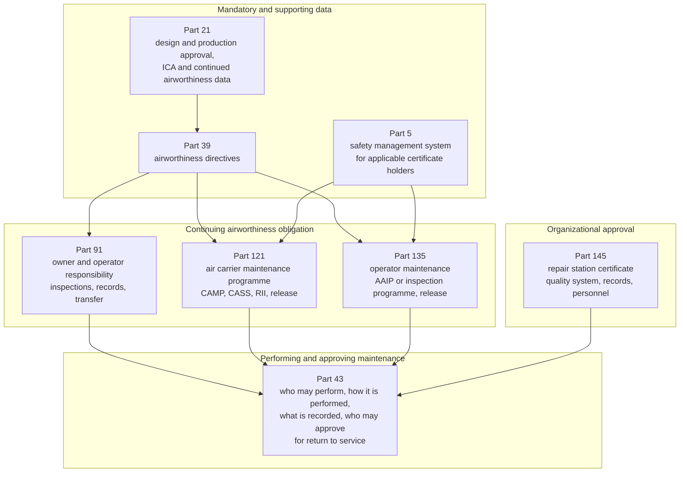
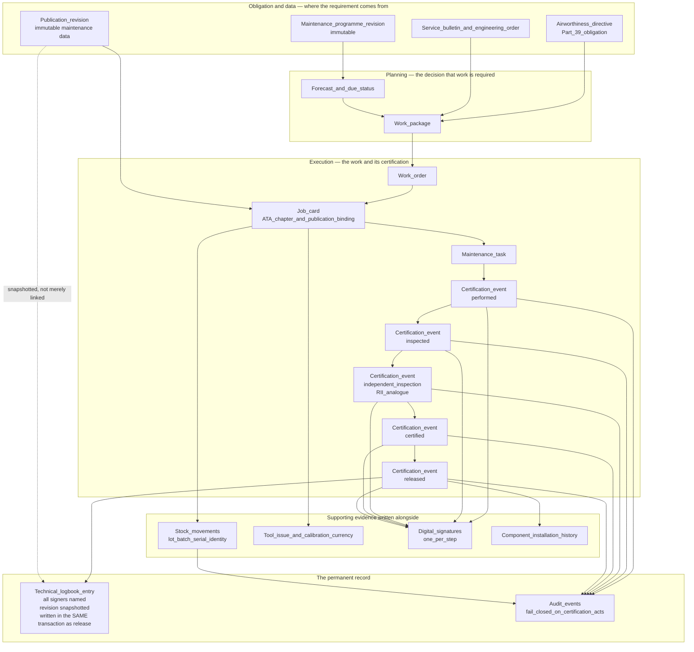

# FAA — Conceptual Mapping of Mercury Capability to United States Regulatory Concepts

| Field | Value |
|-------|-------|
| Document | FAA conceptual mapping — records, certification, return-to-service, and oversight concepts |
| Product | Mercury Aviation Enterprise Operating System (AEOS) |
| Organization | Mercury Technologies |
| Layer | Regulations — descriptive mapping of platform capability to framework concepts |
| Audience | Quality managers, chief inspectors, directors of maintenance, repair station accountable managers, compliance teams, enterprise architects, domain consultants |
| Status | Living baseline |
| Posture | **Descriptive and advisory. Mercury holds no FAA certificate, approval, acceptance, delegation, or designation of any kind.** |
| Companion documents | [Transport Canada](Transport_Canada.md) · [EASA](EASA.md) · [ICAO](ICAO.md) |
| Upstream authority | [Authority domain](../03_Business/Authority.md) · [SECURITY.md](../../SECURITY.md) · [Blueprint README](../../README.md) |

---

## 1. Scope

### 1.1 In scope

This document maps **Mercury platform capability** to the **concepts** that appear in the United States civil aviation maintenance framework: maintenance records, attribution of maintenance to authorized persons, approval for return to service, airworthiness release, required inspection, continuing airworthiness data, quality system records, and the evidence an inspector or auditor asks to see.

It is written for two readers:

| Reader | What they get from this document |
|--------|----------------------------------|
| A **customer's quality or compliance function** | A precise statement of which of their record-keeping and evidence processes Mercury supports, which it supports only partially, and which remain entirely theirs |
| A **Mercury architect or consultant** | The vocabulary bridge between Part 43/91/121/135/145 concepts and Mercury's domain model, so that design conversations do not drift into claims the platform cannot support |

### 1.2 Out of scope

| Concern | Authoritative location |
|---------|------------------------|
| Mercury's regulatory standing and non-claims | [Authority §1.3](../03_Business/Authority.md#13-what-mercury-does-not-claim) · [SECURITY.md §8](../../SECURITY.md#8-what-mercury-does-not-claim) |
| Audit record structure, fail-closed policy, retention behaviour | [Audit](../06_Security/Audit.md) |
| Signature construction, certification chain enforcement, cryptographic limits | [Digital Signatures](../06_Security/Digital_Signatures.md) |
| Traceability edges and the Digital Aircraft Passport | [Digital Thread](../04_Data/Digital_Thread.md) |
| Continuing airworthiness management capability | [CAMO](../03_Business/CAMO.md) |
| Hangar and shop execution capability | [MRO](../03_Business/MRO.md) |
| Roles, permissions, segregation of duties | [RBAC](../06_Security/RBAC.md) |
| **Legal interpretation of any regulation** | Not provided anywhere in this repository. See §10 |

### 1.3 Honesty markers

The same markers used across the blueprint, applied here to *capability*, never to compliance:

| Marker | Meaning |
|--------|---------|
| **Implemented** | Present in the runtime today |
| **Partial** | Present for a subset of the described concept |
| **Planned** | Designed in the blueprint, not built |
| **Not modelled** | Absent, and not currently on a horizon |

There is deliberately **no marker meaning "compliant."** No row in this document can carry one, because compliance is a property of an organization's procedures, personnel, and conduct — never of a software feature.

### 1.4 How to read the regulatory citations

Citations in this document are **orientation pointers to the structure of the framework**, given so a reader can locate the concept being discussed. They are not quotations, not summaries with legal effect, and not current-text assertions.

| Principle | Consequence |
|-----------|-------------|
| The regulation text governs | Where this document and the Code of Federal Regulations differ, the CFR is correct and this document is wrong |
| Regulations and advisory material change | A citation valid at the time of writing may be amended, superseded, or renumbered. Verify against the current text before relying on it |
| Mercury does not interpret regulation for customers | Applicability, acceptability, and sufficiency are determined by the organization and its FAA office — not by Mercury, and not by this document |
| Advisory circulars are guidance | They describe means of compliance an operator may use. Mercury references them to orient design conversations, not to claim conformance to them |

---

## 2. Purpose

### 2.1 The question this document answers

Prospective customers ask a version of the same question in every evaluation: *"Is Mercury FAA-approved?"*

The honest answer is short, and it is the reason this document exists: **no, and no software is.** The FAA certificates and approves organizations, persons, products, and — in specific circumstances — an organization's *use* of a system as described in its accepted or approved manuals and procedures. It does not issue approvals to platform vendors, and a vendor claiming one is misrepresenting the framework.

What a customer actually needs to know is narrower and far more useful:

1. Which of the record and evidence obligations my organization carries can Mercury help me discharge, and how completely?
2. Where does Mercury stop, so that I know what my procedures, my people, and my exposition must still cover?
3. If an FAA inspector asks for evidence of a specific maintenance action, what can Mercury actually produce, and how fast?

Sections 4 through 8 answer those three questions in that order.

### 2.2 The design position underneath the mapping

Mercury's evidence posture is stated in full in [Authority §1.1](../03_Business/Authority.md#11-what-this-domain-exists-to-do) and holds for every framework in this documentation set: **evidence is a by-product of doing the work correctly, not an artefact assembled afterwards.**

That position is what makes a mapping document possible at all. A platform that stored certification as a status flag would have nothing to map — an inspector cannot examine a boolean. Mercury records certification as immutable signature and event records bound to a named person, an authority that was valid at that moment, and the specific immutable publication revision that governed the work. Those are the primitives that regulatory record concepts are built from, which is why they map cleanly.

### 2.3 What "conceptual mapping" means, precisely

| It means | It does not mean |
|----------|------------------|
| A Mercury capability produces data of the kind a regulatory concept concerns | That the data satisfies the requirement |
| The platform enforces a control analogous to one the framework expects | That the enforcement has been reviewed or accepted by the FAA |
| An organization can use a Mercury record as part of its evidence | That the record is, by itself, sufficient evidence |
| Mercury's model uses the same vocabulary as the framework | That Mercury's use of a term carries the term's regulatory meaning |

---

## 3. What Mercury is not

This section is binding on every commercial conversation, every product surface, and every downstream document that cites this one.

| Mercury does **not** hold, claim, or imply | The accurate position |
|--------------------------------------------|-----------------------|
| An **FAA Part 145 repair station certificate** | Part 145 certificates are issued to repair stations. Mercury is not a repair station and holds no certificate. A Mercury customer's repair station certificate is theirs, and Mercury's involvement does not extend, transfer, or support it as a matter of privilege |
| A **Supplemental Type Certificate (STC)**, TC, PMA, or any design approval | Mercury produces no aeronautical product or design data requiring approval, and holds no design approval of any kind |
| A **Technical Standard Order Authorization (TSOA)** | Mercury is not an article subject to a TSO and holds no TSOA |
| **Part 121 or Part 135 air carrier or operating certificate standing** | Operating certificates are held by air carriers and operators. Mercury holds none and cannot contribute to holding one |
| **ODA, DER, DAR, or any designation or delegation** | Mercury holds no designation, delegation, or authorization to act on the FAA's behalf, for any purpose |
| **FAA "approval" or "acceptance" of the platform, its records, or its electronic signatures** | No FAA office has approved, accepted, reviewed, or evaluated Mercury. Whether an organization's *use* of Mercury is acceptable within that organization's manuals and procedures is a determination for the organization and its FAA office |
| That using Mercury makes an organization **compliant** with Part 43, 91, 121, 135, or 145 | Compliance is a property of the organization. Mercury supports it and cannot confer it |
| That Mercury **determines airworthiness** or **approves return to service** | Both are acts of qualified, authorized persons. Mercury records, computes, and evidences their acts. It never performs them, and no automated Mercury function can produce a release. See [Digital Signatures §6.6](../06_Security/Digital_Signatures.md#66-what-release-does-not-do) |
| That Mercury's electronic signature is a **cryptographic** signature | It is a hash-attested attribution mechanism, not a certificate-backed PKI signature. Stated without softening in [Digital Signatures §8](../06_Security/Digital_Signatures.md#8-what-this-is-not--the-cryptographic-limit) |
| That Mercury's records are a **tamper-evident** archive | Immutability today rests on code discipline, not on database enforcement or hash chaining. See [Audit §6.4](../06_Security/Audit.md#64-honest-limitation--immutability-is-conventional-not-structural) |
| That Mercury **produces FAA forms** | Mercury does not generate FAA Form 337, FAA Form 8130-3, or FAA Form 8010-4 today. See §5.7 |
| That Mercury is approved for **military, defence, or safety-of-life** use | Not claimed. See [ROADMAP §8](../../ROADMAP.md#8-explicit-non-goals) |

**Why this is stated so bluntly.** Aviation software marketing routinely blurs "designed to support compliance with" into "compliant with." A buyer who repeats a vendor's overstatement to their FAA office is exposed in a way the vendor is not. Mercury's position is that the vendor carries the obligation to state its standing precisely, and any Mercury material that softens the table above is wrong and should be corrected against this document.

---

## 4. Regulatory context overview

### 4.1 The structural shape of the framework

The United States framework separates **the aircraft's continuing airworthiness obligation**, **the act of performing maintenance**, **the privilege of approving for return to service**, and **the organizational quality system** that governs how an approved organization does all three. Mercury's domain model happens to separate the same four things, which is why the mapping is direct rather than strained.



### 4.2 The parts a Mercury deployment most often touches

| Part | Subject | Why it appears in Mercury conversations |
|------|---------|-----------------------------------------|
| **Part 43** | Maintenance, preventive maintenance, rebuilding, and alteration — including performance rules, recording requirements, and who may approve for return to service | The core of the maintenance record and return-to-service concepts Mercury's execution and logbook capability concerns |
| **Part 91** | General operating and flight rules, including the owner or operator's continuing airworthiness responsibility, required inspections, maintenance records, and transfer of records with the aircraft | The general-aviation and corporate baseline, and the source of the record-retention and record-transfer concepts |
| **Part 121** | Domestic, flag, and supplemental operations — maintenance programme, continuing analysis and surveillance, required inspection items, airworthiness release, recording and record transfer | The air carrier case: programme-driven maintenance with an organizational quality loop and a formal release |
| **Part 135** | Commuter and on-demand operations — inspection programmes, maintenance recording, airworthiness release, required inspection personnel | The regional, charter, and on-demand case, structurally similar to Part 121 with different thresholds |
| **Part 145** | Repair stations — ratings, quality system, personnel authorization, records, reporting | The MRO case: the organizational approval a third-party maintenance provider holds |
| **Part 39** | Airworthiness directives | Mandatory continuing airworthiness action with a compliance obligation and an evidence trail |
| **Part 21** | Certification procedures, including instructions for continued airworthiness | The origin of the OEM data baseline that maintenance instructions resolve to |
| **Part 5** | Safety management systems for applicable certificate holders | The SMS-adjacent audit, reporting, and safety-data concepts in §5.8 |

### 4.3 Advisory guidance that orients design conversations

Advisory circulars are **means of compliance guidance**, not requirements. Mercury references the following because they shape what an operator's electronic recordkeeping conversation with the FAA looks like — not because Mercury conforms to them, and not because conformance to an AC is a thing a platform can hold.

| Advisory material | Subject | Why Mercury architects should know it exists |
|-------------------|---------|---------------------------------------------|
| **AC 43-9** series | Maintenance records | Orients what a maintenance record is expected to contain and how it is expected to be retained and made available |
| **AC 120-78** series | Acceptance and use of electronic signatures, electronic recordkeeping systems, and electronic manuals | The single most relevant guidance to any electronic-records platform. It orients the concepts an operator must address with its FAA office: unique attribution of a signature to one individual, intent to sign, access control, ability to detect alteration, retrievability and legibility for the retention period, and backup and recovery |
| **AC 120-16** series | Air carrier maintenance programmes | Orients the programme, task, and interval structure Mercury's planning domain models |
| **AC 120-17** series | Reliability programme methods | Orients the reliability and trend concepts Mercury's reliability capability serves |
| **AC 120-79** series | Developing and implementing a continuing analysis and surveillance system | Orients the CASS quality-loop concepts in §5.4 |
| **AC 120-92** series | Safety management systems for aviation service providers | Orients the SMS-adjacent concepts in §5.8 |
| **FAA Order 8900.1 (FSIMS)** | Inspector handbook guidance | Orients *how oversight is actually conducted* — which is what determines whether evidence is resolvable in practice or only in principle |

**A caution that matters.** AC 120-78-series guidance is where an operator's electronic-records discussion with its FAA office actually happens. Mercury's honest contribution to that discussion is a precise statement of what the platform does and does not do — including the limitations in §7 — not a claim that the platform satisfies the guidance. An operator who presents Mercury as "AC 120-78 compliant" has been misinformed, and not by this document.

---

## 5. Mercury capability mapping

### 5.1 How to read every table in this section

Four columns, and the fourth is the one that matters most:

| Column | Meaning |
|--------|---------|
| **Regulatory concept** | The concept as it appears in the framework, in the framework's own vocabulary |
| **Mercury capability** | The platform capability that produces data of that kind, with its capability identifier where one exists |
| **Standing** | Implemented, Partial, Planned, or Not modelled — per §1.3 |
| **Remains the organization's responsibility** | What Mercury does **not** do. This column exists so that no reader can mistake a populated row for a discharged obligation |

Capability identifiers are drawn from the business domain registers: `AUTH-*` from [Authority §2.1](../03_Business/Authority.md#21-capability-register), `MRO-*` from [MRO §2.1](../03_Business/MRO.md#21-capability-register), `CAMO-*` from [CAMO](../03_Business/CAMO.md).

### 5.2 Part 43 — recording of maintenance and approval for return to service

| Regulatory concept | Mercury capability | Standing | Remains the organization's responsibility |
|--------------------|--------------------|----------|-------------------------------------------|
| A record entry describing the work performed | Job card and maintenance task with description, ATA chapter, and work performed evidence (MRO-C3, MRO-C4) | Implemented | That the description is accurate, complete, and in the form the organization's procedures require |
| The date the work was completed | Certification event timestamps in UTC, recorded at the moment of the act | Implemented | Time-zone and local-date presentation conventions in the organization's records policy |
| The name and signature of the person approving the work | Digital signature bound to a named employee whose authority was verified as active and unexpired at the moment of signing (MRO-C8, AUTH-C3) | Implemented | That the person holds the certificate, rating, or authorization the framework requires — Mercury records the authority the organization entered, it does not verify a certificate with the FAA |
| The certificate type and number of the approving person | Personnel qualification and authorization records with type, reference, and validity dates (AUTH-C10) | Implemented | Accuracy and currency of the qualification data entered, and the organization's process for verifying it against the actual certificate |
| Statement of approval for return to service | Technical logbook entry created atomically with the release signature, naming every signer (MRO-C9, AUTH-C4) | Implemented | Whether the entry's wording and content satisfy the applicable rule and the organization's procedures. Mercury's logbook entry is a **record of a release act**, not a form of approval issued by Mercury |
| Reference to the data used — manual, revision, and section | Publication revision binding enforced at release: a live publication, a matching immutable revision, and an ATA chapter are all required (MRO-C10, AUTH-C7) | Implemented | Currency and correctness of the publication library, and that the data used is FAA-acceptable data for the work performed |
| Records of inspections, including inspection findings and status | Inspection certification step with distinct-signer enforcement; findings raised as non-routine work | Partial — inspection recording Implemented; non-routine card generation is **Planned** (MRO-C24) | The inspection programme itself, its scope and detail, and disposition of findings |
| Recording of major repairs and major alterations | Task, logbook, and component history records exist; **the FAA form is not produced** | Not modelled — see §5.7 | Preparation, execution, and disposition of FAA Form 337, and retention of the approved data |
| Correction of a record entry | Append-only logbook amendment: corrections create a new record and the original is never overwritten (AUTH-C5) | Implemented | The organization's procedure governing when and how a correction is made, and by whom |

**The most important row is the fifth.** Mercury does not approve anything for return to service. An authorized person does, and Mercury makes that act evidentiary: who signed, under what authority, verified how, at what moment, against which immutable revision, with which prior steps complete, and with a fail-closed audit record committed in the same transaction. The distinction between *recording a release* and *issuing a release* is the whole of Mercury's position under Part 43.

### 5.3 Part 91 — owner and operator continuing airworthiness

| Regulatory concept | Mercury capability | Standing | Remains the organization's responsibility |
|--------------------|--------------------|----------|-------------------------------------------|
| Owner or operator responsibility for maintaining the aircraft in an airworthy condition | Fleet registry, aircraft status, maintenance programme, and forecast across the fleet (CAMO capability set) | Implemented | The responsibility itself, which is not delegable to a platform |
| Required inspections at prescribed intervals | Maintenance programme, check definitions, intervals, thresholds, and forecast over 30, 90, 180, and 365 days | Implemented | Selecting and maintaining the correct inspection programme for the aircraft and its operation |
| Total time in service of the airframe, engines, propellers, and rotors | Aircraft utilization counters and component life accumulation | Implemented — **current counters only; no utilization history table** | Accuracy of reported utilization, and reconciliation against operational sources |
| Current status of life-limited parts | Serialized component life, applicable limits, and remaining hours, cycles, and calendar due | Implemented — maintained on write, with **no reconciliation job** | Verifying life data on receipt of a part, and reconciling after a records discrepancy |
| Time since last overhaul of items requiring overhaul | Component TSO and CSO tracking against catalogue and unit-level limits | Implemented | Overhaul policy definition and the correctness of imported historical life |
| Current inspection status of the aircraft | Check status, next due, and forecast; deferred defect position | Implemented | The airworthiness determination itself |
| Current status of applicable airworthiness directives | AD register with per-revision compliance position and linked work (AUTH- and CAMO-level) | Implemented — **structured compliance state is Partial**; see [Authority §3.1](../03_Business/Authority.md#31-entity-register) | AD applicability determination, method-of-compliance selection, and the compliance decision |
| Copies of forms for major alterations | Task, logbook, and component records exist; the form is not produced | Not modelled | The forms, their retention, and their transfer |
| Retention of records for the required period | Retention configuration and durable storage of append-only evidence | **Partial** — retention is enforced as a **query filter**, not a deletion lifecycle. See [Audit §7.2](../06_Security/Audit.md#72-the-retention-window-is-a-query-filter) | Archival, deletion where required, and satisfying the actual retention period. Documented as an operator responsibility in [SECURITY.md §10](../../SECURITY.md#10-customer-and-operator-responsibilities) |
| Transfer of records with the aircraft on sale | Digital Aircraft Passport as a **traversal**, not a single export | **Partial** — passport is assembled across endpoints; one-command evidence pack export is **Planned** (AUTH-C14). See [Digital Thread §7.4](../04_Data/Digital_Thread.md#74-implementation-status--stated-plainly) | Executing the transfer, and satisfying the receiving party and the FAA that the records are complete |
| Inoperative instruments and equipment, and MEL operation | MEL items and deferred defects with dispatch category and expiry control | Implemented | MEL approval, dispatch decisions, and operational control |

### 5.4 Part 121 — air carrier maintenance programme, quality loop, and release

| Regulatory concept | Mercury capability | Standing | Remains the organization's responsibility |
|--------------------|--------------------|----------|-------------------------------------------|
| Continuous airworthiness maintenance programme structure — tasks, intervals, escalations | Maintenance programme with immutable approved revisions, MPD task library, check definitions (AUTH-C7 revision lineage) | Implemented | The programme's content, its approval by the FAA, and its revision control procedure |
| Programme revision control, so historical work resolves to the standard in force | Immutable programme revisions; historical work resolves to the revision that governed it | Implemented | Submitting and obtaining approval for revisions, and operating to the approved revision |
| **Required Inspection Items (RII)** — designated items requiring inspection by an authorized person other than the performer | Critical task policy designating tasks requiring independent inspection (MRO-C7), with three enforced distinct-signer separations (MRO-C6) | Implemented | Designating which items are RII, authorizing RII personnel, and the training and currency behind that authorization |
| RII performed by a person who did not perform the work | Distinct-signer enforcement in the domain layer, under a row lock, unconfigurable and unavailable to an administrator | Implemented — see [Digital Signatures §5](../06_Security/Digital_Signatures.md#5-double-inspection) | Ensuring the RII authorization is granted deliberately, to named individuals, for named scopes |
| **Airworthiness release or aircraft log entry** after maintenance | Release certification step producing an atomic technical logbook entry naming all signers, ATA chapter, publication, and revision | Implemented | The release act, its wording, and its issue by an authorized person. Mercury records; the person releases |
| **Continuing Analysis and Surveillance System (CASS)** — surveillance of the programme's performance and its effectiveness | Execution reporting, reliability trend capability, and the audit trail as the surveillance data source; **finding and corrective action management is Planned** (AUTH-C15), **audit programme management is Planned** (AUTH-C16) | **Partial** | The CASS itself: its procedures, its analysis, its corrective action decisions, and its acceptance by the FAA |
| Maintenance manual content requirements | Publication library with immutable revisions and controlled distribution | Implemented — as a **library capability**. Mercury does not author or control the content of an operator's manual | Authoring, revising, and obtaining acceptance of the manual, and ensuring personnel use the current revision |
| Authority to perform and approve maintenance, including by contracted organizations | Personnel authorizations with validity; multi-organization tenancy with isolation | Partial — **cross-organization sharing construct is absent**; see [Digital Thread §7.3](../04_Data/Digital_Thread.md#73-who-consumes-the-passport-and-for-what) | Contracting, vendor audit, and the operator's oversight of contract maintenance |
| Maintenance recording requirements, including who performed and who approved | Certification event chain plus signature records plus fail-closed audit (AUTH-C2, AUTH-C3, AUTH-C11) | Implemented | Sufficiency of the record set under the operator's accepted procedures |
| Transfer of maintenance records | Passport traversal; evidence pack export **Planned** | Partial | The transfer act and its completeness |
| Mechanical reliability and service difficulty reporting | Fault codes, incident records, and audit trail; **structured occurrence capture and export is Planned** (AUTH-C20) | **Partial** | Determining reportability, preparing the report, and submitting it within the required period |

### 5.5 Part 135 — commuter and on-demand operator concepts

Part 135 differs from Part 121 in thresholds and programme options rather than in the shape of the evidence. The mapping therefore differs in emphasis, not in structure.

| Regulatory concept | Mercury capability | Standing | Remains the organization's responsibility |
|--------------------|--------------------|----------|-------------------------------------------|
| Inspection programme selection — manufacturer's programme, an approved aircraft inspection programme (AAIP), or a programme under Part 91 as applicable | Maintenance programme entity supporting multiple programme structures per aircraft, with immutable revisions | Implemented | Selecting the programme, obtaining approval where required, and operating to it |
| Approved Aircraft Inspection Programme content and revision | Programme, task, interval, and revision model | Implemented | Programme authorship, approval, and revision submission |
| Airworthiness release or aircraft log entry | Release certification step with atomic logbook entry | Implemented | The release act by an authorized person |
| Required inspection personnel and the independence of that inspection | Independent inspection authorization as a **specific** authorization, not inherited from seniority, plus distinct-signer enforcement | Implemented — see [Digital Signatures §5.3](../06_Security/Digital_Signatures.md#53-the-authorization-is-specific-not-inherited) | Designating, training, and authorizing required inspection personnel |
| Maintenance recording requirements | Certification chain, logbook, component history, audit trail | Implemented | Sufficiency under the operator's manual |
| Maintenance training programme records | Personnel qualification records with type and validity | Partial — **qualification records Implemented; training programme delivery and curriculum tracking are Not modelled** | The training programme, its content, its delivery, and its records |
| Service difficulty and mechanical interruption reporting | Fault codes and incident records; structured occurrence export **Planned** | **Partial** | Reportability determination and submission |
| Contract maintenance oversight | Vendor records, purchase orders, receiving inspection, and tool and material traceability | Partial | The oversight programme itself, and vendor approval |
| Weight and balance, and equipment list currency | Aircraft empty weight and configuration records | Partial — configuration Implemented; **weight and balance computation is Not modelled** | Weight and balance control and its currency |

### 5.6 Part 145 — repair station quality system and records

| Regulatory concept | Mercury capability | Standing | Remains the organization's responsibility |
|--------------------|--------------------|----------|-------------------------------------------|
| Repair station quality system — inspection procedures, in-process and final inspection | Certification chain with performed, inspected, independent inspection, and certification steps enforced **in order** (MRO-C5) | Implemented | The quality system, its manual, its acceptance, and its operation |
| Personnel authorized to approve for return to service, and the roster of such personnel | Personnel authorization records with validity dates, and permission-gated release capability | Implemented | Authorizing personnel, maintaining the roster in the form the framework requires, and notifying changes |
| Records of the personnel who perform and approve work, retained for the required period | Signature and certification event records, immutable, with fail-closed audit | Implemented | Retention against the applicable period; Mercury's retention is a read filter, not a lifecycle |
| Maintenance data and its currency at the point of use | Publication library with immutable revisions; release blocked without a matching live publication revision | Implemented | Obtaining current, acceptable data and controlling its distribution |
| Housing, facilities, equipment, materials, and tooling adequacy | Tool crib control with calibration currency and lost-tool reporting (MRO-C15); warehouse and stock ledger (MRO-C14) | Implemented | Facility and capability adequacy, and the ratings held |
| Parts and material traceability, including receiving inspection and acceptance | Append-only stock movement ledger (AUTH-C9), receipts with receiving inspection, vendor records, lot and serial identity | Implemented | Acceptance criteria, suspected unapproved parts control, and the receiving inspection decision |
| Segregation of unserviceable components | Stock states and movement ledger | Partial — **states Implemented; a dedicated quarantine workflow is Not modelled** | Physical segregation and its control |
| Records of work performed, retained and made available to the FAA | Task audit trail endpoint returning the full certification and audit history in one call (AUTH-C6) | Implemented | Making records available, and the retention obligation itself |
| Contract maintenance to another organization, and its listing | Vendor records and purchase orders | Partial — **no cross-organization work transfer construct** | Contracting, listing, and oversight |
| Internal audit of the quality system, findings, and corrective action | **Finding and corrective action management (AUTH-C15) and audit programme management (AUTH-C16) are Planned**; the audit trail and evidence records exist today | **Planned** | The internal audit programme in full |
| Reporting of failures, malfunctions, and defects | Fault codes and incidents; structured occurrence capture **Planned** | **Partial** | Reportability and submission |

### 5.7 FAA forms — stated plainly because it is a common assumption

| Form | Purpose | Mercury standing |
|------|---------|------------------|
| **FAA Form 337** — Major Repair and Alteration | Records a major repair or major alteration and its approved data | **Not modelled.** Mercury records the task, the release, the affected component, the material consumed, and the publication revision cited. It does not generate, populate, or transmit Form 337 |
| **FAA Form 8130-3** — Authorized Release Certificate, Airworthiness Approval Tag | Airworthiness approval for a part or component release | **Not modelled.** Mercury records receipt, acceptance, and movement of parts, and can reference a certificate as attachment metadata. It does not issue or produce 8130-3, and no Mercury record is an airworthiness approval tag |
| **FAA Form 8010-4** — Malfunction or Defect Report | Service difficulty reporting | **Not modelled.** Structured occurrence capture and export is **Planned** (AUTH-C20) |
| **FAA Form 8110-3, 8100-9, and other approval forms** | Design and organizational approval instruments | **Out of scope entirely.** Mercury has no role in design approval |

**Why this table exists.** "Does it do 337s?" is asked in most repair station evaluations, and the answer today is no. Stating it here prevents the far worse outcome of a customer discovering it during implementation — or, worse, an inspector discovering that a process was assumed to be covered.

### 5.8 Part 5 and SMS-adjacent concepts

Mercury is **not** a safety management system. It holds safety-relevant data, and the distinction is worth stating carefully because "SMS module" is a common vendor overclaim.

| SMS-adjacent concept | Mercury capability | Standing | Remains the organization's responsibility |
|----------------------|--------------------|----------|-------------------------------------------|
| Safety policy, accountable executive, and defined accountabilities | Organization, site, role, and membership model; accountable persons recorded as personnel with authorizations | Partial — **organizational structure Implemented; the SMS policy framework is Not modelled** | The policy, the accountabilities, and the SMS itself |
| Hazard identification from operational and maintenance data | Fault codes, incident records, deferred defect history, reliability trend capability, and the full audit trail as a data source | **Partial** — the data exists; hazard identification is not a platform function | Hazard identification, analysis, and risk assessment |
| Safety risk assessment and mitigation records | Approval workflow and engineering order records can carry a documented decision | Partial | Risk assessment methodology, decisions, and their acceptability |
| Safety assurance — measurement, internal audit, management of change | Execution reporting, reliability trends, immutable evidence; **audit programme and finding management are Planned** | **Partial** | The safety assurance function |
| Internal safety reporting, including confidential reporting | **Not modelled.** Occurrence capture is **Planned** (AUTH-C20), and a confidential reporting channel is a distinct requirement Mercury does not address | Not modelled | The reporting scheme, its confidentiality protections, and its just-culture framework |
| SMS recordkeeping | Append-only audit and evidence records with configurable retention | Partial | SMS record content, retention, and availability |
| Safety promotion, training, and communication | Personnel qualification records | Partial | Training, communication, and promotion in full |

**The honest summary of Mercury's SMS position:** Mercury is a high-quality **source of maintenance safety data** and an **audit-evidence spine**. It is not an SMS, does not implement the SMS framework, and must never be presented as satisfying an SMS requirement. What it does offer an SMS is unusually good: attributable, immutable, queryable operational and maintenance history that a safety function can analyse without first reconstructing it.

---

## 6. Evidence flow

### 6.1 From planned work to resolvable release evidence



The property being asserted is **resolvability in both directions**. From an obligation, an inspector reaches the work that discharged it. From a release, an inspector reaches the task, every certification step, every signature, the signer and the authority that signer held **at that moment**, the immutable revision in force, the components affected, the material consumed with its lot or serial identity, and the tools used with their calibration currency — without leaving the platform and without reconstruction.

### 6.2 An inspector's request, traced

```mermaid
sequenceDiagram
    autonumber
    participant FAA as FAA_inspector
    participant QA as Chief_inspector_or_QA
    participant MER as Mercury_platform
    participant EXE as Execution
    participant PERS as Personnel
    participant PUB as Publications
    participant LOG as Logistics
    participant AUD as Audit

    FAA->>QA: Show the evidence for this maintenance action
    QA->>MER: Retrieve the technical logbook entry
    MER->>EXE: Resolve the originating task and its certification chain
    EXE-->>MER: Ordered steps with references to their signatures
    MER->>PERS: Resolve each signature to its signer
    PERS-->>MER: Employee, qualification, and authorization validity at the signing moment
    MER->>PUB: Resolve the cited publication revision
    PUB-->>MER: Immutable revision number, date, effective date
    MER->>LOG: Resolve material consumed and tools used
    LOG-->>MER: Movements with lot or serial identity; calibration currency
    MER->>AUD: Resolve the audit events for every step
    AUD-->>MER: Actor, role, organization, site, outcome, origin
    MER-->>QA: One resolved evidence set
    QA-->>FAA: Present the evidence, with the organization's explanation
    QA->>AUD: The retrieval itself is audited
    Note over QA,FAA: The organization presents and explains.<br/>Mercury does not interact with the authority.
```

The final note is not a formality. **Mercury has no interface to the FAA, no channel to any FAA system, and no role in the oversight conversation.** The organization holds the relationship; Mercury holds the records.

---

## 7. Security and records considerations

### 7.1 The record properties that regulatory concepts actually depend on

| Property a records framework cares about | Mercury position | Standing |
|------------------------------------------|------------------|----------|
| **Attribution to one identified individual** | A signature names an employee, requires that employee to be bound to the authenticated user, and requires a step-up credential at the moment of signing | Implemented — with the administrator override named as debt in [Digital Signatures §8.5](../06_Security/Digital_Signatures.md#85-additional-named-limitations) |
| **Authority current at the time of the act** | Expiry is evaluated against the signing moment, never against an assignment date | Implemented |
| **Intent to sign** | A step-up credential is required at signing; a live session is not sufficient | Implemented |
| **Protection against unauthorized alteration** | No code path updates or deletes a signature, certification event, logbook entry, component history record, or stock movement | **Partial — conventional, not structural.** Database-enforced append-only and hash chaining are **Planned**. See [Audit §6.4](../06_Security/Audit.md#64-honest-limitation--immutability-is-conventional-not-structural) |
| **Detection of alteration** | **Not achieved today.** A per-record digest proves a record was not edited only if the digest was not recomputed by the same privileged actor | **Planned** — tamper-evident chaining with external anchoring is the highest-value integrity upgrade available |
| **Retrievability and legibility for the retention period** | Scoped, retention-aware query; per-object history; task audit trail in one call | Implemented for retrieval; **evidence pack export is Planned** |
| **Retention for the required period** | Retention configuration filters reads; records are not deleted | **Partial** — retention is a read filter, not a lifecycle. Archival and deletion are operator responsibilities |
| **Backup, recovery, and durability of the record** | Durable relational storage subject to the operator's backup regime; RPO 0 for evidence is the aspirational target | **Partial** — the current guarantee is the operator's, not the platform's |
| **Access control appropriate to the record's sensitivity** | Permission-gated, organization-scoped, site-scoped access with audited denials | Implemented — runtime persona RBAC hardening is **Planned** |
| **A record of who read sensitive records** | Mutating actions are audited; **sensitive-read auditing is Planned** | **Planned** |
| **Ability to produce a human-readable copy** | Logbook and task views are human-readable; formal export is **Planned** | Partial |

### 7.2 The three limitations a customer must carry into an FAA conversation

An operator describing Mercury to its FAA office should describe these accurately, because an overstatement here is the kind that fails an audit rather than merely embarrasses a vendor.

1. **Signatures are hash-attested, not certificate-backed.** Mercury verifies the signer, records the act immutably, and hashes a canonical payload. There is no private key under the signer's sole control, no certificate chain, no revocation checking, and no trusted timestamp. PKI and smart-card methods are **refused rather than simulated** — see [Digital Signatures §8.3](../06_Security/Digital_Signatures.md#83-pki-methods-are-refused-not-simulated) — precisely so that no record overstates its own strength.
2. **Immutability is enforced by code discipline, not by the database.** Mercury's records resist tampering *through the application*. They do not currently prove to a third party that no one with database credentials altered them.
3. **Retention hides rather than deletes.** The configured retention window filters queries. An organization with a deletion obligation must implement archival and deletion at the data tier.

### 7.3 Personnel data in maintenance records

Maintenance evidence is inherently personal data: signer identities, certificate references, qualification types, and validity dates. Mercury's position is permission-gated, organization-scoped, audited access, with field-level encryption **Planned**. The organization remains responsible for its own privacy obligations and for the lawful basis on which it processes personnel data — a point that becomes sharper for operators with both US and European exposure. See [EASA §7.4](EASA.md#74-part-is-and-data-protection-adjacency).

---

## 8. Scalability of evidence

### 8.1 Why evidence scalability is a regulatory concern, not only an engineering one

A record that exists but cannot be retrieved within the time an inspection allows is functionally absent. Evidence scalability is therefore part of the mapping rather than an appendix to it: it determines whether "oversight-ready by construction" survives a fleet of four hundred aircraft and fifteen years of history.

### 8.2 What grows, and what it costs

| Evidence class | Growth driver | Scaling characteristic |
|----------------|---------------|------------------------|
| Certification events and signatures | Maintenance activity | Steady rather than bursty; write cost is one short transaction per act, independent of platform size |
| Technical logbook entries | Releases | One per release; the densest and most-queried evidence record |
| Component installation history | Installs, removals, transfers, releases | Append-only, and the basis of point-in-time configuration answers |
| Stock movements | Material activity | Among the fastest-growing tables in the platform |
| Audit events | Every mutating action | The fastest-growing table; also the one an investigation traverses |
| Publication revisions | Data updates from the OEM baseline | Slow growth, high fan-in — every release resolves to one |

### 8.3 Levers, in dependency order

| # | Lever | What it unlocks for evidence at scale |
|---|-------|---------------------------------------|
| 1 | Time partitioning of audit and evidence tables | Bounded query cost as history grows, and cheap archival by detaching a partition |
| 2 | Database-enforced append-only | Immutability becomes structural, which also simplifies partition management |
| 3 | Tamper-evident hash chaining with external anchoring | Alteration of an interior record becomes detectable by a third party rather than only resisted |
| 4 | Object storage with integrity verification | Certificates, photographs, and document content become durable and integrity-checked rather than referenced |
| 5 | Evidence pack export with resolvable references | An audit-preparation project becomes a single command |
| 6 | Aircraft passport read model | A lessor, buyer, or oversight view served from one projection instead of a multi-domain traversal |
| 7 | Read replicas for evidence and audit reads | Inspection and reporting load off the operational primary |
| 8 | Tiered storage with an immutable archive | Long-term retention at sustainable cost, and the basis of a real retention lifecycle |

Ordering matters. Item 3 assumes a total record order, which interacts with item 1's partitioning — a constraint that is cheap to notice now and expensive to discover during a migration. This is stated identically in [Audit §11.2](../06_Security/Audit.md#112-scaling-levers-in-dependency-order).

### 8.4 What must survive any scaling change

- Fail-closed audit on certification acts. Asynchrony must never enter a fail-closed write.
- Atomicity of release, technical logbook entry, and component history.
- The three enforced distinct-signer separations, and the row locking that makes them correct under concurrency.
- Immutable publication revision binding, with the revision detail snapshotted into the logbook entry.
- Organization and site scoping on every read.
- Provenance honesty, including the `simulated` marker that prevents demonstration data from ever reading as an airworthiness fact.

---

## 9. Future enhancements

| # | Enhancement | Value in an FAA-framework context | Depends on |
|---|-------------|-----------------------------------|------------|
| 1 | **Evidence pack export** with resolvable publication revision references (AUTH-C14) | An inspector's request becomes a bundle rather than a project; record transfer on sale becomes a command | Publication revision resolution, already present. [ROADMAP §4](../../ROADMAP.md#4-near-term-horizon--assurance-and-hardening-additive) |
| 2 | **PKI and smart-card signature providers** | Moves attribution from hash attestation toward certificate-backed non-repudiation, which is the substance of the electronic-signature conversation an operator has with its FAA office | Key management, certificate lifecycle, revocation checking, timestamp authority |
| 3 | **Tamper-evident chaining with external anchoring** | Changes the claim from "we do not alter records" to "alteration is detectable" | Database-enforced append-only, plus a sequencing decision |
| 4 | **Database-enforced append-only** on audit and evidence tables | Immutability becomes structural rather than conventional | Migration plus a database permission model |
| 5 | **Retention as a true lifecycle** — hot, warm, immutable archive, and deletion | Addresses retention and deletion obligations that a read filter cannot | Partitioning and archive tiering |
| 6 | **Finding and corrective action management** (AUTH-C15) | Gives the CASS and repair station internal-audit loops a home inside the evidence spine instead of alongside it | Quality domain expansion |
| 7 | **Audit programme management** (AUTH-C16) | Scheduled internal audit with evidence, closing the quality management loop | Quality domain expansion |
| 8 | **Structured occurrence capture and export** (AUTH-C20) | Supports the organization's service difficulty and malfunction reporting obligations with structured data instead of free text | Quality domain expansion |
| 9 | **Structured regulatory requirement mapping** (AUTH-C19) | Turns this document from prose into queryable links between a framework concept and the evidence records supporting it | Evidence pack export, plus a requirement register |
| 10 | **Read-scoped, time-boxed oversight access** (AUTH-C17) | Lets an organization show evidence to an inspector or auditor without granting tenancy or any operational capability | Cross-organization sharing construct |
| 11 | **Authority portal — described, not committed** | A future scoped, read-only, audited surface through which an organization could grant an oversight reviewer direct access to a defined evidence scope. See §9.1 | Item 10, plus items 1, 3, and 5 |
| 12 | **Point-in-time authority projection** | Answers "what authority did this person hold on that date" without reconstruction — the question an inspector asks about a signature from four years ago | Personnel and audit projections |
| 13 | **Content-level hash binding of publication revisions** | A release could prove the exact document content the signer worked to, not only its identity | Managed object store |
| 14 | **Form generation support** — 337, 8130-3, 8010-4 data preparation | Would let the platform populate form data from records the platform already holds, with the organization issuing the form | An explicit ADR, and a decision about liability boundaries |

### 9.1 The authority portal concept — stated carefully

The **authority portal** is the most frequently requested future capability in oversight conversations and the most easily overstated, so its design constraints are recorded here as binding intent rather than as a feature promise.

```mermaid
flowchart LR
    Request["Reviewer_requests_access"] --> Org["Organization_decides"]
    Org -->|"Decline"| Rec["Declined_and_recorded"]
    Org -->|"Grant"| Grant["Create_oversight_grant"]
    Grant --> Scope["Scope: aircraft, package,<br/>date range, evidence class"]
    Scope --> Period["Explicit validity period"]
    Period --> RO["READ_ONLY_projection<br/>no write surface exists"]
    RO --> Read["Reviewer reads evidence"]
    Read --> Audit["Every access audited<br/>and visible to the organization"]
    Audit --> End{"Revoked_or_expired"}
    End -->|"Revoked"| Now["Effective on the next request"]
    End -->|"Expired"| Done["Access ends"]
    Now --> Done
    Done --> Keep["Grant and access history retained"]
```



| Constraint | Why it is binding |
|------------|-------------------|
| **The organization grants; Mercury does not** | Mercury will never establish a channel to an authority on a customer's behalf. The relationship is the organization's |
| **No standing access** | Every grant is explicit, scoped, and time-boxed. There is no permanent authority login |
| **Read-only, structurally** | A grant confers no ability to create, approve, sign, release, defer, or modify anything. This is enforced by the absence of a write surface, not by permission configuration |
| **Audited on both sides** | The organization sees every access made under the grant. This protects the organization as much as the platform |
| **Not an approval mechanism** | A portal through which an inspector reads evidence is not an authority endorsement of the platform, and must never be described as one |

**And the disclaimer that must travel with the concept:** the existence of an oversight portal would not make Mercury FAA-approved, accepted, or endorsed. It would make an organization's evidence easier to show. That is all it would do, and it is worth building for exactly that reason.

---

## 10. Disclaimers

1. **No FAA approval, acceptance, certification, delegation, or designation.** Mercury Technologies holds none of these, has not applied for any, and does not claim any. No FAA office has reviewed, evaluated, or accepted the Mercury platform.
2. **This document is not legal or regulatory advice.** It is an engineering and product mapping document. It does not interpret regulation, determine applicability, or establish that any Mercury capability satisfies any requirement.
3. **Citations are orientation, not authority.** Part, section, and advisory circular references are given so a reader can locate a concept. The current text of the Code of Federal Regulations and current FAA guidance govern. Where this document and that text differ, this document is wrong.
4. **Compliance is the organization's, always.** Whether an organization's use of Mercury satisfies its record-keeping, certification, quality system, or reporting obligations is a determination for that organization and its FAA office — not for Mercury, and not for this document.
5. **Capability markers describe software, not compliance.** "Implemented" means the capability exists in the runtime. It never means a regulatory requirement is met.
6. **Named limitations are real.** Signatures are not certificate-backed; immutability is conventional rather than structural; retention is a read filter rather than a lifecycle; no FAA forms are produced. These are stated in §5.7, §7.1, and §7.2 and must not be omitted when Mercury capability is described to an operator or an authority.
7. **No representation about a third party's determination.** Nothing here predicts or promises how any FAA office, inspector, or auditor will assess an organization's processes, records, or use of Mercury.
8. **Mercury does not interact with the FAA.** There is no interface, data exchange, notification, or reporting channel between the platform and any FAA system. Every regulatory interaction is the organization's.
9. **This document is a living baseline.** It will change as capability changes and as frameworks change. A dated copy extracted from this repository may be stale; the repository is the source of truth.

---

## 11. Related documents

**Within the regulations set**
[Transport Canada](Transport_Canada.md) · [EASA](EASA.md) · [ICAO](ICAO.md)

**Business domains**
[Authority](../03_Business/Authority.md) · [CAMO](../03_Business/CAMO.md) · [MRO](../03_Business/MRO.md) · [Airline](../03_Business/Airline.md) · [OEM](../03_Business/OEM.md) · [Leasing](../03_Business/Leasing.md)

**Security and evidence**
[Audit](../06_Security/Audit.md) · [Digital Signatures](../06_Security/Digital_Signatures.md) · [RBAC](../06_Security/RBAC.md) · [Identity](../06_Security/Identity.md) · [SECURITY.md](../../SECURITY.md)

**Data and digital thread**
[Digital Thread](../04_Data/Digital_Thread.md) · [Data Model](../04_Data/Data_Model.md) · [Master Data](../04_Data/Master_Data.md)

**Architecture**
[Domain Architecture](../02_Architecture/Domain_Architecture.md) · [Enterprise Architecture](../02_Architecture/Enterprise_Architecture.md) · [System Context](../02_Architecture/System_Context.md) · [Technical Architecture](../02_Architecture/Technical_Architecture.md)

**Repository root**
[README](../../README.md) · [VISION](../../VISION.md) · [ROADMAP](../../ROADMAP.md)

---

*Mercury Technologies — One Digital Thread. One Digital Aircraft Passport. One Aviation Enterprise Operating System.*
